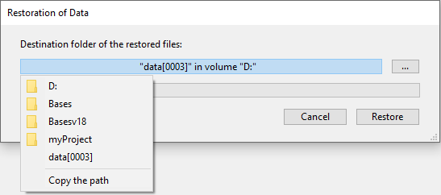

4D lhe permite restaurar conjuntos inteiros de dados de um banco de dados no caso de que se apresente um incidente, independentemente da causa do mesmo. Podem ocorrer dois tipos principais de incidentes:

- A parada inesperada do banco enquanto estiver em uso. Esse incidente pode ocorrer por causa de uma falha de energia, erro em um elemento do sistema, etc. Esse incidente pode ocorrer por causa de uma falha de energia, erro em um elemento do sistema, etc. This incident can occur because of a power outage, system element failure, etc. In this case, depending on the current state of the data cache at the moment of the incident, the restore of the database can require different operations:
  - Se a cache estiver vazia, o banco de dados abre normalmente. Quaisquer mudanças feitas no banco de dados foram registradas. Este caso não exige nenhuma operação particular
  - Se a cache conter operações, o arquivo de dados está intacto mas exige integrar o arquivo de histórico atual.
  - Se a cache estiver no processo de ser escrita, o arquivo de dados está provavelmente danificado. When restoring a backup and integrating the current log file in a encrypted database:

- A perda de um ou mais arquivos do banco de dados. This incident can occur because of defective sectors on the disk containing the database, a virus, manipulation error, etc. The last backup must be restored and then the current log file must be integrated. O último backup deve ser restaurado e o arquivo de histórico atual deve ser integrado. Para saber se um banco de dados foi danificado depois de um incidente, basta relançar o banco de dados com 4D. O programa realiza um autodiagnóstico e detalha as operações de restauração necessárias. Em modo automático, essas operações são realizadas diretamente sem precisar de ajuda da parte do usuário. Se usar uma estratégia de backup regulares, as ferramentas de restauração de 4D permite recuperar (na maioria dos casos) o banco de dados na mesma situação que estava antes do incidente.

> 4D pode lançar procedimentos automaticamente para recuperar os bancos de dados depois de um incidente. You can manually restore an archive of the current application using the **Restore** page. This page provides several options that can be used to control the restoration: Para mais informações, veja o parágrafo [Restauração Automatica ](settings.md#automatic-restore).  
> Se o incidente for resultado de uma operação inadequada realizadas nos dados (eliminação de um registro, por exemplo) pode tentar reparar o banco de dados usando a função "rollback" do arquivo de histórico. Essa função está disponível na página [Rollback](MSC/rollback.md) do MSC.

## Restaurar manualmente o backup (diálogo padrão)

Pode restaurar manualmente os conteúdos de um arquivo gerado pelo módulo de cópia de segurança. Uma restauração manual pode ser necessária, por exemplo, para restaurar os conteúdos completos de um arquivo (arquivos projetos e arquivos anexos) ou, para o propósito de realizar pesquisas entre os arquivos. A restauração manual pode também ser realizada junto com a integração do arquivo de histórico atual.

A restauração manual de backups pode ser realizada via a caixa de diálogo de Abertura de documento ou através da página [Restaurar](MSC/restore) do CSM. A restauração através do MSC oferece mais opções e permite pré-visualizar os conteúdos dos arquivos. Restoring via the MSC provides more options and allows the archive contents to be previewed.

Para restaurar um banco de dados manualmente via uma caixa de diálogo padrão:

1. **Content**: Contents of the backup file. Não é obrigatório que um banco de dados seja aberto. OR Execute the `RESTORE` command from a 4D method. Uma caixa de diálogo de abertura de arquivos vai aparecer.
2. Selecione um arquivo de backup (.4bk) ou um arquivo de backup de histórico (.4bl) para ser restaurado e clique **Abrir**. Aparece um diálogo que permite especificar o local onde os arquivos serão restaurados. Como padrão 4D restaura os arquivos em uma pasta chamada *Archivename* (sem extensão) que fica do lado do arquivo. Pode exibir a rota:

You can also click on the **Browse...** button found just under the area in order to open any other archive file from a different location.
3. The **Restore** button launches the manual restoration of the selected element(s). 4D extrai todos os arquivos de backup do local especificado. Se o arquivo de histórico atual ou um arquivo de histórico de backup com o mesmo número que o arquivo de cópia de segurança for armazenado na mesma pasta, 4D examina seus conteúdos. Se conter operações não presentes no arquivo de dados, o programa vai perguntar se deseja integrar essas operações. A integração é feita automaticamente se a opção **Integrar último arquivo de histórico...** for marcada (ver [Restauração automática](settings.md#automatic-restore)).

The **Integrate one or more log file(s) after restore** option allows you to integrate several data log files successively into an application. Se a restauração e integração forem realizadas corretamente, 4D exibe uma caixa de diálogo indicando que a operação foi feita com sucesso.
5. **Date and Time**: Date and time of backup.

A pasta de destino é mostrada. Durante a restauração, 4D coloca todos os arquivos de backup nessa pasta, independente da posição dos arquivos originais no disco quando o backup começou. Dessa forma seus arquivos serão mais fáceis de encontrar.

> Qualquer conteúdo relacionado aos arquivos de dados (arquivos e pasta `Settings` folder) são restauradas automaticamente em uma subpasta `Data` dentro da pasta destino.

## Restaurar manualmente a cópia de segurança (MSC)

Pode restaurar manualmente um arquivo do banco de dados atual utilizando a página [Restauração](MSC/restore.md) do Centro de Manutenção e Segurança (CMS).

## Integração manual do histórico

Se não tiver marcado a opção de integração automática de arquivo de histórico na página Restaurar do CSM (ver [Integração sucessiva de vários arquivos de histórico](MSC/restore.md#successive-intergration-of-several-data-log-files)), aparece uma caixa de diálogo de advertência durante a abertura do banco quando 4D advertir que o arquivo de histórico conter mais operações do que as que foram realizadas no banco de dados.

> Para que esse mecanismo funcione, 4D deve poder acessar o arquivo de histórico em seu local atual.

Pode escolher se quer ou não integrar o arquivo de histórico atual. Não integrar o arquivo de histórico atual permite evitar reproduzir erros feitos nos dados.
