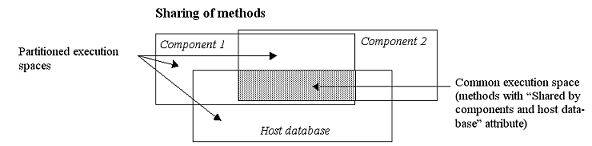

Um componente 4D é um conjunto de métodos e formulários 4D que representam uma ou mais funcionalidades que podem ser instaladas em diferentes aplicações. Por exemplo, você pode desenvolver um componente de e-mail 4D que gerencia todos os aspectos de envio, recebimento e armazenamento de e-mails em aplicativos 4D.

## Apresentação

### Definições

- **Projeto Matrix**: projeto 4D usado para desenvolver o componente. O projeto matriz é um projeto standard sem atributos específicos. Um projeto matricial forma um componente único.
- **Projeto host**: projeto no qual um componente é instalado e usado.
- **Componente**: projeto utilizado como matriz que pode ser compilado na pasta [`Componentes`](Project/architecture.md) da aplicação host e cujo conteúdo é usado na aplicação host.

### Princípios

Criar e instalar componentes 4D é realizado diretamente a partir de 4D. Basicamente, os componentes são gerenciados como [plug-ins](Concepts/plug-ins.md) conforme os seguintes princípios:

- Um componente é constituído por um ficheiro de projeto 4D clássico.
- Para instalar um componente, basta copiá-lo para a pasta [`Components` do projeto](Project/architecture.md). Pode usar pseudónimos ou atalhos.
- Um projeto pode ser tanto uma “matriz” quanto um “host,”, em outras palavras, um projeto utilizado como matriz pode usar um ou mais componentes. No entanto, um componente não pode utilizar ele próprio "subcomponentes".
- Um componente pode chamar a maioria dos elementos 4D: métodos projeto, formulários projeto, barras de menu, listas de opções e assim por diante. Não pode chamar métodos de bancos de dados e triggers.
- Não é possível utilizar tabelas standard ou ficheiros de dados em componentes 4D. Entretanto um componente não pode criar ou usar tabelas, campos e arquivos de dados usando mecanismos de bancos de dados externos. São bancos 4D independentes com as que se trabalha utilizando comandos SQL.
- Um projecto anfitrião executado em modo interpretado pode utilizar componentes interpretados ou compilados. Um projecto anfitrião executado em modo compilado não pode utilizar componentes interpretados. Por isso não pode ser usado em um componente.

## Escopo dos comandos de linguagem

Exceto pelos [Comandos não utilizáveis](#unusable-commands), um componente não pode usar qualquer comando da linguagem 4D.

Quando comandos são chamados de um componente, eles são executados no contexto do componente, exceto o comando `EXECUTE METHOD` ou `EXECUTE FORMULA` que usa o contexto do método especificado pelo comando. Observe também que os comandos de leitura do tema "Usuários e grupos" podem ser usados a partir de um componente, mas lerão os usuários e grupos do projeto host (um componente não tem seus próprios usuários e grupos).

Os comandos `SET DATABASE PARAMETER` e `Get database parameter` são uma exceção: seu alcance é global a aplicação. Quando esses comandos forem chamados de um componente, são aplicados ao projecto de aplicação local.

Além disso, medidas especificas foram criadas para os comandos `Structure file` e `Get 4D folder` quando utilizados no marco dos componentes.

O comando `COMPONENT LIST` pode ser utilizado para obter a lista de componentes que carrega o projecto local.

### Comandos não utilizáveis

Os comandos abaixo não são compatíveis para seu uso dentro de um componente porque modificam o arquivo de estrutura - que está aberto em apenas leitura. Sua execução em um componente irá gerar erro -10511, "O comando CommandName não pode ser chamado a partir de um componente”:

- `ON EVENT CALL`
- `Method called on event`
- `SET PICTURE TO LIBRARY`
- `REMOVE PICTURE FROM LIBRARY`
- `SAVE LIST`
- `ARRAY TO LIST`
- `EDIT FORM`
- `CREATE USER FORM`
- `DELETE USER FORM`
- `CHANGE PASSWORD`
- `EDIT ACCESS`
- `Set group properties`
- `Set user properties`
- `DELETE USER`
- `CHANGE LICENSES`
- `BLOB TO USERS`
- `SET PLUGIN ACCESS`

**Notas:**

- O comando `Current form table` devolve `Nil` quando chamado no contexto de um formulário projeto. Por isso não pode ser usado em um componente.
- Os comandos da linguagem de definição de dados SQL(`CREATE TABLE`, `DROP TABLE`, etc.) não podem ser usados no projeto do componente. Entretanto são compatíveis com bancos de dados externos (ver o comando SQL`CREATE DATABASE`).

## Partilhar os métodos projeto

Todos os métodos de projeto de um projeto utilizado como matriz são, por definição, incluídos no componente (o projeto é o componente), o que significa que eles podem ser chamados e executados pelo componente.

Por outro lado, por padrão, esses métodos projeto não estarão visíveis e não poderão ser chamados no projeto host. No projeto matrix, você deve designar explicitamente os métodos que você deseja compartilhar com o projeto host. Esses métodos projeto podem ser chamados no código do projeto host (mas eles não podem ser modificados no editor de métodos do projeto host). Esses métodos formam **pontos de entrada** no componente.

Por outro lado, por motivos de segurança, por padrão, um componente não pode executar métodos de projeto pertencentes ao projeto host. Em alguns casos, talvez seja necessário permitir que um componente acesse os métodos de projeto do seu projeto host. Para isso, você deve designar explicitamente quais métodos de projeto do projeto host você deseja tornar acessíveis aos componentes (nas propriedades do método, marque a caixa **Compartilhado por componentes e projeto host** ).



Dado que os métodos do projeto dos projetos host estão disponíveis para os componentes, você pode executar um método host dentro de um componente usando o comando `EXECUTE FORMULA` ou `EXECUTE METHOD`. Por exemplo:

```4d
// Método host
component_method("host_method_name")
```

```4d
// component_method
 C_TEXT($1)
 EXECUTE METHOD($1)
```

> Um banco de dados de host interpretado que contém componentes interpretados pode ser compilado ou verificado quanto à sintaxe se não chamar métodos do componente interpretado. Caso contrário, uma caixa de diálogo de aviso será exibida quando você tentar iniciar a compilação ou uma verificação de sintaxe, e não será possível executar a operação. Lembre-se de que um método interpretado pode chamar um método compilado, mas não o contrário, exceto pelo uso dos comandos `EXECUTE METHOD` e `EXECUTE FORMULA`.

## Passar variáveis

As variáveis locais, de processo e interprocessos não são compartilhadas entre componentes e projetos de host. A única maneira de modificar variáveis de componentes do projeto host e vice-versa é usando ponteiros.

Exemplo usando um array:

```4d
//No projeto hospedeiro:
     ARRAY INTEGER(MeuArray; 0)
     AMethod(->MeuArray)

//No componente, o método do projeto AMethod contém:
     APPENDA PARA ARRAY($1->;2)
```

Exemplos usando variáveis:

```4d
C_TEXT(myvariable)
component_method1(->myvariable)
```

```4d
C_POINTER($p)
$p:=component_method2(...)
```

Sem um ponteiro, um componente ainda pode acessar o valor de uma variável do banco de dados do host (mas não a própria variável) e vice-versa:

```4d
//No banco de dados host
C_TEXT($input_t)
$input_t:="DoSomething"
component_method($input_t)
// component_method gets "DoSome" in $1 (mas não na variável $input_t)
```

Quando você usa ponteiros para permitir que os componentes e o projeto host se comuniquem, é necessário levar em conta as seguintes especificidades:

- O comando `Get pointer` não retornará um ponteiro para uma variável do projeto host se for chamado de um componente e vice-versa.

- A arquitetura de componentes permite a coexistência, no mesmo projeto interpretado, de componentes interpretados e compilados (por outro lado, somente componentes compilados podem ser usados em um projeto compilado). Para utilizar apontadores neste caso, deve respeitar o seguinte princípio: o intérprete pode desconectar um ponteiro construído em modo compilado; no entanto, em modo compilado, não pode deconectar um ponteiro construído em modo interpretado. Vamos ilustrar esse princípio com o seguinte exemplo: dados dois componentes, C (compilados) e eu (interpretados), instalados no mesmo projeto host.
- Se o componente C definir a variável `myCvar` , o componente I pode acessar ao valor desta variável utilizando o ponteiro `->myCvar`.
- Se o componente I definir a variável `myIvar` , o componente C não pode acessar essa variável usando o ponteiro `->myIvar`. Esta sintaxe causa um erro de execução.

- A comparação de ponteiros usando o comando `RESOLVE POINTER` não é recomendada com componentes, uma vez que o princípio da partição de variáveis permite a coexistência de variáveis com o mesmo nome, mas com conteúdos radicalmente diferentes em um componente e o projeto host (ou outro componente). O tipo da variável pode mesmo ser diferente em ambos os contextos. Se o `myptr1` e `myptr2` apontar cada ponto para uma variável, a comparação seguinte produzirá um resultado incorrecto:

```4d
     RESOLVE POINTER(myptr1;vVarName1;vtablenum1;vfieldnum1)
     RESOLVE POINTER(myptr2;vVarName2;vtablenum2;vfieldnum2)
     If(vVarName1=vVarName2)
      //Este teste retorna True mesmo se as variáveis forem diferentes
```

Neste caso é preciso usar a comparação de ponteiros:

```4d
     If(myptr1=myptr2) //Este teste retorna False
```

## Gestão de erros

Um [método de tratamento de erros](Concepts/error-handling.md) instalado pelo comando `ON ERR CALL` só se aplica ao aplicativo em execução. No caso de um erro gerado por um componente, o método de tratamento de erros `ON ERR CALL` do projeto host não é chamado, e vice-versa.

## Acesso às tabelas do projeto local

Apesar de os componentes não poderem usar tabelas, ponteiros podem permitir que projetos locais e componentes se comuniquem entre si. Por exemplo, aqui está um método que pode ser chamado a partir de um componente:

```4d
// chamar a um método componente
methCreateRec(->[PEOPLE];->[PEOPLE]Name;"Julie Andrews")
```

Dentro do componente, o código do método `methCreateRec`:

```4d
C_POINTER($1) //Pointer on a table in host project C_POINTER($2) //Pointer on a field in host project C_TEXT($3) // Value to insert

$tablepointer:=$1
$fieldpointer:=$2 CREATE RECORD($tablepointer->)

$fieldpointer->:=$3 SAVE RECORD($tablepointer->)
```

> No contexto de um componente, 4D assume que uma referência a um formulário de tabela é uma referência ao formulário de tabela do host (já que os componentes não podem ter tabelas).

## Uso de tabelas e campos

Um componente não pode usar as tabelas e os campos definidos na estrutura 4D do projeto de matriz. Mas pode criar e usar bancos de dados externos e então usar suas tabelas e campos de acordo com suas necessidades. Pode criar e gerenciar bancos de dados externos usando SQL. Mas pode criar e usar bancos de dados externos e então usar suas tabelas e campos de acordo com suas necessidades. Usar um banco externo significa designar temporariamente esse banco de dados como o banco atual, em outras palavras, o banco alvo para as pesquisas SQL executadas por 4D. Pode criar bancos externos usando o comando SQL `CREATE DATABASE`.

### Exemplo

O código abaixo está incluído em um componente e realiza três ações básicas com um banco externo:

- cria o banco externo se não existir ainda
- adiciona dados ao banco externo,
- lê dados do banco externo.

Cria o banco externo:

```4d
<>MyDatabase:=Get 4D folder+"\MyDB" // (Windows) armazena os dados em um diretório autorizado
 Begin SQL
        CREATE DATABASE IF NOT EXISTS DATAFILE :[<>MyDatabase];
        USE DATABASE DATAFILE :[<>MyDatabase];
        CREATE TABLE IF NOT EXISTS KEEPIT
        (
        ID INT32 PRIMARY KEY,
        kind VARCHAR,
        name VARCHAR,
        code TEXT,
        sort_order INT32
        );

        CREATE UNIQUE INDEX id_index ON KEEPIT (ID);

        USE DATABASE SQL_INTERNAL;

 End SQL
```

Escrita no banco de dados externa:

```4d
 $Ptr_1:=$2 // retrieves data from the host project through pointers
 $Ptr_2:=$3
 $Ptr_3:=$4
 $Ptr_4:=$5
 $Ptr_5:=$6
 Begin SQL

        USE DATABASE DATAFILE :[<>MyDatabase];

        INSERT INTO KEEPIT
        (ID, kind, name, code, sort_order)
        VALUES
        (:[$Ptr_1], :[$Ptr_2], :[$Ptr_3], :[$Ptr_4], :[$Ptr_5]);

        USE DATABASE SQL_INTERNAL;

 End SQL
```

Lendo de um banco externo:

```4d
 $Ptr_1:=$2 // acessa dados do projeto host por meio de ponteiros
 $Ptr_2:=$3
 $Ptr_3:=$4
 $Ptr_4:=$5
 $Ptr_5:=$6

 Begin SQL

    USE DATABASE DATAFILE :[<>MyDatabase];

    SELECT ALL ID, kind, name, code, sort_order
    FROM KEEPIT
    INTO :$Ptr_1, :$Ptr_2, :$Ptr_3, :$Ptr_4, :$Ptr_5;

    USE DATABASE SQL_INTERNAL;

 End SQL
```

## Uso de formulários

- Só os "formulários projeto" (formulários que não estejam associados a nenhuma tabela específica) podem ser utilizados em um componente. Só os "formulários de projeto" (formulários que não estejam associados a nenhuma tabela específica) podem ser utilizados em um componente.
- Um componente pode chamar formulários tabela do projeto host. Note que nesse caso é necessário usar ponteiros ao invés de nomes de tabelas entre colchetes [] para especificar os formulários no código do componente.

> Se um componente utilizar o comando `ADD RECORD`, se mostrará o formulário de entrada atual do projeto local, no contexto do projeto local. Por isso se o formulário incluir variáveis, o componente não terá acesso às mesmas.

- Pode publicar formulários componentes como subformulários no projeto local. Pode publicar formulários componentes como subformulários no banco de dados local Isso significa que pode desenvolver componentes oferecendo objetos gráficos. Por exemplo, Widgets fornecidos por 4D são baseados no uso de subformulários em componentes.

> No contexto de um componente, qualquer formulário projeto referenciado deve pertencer a esse componente. Por exemplo, dentro de um componente, referenciando um formulário de projecto anfitrião usando `DIALOG` ou `Open form window` irá lançar um erro.

## Uso de recursos

Os componentes podem usar recursos localizados na pasta Resources do componente.

Os mecanismos automáticos estão operacionais: os arquivos XLIFF encontrados na pasta Recursos de um componente serão carregados por este componente.

Em um projeto host contendo um ou mais componentes, cada componente, bem como os projetos de host tem sua própria "string de recursos." Os recursos são particionados entre os diferentes projetos: não é possível acessar os recursos do componente A do componente B ou do projeto de host.

## Execução de código de inicialização

Um componente pode executar o código 4D automaticamente ao abrir ou fechar o banco de dados do host, por exemplo, para carregar e/ou salvar as preferências ou os estados do usuário relacionados à operação do banco de dados do host.

A execução do código de inicialização ou de fechamento é feita por meio do método de banco de dados `On Host Database Event`.

> Por motivos de segurança, você deve autorizar explicitamente a execução do método de banco de dados `On Host Database Event` no banco de dados do host para poder chamá-lo. Para fazer isso, você deve verificar a opção **Executar o método "On Host Database Event" dos componentes** na página de Segurança dos Parâmetros.

## Proteção dos componentes: compilação

Por padrão, todos os métodos projeto de um projeto utilizado como matriz e instalados como um componente são potencialmente visíveis do projeto host. Em particular:

- Os métodos do projeto compartilhado são encontrados na página de métodos do Explorer e podem ser chamados nos métodos do projeto host. Seu conteúdo pode ser selecionado e copiado na área de vista prévia do Explorador. Também podem ser vistos no depurador. No entanto, eles não podem ser abertos ou modificados no editor de métodos.
- Os outros métodos de projeto do projeto matriz não aparecem no Explorer, mas também podem ser visualizados no depurador do projeto host.

Para proteger os métodos projeto de um componente de forma eficaz, basta compilar o projeto matrix e fornecê-lo na forma de um arquivo .4dz. Quando um projeto compilado usado como uma matriz é instalado como um componente:

- Os métodos do projeto compartilhado são mostrados na página Métodos do Explorer e podem ser chamados nos métodos do projeto host. No entanto, seu conteúdo não aparecerá na área de visualização e no depurador.
- Os outros métodos projeto do projeto matriz nunca aparecerão.
