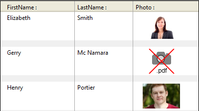

4D includes specific support for pictures used in your forms.

## Native Formats Supported

4D integra a gestão nativa dos formatos de imagem. Isso significa que imagens serão mostradas e armazenadas em seu formato original, sem qualquer interpretação em 4D. As funcionalidades específicas dos formatos diferentes (sombreado, áreas transparentes, etc) serão retidas quando forem copiadas e coladas, e serão exibidas sem alteração. Essa compatibilidade nativa é válida para todas as imagens armazenadas nos formulários de 4D: [imagens estáticas](FormObjects/staticPicture.md) coladas no modo Desenho, imagens coladas em [objetos de entrada](FormObjects/input_overview.md) em execução, etc.

The most common picture formats are supported of both platforms: .jpeg, .gif, .png, .tiff, .bmp, etc. On macOS, the .pdf format is also available for encoding and decoding. Em macOS, o formato pdf também está disponível para codificar e decodificar.

> The full list of supported formats varies according to the operating system and the custom codecs that are installed on the machines. To find out which codecs are available, you must use the `PICTURE CODEC LIST` command (see also the [picture data type](Concepts/dt_picture.md) description).

### Unavailable picture format

Um ícone específico é exibido para imagens salvas em um formato que não esteja disponível no mecanismo. A extensão do formato faltante é mostrado na parte inferior do ícone:

O ícone é usado automaticamente onde a imagem precisar ser exibida:

O ícone indica que a imagem não pode ser exibida ou manipulada localmente - mas pode ser salva sem alteração para que possa ser exibida em outros dispositivos. Por exemplo esse é o caso para imagens PDF em Windows ou para imagens no formato PICT.

## High Resolution Pictures

4D supports high resolution pictures on both macOS and Windows platforms. High resolution pictures can be defined by either scale factor or dpi.

### Scale factor (macOS only)

High resolution displays have a higher pixel density than traditional standard displays. For pictures to render correctly on high resolution displays, the number of pixels in the picture must be multiplied by the *scale factor* (*i.e.*, two times larger, three times larger, etc.).

When using high resolution pictures, you can specify the scale factor by adding "@nx" in the picture's name (where *n* designates the scale factor). In the table below, you can see that the scale factor is indicated in the names of the high resolution pictures, *circle@2x.png* and *circle@3x.png*.

| Display Type        | Scale Factor                                   | Exemplo                                                                      |
| ------------------- | ---------------------------------------------- | ---------------------------------------------------------------------------- |
| Standard Resolution | 1:1 pixel density.                             | **1x**  *circle.png* |
| High Resolution     | Pixel density increased by a factor of 2 or 3. | <table><th>2x</th><th>3x</th><tr><td>*circle@2x.png*</td><td> *circle@3x.png*</td></tr></table>                                                    |

High resolution pictures with the @nx convention can be used in the following objects:

* [Static pictures](FormObjects/staticPicture.md)
* [Buttons](FormObjects/button_overview.md)/[radio](FormObjects/radio_overview.md)/[check boxes](FormObjects/checkbox_overview.md)
* [Picture buttons](FormObjects/pictureButton_overview.md)/[Picture pop-ups](FormObjects/picturePopupMenu_overview.md)
* [Tab controls](FormObjects/tabControl.md)
* [Cabeçalhos de list box](FormObjects/listbox_overview.md#list-box-headers)
* [Menu icons](Menus/properties.md#item-icon)

4D automatically prioritizes pictures with the highest resolution. 4D automatically prioritizes pictures with the highest resolution. Even if a command or property specifies *circle.png*, *circle@3x.png* will be used (if it exists).
> Note that resolution prioritization occurs only for displaying pictures onscreen, there is no automatic prioritization made when printing.

### DPI (macOS and Windows)

While 4D automatically prioritizes the highest resolution,  there are, however, some behavioral differences depending on screen and image dpi*(\*)*, and picture format:

| Operação                                                                                                                                 | Comportamento                                                 |
| ---------------------------------------------------------------------------------------------------------------------------------------- | ------------------------------------------------------------- |
| Drop or Paste                                                                                                                            | If the picture has:<ul><li>**72dpi or 96dpi** - The picture is "[Center](FormObjects/properties_Picture.md#center--truncated-non-centered)" formatted and the object containing the picture has the same number of pixels.</li><li>**Other dpi** - The picture is "[Scaled to fit](FormObjects/properties_Picture.md#scaled-to-fit)" formatted and the object containing the picture is equal to (picture's number of pixels * screen dpi) / (picture's dpi)</li> <li>**No dpi** - The picture is "[Scaled to fit](FormObjects/properties_Picture.md#scaled-to-fit)" formatted.</li></ul>                  |
| [Automatic Size](https://doc.4d.com/4Dv18/4D/18/Setting-object-display-properties.300-4575725.en.html#148057) (Form Editor context menu) | If the picture's display format  is:<ul><li>**[Scaled](FormObjects/properties_Picture.md#scaled-to-fit)** - The object containing the picture is resized according to (picture's number of pixels * screen dpi) / (picture's dpi) </li> <li>**Not scaled** - The object containing the picture has the same number of pixels as the picture.</li></ul> |

*(\*) Typically,  macOS = 72dpi, Windows = 96dpi*

## Dark mode pictures (macOS only)

You can define specific pictures and icons to be used instead of standard pictures when [forms use the dark scheme](properties_FormProperties.md#color-scheme).

A dark mode picture is defined in the following way:

* dark mode picture has the same name as the standard (light scheme) version with the suffix "`_dark`"
* dark mode picture is stored next to the standard version.

At runtime, 4D will automatically load the light or dark image according to the [current form color scheme](https://doc.4d.com/4dv19/help/command/en/1761.html).

## Mouse Coordinates in a Picture

4D permite recuperar as coordenadas locais do mouse em um [objeto de entrada](FormObjects/input_overview.md) associado a uma [expressão de imagem](FormObjects/properties_Object.md#expression-type), no caso de que clique ou passe o cursor por cima, mesmo se não tiver aplicado um deslocamento ou zoom na imagem. Esse mecanismo, similar ao de um mapa de imagens, pode ser utilizado, por exemplo, para manejar barras de botões deslocáveis ou a interface de um software de cartografia.

As coordenadas são devolvidas nas [Variáveis de Sistema](https://doc.4d.com/4Dv18/4D/18/System-Variables.300-4505547.en.html). *MouseX* e*MouseY*. The coordinates are expressed in pixels with respect to the top left corner of the picture (0,0). Se o mouse estiver fora do sistema de coordenadas da imagem, se devolverá -1 em *MouseX* e *MouseY*.

You can get the value of these variables as part of the [`On Clicked`](Events/onClicked.md), [`On Double Clicked`](Events/onDoubleClicked.md), [`On Mouse up`](Events/onMouseUp.md), [`On Mouse Enter`](Events/onMouseEnter.md), or [`On Mouse Move`](Events/onMouseMove.md) form events.
