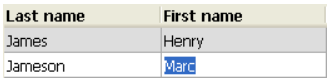
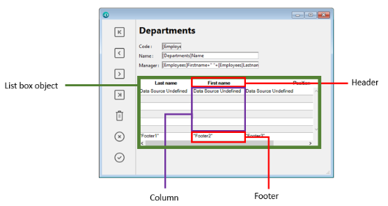
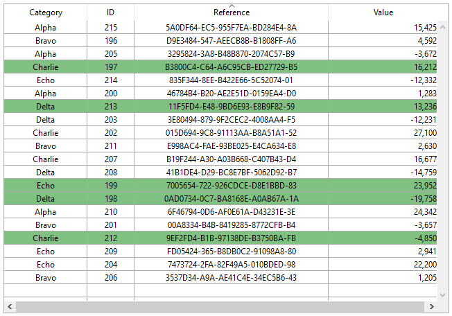
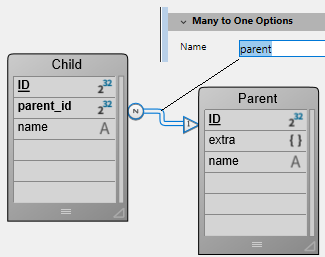
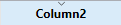
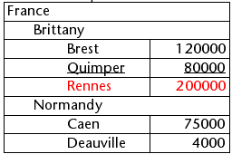
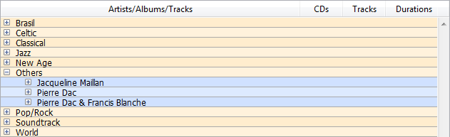

List boxes são objetos ativos complexos que permitem exibir e ingressar dados como colunas sincronizadas. Podem ser conectadas aos conteúdos de banco de dados como seleções de entidade e seleções de registro, ou para conteúdos de linguagem como coleções e arrays. Incluem as funcionalidades avançadas relativas à entrada de dados, classificação de colunas, gerenciamento de eventos, aspecto personalizado, movimentação de colunas, etc.


Uma list box contém uma ou mais colunas cujo conteúdos são automaticamente sincronizados. O número de colunas é teoricamente ilimitado (depende dos recursos da máquina).

## Visão Geral

### Funcionalidades de usuário básicas

Durante a execução, list boxes permitem exibir e ingressar dados como listas. Para tornar uma célula editável ([se a entrada for permitida para a coluna](#managing-entry)), simplesmente clique duas vezes no valor que contém:



Usuários podem ingressar e exibir o texto em várias linhas dentro de uma célula list box. Para adicionar uma quebra de linha pressione **Ctrl+Retorno de carro** em Windows ou **Opção+Retorno de Carro** em macOS.

Booleanos e imagens podem ser exibidos em células, assim como datas, horas ou números. É possível ordenar valores em colunas clicando em um cabeçalho ([ordenação padrão](#managing-sorts)). Todas as colunas são sincronizadas automaticamente.

Também é possível redimensionar cada coluna, e o usuário pode modificar a ordem das [colunas](properties_ListBox.md#locked-columns-and-static-columns) e [linhas](properties_Action.md#movable-rows) ao movê-las usando o mouse, se essa ação for autorizada. Note que a list boxes podem ser usadas em [modo hierarquico](#hierarchical-list-boxes).

O usuário pode selecionar um ou mais linhas usando os atalhos padrão: **Shift+clique** para uma seleção adjacente **Ctrl+clique** (Windows) ou **Comando+clique** (macOS) para uma seleção não adjacente.

### Partes de list box

Uma list box é composta de quatro partes diferentes:

*   the [list box object](./listbox-object.md) in its entirety,
*   [columns](./listbox-column.md),
*   column [headers](./listbox-header-footer.md#headers), and
*   column [footers](./listbox-header-footer.md#footers).



Cada parte tem seu próprio nome assim como propriedades específicas. Por exemplo, o número de colunas ou as cores alternativas de cada linha é estabelecida nas propriedades de objeto list box, a largura de cada coluna é estabelecida nas propriedades de colunas e a fonte do cabeçalho é estabelecida nas propriedades de cabeçalho.

É possível adicionar um método objeto para o objeto list box ou para cada coluna da list box. Métodos objetos são chamados na ordem abaixo:

1. Método objeto de cada coluna
2. Método objeto da list box

The column object method gets events that occur in its [header](./listbox-header-footer.md#headers) and [footer](./listbox-header-footer.md#footers).

### Tipos de List box

Há vários tipos de list boxes com seus próprios comportamentos e propriedades específicos. O tipo list box depende das propriedades [Data Source property](properties_Object.md#data-source):

* **Arrays**: cada coluna é conectada a um array 4D. List boxes baseadas em array podem ser exibidas como [list boxes hierárquicas](listbox_overview.md#hierarchical-list-boxes).
* **Seleção** (**Seleção atual** ou **Seleções nomeadas**): cada coluna é conectada a uma expressão (por exemplo um campo) que é avaliado para cada registro da seleção.
* **Coleção ou seleção de entidade**: cada coluna é conectada a uma expressão que é avaliada para todo elemento da coleção ou toda entidade da seleção de entidade.
> Não é possível combinar diferentes tipos de list box no mesmo objeto list box. A fonte de dados é estabelecida quando a list box é criada. Não é mais possível modificar por programação.

### Gerenciando list boxes

Pode configurar completamente um objeto list box através de suas propriedades e também pode gerenciar dinamicamente por programação.

A linguagem 4D inclui um tema dedicado "List Box" para comandos list box, mas comandos de vários outros temas, como comandos "Object properties" ou `EDIT ITEM`, `Displayed line number` podem ser usados. Refer to the [List Box Commands Summary](https://doc.4d.com/4Dv20/4D/20.6/List-Box-Commands-Summary.300-7487600.en.html) page of the *4D Language reference* for more information.


## Gerenciar entrada

Para uma célula list box ser editável, as duas condições abaixo devem ser atendidas:

* A coluna da célula deve ser estabelecida como [Editável](properties_Entry.md#enterable) (senão, as células da coluna nunca poderão ser editáveis).
* No evento `On Before Data Entry`, $0 não retorna -1. Quando o cursor chegar na célula, o evento `On Before Data Entry` é gerado no método coluna. Se, no contexto desse evento, $0 for estabelecido a -1, a célula é considerada como não editável. Se o evento for gerado depois de  **Tab** ou **Shift+Tab** ter sido pressionado, o foco vai para a próxima célula ou para a célula anterior, respectivamente. Se $0 não for -1 (como padrão $0 é 0), a célula for editável e trocar para o modo edição.

Vamos considerar o exemplo de uma lsit box contendo dois arrays: uma data e um texto. O array data não é editável mas o array texto é editável se a data não tiver sido passada.


Aqui está o método da coluna *arrText*:

```4d
 Case of
    :(Form event=On Before Data Entry) // uma célua obtém o foco
       LISTBOX GET CELL POSITION(*;"lb";$col;$row)
  // identificação da célula       If(arrDate{$row}<Current date) // se data for anterior que hoje
          $0:=-1 // célula NAO é editável
       Else
  // senão, célula é editável
       End if
 End case
```

O evento `On Before Data Entry` é retornado antes `On Getting Focus`.

Para preservar consistência de dados para list boxes de tipo seleção e tipo seleção de entidade, qualquer registro/entidade modificada é automaticamente salva assim que a célula for validada, ou seja.:

* quando a célula for desativada (usuário pressiona tab, clica, etc)
* quando a listbox não estiver mais em foco,
* quando o formulário não tiver mais o foco.

A sequencia típica de eventos gerados durante a entrada de dados ou modificação é como a seguir:

| Ação                                                                                      | Tipos Listbox                        | Sequencia de eventos                                                                                                                                                                                                      |
| ----------------------------------------------------------------------------------------- | ------------------------------------ | ------------------------------------------------------------------------------------------------------------------------------------------------------------------------------------------------------------------------- |
| Uma célula troca para modo editar (ação de usuário ou uma chamada ao comando `EDIT ITEM`) | Todos                                | On Before Data Entry                                                                                                                                                                                                      |
|                                                                                           | Todos                                | On Getting Focus                                                                                                                                                                                                          |
| Quando o valor foi modificado                                                             | Todos                                | On Before Keystroke                                                                                                                                                                                                       |
|                                                                                           | Todos                                | On After Keystroke                                                                                                                                                                                                        |
|                                                                                           | Todos                                | On After Edit                                                                                                                                                                                                             |
| Um usuário valida e deixa a célula                                                        | List box de tipo seleção             | Salvar                                                                                                                                                                                                                    |
|                                                                                           | List box de tipo seleção de registro | Ativação de On saving an existing record (se estabelecido)                                                                                                                                                                |
|                                                                                           | List box de tipo seleção             | On Data Change(*)                                                                                                                                                                                                         |
|                                                                                           | List box de tipo seleção de entidade | Entidade é salva com opção autofusão, trancamento otimista (ver entitity.save()). No caso de salvamento com sucesso, a entidade é recarregada com a última atualização. Se a operação de salvar falhar, um erro é exibido |
|                                                                                           | Todos                                | On Losing Focus                                                                                                                                                                                                           |

(*) Com list boxes de seleção de entidade, no evento On Data Change:

* O objeto contém o valor antes da modificação [Current item](properties_DataSource.md#current-item).
* o objeto `This` contém o valor modificado.

> Entrada de dados em list boxes do tipo coleção/seleção de entidade tem uma limitação quando a expressão for analisada como null. Nesse caso, não é possível editar ou remover o valor null na célula.

## Gerenciar seleções

Seleções são gerenciadas diretamente, dependendo de se a list box é a baseada em um array, em uma seleção de registros ou em uma coleção/seleção de entidades:

* **Lista box de tipo seleção**: as seleções são gerenciadas mediante um conjunto chamado como padrão `$ListboxSetX` (onde X começa em 0 e se incrementa em função do número de list box no formulário), que pode ser modificado se for necessário. Este conjunto se [define nas propriedades](properties_ListBox.md#highlight-set) da list box. É mantido automaticamente por 4D: se o usuário selecionar uma ou mais linhas na list box, o conjunto se atualiza imediatamente. Por outro lado, é também possível usar comandos do tema "Conjuntos" para modificar a seleção na list box via programação.

* **List box de tipo coleção/seleção de entidades**: as seleções se gerenciam através das propriedades de list box dedicado:
  * [Elemento atual](properties_DataSource.md#current-item) é um objeto que receberá o elemento/a entidade selecionado
  * [Itens Selecionados](properties_DataSource.md#selected-items) é uma coleção/objeto entity selection dos itens selecionados
  * [Posição do elemento atual](properties_DataSource.md#current-item-position) devolve a posição do elemento ou da entidade selecionada.

* **List box de tipo array**: o comando `LISTBOX SELECT ROW` pode utilizar-se para selecionar uma ou mais linhas de list box por programação. A [variável associada ao objeto List box](propiedades_Objeto.md#variable-o-expresión) se utiliza para obter, definir ou armazenar as seleções de linhas no objeto. Esta variável corresponde a um array de booleanos que é criado e mantido automaticamente por 4D. O tamanho deste array vem determinado pelo tamanho do list box: contém o mesmo número de elementos que o menor array associado às colunas. Cada elemento deste array contém `True` se selecionar a línha correspondente e `False` em caso contrário. 4D atualiza o conteúdo deste array em função das ações de usuário. Do lado contrário, pode mduar o valor dos elementos array para mudar a seleção na list box. Mas não se pode inserir nem apagar linhas nesse array; nem se pode reescrever as linhas. O comando `Count in array` pode ser usado para encontrar o número de líneas selecionadas. Por exemplo, este método permite inverter a seleção da primeira línha de list box (tipo array):

```4d
 ARRAY BOOLEAN(tBListBox;10)
  //tBListBox é o nome da variável associada ao list box no formulário
 If(tBListBox{1}=True)
    tBListBox{1}:=False
 Else
    tBListBox{1}:=True
 End if
```

> O comando `OBJECT SET SCROLL POSITION` percorre as linhas da caixa de listagem de modo a que seja apresentada a primeira linha seleccionada ou uma linha especificada.

### Personalizar a aparência de linhas selecionadas

Quando a opção [Hide selection highlight](properties_Appearance.md#hide-selection-highlight) for selecionada, precisa fazer com que as seleções de list boxes sejam visíveis usando opções de interface disponíveis. Como seleções não são gerenciadas totalmente por 4D, isso significa:

* Para array de tipo list boxes, deve analisar a variável array booleana associada com a list box para determinar quais linhas foram ou não selecionadas.
* Para list boxes de tipo seleção, tem que checar se o registro atual (linha) pertence ao conjunto especificado na propriedade de list box [Highlight Set](properties_ListBox.md#highlight-set).

Pode então definir cores de fundo especificas, cores de fonte ou estilos de fonte por programação para personalizar a aparência de linhas selecionadas. Isso pode ser feito usando arrays ou expressões, dependendo do tipo de list box sendo exibido (ver as seções abaixo).

> Pode usar a constante `lk inherited` para imitar a aparência atual da list box (por exemplo, cor de fonte, cor de fundo, estilo da fonte,  etc.).

#### List box de tipo seleção

Para determinar que list boxes foram selecionadas, é preciso checar se estão incluídas no conjunto especificado na propriedade de list box [Highlight Set](properties_ListBox.md#highlight-set). Pode então definir a aparência das linhas selecionadas usando um ou mais das cores ou estilos propriedades de estilo relevantes [](#using-arrays-and-expressions).

Lembre que essas expressões são automaticamente reavaliadas a cada vez que:

* a seleção de list box mudar.
* a list box obter ou perder o foco.
* a janela de formulário contendo a list box virar a janela mais à frente, ou deixar de estar à frente.

#### List box de tipo array

É preciso decompor o array Booleano [Variable or Expression](properties_Object.md#variable-or-expression) associado com a lsit box para determinar quaiws linhas foram selecionadas ou não selecionadas.

Pode então definir a aparência das linhas selecionadas usando um ou mais das cores ou estilos propriedades de estilo de array relevantes [](#using-arrays-and-expressions).

Note que arrays de list box usados para definir a aparência de linhas selecionadas devem ser recalculadas durante o evento de formulário `On Selection Change`; entretanto, também pode modificar esses arrays baseado nos eventos de formulários abaixo:

* `On Getting Focus` (propriedade de list box)
* `On Losing Focus` (propriedade de list box)
* `On Activate` (propriedade formulário)
* `On Deactivate` (form property) ...depending on whether and how you want to visually represent changes of focus in selections.

##### Exemplo

Se escolher esconder os destaques do sistema e quiser exibir seleções de list box com uma cor de fundo verde, como mostrado aqui:



Para uma list box de tipo array, precisa atualizar [Row Background Color Array](properties_BackgroundAndBorder.md#row-background-color-array) por programação. No formulário JSON, se definiu o array de cores de fundo seguinte para o list box:

```
 "rowFillSource": "_ListboxBackground",
```

No método de objeto da list box, pode escrever:

```4d
 Case of
    :(Form event=On Selection Change)
       $n:=Size of array(LB_Arrays)
       ARRAY LONGINT(_ListboxBackground;$n) // cores de fundo linha
       For($i;1;$n)
          If(LB_Arrays{$i}=True) // selecionado
             _ListboxBackground{$i}:=0x0080C080 // fundo verde
          Else // não selecionado
             _ListboxBackground{$i}:=lk inherited
          End if
       End for
 End case
```

Para uma seleção de tipo list box, para produzi o mesmo efeito pode usar um método para atualizar [Background Color Expression](properties_BackgroundAndBorder.md#background-color-expression) baseado no conjunto especificado na propriedade [Highlight Set](properties_ListBox.md#highlight-set).

Por exemplo, no formulário JSON, se definiu  HIghlight Set e Background Color Expression para o list box:

```
 "highlightSet": "$SampleSet",
 "rowFillSource": "UI_SetColor",
```

Pode escrever no método *UI_SetColor*:

```4d
 If(Is in set("$SampleSet"))
    $color:=0x0080C080 //  fundo verde
 Else
    $color:=lk inherited
 End if

 $0:=$color
```

> Em list boxes hierárquicos , quebras de linha não podem ser ressaltadas quando a opção [Hide selection highlight](properties_Appearance.md#hide-selection-highlight) estiver marcada. Já que não é possível diferenciar cores de cabeçalho ao mesmo nível, não há uma maneira de ressaltar uma quebra de linha especifica por programação.

## Gestão de ordenações

Uma ordenação num list box pode ser padrão ou personalizada. Todas as colunas são sincronizadas automaticamente.

### Ordenação standard

como padrão, uma list box gerencia automaticamente ordenações de coluna padrão quando o cabeçalho for clicado. Uma ordenação normal é uma ordenação alfanumérica de valores de coluna, alternando entre ascendente e descendente com cada clique sucessivo.

Pode impedir que o usuário use ordenações padrão desativando a propriedade [Sortable](properties_Action.md#sortable) da list box.

O suporte de ordenação padrão depende do tipo de list box:

| Tipo de list box              | Suporte de ordenação padrão | Comentários                                                                                          |
| ----------------------------- | --------------------------- | ---------------------------------------------------------------------------------------------------- |
| Uma coleção de objetos        | Sim                         | <li>As colunas "This.a" ou "This.a.b" podem ser ordenadas.</li><li>A [propriedade source do list box](properties_Object.md#variable-or-expression) deve ser uma [expressão atribuível](../Concepts/quick-tour.md#assignable-vs-non-assignable-expressions).</li>                                                   |
| Colecção de valores escalares | Não                         | Use a classificação personalizada com a função[`orderBy()`](../API/CollectionClass.md#orderby)       |
| Seleção de entidades          | Sim                         | <li>A [propriedade source do list box](properties_Object.md#variable-or-expression) deve ser uma [expressão atribuível](../Concepts/quick-tour.md#assignable-vs-non-assignable-expressions).</li><li>Suportado: classifica propriedades de atributos de objetos (por exemplo, "This.data.city" quando "data" é um atributo de objeto)</li><li>Suportado: ordena por atributos relacionados (por exemplo, "This.company.name")</li><li>Não suportado: classifica propriedades de atributos de objetos por atributos relacionados (por exemplo, "This.company.data.city"). Para isso, você precisa usar a classificação personalizada com a função [`orderByFormula()`](../API/EntitySelectionClass.md#orderbyformula) (veja o exemplo abaixo)</li> |
| Selecção actual               | Sim                         | Somente expressões simples podem ser classificadas (por exemplo, `[Table_1]Field_2`)                 |
| Seleção temporal              | Não                         |                                                                                                      |
| Arrays                        | Sim                         | As colunas ligadas a arrays de imagens e ponteiros não podem ser ordenadas                           |

### Ordenação personalizada

O desenvolvedor pode estabelecer ordenações personalizadas com o comando `LISTBOX SORT COLUMNS` ou combinando com os eventos de formulário `On Header Click` e `On After Sort` (ver o comando `FORM Event` ) e outros comandos 4D relevantes.

As ordenações personalizadas permitem-lhe:

* efetuar ordenações multinível em várias colunas, graças ao comando [`LISTBOX SORT COLUMNS`](https://doc.4d.com/4dv19/help/command/en/page916.html),
* use funções como [`collection.orderByMethod()`](../API/CollectionClass.md#orderbymethod) ou [`entitySelection.orderByFormula()`](../API/EntitySelectionClass.md#orderbyformula) para classificar colunas com base em critérios complexos.

#### Exemplo

Você deseja classificar um list box usando valores de uma propriedade armazenada em um atributo de objeto relacionado. Tem a seguinte estrutura:



Você projeta um list box entity selection, vinculada à expressão `Form.child`. In the `On Load` form event, you execute `Form.child:=ds. Child.all()`.

São exibidas duas colunas:

| Negrito     | Apelido do progenitor        |
| ----------- | ---------------------------- |
| `This.name` | `This.parent.extra.nickname` |

Se quiser ordenar o list box utilizando os valores da segunda coluna, tem de escrever:

```4d
If (Form event code=On Header Click)
 Form.child:=Form.child.orderByFormula("This.parent.extra.nickname"; dk ascending)
End if
```

### Variável de cabeçalho de coluna

P valor da variável column header variable[](properties_Object.md#variable-or-expression) permite gerenciar informação adicional: a ordenação atual da coluna (read) e a exibição da flecha de ordenação.

* Se a variável for estabelecida como 0, a coluna não é ordenada e a flecha de ordenação não é exibida;  
  

* Se a variável for estabelecida como 1, a coluna é ordenada de forma ascendente e a flecha de ordenação é exibida;

* Se a variável for estabelecida como 2, a coluna é ordenada de forma descendente e a flecha de ordenação é exibida. 

> Somente [variáveis](Concepts/variables.md) declaradas ou dinâmicas podem ser usadas como variáveis de coluna de cabeçalho. Não são suportados outros tipos de [expressões](Concepts/quick-tour.md#expressions), como `Form.sortValue`.

Pode estabelecer o valor da variável (por exemplo, Header2:=2) para  “forçar” a exibição da flecha de ordenação. A ordenação de coluna não é modificada nesse caso; depende do desenvolvedor como vai manejá-la.

> O comando [`OBJECT SET FORMAT`](https://doc.4d.com/4dv19/help/command/en/page236.html) oferece suporte específico para ícones nos cabeçalhos dos list box, o que pode ser útil quando se pretende trabalhar com um ícone de ordenação personalizado.

## Gerenciar cores linha, estilos e exibição

Aqui estão algumas maneiras de estabelecer cores de fundo, cores de fonte e estilos de fonte para list boxes:

* at the level of the [list box object properties](./listbox-object.md),
* at the level of the [column properties](./listbox-column.md),
* usar [arrays ou propriedades de expressão](#using-arrays-and-expressions) para a list box ou para cada coluna,
* no nível de texto de cada célula (se [texti multiestilo](properties_Text.md#multi-style)).

### Prioridade & herança

Princípios de prioridade e herança são observados quando a mesma propriedade for estabelecida em mais de um nível.

| Nível de prioridade | Localização do parâmetro                                                        |
| ------------------- | ------------------------------------------------------------------------------- |
| alta prioridade     | Célula (se texto multiestilo)                                                   |
|                     | Arrays/métodos de coluna                                                        |
|                     | Arrays/métodos de Listbox                                                       |
|                     | Propriedades da coluna                                                          |
|                     | Propriedades de list box                                                        |
| baixa prioridade    | Expressão Meta Info (para list boxes de tipo collection ou seleção de entidade) |

Por exemplo se estabelecer um estilo de fonte nas propriedades de list box e outro usando um array estilo para a coluna, este último será levado em consideração.

Para cada atributo (estilo, cor e cor de fundo), uma **herança** é implementada quando o valor padrão for usado:

* Para atributos de célula: atributos valores de linhas
* para atributos linhas: valores de atributos de colunas
* para atributos coluna: valores atributos no list box

Dessa maneira se quiser que um objeto herde o valor de atributo de um nível superior, pode usar a constante `lk inherited` (valor parão) à definição de comando ou diretamente no elemento do array correspondente de estilo/cor. Por exemplo dado um list box array contendo um estilo de fonte padrão com cores alternantes: 

Pode realizar as modificações abaixo:

* mude o fundo da linha 2 para vermelho usando a propriedade [Row Background Color Array](properties_BackgroundAndBorder.md#row-background-color-array) do objeto list box,
* mude o estilo da linha 4 para itálico usando a propriedade [Row Style Array](properties_Text.md#row-style-array) do objeto de list box,
* dois elementos na coluna 5 são mudados para negrito usando as propriedades [Row Style Array](properties_Text.md#row-style-array) do objeto coluna 5,
* os 2 elementos para coluna 1 e 2 são mudados para azul escuro usando a propriedade [Row Background Color Array](properties_BackgroundAndBorder.md#row-background-color-array) para os objetos coluna 1 e 2:


Para restaurar a aparência original da list box, é possível:

* passar a constante `lk inherited` no elemento 2 dos arrays de cor de fundo para as colunas 1 e 2: elas então herdam a cor de fundo vermelha da linha.
* passe a constante `lk inherited` em elementos 3 e 4 do array de estilo para coluna 5: elas então herdam o estilo padrão, exceto para o elemento 4, que mudam para itálico como especificado no array de estilo da list box.
* passe a constante `lk inherited` no elemento 4 do array de estilo para a list box para poder remover o estilo de itálico.
* passe a constante `lk inherited` em elemento 3 do array de cor de fundo para o list box para poder restaurar a cor original da list box.

### Usar arrays e expressões

Dependendo do tipo de list box, pode usar diferentes propriedades para personalizar cores de linha, estilos e exibição:

| Propriedade     | List box array                                                                       | List box seleção                                                                        | List box coleção ou entity selection                                                                                                                            |
| --------------- | ------------------------------------------------------------------------------------ | --------------------------------------------------------------------------------------- | --------------------------------------------------------------------------------------------------------------------------------------------------------------- |
| Cor de fundo    | [Array controle linha](properties_BackgroundAndBorder.md#row-background-color-array) | [Expressão cor de fundo](properties_BackgroundAndBorder.md#background-color-expression) | [Background Color Expression](properties_BackgroundAndBorder.md#background-color-expression) ou [Meta info expression](properties_Text.md#meta-info-expression) |
| Cor de fundo    | [Array cores de Fonte](properties_Text.md#row-font-color-array)                      | [Expressão cor fonte](properties_Text.md#font-color-expression)                         | [Font Color Expression](properties_Text.md#font-color-expression) ou [Meta info expression](properties_Text.md#meta-info-expression)                            |
| Estilo de letra | [Array estilo linha](properties_Text.md#row-style-array)                             | [Expressão estilo](properties_Text.md#style-expression)                                 | [Style Expression](properties_Text.md#style-expression) ou [Meta info expression](properties_Text.md#meta-info-expression)                                      |
| Visualização    | [Array controle linha](properties_ListBox.md#row-control-array)                      | -                                                                                       | -                                                                                                                                                               |

## Imprimir list boxes

dois modos de impressão estão disponíveis: **preview mode** - que pode ser usado imprimir uma list box como um objeto formulário e  **advanced mode** - quer permite controlar a impressão de objeto list box dentro do formulário. Note que a aparência "Impressão" está disponível para objetos list box no editor de Formulário.

### Modo de vista previa

Imprimir uma list box em modo preview consiste de imprimir diretamente o list box e o formulário que o contém usando os comandos de impressão normais ou o comando de menu **Print** . A list box é impressa como no formulário. Esse modo não permite controle preciso da impressão do objeto, especialmente não permite imprimir todas as linhas da list box que contenham mais linhas que podem ser exibidas.

### Modo avançado

Nesse modo, a impressão de list box é realizada por programação via o comando `Print object` (formulários projeto e formulários tabela são compatíveis). O comando `LISTBOX GET PRINT INFORMATION` é usado para controlar a impressão do objeto.

Nesse modo:

* A altura do objeto list box é reduzida automaticamente quando o número de linhas a ser impresso for menor que a altura original do objeto (não há linhas "em branco" impressas). Por outro lado a altura não aumenta automaticamente de acordo com os conteúdos do objeto. O tamanho do objeto realmente impresso pode ser obtido via o comando `LISTBOX GET PRINT INFORMATION` .
* The list box object is printed "as is", in other words, taking its current display parameters into account: visibility of headers and gridlines, hidden and displayed rows, etc. These parameters also include the first row to be printed: if you call the `OBJECT SET SCROLL POSITION` command before launching the printing, the first row printed in the list box will be the one designated by the command. O objeto list box é impresso "como está" ou seja, levando em consideração seus parâmetros atuais de exibição: visibilidade de cabeçalhos e grades de impressão, linhas escondidas e exibidas, etc. Esses parâmetros também incluem a primeira linha a ser impressa: se chamar o comando `OBJECT SET SCROLL POSITION` antes de lançar a impressão, a primeira linha impressa será aquela determinada pelo comando.
* Um mecanismo automático facilita a impressão de list boxes que contenham mais linhas do que é possível exibir: chamadas repetidas a `Print object` podem ser usadas para imprimir um novo conjunto de linhas a cada vez. O comando `LISTBOX GET PRINT INFORMATION` pode ser usado para checar o estado da impressão enquanto estiver sendo realizada.

## List box hierárquicos.

Uma list box hierárquica é uma list box na qual o conteúdo da primeira coluna aparece em forma hierárquica. Esse tipo de representação se adapta à apresentação de informação que inclua valores repetidos ou que dependem de hierarquias (país/região/cidade e assim por diante).

> Apenas [list boxes de tipo array](#array-list-boxes) podem ser hierárquicos.

As caixas de listagem hierárquica são uma forma particular de representar dados, mas não modificam a estrutura de dados (matrizes). As caixas de listagem hierárquica são geridas exactamente da mesma forma que as caixas de listagem normais.

### Definir a hierarquia

Para definir uma list box hierárquica há várias possibilidades:

* Configurar manualmente os elementos hierárquicos usando a lista Propriedade no editor de formulário (ou editar o formulário JSON).
* Gerar visualmente a hierarquia usando o menu emergente de gestão de list box no editor de formulários.
* Use the [LISTBOX SET HIERARCHY](https://doc.4d.com/4Dv20/4D/20.6/LISTBOX-SET-HIERARCHY.301-7487634.en.html) and [LISTBOX GET HIERARCHY](https://doc.4d.com/4Dv20/4D/20.6/LISTBOX-GET-HIERARCHY.301-7487597.en.html) commands, described in the *4D Language Reference* manual.

#### Propriedades de List Box hierárquico

Essa propriedade especifica que o list box deve ser exibido em forma hierárquica. No formulário JSON, esse recurso é acionado [quando o valor da propriedade *dataSource* é um array](properties_Object.md#array-list-box), ou seja, uma coleção.

Opções adicionais (**Variable 1...10**) estão disponíveis quando a opção *List box hierárquica* for selecionada, correspondendo a cada array *dataSource* para usar como quebra de coluna. A cada vez que um valor é digitado em um campo, uma nova linha é adicionada. Podem ser especificadas até 10 variáveis. Essas variáveis estabelecem os níveis hierárquicos a serem exibidos na primeira coluna.

A primeira variável sempre corresponde ao nome da variável para a primeira coluna da list box (os dois valores são automaticamente conectados) Essa primeira variável é sempre visível e editável. Essa primeira variável é sempre visível e editável. Por exemplo: country. A segunda variável é sempre visível e editável: especifica o segundo nível hierárquico. Por exemplo: regions. A partir do terceiro campo, cada variável depende da variável que a antecedeu. Por exemplo: countries, cities etc. Pode ser especificado um máximo de dez níveis hierárquicos. Se remover um valor, a hierarquia inteira move um nível para cima.

A última variável nunca é hierárquica mesmo se vários valores idênticos existirem nesse nível. Por exemplo, referindo-se à configuração ilustrada acima, imagine que arr1 contém os valores  A A A B B B, arr2 tenha os valores 1 1 1 2 2 2 e arr3 os valores X X Y Y Y Z. Neste caso, A, B, 1 e 2 poderiam aparecer na forma colapsada, mas não  X e Y:


Esse princípio não é aplicado quando apenas uma variável for especificada na hierarquia: nesse caso, valores idênticos podem ser agrupados.
> Se especificar uma hierarquia baseada nas primeiras colunas de uma list box existente, deve então remover ou esconder essas colunas (exceto a primeira) senão vão aparecer de forma duplicada na list box. Se especificar a hierarquia via o menu pop up do editor (ver abaixo), as colunas desnecessárias serão removidas automaticamente da list box.

#### Crie hierarquias usando o menu contextual

Quando se selecciona pelo menos uma coluna para além da primeira num objecto list box (do tipo array) no editor de formulários, o comando **Criar hierarquia** está disponível no menu de contexto:


Este comando é um atalho para definir a hierarquia. Quando for selecionado, as ações a seguir são realizadas:

* A opção **Hierarchical list box** é marcada para o objeto na Lista propriedade.
* As variváveis das colunas são usadas para especificar a hierarquia. Elas substituem qualquer variável já especificada.
* As colunas selecionadas não aparecem mais na list box (exceto para o título da primeira).

Exemplo: dado uma list box cujas primeiras colunas contém País, região, cidade e população. Quando País, região e cidade forem selecionadas, se escolher **Create hierarchy** no menu contextual, uma hierarquia de três níveis é criada na primeira coluna, colunas número 2 e 3 são removidas e a coluna População vira a segunda:


##### Cancelar hierarquia

Quando a primeira coluna for selecionada e especificada como hierárquica pode usar o comando **Cancel hierarchy**. Quando selecionar este comando, as ações abaixo serão realizadas:

* A opção **Hierarchical list box** é desmarcada para o objeto,
* Os níveis hierárquicos 2 a X são removidos e transformados em colunas adicionadas à list box.

### Como funciona

Quando um formulário que conter uma list box hierárquica for aberto pela primeira vez, como padrão todas as linhas são expandidas.

Uma linha de quebra e um "nó" hierárquico são automaticamente adicionados na caixa de listagem quando os valores são repetidos nas matrizes. Por exemplo, imagine uma caixa de listagem contendo quatro arrays especificando cidades, sendo cada cidade caracterizada pelo seu país, a sua região, o seu nome e o seu número de habitantes:


Se esta caixa de listagem for apresentada de forma hierárquica (sendo as três primeiras arrays incluídas na hierarquia), obtém-se:


Os arrays não são ordenadas antes de a hierarquia ser construída. Se, por exemplo, uma matriz contém os dados AAABBAACC, a hierarquia obtida é a seguinte:

    > &gt; > A B A C

Para expandir ou colapsar um "nó" hierárquico, pode simplesmente clicar sobre ele. Se **Alt+clique em** (Windows) ou **Option+clique em** (macOS) no nó, todos os seus subelementos também serão expandidos ou recolhidos. Estas operações também podem ser efectuadas por programação, utilizando os comandos `LISTBOX EXPAND` e `LISTBOX COLLAPSE`.

Quando valores do tipo de data ou hora são incluídos numa caixa de listagem hierárquica, eles são exibidos no formato de sistema curto.

#### Ordenar em caixas de listagem hierárquica

Numa caixa de listagem em modo hierárquico, uma ordenação padrão (realizada clicando no cabeçalho de uma coluna da caixa de listagem) é sempre construída da seguinte forma:

* Em primeiro lugar, todos os níveis da coluna hierárquica (primeira coluna) são automaticamente ordenados por ordem ascendente.
* A ordenação é então efectuada por ordem ascendente ou descendente (de acordo com a acção do utilizador) sobre os valores da coluna que foi clicada.
* Todas as colunas são sincronizadas.
* Durante ordenações posteriores realizadas em colunas não hierárquicas da caixa de listagem, apenas o último nível da primeira coluna é classificado. É possível modificar a ordenação desta coluna, clicando no seu cabeçalho.

Dada, por exemplo, a seguinte caixa de listagem, na qual não é especificado nenhum tipo específico:


Se clicar no cabeçalho "População" para ordenar as populações por ordem ascendente (ou alternadamente descendente), os dados aparecem como se segue:


Como para todas as caixas de listagem, pode [desactivar o mecanismo de ordenação padrão](properties_Action.md#sortable) e gerir os tipos usando programação.

#### Seleções e posições em caixas de listagem hierárquica

Uma caixa de listagem hierárquica exibe um número variável de linhas na tela, de acordo com o estado expandido/colocado dos nós hierárquicos. Isto não significa, contudo, que o número de filas das matrizes varie. Apenas o visor é modificado, não os dados. É importante compreender este princípio porque a gestão programada das caixas de listagem hierárquica é sempre baseada nos dados das matrizes, não nos dados apresentados. Em particular, as linhas de intervalo adicionadas automaticamente não são tidas em conta nas matrizes de opções de visualização (ver abaixo).

Vejamos, por exemplo, as seguintes matrizes:


Se estes conjuntos forem representados hierarquicamente, a linha "Quimper" não será exibida na segunda linha, mas sim na quarta, devido às duas linhas de interrupção que são adicionadas:


Independentemente de como os dados são exibidos na caixa da lista (hierarquicamente ou não), se quiser alterar a linha que contém "Quimper" para negrito, deve utilizar a declaração Style{2} = negrito. Apenas a posição da fila nas matrizes é tida em conta.

Este princípio é implementado para as matrizes internas que podem ser utilizadas para gerir:

* cores
* cores de fundo
* estilos
* filas ocultas
* seleções

Por exemplo, se quiser seleccionar a fila que contém Rennes, deve passar:

```4d
 ->MyListbox{3}:=True
```

Representação não hierárquica:  Representação hierárquica: 

> Se uma ou mais filas estiverem escondidas porque os seus pais estão desmoronados, já não são seleccionados. Apenas as linhas visíveis (directamente ou por rolagem) podem ser seleccionadas. Por outras palavras, as filas não podem ser tanto escondidas como seleccionadas.

Tal como com as selecções, o comando `LISTBOX GET CELL POSITION` devolverá os mesmos valores para uma caixa de listagem hierárquica e uma caixa de listagem não hierárquica. Isto significa que em ambos os exemplos abaixo, `LISTBOX GET CELL POSITION` irá devolver a mesma posição: (3;2).

*Representação hierárquica:* 

*Representação não-hierárquica:* 

Quando todas as filas de uma sub-hierarquia estão escondidas, a linha de quebra é automaticamente escondida. No exemplo acima, se as linhas 1 a 3 estiverem escondidas, a linha de quebra "Bretanha" não aparecerá.

#### Linhas de quebra

Se o usuário selecionar uma linha de quebra, `LISTBOX GET CELL POSITION` devolve a primeira ocorrência da linha na matriz correspondente. No caso seguinte:


... `LISTBOX GET CELL POSITION` retorna (2;4). Para selecionar uma linha de quebra por programação, terá de utilizar o comando `LISTBOX SELECT BREAK` .

As linhas de quebra não são tidas em conta nos arrays internos utilizados para gerir o aspecto gráfico das caixas de listagem (estilos e cores). No entanto, é possível modificar estas características para linhas de quebra através dos comandos de gestão gráfica dos objectos. Basta executar os comandos apropriados nas matrizes que constituem a hierarquia.

Dada, por exemplo, a seguinte caixa de listagem (os nomes dos arrays associados são especificados entre parênteses):

*Representação hierárquica:* 

*Representação não-hierárquica:* 

No modo hierárquico, os níveis de quebra não são tidos em conta pelos arrays de modificação de estilo denominadas `tStyle` e `tColors`. Para modificar a cor ou o estilo dos níveis de quebra, é necessário executar as seguintes declarações:

```4d
 OBJECT SET RGB COLORS(T1;0x0000FF;0xB0B0B0)
 OBJECT SET FONT STYLE(T2;Bold)
```
> Neste contexto, apenas a sintaxe usando a variável array pode funcionar com os comandos de propriedade do objecto porque as arrays não têm nenhum objecto associado.

Resultados:


#### Gestão otimizada da expansão/colapso

Pode optimizar a exibição e gestão de caixas de listagem hierárquica usando os eventos de formulário `On Expand` e `On Collapse`.

Uma caixa de listagem hierárquica é construída a partir do conteúdo de seus arrays de modo a só poder ser exibida quando todas estas matrizes são carregadas na memória. Isto torna difícil construir grandes caixas de listagem hierárquica com base em arrays gerados a partir de dados (através do comando `SELECTION TO ARRAY` ), não só devido à velocidade de visualização mas também à memória utilizada.

Usando os formulários `On Expand` e `On Collapse` , os eventos podem ultrapassar estas restrições: por exemplo, é possível exibir apenas parte da hierarquia e carregar/descarregar as arrays a qualquer momento, com base nas ações dos usuários. No contexto destes eventos, o comando `LISTBOX GET CELL POSITION` devolve a célula onde o usuário clicou para expandir ou colapsar uma fila.

Neste caso, é necessário preencher e esvaziar os arrays através do código. Os princípios a serem implementados são os seguintes:

* Quando a list box é exibido, somente o primeiro array deve ser preenchido. No entanto, é necessário criar um segundo array com valores vazios para que o list box apresente os botões expandir/colapsar: 

* Quando um usuário clicar num botão de expansão, pode processar o evento `On Expand` . O comando `LISTBOX GET CELL POSITION` devolve a célula em questão e permite-lhe construir a hierarquia apropriada: preenche o primeiro array com os valores repetidos e a segunda com os valores enviados do comando `SELECTION TO ARRAY` e insere tantas linhas quantas forem necessárias na caixa de listagem usando o comando `LISTBOX INSERT ROWS` . 

* Quando um usuário clicar num botão de colapso, pode processar o evento `On Collapse` . O comando `LISTBOX GET CELL POSITION` devolve a célula em questão: retira-se tantas filas quantas forem necessárias da caixa de listagem usando o comando `LISTBOX DELETE ROWS` .

