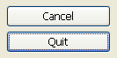

## Botão predefinido

The default button property designates the button that gets the initial focus at runtime when no button of the form has the [Focusable](properties_Entry.md#focusable) property.

Só pode haver um botão predefinido por página de formulário.

In addition, on macOS, the default button property modifies the button's appearance in order to indicate a "recommended choice" to the user. O botão padrão pode diferir do botão selecionado. Os botões predefinidos têm um aspeto azul específico no macOS:

> O botão tem de ter uma altura padrão para obter o aspeto de botão predefinido.

On Windows, the concept of "recommended choice" is not supported: only the focused button has a different appearance at runtime. However, in the 4D form editor, the default button is represented with a blue outline:

#### Gramática JSON

| Nome | Tipo de dados | Valores possíveis |
| ---- | ------------- | ----------------- |
|      |               |                   |
 defaultButton|booléen|true, false |

#### Objectos suportados

[Regular Button](button_overview.md#regular) - [Flat Button](button_overview.md#regular)

---

## Esconder retangulo foco

Durante a execução, um campo ou qualquer área introduzível é delineado por um retângulo de seleção quando tem o foco (através da tecla Tab ou de um único clique). Pode ocultar este retângulo ativando esta propriedade. Hiding the focus rectangle may be useful in the case of specific interfaces.

#### Gramática JSON

| Nome          | Tipo de dados | Valores possíveis |
| ------------- | ------------- | ----------------- |
| hideFocusRing | boolean       | true, false       |

#### Objectos suportados

[4D Write Pro area](writeProArea_overview.md) - [Hierarchical List](list_overview.md) - [Input](input_overview.md) - [List Box](listbox_overview.md) - [Subform](subform_overview.md)

---

## Esconder ressalte seleção

`List boxes de tipo de seleção`

Esta propriedade é utilizada para desativar o realce de seleção nos list boxes.

When this option is enabled, the selection highlight is no longer visible for selections made in list boxes. Selections themselves are still valid and work in exactly the same way as previously; however, they are no longer represented graphically onscreen, and you will need to [define their appearance programmatically](listbox_overview.md#customizing-appearance-of-selected-rows).

Por defeito, esta opção não está activada.

#### Gramática JSON

| Nome                | Tipo de dados | Valores possíveis |
| ------------------- | ------------- | ----------------- |
| hideSystemHighlight | boolean       | true, false       |

#### Objectos suportados

[List Box](listbox_overview.md)

---

## Altura linha

An interface tool allowing the user to move the viewing area to the left or right.

Valores disponíveis:

| Lista de propriedades | Valor JSON  | Descrição                                                                                                                                                |
| --------------------- | ----------- | -------------------------------------------------------------------------------------------------------------------------------------------------------- |
| Sim                   | "visible"   | The scrollbar is always visible, even when it is not necessary (in other words, when the size of the object contents is smaller than that of the frame). |
| Não                   | "hidden"    | A barra de deslocação nunca é visível                                                                                                                    |
| Automático            | "automatic" | The scrollbar appears automatically whenever necessary and the user can enter text larger than the object width                                          |

> Picture objects can have scrollbars when the display format of the picture is set to “Truncated (non-centered).”

#### Gramática JSON

| Nome                | Tipo de dados | Valores possíveis                |
| ------------------- | ------------- | -------------------------------- |
| scrollbarHorizontal | text          | "visible", "hidden", "automatic" |

#### Objectos suportados

[Hierarchical List](list_overview.md#overview) - [Subform](subform_overview.md#overview) - [List Box](listbox_overview.md#overview) - [Input](input_overview.md) - [4D Write Pro area](writeProArea_overview.md)

#### Veja também

[Barra de deslocação vertical](#vertical-scroll-bar)

---

## Resolução

Define a resolução do ecrã para o conteúdo da área 4D Write Pro. By default, it is set to 72 dpi (macOS), which is the standard resolution for 4D forms on all platforms. Setting this property to 96 dpi will set a windows/web rendering on both macOS and Windows platforms. Setting this property to **automatic** means that document rendering will differ between macOS and Windows platforms.

#### Gramática JSON

| Nome | Tipo de dados | Valores possíveis |
| ---- | ------------- | ----------------- |
|      |               |                   |
 dpi|number|0=automatic, 72, 96 |

#### Objectos suportados

[Área 4D Write Pro](writeProArea_overview.md)

---

## Mostrar fundo

Apresenta/oculta as imagens de fundo e a cor de fundo.

#### Gramática JSON

| Nome | Tipo de dados | Valores possíveis |
| ---- | ------------- | ----------------- |
|      |               |                   |
 showBackground|boolean|true (padrão), false|

#### Objectos suportados

[Área 4D Write Pro](writeProArea_overview.md)

---

## Mostrar rodapés

Apresenta/oculta os rodapés quando o [modo de visualização da página](#view-mode) está definido como "Página".

#### Gramática JSON

| Nome | Tipo de dados | Valores possíveis |
| ---- | ------------- | ----------------- |
|      |               |                   |
 showFooters|boolean|true (por padrão), false|

#### Objectos suportados

[Área 4D Write Pro](writeProArea_overview.md)

---

## Mostrar barra de fórmulas

Quando activada, a barra de fórmulas é visível por baixo da interface da barra de ferramentas na área 4D View Pro. Se não estiver selecionada, a barra de fórmulas fica oculta.

> This property is available only for the [Toolbar](#user-interface) interface.

#### Gramática JSON

| Nome | Tipo de dados | Valores possíveis |
| ---- | ------------- | ----------------- |
|      |               |                   |
 withFormulaBar|boolean|true (padrão), false|

#### Objectos suportados

[Área 4D View Pro](viewProArea_overview.md)

---

## Mostrar cabeçalhos

Displays/hides the headers when [Page view mode](#view-mode) is set to "Page".

#### Gramática JSON

| Nome | Tipo de dados | Valores possíveis |
| ---- | ------------- | ----------------- |
|      |               |                   |
 showHeaders|boolean|true (padrão), false|

#### Objectos suportados

[Área 4D Write Pro](writeProArea_overview.md)

---

## Mostrar caracteres ocultos

Apresenta/oculta caracteres invisíveis

#### Gramática JSON

| Nome | Tipo de dados | Valores possíveis |
| ---- | ------------- | ----------------- |
|      |               |                   |
 showHiddenChars|boolean|true (padrão), false|

#### Objectos suportados

[Área 4D Write Pro](writeProArea_overview.md)

---

## Mostrar régua horizontal

Displays/hides the horizontal ruler when the document view is in [Page mode](#view-mode).

#### Gramática JSON

| Nome | Tipo de dados | Valores possíveis |
| ---- | ------------- | ----------------- |
|      |               |                   |
 showHorizontalRuler|boolean|true (padrão), false|

#### Objectos suportados

[Área 4D Write Pro](writeProArea_overview.md)

---

## Mostrar HTML WYSYWIG

Enables/disables the HTML WYSIWYG view, in which any 4D Write Pro advanced attributes which are not compliant with all browsers are removed.

#### Gramática JSON

| Nome | Tipo de dados | Valores possíveis |
| ---- | ------------- | ----------------- |
|      |               |                   |
 showHTMLWysiwyg|boolean|true, false (padrão)|

#### Objectos suportados

[Área 4D Write Pro](writeProArea_overview.md)

---

## Mostrar moldura da página

Displays/hides the page frame when [Page view mode](#view-mode) is set to "Page".

#### Gramática JSON

| Nome | Tipo de dados | Valores possíveis |
| ---- | ------------- | ----------------- |
|      |               |                   |
 showPageFrames|boolean|true, false|

#### Objectos suportados

[Área 4D Write Pro](writeProArea_overview.md)

---

## Mostrar referências

Displays all 4D expressions inserted in the 4D Write Pro document as *references*. When this option is disabled, 4D expressions are displayed as *values*. By default when you insert a 4D field or expression, 4D Write Pro computes and displays its current value. Select this property if you wish to know which field or expression is displayed. The field or expression references then appear in your document, with a gray background.

For example, you have inserted the current date along with a format, the date is displayed:

Com a propriedade Mostrar as referências ativada, a referência é apresentada:

> 4D expressions can be inserted using the `ST INSERT EXPRESSION` command.

#### Gramática JSON

| Nome | Tipo de dados | Valores possíveis |
| ---- | ------------- | ----------------- |
|      |               |                   |
 showReferences|booléen|true, false (par défaut)|

#### Objectos suportados

[Área 4D Write Pro](writeProArea_overview.md)

---

## Mostrar régua vertical

Displays/hides the vertical ruler when the document view is in [Page mode](#view-mode).

#### Gramática JSON

| Nome | Tipo de dados | Valores possíveis |
| ---- | ------------- | ----------------- |
|      |               |                   |
 showVerticalRuler|boolean|true (padrão), false|

#### Objectos suportados

[Área 4D Write Pro](writeProArea_overview.md)

---

## Tab Control Direction

You can set the direction of tab controls in your forms. This property is available on all the platforms but can only be displayed in macOS. You can choose to place the tab controls on top (standard) or on the bottom.

When tab controls with a custom direction are displayed under Windows, they automatically return to the standard direction (top).

#### Gramática JSON

| Nome | Tipo de dados | Valores possíveis |
| ---- | ------------- | ----------------- |
|      |               |                   |
 labelsPlacement|boolean|"top", "bottom" |

#### Objectos suportados

[Tab Control](tabControl.md)

---

## Interface do usuário

You can add an interface to 4D View Pro areas to allow end users to perform basic modifications and data manipulations. 4D View Pro offers two optional interfaces to choose from, **Ribbon** and **Toolbar**.

#### Gramática JSON

| Nome | Tipo de dados | Valores possíveis |
| ---- | ------------- | ----------------- |
|      |               |                   |
 userInterface|text|"none" (padrão), "ribbon", "toolbar" |

#### Objectos suportados

[Área 4D View Pro](viewProArea_overview.md)

#### Veja também

[guia de referência 4D View Pro](https://doc.4d.com/4Dv18/4D/18/4D-View-Pro-Reference.100-4522233.en.html)

---

## Barra rolagem vertical

An interface tool allowing the user to move the viewing area up and down.

Valores disponíveis:

| Lista de propriedades | Valor JSON  | Descrição                                                                                                                                                |
| --------------------- | ----------- | -------------------------------------------------------------------------------------------------------------------------------------------------------- |
| Sim                   | "visible"   | The scrollbar is always visible, even when it is not necessary (in other words, when the size of the object contents is smaller than that of the frame). |
| Não                   | "hidden"    | A barra de deslocação nunca é visível                                                                                                                    |
| Automático            | "automatic" | The scrollbar appears automatically whenever necessary (in other words, when the size of the object contents is greater than that of the frame)          |

> Picture objects can have scrollbars when the display format of the picture is set to “Truncated (non-centered).”

> If a text input object does not have a scroll bar, the user can scroll the information using the arrow keys.

#### Gramática JSON

| Nome              | Tipo de dados | Valores possíveis                |
| ----------------- | ------------- | -------------------------------- |
| scrollbarVertical | text          | "visible", "hidden", "automatic" |

#### Objectos suportados

[Hierarchical List](list_overview.md#overview) - [Subform](subform_overview.md#overview) - [List Box](listbox_overview.md#overview) - [Input](input_overview.md) - [4D Write Pro area](writeProArea_overview.md)

#### Veja também

[Barra de deslocação horizontal](#horizontal-scroll-bar)

---

## Modo de visualização

Sets the mode for displaying the 4D Write Pro document in the form area. Há três valores disponíveis:

- **Page**: the most complete view mode, which includes page outlines, orientation, margins, page breaks, headers and footers, etc.
- **Draft**: draft mode with basic document properties
- **Embedded**: view mode suitable for embedded areas; it does not display margins, footers, headers, page frames, etc. This mode can also be used to produce a web-like view output (if you also select the [96 dpi resolution](#resolution) and the [Show HTML WYSIWYG](#show-html-wysiwyg) properties). This mode can also be used to produce a web-like view output (if you also select the [96 dpi resolution](#resolution) and the [Show HTML WYSIWYG](#show-html-wysiwyg) properties).

> A propriedade Mode vista só é utilizada para a renderização no ecrã. Regarding printing settings, specific rendering rules are automatically used.

#### Gramática JSON

| Nome | Tipo de dados | Valores possíveis |
| ---- | ------------- | ----------------- |
|      |               |                   |
 layoutMode|texte|"page", "draft", "embedded"|

#### Objectos suportados

[Área 4D Write Pro](writeProArea_overview.md)

---

## Zoom

Sets the zoom percentage for displaying 4D Write Pro area contents.

#### Gramática JSON

| Nome | Tipo de dados | Valores possíveis |
| ---- | ------------- | ----------------- |
|      |               |                   |
 zoom|número|mínimo = 0 |

#### Objectos suportados

[Área 4D Write Pro](writeProArea_overview.md)
