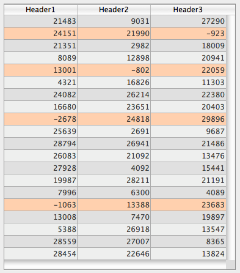
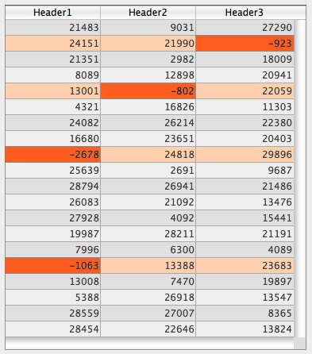

## Cor de fundo alternado

Allows setting a different background color for odd-numbered rows/columns in a list box. By default, *Automatic* is selected: the column uses the alternate background color set at the list box level.

#### Gramática JSON

| Nome          | Tipo de dados | Valores possíveis                              |
| ------------- | ------------- | ---------------------------------------------- |
| alternateFill | string        | qualquer valor css; "transparent"; "automatic" |

#### Objectos suportados

[List Box](listbox_overview.md#overview) - [Coluna List Box](listbox_overview.md#list-box-columns)

---

## Cor de fundo / Cor de preenchimento

Define a cor de fundo de um objeto.

In the case of a list box, by default *Automatic* is selected: the column uses the background color set at the list box level.

#### Gramática JSON

| Nome | Tipo de dados | Valores possíveis                              |
| ---- | ------------- | ---------------------------------------------- |
| fill | string        | qualquer valor css; "transparent"; "automatic" |

#### Objectos suportados

[Hierarchical List](list_overview.md) - [List Box](listbox_overview.md) - [List Box Column](listbox_overview.md#list-box-columns) - [List Box Footer](listbox_overview.md#list-box-footers) - [Oval](shapes_overview.md#oval) - [Rectangle](shapes_overview.md#rectangle) - [Text Area](text.md)

#### Veja também

[Transparente](#transparent)

---

## Expressão cor de fundo

`List box de tipo coleção e seleção de entidades`

An expression or a variable (array variables cannot be used) to apply a custom background color to each row of the list box. The expression or variable will be evaluated for each row displayed and must return a RGB color value. Para obter mais informações, consulte a descrição do comando [`OBJECT SET RGB COLORS`](https://doc.4d.com/4dv20/help/command/en/page628.html) no manual *Linguajem 4D*.

You can also set this property using the [`LISTBOX SET PROPERTY`](https://doc.4d.com/4dv20/help/command/en/page1440.html) command with `lk background color expression` constant.
> With collection or entity selection type list boxes, this property can also be set using a [Meta Info Expression](properties_Text.md#meta-info-expression).

#### Gramática JSON

| Nome          | Tipo de dados | Valores possíveis                             |
| ------------- | ------------- | --------------------------------------------- |
| rowFillSource | string        | Uma expressão que retorna um valor de cor RGB |

#### Objectos suportados

[List Box](listbox_overview.md#overview) - [Coluna List Box](listbox_overview.md#list-box-columns)

---

## Estilo borda linha

Permite definir um estilo padrão para o contorno do objeto.

#### Gramática JSON

| Nome        | Tipo de dados | Valores possíveis                                                 |
| ----------- | ------------- | ----------------------------------------------------------------- |
| borderStyle | text          | "system", "none", "solid", "dotted", "raised", "sunken", "double" |

#### Objectos suportados

[4D View Pro Area](viewProArea_overview.md) - [4D Write Pro areas](writeProArea_overview.md) - [Buttons](button_overview.md) - [Button Grid](buttonGrid_overview.md) - [Hierarchical List](list_overview.md#overview) - [Input](input_overview.md) - [List Box](listbox_overview.md#overview) - [Picture Button](pictureButton_overview.md) - [Picture Pop-up Menu](picturePopupMenu_overview.md) - [Plug-in Area](pluginArea_overview.md#overview) - [Progress Indicator](progressIndicator.md) - [Ruler](ruler.md) - [Spinner](spinner.md) - [Stepper](stepper.md) - [Subform](subform_overview.md#overview) - [Text Area](text.md) - [Web Area](webArea_overview.md#overview)

---

## Tipo de linha pontilhada

Descreve o tipo de linha pontilhada como uma sequência de pontos pretos e brancos.

#### Gramática JSON

| Nome            | Tipo de dados               | Valores possíveis                                                                |
| --------------- | --------------------------- | -------------------------------------------------------------------------------- |
| strokeDashArray | arrays numéricos ou strings | Ex. Ex. Ex. "6 1" or \[6,1\] for a sequence of 6 black point and 1 white point |

#### Objectos suportados

[Retângulo](shapes_overview.md#rectangle) - [Oval](shapes_overview.md#oval) - [Linha](shapes_overview.md#line)

---

## Esconder linhas em branco extras

Controls the display of extra blank rows added at the bottom of a list box object. Por defeito, 4D adiciona essas linhas extra para preencher a área vazia:


Pode remover estas linhas vazias selecionando esta opção. A parte inferior do objeto do list box é deixada em branco:


#### Gramática JSON

| Nome               | Tipo de dados | Valores possíveis |
| ------------------ | ------------- | ----------------- |
| hideExtraBlankRows | boolean       | true, false       |

#### Objectos suportados

[List Box](listbox_overview.md#overview)

---

## Cor da linha

Designa a cor das linhas do objeto. A cor pode ser especificada por:

* um nome de cor - como "red"
* um valor HEX - como "#ff0000"
* um valor RGB - como "rgb(255,0,0)"

Você também pode definir essa propriedade usando o comando [`OBJECT SET RGB COLORS`](https://doc.4d.com/4dv20/help/command/en/page628.html).

#### Gramática JSON

| Nome   | Tipo de dados | Valores possíveis                        |
| ------ | ------------- | ---------------------------------------- |
| stroke | string        | um valor css, "transparent", "automatic" |

> This property is also available for text based objects, in which case it designates both the font color and the object's lines, see [Font color](properties_Text.md#font-color).

#### Objectos suportados

[Line](shapes_overview.md#line) - [Oval](shapes_overview.md#oval) - [Rectangle](shapes_overview.md#rectangle)

---

## Largura da linha

Designa a espessura de uma linha.

#### Gramática JSON

| Nome        | Tipo de dados | Valores possíveis                                                                     |
| ----------- | ------------- | ------------------------------------------------------------------------------------- |
| strokeWidth | number        | 0 para a largura mais pequena num formulário impresso, ou qualquer valor inteiro < 20 |

#### Objectos suportados

[Line](shapes_overview.md#line) - [Oval](shapes_overview.md#oval) - [Rectangle](shapes_overview.md#rectangle)

---

## Array controle linha

`List box de tipo array`

O nome de um array para aplicar uma cor de fundo personalizada para cada linha ou coluna da list box.

Deve ser introduzido o nome de um array Longint. Cada elemento deste array corresponde a uma linha do list box (se aplicada o list box) ou a uma célula da coluna (se aplicada a uma coluna), pelo que o array deve ter o mesmo tamanho que o array associado à coluna. Você pode usar as constantes do tema [SET RGB COLORS](https://doc.4d.com/4Dv20/4D/20.1/SET-RGB-COLORS.302-6481080.en.html). If you want the cell to inherit the background color defined at the higher level, pass the value -255 to the corresponding array element.

For example, given a list box where the rows have an alternating gray/light gray color, defined in the properties of the list box. A background color array has also been set for the list box in order to switch the color of rows where at least one value is negative to light orange:

```4d
 <>_BgndColors{$i}:=0x00FFD0B0 // laranja
 <>_BgndColors{$i}:=-255 // valor por defeito
```



De seguida, deve colorir as células com valores negativos a laranja-escuro. To do this, you set a background color array for each column, for example `<>_BgndColor_1`, `<>_BgndColor_2` and `<>_BgndColor_3`. The values of these arrays have priority over the ones set in the list box properties as well as those of the general background color array:

```4d
 <>_BgndColorsCol_3{2}:=0x00FF8000 // laranja escura
 <>_BgndColorsCol_2{5}:=0x00FF8000
 <>_BgndColorsCol_1{9}:=0x00FF8000
 <>_BgndColorsCol_1{16}:=0x00FF8000
```



You can get the same result using the [`LISTBOX SET ROW FONT STYLE`](https://doc.4d.com/4dv20/help/command/en/page1268.html) and [`LISTBOX SET ROW COLOR`](https://doc.4d.com/4dv20/help/command/en/page1270.html) commands. They have the advantage of letting you skip having to predefine style/color arrays for the columns: instead they are created dynamically by the commands.

#### Gramática JSON

| Nome          | Tipo de dados | Valores possíveis           |
| ------------- | ------------- | --------------------------- |
| rowFillSource | string        | O nome de um array longint. |

#### Objectos suportados

[List Box](listbox_overview.md) - [List Box Column](listbox_overview.md#list-box-columns)

---

## Transparente

Define o fundo do list box como "Transparent". When set, any [alternate background color](#alternate-background-color) or [background color](#background-color-fill-color) defined for the column is ignored.

#### Gramática JSON

| Nome | Tipo de dados | Valores possíveis |
| ---- | ------------- | ----------------- |
| fill | text          | "transparent"     |

#### Objectos suportados

[List Box](listbox_overview.md#overview)

#### Veja também

[Cor de fundo / Cor de preenchimento](#background-color-fill-color)
