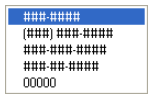
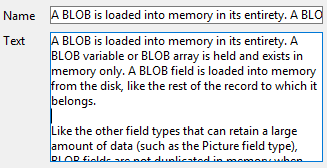

---

## Formato Alfa

Os formatos alfa controlam a forma como os campos alfanuméricos e variáveis aparecem quando exibidos ou impressos. Segue uma lista de formatos fornecidos para campos alfanuméricos:

Pode escolher um formato desta lista ou utilizar qualquer formato personalizado. A lista padrão contém formatos para alguns dos campos alfa mais comuns que requerem formatos: números de telefone dos EUA (distância local e interurbano), Números de segurança social e cep americano. Você também pode inserir um nome de formato personalizado definido no editor Filtros e formatos da caixa de ferramentas. Neste caso, o formato não pode ser modificado nas propriedades do objeto. Todos os formatos ou filtros personalizados que você tiver criado estarão automaticamente disponíveis, precedidos por uma barra vertical (|).

O sinal de número (#) é o espaço reservado para um formato de exibição alfanumérico. Você pode incluir os traços, hífens, espaços e quaisquer outros sinais de pontuação apropriados que deseja exibir. Você usa os sinais de pontuação desejados e o sinal de número para cada caractere que quiser exibir.

Por exemplo, considere um número de peça com um formato como "RB-1762-1".

O formato alfa seria:

 ##-####-#

Quando o usuário introduz "RB17621", o campo é apresentado:

 RB-1762-1

O campo contém efetivamente "RB17621".

Se o usuário inserir mais caracteres do que o formato permitir, 4D exibe os últimos caracteres. Por exemplo, se o formato for:

 (#######)

e o usuário introduzir "proportion", o campo é apresentado:

 (portion)

O campo contém efetivamente "proportion". 4D aceita e armazena a entrada inteira, independentemente do formato de exibição. Não se perde nenhuma informação.

#### Gramática JSON

| Nome       | Tipo de dados | Valores possíveis                                                                                |
| ---------- | ------------- | ------------------------------------------------------------------------------------------------ |
| textFormat | string        | "####", "(#####) ### ####", "### ### ### ####", "#### ## ####", "00000", formatos personalizados |

#### Objectos suportados

[Lista suspensa](dropdownList_Overview.md) - [Combo Box](comboBox_overview.md) - [Coluna da caixa de listagem](listbox_overview.md#list-box-columns) - [Rodapé da caixa de listagem](listbox_overview.md#list-box-footers)

---

## Formato de Data

Os formatos de data controlam como as datas aparecem quando são apresentadas ou impressas. Para a entrada de dados, as datas são inseridas no formato MM/DD/AAAA, independentemente do formato de exibição escolhido.
> Unlike [Alpha](#alpha-format) and [Number](#number-format) formats, display formats for dates must only be selected among the 4D built-in formats.

A tabela seguinte apresenta as opções disponíveis:

| Nome do formato                 | Cadeia JSON          | Exemplo (sistema americano)       |
| ------------------------------- | -------------------- | --------------------------------- |
| System date short               | systemShort (padrão) | 03/25/20                          |
| System date abbreviated *(1)*   | systemMedium         | Wed, Mar 25, 2020                 |
| System date long                | systemLong           | Quarta-feira, 25 de março de 2020 |
| RFC 822                         | rfc822               | Tue, 25 Mar 2020 22:00:00 GMT     |
| Short Century                   | shortCentury         | 25/03/20 mas 25/04/2032 *(2)*     |
| Internal date long              | long                 | March 25, 2020                    |
| Internal date abbreviated *(1)* | abbreviated          | Mar 25, 2020                      |
| Internal date short             | short                | 03/25/2020                        |
| ISO Date Time *(3)*             | iso8601              | 2020-03-25T00:00:00               |

*(1)* Para evitar ambiguidade e de acordo com a prática atual, os formatos de data abreviados exibem "jun" para junho e "jul" para julho. Esta particularidade só se aplica às versões francesas de 4D.

*(2)* O ano é exibido com dois dígitos quando pertence ao intervalo (1930;2029); caso contrário, será exibido com quatro dígitos. Esse é o padrão, mas pode ser modificado com o comando [SET DEFAULT CENTURY](https://doc.4d.com/4Dv17R6/4D/17-R6/SET-DEFAULT-CENTURY.301-4311596.en.html) .

*(3)* O formato `ISO Date Time` corresponde ao padrão XML de representação de data e hora (ISO8601). Seu principal objetivo é ser usado na importação/exportação de dados em formato XML e em serviços da Web.
> Independentemente do formato de exibição, se o ano for inserido com dois dígitos, o 4D assume que o século é o 21º se o ano pertencer ao intervalo (00;29) e o 20º se pertencer ao intervalo (30;99). Esta é a configuração padrão, mas pode ser modificada usando o comando [SET DEFAULT CENTURY](https://doc.4d.com/4Dv17R6/4D/17-R6/SET-DEFAULT-CENTURY.301-4311596.en.html).

#### Gramática JSON

| Nome       | Tipo de dados | Valores possíveis                                                                                                                                                                    |
| ---------- | ------------- | ------------------------------------------------------------------------------------------------------------------------------------------------------------------------------------ |
| dateFormat | string        | "systemShort", "systemMedium", "systemLong", "iso8601", "rfc822", "short", "shortCentury", "abbreviated", "long", "blankIfNull" (pode ser combinado com os outros valores possíveis) |

#### Objectos suportados

[Combo Box](comboBox_overview.md) - [Drop-down List](dropdownList_Overview.md) - [Input](input_overview.md) - [List Box Column](listbox_overview.md#list-box-columns) - [List Box Footer](listbox_overview.md#list-box-footers)

---

## Formato do número
> Os campos de número incluem os tipos Integer, Long integer, Integer 64 bits, Real e Float.

Os formatos de números controlam a forma como os números aparecem quando exibidos ou impressos. Para a entrada de dados, você insere apenas os números (incluindo um ponto decimal ou sinal de menos, se necessário), independentemente do formato de exibição escolhido.

4D fornece vários formatos de números padrão.

### Marcadores

Em cada um dos formatos de exibição de números, o sinal de número (#), o zero (0), o acento circunflexo (^) e o asterisco (*) são usados como espaços reservados. Você cria seus próprios formatos de números usando um espaço reservado para cada dígito que espera exibir.

| Placeholder (valores provisórios) | Efeito do zero à esquerda ou à direita |
| --------------------------------- | -------------------------------------- |
| #                                 | Não apresenta nada                     |
| 0                                 | Mostra 0                               |
| ^                                 | Apresenta um espaço (1)                |
| *                                 | Apresenta um asterisco                 |

(1) O acento circunflexo (^) gera um caractere de espaço que ocupa a mesma largura de um dígito na maioria das fontes.

Por exemplo, se quiser exibir números de três dígitos, pode usar o formato ####. Se o usuário inserir mais dígitos do que o formato permite, 4D exibe <<< no campo para indicar que foram inseridos mais dígitos do que o número de dígitos especificado no formato de exibição.

Se o usuário digitar um número negativo, o caractere mais à esquerda será exibido como um sinal de menos (a menos que um formato de exibição negativo tenha sido especificado). Se ##0 for o formato, menos 26 será exibido como -26 e menos 260 será exibido como <<< porque o sinal de menos ocupa um espaço reservado e há apenas três espaços reservados.
> Independentemente do formato de exibição, 4D aceita e armazena o número inserido no campo. Não se perde nenhuma informação.

Cada caractere de espaço reservado tem um efeito diferente na exibição de zeros à esquerda ou à direita. Um zero à esquerda é um zero que começa um número antes do ponto decimal; um zero à direita é um zero que termina um número após o ponto decimal.

Suponha que utiliza o formato ##0 para mostrar três dígitos. Se o utilizador não introduzir nada no campo, o campo apresenta 0. Se o usuário introduzir 26, o campo apresenta 26.

### Caracteres separadores

Os formatos de exibição numérica (exceto para notações científicas) são automaticamente baseados nos parâmetros do sistema regional. 4D substitui os caracteres "." e ",", respectivamente, pelo separador decimal e pelo separador de milhar definido no sistema operacional. O ponto e a vírgula são, portanto, considerados caracteres de espaço reservado, seguindo o exemplo de 0 ou #.
> No Windows, ao usar a tecla de separação decimal do teclado numérico, 4D faz uma distinção dependendo do tipo de campo onde o cursor está localizado:
> 
> * em um campo do tipo Real, o uso dessa chave inserirá o separador decimal definido no sistema,
> * em qualquer outro tipo de campo, essa chave insere o caractere associado à chave, geralmente um ponto (.) ou uma vírgula (,).

### Pontos decimais e outros caracteres de visualização

É possível utilizar um ponto decimal num formato de apresentação de números. Se quiser que o decimal seja exibido independentemente de o usuário digitá-lo, ele deverá ser colocado entre zeros.

Pode utilizar quaisquer outros caracteres no formato. Quando usados isoladamente, ou colocados antes ou depois de espaços reservados, os caracteres sempre aparecem. Por exemplo, se utilizar o seguinte formato:

 $##0

um cifrão sempre aparece porque é colocado antes dos espaços reservados.

Se os caracteres forem colocados entre espaços reservados, eles aparecerão somente se os dígitos forem exibidos em ambos os lados. Por exemplo, se definir o formato:

 ###.##0

o ponto só aparece se o usuário introduzir pelo menos quatro dígitos.

Os espaços são tratados como caracteres nos formatos de apresentação de números.

### Formatos para positivo, negativo e zero

Um formato de exibição de número pode ter até três partes, o que permite especificar formatos de exibição para valores positivos, negativos e zero. Você especifica as três partes separando-as com ponto e vírgula, conforme mostrado abaixo:

 Positivo;Negativo;Zero

Não é necessário especificar as três partes do formato. Se você usar apenas uma parte, o 4D a usará para todos os números, colocando um sinal de menos na frente dos números negativos.

Se você usar duas partes, 4D usará a primeira parte para números positivos e zero e a segunda parte para números negativos. Se você usar três partes, a primeira será para números positivos, a segunda para números negativos e a terceira para zero.
> A terceira parte (zero) não é interpretada e não aceita caracteres de substituição. Se você digitar `###;###;#`, o valor zero será exibido como "#". Por outras palavras, o que é realmente introduzido é o que será apresentado para o valor zero.

Aqui está um exemplo de um formato de exibição de números que mostra cifrões e vírgulas, coloca valores negativos entre parênteses e não exibe zeros:

 $###,##0.00;($###,##0.00);

Observe que a presença do segundo ponto e vírgula instrui o 4D a usar nothing para exibir zero. O formato a seguir é semelhante, exceto pelo fato de que a ausência do segundo ponto e vírgula instrui o 4D a usar o formato de número positivo para zero:

 $###,##0.00;($###,##0.00)

Neste caso, a indicação de zero seria $0,00.

### Notação científica

Se você quiser exibir números em notação científica, use o sinal de adição **** (&) seguido de um número para especificar o número de dígitos que deseja exibir. Por exemplo, se o formato for:

 &3

apresentaria 759,62 como:

 7.60e+2

O formato de notação científica é o único formato que arredonda automaticamente o número exibido. Observe no exemplo acima que o número é arredondado para 7,60e+2 em vez de ser truncado para 7,59e+2.

### Formatos hexadecimais

Você pode exibir um número em hexadecimal usando os seguintes formatos de exibição:

* `&x`: Esse formato exibe números hexadecimais usando o formato "0xFFFF".
* `&$`: Este formato exibe números hexadecimais usando o formato “$FFFF”.

### Notação XML

O formato `&xml` tornará um número compatível com as regras padrão XML. Em particular, o caractere separador decimal será um ponto "." em todos os casos, independentemente das configurações do sistema.

### Mostrar um número como hora

Você pode exibir um número como hora (com um formato de hora) usando `&/` seguido de um dígito. Hora é determinada calculando-se o número de segundos desde a meia-noite que o valor representa. O dígito no formato corresponde à ordem em que o formato da hora aparece no menu pendente Formato.

Por exemplo, se o formato for:

 &/5

corresponde ao 5.º formato de hora no menu pop-up, especificamente a hora AM/PM. Um campo numérico com este formato apresentaria 25000 como:

 6:56 AM

### Exemplos

A tabela a seguir mostra como os diferentes formatos afetam a exibição dos números. As três colunas - Positivo, Negativo e Zero - mostram como 1.234,50, -1.234,50 e 0 seriam exibidos.

| Formato Introduzido                    | Positivo         | Negativo      | Zero                         |
| -------------------------------------- | ---------------- | ------------- | ---------------------------- |
| ###                                    | <<<              | <<<           |                              |
| ####                                   | 1234             | <<<<          |                              |
| #######                                | 1234             | -1234         |                              |
| #####.##                               | 1234.5           | -1234.5       |                              |
| ####0.00                               | 1234.50          | -1234.50      | 0.00                         |
| #####0                                 | 1234             | -1234         | 0                            |
| +#####0;–#####0;0                      | +1234            | -1234         | 0                            |
| #####0DB;#####0CR;0                    | 1234DB           | 1234CR        | 0                            |
| #####0;(#####0)                        | 1234             | (1234)        | 0                            |
| ###,##0                                | 1,234            | -1,234        | 0                            |
| ##,##0.00                              | 1,234.50         | -1,234.50     | 0.00                         |
| \^\^\^\^\^\^\^                  | 1234             | -1234         |                              |
| \^\^\^\^\^\^0                    | 1234             | -1234         | 0                            |
| \^\^\^,\^\^0                      | 1,234            | -1,234        | 0                            |
| \^\^,\^\^0.00                      | 1,234.50         | -1,234.50     | 0.00                         |
| \*\*\*\*\*\*\*           | \*\*\*1234 | \*\*-1234 | \*\*\*\*\*\*\* |
| \*\*\**\*\*0               | \*\*\*1234 | \*\*-1234 | \*\*\*\*\*\*0    |
| \*\*\*,*\*0                  | \*\*1,234    | \*-1,234    | \*\*\*\*\*\*0    |
| \*\*,\*\*0.00                  | \*1,234.50     | -1,234.50     | \*\*\*\*\*0.00     |
| $\*,\*\*0.00;–$\*,\*\*0.00 | $1,234.50        | -$1,234.50    | $\*\*\*\*0.00        |
| $\^\^\^\^0                         | $ 1234           | $–1234        | $    0                       |
| $\^\^\^0;–$\^\^\^0               | $1234            | –$1234        | $   0                        |
| $\^\^\^0 ;($\^\^\^0)             | $1234            | ($1234)       | $   0                        |
| $\^,\^\^0.00 ;($\^,\^\^0.00)     | $1,234.50        | ($1,234.50)   | $    0.00                    |
| &2                                     | 1.2e+3           | -1.2e+3       | 0.0e+0                       |
| &5                                     | 1.23450e+3       | -1.23450e+3   | 0.00000                      |
| &xml                                   | 1234.5           | -1234.5       | 0                            |

#### Gramática JSON

| Nome         | Tipo de dados | Valores possíveis                                                     |
| ------------ | ------------- | --------------------------------------------------------------------- |
| numberFormat | string        | Números (incluindo um ponto decimal ou sinal de menos, se necessário) |

#### Objectos suportados

[Combo Box](comboBox_overview.md) - [Lista suspensa](dropdownList_Overview.md) - [Entrada](input_overview.md) - [Coluna da caixa de listagem](listbox_overview.md#list-box-columns) - [Rodapé da caixa de listagem](listbox_overview.md#list-box-footers) - [Indicadores de progresso](progressIndicator.md)

---

## Formato imagem

Os formatos imagem controlam a aparência das imagens quando exibidas ou impressas. Para a entrada de dados, o usuário sempre insere imagens colando-as da área de transferência ou arrastando e soltando, independentemente do formato de exibição.

As opções de truncagem e escala não afetam a imagem em si. O conteúdo de um campo Imagem é sempre guardado. Somente a exibição no formulário específico é afetada pelo formato de exibição de imagem.

### Escalado para caber

`Gramática JSON: "scaled"`

O formato **Scaled to fit** faz com que o 4D redimensione a imagem para se ajustar às dimensões da área.

### Truncado (centrado e não centrado)

`Gramática JSON: "truncatedCenter" / "truncatedTopLeft"`

O formato **Truncated (centered)** faz com que o 4D centralize a imagem na área e corte qualquer parte que não caiba na área. 4D corta igualmente de cada borda e da parte superior e inferior.

O formato **Truncado (não centrado)** faz com que 4D coloque o canto superior esquerdo da imagem no canto superior esquerdo da área e recorte qualquer parte que não caiba na área. 4D corta da direita e de baixo para cima.
> Quando o formato da imagem for **Truncado (não centrado)**, é possível adicionar barras de deslocamento à área de entrada.

### Escalado para caber (proporcional) e Escalado para caber centrado (proporcional)

`Gramática JSON: "proportionalTopLeft" / "proportionalCenter"`

Quando você usa **Scaled to fit (proportional)**, a imagem é reduzida proporcionalmente em todos os lados para se ajustar à área criada para a imagem. A opção **Scaled to fit centered (proportional)** faz o mesmo, mas centraliza a imagem na área da imagem.

Se a imagem for menor do que a área definida no formulário, ela não será modificada. Se a imagem for maior do que a área definida no formulário, ela será reduzida proporcionalmente. Uma vez que é proporcionalmente reduzida, a imagem não aparece distorcida.

Se você tiver aplicado o formato **Scaled to fit centered (proportional)** , a imagem também será centralizada na área:

### Replicado

`Gramática JSON: "tiled"`

Quando a área que conter uma imagem com o formato **Replicated** for ampliada, a imagem não é deformada, mas é replicada tantas vezes quantas as necessárias para preencher totalmente a área.

Se o campo for reduzido para um tamanho inferior ao da imagem original, a imagem é truncada (não centrada).

#### Gramática JSON

| Nome          | Tipo de dados | Valores possíveis                                                                                     |
| ------------- | ------------- | ----------------------------------------------------------------------------------------------------- |
| pictureFormat | string        | "truncatedTopLeft", "scaled", "truncatedCenter", "tiled", "proportionalTopLeft", "proportionalCenter" |

#### Objectos suportados

[Entrada](input_overview.md) - [Coluna da caixa de listagem](listbox_overview.md#list-box-columns) - [Rodapé da caixa de listagem](listbox_overview.md#list-box-footers)

---

## Formato Hora

Os formatos de hora controlam a forma como as horas aparecem quando são apresentadas ou impressas. Para a entrada de dados, você insere as horas no formato HH:MM:SS de 24 horas ou no formato AM/PM de 12 horas HH:MM:SS, independentemente do formato de exibição escolhido.
> Unlike [Alpha](#alpha-format) and [Number](#number-format) formats, display formats for times must only be selected among the 4D built-in formats.

A tabela abaixo mostra os formatos de exibição do campo Hora e dá exemplos:

| Nome do formato              | Cadeia JSON  | Comentários                                                                                                                                                 | Exemplo para 04:30:25          |
| ---------------------------- | ------------ | ----------------------------------------------------------------------------------------------------------------------------------------------------------- | ------------------------------ |
| HH:MM:SS                     | hh_mm_ss   |                                                                                                                                                             | 04:30:25                       |
| HH:MM                        | hh_mm        |                                                                                                                                                             | 04:30                          |
| Hour Min Sec                 | HH_MM_SS   |                                                                                                                                                             | 4 horas 30 minutos 25 segundos |
| Hour Min                     | HH_MM        |                                                                                                                                                             | 4 horas 30 minutos             |
| HH:MM AM/PM                  | hh_mm_am   |                                                                                                                                                             | 4:30 a.m.                      |
| MM SS                        | mm_ss        | Hora expressa como uma duração de 00:00:00                                                                                                                  | 270:25                         |
| Min Sec                      | MM_SS        | Hora expressa como uma duração de 00:00:00                                                                                                                  | 270 minutos 25 segundos        |
| ISO Date Time                | iso8601      | Corresponde ao padrão XML para representar dados relacionados ao tempo. Ele destina-se principalmente a ser usado ao importar/exportar dados em formato XML | 0000-00-00T04:30:25            |
| System time short            | - (o padrão) | Formato de hora standard definido no sistema                                                                                                                | 04:30:25                       |
| System time long abbreviated | systemMedium | apenas macOS: formato de hora abreviado definido no sistema.  Windows: esse formato é o mesmo que o formato curto da hora do sistema              | 4•30•25 AM                     |
| System time long             | systemLong   | apenas macOS: formato de hora longa definido no sistema.  Windows: esse formato é o mesmo que o formato curto da hora do sistema                  | 4:30:25 AM HNEC                |

#### Gramática JSON

| Nome       | Tipo de dados | Valores possíveis                                                                                                                                                                                            |
| ---------- | ------------- | ------------------------------------------------------------------------------------------------------------------------------------------------------------------------------------------------------------ |
| timeFormat | string        | "systemShort", "systemMedium", "systemLong", "iso8601", "hh_mm_ss", "hh_mm", "hh_mm_am", "mm_ss", "HH_MM_SS", "HH_MM", "MM_SS", "blankIfNull" (pode ser combinado com os outros valores possíveis) |

#### Objectos suportados

[Combo Box](comboBox_overview.md) - [Drop-down List](dropdownList_Overview.md) - [Input](input_overview.md) - [List Box Column](listbox_overview.md#list-box-columns) - [List Box Footer](listbox_overview.md#list-box-footers)

---

## Texto quando False/Texto quando True

Quando uma [expressão booleana](properties_Object.md#expression-type) é apresentada como:

* um texto num [objeto de entrada](input_overview.md)
* a ["popup"](properties_Display.md#display-type) na coluna [lista caixa](listbox_overview.md#list-box-columns),

... pode selecionar o texto a apresentar para cada valor:

* **Texto quando True** - o texto a ser apresentado quando o valor é "true"
* **Texto quando False** - o texto a ser apresentado quando o valor é "false"

#### Gramática JSON

| Nome          | Tipo de dados | Valores possíveis                                                                |
| ------------- | ------------- | -------------------------------------------------------------------------------- |
| booleanFormat | string        | "\<*textWhenTrue*\>;\<*textWhenFalse*\>", por exemplo, "Assigned;Unassigned" |

#### Objectos suportados

[Coluna da caixa de listagem](listbox_overview.md#list-box-columns) - [Entrada](input_overview.md)

---

## Tipo de exibição

Utilizado para associar um formato de visualização aos dados da coluna. Os formatos fornecidos dependem do tipo de variável (caixa de listagem do tipo matriz) ou do tipo de dados/campo (caixas de listagem do tipo seleção e coleção).

As colunas booleanas e numéricas (numéricas ou inteiras) podem ser exibidas como caixas de seleção. Nesse caso, a propriedade [Title](#title) pode ser definida.

As colunas booleanas também podem ser apresentadas como menus pop-up. Neste caso, as propriedades [Text quando False e Text quando True](#text-when-false-text-when-true) devem ser definidas.

#### Gramática JSON

| Nome        | Tipo de dados | Valores possíveis                                  |
| ----------- | ------------- | -------------------------------------------------- |
| controlType | string        | <li>**número de colunas**: "automatic" (padrão) ou "checkbox"</li><li>**colunas booleanas**: "checkbox" (padrão) ou "popup"</li> |

#### Objectos suportados

[Coluna da List Box](listbox_overview.md#list-box-columns)

---

## Não renderizado

Quando essa propriedade está ativada, o objeto não é desenhado no formulário, mas ainda pode ser ativado.

Em particular, esta propriedade permite implementar botões "invisíveis".  Os botões não renderizados podem ser colocados em cima de objetos gráficos. Eles permanecem invisíveis e não são realçados quando clicados, mas sua ação é acionada quando são clicados.

#### Gramática JSON

| Nome    | Tipo de dados | Valores possíveis |
| ------- | ------------- | ----------------- |
| display | boolean       | true, false       |

#### Objectos suportados

[Botão](button_overview.md) - [Lista pendente](dropdownList_Overview.md)

---

## Três Estados

Permite que um objeto de caixa de verificação aceite um terceiro estado. A variável associada à caixa de seleção devolve o valor 2 quando a caixa estiver no terceiro estado.

#### Caixas de verificação de três estados em colunas list box

As colunas da caixa de listagem com um tipo de dados numérico  podem ser exibidas como caixas de seleção de três estados. Se for selecionado, são apresentados os seguintes valores:

* 0 = caixa não assinalada,
* 1 = caixa marcada,
* 2 (ou qualquer valor >0) = caixa semi-marcada (terceiro estado). Para a introdução de dados, este estado devolve o valor 2.
* -1 = caixa de seleção invisível,
* -2 = caixa desmarcada, não editável,
* -3 = caixa marcada, não pode ser introduzida,
* -4 = caixa semi-marcada, não editável

Nesse caso também, a propriedade [Title](#title) também está disponível para que o título da caixa de seleção possa ser inserido.

#### Gramática JSON

| Nome       | Tipo de dados | Valores possíveis |
| ---------- | ------------- | ----------------- |
| threeState | boolean       | true, false       |

#### Objectos suportados

[Caixa de seleção](checkbox_overview.md) - [Caixa de listagem Coluna](listbox_overview.md#list-box-columns)

---

## Título

Esta propriedade está disponível para uma coluna list box se:

* O tipo de coluna  é **boolean** e seu tipo de exibição  é "Check Box"
* o tipo de coluna  é o número **** (numérico ou inteiro) e seu tipo de exibição [e](properties_Display.md#display-type) é "Caixa de seleção de três estados".

Nesse caso, o título da caixa de seleção pode ser inserido usando essa propriedade.

#### Gramática JSON

| Nome         | Tipo de dados | Valores possíveis                                           |
| ------------ | ------------- | ----------------------------------------------------------- |
| controlTitle | string        | Qualquer etiqueta personalizada para a caixa de verificação |

#### Objectos suportados

[Coluna da List Box](listbox_overview.md#list-box-columns)

---

## Truncar com reticências

Controla a exibição de valores quando as colunas da caixa de listagem são muito estreitas para mostrar todo o seu conteúdo.

Essa opção está disponível para colunas com qualquer tipo de conteúdo, exceto imagens e objetos.

* Quando a propriedade está ativada (padrão), se o conteúdo de uma célula da caixa de listagem exceder a largura da coluna, ele será truncado e uma elipse será exibida:

 
> A posição das elipses depende do sistema operativo. No exemplo acima (Windows), ele é adicionado no lado direito do texto. No macOS, as reticências são adicionadas no meio do texto.

* Quando a propriedade estiver desativada, se o conteúdo de uma célula exceder a largura da coluna, ele será simplesmente recortado, sem adição de reticências:

 

A opção Truncar com reticências é ativada por padrão e pode ser especificada com caixas de listagem do tipo Matriz, Seleção ou Coleção.

> Quando aplicada a colunas do tipo Texto, a opção Truncar com reticências só estará disponível se a opção [Wordwrap](#wordwrap) não estiver selecionada. Quando a propriedade Wordwrap é selecionada, o conteúdo extra nas células é tratado por meio dos recursos de quebra de palavras, de modo que a propriedade Truncar com reticências não está disponível.

A propriedade Truncate with ellipsis (Truncar com reticências) pode ser aplicada a colunas do tipo booleano; no entanto, o resultado difere dependendo do formato da célula :

* Para formatos booleanos do tipo pop-up, as etiquetas são truncadas com uma elipse,
* Para formatos booleanos do tipo caixa de verificação, as etiquetas são sempre cortadas.

#### Gramática JSON

| Nome         | Tipo de dados | Valores possíveis      |
| ------------ | ------------- | ---------------------- |
| truncateMode | string        | "withEllipsis", "none" |

#### Objectos suportados

[List Box Column](listbox_overview.md#list-box-columns) - [List Box Footer](listbox_overview.md#list-box-footers)

---

## Visibilidade

Esta propriedade permite ocultar o objeto no ambiente Aplicação.

É possível tratar a propriedade Visibilidade para a maioria dos objetos de formulário. Esta propriedade é principalmente usada para simplificar o desenvolvimento de interfaces dinâmicas. Nesse contexto, muitas vezes é necessário ocultar objetos programaticamente durante o evento `On load` do formulário e, depois, exibir determinados objetos. A propriedade Visibility permite inverter essa lógica, tornando determinados objetos invisíveis por padrão. O desenvolvedor pode programar sua exibição usando o comando [`OBJECT SET VISIBLE`](https://doc.4d.com/4dv19/help/command/en/page603.html) quando necessário.

#### Visibilidade automática em formulários lista

No contexto dos formulários de "lista" do site , a propriedade Visibility suporta dois valores específicos:

* **Se registrar o nome selecionado** (nome JSON: "selectedRows")
* **Se o registro não estiver selecionado** (nome JSON: "unselectedRows")

Essa propriedade é usada somente ao desenhar objetos localizados no corpo de um formulário de lista. Ele informa ao 4D se deve ou não desenhar o objeto, dependendo se o registro que está sendo processado está selecionado/não está selecionado. Ele permite representar uma seleção de registros usando atributos visuais que não sejam cores de destaque:

4D does not take this property into account if the object was hidden using the [`OBJECT SET VISIBLE`](https://doc.4d.com/4dv18/help/command/en/page603.html) command; in this case, the object remains invisible regardless of whether or not the record is selected.

#### Gramática JSON

| Nome         | Tipo de dados | Valores possíveis                                                                                                 |
| ------------ | ------------- | ----------------------------------------------------------------------------------------------------------------- |
| visibilidade | string        | "visible", "hidden", "selectedRows" (somente formulário de lista), "unselectedRows" (somente formulário de lista) |

#### Objectos suportados

[4D View Pro area](viewProArea_overview.md) - [4D Write Pro area](writeProArea_overview.md) - [Button](button_overview.md) - [Button Grid](buttonGrid_overview.md) - [Check Box](checkbox_overview.md) - [Combo Box](comboBox_overview.md) - [Drop-down List](dropdownList_Overview.md) - [Group Box](groupBox.md) - [Hierarchical List](list_overview.md) - [List Box](listbox_overview.md) - [List Box Column](listbox_overview.md#list-box-columns) - [List Box Footer](listbox_overview.md#list-box-footers) - [List Box Header](listbox_overview.md#list-box-headers) - [Picture Button](pictureButton_overview.md) - [Picture Pop-up Menu](picturePopupMenu_overview.md) - [Plug-in Area](pluginArea_overview.md) - [Progress indicator](progressIndicator.md) - [Radio Button](radio_overview.md) - [Spinner](spinner.md) - [Splitter](splitters.md) - [Static Picture](staticPicture.md) - [Stepper](stepper.md) - [Subform](subform_overview.md) - [Tab control](tabControl.md) - [Text Area](text.md) - [Web Area](webArea_overview.md)

---

## Wordwrap

> Para [entrada](input_overview.md) objetos, disponível quando a propriedade [Multiline](properties_Entry.md#multiline) estiver definida como "Sim".

Gerencia a exibição do conteúdo quando ele excede a largura do objeto.

#### Marcado para list box/Sim para entrada

`Gramática JSON: "normal"`

Quando essa opção é selecionada, o texto passa automaticamente para a próxima linha sempre que sua largura exceder a da coluna/área, se a altura da coluna/área permitir.

* Em colunas/áreas de linha única, somente a última palavra que pode ser exibida por completo é exibida. 4D insere retornos de linha; é possível rolar o conteúdo da área pressionando a tecla de seta para baixo.

* Em colunas/áreas com várias linhas, 4D efetua retornos de linha automáticos.

#### Não selecionado para list box/Não para entrada

`Gramática JSON: "none"`

Quando esta opção é selecionada, 4D não faz nenhum retorno automático de linha e a última palavra que pode ser exibida pode ser truncada. Nas áreas de tipo de texto, são suportadas os retornos de carro:

Nas caixas de lista, qualquer texto muito longo é truncado e exibido com uma elipse (...). No exemplo a seguir, a opção Wordwrap é **marcada para a coluna esquerda** e **desmarcada para a coluna direita**:

Observe que, independentemente do valor da opção Wordwrap, a altura da linha não será alterada. Se o texto com quebras de linha não puder ser exibido inteiramente na coluna, ele é truncado (sem uma elipse). No caso de caixas de lista exibindo apenas uma única linha, somente a primeira linha do texto é exibida:

#### Automático para entrada (opção padrão)

`Gramática JSON: "automatic"`

* Em áreas de linha única, palavras localizadas no final das linhas são truncadas e não há retornos de linha.
* Em áreas com várias linhas, 4D efetua retornos automáticos de linha.

#### Gramática JSON

| Nome     | Tipo de dados | Valores possíveis                                 |
| -------- | ------------- | ------------------------------------------------- |
| wordwrap | string        | "automatic" (exceto list box), "normal", "nenhum" |

#### Objectos suportados

[Entrada](input_overview.md) - [Coluna da caixa de listagem](listbox_overview.md#list-box-columns) - [Rodapé da caixa de listagem](listbox_overview.md#list-box-footers)
