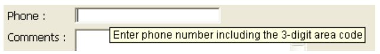

## Dica de Ajuda

Essa propriedade permite associar mensagens de ajuda a objetos ativos em seus formulários. Podem ser apresentados em tempo de execução:

> - O atraso de exibição e a duração máxima das dicas de ajuda podem ser controlados usando os seletores `Tips delay` e `Tips duration` do comando **[SET DATABASE PARAMETER](https://doc.4d.com/4Dv17R5/4D/17-R5/SET-DATABASE-PARAMETER.301-4128139.en.html)**.
> - As dicas de ajuda podem ser desativadas ou ativadas globalmente para o aplicativo usando o seletor Dicas ativadas do comando [**SET DATABASE PARAMETER**](https://doc.4d.com/4Dv17R5/4D/17-R5/SET-DATABASE-PARAMETER.301-4128139.en.html).

Você também pode:

- designa uma dica de ajuda existente, previamente especificada no editor de [dicas de ajuda](https://doc.4d.com/4Dv17R5/4D/17-R5/Help-tips.200-4163423.en.html) do 4D.
- ou introduzir a mensagem de ajuda diretamente como uma cadeia de caracteres. Isto permite-lhe tirar partido da arquitetura XLIFF. Você pode inserir uma referência XLIFF aqui para exibir uma mensagem no idioma da aplicação (para obter mais informações sobre XLIFF, consulte [Apêndice B: Arquitetura XLIFF](https://doc.4d.com/4Dv17R5/4D/17-R5/Appendix-B-XLIFF-architecture.300-4163748.en.html). Você também pode usar referências 4D ([consulte Usando referências em texto estático](https://doc.4d.com/4Dv17R5/4D/17-R5/Using-references-in-static-text.300-4163725.en.html)).
> > > In macOS, displaying help tips is not supported in pop-up type windows.

#### Gramática JSON

|  Nome   | Tipo de dados | Valores possíveis                             |
|:-------:|:-------------:| --------------------------------------------- |
| tooltip |     text      | informações adicionais para ajudar um usuário |

#### Objectos suportados

[Botão](button_overview.md) - [Grade de botões](buttonGrid_overview.md) - [Caixa de seleção](checkbox_overview.md) - [Lista suspensa](dropdownList_Overview.md) - [Combo Box](comboBox_overview.md#overview) - [Lista hierárquica](list_overview.md#overview) - [Cabeçalho Combo Box](listbox_overview.md#list-box-headers) - [Rodapé Combo Box](listbox_overview.md#list-box-footers) - [Botão imagem](pictureButton_overview.md) - [Menu pop-up imagem](picturePopupMenu_overview.md) - [Botão rádio](radio_overview.md)

#### Outras funcionalidades de ajuda

Você também pode associar mensagens de ajuda a objetos de formulário de duas outras maneiras:

- ao nível da estrutura da base de dados (apenas campos). Neste caso, a dica de ajuda do campo é apresentada em todos os formulários em que aparece. Para obter mais informações, consulte "Dicas de ajuda" em [Propriedades de campos](https://doc.4d.com/4Dv17R5/4D/17-R5/Field-properties.300-4163580.en.html).
- utilizando o comando **[OBJECT SET HELP TIP](https://doc.4d.com/4Dv17R5/4D/17-R5/OBJECT-SET-HELP-TIP.301-4128221.en.html)**, para o processo atual.

Quando diferentes dicas são associadas ao mesmo objeto em vários locais, a seguinte ordem de prioridade é aplicada:

1. nível de estrutura (prioridade mais baixa)
2. nível do editor de formulários
3. Comando **[OBJECT SET HELP TIP](https://doc.4d.com/4Dv17R5/4D/17-R5/OBJECT-SET-HELP-TIP.301-4128221.en.html)** (prioridade máxima)

#### Veja também

[Placeholder (valores provisórios)](properties_Entry.md#placeholder)
