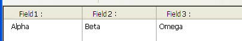

## Autodimensionamento coluna

When this property is enabled (`rightToLeft` value in JSON), list box columns are automatically resized along with the list box, within the limits of the [minimum](properties_CoordinatesAndSizing.md#minimum-width) and [maximum](properties_CoordinatesAndSizing.md#maximum-width) widths defined.

When this property is disabled (`legacy` value in JSON), only the rightmost column of the list box is resized, even if its width exceeds the maximum value defined.

### Como funciona o redimensionamento automático de colunas

* As the list box width increases, its columns are enlarged, one by one, starting from right to left, until each reaches its [maximum width](properties_CoordinatesAndSizing.md#maximum-width). Only columns with the [Resizable](#resizable) property selected are resized.

* The same procedure applies when the list box width decreases, but in reverse order (*i.e.*, columns are resized starting from left to right). When each column has reached its [minimum width](properties_CoordinatesAndSizing.md#minimum-width), the horizontal scroll bar becomes active again.

* Columns are resized only when the horizontal scroll bar is not "active"; *i.e.*, all columns are fully visible in the list box at its current size. **Note**: If the horizontal scroll bar is hidden, this does not alter its state: a scroll bar may still be active, even though it is not visible.

* After all columns reach their maximum size, they are no longer enlarged and instead a blank (fake) column is added on the right to fill the extra space. If a fake (blank) column is present, when the list box width decreases, this is the first area to be reduced.

#### Sobre a coluna falsa (em branco)

The appearance of the fake column matches that of the existing columns; it will have a fake header and/or footer if these elements are present in the existing list box columns and it will have the same background color(s) applied.

The fake header and/or footer can be clicked but this does not have any effect on the other columns (e.g.: no sort is performed); nevertheless, the `On Clicked`, `On Header Click` and `On Footer Click` events are generated accordingly.

If a cell in the fake column is clicked, the [LISTBOX GET CELL POSITION](https://doc.4d.com/4Dv17R6/4D/17-R6/LISTBOX-GET-CELL-POSITION.301-4311145.en.html) command returns "X+1" for its column number (where X is the number of existing columns).

#### Gramática JSON

| Nome         | Tipo de dados | Valores possíveis       |
| ------------ | ------------- | ----------------------- |
| resizingMode | string        | "rightToLeft", "legacy" |

#### Objectos suportados

[List Box](listbox_overview.md)

---

## Dimensionamento horizontal

This property specifies if the horizontal size of an object should be moved or resized when a user resizes the form. Também pode ser definido dinamicamente através do comando de linguagem `OBJECT SET RESIZING OPTIONS`.

Estão disponíveis três opções:

| Opção    | Valor JSON | Resultados                                                                                                             |
| -------- | ---------- | ---------------------------------------------------------------------------------------------------------------------- |
| Agrandar | "grow"     | A mesma percentagem é aplicada à largura do objeto quando o usuário redimensiona a largura da janela,                  |
| Mover    | "move"     | The object is moved the same amount left or right as the width increase when the user resizes the width of the window, |
| Nenhum   | "fixed"    | O objeto permanece estacionário quando o formulário é redimensionado                                                   |
> This property works in conjunction with the [Vertical Sizing](#vertical-sizing) property.

#### Gramática JSON

| Nome    | Tipo de dados | Valores possíveis       |
| ------- | ------------- | ----------------------- |
| sizingX | string        | "grow", "move", "fixed" |

#### Objectos suportados

[4D View Pro Area](viewProArea_overview.md) - [4D Write Pro Area](writeProArea_overview.md) - [Button](button_overview.md) - [Button Grid](buttonGrid_overview.md) - [Check Box](checkbox_overview.md) - [Combo Box](comboBox_overview.md) - [Dropdown list](dropdownList_Overview.md) - [Group Box](groupBox.md) - [Hierarchical List](list_overview.md#overview) - [Input](input_overview.md) - [List Box](listbox_overview.md#overview) - [Line](shapes_overview.md#line) - [List Box Column](listbox_overview.md#list-box-columns) - [Oval](shapes_overview.md#oval) - [Picture Button](pictureButton_overview.md) - [Picture Pop up menu](picturePopupMenu_overview.md) - [Plug-in Area](pluginArea_overview.md#overview) - [Progress Indicators](progressIndicator.md) - [Radio Button](radio_overview.md) - [Ruler](ruler.md) - [Rectangle](shapes_overview.md#rectangle) - [Spinner](spinner.md) - [Splitter](splitters.md) - [Static Picture](staticPicture.md) - [Stepper](stepper.md) - [Subform](subform_overview.md) - [Tab control](tabControl.md) - [Web Area](webArea_overview.md#overview)

---

## Alinhamento vertical

This property specifies if the vertical size of an object should be moved or resized when a user resizes the form. Também pode ser definido dinamicamente através do comando de linguagem `OBJECT SET RESIZING OPTIONS`.

Estão disponíveis três opções:

| Opção    | Valor JSON | Resultados                                                                                                           |
| -------- | ---------- | -------------------------------------------------------------------------------------------------------------------- |
| Agrandar | "grow"     | The same percentage is applied to the object's height when the user resizes the width of the window,                 |
| Mover    | "move"     | The object is moved the same amount up or down as the height increase when the user resizes the width of the window, |
| Nenhum   | "fixed"    | O objeto permanece estacionário quando o formulário é redimensionado                                                 |
> This property works in conjunction with the [Horizontal Sizing](#horizontal-sizing) property.

#### Gramática JSON

| Nome    | Tipo de dados | Valores possíveis       |
| ------- | ------------- | ----------------------- |
| sizingY | string        | "grow", "move", "fixed" |

#### Objectos suportados

[4D View Pro Area](viewProArea_overview.md) - [4D Write Pro Area](writeProArea_overview.md) - [Button](button_overview.md) - [Button Grid](buttonGrid_overview.md) - [Check Box](checkbox_overview.md) - [Combo Box](comboBox_overview.md) - [Dropdown list](dropdownList_Overview.md) - [Group Box](groupBox.md) - [Hierarchical List](list_overview.md#overview) - [Input](input_overview.md) - [List Box](listbox_overview.md#overview) - [Line](shapes_overview.md#line) - [List Box Column](listbox_overview.md#list-box-columns) - [Oval](shapes_overview.md#oval) - [Picture Button](pictureButton_overview.md) - [Picture Pop up menu](picturePopupMenu_overview.md) - [Plug-in Area](pluginArea_overview.md#overview) - [Progress Indicators](progressIndicator.md) - [Radio Button](radio_overview.md) - [Ruler](ruler.md) - [Rectangle](shapes_overview.md#rectangle) - [Spinner](spinner.md) - [Splitter](splitters.md) - [Static Picture](staticPicture.md) - [Stepper](stepper.md) - [Subform](subform_overview.md) - [Tab control](tabControl.md) - [Web Area](webArea_overview.md#overview)

---

## Pusher

Quando um objeto splitter tem essa propriedade, os outros objetos à sua direita (splitter vertical) ou abaixo dele (splitter horizontal) são empurrados ao mesmo tempo que o divisor, sem parada.

Here is the result of a “pusher” splitter being moved: 

Quando esta propriedade não é aplicada ao splitter, o resultado é o seguinte:

#### Gramática JSON

| Nome         | Tipo de dados |          Valores possíveis           |
|:------------ |:-------------:|:------------------------------------:|
| splitterMode |    string     | "move" (pusher), "resize" (standard) |

#### Objectos suportados

[Separador](splitterTabControlOverview#splitters)

---

## Redimensionável

Designa se o tamanho da coluna pode ser modificado pelo usuário.

#### Gramática JSON

| Nome      | Tipo de dados | Valores possíveis |
|:--------- |:-------------:|:-----------------:|
| resizable |    boolean    |  "true", "false"  |

#### Objectos suportados

[Coluna da List Box](listbox_overview.md#list-box-columns)
