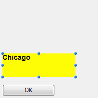

---

## Permitir a selecção de tipo de letra/cor

Quando esta propriedade está activada, os comandos [OPEN FONT PICKER](https://doc.4d.com/4Dv18/4D/18/OPEN-FONT-PICKER.301-4505612.en.html) e [OPEN COLOR PICKER](https://doc.4d.com/4Dv18/4D/18/OPEN-COLOR-PICKER.301-4505611.en.html) podem ser chamados para apresentar as janelas de seleção de fontes sistema e de cores. Usando essas janelas, os usuários podem alterar a fonte ou a cor de um objeto formulário que tenha o foco diretamente ao clicar. Quando essa propriedade está desativada (padrão), os comandos do seletor de abertura não têm efeito.

#### Gramática JSON

| Propriedade          | Tipo de dados | Valores possíveis    |
| -------------------- | ------------- | -------------------- |
| allowFontColorPicker | boolean       | false (padrão), true |

#### Objectos suportados

[Entrada](input_overview.md)

---

## Negrito

Define o texto selecionado para aparecer mais escuro e mais pesado.

Você pode definir essa propriedade usando o comando [**OBJECT SET FONT STYLE**](https://doc.4d.com/4Dv17R5/4D/17-R5/OBJECT-SET-FONT-STYLE.301-4128244.en.html).
> This is normal text.<br/> **This is bold text.**

#### Gramática JSON

| Propriedade | Tipo de dados | Valores possíveis |
| ----------- | ------------- | ----------------- |
| fontWeight  | text          | "normal", "bold"  |

#### Objectos suportados

[Button](button_overview.md) - [Check Box](checkbox_overview.md) - [Combo Box](comboBox_overview.md) - [Drop-down List](dropdownList_Overview.md) - [Group Box](groupBox.md) - [Hierarchical List](list_overview.md) - [Input](input_overview.md) - [List Box](listbox_overview.md) - [List Box Column](listbox_overview.md#list-box-columns) - [List Box Footer](listbox_overview.md#list-box-footers) - [List Box Header](listbox_overview.md#list-box-headers) - [Radio Button](radio_overview.md) - [Text Area](text.md)

---

## Itálico

Define o texto selecionado como ligeiramente inclinado para a direita.

Você também pode definir essa propriedade por meio do comando [**OBJECT SET FONT STYLE**](https://doc.4d.com/4Dv17R5/4D/17-R5/OBJECT-SET-FONT-STYLE.301-4128244.en.html).
> This is normal text.<br/> *This is text in italics.*

#### Gramática JSON

| Nome      | Tipo de dados | Valores possíveis  |
| --------- | ------------- | ------------------ |
| fontStyle | string        | "normal", "italic" |

#### Objectos suportados

[Button](button_overview.md) - [Check Box](checkbox_overview.md) - [Combo Box](comboBox_overview.md) - [Drop-down List](dropdownList_Overview.md) - [Group Box](groupBox.md) - [Hierarchical List](list_overview.md) - [Input](input_overview.md) - [List Box](listbox_overview.md) - [List Box Column](listbox_overview.md#list-box-columns) - [List Box Footer](listbox_overview.md#list-box-footers) - [List Box Header](listbox_overview.md#list-box-headers) - [Radio Button](radio_overview.md) - [Text Area](text.md)

---

## Sublinhado

Define o texto para ter uma linha por baixo.

#### Gramática JSON

| Nome           | Tipo de dados | Valores possíveis     |
| -------------- | ------------- | --------------------- |
| textDecoration | string        | "normal", "underline" |

#### Objectos suportados

[Button](button_overview.md) - [Check Box](checkbox_overview.md) - [Combo Box](comboBox_overview.md) - [Drop-down List](dropdownList_Overview.md) - [Group Box](groupBox.md) - [Hierarchical List](list_overview.md) - [Input](input_overview.md) - [List Box](listbox_overview.md) - [List Box Column](listbox_overview.md#list-box-columns) - [List Box Footer](listbox_overview.md#list-box-footers) - [List Box Header](listbox_overview.md#list-box-headers) - [Radio Button](radio_overview.md) - [Text Area](text.md)

---

## Fonte

Essa propriedade permite que você especifique o **tema da fonte** ou a **família da fonte** usada no objeto.
> As propriedades **tema de fonte** e **família de fonte** são mutuamente exclusivas. Um tema de tipo de letra controla os atributos do tipo de letra, incluindo o tamanho. Uma família de tipos de letra permite-lhe definir o nome, o tamanho e a cor do tipo de letra.

### Tema Fonte

A propriedade de tema do tipo de letra designa um nome de estilo automático. Os estilos automáticos determinam a família, o tamanho e a cor da fonte a serem usados no objeto de forma dinâmica, conforme os parâmetros do sistema. Esses parâmetros dependem de:

- a plataforma,
- a língua do sistema,
- e o tipo de objeto de formulário.

Com o tema de fonte, você tem a garantia de que os títulos serão sempre exibidos conforme os padrões atuais de interface do sistema. No entanto, o seu tamanho pode variar de uma máquina para outra.

Estão disponíveis três temas de tipos de letra:

- **normal**: estilo automático, aplicado por padrão a qualquer novo objeto criado no editor de formulários.
- Os temas de fontes **principais** e **adicionais** são compatíveis apenas com [áreas de texto](text.md) e [entradas](input_overview.md). Estes temas destinam-se principalmente a desenho de caixas de diálogo. Eles se referem aos estilos de fonte usados, respectivamente, para o texto principal e para as informações adicionais em suas janelas de interface. Aqui estão as caixas de diálogo típicas (macOS e Windows) que utilizam estes temas de tipos de letra:


> Os temas de tipo de letra gerem o tipo de letra, bem como o seu tamanho e cor. Entretanto, pode aplicar propriedades de estilo personalizadas (Negrito, Itálico ou Subscrito) sem alterar seu funcionamento.

#### Gramática JSON

| Nome      | Tipo de dados | Valores possíveis              |
| --------- | ------------- | ------------------------------ |
| fontTheme | string        | "normal", "main", "additional" |

#### Objectos suportados

[Button](button_overview.md) - [Check Box](checkbox_overview.md) - [Combo Box](comboBox_overview.md) - [Drop-down List](dropdownList_Overview.md) - [Group Box](groupBox.md) - [Hierarchical List](list_overview.md) - [Input](input_overview.md) - [List Box](listbox_overview.md) - [List Box Column](listbox_overview.md#list-box-columns) - [List Box Footer](listbox_overview.md#list-box-footers) - [List Box Header](listbox_overview.md#list-box-headers) - [Radio Button](radio_overview.md) - [Text Area](text.md)

### Família de letras

Existem dois tipos de nomes de famílias de letras:

- *family-name:* o nome de uma família de tipos de letra, como "times", "courier", "arial", etc.
- *generic-family:* o nome de uma família genérica, como "serif", "sans-serif", "cursive", "fantasy", "monospace".

Pode ser definido utilizando o comando [**OBJECT SET FONT**](https://doc.4d.com/4Dv17R5/4D/17-R5/OBJECT-SET-FONT.301-4054834.en.html).

#### Gramática JSON

| Nome       | Tipo de dados | Valores possíveis             |
| ---------- | ------------- | ----------------------------- |
| fontFamily | string        | Nome da família de fontes CSS |
> 4D recomenda usar apenas fontes [seguras para a web](https://www.w3schools.com/cssref/css_websafe_fonts.asp).

#### Objectos suportados

[Button](button_overview.md) - [Check Box](checkbox_overview.md) - [Combo Box](comboBox_overview.md) - [Drop-down List](dropdownList_Overview.md) - [Group Box](groupBox.md) - [Hierarchical List](list_overview.md) - [Input](input_overview.md) - [List Box](listbox_overview.md) - [List Box Column](listbox_overview.md#list-box-columns) - [List Box Footer](listbox_overview.md#list-box-footers) - [List Box Header](listbox_overview.md#list-box-headers) - [Radio Button](radio_overview.md) - [Text Area](text.md)

---

## Tamanho fonte

Permite definir o tamanho da fonte do objeto em pontos.

#### Gramática JSON

| Nome     | Tipo de dados | Valores possíveis                           |
| -------- | ------------- | ------------------------------------------- |
| fontSize | integer       | Tamanho da letra em pontos. Valor mínimo: 0 |

#### Objectos suportados

[Button](button_overview.md) - [Check Box](checkbox_overview.md) - [Combo Box](comboBox_overview.md) - [Drop-down List](dropdownList_Overview.md) - [Group Box](groupBox.md) - [Hierarchical List](list_overview.md) - [Input](input_overview.md) - [List Box](listbox_overview.md) - [List Box Column](listbox_overview.md#list-box-columns) - [List Box Footer](listbox_overview.md#list-box-footers) - [List Box Header](listbox_overview.md#list-box-headers) - [Radio Button](radio_overview.md) - [Text Area](text.md)

---

## Cor fonte

Designa a cor do tipo de letra.

> This property also sets the color of object's border (if any) when "plain" or "dotted" style is used.

A cor pode ser especificada por:

- um nome de cor - como "red"
- um valor HEX - como "#ff0000"
- um valor RGB - como "rgb(255,0,0)"

Você também pode definir esta propriedade usando o comando [**OBJECT SET RGB COLORS**](https://doc.4d.com/4Dv18/4D/18/OBJECT-SET-RGB-COLORS.301-4505456.en.html).

#### Gramática JSON

| Nome   | Tipo de dados | Valores possíveis                        |
| ------ | ------------- | ---------------------------------------- |
| stroke | string        | um valor css, "transparent", "automatic" |

#### Objectos suportados

[Button](button_overview.md) - [Check Box](checkbox_overview.md) - [Combo Box](comboBox_overview.md) - [Drop-down List](dropdownList_Overview.md) - [Group Box](groupBox.md) - [Hierarchical List](list_overview.md) - [Input](input_overview.md) - [List Box](listbox_overview.md) - [List Box Column](listbox_overview.md#list-box-columns) - [List Box Footer](listbox_overview.md#list-box-footers) - [List Box Header](listbox_overview.md#list-box-headers) - [Progress Indicators](progressIndicator.md) - [Ruler](ruler.md) - [Radio Button](radio_overview.md) - [Text Area](text.md)

---

## Expressão cor fonte

`List box do tipo coleção/seleção de entidade`

Utilizado para aplicar uma cor de letra personalizada a cada linha do list box. É necessário utilizar valores de cor RGB. Para obter mais informações sobre isso, consulte a descrição do comando [OBJECT SET RGB COLORS](https://doc.4d.com/4dv19R/help/command/en/page628.html) no manual Linguagem 4D.

Deve introduzir uma expressão ou uma variável (não podem ser utilizadas variáveis do tipo array). A expressão ou variável será avaliada para cada linha exibida. Você pode usar as constantes do tema [SET RGB COLORS](https://doc.4d.com/4Dv17R6/4D/17-R6/SET-RGB-COLORS.302-4310385.en.html).

Também pode definir esta propriedade utilizando o comando `LISTBOX SET PROPERTY` com a constante `lk font color expression`.
> Esta propriedade também pode ser definida utilizando uma [expressão Meta Info](properties_Text.md#meta-info-expression).

O exemplo seguinte utiliza um nome de variável: introduza *CompanyColor* para a **expressão cor fonte** e, no método formulário, escreva o seguinte código:

```4d
CompanyColor:=Choose([Companies]ID;Background color;Light shadow color; Foreground color;Dark shadow color)
```

#### Gramática JSON

| Nome            | Tipo de dados | Valores possíveis   |
| --------------- | ------------- | ------------------- |
| rowStrokeSource | string        | Expressão cor fonte |

#### Objectos suportados

[List Box](listbox_overview.md)

---

## Expressão estilo

`List box do tipo coleção/seleção de entidade`

Utilizado para aplicar um estilo de carácter personalizado a cada linha do list box ou a cada célula da coluna.

Deve introduzir uma expressão ou uma variável (não podem ser utilizadas variáveis do tipo array). A expressão ou variável será avaliada para cada linha apresentada (se aplicada à list box) ou para cada célula apresentada (se aplicada a uma coluna). Pode utilizar as constantes do tema [Estilos de fonte](https://doc.4d.com/4Dv17R6/4D/17-R6/Font-Styles.302-4310343.en.html).

Exemplo:

```4d
Choose([Companies]ID;Bold;Plain;Italic;Underline)
```

Também pode definir esta propriedade utilizando o comando `LISTBOX SET PROPERTY` com a constante `lk font style expression`.
> Esta propriedade também pode ser definida utilizando uma [expressão Meta Info](properties_Text.md#meta-info-expression).

#### Gramática JSON

| Nome           | Tipo de dados | Valores possíveis                                     |
| -------------- | ------------- | ----------------------------------------------------- |
| rowStyleSource | string        | Expressão de estilo a avaliar para cada linha/célula. |

#### Objectos suportados

[Caixa de Listagem](listbox_overview.md) - [Coluna da caixa de listagem](listbox_overview.md#list-box-columns)

---

## Alihamento horizontal

Localização horizontal do texto na área que o contém.

#### Gramática JSON

| Nome      | Tipo de dados | Valores possíveis                                 |
| --------- | ------------- | ------------------------------------------------- |
| textAlign | string        | "right", "center", "left", "automatic", "justify" |

:::note

- "automatic" não é suportado por [caixas de verificação](checkbox_overview.md) e [botões rádio](radio_overview.md)
- "justify" só é suportado por [entradas](input_overview.md) e [áreas de texto](texto.md)

:::

#### Objectos suportados

[Button](button_overview.md) - [Check Box](checkbox_overview.md) (all styles except Regular and Flat) - [Group Box](groupBox.md) - [Input](input_overview.md) - [List Box](listbox_overview.md) - [List Box Column](listbox_overview.md#list-box-columns) - [List Box Header](listbox_overview.md#list-box-headers) - [List Box Footer](listbox_overview.md#list-box-footers) - [Radio Button](radio_overview.md) (all styles except Regular and Flat) - [Text Area](text.md)

---

## Cor linha vertical

Localização vertical do texto na área que o contém.

A opção **Padrão** (valor JSON `automático`) define o alinhamento conforme o tipo de dados encontrados em cada coluna:

- `abaixo` para todos os dados (exceto imagens) e
- `topo` para dados de tipo imagem.

Esta propriedade também pode ser manipulada pelos comandos [OBJECT Get vertical alignment](https://doc.4d.com/4dv19R/help/command/en/page1188.html) e [OBJECT SET VERTICAL ALIGNMENT](https://doc.4d.com/4dv19R/help/command/en/page1187.html).

#### Gramática JSON

| Nome          | Tipo de dados | Valores possíveis                      |
| ------------- | ------------- | -------------------------------------- |
| verticalAlign | string        | "automatic", "top", "middle", "bottom" |

#### Objectos suportados

[List Box](listbox_overview.md) - [Coluna List Box](listbox_overview.md#list-box-columns) - [Rodapé List Box](listbox_overview.md#list-box-footers) - [Cabeçalho List Box](listbox_overview.md#list-box-headers)

---

## Meta Info expression

`List box do tipo Collection ou entity selection`

Especifica uma expressão ou uma variável que será avaliada para cada linha exibida. Permite definir um conjunto completo de atributos de texto das linhas. É necessário transmitir uma **variável objeto** ou uma **expressão que devolva um objeto**. As propriedades abaixo são compatíveis:

| Nome da propriedade | Tipo    | Descrição                                                                                                                                                                                                                                                                                                                                                                                                      |
| ------------------- | ------- | -------------------------------------------------------------------------------------------------------------------------------------------------------------------------------------------------------------------------------------------------------------------------------------------------------------------------------------------------------------------------------------------------------------- |
| stroke              | string  | Cor de fundo. Qualquer cor CSS (por exemplo, "#FF00FF"), "automatic", "transparent"                                                                                                                                                                                                                                                                                                                            |
| fill                | string  | Cor de fundo. Qualquer cor CSS (por exemplo, "#F00FFF"), "automatic", "transparent"                                                                                                                                                                                                                                                                                                                            |
| fontStyle           | string  | "normal","italic"                                                                                                                                                                                                                                                                                                                                                                                              |
| fontWeight          | string  | "normal","bold"                                                                                                                                                                                                                                                                                                                                                                                                |
| textDecoration      | string  | "normal","underline"                                                                                                                                                                                                                                                                                                                                                                                           |
| unselectable        | boolean | Designa a linha correspondente como não sendo selecionável (*ou seja*, não é possível realçar). As áreas inseríveis deixam de o ser se esta opção estiver ativada, a menos que a opção "Editar com um clique" também esteja ativada. Os controlos como as caixas de verificação e as listas permanecem funcionais. Esta definição é ignorada se o modo de seleção do list box é "Nenhum". Valor padrão: False. |
| disabled            | boolean | Desactiva a linha correspondente. As áreas acessíveis deixam de ser acessíveis se esta opção estiver activada. O texto e os controlos (caixas de verificação, listas, etc.) aparecem esbatidos ou a cinzento. Valor padrão: False.                                                                                                                                                                             |

A propriedade especial "célula" permite-lhe aplicar um conjunto de propriedades a uma única coluna:

| Nome da propriedade |              |                                                                                                    | Tipo   | Descrição                                                                                                                                                                                                                                       |
| ------------------- | ------------ | -------------------------------------------------------------------------------------------------- | ------ | ----------------------------------------------------------------------------------------------------------------------------------------------------------------------------------------------------------------------------------------------- |
| cell                |              |                                                                                                    | object | Propriedades a serem aplicadas a coluna(s) única(s)                                                                                                                                                                                             |
|                     | *columnName* |                                                                                                    | object | Pass in `\<columnName>` the object name of the list box column.                                                                                                                                                                          |
|                     |              | *Esta propriedade só está disponível quando não estiver selecionado [tema de fonte](#font-theme).* | string | as propriedades "stroke", "fill", "fontStyle", "fontWeight" ou "textDecoration" (ver acima). **Nota**: as propriedades "unselectable" e "disabled" só podem ser definidas ao nível da linha. São ignorados se forem passados no objeto "célula" |

> Style settings made with this property are ignored if other style settings are already defined through expressions (*i.e.*, [Style Expression](#style-expression), [Font Color Expression](#font-color-expression), [Background Color Expression](./properties_BackgroundAndBorder.md#background-color-expression)).

**Exemplos**

No método de projeto *Color*, entre o código abaixo:

```4d
//Color method
//Sets font color for certain rows and the background color for a specific column: C_OBJECT($0)
Form.meta:=New object If(This.ID>5) //ID is an attribute of collection objects/entities
  Form.meta.stroke:="purple"
  Form.meta.cell:=New object("Column2";New object("fill";"black"))
Else
  Form.meta.stroke:="orange" End if
$0:=Form.meta
```

**Melhores práticas:** por razões de otimização, é recomendado nesse caso criar o objeto `meta.cell` uma vez no método formulário:

```4d
  //método de formulário
 Case of
    :(Form event code=On Load)
       Form.colStyle:=New object("Column2";New object("fill";"black"))
 End case
```

O método *Color* iria conter :

```4d
  //Método Color 
 ...
 If(This.ID>5)
    Form.meta.stroke:="purple"
    Form.meta.cell:=Form.colStyle //reusa o mesmo objeto para melhor performance
 ...
```


#### Gramática JSON

| Nome       | Tipo de dados | Valores possíveis                                     |
| ---------- | ------------- | ----------------------------------------------------- |
| metaSource | string        | Expressão do objeto a avaliar para cada linha/célula. |

#### Objectos suportados

[List Box](listbox_overview.md)

---

## Multistyle

Esta propriedade ativa a possibilidade de usar estilos específicos na área selecionada. Quando esta opção está marcada, 4D interpreta qualquer etiqueta `<SPAN> HTML` encontrada na área.

Por defeito, esta opção não está activada.

#### Gramática JSON

| Nome       | Tipo de dados | Valores possíveis |
| ---------- | ------------- | ----------------- |
| styledText | boolean       | true, false       |

#### Objectos suportados

Coluna da List Box

---

## Orientação

Modifica a orientação (rotação) de uma área texto. Áreas texto pode ser rodadas por incrementos de 90°. Cada valor de orientação é aplicado enquanto mantém o mesmo ponto inferior esquerdo para o objeto:

| Valor de orientação | Resultados                                     |
| ------------------- | ---------------------------------------------- |
| 0 (o padrão)        |  |
| 90                  |  |
| 180                 |  |
| 270                 |  |

Além de [áreas de texto estáticas](text.md), [input](input_overview.md) os objetos de texto podem ser girados quando forem não-[digitáveis](properties_Entry.md#enterable). Quando uma propriedade rotação for aplicada a um objeto input, a propriedade digitável é removida (se houver). Esse objeto é então excluído da ordem de entrada.

#### Gramática JSON

| Nome      | Tipo de dados | Valores possíveis |
| --------- | ------------- | ----------------- |
| textAngle | number        | 0, 90, 180, 270   |

#### Objectos suportados

[Input](input_overview.md) (não-digitável) - [Área Texto](text.md)

---

## Array cores de Fonte

`List box de tipo array`

Permite estabelecer uma cor de fonte personalizada para cada linha do list box ou cada célula da coluna.

O nome do array LongInt deve ser usado. Cada elemento deste array corresponde a uma linha do list box (se aplicada o list box) ou a uma célula da coluna (se aplicada a uma coluna), pelo que o array deve ter o mesmo tamanho que o array associado à coluna. Você pode usar as constantes do tema [SET RGB COLORS](https://doc.4d.com/4Dv17R6/4D/17-R6/SET-RGB-COLORS.302-4310385.en.html). Você pode usar as constantes do tema [SET RGB COLORS](https://doc.4d.com/4Dv20/4D/20.1/SET-RGB-COLORS.302-6481080.en.html).

#### Gramática JSON

| Nome            | Tipo de dados | Valores possíveis          |
| --------------- | ------------- | -------------------------- |
| rowStrokeSource | string        | O nome de um array longint |

#### Objectos suportados

[Caixa de Listagem](listbox_overview.md) - [Coluna da caixa de listagem](listbox_overview.md#list-box-columns)

---

## Array estilo linha

`List box de tipo array`

Permite estabelecer um estilo de fonte personalizado para cada linha do list box ou cada célula da coluna.

O nome do array LongInt deve ser usado. Cada elemento deste array corresponde a uma linha do list box (se aplicada o list box) ou a uma célula da coluna (se aplicada a uma coluna), pelo que o array deve ter o mesmo tamanho que o array associado à coluna. Para preencher esse array (usando um método) use as constantes do tema [Estillos de Fonte](https://doc.4d.com/4Dv17R6/4D/17-R6/Font-Styles.302-4310343.en.html). Pode acionar constantes juntas para combinar estilos. Se quiser que a célula herde o estilo definido no nível mais alto, passe o valor -255 para o elemento array correspondente.

#### Gramática JSON

| Nome           | Tipo de dados | Valores possíveis           |
| -------------- | ------------- | --------------------------- |
| rowStyleSource | string        | O nome de um array longint. |

#### Objectos suportados

[Caixa de Listagem](listbox_overview.md) - [Coluna da caixa de listagem](listbox_overview.md#list-box-columns)

---

## Armazenar com etiquetas de estilo predefinidas

Essa propriedade só está disponível para a área input [Multiestilo](#multi-style). Quando essa propriedade for ativada, a área armazena as tags de estilo com o texto, mesmo se nenhuma modificação for feita. Nesse caso, as tags correspondem ao estilo padrão. Quando essa propriedade for desativada, só as tags de estilo modificadas são armazenadas.

Por exemplo, aqui está um texto que inclui uma modificação de estilo:


Quando a propriedade for desativada, a área só armazena a modificação. Os conteúdos armazenados são entretanto:

```
Que <SPAN STYLE="font-size:13.5pt">lindo</SPAN> dia!
```

Quando a propriedade for ativada, a área armazena todas as informações de formatação. A primeira tag genérica descreve o estilo padrão quando cada variação no sujeito for um par de tags aninhadas. Os conteúdos armazenados na área são portanto:

```
<SPAN STYLE="font-family:'Arial';font-size:9pt;text-align:left;font-weight:normal;font-style:normal;text-decoration:none;color:#000000;background-color:#FFFFFF">Que <SPAN STYLE="font-size:13.5pt">lindo</SPAN> dia!</SPAN>
```

#### Gramática JSON

| Nome              | Tipo de dados | Valores possíveis     |
| ----------------- | ------------- | --------------------- |
| storeDefaultStyle | boolean       | true, false (padrão). |

#### Objectos suportados

[Entrada](input_overview.md)
