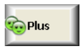
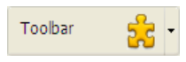

## Rota de acesso ao Fundo

Define o caminho da imagem que será desenhada no fundo do objeto. Se o objeto utilizar um [ícone ](#picture-pathname) com [estados diferentes](#number-of-states), a imagem de fundo suportará automaticamente o mesmo número de estados.

O nome do caminho a introduzir é semelhante ao [da propriedade Caminho para imagens estáticas](properties_Picture.md#pathname).

#### Gramática JSON

| Nome                    | Tipo de dados | Valores possíveis                                                                                                     |
| ----------------------- | ------------- | --------------------------------------------------------------------------------------------------------------------- |
| customBackgroundPicture | string        | Caminho relativo na sintaxe POSIX. Deve ser utilizado em conjunto com a opção "Personalizado" da propriedade "Style". |

#### Objectos suportados

[Botão personalizado](button_overview.md#custom) - [Caixa de verificação personalizada](checkbox_overview.md#custom) - [Botão rádio personalizado](radio_overview.md#custom)

---

## Estilo de botão

Aspeto geral do botão. O estilo do botão também desempenha um papel na disponibilidade de determinadas opções.

#### Gramática JSON

| Nome  | Tipo de dados | Valores possíveis                                                                                                                                                  |
|:-----:|:-------------:| ------------------------------------------------------------------------------------------------------------------------------------------------------------------ |
| style |     text      | "regular", "flat", "toolbar", "bevel", "roundedBevel", "gradientBevel", "texturedBevel", "office", "help", "circular", "disclosure", "roundedDisclosure", "custom" |

#### Objectos suportados

[Botão](button_overview.md) - [Botão rádio](radio_overview.md) - [Caixa de verificação](checkbox_overview.md) - [Botão rádio](radio_overview.md)

---

## Margem horizontal

Esta propriedade permite definir o tamanho (em píxeis) das margens horizontais do botão. Esta margem delimita a área que o ícone e o título do botão não devem ultrapassar.

Este parâmetro é útil, por exemplo, quando a imagem de fundo contém contornos:

| Com / Sem               | Exemplo                                                      |
| ----------------------- | ------------------------------------------------------------ |
| Sem margem              |  |
| Com margem de 13 píxeis |  |
> Esta propriedade funciona em conjunto com a propriedade [Margem vertical](#vertical-margin).

#### Gramática JSON

| Nome          | Tipo de dados | Valores possíveis                                     |
| ------------- | ------------- | ----------------------------------------------------- |
| customBorderX | number        | Para utilizar com o estilo "personalizado". Mínimo: 0 |

#### Objectos suportados

[Botão personalizado](button_overview.md#custom) - [Caixa de verificação personalizada](checkbox_overview.md#custom) - [Botão rádio personalizado](radio_overview.md#custom)

---

## Localização do ícone

Designa a colocação de um ícone em relação ao objeto formulário.

#### Gramática JSON

| Nome          | Tipo de dados | Valores possíveis       |
| ------------- | ------------- | ----------------------- |
| iconPlacement | string        | "none", "left", "right" |

#### Objectos suportados

[Cabeçalho do List Box](listbox_overview.md#list-box-headers)

---

## Offset do ícone

Define um valor de desvio personalizado em pixeis, que será utilizado quando se clica no botão

O título do botão será deslocado para a direita e para baixo em função do número de pixeis introduzidos. Isto permite aplicar um efeito 3D personalizado quando o botão é clicado.

#### Gramática JSON

| Nome         | Tipo de dados | Valores possíveis |
| ------------ | ------------- | ----------------- |
| customOffset | number        | mínimo: 0         |

#### Objectos suportados

[Botão personalizado](button_overview.md#custom) - [Caixa de verificação personalizada](checkbox_overview.md#custom) - [Botão rádio personalizado](radio_overview.md#custom)

---

## Número de estados

Esta propriedade define o número exato de estados presentes na imagem utilizada como ícone para um [botão com ícone](button_overview.md), uma [caixa de verificação](checkbox_overview.md) ou um [botão radio](radio_overview.md) personalizado. In general, a button icon includes four states: active, clicked, mouse over and inactive.

Cada estado é representado por uma imagem diferente. Na imagem de origem, os estados devem ser empilhados verticalmente:

Estão representados os seguintes estados:

1. botão não clicado / caixa de verificação desmarcada (valor da variável=0)
2. botão clicado/caixa de seleção marcada (valor variável=1)
3. sobreposição
4. disabled

#### Gramática JSON

| Nome       | Tipo de dados | Valores possíveis |
| ---------- | ------------- | ----------------- |
| iconFrames | number        | mínimo: 1         |

#### Objectos suportados

[Botão](button_overview.md) (todos os estilos exceto [Ajuda](button_overview.md#help)) - [Caixa de verificação](checkbox_overview.md) - [Botão rádio](radio_overview.md)

---

## Caminho da imagem

Define o caminho da imagem que será utilizada como ícone para o objeto.

O nome do caminho a introduzir é semelhante ao [da propriedade Caminho para imagens estáticas](properties_Picture.md#pathname).

> Quando utilizada como ícone para objetos ativos, a imagem deve ser concebida para suportar [um número de estados](#number-of-states) variável.

#### Gramática JSON

| Nome | Tipo de dados | Valores possíveis                                |
| ---- | ------------- | ------------------------------------------------ |
| icon | picture       | Caminho relativo ou filesystem na sintaxe POSIX. |

#### Objectos suportados

[Botão](button_overview.md) (todos os estilos exceto [Ajuda](button_overview.md#help)) - [Caixa de verificação](checkbox_overview.md) - [Cabeçalho da caixa de listagem](listbox_overview.md#list-box-headers) - [Botão rádio](radio_overview.md)

---

## Posição título/Imagem

Esta propriedade permite modificar a localização relativa do título do botão em relação ao ícone associado. Esta propriedade não tem efeito quando o botão contém apenas um título (sem imagem associada) ou uma imagem (sem título). Por predefinição, quando um botão contém um título e uma imagem, o texto é colocado por baixo da imagem.

Aqui estão os resultados utilizando as várias opções para esta propriedade:

| Opção        | Descrição                                                                                                                             | Exemplo                                                           |
| ------------ | ------------------------------------------------------------------------------------------------------------------------------------- | ----------------------------------------------------------------- |
| **Direita**  | O texto é colocado à esquerda do ícone. O conteúdo do botão é alinhado à direita.                                                     |   |
| **Topo**     | O texto é colocado por cima do ícone. O conteúdo do botão é centrado.                                                                 |       |
| **Esquerda** | O texto é colocado à direita do ícone. O conteúdo do botão é alinhado à esquerda.                                                     |     |
| **Fundo**    | O texto é colocado por baixo do ícone. O conteúdo do botão é centrado.                                                                |    |
| **Centrado** | O texto do ícone é centrado vertical e horizontalmente no botão. Este parâmetro é útil, por exemplo, para o texto incluído num ícone. |  |

#### Gramática JSON

| Nome          | Tipo de dados | Valores possíveis                          |
| ------------- | ------------- | ------------------------------------------ |
| textPlacement | string        | "left", "top", "right", "bottom", "center" |

#### Objectos suportados

[Botão](button_overview.md) (todos os estilos exceto [Ajuda](button_overview.md#help)) - [Caixa de verificação](checkbox_overview.md) - [Botão rádio](radio_overview.md)

---

## Margem vertical

This property allows setting the size (in pixels) of the vertical margins of the button. Esta margem delimita a área que o ícone e o título do botão não devem ultrapassar.

Este parâmetro é útil, por exemplo, quando a imagem de fundo contém contornos.

> This property works in conjunction with the [Horizontal Margin](#horizontal-margin) property.

#### Gramática JSON

| Nome          | Tipo de dados | Valores possíveis                                     |
| ------------- | ------------- | ----------------------------------------------------- |
| customBorderY | number        | Para utilizar com o estilo "personalizado". Mínimo: 0 |

#### Objectos suportados

[Botão personalizado](button_overview.md#custom) - [Caixa de verificação personalizada](checkbox_overview.md#custom) - [Botão rádio personalizado](radio_overview.md#custom)

---

## Com menu pop-up

This property allows displaying a symbol that appears as a triangle in the button to indicate the presence of an attached pop-up menu:

The appearance and location of this symbol depends on the button style and the current platform.

### Ligados e Separados

To attach a pop-up menu symbol to a button, there are two display options available:

|                         Linked                          |                          Separado                          |
|:-------------------------------------------------------:|:----------------------------------------------------------:|
|  |  |
> The actual availability of a "separated" mode depends on the style of the button and the platform.

Each option specifies the relation between the button and the attached pop-up menu:

<li>Quando o menu pop-up é **separado**, clicar na parte esquerda do botão executa diretamente a ação atual do botão; essa ação pode ser modificada usando o menu pop-up acessível na parte direita do botão.</li>
<li>Quando o menu pop-up está **vinculado**, um simples clique no botão exibe apenas o menu pop-up. Only the selection of the action in the pop-up menu causes its execution.</li>

### Gerir o menu pop-up

It is important to note that the "With Pop-up Menu" property only manages the graphic aspect of the button. The display of the pop-up menu and its values must be handled entirely by the developer, more particularly using `form events` and the **[Dynamic pop up menu](https://doc.4d.com/4Dv18/4D/18/Dynamic-pop-up-menu.301-4505524.en.html)** and **[Pop up menu](https://doc.4d.com/4Dv17R5/4D/17-R5/Pop-up-menu.301-4127438.en.html)** commands.

#### Gramática JSON

| Nome           | Tipo de dados | Valores possíveis                                                           |
|:-------------- | ------------- | --------------------------------------------------------------------------- |
| popupPlacement | string        | <li>"none"</li><li>"linked"</li><li>"separated"</li> |

#### Objectos suportados

[Toolbar Button](button_overview.md#toolbar) - [Bevel Button](button_overview.md#bevel) - [Rounded Bevel Button](button_overview.md#rounded-bevel) - [OS X Gradient Button](button_overview.md#os-x-gradient) - [OS X Textured Button](button_overview.md#os-x-textured) - [Office XP Button](button_overview.md#office-xp) - [Circle Button](button_overview.md#circle) - [Custom](button_overview.md#custom)
