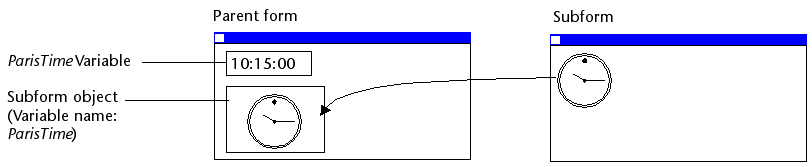
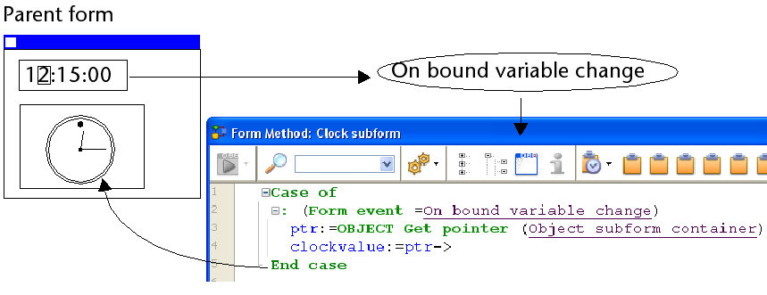
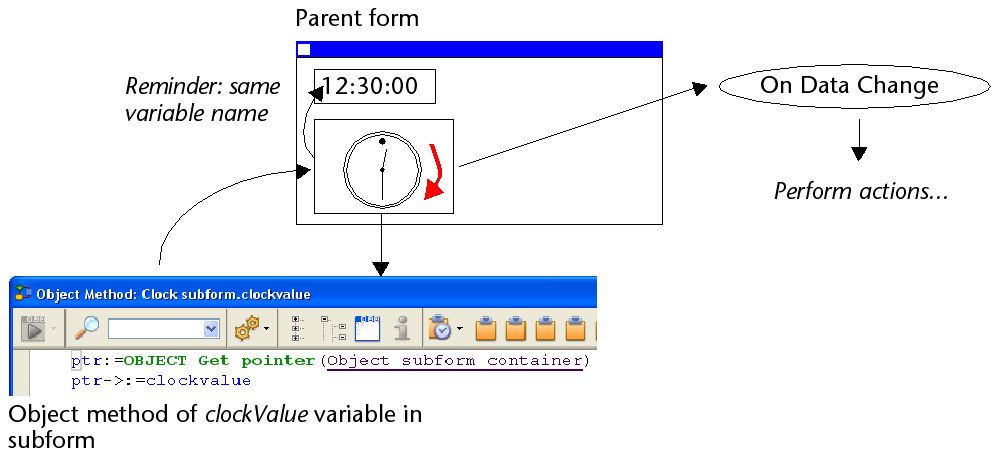

Um subformulário é um formulário incluído noutro formulário.

## Terminologia

Para definir claramente os conceitos implementados com subformulários, aqui estão algumas definições para certos termos utilizados:

* **Subformulário**: um formulário destinado a ser incluído em outro formulário, ele próprio chamado de formulário pai.
* **Formulário pai**: um formulário que contém um ou mais subformulários.
* **Contêiner de subformulário**: um objeto incluído no formulário pai, que exibe uma instância do subformulário.
* **Instância de subformulário**: a representação de um subformulário em um formulário pai. Esse conceito é importante porque é possível exibir várias instâncias do mesmo subformulário em um formulário pai.
* **Formulário lista**: instância do subformulário exibido como uma lista.
* **Formulário de detalhes**: formulário de entrada do tipo página associado a um subformulário do tipo lista que pode ser acessado com um clique duplo na lista.

## Sub formulários lista

Um subformulário lista permite que você insira, visualize e modifique dados em outras tabelas. Normalmente, os subformulários de lista são usados em bancos de dados nos quais você estabeleceu relações Um para Muitos. Um subformulário de lista em um formulário em uma tabela One relacionada permite visualizar, inserir e modificar dados em uma tabela Many relacionada. Você pode ter vários subformulários provenientes de tabelas diferentes no mesmo formulário. No entanto, não é possível colocar dois subformulários que pertençam à mesma tabela na mesma página de um formulário.

Por exemplo, um banco de dados do gerenciador de contatos pode usar um subformulário de lista para exibir todos os números de telefone de um determinado contato. Embora os números de telefone apareçam na tela Contatos, as informações são, na verdade, armazenadas em uma tabela relacionada. Usando uma relação de um para muitos, esse design de banco de dados facilita o armazenamento de um número ilimitado de números de telefone por contato. Com as relações automáticas, você pode apoiar a entrada de dados diretamente na tabela Many relacionada sem programação.

Embora os subformulários de lista geralmente estejam associados a muitas tabelas, uma instância de subformulário pode exibir os registros de qualquer outra tabela do banco de dados.

Também é possível permitir que o usuário introduza dados no formulário Lista. Dependendo da configuração do subformulário, o usuário pode exibir o formulário detalhado clicando duas vezes em um subregistro ou usando os comandos para adicionar e editar subregistros.

> 4D oferece três ações padrão para atender às necessidades básicas de gerenciamento de sub-registros: `Editar Subregistro`, `Excluir Subregistro` e `Adicionar Subregistro`. Quando o formulário incluir várias instâncias de subformulários, a ação será aplicada ao subformulário que tiver o foco.

## Subformulários em página

Os subformulários de página podem exibir os dados do subregistro atual ou qualquer tipo de valor pertinente, dependendo do contexto (variáveis, figuras etc.). Uma das principais vantagens do uso de subformulários de página é que eles podem incluir funcionalidades avançadas e interagir diretamente com o formulário pai (widgets). Os subformulários de página também têm suas próprias propriedades e eventos específicos; você pode gerenciá-los inteiramente por meio de programação.

O subformulário de página usa o formulário de entrada indicado pela propriedade [Detail Form](properties_Subform.md#detail-form). Ao contrário de um subformulário de lista, o formulário usado pode vir da mesma tabela que o formulário pai. Também é possível usar um formulário de projeto. Quando executado, um subformulário de página tem as mesmas características de exibição padrão de um formulário de entrada.

> Os widgets 4D são objetos compostos predefinidos com base em subformulários de página. São descritos em detalhes em um manual separado, [4D Widgets](https://doc.4d.com/4Dv17R6/4D/17-R6/4D-Widgets.100-4465257.en.html).

### Gestão da variável relacionada

A [variável](properties_Object.md#variable-or-expression) vinculada a um subformulário de página permite vincular os contextos do formulário pai e do subformulário para dar os toques finais em interfaces sofisticadas. Por exemplo, imagine um subformulário que representa um relógio dinâmico, inserido em um formulário pai que contém uma variável inserível do tipo Time:



Ambos os objetos (variável de tempo e contêiner de subformulário) *têm o mesmo nome de variável*. Nesse caso, quando você abre o formulário pai, 4D sincroniza ambos os valores automaticamente. Se o valor da variável é definido em vários locais, 4D usa o valor que foi carregado por último. Ele aplica a seguinte ordem de carregamento: 1-Métodos de objeto do subformulário 2-Método de formulário do subformulário 3-Métodos de objeto do formulário pai 4-Método de formulário do formulário pai

Quando o formulário pai é executado, o desenvolvedor deve ter o cuidado de sincronizar as variáveis usando os eventos formulário apropriados. Podem ocorrer dois tipos de interações: formulário para subformulário e vice-versa.

#### Atualização do conteúdo do subformulário

Caso 1: o valor da variável do formulário pai é modificado e essa modificação deve ser passada para o subformulário. Em nosso exemplo, a hora do ParisTime muda para 12:15:00, seja porque o usuário a inseriu ou foi atualizada dinamicamente (por meio do comando `Current time`, por exemplo).

Nesse caso, você deve usar o evento formulário On Bound Variable Change. Esse evento deve ser selecionado nas propriedades do subformulário; ele é gerado no método formulário do subformulário.



O evento de formulário `On Bound Variable Change` é gerado:

* assim que um valor for atribuído à variável do formulário pai, mesmo que o mesmo valor seja reatribuído,
* se o subformulário pertence à página formulário atual ou à página 0.

Observe que, como no exemplo acima, é preferível usar o comando `OBJECT Get pointer`, que retorna um ponteiro para o contêiner do subformulário em vez de sua variável, pois é possível inserir vários subformulários no mesmo formulário pai (por exemplo, uma janela que exibe diferentes fusos horários contém vários relógios). Nesse caso, apenas um ponteiro permite que você saiba qual contêiner de subformulário está na origem do evento.

#### Atualização do conteúdo do formulário parent

Caso 2: o conteúdo do subformulário é modificado e esta modificação deve ser transmitida ao formulário principal. Em nosso exemplo, imagine que a interface do subformulário permite que o usuário mova "manualmente" os ponteiros do relógio.

Nesse caso, a partir do subformulário, você deve atribuir o valor do objeto à variável do contêiner do subformulário pai. Como no exemplo anterior, recomendamos que você use o comando `OBJECT Get pointer` com o seletor `Object subform container`, que retorna um ponteiro para o contêiner do subformulário.

A atribuição do valor à variável gera o evento de formulário `On Data Change` no método de objeto do contêiner do subformulário pai, o que lhe permite executar qualquer tipo de ação. O evento deve ser selecionado nas propriedades do contêiner do subformulário.



> Se você mover "manualmente" os ponteiros do relógio, isso também gerará o evento de formulário `On Data Change` no método de objeto da variável *clockValue* no subformulário.

### Utilizar o objeto vinculado ao subformulário

4D automaticamente vincula um objeto (`C_OBJECT`) a cada subformulário. O conteúdo desse objeto pode ser lido e/ou modificado no contexto do subformulário, o que lhe permite compartilhar valores em um contexto local.

O objeto pode ser criado automaticamente ou ser a variável do contêiner pai, se for explicitamente nomeado e digitado como Object (veja abaixo). Em todos os casos, o objeto é retornado pelo comando `Form`, que pode ser chamado diretamente do subformulário (o uso de um ponteiro é inútil). Como os objetos são sempre passados por referência, se o usuário modificar um valor de propriedade no subformulário, ele será automaticamente salvo no próprio objeto.

Por exemplo, em seu subformulário, os rótulos de campo são armazenados no objeto vinculado para você poder exibir diferentes linguagens:


Você pode modificar os rótulos do subformulário atribuindo valores ao objeto *InvoiceAddress*:

```4d
 C_OBJECT($lang)
 $lang:=New object
 If(<>lang="fr")
    $lang. CompanyName:="Société :"
    $lang. LastName:="Nom :"
 Else
    $lang. CompanyName:="Company:"
    $lang. LastName:="Name:"
 End if
 InvoiceAddress. Label:=$lang
```


### Programação entre formulários avançada

A comunicação entre o formulário pai e as instâncias do subformulário pode exigir mais do que a troca de um valor por meio da variável vinculada. Na verdade, você pode querer atualizar as variáveis nos subformulários de acordo com as ações realizadas no formulário principal e vice-versa. Se usarmos o exemplo anterior do subformulário do tipo "relógio dinâmico", podemos querer definir um ou mais horários de alarme para cada relógio.

4D implementou os seguintes mecanismos para atender a essas necessidades:

* Uso do parâmetro "subform" com o comando `OBJECT Get name` para especificar o objeto de subformulário e o comando `OBJECT Get pointer`.
* Chamada de um objeto contêiner a partir do subformulário usando o comando `CALL SUBFORM CONTAINER`,
* Execução de um método no contexto do subformulário por meio do comando `EXECUTE METHOD IN SUBFORM`.

#### Comandos "Object get pointer" e "Object get name

Além do seletor `Object subform containe`, o comando `OBJECT Get pointer` aceita um parâmetro que indica em qual subformulário procurar o objeto cujo nome é especificado no segundo parâmetro. Essa sintaxe só pode ser usada quando o seletor Object named é passado.

Por exemplo, a seguinte instrução:

```4d
 $ptr:=OBJECT Get pointer(Object named;"MyButton";"MySubForm")
```

... recupera um ponteiro para a variável "MyButton" que está localizada no objeto de subformulário "MySubForm". Essa sintaxe pode ser usada para acessar, a partir do formulário pai, qualquer objeto encontrado em um subformulário. Observe também o comando `OBJECT Get name`, que pode ser usado para recuperar o nome do objeto que está em foco.

#### Comando CALL SUBFORM CONTAINER

O comando `CALL SUBFORM CONTAINER` permite que uma instância de subformulário envie um evento para o objeto contêiner de subformulário, que pode então processá-lo no contexto do formulário pai. O evento é recebido no método do objeto contentor. Ele pode estar na origem de qualquer evento detectado pelo subformulário (clique, arrastar e soltar etc.).

O código do evento não tem restrições (por exemplo, 20000 ou -100). Você pode usar um código que corresponda a um evento existente (por exemplo, 3 para `On Validate`), ou usar um código personalizado. No primeiro caso, você só pode usar eventos que você verificou na Lista de Propriedades para sub-formulários. No segundo caso, o código não deve corresponder a nenhum evento de formulário existente. Recomenda-se usar um valor negativo para ter certeza de que esse código não será usado por 4D em versões futuras.

Para obter mais informações, consulte a descrição do comando `CALL SUBFORM CONTAINER`.

#### Comando EXECUTE METHOD IN SUBFORM

O comando `EXECUTE METHOD IN SUBFORM` permite que um formulário ou um de seus objetos solicite a execução de um método no contexto da instância do subformulário, o que lhe dá acesso às variáveis do subformulário, objetos, etc. Este método também pode receber parâmetros. Este método também pode receber parâmetros.

Este mecanismo é ilustrado no diagrama seguinte:


Para mais informações, consultar a descrição do comando `EXECUTE METHOD IN SUBFORM`.

#### Comando GOTO OBJECT

O comando `GOTO OBJECT` procura o objeto de destino no formulário pai, mesmo que seja executado em um subformulário.

## Propriedades compatíveis

[Estilo da linha de borda](properties_BackgroundAndBorder.md#border-line-style) - [Inferior](properties_CoordinatesAndSizing.md#bottom) - [Classe](properties_Object.md#css-class) - [Formulário detalhado](properties_Subform.md#detail-form) - [Clique duas vezes na linha vazia](properties_Subform.md#double-click-on-empty-row) - [Clique duas vezes na linha](properties_Subform.md#double-click-on-row) - [Inserível na lista](properties_Subform.md#enterable-in-list) - [Tipo de expressão](properties_Object.md#expression-type) - [Focável](properties_Entry.md#focusable) - [Altura](properties_CoordinatesAndSizing.md#height) - [Ocultar retângulo de foco](properties_Appearance.md#hide-focus-rectangle) - [Barra de rolagem horizontal](properties_Appearance.md#horizontal-scroll-bar) - [Dimensionamento horizontal](properties_ResizingOptions.md#horizontal-sizing) - [Esquerda](properties_CoordinatesAndSizing.md#left) - [Formulário de lista](properties_Subform.md#list-form) - [Método](properties_Action.md#method) - [Nome do objeto](properties_Object.md#object-name) - [Quadro de impressão](properties_Print.md#print-frame) - [Direita](properties_CoordinatesAndSizing.md#right) - [Modo de seleção](properties_Subform.md#selection-mode) - [Fonte](properties_Subform.md#source) - [Parte superior](properties_CoordinatesAndSizing.md#top) - [Tipo](properties_Object.md#type) - [Variável ou expressão](properties_Object.md#variable-or-expression) - [Barra de rolagem vertical](properties_Appearance.md#vertical-scroll-bar) - [Dimensionamento vertical](properties_ResizingOptions.md#vertical-sizing) - [Visibilidade](properties_Display.md#visibility) - [Largura](properties_CoordinatesAndSizing.md#width)
