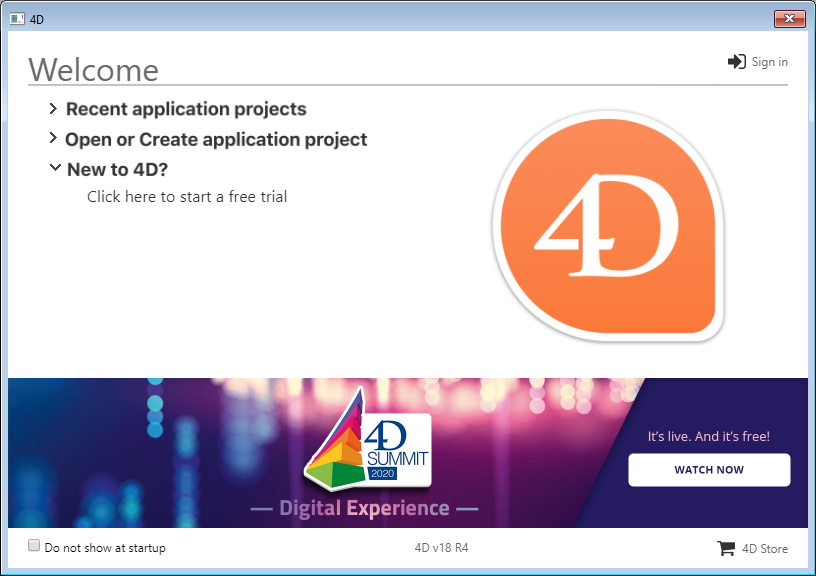

Bem-vindo a 4D! Vai encontrar abaixo toda informação necessário para instalar e registrar sua aplicação 4D.

## Configuração necessária

Consulte a [página de descarga de produto](https://us.4d.com/product-download) no web site de 4D para conhecer a configuração mínima de Mac / Windows para sua serie 4D.

Todos os detalhes estão disponíveis na [página Recursos](https://us.4d.com/resources/feature-release) do website de 4D.

## Instalação no disco

Os produtos 4D são instalados desde o website de 4D:

1. Utilizando seu navegador, conecte-se ao website de 4D e vá à página de [Descargas/downloads](https://us.4d.com/product-download/Feature-Release).

2. Clique no link de download do seu produto e siga as instruções exibidas na tela.

## Iniciar sessão

Quando tiver completado a instalação, pode iniciar 4D e entrar. Para fazer isso, clique duas vezes no ícone do produto 4D.

Aparece então o Assistente de Boas-vindas:

- Se quiser descobrir e explorar 4D, clique no link **free trial** . Digite seu ID (email ou conta 4D) e sua senha.

- Se já tiver uma conta 4D, clique no link **Sign in** no canto superior direito da caixa de diálogo do Welcome Wizard e introduza a informação da sua conta. Qualquer licença 4D já registada é automaticamente atualizada (ou pacotes de expansão adicionais são carregados) na sua máquina.

Expanda a área **Abrir ou criar aplicação de projecto** e selecione a ação que quiser executar:

- **Conectar ao Servidor 4D** - use 4D como um cliente remoto e conecte-se a uma aplicação que já esteja carregada pelo Servidor 4D.

- **Abrir um projeto de aplicação local** - carregar um projeto de aplicação existente armazenado no seu disco.

- **Criar um novo projeto de aplicação** - criar um novo projeto de aplicação vazio no seu disco.

Desfrute da sua experiência 4D!

:::info

Também é preciso ativar qualquer licença adicional que obter. Visite a página [Managing 4D licenses](../Admin/licenses.md) .

:::