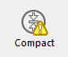

A página de Informação fornece informações sobre os ambientes 4D e sistema, bem como o banco de dados e os arquivos da aplicação. Cada página pode ser exibida usando controles de guia na parte superior da janela.

## Programa

Essa página indica o nome, a versão e o local da aplicação, bem como a pasta 4D ativa (para obter mais informações sobre a pasta 4D ativa, consulte a descrição do comando `Get 4D folder` no manual *Linguagem 4D*).

A parte central da janela indica o nome e local do projeto de bancos de dados e arquivos de dados assim como o arquivo de histórico (se houver). A parte inferior da janela indica o nome do titular da licença 4D, o tipo de licença e o nome de usuário do banco de dados quando ativar as senhas (ou o Designer se não for o caso).

- **Exibição e seleção de nomes de caminho**: na guia **Programa**, os nomes de caminho são exibidos em menus pop-up que contêm a sequência de pastas conforme encontrada no disco:  
   Se você selecionar um item de menu (disco ou pasta), ele será exibido em uma nova janela do sistema. O comando **Copie o caminho** copia o nome completo do caminho como texto para a área de transferência, usando os separadores da plataforma atual.

- **Pasta "Licenses"** O botão **Pasta "Licenses"** exibe o conteúdo da pasta Licenses ativa em uma nova janela do sistema. Todos os arquivos de licença instalados em seu ambiente 4D estão agrupados nessa pasta, em seu disco duro. Quando são abertos com um navegador Web, esses arquivos exibem informações sobre as licenças que contêm e suas características. O local da pasta "Licenses" pode variar conforme a versão do seu sistema operacional. Para obter mais informações sobre a localização desta pasta, consulte o comando `Get 4D folder`. ***Nota:** você também pode acessar esta pasta a partir da caixa de diálogo "Atualizar Licença" (disponível no menu Ajuda).*

## Tabelas

Esta página fornece uma visão geral das tabelas da sua base de dados:

> As informações desta página estão disponíveis nos modos standard e de manutenção.

A página lista todas as tabelas do banco de dados (incluindo tabelas invisíveis), bem como suas características:

- **ID**: número interno da tabela.
- **Tabelas**: nome da tabela. Os nomes das tabelas excluídas são exibidos entre parênteses (se ainda estiverem na lixeira).
- **Registros**: número total de registros na tabela. Se um registro estiver danificado ou não puder ser lido, será exibido *Error* em vez do número. Neste caso, pode considerar a utilização das ferramentas de verificação e reparação.
- **Campos**: número de campos na tabela. Os campos invisíveis são contados, mas os campos apagados não são contados.
- **Indexes**: Número de índices de qualquer tipo na tabela
- **Criptografável**: se marcado, é selecionado o atributo **Encriptable** para a tabela ao nível da estrutura (ver o parágrafo Encriptable no Manual de Design).
- **Criptografado**: se marcada, os registros da tabela serão criptografados no arquivo de dados. ***Nota**: qualquer inconstância entre as opções Criptografável e Criptografado exige que você verifique o estado da criptografia do arquivo de dados na página Criptografar do CSM.*
- **Tamanho da tabela endereços**: tamanho da tabela de endereços para cada tabela. A tabela de endereços é uma tabela interna que armazena um elemento por registro criado na tabela. Na verdade, associa os registos ao seu endereço físico. Por motivos de desempenho, ele não é redimensionado quando os registros são excluídos, portanto, seu tamanho pode diferir do número atual de registros na tabela. Se essa diferença for significativa, uma operação de compactação de dados com a opção "Compactar tabela de endereços" marcada poderá ser executada para otimizar o tamanho da tabela de endereços (consulte a página [Compactar](compact.md)). ***Nota:** as diferenças entre tamanho da tabela de endereço e número de registro também podem resultar de um incidente durante a gravação do cache no disco.*

## Dados

A página **Dados** fornece informações sobre o espaço disponível e usado no arquivo de dados.
> Esta página não pode ser acedida em modo manutenção

As informações são fornecidas sob a forma de gráficos:

> Esta página não considera nenhum dado que possa estar armazenado fora do arquivo de dados (consulte "Armazenamento externo").

Arquivos que são muito fragmentados reduzem o desempenho do disco e, assim, do banco de dados. Se a taxa de ocupação for muito baixa, 4D indicará isso por um ícone de aviso (exibido no botão Informações e na guia do tipo de arquivo correspondente) e especificará que a compactação é necessária:

Um ícone de aviso também é exibido no botão da página [Compactar](compact.md): 
