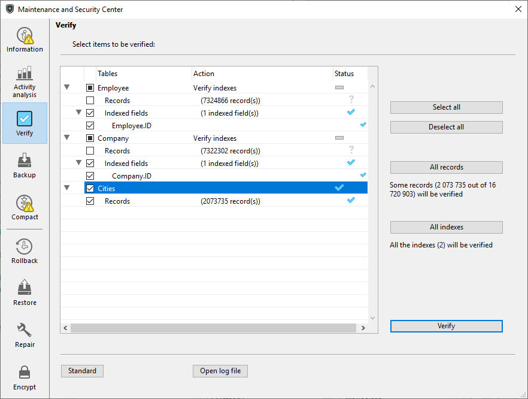

Esta página é utilizada para verificar a integridade dos dados. A verificação pode ser efetuada em registos e/ou índices. Esta página apenas verifica a integridade dos dados. If errors are found and repairs are needed, you will be advised to use the [Repair page](repair.md).

## Acções

A página contém botões de ação que fornecem acesso direto às funções de verificação.
> When the database is encrypted, verification includes validation of encrypted data consistency. If no valid data key has already been provided, a dialog requesting the passphrase or the data key is displayed.

- **Verify the records and the indexes:** Starts the total data verification procedure.
- **Verify the records only**: Starts the verification procedure for records only (indexes are not verified).
- **Verify the indexes only**: Starts the verification procedure for indexes only (records are not verified).
> > > Verification of records and indexes can also be carried out in detail mode, table by table (see the Details section below).

## Open log file

Independente da verificação solicitada, 4D gera um arquivo de histórico na pasta `Logs` do banco de dados. This file lists all the verifications carried out and indicates any errors encountered, when applicable ([OK] is displayed when the verification is correct). It is created in XML format and is named: *ApplicationName**Verify_Log**yyyy-mm-dd hh-mm-ss*.xml where:

- *NomBase* é o nome do arquivo de estrutura sem extensão, por exemplo "Faturas",
- *yyyy-mm-dd hh-mm-ss* is the timestamp of the file, based upon the local system time when the maintenance operation was started, for example "2019-02-11 15-20-45".

When you click on the **Open log file** button, 4D displays the most recent log file in the default browser of the machine.

## Detalhes

The **Table list** button displays a detailed page that can be used to view and select the actual records and indexes to be checked:

Specifying the items to be verified lets you save time during the verification procedure.

The main list displays all the tables of the database. For each table, you can limit the verification to the records and/or indexes. Expand the contents of a table or the indexed fields and select/deselect the checkboxes as desired. Por padrão, tudo está selecionado. You can also use the **Select all**, **Deselect all**, **All records** and **All indexes** shortcut buttons.

Para cada linha da tabela, a coluna "Ação" indica as operações a realizar. When the table is expanded, the "Records" and "Indexed fields" rows indicate the number of items concerned.

The "Status" column displays the verification status of each item using symbols:

|   | A verificação foi efetuada sem problema      |
| --------------------------------- | -------------------------------------------- |
|  | Verificação efectuada, problemas encontrados |
|  | Verificação parcialmente efectuada           |
|   | Verificação não efectuada                    |

Click on **Verify** to begin the verification or on **Standard** to go back to the standard page.

The **Open log file** button can be used to display the log file in the default browser of the machine (see [Open log file](#open-log-file) above).
> The standard page will not take any modifications made on the detailed page into account: when you click on a verification button on the standard page, all the items are verified. On the other hand, the settings made on the detailed page are kept from one session to another.
