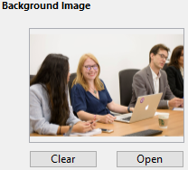
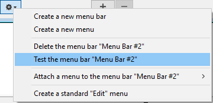

As barras de menu constituem a principal interface das aplicações personalizadas. Para cada aplicação personalizada, você deve criar pelo menos uma barra de menu com pelo menos um menu. Por padrão, a Barra de menus nº 1 é a barra de menus exibida no ambiente da aplicação. Você pode alterar qual barra de menu é exibida usando o comando `SET MENU BAR`.

4D permite que você associe uma imagem de tela inicial personalizada a cada barra de menu e visualize essa barra de menu a qualquer momento.

## Tela inicial

É possível aprimorar a aparência de cada barra de menu associando-lhe uma tela inicial personalizada. A janela que contém a tela inicial é exibida abaixo da barra de menus quando ela aparece. Pode conter um logótipo ou qualquer tipo de imagem. Por padrão, 4D mostra o logo 4D na tela inicial:

Uma imagem personalizada de tela de inicialização pode vir de qualquer aplicação gráfica. 4D permite que você cole uma imagem da área de transferência ou use qualquer imagem presente em seu disco duro. Qualquer formato de imagem padrão suportado por 4D pode ser usado.

A imagem da tela inicial só pode ser definida no Editor de menus: selecione a barra de menus à qual deseja associar a tela inicial personalizada. Note a área "Imagem de fundo" na parte direita da janela. Para abrir diretamente uma imagem armazenada em seu disco, clique no botão **Abrir** ou clique na área "Imagem de fundo". É apresentado um menu de contexto:

- Para colar uma imagem da área de transferência, selecione **Colar**.
- Para abrir uma imagem armazenada em um arquivo de disco, selecione **Abrir**. Se você escolher Abrir, uma caixa de diálogo Abrir padrão irá aparecer para você poder selecionar o arquivo de imagem a ser usado. Uma vez definida, a imagem é apresentada em miniatura na área. É então associado à barra de menus.

É possível visualizar o resultado testando a barra de menus (consulte a seção a seguir). No modo Aplicação, a imagem é exibida na tela inicial com o formato do tipo "Truncado (centralizado)".

> Pode escolher se quer exibir ou esconder a janela usando a opção **Mostrar a barra de ferramentas** nas Propriedades do Banco de Dados.

Para remover a imagem personalizada e exibir a imagem padrão, clique no botão **Limpar** ou selecione **Limpar** no menu pop-up da área.

## Pré-visualização de barras de menu

O editor da barra de menus permite que você visualize os menus personalizados e a tela inicial a qualquer momento, sem fechar a janela da caixa de ferramentas.

Para fazer isso, basta selecionar a barra de menus e escolher **Testar a barra de menus "Barra de menus #X"** no menu de contexto ou no menu de opções do editor.

4D mostra uma pré-visualização da barra de menu assim como o ecrã inicial. Você pode rolar os menus e submenus para visualizar seu conteúdo. No entanto, estes menus não estão activos. Para testar o funcionamento dos menus e da barra de ferramentas, você deve usar o comando **Testar aplicativo** no menu **Executar**.
