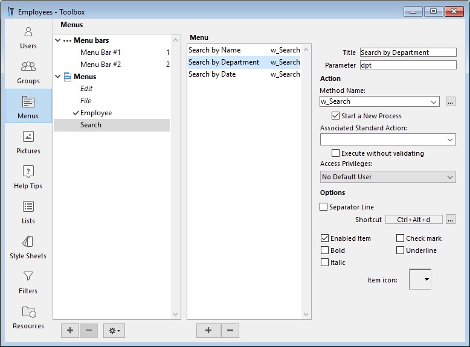

Pode criar barras de menu e menus para as suas aplicações 4D. Como os menus suspensos são um recurso padrão de qualquer aplicação de desktop, a adição deles facilitará o uso das aplicações e os tornará familiares aos usuários.

Uma **barra de menus** é um grupo de menus que podem ser exibidos juntos em uma tela. Cada **menu** em uma barra de menu pode ter vários comandos de menu, incluindo alguns que chamam submenus em cascata (ou submenus hierárquicos). Quando o usuário seleciona um comando de menu ou submenu, ele chama um método projeto ou uma ação padrão que executa uma operação.

É possível ter várias barras de menu separadas para cada aplicação. Por exemplo, você pode usar uma barra de menu que contenha menus para operações padrão no banco de dados e outra que fique ativa somente para relatórios. Uma barra de menu pode conter um menu com comandos de menu para inserir registros. A barra de menu que aparece com o formulário de entrada pode conter o mesmo menu, mas os comandos do menu estão desativados porque o usuário não precisa deles durante a entrada de dados.

Você pode usar o mesmo menu em várias barras de menu ou outros menus, ou pode deixá-lo solto e gerenciá-lo apenas por programação (nesse caso, ele é conhecido como menu independente).

Quando conceber menus, tenha em mente as duas regras seguintes:

- Use menus para funções adequadas a menus: os comandos do menu devem executar tarefas como adicionar um registro, pesquisar registros ou imprimir um relatório.
- Agrupe os comandos do menu por função: por exemplo, todos os comandos de menu que imprimem relatórios devem estar no mesmo menu. Em outro exemplo, você pode ter todas as operações de uma determinada tabela em um menu.

Para criar menus e barras de menu, pode utilizar qualquer um deles:

- o editor de menus da caixa de ferramentas,
- comandos de linguagem para o tema "Menus",
- uma combinação de ambos.

## Editor de menus

O editor de menus é acessado com o botão **Menus** da Caixa de ferramentas.

Os menus e as barras de menu são exibidos como dois itens da mesma lista hierárquica, no lado esquerdo da caixa de diálogo. Cada menu pode ser anexado a uma barra de menus ou a outro menu. No segundo caso, o menu torna-se um sub-menu.

4D atribui números de barra de menu sequencialmente - a barra de menu #1 aparece primeiro. É possível mudar o nome das barras de menu, mas não é possível alterar os seus números. Estes números são utilizados pelos comandos da linguaje.
