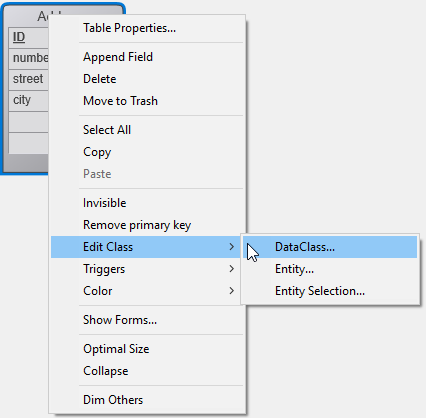

O ORDA permite-lhe criar funções de classe de alto nível acima do modelo de dados. Isto permite-lhe escrever código orientado para o negócio e "publicá-lo" tal como uma API. Datastore, classes de dados, seleções de entidades e entidades estão todos disponíveis como objetos de classe que podem conter funções.

Por exemplo, pode criar uma função `getNextWithHigherSalary()` na classe `EmployeeEntity` para devolver os empregados com um salário superior ao selecionado. Seria tão simples como chamar:

```4d
$nextHigh:=ds. Employee.get(1).getNextWithHigherSalary()
```

Os desenvolvedores podem não só utilizar estas funções em datastores locais, mas também em arquiteturas cliente/servidor e remotas:

```4d
 //$cityManager é a referência de um datastore remoto
Form.comp.city:=$cityManager.City.getCityName(Form.comp.zipcode)
```

Graças a esta caraterística, toda a lógica comercial da sua aplicação 4D pode ser armazenada como uma camada independente para que possa ser facilmente mantida e reutilizada com um alto nível de segurança:

- É possível "esconder" a complexidade global da estrutura física subjacente e expor apenas funções compreensíveis e prontas a utilizar.

- Se a estrutura física evoluir, pode simplesmente adaptar o código da função e as aplicações cliente continuarão a chamá-las de forma transparente.

- By default, all of your data model class functions are **not exposed** to remote applications and cannot be called from REST requests. You must explicitly declare each public function with the [`exposed`](#exposed-vs-non-exposed-functions) keyword.


Além disso, 4D [pré-criou automaticamente](#creating-classes) as classes para cada objeto de modelo de dados disponível.

## Arquitetura

A ORDA fornece **classes genéricas** expostas através da loja de classes **`4D`** [](Concepts/classes.md#class-stores), bem como **classes de utilizador** (que estendem as classes genéricas) expostas na loja de classes **`cs`** [](Concepts/classes.md#class-stores):


Todas as classes do modelo de dados ORDA são expostas como propriedades do armazenamento de classes **`cs`** . Estão disponíveis as seguintes classes ORDA:

| Class                       | Nome do exemplo       | Instanciado por                                                                                                                                                                                                                                                                                                                                                                                                                                                                                                                                                                                                                                                                                                                                                                                                                                                        |
| --------------------------- | --------------------- | ---------------------------------------------------------------------------------------------------------------------------------------------------------------------------------------------------------------------------------------------------------------------------------------------------------------------------------------------------------------------------------------------------------------------------------------------------------------------------------------------------------------------------------------------------------------------------------------------------------------------------------------------------------------------------------------------------------------------------------------------------------------------------------------------------------------------------------------------------------------------- |
| cs. DataStore               | cs. DataStore         | comando [`ds`](API/DataStoreClass.md#ds)                                                                                                                                                                                                                                                                                                                                                                                                                                                                                                                                                                                                                                                                                                                                                                                                                               |
| cs.*DataClassName*          | cs. Employee          | [`dataStore. DataClassName`](API/DataStoreClass.md#dataclassname), `dataStore["DataClassName"]`                                                                                                                                                                                                                                                                                                                                                                                                                                                                                                                                                                                                                                                                                                                                                                        |
| cs.*DataClassName*Entity    | cs. EmployeeEntity    | [`dataClass.get()`](API/DataClassClass.md#get), [`dataClass.new()`](API/DataClassClass.md#new), [`entitySelection.first()`](API/EntitySelectionClass.md#first), [`entitySelection.last()`](API/EntitySelectionClass.md#last), [`entity.previous()`](API/EntityClass.md#previous), [`entity.next()`](API/EntityClass.md#next), [`entity.first()`](API/EntityClass.md#first), [`entity.last()`](API/EntityClass.md#last), [`entity.clone()`](API/EntityClass.md#clone)                                                                                                                                                                                                                                                                                                                                                                                                   |
| cs.*DataClassName*Selection | cs. EmployeeSelection | [`dataClass.query()`](API/DataClassClass.md#query), [`entitySelection.query()`](API/EntitySelectionClass.md#query), [`dataClass.all()`](API/DataClassClass.md#all), [`dataClass.fromCollection()`](API/DataClassClass.md#fromcollection), [`dataClass.newSelection()`](API/DataClassClass.md#newselection), [`entitySelection.drop()`](API/EntitySelectionClass.md#drop), [`entity.getSelection()`](API/EntityClass.md#getselection), [`entitySelection.and()`](API/EntitySelectionClass.md#and), [`entitySelection.minus()`](API/EntitySelectionClass.md#minus), [`entitySelection.or()`](API/EntitySelectionClass.md#or), [`entitySelection.orderBy()`](API/EntitySelectionClass.md#or), [`entitySelection.orderByFormula()`](API/EntitySelectionClass.md#orderbyformula), [`entitySelection.slice()`](API/EntitySelectionClass.md#slice), `Create entity selection` |

> As classes de utilizador ORDA são armazenadas como arquivos de classe normais (.4dm) na subpasta Classes do projeto [(ver abaixo)](#class-files).

Além disso, as instâncias de objetos das classes de usuárioes do modelo de dados ORDA beneficiam das propriedades e funções dos seus pais:

- um objeto da classe Datastore pode chamar funções da classe genérica [ORDA Datastore](API/DataStoreClass.md).
- um objeto da classe Dataclass pode chamar funções da classe genérica [ORDA Dataclass](API/DataClassClass.md).
- um objeto da classe Seleção de entidades pode chamar funções da classe genérica [ORDA Seleção de entidades](API/EntitySelectionClass.md).
- um objeto da classe Entidade pode chamar funções da classe genérica [ORDA Entity](API/EntityClass.md).

## Descrição da classe

<details><summary>Histórico</summary>

| Versão | Mudanças                                                                                                                |
| ------ | ----------------------------------------------------------------------------------------------------------------------- |
| v18 R5 | As funções de classe do modelo de dados não são expostas ao REST por defeito. Novas palavras-chave `exposed` e `local`. |
</details>

### Classe DataStore

Uma base de dados 4D expõe a sua própria classe DataStore na loja de classes `cs` .

- **Extends**: 4D. DataStoreImplementation
- **Class name**: cs. DataStore

É possível criar funções na classe DataStore que estarão disponíveis através do objeto `ds` .

#### Exemplo

```4d  
// cs. DataStore class Class extends DataStoreImplementation Function getDesc
  $0:="Database exposing employees and their companies"
```

Esta função pode então ser chamada:

```4d
$desc:=ds.getDesc() //"Database exposing..."
```

### Classe DataClass

Cada tabela exposta com ORDA oferece uma classe DataClass no armazenamento de classes `cs` .

- **Extends**: 4D. DataClass
- **Nome da classe**: cs.*DataClassName* (em que *DataClassName* é o nome da tabela)
- **Example name**: cs. Employee

#### Exemplo

```4D
// cs.Company class


Class extends DataClass

// Returns companies whose revenue is over the average
// Returns an entity selection related to the Company DataClass

Function GetBestOnes()
 $sel:=This.query("revenues >= :1";This.all().average("revenues"));
 $0:=$sel
```

Em seguida, pode obter uma seleção de entidades das "melhores" empresas através da execução:

```4d
 var $best : cs.CompanySelection
 $best:=ds.Company.GetBestOnes()
```

#### Exemplo com um datastore remoto

O seguinte catálogo *City* está exposto num datastore remoto (vista parcial):


A classe `City` fornece uma API:

```4d  
// cs.City class

Class extends DataClass

Function getCityName()
 var $1; $zipcode : Integer
 var $zip : 4D.Entity
 var $0 : Text

 $zipcode:=$1
 $zip:=ds.ZipCode.get($zipcode)
 $0:="" 

 If ($zip#Null)
  $0:=$zip.city.name
 End if
```

The client application opens a session on the remote datastore:

```4d
$cityManager:=Open datastore(New object("hostname";"127.0.0.1:8111");"CityManager")
```

Then a client application can use the API to get the city matching a zip code (for example) from a form:

```4d
Form.comp.city:=$cityManager. City.getCityName(Form.comp.zipcode)

```

### Classe EntitySelection

Each table exposed with ORDA offers an EntitySelection class in the `cs` class store.

- **Extends**: 4D. EntitySelection
- **Class name**: *DataClassName*Selection (where *DataClassName* is the table name)
- **Example name**: cs. EmployeeSelection

#### Exemplo

```4d
// cs.EmployeeSelection class


Class extends EntitySelection

//Extract the employees with a salary greater than the average from this entity selection 

Function withSalaryGreaterThanAverage
 C_OBJECT($0)
 $0:=This.query("salary > :1";This.average("salary")).orderBy("salary")

```

Then you can get employees with a salary greater than the average in any entity selection by executing:

```4d
$moreThanAvg:=ds. Company.all().employees.withSalaryGreaterThanAverage()
```

### Entity Class

Each table exposed with ORDA offers an Entity class in the `cs` class store.

- **Extends**: 4D. Entity
- **Class name**: *DataClassName*Entity (where *DataClassName* is the table name)
- **Example name**: cs. CityEntity

#### Exemplo

```4d
// cs.CityEntity class

Class extends Entity

Function getPopulation()
    $0:=This.zips.sum("population")


Function isBigCity
C_BOOLEAN($0)
// The getPopulation() function is usable inside the class
$0:=This.getPopulation()>50000
```

Em seguida, pode chamar este código:

```4d
var $cityManager; $city : Object

$cityManager:=Open datastore(New object("hostname";"127.0.0.1:8111");"CityManager")
$city:=$cityManager.City.getCity("Caguas")

If ($city.isBigCity())
 ALERT($city.name + " is a big city")
End if
```

### Regras específicas

When creating or editing data model classes, you must pay attention to the following rules:

- Since they are used to define automatic DataClass class names in the **cs** [class store](Concepts/classes.md#class-stores), 4D tables must be named in order to avoid any conflict in the **cs** namespace. Em particular:
  - Do not give the same name to a 4D table and to a [user class name](Concepts/classes.md#class-names). If such a case occurs, the constructor of the user class becomes unusable (a warning is returned by the compiler).
  - Não use um nome reservado para uma tabela 4D (por exemplo, "DataClass").

- When defining a class, make sure the [`Class extends`](Concepts/classes.md#class-extends-classnameclass) statement exactly matches the parent class name (remember that they're case sensitive). For example, `Class extends EntitySelection` for an entity selection class.

- You cannot instantiate a data model class object with the `new()` keyword (an error is returned). You must use a regular method as listed in the [`Instantiated by` column of the ORDA class table](#architecture).

- You cannot override a native ORDA class function from the **`4D`** [class store](Concepts/classes.md#class-stores) with a data model user class function.

## Funções expostas vs não expostas

For security reasons, all of your data model class functions are **not exposed** (i.e., private) by default to remote requests.

Os pedidos remotos incluem:

- Requests sent by remote 4D applications connected through `Open datastore`
- Pedidos REST

> Regular 4D client/server requests are not impacted. Data model class functions are always available in this architecture.

A function that is not exposed is not available on remote applications and cannot be called on any object instance from a REST request. If a remote application tries to access a non-exposed function, the "-10729 - Unknown member method" error is returned.

To allow a data model class function to be called by a remote request, you must explicitly declare it using the `exposed` keyword. A sintaxe formal é:

```4d  
// declare an exposed function
exposed Function <functionName>   
```

> The `exposed` keyword can only be used with Data model class functions. If used with a [regular user class](Concepts/classes.md) function, it is ignored and an error is returned by the compiler.

### Exemplo

You want an exposed function to use a private function in a dataclass class:

```4d
Class extends DataClass

//Public function
exposed Function registerNewStudent($student : Object) -> $status : Object

var $entity : cs. StudentsEntity

$entity:=ds. Students.new()
$entity.fromObject($student)
$entity.school:=This.query("name=:1"; $student.schoolName).first()
$entity.serialNumber:=This.computeSerialNumber()
$status:=$entity.save()

//Not exposed (private) function Function computeIDNumber()-> $id : Integer
//compute a new ID number
$id:=...

```

Quando o código é chamado:

```4d
var $remoteDS; $student; $status : Object
var $id : Integer

$remoteDS:=Open datastore(New object("hostname"; "127.0.0.1:8044"); "students")
$student:=New object("firstname"; "Mary"; "lastname"; "Smith"; "schoolName"; "Math school")

$status:=$remoteDS. Schools.registerNewStudent($student) // OK
$id:=$remoteDS. Schools.computeIDNumber() // Error "Unknown member method" 
```

## Funções locais

By default in client/server architecture, ORDA data model functions are executed **on the server**. It usually provides the best performance since only the function request and the result are sent over the network.

However, it could happen that a function is fully executable on the client side (e.g., when it processes data that's already in the local cache). In this case, you can save requests to the server and thus, enhance the application performance by inserting the `local` keyword. A sintaxe formal é:

```4d  
// declare a function to execute locally in client/server
local Function <functionName>   
```

With this keyword, the function will always be executed on the client side.

> The `local` keyword can only be used with data model class functions. If used with a [regular user class](Concepts/classes.md) function, it is ignored and an error is returned by the compiler.

Note that the function will work even if it eventually requires to access the server (for example if the ORDA cache is expired). However, it is highly recommended to make sure that the local function does not access data on the server, otherwise the local execution could not bring any performance benefit. A local function that generates many requests to the server is less efficient than a function executed on the server that would only return the resulting values. For example, consider the following function on the Schools entity class:

```4d
// Get the youngest students  
// Inappropriate use of local keyword
local Function getYoungest
 var $0 : Object
    $0:=This.students.query("birthDate >= :1"; !2000-01-01!).orderBy("birthDate desc").slice(0; 5)
```

- **without** the `local` keyword, the result is given using a single request
- **with** the `local` keyword, 4 requests are necessary: one to get the Schools entity students, one for the `query()`, one for the `orderBy()`, and one for the `slice()`. In this example, using the `local` keyword is inappropriate.

### Exemplos

#### Cálculo da idade

Given an entity with a *birthDate* attribute, we want to define an `age()` function that would be called in a list box. This function can be executed on the client, which avoids triggering a request to the server for each line of the list box.

Na classe *StudentsEntity*:

```4d
Class extends Entity

local Function age() -> $age: Variant
    If (This.birthDate#!00-00-00!)
    If (This.birthDate#!00-00-00!)
    $age:=Year of(Current date)-Year of(This.birthDate)
Else 
    $age:=Null End if
```

#### Verificação de atributos

We want to check the consistency of the attributes of an entity loaded on the client and updated by the user before requesting the server to save them.

On the *StudentsEntity* class, the local `checkData()` function checks the Student's age:

```4d
Classe extends Entity

local Function checkData() -> $status : Object

$status:=New object("success"; True)
Case of
    : (This.age()=Null)
        $status.success:=False
        $status.statusText:="Falta a data de nascimento" 

    :((This.age() <15) | (This.age()>30) )
        $status.success:=False
        $status.statusText:="O estudante tem de ter entre 15 e 30 anos - Este é "+String(This.age())
End case
```

Código de chamada:

```4d
var $status : Object

//Form.student is loaded with all its attributes and updated on a Form
$status:=Form.student.checkData()
If ($status.success)
    $status:=Form.student.save() // call the server End if
```

## Suporte a projetos 4D

### Ficheiros de classe (class files)

An ORDA data model user class is defined by adding, at the [same location as regular class files](Concepts/classes.md#class-files) (*i.e.* in the `/Sources/Classes` folder of the project folder), a .4dm file with the name of the class. For example, an entity class for the `Utilities` dataclass will be defined through a `UtilitiesEntity.4dm` file.

### Criação de classes

4D automatically pre-creates empty classes in memory for each available data model object.


> By default, empty ORDA classes are not displayed in the Explorer. To show them you need to select **Show all data classes** from the Explorer's options menu: 

ORDA user classes have a different icon from regular classes. Empty classes are dimmed:


To create an ORDA class file, you just need to double-click on the corresponding predefined class in the Explorer. 4D creates the class file and add the `extends` code. Por exemplo, para uma classe Entity:

```
Class extends Entity
```

Once a class is defined, its name is no longer dimmed in the Explorer.

### Edição de classes

To open a defined ORDA class in the 4D method editor, select or double-click on an ORDA class name and use **Edit...** from the contextual menu/options menu of the Explorer window:


For ORDA classes based upon the local datastore (`ds`), you can directly access the class code from the 4D Structure window:



### Editor de método

In the 4D method editor, variables typed as an ORDA class automatically benefit from autocompletion features. Exemplo com uma variável de classe Entity:


