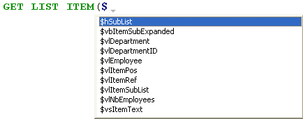

Esta página contém parâmetros que definem a interface do editor do Método e a exibição é padrão, bem como opções relacionadas a sua operação. Está dividida em duas secções às quais se acede através dos separadores Tema e Opções.

## Temas

Esta página permite selecionar, criar ou configurar os temas do editor de método. Um tema define a fonte, o tamanho da fonte, as cores e os estilos dos itens apresentados no editor de código.

### Lista de temas

Nesta lista, seleciona o tema a aplicar ao editor de código. São apresentados todos os temas disponíveis, incluindo os temas personalizados (se existirem). 4D fornece dois temas por padrão:

* **Tema Light predefinido**
* **Tema escuro predefinido**

> Os temas padrão não podem ser modificados ou eliminados.

Um tema **myTheme** é automaticamente adicionado se já personalizou os estilos de editor de métodos em versões 4D anteriores.

### Criar temas personalizados

É possível criar temas que podem ser totalmente personalizados. Para criar um tema, selecione um tema existente e clique em **+** na parte inferior da lista de temas. Também pode adicionar temas personalizados copiando ficheiros de temas na pasta `4D Editor Themes` (ver abaixo).

### Ficheiros de temas personalizados

Cada tema personalizado é armazenado em um único arquivo JSON chamado *themeName.json*. Os arquivos JSON para temas personalizados são armazenados na pasta `4D Editor Themes` localizada no mesmo nível que o [ficheiro de preferências](overview.md#storage) de 4D.

Se os valores-chave não forem definidos em um tema personalizado, eles terão como padrão os valores do tema *Default Light Theme*. Se um ficheiro de tema JSON for inválido, o tema *Default Light Theme* é carregado sendo gerado um erro.

> Quando um ficheiro de tema é modificado por um editor externo, 4D deve ser reiniciado para considerar a(s) modificação(ões).

## Definição do tema

Definir um tema significa:

* definir um tipo de letra e um tamanho de letra globais para todo o editor de código,
* atribuir estilos e cores específicos a cada elemento da linguagem 4D (campos, tabelas, variáveis, parâmetros, SQL, etc.), elemento da linguagem SQL (palavras-chave, funções, etc.) e fundos de cor.

A combinação de cores e estilos diferentes é particularmente útil para manutenção do código.

### Tipo e tamanho de letra

Os menus **fonte** e **tamanho da fonte** permitem-lhe selecionar o nome e o tamanho da letra utilizado na área de entrada do Editor de métodos para todas as categorias.

### Linguagem 4D e Linguagem SQL

Pode definir estilos de letra e cores diferentes (cor da letra ou cor de fundo) cada tipo de elemento de linguagem. Pode selecionar o(s) elemento(s) a personalizar na lista Categoria.

### Outros estilos

Essas opções configuram as várias cores usadas nas interfaces do Editor de métodos e do depurador.

|                                                | Descrição                                                                                                                                                          |
| ---------------------------------------------- | ------------------------------------------------------------------------------------------------------------------------------------------------------------------ |
| **Cor de fundo**                               | Cor de fundo da janela do editor de métodos.                                                                                                                       |
| **Borda da linha em execução no depurador**    | Cor da borda que envolve a linha de execução no depurador quando a opção "Destacar linha de execução" está ativada na página [Opções](#options).                   |
| **Cor de fundo da linha do cursor**            | Cor de fundo da linha que contém o cursor.                                                                                                                         |
| **Cor de fundo da linha de execução**          | Cor de fundo da linha que está a ser executada no depurador.                                                                                                       |
| **Destaque das palavras encontradas**          | Cor de destaque das palavras encontradas numa pesquisa.                                                                                                            |
| **Destaque dos parênteses**                    | Cor de realce dos parênteses correspondentes (utilizada quando os pares de parênteses são assinalados por realce, ver [Opções](#options)).                         |
| **Destaque dos blocos**                        | Cor de realce dos blocos lógicos selecionados quando a opção "Realçar blocos lógicos" está ativada em [Opções](#options).                                          |
| **Realce da mesma variável ou campo**          | Cor de realce para outras ocorrências da mesma variável ou texto de campo quando uma das opções "Realçar variáveis e texto" estiver ativada em [Opções](#options). |
| **Destaque da linha em execução no depurador** | Cor de realce da linha atualmente em execução no depurador quando a opção "Realçar linha em execução" está ativada em [Opções](#options).                          |
| **Cor de fundo da seleção**                    | Cor de fundo da seleção.                                                                                                                                           |
| **Texto sugerido**                             | Cor do texto do preenchimento automático sugerido pelo editor de métodos.                                                                                          |

## Opções

Esta página configura as opções de visualização do editor de métodos.

### Opções

#### Linguagem de programação 4D (Use os parâmetros regionais do sistema)

Permite-lhe desativar/ativar os parâmetros do código "internacional" para a aplicação 4D local.

* **não selecionado** (padrão): os parâmetros English-US e a linguajem de programação inglês são utilizados nos métodos 4D.
* **verificado**: os parâmetros regionais são utilizados nos métodos 4D.

> Se modificar esta opção, tem de reiniciar a aplicação 4D para que a alteração seja tida em conta.

#### Indentação

Altera o valor de indentação do código 4D no editor de métodos. A largura deve ser especificada em pontos (10 por defeito).

O código 4D é automaticamente indentado para revelar a sua estrutura:

A modificação deste valor predefinido pode ser útil se os seus métodos contiverem algoritmos complexos com muitos níveis de incorporação. Pode ser utilizada uma indentação mais estreita para limitar a deslocação horizontal.

#### Mostrar os números de linha

Permite-lhe apresentar os números de linha por padrão em cada janela do Editor de métodos. Também pode mostrar/ocultar números de linha para a janela atual diretamente a partir do Editor de métodos.

#### Mostrar as listas

Permite-lhe escolher se quer ou não mostrar as listas de objetos (Comandos, Tabelas e campos, etc.) por padrão quando a janela do Editor de métodos é aberta. Você também pode mostrar ou ocultar cada lista diretamente no editor de métodos.

#### Destacar os blocos lógicos

Quando marcada, todo o código pertencente a um bloco lógico (If/End if, por exemplo) é realçado quando o rato é colocado sobre o nó expandido:

A cor de destaque pode ser definida na página [Tema](#theme-definition).

#### Mostrar sempre as linhas de bloco

Oculta permanentemente as linhas verticais dos blocos. As linhas de bloco são concebidas para ligar visualmente os nós. Por padrão, são sempre apresentados (exceto quando os ícones de recolher/expandir estão ocultos, ver abaixo).

#### Ocultar ícones recolher/expandir

Permite-lhe ocultar todos os ícones de expansão/recolhimento por padrão ao apresentar o código. Quando a opção está selecionada, os ícones dos nós (bem como as linhas de bloco locais, ver acima) são apresentados temporariamente quando o rato é colocado sobre um nó:

#### Inserir () e fechar } ) ] "

Permite a inserção automática de () e de chaves de fecho durante a escrita de código. Esta opção controla duas funcionalidades automáticas:

* **par de parênteses ()**: adicionado após um comando 4D, palavra-chave ou método projeto inserido a partir de uma lista de sugestões ou de conclusão, se o elemento inserido requer um ou mais argumentos obrigatórios. Por exemplo, se escrever "C_OB" e pressionar Tab, 4D escreve "C_OBJECT()" e coloca o ponto de inserção dentro do ().

* **}, ), ], ou "**: carácter adicionado quando se escreve respetivamente uma abertura {, (, ], ou ". Esta função permite inserir pares de símbolos correspondentes no ponto de inserção ou à volta de um texto selecionado. Por exemplo, se realçar uma cadeia de caracteres e escrever um único ", toda a cadeia de caracteres selecionada será colocada entre "":

  

#### Correspondência \[]\(){}

Define a sinalização gráfica das chaves correspondentes no código. Esta sinalização aparece sempre que é selecionado um parêntese quadrado, parêntese ou parêntese curvo. As opções abaixo estão disponíveis:

* **Nenhum**: sem sinalização
* **Retângulo** (padrão): parêntesis rodeados por uma linha preta  
  
* **Cor de fundo**: as chavetas são realçadas (a cor é definida na página [Tema](#theme-definition)).
* **Negrito**: as chavetas são apresentadas a negrito.

#### Destaque de variáveis e campos

Permite destacar todas as ocorrências da mesma variável ou campo numa janela de método aberta.

* **Não**(padrão): sem destaque
* **No cursor**: todas as ocorrências são realçadas quando se clica no texto
* **Na seleção**: todas as ocorrências são realçadas quando o texto é selecionado

A cor de destaque pode ser definida na página [Tema](#theme-definition).

#### Depurar (Destacar a linha em execução)

Destaca a linha que está atualmente em execução no depurador, para além do indicador de seta amarela normal.

Se anular a seleção desta opção, só é mostrada a seta amarela.

### Sugestões

Esta área permite-lhe configurar os mecanismos de preenchimento automático no Editor de métodos para o adaptar aos seus próprios hábitos de trabalho.

|                               | Descrição                                                                                                                                                                                                                                                                                                                                                                                                                 |
| ----------------------------- | ------------------------------------------------------------------------------------------------------------------------------------------------------------------------------------------------------------------------------------------------------------------------------------------------------------------------------------------------------------------------------------------------------------------------- |
| Abertura automática da janela | Acciona a apresentação automática da janela de sugestões para: <ul><li>Constantes</li><li>Variáveis (locais e interprocessos) e atributos de objetos</li><li>Tabelas</li><li>Protótipos (ou seja, as funções de classe)</li></ul>Por exemplo, quando a opção "Variáveis (locais ou interprocessos) e atributos de objeto" está selecionada, aparece uma lista de sugestões quando escreve o carácter $: Pode desativar este funcionamento para certos elementos da língua, desmarcando a opção correspondente. |
| Validação de uma sugestão     | Define o contexto de entrada que permite ao Editor de métodos validar automaticamente a sugestão atual apresentada na janela de preenchimento automático.<ul><li>**Tabulação e delimitadores** Quando esta opção está selecionada, pode validar a seleção atual com a tecla Tab ou qualquer delimitador relevante para o contexto. Por exemplo, se introduzir "ALE" e depois "(", 4D escreve automaticamente "ALERT(" no editor. Eis a lista de delimitadores tidos em conta:  ( ; : = < [ {</li><li>**Somente tabulação** Quando esta opção está selecionada, só pode utilizar a tecla Tab para inserir a sugestão atual. Isto pode ser utilizado mais particularmente para facilitar a introdução de caracteres delimitadores em nomes de elementos, tais como ${1}.**Note**: pode também fazer duplo clique na janela ou premir a tecla Retorno de carro para validar uma sugestão.</li></ul>                                                                                                                                                                                                                                        |
