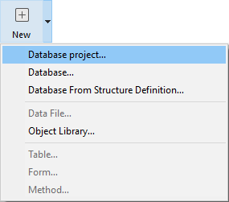

Projetos 4D são criados e desenvolvidos usando a aplicação **4D** , que fornece um abrangente Ambiente Integrado de Desenvolvimento (IDE). **4D Server** também pode criar novos projetos vazios.

O desenvolvimento multi-usuário é gerido através de ferramentas de **source control** padrão (Perforce, Git, SVN, etc.), que permitem aos programadores trabalhar em ramos diferentes e comparar, fundir ou reverter modificações.

## Criar arquivos de projeto

**Nota:** Servidor 4D pode abrir arquivos .4DProject em modo apenas leitura, mas apenas para propósitos de teste. Para lançamento, projetos 4D são oferecidos como arquivos .4dz (arquivos compactados zipados). Para saber mais, consulte [Construir um pacote de projetos](building.md). Em qualquer caso, os ficheiros de projeto são armazenados na máquina local.

Para criar um novo projeto de banco de dados:

1. Inicie 4D ou 4D Server.
2. Selecionar **Novo > Projeto...** do menu **Arquivo**: OU (4D apenas) Selecione **Projeto...** do botão **Novo** da barra de ferramentas:um dialogo padrão **Guardar** é exibido para você poder escolher o nome e local da pasta principal do projeto 4D.

3. Coloque o nome de sua pasta de projeto e clique **Guardar**. Este nome será utilizado:

- como nome de toda a pasta do projeto,
- como o nome do arquivo .4DProject na primeira fase da pasta "Projeto".

 Pode escolher qualquer nome permitido pelo seu sistema operacional. *Atenção:* se seu banco projeto estiver destinado a funcionar em outros sistemas ou a ser guardada através de uma ferramenta de controle de código fonte, deve levar em consideração suas recomendações específicas de denominação.

Quando validar a caixa de diálogo, 4D fecha o banco de dados atual (se houver) e cria uma pasta "Project" no local indicado e coloca nela todos os arquivos necessários para o funcioanamento correto do banco de dados projeto. Para saber mais, consulte [Arquitetura de um projeto 4D](Project/architecture.md).

Pode então começar a desenvolver o seu projeto.

## Abrir projeto

Lance uma aplicação 4D Developer.

1. Selecione **Abrir um projeto da aplicação local** na caixa de diálogo Assistente de Boas-vindas, OR Selecionar **Abrir/Projeto Local...** do menu **Arquivo** ou do botão **Abrir** barra de ferramentas. Aparece a caixa de diálogo padrão Abrir.

2. Selecione o arquivo `.4dproject` do projeto e clique **Abrir**. Por padrão, o projeto é aberto com seu arquivo de dados atual. Outros tipos de arquivo são sugeridos:

- *Arquivos de projeto empacotados*: `.4dz` extensão - projetos de implantação
- *Arquivos de atalho*: `.4DLink` extensão - armazenar parâmetros adicionais necessários para a abertura de projetos ou aplicativos (endereços, identificadores, etc.)
- *Arquivos binários*: `.4db` ou `.4dc` extensão - formatos de banco de dados legacy 4D

### Opções

Além das opções padrão do sistema, o diálogo *Abrir* em 4D fornece dois menus com opções específicas que estão disponíveis usando o botão **Abrir** e o menu **Arquivo de Dados**.

- **Abrir** - Modo de abertura do projeto:
  - **Interpretado** ou **Compilado**: Essas opções estão disponíveis quando o projeto selecionado contém ambos [interpretados e compilados código](Concepts/interpreted.md).
  - **[Manutenção do Centro de Segurança](MSC/overview.md)**: Abrir em modo seguro permitindo acesso a projetos danificados a fim de realizar os reparos necessários.

- **Arquivo de dados** - especifica o arquivo de dados a ser usado com o projeto. Por predefinição, a opção **Current data file** está selecionada.

## Atalhos de abertura de projectos

4D oferece várias maneiras de abrir projetos diretamente e ignorar o diálogo Aberto:

- através de opções de menu:
  - *Barra de Menu* - **Arquivo** > **Abrir Projetos Recentes / {project name}**
  - *4D Tool bar* - Selecione o projeto no menu associado ao botão **Abrir**

- através das preferências:
  - Defina a preferência geral **Na inicialização** para **Abrir o último projeto utilizado**.

- usando o arquivo `.4DLink`.

### Abrir um projeto com um ficheiro 4DLink

Você pode usar um arquivo [`.4DLink`](#about-4DLink-files) para iniciar o aplicativo 4D e abrir o projeto 4D de destino. Há duas formas de o fazer:

- duplo-clique ou arraste e solte o arquivo `.4DLink` no aplicativo 4D
- ir para **Arquivo** > **Abrir Projetos Recentes** e selecionar um projeto

Um arquivo .4DLink do tipo "projeto remoto" pode ser copiado e usado em várias máquinas.
> Também é possível selecionar um arquivo 4DLink na caixa de diálogo 4D e 4D Server de abertura (abrindo apenas projeto local).

## Sobre 4DLink Files

Arquivos com a extensão `.4DLink` são arquivos XML que contêm parâmetros destinados a automatizar e simplificar a abertura de projetos 4D locais ou remotos.

Arquivos`.4DLink` podem salvar o endereço de um projeto 4D assim como seus identificadores de conexão e modo de abertura, poupando tempo quando abrir projetos.

4D gera automaticamente um `.4DLink` arquivo quando um projeto local é aberto pela primeira vez ou quando se conecta a um servidor pela primeira vez. O arquivo é armazenado na pasta de preferências locais no seguinte local:

- Windows 7 e superior: C:\Users\UserName\AppData\Roaming\4D\Favorites vXX\
- macOS: Users/UserName/Library/Application Support/4D/Favorites vXX/

XX representa o número da versão da aplicação. Por exemplo, "Favorites v19" para 4D v19.

Esta pasta está dividida em duas subpastas:

- a pasta **Local** contém os arquivos `.4DLink` que podem ser usados para abrir projetos locais
- a pasta **Remote** contém os arquivos `.4DLink` dos projetos remotos recentes

Os arquivos `.4DLink` podem também ser criados com um editor XML.

4D fornece um DTD descrevendo as chaves XML que podem ser usadas para construir um arquivo `.4DLink`. Este DTD é nomeado database_link.dtd e é encontrado na subpasta \Resources\DTD\ da aplicação 4D.

## Guardar arquivos

Ao trabalhar em um projeto em 4D, você pode usar editores 4D integrados para criar, modificar ou salvar itens de estrutura, métodos, formulários, etc. Modificações são salvas no disco quando selecionar um item de menu **Salvar** ou quando a janela do editor perder ou ficar com o foco. Modificações são salvas no disco quando selecionar um item de menu **Salvar** ou quando a janela do editor perder ou ficar com o foco.

Jà que os editores usam arquivos no disco, podem ocorrer conflitos potenciais se o mesmo arquivo for modificado ou até mesmo excluído de locais diferentes. Por exemplo, se o mesmo método for editado em uma janela do Editor de métodos *e* em um editor de texto, salvar ambas as modificações resultarão num conflito.

A estrutura de desenvolvimento 4D inclui um gerenciador de acesso a ficheiros para controlar o acesso simultâneo:

- se um arquivo aberto for somente leitura no nível do SO, um ícone bloqueado será exibido no editor: 
- se um arquivo aberto for editado simultaneamente a partir de diferentes locais, 4D exibe uma caixa de diálogo de alerta ao tentar salvar as alterações:

- **Sim**: descartar as alterações do editor e recarregar a versão modificada
- **Não**: salve as alterações e substitui a outra versão
- **Cancelar**: não guardar

Esta funcionalidade está ativada para todos os editores 4D incorporados (Estrutura, Formulário, Método, Definições e Caixa de Ferramentas).
