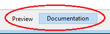

In application projects, you can document your methods as well as your forms, tables, or fields. Creating documentation is particularly appropriate for projects being developed by multiple programmers and is generally good programming practice. Documentation can contain a description of an element as well as any information necessary to understand how the element functions in the application.

Os seguintes elementos do projeto aceitam documentação:

- Methods (database methods, component methods, project methods, form methods, 4D Mobile methods, triggers, and classes)
- Formulários
- Tabela

Your documentation files are written in Markdown syntax (.md files) using any editor that supports Markdown. São armazenados como ficheiros independentes na pasta do seu projeto.

Documentation is displayed in the preview area (right-side panel) of the Explorer:


It can also be partially exposed as [code editor tips](#viewing-documentation-in-the-code-editor).

## Ficheiros documentação

### Nome do ficheiro de documentação

Documentation files have the same name as their attached element, with the ".md" extension. For example, the documentation file attached to the `myMethod.4dm` project method will be named `myMethod.md`.

In the Explorer, 4D automatically displays the documentation file with the same name as the selected element (see below).

### Arquitetura dos ficheiros de documentação

All documentation files are stored in the `Documentation` folder, located at the first level of the package folder.

A arquitetura da pasta `Documentation` é a seguinte:

- **Documentation**
  - **Classes**
    - myClass.md
  - **DatabaseMethods**
    - onStartup.md
    - ...
  - **Formulários**
    - loginDial.md
    - ...
  - **Página Métodos**
    - myMethod.md
    - ...
  - **TableForms**
    - **1**
      - input.md
      - ...
    - ...
  - **Triggers**
    - table1.md
    - ...

- A project form and its project form method share the same documentation file for form and method.
- A table form and its table form method share the same documentation file for form and method.

> Renaming or deleting a documented element in your project will also rename or delete the element's associated Markdown file.

## Documentação no Explorador

### Ver a documentação

Para visualizar a documentação na janela do Explorer:

1. Certifique-se de que a área de pré-visualização é mostrada.
2. Selecione o elemento documentado na lista do Explorador.
3. Click the **Documentation** button located below the preview area.



- If no documentation file was found for the selected element, a **Create** button is displayed (see below).

- Otherwise, if a documentation file exists for the selected element, the contents are displayed in the area. Os conteúdos não são diretamente editáveis no painel.

### Editar o ficheiro de documentação

You can create and/or edit a Markdown documentation file from the Explorer window for the selected element.

Se não houver um arquivo de documentação para o elemento selecionado, você poderá:

- click on the **Create** button in the `Documentation` pane or,
- choose the **Edit Documentation...** option in the contextual menu or options menu of the Explorer.


4D automatically creates an appropriately named .md file with a basic template at the relevant location and opens it with your default Markdown editor.

If a documentation file already exists for the selected element, you can open it with your Markdown editor by choosing the **Edit Documentation...** option in the contextual menu or options menu of the Explorer.

## Ver a documentação no editor de código

The 4D code editor displays a part of a method's documentation in its help tip.


If a file named `\&#060;MethodName&#062;.md` exists in `\&#060;package&#062;/documentation` folder, the code editor displays (by priority):

- Qualquer texto inserido em uma tag HTML `comment` (*\<!-- command documentation -->*) no topo do ficheiro markdown.

- Or, if no html `comment` tag is used, the first sentence after a `# Description` tag of the markdown file.  
  In this case, the first line contains the **prototype** of the method, automatically generated by the 4D code parser.

 > Caso contrário, o editor de código exibe [o comentário do bloco na parte superior do código do método](https://doc.4d.com/4Dv18R2/4D/18-R2/Writing-a-method.300-4824019.en.html#4618226).

## Definição do ficheiro de documentação

4D usa um modelo básico para criar ficheiros de documentação. This template suggests specific features that allow you to [display information in the code editor](#viewing-documentation-in-the-code-editor).

However, you can use any [supported Markdown tags](#supported-markdown).

New documentation files are created with the following default contents:


| Linha                                                   | Descrição                                                                                                                                              |
| ------------------------------------------------------- | ------------------------------------------------------------------------------------------------------------------------------------------------------ |
| "\<!-- Type your summary here -->"           | Comentário HTML. Used in priority as the method description in the [code editor tips](#viewing-documentation-in-the-code-editor)                       |
| ## Description                                         | Título de nível 2 em Markdown. The first sentence after this tag is used as the method description in the code editor tips if HTML comment is not used |
| ## Exemplo                                             | No nível 2 do cabeçalho, você pode usar essa área para mostrar um código de amostra                                                                    |
| \``` 4D <br/>Escreva aqui o seu exemplo \` `` | Utilizado para formatar exemplos de código 4D (utiliza a biblioteca highlight.js)                                                                      |

### Markdown suportado

- A etiqueta de título é suportada:

```
# Title 1
## Title 2
### Title 3
```

- As etiquetas de estilo (itálico, negrito, riscado) são suportadas:

```
_italic_
**bold**
**_bold/italic_**
~~strikethrough~~
```

- A etiqueta de bloco de código (\```4d ... ```) é suportada com realce do código 4D:

 \``` 4d  
C_TEXT($txt)  
$txt:="Hello world!"  
\` ``

- A etiqueta de tabela é suportada:

```
| Parameter | Type   | Description  |
| --------- | ------ | ------------ |
| wpArea    | Text |Write pro area|
| toolbar   | Text |Toolbar name  |
```

- A etiqueta de ligação é suportada:

```
// Case 1 The [documentation](https://doc.4d.com) of the command ....

// Case 2
[4D blog][1]

[1]: https://blog.4d.com
```

- As etiquetas de imagem são suportadas:

```


[](https://blog.4d.com)
```

[](https://blog.4d.com)

> Para obter mais informações, consulte o [guia GitHub Markdown](https://guides.github.com/features/mastering-markdown/).

## Exemplo

No ficheiro `WP SwitchToolbar.md`, pode escrever:

```4d
<!-- Esse método retorna um logotipo diferente, dependendo do parâmetro de tamanho -->


GetLogo (size) -> logo


| Parameter | Type | in/out | Description |
| --------- | ------ | ------ | ----------- |
| size | Integer | in | Seletor de estilo de logotipo (1 a 5) |
| logo | Picture | out | Logotipo selecionado |


## Descrição

Esse método retorna um logotipo de um tamanho específico, dependendo do valor do parâmetro *size*.
1 = tamanho mais pequeno, 5 = tamanho maior.

## Example

C_PICTURE($logo)
C_LONGINT($size)

//Obter o maior logótipo
$logo:=GetLogo(5)
```

- Explorer view: 

- Code editor view: 
