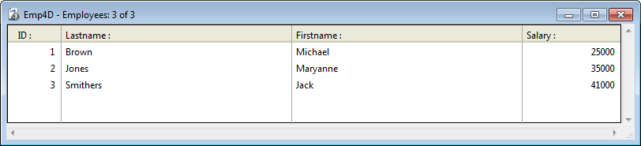

4D provides you with a powerful REST server, that allows direct access to data stored in your 4D applications.

The REST server is included in 4D and 4D Server, it is automatically available in your 4D applications [once it is configured](configuration.md).

Esta seção tem o objetivo de familiarizar com as funcionalidades REST com um exemplo simples. Nós vamos:

- create and configure a basic 4D application project
- access data from the 4D project through REST using a standard browser.

To keep the example simple, we’re going to use 4D and a browser that are running on the same machine. Também poderia usar uma arquitetura remota.

## Creating and configuring the 4D project

1. Launch your 4D or 4D Server application and create a new project. Pode chamar de "Emp4D", por exemplo.

2. No editor de Estrutura, crie uma [Employees] tabela e adicione os campos abaixo:

- Lastname (Alpha)
- Firstname (Alpha)
- Salary (Longint)


> A opção "Expor um recurso REST" está marcada por definição para a tabela e cada campo; não mude essa configuração.

3. Crie formulários depois crie alguns funcionários:



4. Display the **Web/REST resource** page of the Settings dialog box and [check the Expose as REST server](configuration.md#starting-the-rest-server) option.

5. No menu **Run**, selecione **Start Web Server** (se necessário) então selecione **Test Web Server**.

4D exibe a página home padrão do 4D Web Server.

## Acessar dados 4D através do navegador

Pode ler e editar dados com 4D apenas através de petições REST.

Qualquer petição 4D Rest URL  inicia com `/ rest`, para ser inserido depois da área `adress:port`. Por exemplo, para ver o que está dentro da 4D Datastore, pode escrever:

```
http://127.0.0.1/rest/$catalog
```

O servidor REST responde:

```
{
 "__UNIQID": "96A49F7EF2ABDE44BF32059D9ABC65C1",
 "dataClasses": [
  {
   "name": "Employees",
   "uri": "/rest/$catalog/Employees",
   "dataURI": "/rest/Employees"
  }
 ]
}
```

Significa que a datastore contém a dataclass Employees. Pode ver os atributos de classe de dados digitando:

```
/rest/$catalog/Employees
```

Se quiser obter todas as entidades da classe de dados Employee, pode escrever:

```
/rest/Employees
```

**Responsa:**

```
{
 "__entityModel": "Employees",
 "__GlobalStamp": 0,
 "__COUNT": 3,
 "__FIRST": 0,
 "__ENTITIES": [
  {
   "__KEY": "1",
   "__TIMESTAMP": "2020-01-07T17:07:52.467Z",
   "__STAMP": 2,
   "ID": 1,
   "Lastname": "Brown",
   "Firstname": "Michael",
   "Salary": 25000
  },
  {
   "__KEY": "2",
   "__TIMESTAMP": "2020-01-07T17:08:14.387Z",
   "__STAMP": 2,
   "ID": 2,
   "Lastname": "Jones",
   "Firstname": "Maryanne",
   "Salary": 35000
  },
  {
   "__KEY": "3",
   "__TIMESTAMP": "2020-01-07T17:08:34.844Z",
   "__STAMP": 2,
   "ID": 3,
   "Lastname": "Smithers",
   "Firstname": "Jack",
   "Salary": 41000
  }
 ],
 "__SENT": 3
}
```

Tem muitas possibilidades para filtrar dados a receber. Por exemplo, para obter só o valor de atributo "Lasname" da segunda entidade, pode escrever:

```
/rest/Employees(2)/Lastname
```

**Responsa:**

```
{
 "__entityModel": "Employees",
 "__KEY": "2",
 "__TIMESTAMP": "2020-01-07T17:08:14.387Z",
 "__STAMP": 2,
 "Lastname": "Jones"
}
```

The 4D [REST API](REST_requests.md) provides various commands to interact with the 4D applications.  
