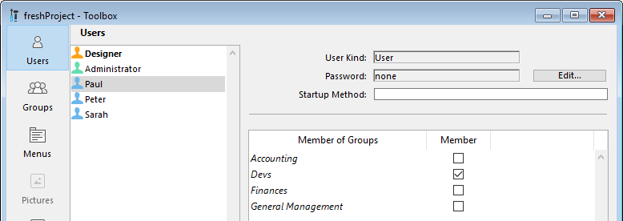

If more than one person uses an application, which is usually the case in client-server architecture or Web interfaces, you need to control access or provide different features according to the connected users. É essencial para segurança de dados sensíveis. You can provide this security by assigning passwords to users and creating access groups that have different levels of access to information in the application or to application operations.

> Para uma visão geral das funções de segurança de 4D, consulte o [Guia de segurança de 4D](https://blog.4d.com/4d-security-guide/).

## Atribuir grupos de acesso

O sistema de senhas de acesso é baseado em usuários e grupos. O sistema de senhas de acesso é baseado em usuários e grupos.

Groups can then be assigned access privileges to specific parts or features of the application (Design access, HTTP server, SQL server, etc.), or any custom part.

O exemplo abaixo mostra direitos de acesso ao explorador de Execução e ao Design sendo atribuidos ao grupo "Devs":

## Ativar controles de acesso

Se inicia o sistema de controle de senhas de acesso 4D em cliente-servidor **atribuindo uma senha ao Designer**.

Until you give the Designer a password, all application access are done with the Designer's access rights, even if you have set up users and groups (when the application opens, no ID is required). Any part of the application can be opened.

Quando uma senha for estabelecida para o Designer, todos os privilégios de acesso têm efeito. In order to connect to the application, remote users must enter a password.

Para desativar o sistema de acesso a senhas, precisa remover a senha Designer.

## Usuários e grupos em arquitetura de projeto

In project applications (.4DProject or .4dz files), 4D users and groups can be configured in both single-user and client-server environments. However, access control is only effective with 4D Server. A tabela abaixo lista as principais funcionalidades de usuários e grupos e sua disponibilidade:

|                                                            | 4D (single-user)                     | 4D Server |
| ---------------------------------------------------------- | ------------------------------------ | --------- |
| Adicionar/editar usuários e grupos                         | sim                                  | sim       |
| Atribuir acesso de usuário/grupo a servidores              | sim                                  | sim       |
| Identificação de usuário                                   | não (todos os usuários são Designer) | sim       |
| Controle de acesso quando o Designer for atribuído a senha | não (todos os acessos são Designer)  | sim       |

## Editor de toolbox

Os editores para usuários e grupos estão na barra de ferramentas de 4D. Esses editores podem ser usados para criar grupos ou usuários, atribuir senhas a usuários, colocar usuários em grupos, etc.

> O editor de usuários e grupos pode ser exibido em execução com ajuda do comando [EDIT ACCESS](https://doc.4d.com/4Dv18/4D/18/EDIT-ACCESS.301-4504687.en.html). Users and groups editor can be displayed at runtime using the [EDIT ACCESS](https://doc.4d.com/4Dv18/4D/18/EDIT-ACCESS.301-4504687.en.html) command.

## Directory.json file

Users, groups, as well as their access rights are stored in a specific project file named **directory.json**.

Este arquivo pode ser armazenado nos locais abaixo:

- in the user settings folder, i.e. in the "Settings" folder at the same level as the "Project" folder. These settings are used by default for the application.
- na pasta de configurações de dados, ou seja na pasta "Settings" na pasta "Data". If a **directory.json** file is present at this location, it takes priority over the file in the user settings folder. Essa funcionalidade permite que se defina usuários locais/personalizados e configurações de Grupos. The custom configuration will left untouched by an application upgrade.

> If 4D password access control is not enabled, the **directory.json** is not created.
