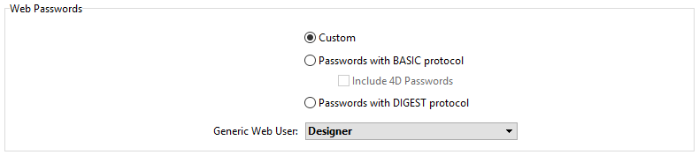

Authenticating users is necessary when you want to provide specific access rights to web users. Authentication designates the way the information concerning the user credentials (usually name and password) are collected and processed.

## Modos de autenticação

The 4D web server proposes three authentication modes, that you can select in the **Web**/**Options (I)** page of the Settings dialog box:



> É recomendado usar uma autenticação **personalizada**.

### Visão Geral

O funcionamento do sistema de acesso do servidor web 4D está resumido no diagrama seguinte:


> As solicitações que começam com `rest/` são tratadas diretamente pelo [servidor REST](REST/configuration.md).

### Personalizado (padrão)

Basically in this mode, it's up to the developer to define how to authenticate users. 4D só avalia solicitações HTTP [que requerem uma autenticação](#method-calls).

Este modo de autenticação é o mais flexível porque permite que você:

- ou delegar a autenticação do usuário a um aplicativo de terceiros (por exemplo, uma rede social, SSO);
- Ou fornecer uma interface para o usuário (por exemplo, um formulário da Web) para que ele possa criar sua conta no banco de dados de clientes; em seguida, você pode autenticar os usuários com qualquer algoritmo personalizado (veja [este exemplo](sessions.md#example) no capítulo "Sessões de usuário"). O importante é que você nunca armazene a senha de forma não protegida, usando esse código:

```4d
//... criar conta de usuário
ds.webUser.password:=Generate password hash($password)  
ds.webUser.save()
```

See also [this example](gettingStarted.md#authenticating-users) from the "Getting started" chapter.

If no custom authentication is provided, 4D calls the [`On Web Authentication`](#on-web-authentication) database method (if it exists). In addition to $1 and $2, only the IP addresses of the browser and the server ($3 and $4) are provided, the user name and password ($5 and $6) are empty. The method must return **True** in $0 if the user is successfully authenticated, then the resquested resource is served, or **False** in $0 if the authentication failed.

> **Aviso:** Se o método de banco de dados `On Web Authentication` não existir, as conexões serão aceitas automaticamente (modo de teste).

### Protocolo Basic

When a user connects to the server, a standard dialog box appears on their browser in order for them to enter their user name and password.

> O nome e a palavra-passe introduzidos pelo utilizador são enviados sem encriptação no cabeçalho do pedido HTTP. Este modo requer normalmente HTTPS para garantir a confidencialidade.

Os valores introduzidos são então avaliados:

- Se a opção **Include 4D passwords (Incluir senhas 4D** ) estiver marcada, as credenciais do usuário serão avaliadas primeiro em relação à [tabela interna de usuários 4D](Users/overview.md).
  - Se o nome de usuário enviado pelo navegador existir na tabela de usuários 4D e a senha estiver correta, a conexão será aceita. Se a palavra-passe estiver incorreta, a ligação é recusada.
  - Se o nome de usuário não existir na tabela de usuários 4D, a mensagem [`On Web Authentication`](#on-web-authentication) é chamado. Se o método de banco de dados `On Web Authentication` não existir, as conexões serão rejeitadas.

- Se a opção **Incluir senhas 4D** não estiver marcada, credenciais de usuário são enviadas para o método de banco de dados [`On Web Authentication`](#on-web-authentication) juntamente com outros parâmetros de conexão (endereço IP e porta, URL .) para que você possa processá-los. Se o método de banco de dados `On Web Authentication` não existir, as conexões serão rejeitadas.
> Com o servidor da Web 4D Client, lembre-se de que todos os sites publicados pelas máquinas 4D Client compartilharão a mesma tabela de usuários. Validação de usuários/senhas é realizada pela aplicação 4D Server.

### Protocolo DIGEST

This mode provides a greater level of security since the authentication information is processed by a one-way process called hashing which makes their contents impossible to decipher.

Como no modo BASIC, os usuários devem digitar seu nome e senha ao se conectarem. The [`On Web Authentication`](#on-web-authentication) database method is then called. When the DIGEST mode is activated, the $6 parameter (password) is always returned empty. In fact, when using this mode, this information does not pass by the network as clear text (unencrypted). It is therefore imperative in this case to evaluate connection requests using the `WEB Validate digest` command.
> Você deve reiniciar o servidor Web para que as alterações feitas nesses parâmetros sejam levadas em conta.

## On Web Authentication

The `On Web Authentication` database method is in charge of managing web server engine access. É chamado por 4D ou 4D Server quando uma solicitação HTTP dinâmica é recebida.

### Chamadas métodos de base

The `On Web Authentication` database method is automatically called when a request or processing requires the execution of some 4D code (except for REST calls). It is also called when the web server receives an invalid static URL (for example, if the static page requested does not exist).

The `On Web Authentication` database method is therefore called:

- quando o servidor da Web recebe um URL solicitando um recurso que não existe
- quando o servidor da Web receber uma URL que começa com `4DACTION/`, `4DCGI/`...
- quando o servidor da Web receber uma URL de acesso à raiz e nenhuma página inicial foi definida nas Configurações ou por meio do comando `WEB SET HOME PAGE`
- quando o servidor da Web processar um código de execução de tag (por exemplo, `4DSCRIPT`) em uma página semidinâmica.

O método banco de dados `On Web Authentication` NÃO é chamado:

- quando o servidor Web recebe um URL solicitando uma página estática válida.
- quando o servidor da Web receber uma URL que começa com `rest/` e o servidor REST for iniciado (nesse caso, a autenticação é tratada por meio do [método de banco de dados`On REST Authentication`](REST/configuration.md#using-the-on-rest-authentication-database-method) ou das [configurações Structure](REST/configuration.md#using-the-structure-settings)).

### Sintaxe

**On Web Authentication**( *$1* : Text ; *$2* : Text ; *$3* : Text ; *$4* : Text ; *$5* : Text ; *$6* : Text ) -> $0 : Boolean

| Parâmetros | Tipo       |    | Descrição                                             |
| ---------- | ---------- |:--:| ----------------------------------------------------- |
| $1         | Text       | <- | URL                                                   |
| $2         | Text       | <- | Cabeçalhos HTTP + corpo HTTP (até um limite de 32 kb) |
| $3         | Text       | <- | Endereço IP do cliente Web (browser)                  |
| $4         | Text       | <- | Endereço IP do servidor                               |
| $5         | Text       | <- | Nome de usuario                                       |
| $6         | Text       | <- | Senha                                                 |
| $0         | Parâmetros | -> | True = pedido aceite, False = pedido rejeitado        |

Estes parâmetros devem ser declarados da seguinte forma:

```4d
//Método base On Web Authentication

 C_TEXT($1;$2;$3;$4;$5;$6)
 C_BOOLEAN($0)

//Código do método
```

Alternatively, you can use the [named parameters](Concepts/parameters.md#named-parameters) syntax:

```4d
// Método de banco de dados de autenticação na Web
#DECLARE ($url : Text; $header : Text; \
  $BrowserIP : Text; $ServerIP : Text; \
  $user : Text; $password : Text) \
  -> $RequestAccepted : Boolean

```
> Todos os parâmetros do método de banco de dados `On Web Authentication` não são necessariamente preenchidos. As informações recebidas pelo método de banco de dados dependem do [modo de autenticação](#authentication-mode) selecionado.)

#### $1 - URL

The first parameter (`$1`) is the URL received by the server, from which the host address has been removed.

Vejamos o exemplo de uma ligação Intranet. Suponha que o endereço IP do seu Web Server 4D é 123.45.67.89. The following table shows the values of $1 depending on the URL entered in the Web browser:

| URL introduzido no navegador Web     | Valor do parâmetro $1    |
| ------------------------------------ | ------------------------ |
| 123.45.67.89                         | /                        |
| <http://123.45.67.89>                | /                        |
| 123.45.67.89/Customers               | /Customers               |
| <http://123.45.67.89/Customers/Add>  | /Customers/Add           |
| 123.45.67.89/Do_This/If_OK/Do_That | /Do_This/If_OK/Do_That |

#### $2 - Cabeçalho e corpo do pedido HTTP

O segundo parâmetro (`$2`) é o cabeçalho e o corpo da solicitação HTTP enviada pelo navegador Web. Note that this information is passed to your `On Web Authentication` database method as it is. Its contents will vary depending on the nature of the web browser which is attempting the connection.

If your application uses this information, it is up to you to parse the header and the body. Você pode usar os comandos `WEB GET HTTP HEADER` e `WEB GET HTTP BODY`.
> For performance reasons, the size of data passing through the $2 parameter must not exceed 32 KB. Para além deste tamanho, são truncados pelo servidor HTTP 4D.

#### $3 - Endereço IP do cliente Web

The `$3` parameter receives the IP address of the browser’s machine. This information can allow you to distinguish between intranet and internet connections.
> 4D devolve endereços IPv4 em formato híbrido IPv6/IPv4 escritos com um prefixo de 96 bits, por exemplo ::ffff:192.168.2.34 para o endereço IPv4 192.168.2.34. For more information, refer to the [IPv6 Support](webServerConfig.md#about-ipv6-support) section.

#### $4 - Endereço IP do servidor

The `$4` parameter receives the IP address used to call the web server. 4D allows for multi-homing, which allows you to exploit machines with more than one IP address. For more information, please refer to the [Configuration page](webServerConfig.md#ip-address-to-listen).

#### $5 e $6 - Nome de usuário e palavra-passe

The `$5` and `$6` parameters receive the user name and password entered by the user in the standard identification dialog box displayed by the browser. This dialog box appears for each connection, if [basic](#basic-protocol) or [digest](#digest-protocol) authentication is selected.
> If the user name sent by the browser exists in 4D, the $6 parameter (the user’s password) is not returned for security reasons.

#### Parâmetro $0

The `On Web Authentication` database method returns a boolean in $0:

- Se $0 é True, a ligação é aceite.

- Se $0 é False, a ligação é recusada.

The `On Web Connection` database method is only executed if the connection has been accepted by `On Web Authentication`.
> **WARNING**<br/>If no value is set to $0 or if $0 is not defined in the `On Web Authentication` database method, the connection is considered as accepted and the `On Web Connection` database method is executed.
> - - * Do not call any interface elements in the `On Web Authentication` database method (`ALERT`, `DIALOG`, etc.) because otherwise its execution will be interrupted and the connection refused. O mesmo acontecerá se ocorrer um erro durante seu processamento.

### Exemplo

Example of the `On Web Authentication` database method in [DIGEST mode](#digest-protocol):

```4d
 // On Web Authentication Database Method
 #DECLARE ($url : Text; $header : Text; $ipB : Text; $ipS : Text; \
  $user : Text; $pw : Text) -> $valid : Boolean

 var $found : cs.WebUserSelection
 $valid:=False

 $found:=ds.WebUser.query("User === :1";$user)
 If($found.length=1) // User is found
  $valid:=WEB Validate digest($user;[WebUser]password)
 Else
    $valid:=False // User does not exist
 End if
```
