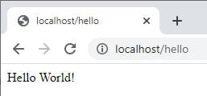
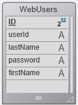

This "Getting started" section is geared at first-time users who want an overall overview on how to go from zero to a 4D website that handles data from the database. Vamos começar!

## Exemplo Hello World

Let's start by making the web server send "Hello World" to the browser. The most simple way to do this is to create a project, start the web server and write a small code that returns a text in the `On Web Connection` database method.

### Iniciar o servidor Web

Para iniciar o servidor web 4D:

1. Inicie sua aplicação 4D e crie um projeto 4D novo e vazio.
2. In the **Run** menu, select **Start Web Server**.

É tudo! The web server is started (you can see that the menu item has become **Stop Web Server**). Está agora pronto para processar pedidos. Para o verificar, vamos apresentar a página inicial padrão.

### Exibição da página inicial padrão

The 4D web server creates automatically a default `index.html` page in the default `WebFolder` root folder, created at the same level as the Project folder.

1. Launch a web browser and connect to the web server IP address (default http port for 4D web server is 80). If the web server and the browser are on the same machine, you can select **Test Web Server** in the **Run** menu.

É apresentada a página inicial predefinida:


### Exibindo Hello World

1. Open the Explorer, display the Database Methods list and double-click on `On Web Connection`.

2. Digite o seguinte código:

```4d
Case of 
 : ($1="/hello")
  WEB SEND TEXT("Hello World!")
 Else 
  // Erro 404 por exemplo
End case 
```

The [`On Web Connection`](httpRequests.md#on-web-connection) database method is called for incoming requests and receives the target URL in the `$1` parameter. Este código muito simples apenas envia o texto para o navegador.

3. No seu browser, introduza o seguinte URL:

```
http://localhost/hello
```

O servidor Web processa o pedido e devolve-o:



## Obter dados da base de dados

Agora vamos ver como é simples obter dados do banco de dados. Primeiro, vamos criar uma tabela e preenchê-la com alguns dados.

Create a basic database with, for example, a single table containing some records:

 

### Exibição de dados em uma página

The most simple solution to display data is to call a [template page](templates.md) containing tags.

1. Usando qualquer editor de texto, crie um arquivo com as seguintes linhas:

```html
<html>
<body>
<!--#4DCODE ALL RECORDS([Friends])-->
<!--#4DLOOP [Friends]-->
<!--#4DTEXT [Friends]lastName--> <!--#4DTEXT [Friends]firstName--><br/>
<!--#4DENDLOOP-->
</body>
</html>
```

2. Name the file "friends.shtml" and save it in the **WebFolder** of your project.
3. No seu browser, introduza o seguinte URL:

```
http://localhost/friends.shtml
```

`.shtml` pages are automatically processed by the web server. A sua página preenchida com dados é devolvida:


### Pedido REST

If we not only want to *display* data, but to *use* it, we can use ORDA and the REST server. Thanks to the [ORDA concept](ORDA/overview.md), the `Friends` table is automatically mapped to a dataclass and is available through [REST](REST/gettingStarted.md).

1. We will use the REST server to access data: go the "Settings" dialog box, select the "Web/Rest resource" page, and check the **Expose as REST server** option.


2. No seu browser, introduza o seguinte URL:

```
http://localhost/rest/$catalog
```

O servidor Web devolve os resultados em JSON:

```json
{
 "__UNIQID": "3F1B6ACFFE12B64493629AD76011922D",
 "dataClasses": [
  {
   "name": "Friends",
   "uri": "/rest/$catalog/Friends",
   "dataURI": "/rest/Friends"
  }
 ]
}
```

You get the catalog, i.e. the list of exposed dataclasses and attributes in the datastore.

Você também pode obter qualquer dado.

3. Introduzir o seguinte URL:

```
http://localhost/rest/Friends
```

The server returns the entities, i.e. the data, from the Friends dataclass:

```json
{
 "__DATACLASS": "Friends",
 "__entityModel": "Friends",
 "__GlobalStamp": 0,
 "__COUNT": 4,
 "__FIRST": 0,
 "__ENTITIES": [
  {
   "__KEY": "1",
   "__TIMESTAMP": "2020-10-27T14:29:01.914Z",
   "__STAMP": 1,
   "ID": 1,
   "lastName": "Smith",
   "firstName": "John"
  },
  {
   "__KEY": "2",
   "__TIMESTAMP": "2020-10-27T14:29:16.035Z",
   "__STAMP": 1,
   "ID": 2,
   "lastName": "Brown",
   "firstName": "Danny"
  },
  {
   "__KEY": "3",
   "__TIMESTAMP": "2020-10-27T14:29:43.945Z",
   "__STAMP": 1,
   "ID": 3,
   "lastName": "Purple",
   "firstName": "Mark"
  },
  {
   "__KEY": "4",
   "__TIMESTAMP": "2020-10-27T14:34:58.457Z",
   "__STAMP": 1,
   "ID": 4,
   "lastName": "Dupont",
   "firstName": "Jenny"
  }
 ],
 "__SENT": 4
}
```

This very simple example shows how the web server interacts transparently with the [REST server](REST/gettingStarted.md) to return any requested data, provided it is exposed. In your web interfaces, you can easily bind the javascript or html code with returned data. See the built-in [Web Data Explorer](Admin/dataExplorer.md) to have an example of sophisticated web interface bound to dataclasses.

## Início de sessão e sessão

In the above sections, we get free access to the application from web requests. However, in the world of web applications, data access security is the first priority. When connecting to the 4D web server, users must be authentified and their navigation controlled.

### Criação de uma tabela de usuários

The most simple and secured way to log a user on the 4D web server is based upon the following scenario:

- Users are stored in a dedicated, unexposed table (named *WebUsers* for example)
- The *WebUsers* table could be [encrypted](MSC/encrypt.md) and stores the user login and a hash of their password.

1. Criar uma tabela com alguns campos, por exemplo:



2. Escreva e execute o seguinte código para criar um usuário:

```4d
var $webUser : cs.WebUsersEntity

$webUser:=ds.WebUsers.new()
$webUser.firstName:="John"
$webUser.lastName:="Doe"
// the password would be entered by the user
$webUser.password:=Generate password hash("123")
$webUser.userId:="john@4d.com"
$webUser.save()
```

### Autenticação de usuários

> To be secure from end to end, it is necessary that the whole connection is established via [https](webServerConfig.md#enable-https).

1. Abra o Explorador e crie um método projeto chamado "login".

3. Escreva o seguinte código:

```4d
var $indexUserId; $indexPassword : Integer
var $userId; $password : Text
var $user; $info : Object
ARRAY TEXT($anames; 0)
ARRAY TEXT($avalues; 0)

// get values sent in the header of the request
WEB GET VARIABLES($anames; $avalues)

// look for header login fields
$indexUserId:=Find in array($anames; "userId")
$userId:=$avalues{$indexUserId}
$indexPassword:=Find in array($anames; "password")
$password:=$avalues{$indexPassword}

//look for a user with the entered name in the users table
$user:=ds.WebUsers.query("userId = :1"; $userId).first()

If ($user#Null) //a user was found
  //check the password
    If (Verify password hash($password; $user.password))
      //password ok, fill the session
        $info:=New object()
        $info.userName:=$user.firstName+" "+$user.lastName
        Session.setPrivileges($info)
         //You can use the user session to store any information
        WEB SEND TEXT("Welcome "+Session.userName)
    Else 
        WEB SEND TEXT("Wrong user name or password.")
    End if 
Else 
    WEB SEND TEXT("Wrong user name or password.")
End if 
```

3. Display the method properties by clicking on the **[i]** button in the code editor, check the `4D tags and URLs (4DACTION...)` option and click **OK**.


4. No seu browser, introduza o seguinte URL:

```
http://localhost/4DACTION/login/?userID=john@4d.com&password=123
```

> Using such URLs is not recommended, it is only presented here to keep the example simple. A more realistic login request must be handled through a web form and a POST request. See [this page](sessions.md#example) for an example of form POST.

Em seguida, será registado para a sessão:


As credenciais incorretas serão rejeitadas:


Once a user is logged, you can handle the associated session using the `WEB Get Current Session ID` method. Ver a página [Sessões de usuário](sessions.md).
