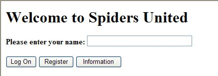

O servidor web 4D oferece várias funcionalidades para lidar com solicitações HTTP:

- the `On Web Connection` database method, a router for your web application,
- o URL `/4DACTION` para chamar o código do lado do servidor
- `WEB GET VARIABLES` to get values from HTML objects sent to the server
- other commands such as `WEB GET HTTP BODY`, `WEB GET HTTP HEADER`, or `WEB GET BODY PART` allow to customize the request processing, including cookies.
- o método projeto *COMPILER_WEB*, para declarar suas variáveis.


## On Web Connection

The `On Web Connection` database method can be used as the entry point for the 4D Web server.

### Chamadas métodos de base

The `On Web Connection` database method is automatically called when the server receives any URL that is not a path to an existing page on the server. O método da base de dados é chamado com o URL.

For example, the URL "*a/b/c*" will call the database method, but "*a/b/c.html*" will not call the database method if the page "c.html" exists in the "a/b" subfolder of the [WebFolder](webServerConfig.md#root-folder).

> The request should have previously been accepted by the [`On Web Authentication`](authentication.md#on-web-authentication) database method (if it exists) and the web server must be launched.

### Sintaxe

**On Web Connection**( *$1* : Text ; *$2* : Text ; *$3* : Text ; *$4* : Text ; *$5* : Text ; *$6* : Text )

| Parâmetros | Tipo |    | Descrição                                             |
| ---------- | ---- |:--:| ----------------------------------------------------- |
| $1         | Text | <- | URL                                                   |
| $2         | Text | <- | Cabeçalhos HTTP + corpo HTTP (até um limite de 32 kb) |
| $3         | Text | <- | Endereço IP do cliente Web (browser)                  |
| $4         | Text | <- | Endereço IP do servidor                               |
| $5         | Text | <- | Nome de usuario                                       |
| $6         | Text | <- | Senha                                                 |


Estes parâmetros devem ser declarados como se indica a seguir:

```4d
//Método base On Web Authentication

 C_TEXT($1;$2;$3;$4;$5;$6)

//Código do método
```

Alternatively, you can use the [named parameters](Concepts/parameters.md#named-parameters) syntax:

```4d
// On Web Connection database method
#DECLARE ($url : Text; $header : Text; \
  $BrowserIP : Text; $ServerIP : Text; \
  $user : Text; $password : Text)

```


> Calling a 4D command that displays an interface element (`DIALOG`, `ALERT`, etc.) is not allowed and ends the method processing.


### $1 - Dados extra do URL

The first parameter ($1) is the URL entered by users in the address area of their web browser, without the host address.

Vamos utilizar uma ligação intranet como exemplo. Suponha que o endereço IP do seu Web Server 4D é 123.4.567.89. The following table shows the values of $1 depending on the URL entered in the web browser:

| URL introduzido no navegador Web     | Valor do parâmetro $1    |
| ------------------------------------ | ------------------------ |
| 123.4.567.89                         | /                        |
| http://123.45.67.89                  | /                        |
| 123.4.567.89/Customers               | /Customers               |
| http://123.45.67.89/Customers/Add    | /Customers/Add           |
| 123.4.567.89/Do_This/If_OK/Do_That | /Do_This/If_OK/Do_That |

Note que você está livre para usar este parâmetro a sua conveniência. 4D simplesmente ignora o valor passado além da parte do host da URL. For example, you can establish a convention where the value "*/Customers/Add*" means “go directly to add a new record in the `[Customers]` table.” By supplying the web users with a list of possible values and/or default bookmarks, you can provide shortcuts to different parts of your application. This way, web users can quickly access resources of your website without going through the entire navigation path each time they make a new connection.


### $2 - Cabeçalho e corpo do pedido HTTP

O segundo parâmetro ($2) é o cabeçalho e o corpo da solicitação HTTP enviada pelo navegador Web. Note that this information is passed to your `On Web Connection` database method "as is". Its contents will vary depending on the nature of the web browser attempting the connection.

If your application uses this information, it is up to you to parse the header and the body. Você pode usar os comandos `WEB GET HTTP HEADER` e `WEB GET HTTP BODY`.
> For performance reasons, the size of data passing through the $2 parameter must not exceed 32 KB. Para além deste tamanho, são truncados pelo servidor HTTP 4D.


### $3 - Endereço IP do cliente Web

O parâmetro $3 recebe o endereço IP do computador do navegador. This information can allow you to distinguish between intranet and internet connections.
> 4D devolve endereços IPv4 em formato híbrido IPv6/IPv4 escritos com um prefixo de 96 bits, por exemplo ::ffff:192.168.2.34 para o endereço IPv4 192.168.2.34. For more information, refer to the [IPv6 Support](webServerConfig.md#about-ipv6-support) section.

### $4 - Endereço IP do servidor

The $4 parameter receives the IP address requested by the 4D Web Server. 4D allows for multi-homing, which allows you to use machines with more than one IP address. For more information, please refer to the [Configuration page](webServerConfig.html#ip-address-to-listen).

### $5 e $6 - Nome de usuário e palavra-passe

The $5 and $6 parameters receive the user name and password entered by the user in the standard identification dialog box displayed by the browser, if applicable (see the [authentication page](authentication.md)).
> If the user name sent by the browser exists in 4D, the $6 parameter (the user’s password) is not returned for security reasons.


## /4DACTION

***/4DACTION/***MethodName***<br/> **/4DACTION/******MethodName/Param*

| Parâmetros | Tipo |    | Descrição                                           |
| ---------- | ---- |:--:| --------------------------------------------------- |
| MethodName | Text | -> | Nome do método de projeto 4D a ser executado        |
| Param      | Text | -> | Parâmetro texto a ser passado para o método projeto |

**Utilização:** URL ou ação de formulário.

This URL allows you to call the *MethodName* 4D project method with an optional *Param* text parameter. O método receberá este parâmetro em *$1*.

- The 4D project method must have been [allowed for web requests](allowProject.md): the “Available through 4D tags and URLs (4DACTION...)” attribute value must have been checked in the properties of the method. Se o atributo não for verificado, o pedido Web é rejeitado.
- When 4D receives a `/4DACTION/MethodName/Param` request, the `On Web Authentication` database method (if it exists) is called.

`4DACTION/` can be associated with a URL in a static Web page:

```html
<A HREF="/4DACTION/MyMethod/hello">Do Something</A>
```

The `MyMethod` project method should generally return a "reply" (sending of an HTML page using `WEB SEND FILE` or `WEB SEND TEXT`, etc.). Be sure to make the processing as short as possible in order not to block the browser.

> A method called by `/4DACTION` must not call interface elements (`DIALOG`, `ALERT`, etc.).

#### Exemplo

This example describes the association of the `/4DACTION` URL with an HTML picture object in order to dynamically display a picture in the page. Inserir as seguintes instruções numa página HTML estática:

```html

```

O método `getPhoto` é o seguinte:

```4d
C_TEXT($1) // This parameter must always be declared
var $path : Text
var $PictVar : Picture
var $BlobVar : Blob

 //find the picture in the Images folder within the Resources folder
$path:=Get 4D folder(Current resources folder)+"Images"+Folder separator+$1+".psd"

READ PICTURE FILE($path;$PictVar) //put the picture in the picture variable
PICTURE TO BLOB($PictVar;$BLOB;".png") //convert the picture to ".png" format
WEB SEND BLOB($BLOB;"image/png")
```

### 4DACCIÓN para publicar formulários

The 4D Web server also allows you to use “posted” forms, which are static HTML pages that send data to the Web server, and to easily retrieve all the values. The POST type must be associated to them and the form’s action must imperatively start with /4DACTION/MethodName.

Um formulário pode ser enviado por dois métodos (ambos podem ser usados com 4D):
- POST, normalmente utilizado para enviar dados para o servidor Web,
- GET, normalmente utilizado para pedir dados ao servidor Web.

> When the Web server receives a posted form, it calls the `On Web Authentication` database method (if it exists).

In the called method, you must call the `WEB GET VARIABLES` command in order to [retrieve the names and values](#getting-values-from-the-requests) of all the fields included in an HTML page submitted to the server.

Exemplo para definir a ação de um formulário:

```html
<FORM ACTION="/4DACTION/MethodName" METHOD=POST>
```

#### Exemplo

In a Web application, we would like for the browsers to be able to search among the records by using a static HTML page. Esta página chama-se "search.htm". The application contains other static pages that allow you to, for example, display the search result (“results.htm”). The POST type has been associated to the page, as well as the `/4DACTION/SEARCH` action.

Aqui está o código HTML que corresponde a esta página:

```html
<form action="/4daction/processForm" method=POST>
<input type=text name=vName value=""><br/>
<input type=checkbox name=vExact value="Word">Whole word<br/>
<input type=submit name=OK value="Search">
</FORM>
```

During data entry, type “ABCD” in the data entry area, check the "Whole word" option and validate it by clicking the **Search** button. No pedido enviado ao servidor Web:

```
vName="ABCD"
vExact="Word" OK="Search"
```

4D calls the `On Web Authentication` database method (if it exists), then the `processForm` project method is called, which is as follows:

```4d
 C_TEXT($1) //mandatory for compiled mode
 C_LONGINT($vName)
 C_TEXT(vName;vLIST)
 ARRAY TEXT($arrNames;0)
 ARRAY TEXT($arrVals;0)
 WEB GET VARIABLES($arrNames;$arrVals) //we retrieve all the variables of the form
 $vName:=Find in array($arrNames;"vName")
 vName:=$arrVals{$vName}
 If(Find in array($arrNames;"vExact")=-1) //If the option has not been checked
    vName:=vName+"@"
 End if
 QUERY([Jockeys];[Jockeys]Name=vName)
 FIRST RECORD([Jockeys])
 While(Not(End selection([Jockeys])))
    vLIST:=vLIST+[Jockeys]Name+" "+[Jockeys]Tel+"<br/>"
    NEXT RECORD([Jockeys])
 End while
 WEB SEND FILE("results.htm") //Send the list to the results.htm form
  //which contains a reference to the variable vLIST,
  //for example <!--4DHTML vLIST-->
  //...
End if
```


## Obter valores de pedidos HTTP

4D's Web server lets you recover data sent through POST or GET requests, using Web forms or URLs.

When the Web server receives a request with data in the header or in the URL, 4D can retrieve the values of any HTML objects it contains. This principle can be implemented in the case of a Web form, sent for example using `WEB SEND FILE` or `WEB SEND BLOB`, where the user enters or modifies values, then clicks on the validation button.

In this case, 4D can retrieve the values of the HTML objects found in the request using the `WEB GET VARIABLES` command. The `WEB GET VARIABLES` command retrieves the values as text.

Considere o seguinte código fonte da página HTML:

```html
<html>
<head>
  <title>Welcome</title>
  <script language="JavaScript"><!--
function GetBrowserInformation(formObj){
formObj.vtNav_appName.value = navigator.appName
formObj.vtNav_appVersion.value = navigator.appVersion
formObj.vtNav_appCodeName.value = navigator.appCodeName
formObj.vtNav_userAgent.value = navigator.userAgent
return true
}
function LogOn(formObj){
if(formObj.vtUserName.value!=""){
return true
} else {
alert("Enter your name, then try again.")
return false
}
}
//--></script>
</head>
<body>
<form action="/4DACTION/WWW_STD_FORM_POST" method="post"
 name="frmWelcome"
 onsubmit="return GetBrowserInformation(frmWelcome)">
  <h1>Welcome to Spiders United</h1>
  <p><b>Please enter your name:</b>
  <input name="vtUserName" value="" size="30" type="text"></p>
  <p> 
<input name="vsbLogOn" value="Log On" onclick="return LogOn(frmWelcome)" type="submit"> 
<input name="vsbRegister" value="Register" type="submit">
<input name="vsbInformation" value="Information" type="submit"></p>
<p> 
<input name="vtNav_appName" value="" type="hidden"> 
<input name="vtNav_appVersion" value="" type="hidden"> 
<input name="vtNav_appCodeName" value="" type="hidden">
<input name="vtNav_userAgent" value="" type="hidden"></p>
</form>
</body>
</html>
return false
}
}
//--></script>
</head>
<body>
<form action="/4DACTION/WWW_STD_FORM_POST" method="post"
 name="frmWelcome"
 onsubmit="return GetBrowserInformation(frmWelcome)">
  <h1>Welcome to Spiders United</h1>
  <b>Please enter your name:</b>
  <input name="vtUserName" value="" size="30" type="text"></p>

<input name="vsbLogOn" value="Log On" onclick="return LogOn(frmWelcome)" type="submit"> 
<input name="vsbRegister" value="Register" type="submit">
<input name="vsbInformation" value="Information" type="submit"></p>

<input name="vtNav_appName" value="" type="hidden"> 
<input name="vtNav_appVersion" value="" type="hidden"> 
<input name="vtNav_appCodeName" value="" type="hidden">
<input name="vtNav_userAgent" value="" type="hidden"></p>
</form>
</body>
</html>
return false
}
}
//--></script>
</head>
<body>
<form action="/4DACTION/WWW_STD_FORM_POST" method="post"
 name="frmWelcome"
 onsubmit="return GetBrowserInformation(frmWelcome)">
  <h1>Welcome to Spiders United</h1>
  <p><b>Please enter your name:</b>
  <input name="vtUserName" value="" size="30" type="text"></p>
  <p>
<input name="vsbLogOn" value="Log On" onclick="return LogOn(frmWelcome)" type="submit">
<input name="vsbRegister" value="Register" type="submit">
<input name="vsbInformation" value="Information" type="submit"></p>
<p>
<input name="vtNav_appName" value="" type="hidden">
<input name="vtNav_appVersion" value="" type="hidden">
<input name="vtNav_appCodeName" value="" type="hidden">
<input name="vtNav_userAgent" value="" type="hidden"></p>
</form>
</body>
</html>
```

Quando 4D envia a página para um navegador Web, ela se parece com isso:



As principais características desta página são:

- It includes three **Submit** buttons: `vsbLogOn`, `vsbRegister` and `vsbInformation`.
- When you click **Log On**, the submission of the form is first processed by the JavaScript function `LogOn`. If no name is entered, the form is not even submitted to 4D, and a JavaScript alert is displayed.
- The form has a POST 4D method as well as a Submit script (*GetBrowserInformation*) that copies the browser properties to the four hidden objects whose names starts with *vtNav_App*. Inclui também o objecto `vtUserName`.

Let’s examine the 4D method `WWW_STD_FORM_POST` that is called when the user clicks on one of the buttons on the HTML form.

```4d
  // Retrieval of value of variables
 ARRAY TEXT($arrNames;0)
 ARRAY TEXT($arrValues;0)
 WEB GET VARIABLES($arrNames;$arrValues)
 C_LONGINT($user)

 Case of

  // The Log On button was clicked
    :(Find in array($arrNames;"vsbLogOn")#-1)
       $user :=Find in array($arrNames;"vtUserName")
       QUERY([WWW Users];[WWW Users]UserName=$arrValues{$user})
       $0:=(Records in selection([WWW Users])>0)
       If($0)
          WWW POST EVENT("Log On";WWW Log information)
  // The WWW POST EVENT method saves the information in a database table
       Else

          $0:=WWW Register
  // The WWW Register method lets a new Web user register
       End if

  // The Register button was clicked
    :(Find in array($arrNames;"vsbRegister")#-1)
       $0:=WWW Register

  // The Information button was clicked
    :(Find in array($arrNames;"vsbInformation")#-1)
       WEB SEND FILE("userinfos.html")
 End case
```

As funcionalidades deste método são:

- The values of the variables *vtNav_appName*, *vtNav_appVersion*, *vtNav_appCodeName*, and *vtNav_userAgent* (bound to the HTML objects having the same names) are retrieved using the `WEB GET VARIABLES` command from HTML objects created by the *GetBrowserInformation* JavaScript script.
- Out of the *vsbLogOn*, *vsbRegister* and *vsbInformation* variables bound to the three Submit buttons, only the one corresponding to the button that was clicked will be retrieved by the `WEB GET VARIABLES` command. When the submit is performed by one of these buttons, the browser returns the value of the clicked button to 4D. Isto diz-lhe qual o botão em que se clicou.

Tenha em atenção que, com HTML, todos os objetos são objetos texto. If you use a SELECT object, it is the value of the highlighted element in the object that is returned in the `WEB GET VARIABLES` command, and not the position of the element in the array as in 4D. `WEB GET VARIABLES` sempre retorna valores do tipo Text.


## Outros comandos do servidor Web

The 4D web server provides several low-level web commands allowing you to develop custom processing of requests:

- o comando `WEB GET HTTP BODY` retorna o corpo como texto bruto, permitindo qualquer análise que você possa precisar
- o comando `WEB GET HTTP HEADER` retornam os cabeçalhos da solicitação. É útil lidar com cookies personalizados, por exemplo (com o comando `WEB SET HTTP HEADER`).
- the `WEB GET BODY PART` and `WEB Get body part count` commands to parse the body part of a multi-part request and retrieve text values, but also files posted, using BLOBs.

Esses comandos estão resumidos no gráfico a seguir:


The 4D web server supports files uploaded in chunked transfer encoding from any Web client. A codificação de transferência em pedaços é um mecanismo de transferência de dados especificado no HTTP/1.1. It allows data to be transferred in a series of "chunks" (parts) without knowing the final data size. The 4D Web Server also supports chunked transfer encoding from the server to Web clients (using `WEB SEND RAW DATA`).

## Método projeto COMPILER_WEB

O método COMPILER\_WEB, se existir, é chamado sistematicamente quando o servidor HTTP recebe uma solicitação dinâmica e chama ao motor 4D. This is the case, for example, when the 4D Web server receives a posted form or a URL to process in [`On Web Connection`](#on-web-connection). This method is intended to contain typing and/or variable initialization directives used during Web exchanges. É utilizado pelo compilador quando a aplicação é compilada. O método COMPILER\_WEB é comum a todos os formulários Web. Por defeito, o método COMPILER_WEB não existe. É necessário criá-lo explicitamente.

> The COMPILER_WEB project method is also called, if it exists, for each SOAP request accepted.
