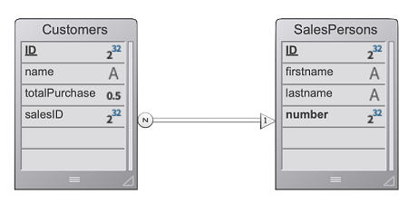

O servidor web 4D oferece recursos integrados para gerenciar **sessões usuário**. A criação e manutenção de sessões de usuários permite que você controle e melhore a experiência do usuário em sua aplicação web. Quando as sessões de usuários são ativadas, os clientes web podem reutilizar o mesmo contexto de servidor de uma requisição para outra.

As sessões de usuário do servidor Web permitem:

- manipular várias solicitações simultaneamente do mesmo cliente web através de um número ilimitado de processos preventivos (sessões servidor web são **escaláveis**),
- partilhar dados entre os processos de um cliente Web,
- associar privilégios a sessões de usuário,
- manipula o acesso através de um objeto `Session` e a [Session API](API/SessionClass.md).

> **Nota:** a implementação atual é apenas o primeiro passo de uma funcionalidade abrangente futura, permitindo aos desenvolvedores gerenciar permissões usuário hierárquicos através de sessões em todo da aplicação web.

## Activação de sessões

A funcionalidade de gerenciamento de sessão pode ser ativado e desativado no seu servidor web 4D. Existem diferentes formas de ativar a gestão de sessões:

- Usando a opção **sessões escalonáveis** na página "Web/Opções (I)" das Configurações (parâmetro permanente): 

Esta opção é selecionada por defeito nos novos projetos. No entanto, ele pode ser desativado selecionando a opção **Não sessões**, onde os recursos da sessão web estão desativados (nenhum objeto `Session` está disponível).

- Usando a propriedade [`.chamableSession`](API/WebServerClass.md#scalablesession) do objeto Web Server (para passar no parâmetro *settings* da função [`.start()`](API/WebServerClass.md#start)). Neste caso, este parâmetro substitui a opção definida na caixa de diálogo Propriedades para o objeto Web Server (não é armazenado em disco).

> O comando `WEB SET OPTION` também pode definir o modo de sessão para o servidor Web principal.

Em qualquer caso, o parâmetro é local para a máquina; para poder diferir no servidor Web 4D Server e os servidores Web de máquinas 4D remotas.

> **Compatibilidade**: uma opção **Sessões herdadas** está disponível em projetos criados com uma versão 4D anterior a 4D v18 R6 (para mais informações, por favor, consulte a documentação do site web [doc.4d.com](https://doc.4d.com)).

## Session implementation

Quando [as sessões são ativadas](#enabling-sessions), mecanismos automáticos são implementados, com base em um cookie privado definido pelo próprio 4D: "*4DSID_AppName*", onde *AppName* é o nome do projeto da aplicação. Este cookie faz referência à sessão web atual da aplicação.

> O nome do cookie pode ser usado pela propriedade [`.sessionCookieName`](API/WebServerClass.md#sessioncookiename).

1. Em cada solicitação de cliente web, o servidor web verifica a presença e o valor do cookie privado "4DSID_*AppName*".

2. Se o cookie tiver um valor, 4D procura pela sessão que criou este cookie entre as sessões existentes; Se esta sessão for encontrada, ela será reutilizada para a chamada.

2. Se a solicitação do cliente não corresponder a uma sessão já aberta:

- uma nova sessão com um cookie "4DSID_*AppName*" é criado no servidor da web
- um novo objeto `Session` foi criado sendo dedicado à sessão web escalável.

O objeto `Session` atual pode ser acessado através do comando [`Session`](API/SessionClass.md#session) no código de qualquer processo web.


> Os processos Web geralmente não terminam, eles são reciclados em um pool para aumentar a eficiência. Quando um processo termina de executar uma solicitação, ele é colocado de novo no pool e disponibilizado para a próxima solicitação. Dado que um processo web pode ser reutilizado por qualquer sessão, [variáveis processo](Concepts/variables.md#process-variables) devem ser limpas pelo seu código no final de sua execução (usando [`CLEAR VARIABLE`](https://doc.4d.com/4dv18/help/command/en/page89.html), por exemplo). Esta limpeza é necessária para todas as informações relacionadas ao processo, como uma referência a um arquivo aberto. Esta é a razão porque **é recomendado** usar o objeto [Session](API/SessionClass.md) quando você deseja manter informações relacionadas à sessão.

## Partilhar informações

Cada objeto `Session` fornece uma propriedade [`.storage`](API/SessionClass.md#storage) que é um [objeto compartilhado](Concepts/shared.md). Essa propriedade permite que você compartilhe informações entre todos os processos manipulados pela sessão.

## Duração da sessão

Uma sessão Web escalável é encerrada quando:

- o servidor web está parado,
- o tempo limite do cookie de sessão foi atingido.

O tempo de vida de um cookie inativo é 60 minutos por padrão, o que significa que o servidor irá automaticamente fechar as sessões inativas após 60 minutos.

Este tempo limite pode ser definido usando a propriedade [`.idleTimeout`](API/SessionClass.md#idletimeout) do objeto `Session` (o tempo limite não pode ser inferior a 60 minutos).

Quando uma sessão web escalável é fechada, se o comando [`Session`](API/SessionClass.md#session) for chamado depois:

- o objeto `Sessão` não contém privilégios (é uma sessão de convidado)
- a propriedade [`.storage`](API/SessionClass.md#storage) está vazia
- um novo cookie de sessão é associado à sessão

## Privilégios

Os privilégios podem ser associados a sessões. No servidor web, você pode fornecer acesso ou recursos específicos, dependendo dos privilégios da sessão.

Você pode atribuir privilégios usando a função [`.setPrivileges()`](API/SessionClass.md#setprivileges). Em seu código, você pode verificar os privilégios da sessão para permitir ou negar acesso usando a função [`.hasPrivilege()`](API/SessionClass.md#hasprivilege). Por padrão, as novas sessões não têm nenhum privilégio: elas são sessões **guest** (a função [`.isGuest()`](API/SessionClass.md#isguest) retorna true).

> Na implementação atual (v18 R6), apenas o privilégio "WebAdmin" está disponível.

Exemplo:

```4d
If (Session.hasPrivilege("WebAdmin"))
 //O acesso é concedido, não faça nada
Else
 //Exibir uma página de autenticação
End if
```

## Exemplo

Em uma aplicação CRM, cada vendedor gerencia seu próprio portefólio de clientes. A datastore contém pelo menos dois dataclasses ligados: Customers e SalesPersons (um vendedor tem vários clientes).



Queremos que um vendedor autentique, abra uma sessão no servidor web e que os 3 primeiros clientes sejam carregados na sessão.

1. Executamos este URL para abrir uma sessão:

```
http://localhost:8044/authenticate.shtml
```

> Em um ambiente de produção, é necessário usar uma [conexão HTTPS](API/WebServerClass.md#httpsenabled) para evitar qualquer informação não criptografada que circule na rede.

2. A página `authenticate.shtml` é um formulário que contém os campos de entrada *userId* et *password* e enviando uma ação 4DACTION POST:

```html
<!DOCTYPE html>
<html>
<body bgcolor="#ffffff">
<FORM ACTION="/4DACTION/authenticate" METHOD=POST>
 UserId: <INPUT TYPE=TEXT NAME=userId VALUE=""><br/>
 Password: <INPUT TYPE=TEXT NAME=password VALUE=""><br/>
<INPUT TYPE=SUBMIT NAME=OK VALUE="Log In">
</FORM>
</body>
</html>
```


3. O método projeto de autenticação procura para a pessoa *userID* e valida a senha contra o valor de hash já armazenado na tabela *SalesPersons*:

```4d
var $indexUserId; $indexPassword; $userId : Integer
var $password : Text
var $userTop3; $sales; $info : Object


ARRAY TEXT($anames; 0)
ARRAY TEXT($avalues; 0)

WEB GET VARIABLES($anames; $avalues)

$indexUserId:=Find in array($anames; "userId")
$userId:=Num($avalues{$indexUserId})

$indexPassword:=Find in array($anames; "password")
$password:=$avalues{$indexPassword}

$sales:=ds.SalesPersons.query("userId = :1"; $userId).first()

If ($sales#Null)
    If (Verify password hash($password; $sales.password))
        $info:=New object()
        $info.userName:=$sales.firstname+" "+$sales.lastname
        Session.setPrivileges($info)
        Use (Session.storage)
            If (Session.storage.myTop3=Null)
                $userTop3:=$sales.customers.orderBy("totalPurchase desc").slice(0; 3)
                Session.storage.myTop3:=$userTop3
            End if 
        End use 
        WEB SEND HTTP REDIRECT("/authenticationOK.shtml")
    Else 
        WEB SEND TEXT("This password is wrong")
    End if 
Else 
    WEB SEND TEXT("This userId is unknown")
End if 
```
