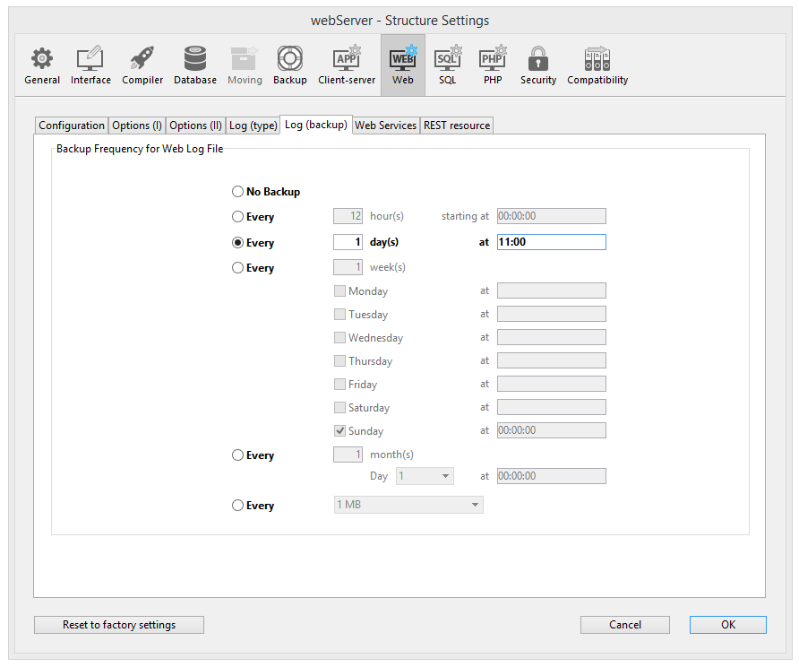

4D fornece várias ferramentas integradas para iniciar, parar ou monitorar o servidor web integrado.

## Iniciando o servidor Web 4D

> Para poder iniciar o servidor web de 4D ou 4D Server, você deve ter uma licença "4D Web Application". Para obter mais informações, consulte o site [4D](https://www.4d.com).

Um projeto 4D pode iniciar e monitorar um servidor web para a aplicação (host) principal, bem como para cada componente hospedado.

O servidor web principal de 4D pode ser iniciado de diferentes maneiras:

* Utilizar um botão/comando de menu.
  * 4D: **Execução\>iniciar servidor Web** 
  * 4D Server: botão **Iniciar servidor HTTP** da página Servidor HTTP 

* Inicia automaticamente cada vez que a aplicação 4D é aberta. Para fazer isso, exiba a página **Web\/Configuração** nas Propriedades e selecione a caixa de seleção **Iniciar Web Server na inicialização**: 

* Por programação, chamando o comando [`webServer.start()`](API/WebServerClass.md#start) ou `WEB START SERVER`.

O servidor web de qualquer componente pode ser lançado chamando a função [`webServer.start()`](API/WebServerClass.md#start) no objeto servidor web do componente.
> Você não precisa reiniciar a aplicação 4D para iniciar ou parar o servidor web.

## Parando o servidor Web 4D

O servidor web principal de 4D pode ser parado de diferentes maneiras:

* Usando o menu 4D **Executar\>Parar Servidor Web** ou o botão **Parar servidor HTTP** na página Servidor HTTP de 4D Server (ambos os itens mostram **Iniciar...** quando o servidor não estiver iniciado).

* Por programação, chamando a função [`webServer.stop()`](API/WebServerClass.md#stop) ou `WEB STOP SERVER`.

O servidor web de qualquer componente pode ser interrompido chamando a função `webServer.stop()` no objeto servidor web do componente.

## Testar o Web server

O comando de menú **Testar o Web server** pode ser usado para garantir que o servidor interno esteja funcionando corretamente (apenas 4D). Este comando é acessível no menu **Executar** quando for lançado o servidor web:

Quando seleciona este comando, a página de início do site web publicado pela aplicação 4D se mostra em uma janela de seu navegador web por padrão:

Este comando permite verificar o funcionamento do servidor web, a visualização da página de inicio, etc. Este comando permite verificar o funcionamento do servidor web, a visualização da página de inicio, etc. A página se chama utilizando o URL *Localhost*, o atalho padrão que designa o endereço IP da máquina onde se executa o navegador. The command takes into account the [TCP publication port](./webServerConfig.md#http-port) number specified in the settings.

## Limpar a cache

A qualquer momento, você pode limpar o cache das páginas e imagens que ele contém (se, por exemplo, você tiver modificado uma página estática e quiser recarregá-la no cache).

Para o fazer, basta clicar no botão **Clear Cache** na página Web/Opções (I) da caixa de diálogo Parâmetros. A cache é então imediatamente limpa.
> You can also use the [/4DCACHECLEAR](#4dcacheclear) URL.

## Explorador de execução

A página **Watch** (ir para **Web**) no Runtime Explorer exibe informações do servidor, particularmente:

* **Uso do cache web**: indica o número de páginas presentes no cache web, bem como sua porcentagem de uso. Esta informação só estará disponível se o servidor web estiver ativo e se o tamanho do cache for maior que 0.

* **Tempo decorrido do servidor Web**: indica a duração do uso (em horas:minutos:segundos) do servidor web. Esta informação só está disponível se o servidor Web estiver ativo.

* **Contagem de acessos à web**: indica o número total de solicitações HTTP recebidas desde a inicialização do servidor web, bem como um número instantâneo de solicitações por segundo (medida tomada entre duas atualizações do explorador de execução). Esta informação só está disponível se o servidor Web estiver ativo.

## URLs de administração

URLs de administração web permitem que você controle o site publicado no seu servidor. O servidor Web 4D aceita quatro URLs em particular: */4DSTATS*, */4DHTMLSTATS*, /*4DCACHECLEAR* e */4DWEBTEST*.

> */4DSTATS*, */4DHTMLSTATS* e */4DCACHECLEAR* só estão disponíveis para o Designer e Administrador do banco de dados. Se o sistema de senha 4D não foi ativado, estas URLs estarão disponíveis para todos os usuários. /4DWEBTEST está sempre disponível.

### /4DSTATS

O URL **/4DSTATS** retorna vários itens de informação em uma tabela HTML (exibido em um navegador):

| Elemento                | Descrição                                                     |
| ----------------------- | ------------------------------------------------------------- |
| Tamanho actual da cache | Tamanho atual da cache do servidor Web (em bytes)             |
| Tamanho máximo da cache | Tamanho máximo da cache (em bytes)                            |
| Cached Object Max Size  | Tamanho máximo de cada objeto na cache (em bytes)             |
| Cache Use               | Porcentagem do cache usado                                    |
| Cached Objects          | Número de objetos encontrados no cache, **incluindo imagens** |

Estas informações permitem que você verifique o funcionamento do seu servidor e eventualmente adapte os parâmetros correspondentes.
> O comando `WEB GET STATISTICS` permite que você também obtenha informações sobre como o cache está sendo usado para páginas estáticas.

### /4DHTMLSTATS

O URL */4DHTMLSTATS* retorna, também como uma tabela HTML, a mesma informação do URL */4DSTATS*. A diferença é que o campo **Objetos Cached** conta apenas páginas HTML (sem contar os arquivos de imagem). Além disso, esta URL retorna o campo **Objetos Filtrados**.

| Elemento                | Descrição                                                               |
| ----------------------- | ----------------------------------------------------------------------- |
| Tamanho actual da cache | Tamanho atual da cache do servidor Web (em bytes)                       |
| Tamanho máximo da cache | Tamanho máximo da cache (em bytes)                                      |
| Cached Object Max Size  | Tamanho máximo de cada objeto na cache (em bytes)                       |
| Cache Use               | Porcentagem do cache usado                                              |
| Cached Objects          | Número de objetos encontrados no cache, **sem imagens**                 |
| Objectos filtrados      | Número de objetos no cache não contados por URL, em particular, imagens |

### /4DCACHECLEAR

O URL */4DCACHECLEAR* limpa imediatamente o cache das páginas e imagens estáticas. Isso permite que você "forçe" a atualização das páginas que foram modificadas.

### /4DWEBTEST

A URL */4DWEBTEST* foi projetada para verificar o status do servidor da web. Quando esse URL é chamado, 4D retorna um arquivo texto com os campos HTTP seguintes preenchidos:

| Campo HTTP | Descrição                              | Exemplo                                                                                                                         |
| ---------- | -------------------------------------- | ------------------------------------------------------------------------------------------------------------------------------- |
| Date       | data atual no formato RFC 822          | Mon, 7 Dec 2020 13:12:50 GMT                                                                                                    |
| Server     | 4D/número da versão                    | 4D/18.5.0 (Build 18R5.257368)                                                                                                   |
| User-Agent | nome e versão @ endereço IP do cliente | Mozilla/5.0 (Windows NT 10.0; Win64; x64) AppleWebKit/537.36 (KHTML, like Gecko) Chrome/86.0.4240.183 Safari/537.36 @ 127.0.0.1 |

## Logs

4D permite gerar dois logs de pedidos web:

* um histórico de depuração, útil na fase de desenvolvimento do servidor Web (*HTTPDebugLog.txt*),
* um log de requisição da web padronizado, mais usado para fins de estatística (*logweb.txt*).

Ambos os arquivos de log são criados automaticamente na pasta **Logs** do projeto de aplicativo.

### HTTPDebugLog.txt

O arquivo de depuração [http](webServerConfig.md#debug-log) pode ser ativado usando o comando [`servidor` objeto](webServerObject.md) ou o comando `WEB SET OPTION`.

Este arquivo registra cada petição HTTP e cada resposta em modo raw (não processado). Petições inteiras, incluindo cabeçalhos, são registradas; opcionalmente, partes do corpo podem ser registradas também.

Os campos abaixo são registrados tanto para Request quanto para Response:

| Campo nome     | Descrição                                                    |
| -------------- | ------------------------------------------------------------ |
| SocketID       | ID da socked usada para comunicação                          |
| PeerIP         | Endereço IPv4 do host (cliente)                              |
| PeerPort       | Porta usada por host (cliente)                               |
| TimeStamp      | Timestamp em milisegundos (desde início sistema)             |
| ConnectionID   | Connection UUID (UUID de VTCPSocket usada para comunicação)  |
| SequenceNumber | Número de operação único e sequencial da sessão de histórico |

### logweb.txt

A gravação do arquivo de registro Web  pode ser ativada usando o servidor [`web` objeto](webServerObject.md), o comando `WEB SET OPÇÃO` ou a página **Web/Log (tipo)** das configurações. É necessário selecionar o formato do registo.

#### CLF/DLF

Cada linha do arquivo representa uma requisição, tais como: *host rfc931 usuário \[DD/MMM/YYYY:HH:MM:SS] "request" tamanho do estado* Cada campo é separado por um espaço e cada linha termina pela sequência CR/LF (caractere 13, caractere 10).

O formato DLF (Formato Combinado de Log) é semelhante ao formato CLF (Formato Comum de Log) e usa exatamente a mesma estrutura. Simplesmente adiciona dois campos HTTP adicionais no final de cada solicitação: Referer e User-agent. Eis a descrição dos formatos CLF/DLF (não personalizáveis):

| Campo nome           | Descrição                                                                                                                                                               |
| -------------------- | ----------------------------------------------------------------------------------------------------------------------------------------------------------------------- |
| host                 | Endereço IP do cliente (por exemplo: 192.100.100.10)                                                                                                                    |
| rfc931               | informação não gerada por 4D, é sempre - (um sinal de menos                                                                                                             |
| user                 | nome de usuário conforme é autenticado, ou então é - (um sinal de menos). Se o nome de usuário contiver espaços, eles serão substituídos por _ (um sublinhado).         |
| DD/MMM/YYYY:HH:MM:SS | DD: dia, MMM: uma abreviação de 3 letras para o nome do mês (Jan, Feb,...), YYYY: ano, HH: hora, MM: minutos, SS: segundos. A data e a hora são locais para o servidor. |
| request              | petição enviada pelo cliente (por exemplo, GET /index.htm HTTP/1.0                                                                                                      |
| state                | resposta dada pelo servidor                                                                                                                                             |
| length               | tamanho dos dados retornados (HTTP header exceto) ou 0                                                                                                                  |
| Referer              | DLF apenas- Contém a URL da página apontando para o documento solicitado.                                                                                               |
| User-agent           | Somente DLF - Contém o nome e a versão do navegador ou o software do cliente na origem do pedido                                                                        |

#### ELF/WLF

O formato ELF (Extended Log Format) é muito difundido no mundo dos navegadores HTTP. Ele pode ser usado para criar registros sofisticados que atendam a necessidades específicas. Por esse motivo, o formato ELF pode ser personalizado: é possível escolher os campos a serem registrados, bem como sua ordem de inserção no arquivo.

O WLF (formato de log WebStar) foi desenvolvido especificamente para o servidor 4D WebSTAR.

##### Configuração dos campos

Quando você escolher o formato ELF ou WLF, a área "Seleção de Token de Log Web" exibe os campos disponíveis para o formato escolhido. Você precisará selecionar cada campo a ser incluído no registro. Para o efeito, assinalar os campos pretendidos.
> Não é possível selecionar o mesmo campo duas vezes.

A tabela a seguir lista os campos disponíveis para cada formato (em ordem alfabética) e descreve seu conteúdo:

| Campo          | ELF | WLF | Valor                                                                                                                                                         |
| -------------- | --- | --- | ------------------------------------------------------------------------------------------------------------------------------------------------------------- |
| BYTES_RECEIVED |     | X   | Número de bytes recebidos pelo servidor                                                                                                                       |
| BYTES_SENT     | X   | X   | Número de bytes enviados pelo servidor ao cliente                                                                                                             |
| C_DNS          | X   | X   | Endereço IP do DNS (ELF: campo idêntico ao campo C_IP)                                                                                                        |
| C_IP           | X   | X   | Endereço IP do cliente (por exemplo, 192.100.100.10)                                                                                                          |
| CONNECTION_ID  |     | X   | Número de identificação da ligação                                                                                                                            |
| CS(COOKIE)     | X   | X   | Informações sobre as cookies contidas na petição HTTP                                                                                                         |
| CS(HOST)       | X   | X   | Campo Host do pedido HTTP                                                                                                                                     |
| CS(REFERER)    | X   | X   | URL da página que aponta para o documento solicitado                                                                                                          |
| CS(USER_AGENT) | X   | X   | Informações sobre o software e o sistema operacional do cliente                                                                                               |
| CS_SIP         | X   | X   | Endereço IP do servidor                                                                                                                                       |
| CS_URI         | X   | X   | URI onde o pedido é efectuado                                                                                                                                 |
| CS_URI_QUERY | X   | X   | Parâmetros da consulta                                                                                                                                        |
| CS_URI_STEM  | X   | X   | Parte da solicitação sem parâmetros de consulta                                                                                                               |
| DATE           | X   | X   | DDD: dia, MMM: abreviação de 3 letras por mês (jan, fev, etc.), YYYY: ano                                                                                     |
| METHOD         | X   | X   | Método HTTP utilizado para o pedido enviado ao servidor                                                                                                       |
| PATH_ARGS      |     | X   | Parâmetros CGI: cadeia de caracteres localizada após o carácter "$"                                                                                           |
| STATUS         | X   | X   | Resposta fornecida pelo servidor                                                                                                                              |
| TIME           | X   | X   | HH: hora, MM: minutos, SS: segundos                                                                                                                           |
| TRANSFER_TIME  | X   | X   | Tempo solicitado pelo servidor para gerar a resposta                                                                                                          |
| USER           | X   | X   | Nome do usuário se estiver autenticado; caso contrário, - (sinal de menos). Se o nome do usuário contiver espaços, eles serão substituídos por _ (sublinhado) |
| URL            |     | X   | URL solicitado pelo cliente                                                                                                                                   |

> As datas e horas são indicadas em GMT.

#### Frequência do backup

Como um arquivo *logweb.txt* pode se tornar consideravelmente grande, é possível configurar um mecanismo de arquivamento automático. O acionamento de um backup pode ser baseado em um determinado período de tempo (expresso em horas, dias, semana ou meses) ou baseado no tamanho do arquivo; quando o prazo definido (ou tamanho do arquivo) for atingido, 4D automaticamente fecha e arquiva o arquivo de registro atual e cria um novo.

Quando o backup do arquivo de log da web é acionado, o arquivo de log é arquivado em uma pasta chamada "Arquivos Logweb", que é criado no mesmo nível que o logweb *. Arquivo xt*.

O arquivo arquivado é renomeado com base no seguinte exemplo: “DYYYY_MM_DDD_Thh_mm_ss.txt.” Por exemplo, para um dossiê arquivado em 4 de Setembro de 2020 às 3h50. e 7 segundos: “D2020_09_04_T15_50_07.txt.” e 7 segundos: “D2020_09_04_T15_50_07.txt.”

#### Parâmetros de backup

Os parâmetros de backup automático para o logweb.txt são definidos na página **Web/Log (backup)** das Configurações:

Primeiro você deve escolher a frequência (dias, semanas, etc.) ou o critério de limite de tamanho de arquivo clicando no botão de rádio correspondente. Você deve então especificar o momento exato do backup, se necessário.

* **Nenhum Backup**: A função de backup programado está desativada.

* **A cada X hora(s)**: Esta opção é utilizada para programar backups por hora. Pode digitar um valor entre 1 e 24.
  * **começando em**: Usado para definir o tempo em que o primeiro volta começará.

* **Cada X dia(s) em X**: Esta opção é utilizada para programar backups diariamente. Introduza 1 se pretender efetuar uma cópia de segurança diária. Quando essa opção estiver marcada, você deve indicar a hora em que o backup deve ser iniciado.

* **A cada X semana(s) (s), dia em X**: Esta opção é usada para programar backups semanalmente. Digite 1 se quiser realizar o backup 1 vez por semana. Digite 1 se quiser realizar o backup 1 vez por semana. Digite 1 se quiser realizar o backup 1 vez por semana. Você pode selecionar vários dias da semana, se desejar.

* **A cada X mês), décimo dia no X**: Esta opção é utilizada para programar backups mensalmente. Digite 1 se quiser realizar uma cópia de segurança mensal. Quando essa opção estiver marcada, você deve indicar o dia do mês e a hora em que o backup deve ser iniciado.

* **Cada X MB**: Esta opção é usada para programar backups com base no tamanho do arquivo de log de solicitação atual. Um backup é automaticamente acionado quando o arquivo atinge o tamanho definido. Você pode definir um limite de tamanho de 1, 10, 100 ou 1000 MB.
