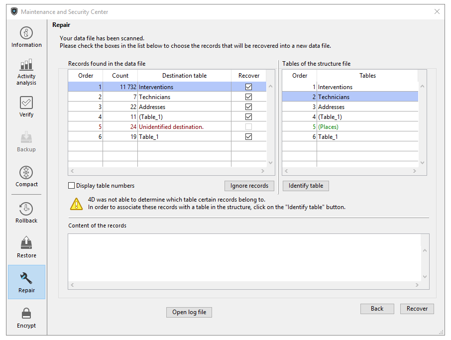

Esta página é utilizada para reparar o ficheiro de dados quando este foi danificado. Generalmente, sólo utilizará estas funciones bajo la supervisión de los equipos técnicos de 4D, cuando se hayan detectado anomalías al abrir la aplicación o tras una [verificación](verify.md).

**Atención:** cada operación de reparación implica la duplicación del archivo original, lo que aumenta el tamaño de la carpeta de la aplicación. É importante ter isto em conta (especialmente em macOS onde as aplicações 4D aparecem como pacotes) para que o tamanho da aplicação não aumente excessivamente. A remoção manual das cópias do arquivo original no pacote pode ser útil para minimizar o tamanho do pacote.

> O reparo só está disponível no modo manutenção. Se tentar fazer essa operação em modo padrão, um aviso informará que o banco de dados será fechado e reiniciado em modo manutenção.

> Quando o banco de dados está encriptado, a reparação dos dados inclui passos de desencriptação e encriptação e, por isso, requer a chave de encriptação de dados atual. Se nenhuma chave de criptografia válida já tiver sido fornecida, será exibida uma caixa de diálogo solicitando a frase secreta ou a chave de criptografia (consulte a página Criptografar).

## Arquivos

### Ficheiro de dados a reparar

Nome do caminho do ficheiro de dados atual. El botón **[...]** puede utilizarse para especificar otro archivo de datos. Quando você clica nesse botão, uma caixa de diálogo padrão Abrir documento é exibida para você poder designar o arquivo de dados a ser reparado. Si realiza una [reparación estándar](#standard-repair), debe seleccionar un archivo de datos que sea compatible con el archivo proyecto abierto. Si realiza una reparación [reparación por encabezados de registros](#recover-by-record-headers), puede seleccionar todo archivo de datos. Depois que essa caixa de diálogo for validada, o nome do caminho do arquivo a ser reparado será indicado na janela.

### Pasta de cópia de segurança dos ficheiros originais

Por padrão, o arquivo de dados original será duplicado antes da operação de reparo. Ele será colocado em uma subpasta chamada "Replaced files (repairing)" na pasta da aplicação. El segundo botón **[...]** se puede utilizar para especificar otra ubicación para guardar los archivos originales antes de iniciar la reparación. Essa opção pode ser usada mais particularmente ao reparar arquivos volumosos ao usar discos diferentes.

### Ficheiros reparados

4D cria um ficheiro de dados em branco no local do ficheiro original. 4D creates a new blank data file at the location of the original file. O ficheiro em branco é preenchido com os dados recuperados.

## Reparação standard

A reparação padrão deve ser escolhida quando apenas alguns registos ou índices estão danificados (as tabelas de endereços estão intactas). Os dados são compactados e reparados. Esse tipo de reparo só pode ser realizado quando os dados e o arquivo de estrutura coincidem.

Quando o procedimento de reparo for concluído, a página "Reparo" do CSM será exibida. Uma mensagem indica se a reparação foi bem sucedida. Se for assim, pode abrir o banco de dados imediatamente.

## Recuperar por cabeçalhos de registos

Usar esta opção de reparo de baixo nível somente quando o arquivo de dados estiver gravemente danificado e depois de todas as outras soluções (restaurando de um backup, reparo padrão) provou ser ineficaz.

Os registros 4D variam em tamanho, portanto, é necessário manter o local em que estão armazenados no disco em uma tabela específica, denominada tabela de endereços, para poderem ser encontrados novamente. Portanto, o programa acessa o endereço do registro por um índice e da tabela de endereços. Se apenas os registros ou índices estiverem danificados, a opção de reparo padrão geralmente é suficiente para resolver o problema. No entanto, quando a própria tabela de endereços é afetada, é necessária uma recuperação mais sofisticada, pois será necessário reconstituí-la. Para fazer isso, o CSM usa o marcador localizado no cabeçalho de cada registro. Os marcadores são comparados a um resumo do registro, incluindo a maior parte de suas informações, e a partir do qual é possível reconstruir a tabela de endereços.

> Si ha desmarcado la opción **Registros eliminados definitivamente** en las propiedades de una tabla en la estructura, la reparación por marcadores de encabezados puede hacer que vuelvan a aparecer los registros que se eliminaron anteriormente.
>
> A recuperação por cabeçalhos não tem em conta as restrições de integridade. Más concretamente, tras esta operación puede obtener valores duplicados con campos únicos o valores NULL con campos declarados **Nunca Null**.

Al hacer clic en **Escanear y reparar...**, 4D realiza un análisis completo del archivo de datos. Quando a verificação estiver concluída, os resultados aparecem na janela seguinte:

> Se todos os registos e todas as tabelas tiverem sido atribuídos, apenas a área principal é mostrada.

A área "Registros encontrados no arquivo de dados" inclui duas tabelas que resumem as informações da varredura do arquivo de dados.

- A primeira tabela lista as informações provenientes da verificação do ficheiro de dados. Cada linha mostra um grupo de registos recuperáveis no ficheiro de dados:
    - La columna **Orden** indica el orden de recuperación del grupo de registros.
    - La columna **Número** indica el número de los registros de la tabla.
    - La columna **Tabla de destino** indica los nombres de las tablas que se asignaron automáticamente a los grupos de registros identificados. Os nomes das tabelas atribuídas aparecem automaticamente a verde. Os grupos que não foram atribuídos, ou seja, as tabelas que não puderam ser associadas a nenhum registro, aparecem em vermelho.
    - La columna **Recuperar** le permite indicar, para cada grupo, si quiere recuperar los registros. Por padrão, essa opção é marcada para todos os grupos com registros que podem ser associados a uma tabela.

- A segunda tabela lista as tabelas do ficheiro de projeto.

### Atribuição manual

Se vários grupos de registros não puderem ser atribuídos a tabelas devido a uma tabela de endereços danificada, é possível atribuí-los manualmente.
Para fazer isso, primeiro selecione um grupo de registros não atribuído na primeira tabela. A área "Conteúdo dos registros" exibe uma visualização do conteúdo dos primeiros registros do grupo para facilitar a atribuição:

A continuación, seleccione la tabla que desea asignar al grupo en la tabla "Tablas no asignadas" y haga clic en el botón **Identificar tabla**. Também pode atribuir uma tabela utilizando a função arrastar e largar.
O grupo de registros é então associado à tabela e será recuperado nessa tabela. Os nomes das tabelas atribuídas manualmente aparecem a preto.
Utilice el botón **Ignorar registros** para eliminar la asociación realizada manualmente entre la tabla y el grupo de registros.

## Abrir arquivo de registo

Depois que a reparação terminar, 4D gera um arquivo de histórico na pasta Logs do banco de dados. Este arquivo permite visualizar todas as operações efectuadas. É criado no formato XML e chamado: *DatabaseName\*\*_Repair_Log_yyyy-mm-dd hh-mm-ss.xml*" onde:

- *ApplicationName* es el nombre del archivo del proyecto sin ninguna extensión, por ejemplo "Facturas",
- *yyyy-mm-dd hh-mm-ss* es la marca de tiempo del archivo, basada en la hora del sistema local cuando se inició la operación de mantenimiento, por ejemplo "2019-02-11 15-20-45".

Al presionar el botón **Abrir archivo de historial**, 4D muestra el archivo de historial más reciente en el navegador por defecto de la máquina.
