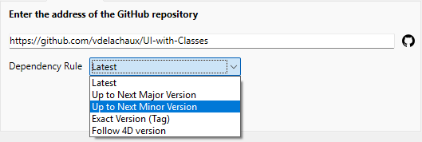
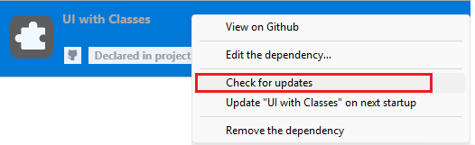
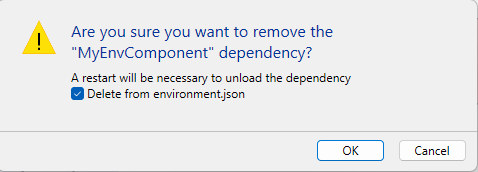

Um componente 4D é um conjunto de código 4D e/ou formulários que representam uma ou mais funcionalidades que pode adicionar e usar nos seus projetos. Por exemplo, o componente [4D SVG](https://github.com/4d/4D-SVG) adiciona comandos avançados e um mecanismo de renderização integrado que pode ser usado para exibir arquivos SVG.

Você pode [desenvolver](../Extensions/develop-components.md) e [construir](../Desktop/building.md) seus próprios componentes 4D, ou baixar componentes públicos compartilhados pela comunidade 4D que [podem ser encontrados no GitHub](https://github.com/search?q=4d-component&type=Repositories).

Ao desenvolver em 4D, os arquivos de componentes podem ser armazenados de forma transparente no seu computador ou em um repositório do Github.

## Componentes interpretados e compilados

Componentes podem ser interpretados ou [compilados](../Desktop/building.md).

- Um projeto 4D em modo interpretado pode usar componentes interpretados ou compilados.
- Um projeto 4D em execução no modo compilado não pode usar componentes interpretados. Por isso não pode ser usado em um componente.

### Pasta do pacote

The package folder of a component (*MyComponent.4dbase* folder) can contain:

- para **componentes interpretados**: uma [pasta Project](../Project/architecture.md). O nome da pasta do pacote deve ser sufixado com **.4dbase** se você quiser instalá-lo na pasta [**Components** do seu projeto](architecture.md#components).
- para **componentes compilados**:
    - uma pasta "Contents" contendo um arquivo .4DZ, uma pasta *Resources*, um arquivo *Info.plist* (arquitetura recomendada)
    - ou diretamente um arquivo .4DZ com outras pastas como *Recursos*.

:::note

A arquitetura da pasta "Contents" é recomendada para componentes, se você deseja [notarize](../Desktop/building.md#about-notarization) suas aplicações no macOS.

:::

## Carregando componentes

:::note

Esta página descreve como trabalhar com componentes nos ambientes **4D** e **4D Server**. Em outros ambientes, os componentes são geridos de forma diferente:

- em [4D no modo remoto](../Desktop/clientServer.md), componentes são carregados pelo servidor e enviados para o aplicativo remoto.
- em aplicações mescladas, componentes são [incluídos na etapa de compilação](../Desktop/building.md#plugins--components-page).

:::

### Visão Geral

Para carregar um componente no seu projeto 4D, você pode:

- copie os arquivos de componentes na pasta [**Components** do seu projeto](architecture.md#components) (as pastas de pacotes de componentes interpretados devem ser sufixadas com ".4dbase", veja acima),
- ou, declarar o componente nas **dependências**. fil\*\* arquivo de seu projeto; isto é feito automaticamente para arquivos locais quando você [**adicionar uma dependência usando a interface do Gerenciador de Dependência**](#adding-a-github-dependency).

Os componentes declarados no arquivo **dependencies.json** podem ser armazenados em locais diferentes:

- no mesmo nível da pasta do pacote do seu projeto 4D: esse é o local padrão,
- em qualquer lugar de sua máquina: o caminho do componente deve ser declarado no arquivo **environment4d.json**
- em um repositório GitHub: o caminho do componente pode ser declarado no arquivo **dependencies.json** ou no arquivo **environment4d.json**, ou em ambos os arquivos.

Se o mesmo componente for instalado em locais diferentes, uma [ordem de prioridade](#prioridade) é aplicada.

### dependencies.json e environment4d.json

#### dependencies.json

O arquivo **dependencies.json** faz referência a todos os componentes necessários em seu projeto 4D. Esse arquivo deve estar localizado na pasta **Sources** da pasta do projeto 4D, por exemplo:

```
	/MyProjectRoot/Project/Sources/dependencies.json
```

Pode conter:

- nomes de componentes [armazenado localmente](#local-components) (caminho ou caminho padrão definido em um arquivo **environment4d.json**),
- nomes de componentes [armazenados nos repositórios do GitHub](#components-stored-on-github) (seus caminhos podem ser definidos neste arquivo ou em um arquivo **environment4d.json**).

#### environment4d.json

O arquivo **environment4d.json** é opcional. Ele permite que você defina **caminhos personalizados** para alguns ou todos os componentes declarados no arquivo **dependencies.json**. Este arquivo pode ser armazenado na pasta pacote de projeto ou em uma das pastas pais, a qualquer nível (superior à raiz).

Os principais benefícios desta arquitetura são os seguintes:

- você pode armazenar o **ambiente4d. arquivo son** em uma pasta pai de seus projetos e decida não fazer commit dele, permitindo que você tenha sua organização local de componentes.
- se quiser usar o mesmo repositório GitHub para vários projetos, você poderá fazer referência a ele no arquivo **environment4d.json** e declará-lo no arquivo **dependencies.json**.

### Prioridade

Uma vez que os componentes podem ser instalados de maneiras diferentes, uma ordem de prioridade é aplicada quando o mesmo componente é referenciado em vários locais:

**Prioridade mais alta**

1. Componentes armazenados na pasta [**Components** do projeto](architecture.md#components).
2. Componentes declarados no arquivo **dependencies.json** (o **environment4d.json** declarou o caminho substitui o caminho **dependencies.json** para configurar um ambiente local).
3. Componentes 4D do usuário interno (por exemplo, 4D NetKit, 4D SVG...)

**Prioridade mais baixa**


Quando um componente não pode ser carregado por causa de outra instância do mesmo componente localizada em um nível de prioridade mais alto, ambos recebem um [status] específico(#dependency-status): o componente não carregado recebe o status *Overloaded*, enquanto o componente carregado tem o status *Overloading*.

### Componentes locais

Você declara um componente local no arquivo [**dependencies.json**](#dependenciesjson) da seguinte maneira:

```json
{
    "dependencies": {
        "myComponent1" : {},
        "myComponent2" : {}
    }
}
```

... onde "myComponent1" e "myComponent2" são o nome dos componentes a serem carregados.

Por padrão, se "myComponent1" e "myComponent2" não forem declarados em um arquivo [**environment4d.json**](#environment4djson), o 4D procurará a pasta do pacote do componente (\*ou seja, \*a pasta raiz do projeto do componente) no mesmo nível da pasta do pacote do seu projeto 4D, por exemplo:

```
	/MyProjectRoot/
	/MyProjectComponentRoot/
```

Graças a essa arquitetura, você pode simplesmente copiar todos os seus componentes no mesmo nível dos seus projetos e fazer referência a eles nos arquivos **dependencies.json**.

:::note

Se não quiser usar a arquitetura **dependencies.json**, você poderá instalar componentes locais copiando seus arquivos na pasta [**Components** do seu projeto](architecture.md#components).

:::

#### Personalizando caminhos dos componentes

Se você deseja personalizar a localização dos componentes locais, você declara os caminhos para as dependências que não são armazenados no mesmo nível que a pasta do projeto no [**environment4d. son**](#environment4djson) arquivo.

Você pode usar caminhos **relativos** ou **absolutos** (veja abaixo).

Exemplos:

```json
{
	"dependencies": {
		"myComponent1" : "MyComponent1",
		"myComponent2" : "../MyComponent2",
    "myComponent3" : "file:///Users/jean/MyComponent3"
    }
}
```

:::note

Se um caminho do componente for declarado no **ambiente4d. arquivo son** não é encontrado quando o projeto é iniciado, o componente não é carregado e obtém o *Não encontrado* [status](#dependency-status), mesmo que uma versão do componente exista ao lado da pasta do pacote do projeto.

:::

#### Caminhos relativos versus caminhos absolutos

Os caminhos são expressos na sintaxe POSIX, conforme descrito em [este parágrafo](../Concepts/paths#posix-syntax).

Os caminhos relativos são relativos ao arquivo [`environment4d.json`](#environment4djson). Caminhos absolutos estão vinculados à máquina do usuário.

Usar caminhos relativos é **recomendado** geralmente, já que eles fornecem flexibilidade e portabilidade da arquitetura de componentes, especialmente se o projeto for hospedado em uma ferramenta de controle de fonte.

Caminhos absolutos devem ser usados apenas para componentes específicos para um computador e um usuário.

### Componentes armazenados no GitHub

Componentes 4D disponíveis já que os lançamentos do GitHub podem ser referenciados e carregados automaticamente e atualizados nos seus projetos 4D.

:::note

Em relação aos componentes armazenados no GitHub, ambos os arquivos [**dependencies.json**](#dependenciesjson) e [**environment4d.json**](#environment4djson) suportam o mesmo conteúdo.

:::

#### Configurando o repositório GitHub

Para ser capaz de fazer referência direta e usar um componente 4D armazenado no GitHub, você precisa configurar o repositório do componente GitHub:

- Compacte os arquivos de componentes no formato ZIP.
- Nomeie este arquivo com o mesmo nome do repositório do GitHub.
- Integre o arquivo em uma [versão do GitHub](https://docs.github.com/en/repositories/releasing-projects-on-github/managing-releases-in-a-repository) do repositório.

Essas etapas podem ser facilmente automatizadas, com o código 4D ou usando o GitHub Actions, por exemplo.

#### Declarando caminhos

Você declara um componente armazenado no GitHub no arquivo [**dependencies.json**](#dependenciesjson) da seguinte maneira:

```json
{
	"dependencies": {
		"myGitHubComponent1": {
			"github" : "JohnSmith/myGitHubComponent1"
		},
		"myGitHubComponent2": {}
	}
}
```

... onde "myGitHubComponent1" é referenciado e declarado para o projeto, embora "myGitHubComponent2" seja apenas referenciado. Você precisa declará-lo no arquivo [**environment4d.json**](#environment4djson):

```json
{
	"dependencies": {
		"myGitHubComponent2": {
			"github" : "JohnSmith/myGitHubComponent2"
		}
	}
}
```

"myGitHubComponent2" pode ser usado por vários projetos.

#### Tags e versões

Quando uma versão é criada no GitHub, ela é associada a uma **tag** e uma **version**. O gerenciador de dependências usa essas informações para lidar com a disponibilidade automática de componentes.

:::note

Se você selecionar a [**Seguir 4D Version**](#defining-a-github-dependency-version-range) regra de dependência, você precisa usar uma [convenção de nome específico para as tags](#naming-conventions-for-4d-version-tags).

:::

- **Etiquetas** são textos que fazem referência exclusiva a uma versão. Nos arquivos [**dependencies.json**](#dependenciesjson) e [**environment4d.json**](#environment4djson), você pode indicar a tag de versão que deseja usar em seu projeto. Por exemplo :

```json
{
	"dependencies": {
		"myFirstGitHubComponent": {
			"github": "JohnSmith/myFirstGitHubComponent",
			"tag": "beta2"
		}
	}
}
```

- Uma versão também é identificada por uma **versão**. O sistema de versionamento usado é baseado no conceito de [*Versão semântica*](https://regex101.com/r/Ly7O1x/3/), que é o mais comummente usado. Cada número de versão é identificado da seguinte forma: `majorNumber.minorNumber.pathNumber`. Da mesma forma que para marcadores, você pode indicar a versão do componente que você deseja usar em seu projeto, como neste exemplo:

```json
{
	"dependencies": {
		"myFirstGitHubComponent": {
			"github": "JohnSmith/myFirstGitHubComponent",
			"version": "2.1.3"
		}
	}
}
```

Um intervalo é definido por duas versões semânticas, um mínimo e um máximo, com as operadoras '\< ë> £>= ├<= ├='. O `*` pode ser usado como um espaço reservado para todas as versões. Os prefixos ~ e ^ definem versões que começam em um número e vão até a próxima versão principal e secundária, respectivamente.

Eis alguns exemplos:

- "latest": a versão com o selo "latest" nas versões GitHub.
- "\*": a versão mais recente lançada.
- "1.\*": todas as versões da versão principal 1.
- "1.2.\*": todos os patches da versão menor 1.2.
- ">=1.2.3": a última versão, começando com a versão 1.2.3.
- ">1.2.3": a versão mais recente, começando com a versão imediatamente após a versão 1.2.3.
- "^1.2.3": a última versão 1, começando com a versão 1.2.3 e estritamente inferior à versão 2.
- "~1.2.3": a última versão 1.2, começando com a versão 1.2.3 e estritamente inferior à versão 1.3.
- "<=1.2.3": a versão mais recente até a 1.2.3.
- "1.0.0 - 1.2.3" ou ">=1.0.0 <=1.2.3": versão entre 1.0.0 e 1.2.3.
- "`<1.2.3 || >=2`": versão que não está entre 1.2.3 e 2.0.0.

Se você não especificar uma tag ou uma versão, 4D recupera automaticamente a "versão mais recente".

O gerenciador de dependências verifica periodicamente se as atualizações do componente estão disponíveis no Github. Se uma nova versão estiver disponível para um componente, um indicador de atualização é então exibido para o componente na lista de dependências, [dependendo das configurações](#defining-a-github-dependency-version-range).

#### Nomeando convenções para tags de versão 4D

Se quiser usar a [**Seguir 4D Version**](#defining-a-github-dependency-version-range) regra de dependência, os marcadores de versões de componentes no repositório do Github devem obedecer a convenções específicas.

- **Versões do LT**: padrão `x.y.p`, onde `x. ` corresponde à versão 4D principal a seguir e o `p` (opcional) pode ser usado para versões patch ou atualizações adicionais. Quando um projeto especifica que segue a versão 4D para *x. \* Versão LTS, o Gerenciador de Dependências irá resolvê-lo como "a versão mais recente x.*" se disponível ou "versão abaixo de x". Se não existir essa versão, o usuário será notificado. Por exemplo, "20.4" será resolvido pelo Gerenciador de Dependências como "a última versão do componente 20.\* ou versão abaixo de 20".

- **Versões R-Release**: padrão `xRy. `, onde `x` e `y` correspondem à versão principal 4D R-release para seguir e `p` (opcional) podem ser usados para versões patch ou atualizações adicionais. Quando um projeto especifica que segue a versão 4D para a versão *xRy*, o Gerenciador de Dependências a resolverá para a "versão mais recente abaixo de xR(y+1)", se disponível. Se não existir essa versão, o usuário será notificado. Por exemplo, "20R9" será resolvido pelo Gerenciador de Dependências como "a última versão do componente abaixo de 20R10".

:::note

O desenvolvedor do componente pode definir uma versão 4D mínima no arquivo [`info.plist`] do componente (../Extensions/develop-components.md#infoplist).

:::

#### Repositórios privados

Se você quiser integrar um componente localizado em um repositório privado, precisará dizer ao 4D para usar um token de conexão para acessá-lo.

Para fazer isso, em sua conta GitHub, crie um token **classic** com direitos de acesso a **repo**.

:::note

Para mais informações, consulte a [interface de token do GitHub](https://github.com/settings/tokens).

:::

Em seguida, você precisa [fornecer seu token de conexão](#providing-your-github-access-token) para o gerenciador de dependências.

#### Cache local para dependências

Os componentes GitHub referenciados são baixados em uma pasta de cache local e carregados em seu ambiente. A pasta de cache local é armazenada na seguinte localização:

- en macOs: `$HOME/Library/Caches/<app name>/Dependencies`
- no Windows: `C:\Users\<username>\AppData\Local\<app name>\Dependencies`

...onde `<app name>` pode ser "4D", "4D Server" ou "tool4D".

### Automatic dependency resolution

When you add or update a component (whether [local](#local-components) or [from GitHub](#components-stored-on-github)), 4D automatically resolves and installs all dependencies required by that component. Isto inclui:

- **Primary dependencies**: Components you explicitly declare in your `dependencies.json` file
- **Secondary dependencies**: Components required by primary dependencies or other secondary dependencies, which are automatically resolved and installed

The Dependency manager reads each component's own `dependencies.json` file and recursively installs all required dependencies, respecting version specifications whenever possible. This eliminates the need to manually identify and add nested dependencies one by one.

- **Conflict resolution**: When multiple dependencies require [different versions](#) of the same component, the Dependency manager automatically attempts to resolve conflicts by finding a version that satisfies all overlapping version ranges. If a primary dependency conflicts with secondary dependencies, the primary dependency takes precedence.

:::note

`dependencies.json` files are ignored in components loaded from the [**Components** folder](architecture.md#components).

:::

### dependency-lock.json

Um arquivo `dependency-lock.json` foi criado na pasta [`userPreferences`](architecture.md#userpreferencesusername) do seu projeto.

Este arquivo registra informações como o estado das dependências, caminhos, urls, erros de carregamento, bem como outras informações. Pode ser útil para o gerenciamento de carregamentos de componentes ou solução de problemas.

## Monitoramento das dependências do projeto

Em um projeto aberto, você pode adicionar, remover, atualizar e obter informações sobre dependências e seu status de carregamento atual no painel **Dependências**.

Para exibir o painel Dependências:

- Com 4D, selecione o item de menu **Design/Project Dependencies** (ambiente de desenvolvimento),<br/>
    

- com 4D Server, selecione o item de menu **Janela/Dependências do projeto**.<br/>
    

O painel de Dependências é exibido em seguida. Dependências são classificadas por nome em ordem alfabética:


A interface do painel de Dependências permite gerenciar dependências (no servidor 4D single-user e 4D).

### Filtragem das dependências

Por padrão, todas as dependências identificadas pelo gerenciador de dependências são listadas, independentemente de seu [estado](#dependency-status). Você pode filtrar as dependências exibidas de acordo com o seu status, selecionando a guia apropriada na parte superior do painel Dependências:


- **All**: All dependencies including both primary (declared) and secondary (automatically resolved) dependencies in a flat list view.
- **Declared**: Primary dependencies that are explicitly declared in the `dependencies.json` file. This tab helps you distinguish between dependencies you've directly added and those that were [automatically resolved](#automatic-dependency-resolution).
- **Ativo**: dependências carregadas e podem ser usadas no projeto. Isso inclui dependências *overloading*, que são de fato carregadas. As dependências *sobrecarregadas* são listadas no painel **Conflitos**, juntamente com todas as dependências conflitantes.
- **Inativo**: dependências que não estão carregadas no projeto e não estão disponíveis. Há muitos motivos possíveis para esse status: arquivos ausentes, incompatibilidade de versão...
- **Conflicts**: Dependencies that are loaded but that overloads at least one other dependency at a lower [priority level](#priority). As dependências sobrecarregadas também são exibidas para que você possa verificar a origem do conflito e tomar as medidas adequadas.

### Secondary dependencies

The Dependencies panel displays [**secondary dependencies**](#automatic-dependency-resolution) with the `Component dependency` [origin](#dependency-origin):


When you hover over a secondary dependency, a tooltip displays the parent dependency that requires it. A secondary dependency cannot be [removed](#removing-a-dependency) directly, you must remove or edit the primary dependency that requires it.

### Estado de dependências

As dependências que exigem a atenção do desenvolvedor são indicadas por um **rótulo de status** no lado direito da linha e uma cor de fundo específica:


Estão disponíveis as seguintes etiquetas de status:

- **Overloaded**: a dependência não é carregada porque está sobrecarregada por outra dependência com o mesmo nome em um [nível de prioridade] mais alto (#prioridade).
- **Overloading**: a dependência está carregada e está sobrecarregando uma ou mais dependências com o mesmo nome em um [nível de prioridade] inferior (#prioridade).
- **Not found**: a dependência está declarada no arquivo dependencies.json, mas não foi encontrada.
- **Inactive**: a dependência não é carregada porque não é compatível com o projeto (por exemplo, o componente não é compilado para a plataforma atual).
- **Duplicated**: a dependência não é carregada porque existe uma outra dependência com o mesmo nome no mesmo local (e é carregado).
- **Disponível após a reinicialização**: A referência de dependência acabou de ser adicionada ou atualizada [usando a interface] (#monitoring-project-dependencies) e será carregada quando o aplicativo for reiniciado.
- **Disponível após a reinicialização**: A referência de dependência acabou de ser adicionada ou atualizada [usando a interface] (#removing-a-dependency) e será carregada quando o aplicativo for reiniciado.
- **Atualização disponível \<version\>**: Foi detectada uma nova versão da dependência do GitHub que corresponde à sua [configuração da versão do componente](#defining-a-github-dependency-version-range).
- **Refreshed after restart**: A [configuração da versão do componente](#defining-a-github-dependency-version-range) da dependência do GitHub foi modificada, ela será ajustada na próxima inicialização.
- **Atualização recente**: uma nova versão da dependência do GitHub foi carregada na inicialização.

Uma dica é exibida quando você passa o mouse sobre a linha de dependência, provando informações adicionais sobre o status:


### Origem da dependência

O painel de Dependências lista todas as dependências do projeto, independentemente da sua origem, ou seja, de onde vierem. A origem da dependência é fornecida pela etiqueta sob seu nome:


As seguintes origens são possíveis:

| Etiqueta de origem      | Descrição                                                                                                                                    |
| ----------------------- | -------------------------------------------------------------------------------------------------------------------------------------------- |
| Built in 4D             | Componente 4D incorporado, armazenado na pasta `Components` da aplicação 4D                                                                  |
| Declared in project     | Componente declarado no arquivo [`dependencies.json`](#dependenciesjson)                                                                     |
| Declared in environment | Component declared in the [`dependencies.json`](#dependenciesjson) file and overriden in the [`environment4d.json`](#environment4djson) file |
| Pasta Components        | Componente localizado na pasta [`Components`](architecture.md#components)                                                                    |
| Component dependency    | Secondary component ([required by a another component](#automatic-dependency-resolution))                                 |

**Clique com o botão direito do mouse** em uma linha de dependência e selecione **Mostrar no disco** para revelar o local de uma dependência:


:::note

Este item não é exibido se a dependência estiver inativa porque seus arquivos não foram encontrados.

:::

O ícone do componente e o logotipo da localização fornecem informações adicionais:

- O logotipo do componente indica se é fornecido por 4D ou por um desenvolvedor terceiro.
- Os componentes locais podem ser diferenciados de componentes do GitHub usando um ícone pequeno.


### Adição de uma dependência local

Para adicionar uma dependência local, clique no botão **+** na área de rodapé do painel. A caixa de diálogo abaixo é mostrada:


Certifique-se de que a aba **Local** esteja selecionada e clique no botão **...**. Uma caixa de diálogo padrão Abrir arquivo é exibida, permitindo que você selecione o componente a ser adicionado. Você pode selecionar um arquivo [**.4DZ**](../Desktop/building.md#build-component) ou um arquivo [**.4DProject**](architecture.md#applicationname4dproject-file).

Se o item selecionado for válido, seu nome e localização serão exibidos na caixa de diálogo.


Se o item selecionado não for válido, será exibida uma mensagem de erro.

Clique em **Adicionar** para adicionar a dependência ao projeto.

- Se você selecionar um componente localizado próximo à pasta do pacote do projeto (local padrão), ele será declarado no arquivo [**dependencies.json**](#dependenciesjson).
- Se você selecionar um componente que não esteja localizado próximo à pasta do pacote do projeto, ele será declarado no arquivo [**dependencies.json**](#dependenciesjson) e seu caminho será declarado no arquivo [**environment4d.json**](#environment4djson) (consulte a nota). O painel Dependências pergunta se você deseja salvar um [caminho relativo ou absoluto](#relative-paths-vs-absolute-paths).

:::note

Se nenhum arquivo [**environment4d.json**](#environment4djson) já estiver definido para o projeto nessa etapa, ele será criado automaticamente na pasta do pacote do projeto (local padrão).

:::

A dependência é adicionada à [lista de dependências inativas](#dependency-status) com o estado **Disponível após reiniciar**. Ele será carregado quando o aplicativo for reiniciado.

### Adicionar uma dependência GitHub

Para adicionar uma [dependência GitHub](#components-stored-on-github), clique no botão **+** na área de rodapé do painel e selecione a aba **GitHub**.


Insira o caminho do repositório do GitHub da dependência. Pode ser uma **URL do repositório** ou uma **corda da conta do Github/nome do repositório**, por exemplo:


Depois que a conexão é estabelecida, o ícone do GitHub  é exibido no lado direito da área de entrada. Você pode clicar nesse ícone para abrir o repositório em seu navegador padrão.

:::note

Se o componente estiver armazenado em um [repositório privado do GitHub](#private-repositories) e seu token pessoal estiver ausente, uma mensagem de erro será exibida e um botão **Adicionar um token de acesso pessoal...** será exibido (consulte [Fornecendo seu token de acesso ao GitHub](#providing-your-github-access-token)).

:::

Defina o [intervalo de versão de dependência](#tags-and-versions) para usar neste projeto. Por padrão, a opção "Latest" é selecionada, o que significa que a versão mais recente será usada automaticamente.

Clique no botão **Adicionar** para adicionar a dependência ao projeto.

A dependência do GitHub é declarada no arquivo [**dependencies.json**](#dependenciesjson) e adicionada à [inactive dependency list](#dependency-status) com o status **Available at restart**. Ele será carregado quando o aplicativo for reiniciado.

#### Definição de um intervalo de versões de dependência do GitHub

Você pode definir a opção [tag ou versão](#tags-and-versions) para uma dependência:



- **Latest**: Selecionado por padrão e permite baixar a versão marcada como a mais recente (estável).
- **Até a próxima versão major**: defina um [intervalo de versão semântica](#tags-and-versions) para restringir as atualizações para a próxima versão principal.
- **Até a próxima versão minor**: da mesma forma, restringe as atualizações para a próxima versão minor.
- **Versão exata (etiqueta)**: selecione ou insira manualmente uma [etiqueta específica](#tags-and-versions) na lista disponível.
- **Siga a versão 4D**: Faça o download da versão mais recente do componente que é compatível com a versão 4D em execução. Você pode usar essa regra de dependência somente se as tags de liberação do componente seguirem a [convenção de nomenclatura] apropriada (#naming-conventions-for-4d-version-tags).

A versão atual da dependência do GitHub é exibida no lado direito do item de dependência:


#### Modificar o intervalo de versões de dependência do GitHub

Você pode modificar a [configuração da versão](#defining-a-github-dependency-version-range) para uma dependência listada no GitHub: selecione a dependência para modificar e selecione **Modificar a dependência. .** do menu contextual. Na caixa de diálogo "Modificar a dependência", edite o menu da Regra de dependência e clique em **Aplicar**.

Modificar o intervalo de versão é útil, por exemplo, se você usar o recurso de atualização automática e deseja bloquear a dependência de um número de versão específico.

### Atualizando dependências do GitHub

O gerenciador de dependências fornece um tratamento integrado de atualizações no GitHub. Os seguintes recursos são suportados:

- Verificação automática e manual das versões disponíveis
- Atualização automática e manual de componentes

As operações manuais podem ser feitas **por dependência** ou **para todas as dependências**.

#### Verificando por versões mais novas

As dependências são verificadas regularmente quanto a atualizações no GitHub. Essa verificação é feita de forma transparente em segundo plano.

:::note

Se você fornecer um [token de acesso](#providing-your-github-access-token), as verificações serão realizadas com mais frequência, pois o GitHub permite uma frequência maior de solicitações aos repositórios.

:::

Além disso, você pode verificar se há atualizações a qualquer momento, para uma única dependência ou para todas as dependências:

- Para verificar se há atualizações de uma única dependência, clique com o botão direito do mouse na dependência e selecione **Verificar atualizações** no menu contextual.



- Para verificar se há atualizações de todas as dependências, clique no menu **opções** na parte inferior da janela do Gerenciador de dependências e selecione **Verificar atualizações**.


Se uma nova versão de componente que corresponda à sua [configuração de controle de versão de componente](#defining-a-github-dependency-version-range) for detectada no GitHub, um status de dependência específico será exibido:


Você pode decidir [atualizar o componente](#updating-dependencies) ou não.

Se não quiser usar uma atualização de componente (por exemplo, se quiser permanecer com uma versão específica), basta deixar o status atual (certifique-se de que o recurso [**Atualização automática**](#automatic-update) não esteja marcado).

#### Atualização de dependências

**Atualizar uma dependência** significa baixar uma nova versão da dependência do GitHub e mantê-lo pronto para ser carregado na próxima vez que o projeto for iniciado.

Você pode atualizar as dependências a qualquer momento, para uma única dependência ou para todas as dependências:

- Para atualizar uma única dependência, clique com o botão direito na dependência e selecione **Atualizar \<component name\> na próxima inicialização** no menu contextual ou no menu **opções** na parte inferior da janela Gerenciador de Dependências:


- Para atualizar todas as dependências de uma só vez, clique no menu **opções** na parte inferior da janela do gerenciador de dependências e selecione **Atualizar todas as dependências remotas na próxima inicialização**:


Em qualquer caso, independentemente do status atual da dependência, é feita uma verificação automática no GitHub antes de atualizar a dependência, para garantir que a versão mais recente seja recuperada, [de acordo com a configuração de controle de versão do componente](#defining-a-github-dependency-version-range).

Quando você seleciona um comando de atualização:

- uma caixa de diálogo é exibida e propõe **reiniciar o projeto**, para que as dependências atualizadas estejam imediatamente disponíveis. Em geral, recomenda-se reiniciar o projeto para avaliar as dependências atualizadas.
- Se você clicar em Later (Mais tarde), o comando de atualização não estará mais disponível no menu, o que significa que a ação foi planejada para a próxima inicialização.

#### Atualização automática

A opção **Atualização automática** está disponível no menu **opções** na parte inferior da janela do Gerenciador de dependências.

Quando essa opção está marcada (padrão), as novas versões de componentes do GitHub que correspondem à sua [configuração de controle de versão de componentes](#defining-a-github-dependency-version-range) são atualizadas automaticamente na próxima inicialização do projeto. Essa opção facilita o gerenciamento diário das atualizações de dependências, eliminando a necessidade de selecionar manualmente as atualizações.

Quando essa opção estiver desmarcada, uma nova versão de componente que corresponda à sua [configuração de controle de versão de componente] (#defining-a-github-dependency-version-range) será indicada apenas como disponível e exigirá uma [atualização manual] (#updating-dependencies). Desmarque a opção **Atualização automática** se quiser monitorar as atualizações de dependências com precisão.

### Fornecer seu token de acesso ao GitHub

O registro do seu token de acesso pessoal no Gerenciador de dependências é:

- obrigatório se o componente estiver armazenado em um [repositório GitHub privado](#private-repositories),
- recomendado para uma [verificação de atualizações de dependências](#updating-github-dependencies).

Para fornecer seu token de acesso ao GitHub, você pode:

- clique no botão **Adicionar um token de acesso pessoal...** que é exibido na caixa de diálogo "Adicionar uma dependência" depois que você inserir um caminho de repositório privado do GitHub.
- ou selecione **Adicionar um token de acesso pessoal GitHub...** no menu do Gerenciador de dependências a qualquer momento.


Em seguida, você pode inserir seu token de acesso pessoal:


Você só pode inserir um token de acesso pessoal. Uma vez que um token foi inserido, você pode editá-lo.

O token fornecido é armazenado em um arquivo **github.json** na [pasta 4D ativa](../commands-legacy/get-4d-folder.md#active-4d-folder).

### Removendo uma dependência

Para remover uma dependência do painel Dependências, selecione a dependência a ser removida e clique no botão **-** do painel ou selecione **Remover a dependência...** no menu contextual. Você pode selecionar várias dependências e, nesse caso, a ação é aplicada a todas as dependências selecionadas.

:::note

Only primary dependencies declared in the [**dependencies.json**](#dependenciesjson) file can be removed using the Dependencies panel. Secondary dependencies cannot be removed directly - to remove a secondary dependency, you must remove the primary dependency that requires it. Se uma dependência selecionada não pode ser removida, o botão **-** está desativado e o **Remover a dependência...** do item de menu está oculto.

:::

É exibida uma caixa de diálogo de confirmação. Se a dependência foi declarada no arquivo **environment4d.json**, uma opção permite que você a remova:



Se você confirmar a caixa de diálogo, a dependência [estado](#dependency-status) removida é automaticamente sinalizada "Unload after restart". Ele será descarregado quando o aplicativo for reiniciado.

#### Dependency usage warnings

When you attempt to remove a primary dependency that is required by other dependencies in your project, you will be warned that the dependency is still in use. The system will display which other dependencies require it and prompt you to confirm the removal, as removing it may cause those dependent components to stop working properly.

