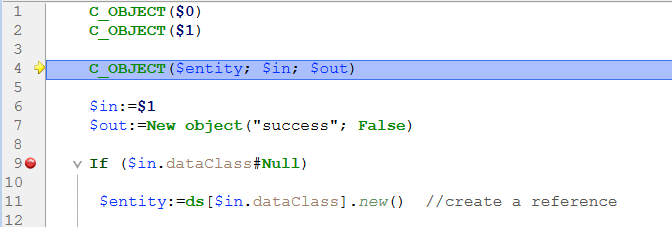

## Visão Geral

Breakpoints and command catching are very efficient debugging techniques. Ambas têm o mesmo efeito: fazem uma pausa na execução do código (e apresentam a janela do depurador, se ainda não tiver sido apresentada) num passo pretendido.

You set breakpoints on any line of code where you want the execution to be paused. É possível associar uma condição ao ponto de interrupção.

Catching a command enables you to start tracing the execution of any process as soon as a command is called by that process.

## Breakpoints

To create a break point, click in the left margin of the Source Code pane in the debugger or in the Code Editor.

In the following example, a break point (the red bullet) has been set, in the debugger, on the line `If ($in.dataClass#Null)`:

In the above example, clicking the [**No Trace**](./debugger.md/#no-trace) button resumes normal execution up to the line marked with the break point. That line is not executed itself — you are taken back to trace mode. Setting a break point beyond the program counter and clicking the **No Trace** button allows you to skip portions of the method being traced.

To remove a break point, click the corresponding bullet.

### Propriedades do ponto de interrupção

You can edit the behavior of a breakpoint using the Breakpoint Properties window:

This window is available from the Code Editor or the [Source Code Pane](debugger.md#source-code-pane). Pode:

- right-click a line and select **Edit Breakpoint** in the contextual menu, or
- `Alt+click` (Windows) or `Option+click` (macOS) in the left margin.

If a break point already exists, the window is displayed for that break point. Otherwise, a break point is created and the window is displayed for the newly created break point.

Segue-se uma descrição das propriedades:

* **Localização**: indica o nome do método e o número de linha associado ao ponto de paragem.
* **Interromper quando a expressão seguinte é true**: pode criar **pontos de interrupção condicionais** introduzindo uma fórmula 4D que devolva `True` ou `False`. Por exemplo, insira `Records in selection(\[aTable])=0` para garantir que a quebra ocorre apenas se não houver nenhum registo selecionado para a tabela \[aTable]. As condições dos pontos de paragem estão disponíveis na coluna **Condição** da [lista de interrupções](#break-list).
* **Número de vezes a saltar antes de interromper**: pode anexar um ponto de interrupção a uma linha localizada numa estrutura de ciclo (While, Repeat, ou For) ou localizada numa sub-rotina ou função chamada a partir de um ciclo.
* **O ponto de interrupção está desativado**: se não necessitar atualmente de um ponto de interrupção, mas poderá precisar dele mais tarde, pode desativá-lo temporariamente. A disabled break point appears as a dash (-) instead of a bullet (•)|

### Pontos de interrupção na depuração remota

A lista de pontos de paragem é armazenada localmente. In remote debugging mode, if the attached debugger is a remote 4D, the remote break point list replaces temporarily the server break point list during the debugging session.

The server break point list is automatically restored if it becomes again the attached debugger.

### Break List

The Break list is a page of the Runtime Explorer that lets you manage the breakpoints created in the Debugger Window or in the Code Editor. For more information on the Runtime Explorer, see its dedicated page in [the Design reference manual](https://doc.4d.com/4Dv19/4D/19/Runtime-Explorer.200-5416614.en.html).

To open the Break list page:

1. From the **Run menu**, click **Runtime Explorer...**

2. Click the **Break** tab to display the Break list:

Usando esta janela, pode:

* Definir condições para os pontos de paragem na coluna **Condições**
* Ative ou desative os pontos de interrupção clicando nos marcadores na margem. Os pontos de interrupção desactivados apresentam marcadores transparentes
* Elimine os pontos de interrupção premindo a tecla `Delete` ou `Backspace`, ou clique no botão **Delete** abaixo da lista.
* Abrir os métodos onde se encontram os pontos de interrupção fazendo duplo clique em qualquer linha da lista

Não é possível adicionar novos pontos de paragem a partir desta janela. Os pontos de paragem só podem ser criados a partir da janela do depurador ou do editor de código.

## Comandos de captura

The **Catch** tab of the Runtime Explorer lets you add additional breaks to your code by catching calls to 4D commands. Unlike a break point, which is located in a particular project method (and therefore triggers a trace exception only when it is reached), the scope of catching a command includes all the processes that execute 4D code and call that command.

Catching a command is a convenient way to trace large portions of code without setting break points at arbitrary locations. For example, if a record that should not be deleted is deleted after you've executed one or several processes, you can try to reduce the field of your investigation by catching commands such as `DELETE RECORD` and `DELETE SELECTION`. Each time these commands are called, you can check if the record in question has been deleted, and thus isolate the faulty part of the code.

Feel free to combine breakpoints and command catching.

To open the Caught Commands page:

1. Choose **Run** > **Runtime explorer...** to open the Runtime Explorer.

2. Clique em **Catch** para exibir a lista de pontos de interrupção nos comandos:

Esta página lista os comandos que devem ser capturados durante a execução. É composto por duas colunas:

* A coluna da esquerda mostra o estado de ativação/desativação do ponto de interrupção no comando, seguido pelo nome do comando
* A coluna da direita mostra a condição associada ao ponto de interrupção do comando, se houver

Para adicionar um ponto de interrupção personalizado:

1. Clique no botão **Add New Catch** (com a forma de um +) situado por baixo da lista. É adicionada uma nova entrada à lista com o comando `ALERT` por padrão
2. Clique na etiqueta **ALERT**, digite o nome do comando em que deseja definir um ponto de interrupção e pressione **Enter**.

Para ativar ou desativar um ponto de interrupção de ordem, clique no ponto (-) na frente da etiqueta do comando. A bala é transparente quando o controle é desativado.

> Desativar um ponto de interrupção no comando tem praticamente o mesmo efeito que excluí-lo. Durante a execução, o depurador quase não passa tempo na entrada. A vantagem de desativar uma entrada é que não tem de a recriar quando voltar a precisar dela.

Para remover um ponto de interrupção no comando:

1. Seleccione um comando na lista.
2. Prima **Backspace** ou **Delete** no seu teclado ou clique no botão **Delete** abaixo da lista (**Delete All** remove todos os comandos da lista).

### Definir uma condição para um ponto de interrupção no comando

1. Clique na entrada na coluna da direita
2. Introduza uma fórmula 4D (expressão, chamada comando ou método de projeto) que devolve um valor booleano.

> Para remover uma condição, elimine a sua fórmula.

A adição de condições permite-lhe parar a execução quando o comando é invocado apenas se a condição for cumprida. Por exemplo, se associar a condição `Records in selection(\[Emp]>10)` ao ponto de interrupção do comando `DELETE SELECTION`, o código não será interrompido durante a execução do comando `DELETE SELECTION` se a seleção atual da tabela \[Emp] contiver apenas 9 registos (ou menos).

A adição de condições a pontos de interrupção em comandos torna a execução mais lenta, pois a condição precisa ser avaliada toda vez que uma exceção é encontrada. Por outro lado, adicionar condições acelera o processo de depuração, porque 4D automaticamente ignora ocorrências que não correspondem às condições.

