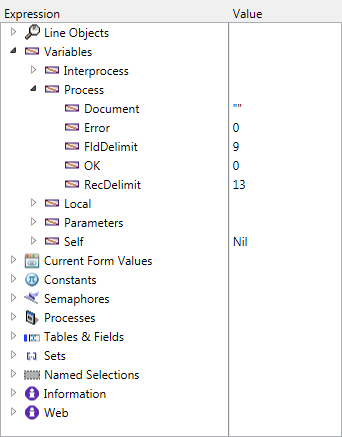
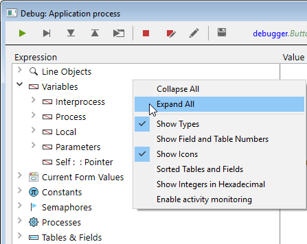
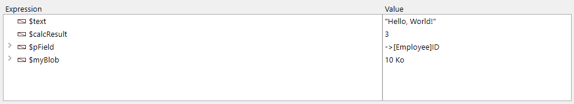

O depurador é útil quando é necessário detetar erros ou monitorizar a execução de métodos. Permite-lhe percorrer o seu código lentamente e examinar a informação. Este processo é designado por "rastreio".


## Chamando o depurador

Há várias formas de exibir o depurador:

* Clicar no botão **Trace** na [janela de erros de sintaxe](basics.md#syntax-error-window)
* Utilizando o comando [`TRACE`](https://doc.4d.com/4dv19/help/command/en/page157.html)
* Clicar no botão **Debug** na janela de execução do método ou selecionar o botão **Run and debug...** no editor de código
* Utilizando **Alt+Shift+Clique com o botão direito do rato em** (Windows) ou **Ctrl+Option+Cmd+Clique em** (macOS) enquanto um método está a ser executado e, em seguida, seleccione o processo a rastrear no menu instantâneo:


* Clicando no botão **Trace** quando um processo é selecionado na página Processo do Explorador de execução.
* Adicionar um ponto de interrupção na janela do Editor de código ou nas páginas Break e Catch do Explorador de execução.

Quando chamada, a janela do depurador fornece o nome do método ou da função de classe que rastreia atualmente e a ação que causa o aparecimento inicial da janela do depurador. Por exemplo, na janela do depurador acima:

* *Clients_BuildLogo* é o método que é rastreado
* A janela do depurador apareceu porque detectou uma chamada para o comando `C_PICTURE` e este comando era um dos comandos a serem identificados

A exibição de uma nova janela do depurador utiliza a mesma configuração que a última janela exibida na mesma sessão. Se executar vários processos usuário, pode rastreá-los de forma independente e ter uma janela do depurador aberta para cada processo.

A janela do depurador é normalmente apresentada na máquina onde o código é executado. Com uma aplicação monousuário, é sempre apresentado na máquina que executa a aplicação. Com uma aplicação cliente/servidor, é apresentado:

* no 4D remoto para o código que está a ser executado localmente
* na máquina do servidor para o código em execução no servidor (por exemplo, um método com a opção **executar no servidor**).

> Se o servidor estiver a funcionar sem interface, não pode ser apresentada qualquer janela do depurador no servidor, pelo ser necessário utilizar o depurador remoto. Consulte [Depuração a partir de máquinas remotas](./debugging-remote.md).

## Botões da barra de ferramentas

A barra de ferramentas do depurador inclui vários botões, associados a atalhos predefinidos:


> Os atalhos padrão podem ser personalizados na página Atalhos da caixa de diálogo Preferências.

#### No Trace

Tracing stops and normal method execution resumes.

> **Shift** + **F5** or **Shift** + clicking the **No Trace** button resumes execution. It also disables all the subsequent TRACE calls for the current process.

#### Passar por cima

Executes the current method line, indicated by the program counter (the yellow arrow). O depurador passa para a linha seguinte.

The Step Over button does not step into subroutines and functions, it stays at the level of the method you're currently tracing. If you want to also trace subroutines and functions calls, use the **Step Into** button.

In remote debugging, if the method executes on the server, the parent method is called after the last line of the child method executes. If the parent method is executed on the remote side, the **Step Over** button has the same effect as the **No Trace** button.

#### Passo a passo

When a line that calls another method (subroutine or function) is executed, click this button to display the the other method and step through it.

The new method becomes the current (top) method in the [Call Chain Pane](#call-chain-pane) of the Debugger window.

When executing a line that does not call another method, this button has the same effect as the **Step Over** button.

#### Abortar

Stops method execution, and returns to the state before the method started executing:

* When tracing a form or object method executing in response to an event: Stops and returns to the form.
* When tracing a method executing from within the Application environment: Stops and returns to the environment.

#### Abortar e editar

Pausa na execução do método. The method that is executing when you click the **Abort and Edit** button opens in the Code Editor.
> **Tip**: Use this button when you know which changes are required in your code, and when these changes are required to pursue the testing of your methods. After you're finished with the changes, rerun the method.

#### Editar

Pausa na execução do método. The method that is executing at the time you click the Edit button opens in the Code Editor.

If you use this button to modify a method, the modifications are only effective the next time it executes.

> **Dica:** Utilize este botão quando sabe quais as alterações necessárias no seu código e quando estas não interferem com o resto do código a ser executado ou rastreado.

#### Botão Salvar parâmetros

Salva a configuração atual da janela do depurador e a torna a configuração padrão. Isto inclui:

* o tamanho e a posição da janela
* a posição das linhas de divisão e o conteúdo da área que avalia as expressões

Estes parâmetros são armazenados no projeto.

Esta ação não está disponível no modo de depuração remota (consulte [Depuração a partir de máquinas remotas](./debugging-remote)).

## Janela de expressão

A **janela de expressão** é apresentado no canto superior esquerdo da janela do depurador, por baixo da barra de ferramentas de controlo da execução. Aqui um exemplo simples:



> Este painel não está disponível no modo de depuração remota.

A **janela de expressão** exibe informações gerais úteis sobre o sistema, o ambiente 4D e o ambiente de execução.

The **Expression** column displays the names of the objects and expressions. The **Value** column displays their current corresponding values. Clicking on any value on the right side of the pane allows you to modify the value of the object, if this is permitted for that object.

At any point, you can drag and drop themes, theme sublists (if any), and theme items to the [Custom Watch Pane](#custom-watch-pane).

### Lista de expressões

#### Line Objects

This theme lets you keep track of the values of the objects or expressions:

* used in the line of code to be executed (the one marked with the program counter—the yellow arrow in the [Source Code Pane](#source-code-pane)),
* utilizado na linha de código anterior

Since the previous line of code is the one that was just executed before, this theme therefore shows the objects or expressions of the current line before and after that the line was executed.  Digamos que executa o seguinte método:

```4d
TRACE
$a:=1
$b:=a+1
$c:=a+b
```

1. A Debugger window opens with the program counter set to the line with `a:=1`. At this point the **Line Objects** theme displays:

    | $a | Indefinido |
    | -- | ---------- |
    |    |            |

    A variável `$a` ainda não está inicializada, mas é exibida porque é usada na linha a ser executada.

2. You click the **Step Over** button. The program counter is now set to the line `b:=a+1`. Nesta altura, o tema mostra:

    | $a | 1          |
    | -- | ---------- |
    | $b | Indefinido |

    O valor da variável `$a` é agora 1. The `$b` variable is not yet initialized, but it is displayed because it is used in the line to be executed.

3. You click the **Step Over** button again. The program counter is now set on the line with c:=a+b. At this point the Line Objects theme displays:

    | $c | Indefinido |
    | -- | ---------- |
    | $a | 1          |
    | $b | 2          |

    O valor da variável `$b` é agora 2. The `$c` variable is not yet initialized, but it is displayed because it is used in the line to be executed.

#### Variáveis.

This theme is composed of the following subthemes:

| Subtema       | Descrição                                                    | Os valores podem ser modificados? |
| ------------- | ------------------------------------------------------------ | --------------------------------- |
| Interprocesso | List of interprocess variables being used at this point      | Sim                               |
| Processo      | List of process variables used by the current process        | Sim                               |
| Local         | List of local variables used by the method being traced      | Sim                               |
| Parâmetros    | Lista dos parâmetros recebidos pelo método                   | Sim                               |
| Self          | Pointer to the current object, when tracing an Object Method | Não                               |

Arrays, like other variables, appear in the Interprocess, Process, and Local subthemes, depending on their scope. O depurador apresenta os primeiros 100 elementos. Inside the **Value** column, you can modify the values of array elements, but not the size of the arrays.

Para apresentar os tipos de variáveis e os seus nomes internos, clique com o botão direito do rato e selecione a opção **Mostrar tipos** no menu de contexto:


Aqui está o resultado:


#### Current Form Values

Este tema contém o nome de cada objeto dinâmico incluído no formulário atual, bem como o valor da sua variável associada:


Alguns objetos, como os arrays list box, podem ser apresentados como dois objetos distintos, a variável do próprio objeto e a sua fonte de dados.

#### Constantes

Como a página Constantes da janela Explorer, esse tema exibe as constantes predefinidas oferecidas pelo 4D. As expressões deste tema não podem ser modificadas.

#### Semáforos

Este tema lista os semáforos locais definidos atualmente. Para cada semáforo, a coluna Valor fornece o nome do processo que define o semáforo. As expressões deste tema não podem ser modificadas. The expressions from this theme cannot be modified.

#### Processos

Este tema enumera os processos iniciados desde o início da sessão de trabalho. A coluna do valor apresenta o tempo utilizado e o estado atual de cada processo (ou seja, Executando, pausado, etc.). As expressões deste tema não podem ser modificadas.

#### Tabela

Este tema lista as tabelas e campos na base de dados 4D. Para cada item da tabela, a coluna Valor apresenta o tamanho da seleção atual para o processo atual, bem como o número de **registos bloqueados**.

Para cada item Campo, a coluna Valor apresenta o valor do campo para o registo atual (exceto imagem e BLOB). Pode modificar os valores dos campos, mas não as informações das tabelas.

#### Conjuntos

Este tema lista os conjuntos definidos no processo atual (aquele que está sendo rastreado) e os conjuntos interprocessos. Para cada conjunto, a coluna Valor apresenta o número de registos e o nome da tabela. As expressões deste tema não podem ser modificadas.

#### Seleções temporárias

This theme lists the named selections that are defined in the current process (the one you’re currently tracing); it also lists the interprocess named selections. For each named selection, the Value column displays the number of records and the table name. As expressões deste tema não podem ser modificadas.

#### Informação

This theme contains general information regarding database operation, such as the current default table (if one exists), physical, virtual, free and used memory space, query destination, etc.

#### Web

This theme displays information regarding the main Web server of the application (only available if the Web server is active):

* Web File To Send: name of Web file waiting to be sent (if any)
* Web Cache Usage: number of pages present in Web cache as well as its use percentage
* Web Server Elapsed Time: duration of Web server use in hours:minutes:seconds format
* Web Hits Count: total number of HTTP requests received since Web server launch, as well as the instantaneous number of requests per second
* Number of active Web processes: number of active Web processes, all Web processes together

The expressions contained within this theme cannot be modified.

### Menu contextual

Additional options are available from the contextual menu of the Watch pane.



* **Recolher tudo**: Recolhe todos os níveis da lista hierárquica.
* **Expandir tudo**: Expandir todos os níveis da lista hierárquica.
* **Mostrar tipos**: Apresenta o tipo de cada item (quando apropriado).
* **Mostrar os números dos campos e das tabelas**: Apresenta o número de cada tabela ou campo. Útil se trabalhar com números de tabelas ou de campos, ou com apontadores utilizando comandos como `Table` ou `Field`.
* **Mostrar ícones**: Cada objeto é precedido por um ícone que indica seu tipo. Pode desativar esta opção para acelerar a visualização, ou simplesmente porque prefere utilizar apenas a opção **Mostrar os tipos**.
* **Tabelas e campos ordenados**: Ordena as tabelas e os campos por ordem alfabética nas respectivas listas.
* **Mostrar números inteiros em hexadecimal**: Os números são normalmente apresentados em notação decimal. Esta opção apresenta-os em notação hexadecimal. Note: To enter a numeric value in hexadecimal, type 0x (zero + "x"), followed by the hexadecimal digits.
* **Enable activity monitoring**: Activates the monitoring of activity (advanced checking of internal activity of the application) and displays the information retrieved in the additional themes: **Scheduler**, **Web** and **Network**.

## Painel da cadeia de chamadas

A method may call other methods or class functions, which may call other methods or functions. The Call Chain pane lets you keep track of that hierarchy.


Each main level item is the name of a method or class function. The top item is the one you are currently tracing, the next main level item is the name of the caller (the method or function that called the one you are currently tracing), the next one is the caller's caller, and so on.

Na imagem acima:

* `thirdMethod` não recebeu nenhum parâmetro
* `$0` is currently undefined, as the method did not assign any value to `$0` (because it has not executed this assignment yet or because the method is a subroutine and not a function)
* `secondMethod` has received three parameters from `firstMethod`:
  * $1 é um ponteiro para a tabela `[Employee]`
  * $2 is a pointer to the `ID` field in the  `[Employee]` table
  * $3 é um parâmetro alfanumérico cujo valor é "Z"

Você pode clicar duas vezes no nome de qualquer método para exibir seu conteúdo no [painel código fonte](#source-code-pane).

Clicar no ícone junto ao nome de um método ou função expande, ou recolhe os parâmetros e o resultado (se existir). Os valores aparecem no lado direito do painel. Clicar em qualquer valor do lado direito permite-lhe alterar o valor de qualquer parâmetro ou resultado de função.

Para visualizar o tipo de parâmetro, seleccione a opção **Mostrar tipos** no menu contextual:


After you deploy the list of parameters, you can drag and drop parameters and function results to the [Custom Watch Pane](#custom-watch-pane).

Também pode utilizar o comando [Get call chain](https://doc.4d.com/4dv19/help/command/en/page1662.html) para obter a cadeia de chamadas por programação.

## Custom Watch Pane

The Custom Watch Pane is useful for evaluating expressions. It is similar to the [Watch Pane](#watch-pane), except here you decide which expressions are displayed. Qualquer tipo de expressão pode ser avaliado:

* campo
* variável
* pointer
* cálculo
* Comando 4D
* method
* e qualquer outra coisa que devolva um valor



You can evaluate any expression that can be shown in text form. This does not cover picture and BLOB fields or variables. To display BLOB contents, you can use BLOB commands, such as [BLOB to text](https://doc.4d.com/4dv19/help/command/en/page555.html).

### Handling expressions

Existem várias formas de adicionar expressões à lista:

* Drag and drop an object or expression from the Watch Pane or the Call Chain Pane
* Select an expression in the [Source Code pane](#source-code-pane) and press **ctrl+D**  (Windows) or **cmd+D** (macOS)
* Double-click somewhere in the empty space of the Custom Watch Pane (adds an expression with a placeholder name that you can edit)

Pode introduzir qualquer fórmula que devolva um resultado.

To edit an expression, click on it to select it, then click again or press **Enter** on your keyboard.

To delete an expression, click on it to select it, then press **Backspace** or **Delete** on your keyboard.
> **Aviso:** Tenha cuidado quando avalia uma expressão 4D que modifica o valor de uma das variáveis de sistema (por exemplo, a variável OK) porque a execução do resto do método pode ser alterada.

### Menu contextual

The Custom Watch Pane’s context menu gives you access the 4D formula editor and other options:


**New Expression**: This inserts a new expression and displays the 4D Formula Editor.


For more information on the Formula Editor, see the <a href="https://doc.4d.com/4Dv19/4D/19/4D-Design-Reference.100-5416591.en.html" target="_blank">4D Design Reference manual.</a>

* **Insert Command**: Shortcut for inserting a 4D command as a new expression.
* **Delete All**: Removes all expressions from the Custom Watch Pane.
* **Standard Expressions**: Copies the Watch Pane's list of expressions.

> This option is not available in remote debugging mode (see [Debugging from Remote Machines](https://doc.4d.com/4Dv19/4D/19/Debugging-from-Remote-Machines.300-5422483.en.html)).

* **Collapse All/Expand All**: Collapses or Expands all the hierarchical lists.
* **Show Types**: Displays the type of each item in the list (when appropriate).
* **Show Field and Table Numbers**: Displays the number of each table or field of the **Fields**. Useful if you work with tables, field numbers or pointers using the commands such as `Table` or `Field`.
* **Show Icons**: Displays an icon denoting the type of each item.
* **Tabelas e campos ordenados**: Apresenta a tabela e os campos por ordem alfabética.
* **Show Integers in Hexadecimal**: Displays numbers using hexadecimal notation. Para introduzir um valor numérico em hexadecimal, digite 0x (zero + "x"), seguido dos dígitos hexadecimais.

## Panel de código fuente

The Source Code Pane shows the source code of the method or function currently being traced.

This area also allows you to add or remove [**break points**](breakpoints.md).

### Tips

Hover your pointer over any expression to display a tool tip that indicates:

* o tipo declarado da expressão
* o valor atual da expressão


Isto também funciona com as selecções:


### Adição de expressões ao painel de controle personalizado

You can copy any selected expression from the Source Code Pane to the [Custom Watch Pane](#custom-watch-pane).

1. In the Source code pane, select the expression to evaluate
2. Faça uma das seguintes opções:
    * Drag and drop the selected text to the Expression area of the Custom Watch Pane
    * Press **Ctrl+D** (Windows) or **Cmd+D** (macOS)
    * Right-click the selected text **>** **Copy to Expression Pane**

### Contador do programa

The yellow arrow in the left margin of the Source Code pane is called the program counter. Marca a linha seguinte a ser executada.

Por padrão, a linha do contador de programas (também designada por linha de execução) é realçada no depurador. Pode personalizar a cor de realce na página [Métodos das Preferências](Preferences/methods.md).

#### Movendo o contador do programa

Para efeitos de depuração, é possível deslocar o contador de programa para o método no topo da cadeia de chamadas (o método atualmente em execução). Para o fazer, clique e arraste a seta amarela para outra linha.

Isto apenas diz ao depurador para prosseguir o rastreio ou a execução a partir de um ponto diferente. Não executa linhas nem anula a sua execução. All current settings, fields, variables, etc. are not impacted.

Por exemplo:

```4d
  // ...
 If(This condition)
    DO_SOMETHING
 Else
    DO_SOMETHING_ELSE
 End if
  // ...
```

Say the program counter is set to the line `If (This condition)`. When you click the **Step over** button, the program counter moves directly to the `DO_SOMETHING_ELSE` line. To examine the results of the `DO_SOMETHING` line, you can move the program counter to that line and execute it.

### Menu contextual

The contextual menu of the Source Code Pane provides access to several functions that are useful when executing methods in Trace mode:


* **Goto Definition**: Goes to where the selected object is defined. Este comando está disponível para:
  * *Project methods:* displays method contents in a new window of the Code Editor
  * *Fields:* Displays field properties in the inspector of the Structure window
  * *Tables:* Displays table properties in the inspector of the Structure window
  * *Forms:* Displays form in the Form editor
  * *Variables* (local, process, interprocess or $n parameter): displays the line in the current method or among the compiler methods where the variable is declared
* **Search References** (also available in Code Editor): Searches all project objects (methods and forms) in which the current element of the method is referenced. The current element is the one selected or the one where the cursor is located. Pode ser o nome de um campo, variável, comando, cadeia de caracteres, etc. Os resultados da pesquisa são apresentados numa nova janela de resultados padrão.
* **Copiar**: cópia padrão da expressão selecionada no contêiner de dados.
* **Copiar para a janela de expressão**: copia a expressão selecionada para a janela de avaliação.
* **Execute to cursor**:Executa as instruções entre o contador de programas e a linha selecionada do método (onde está o cursor).
* **Set Next Statement**:Moves program counter to the selected line without executing this line or any intermediate ones. The designated line is only run if the user clicks on one of the execution buttons.
* **Toggle Breakpoint** (also available in Code Editor): Alternately inserts or removes the breakpoint corresponding to the selected line. This modifies the breakpoint permanently: for instance, if you remove a breakpoint in the debugger, it no longer appears in the original method.
* **Edit Breakpoint** (also available in Code Editor): Displays the Breakpoint Properties dialog box. Any changes made modify the breakpoint permanently.

### Localizar seguinte/anterior

Os atalhos específicos permitem-lhe encontrar cadeias de caracteres idênticas à que foi selecionada:

* Para procurar as cadeias de caracteres idênticas seguintes, prima **Ctrl+E** (Windows) ou **Cmd+E** (macOS)
* Para procurar as cadeias de caracteres idênticas anteriores, prima **Ctrl+Shift+E** (Windows) ou **Cmd+Shift+E** (macOS)

The search is carried out only if you select at least one character in the Source code pane.

## Atalhos

Esta secção lista todos os atalhos disponíveis na janela do depurador.

> A barra de ferramentas também tem [atalhos](#tool-bar-buttons).

#### Janela de avaliação e subjanela de avaliação

* Um **clique duas vezes** em um elemento na janela de expressão para copiá-lo para a janela de avaliação
* Um **clique duplo** na subjanela de avaliação cria uma nova expressão

#### Panel de código fuente

* Clique na margem esquerda para definir ou remover pontos de quebra.
* **Alt+Shift+Clique** (Windows) ou **Option+Shift+Clique** (macOS) define um ponto de interrupção temporário.
* **Alt-Click** (Windows) ou **Option-Click** apresenta a janela Editar quebra para um ponto de quebra novo ou existente.
* Uma expressão ou objeto selecionado pode ser copiado para a janela de avaliação personalizada através de um simples arrastar e largar.
* As combinações de teclas **Ctrl+D** (Windows) ou **Cmd+D** (macOS) copiam o texto selecionado na janela de avaliação personalizado.
* As combinações de teclas ** Ctrl+E** (Windows) ou **Cmd+E** (macOS) localizam as cadeias de caracteres seguintes idênticas à que foi selecionada.
* As combinações de teclas **Ctrl+Shift+E** (Windows) ou **Cmd+Shift+E** (macOS) localizam as cadeias de caracteres anteriores idênticas à selecionada.

#### Todas as janelas

* **Ctrl** + **+/-** (Windows) ou **Comando** + **+/-** (macOS) aumenta ou diminui o tamanho do tipo de letra para uma melhor legibilidade. O tamanho de letra modificado também é aplicado ao Editor de código sendo guardado nas Preferências.
* **Ctrl + \*** (Windows) ou **Comando + \*** (macOS) força a atualização da janela de expressão.
* Quando nenhum objeto estiver selecionado nas janelas, pressionar **Enter** o fará avançar uma linha.
* Quando um valor de item é selecionado, utilize as teclas de setas para navegar na lista.
* Ao editar um item, utilize as teclas de seta para mover o cursor. Utilize Ctrl-A/X/C/V (Windows) ou Comandó-A/X/C/V (macOS) como atalhos para os comandos de menu Selecionar tudo/Cortar/Copiar/Colar do menu Editar.
