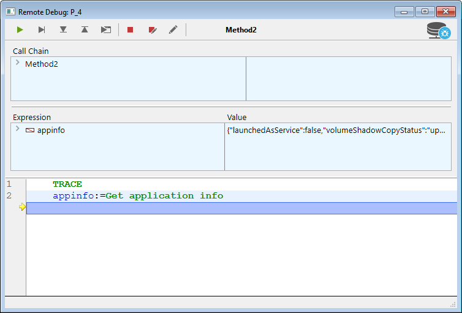

## Visão Geral

Quando um banco de dados 4D está sendo executado no 4D Server em modo interpretado, é possível depurar o código 4D em execução no servidor a partir de um cliente 4D remoto conectado ao projeto. Basta associar o depurador a uma máquina remota específica, e a execução do código pode ser monitorada no depurador diretamente na máquina remota.

Numa máquina remota, a [janela do depurador](debugger.md) apresenta um ícone de servidor específico e uma cor de fundo azul para indicar que depura código de servidor:

Essa funcionalidade é particularmente útil quando o 4D Server está sendo executado no modo headless (consulte [Interface de linha de comando](../Admin/cli.md)), ou quando o acesso à máquina do servidor não é fácil.

## Depurador anexado

Apenas um depurador pode depurar uma aplicação 4D Server num determinado momento. Chama-se ao **depurador anexado**. O depurador ligado pode ser:

* o depurador local do Servidor 4D (padrão) - se o servidor não estiver sendo executado sem interface.
* o depurador de um cliente 4D remoto - se a sessão remota tiver acesso ao modo Desenho.

O depurador anexado é chamado sempre que um 4D Server se encontra:
* um ponto de ruptura
* um comando `TRACE`
* a caught command
* um erro

Tenga en cuenta que los mensajes de error se envían a la máquina depuradora asociada. Isso significa que, no caso de um depurador remoto, as mensagens de erro do servidor são exibidas no cliente 4D remoto.

Note que:
* O código executado no método `On Server Startup Database` não pode ser depurado remotamente. Só pode ser depurado no lado do servidor
* Se não estiver ligado um depurador, o código em execução não é interrompido pelos comandos de depuração

## Ligar o depurador

Por defeito, quando se inicia uma aplicação interpretada:

* se o 4D Server não estiver funcionando sem interface, o depurador está associado ao servidor,
* se 4D Server funciona sem interface, nenhum depurador está ligado.

You can attach the debugger to any remote 4D client allowed to connect to the 4D Server application.

> The remote 4D client's user session must have access to the Design environment of the database.

Para anexar o depurador a um cliente 4D remoto:

1. In the 4D Server menu bar, select **Edit** > **Detach Debugger** so that the debugger becomes available to remote machines (this step is useless if the 4D Server is running headless).
2. In a remote 4D client connected to the server, select **Run** > **Attach Remote Debugger**

If the attachment is accepted (see [Rejected attachment requests](#rejected-attachment-requests)), the menu command becomes **Detach Remote Debugger**.

The debugger is then attached to the remote 4D client:
* até ao fim da sessão do usuário
* until you select `Detach Remote Debugger`

Para ligar o depurador de novo ao servidor:

1. On the remote 4D client that has the debugger attached, select **Run** > **Detach Remote Debugger**.
2. In the 4D Server menu bar, select **Edit** > **Attach debugger**.

> When the debugger is attached to the server (default), all server processes are automatically executed in cooperative mode to enable debugging. This can have a significant impact on performance. When you don't need to debug on the server machine, it is recommended to detach the debugger and attach it to a remote machine if necessary.

## Ligar o depurador no arranque

4D allows you to automatically attach the debugger to a remote 4D client or the server at startup:

* On the server (if not headless), this option is named **Attach Debugger At Startup**. When the server is started, it automatically attaches the debugger (default).

> **Warning**: If this option is selected for a server which is subsequently launched in headless mode, the debugger won't be available for this server.

* On a remote 4D client, this option is named **Attach Remote Debugger At Startup**. When selected, the remote 4D client will automatically try to attach the remote debugger at each subsequent connection to the same 4D Server database. If the attachment is accepted (see [Rejected attachment requests](#rejected-attachment-requests)), the remote debugger is automatically attached to the remote 4D client and the **Detach Remote Debugger option is displayed**.

> This setting is applied per project and is stored locally in the [`.4DPreferences`](Project/architecture.md#userpreferencesusername) file.

## Pedidos de ligação rejeitados

While the debugger is already attached to a remote 4D client or to 4D Server, no other machine can attach the debugger.

Se uma máquina tentar anexar o depurador enquanto este já estiver anexado, a anexação é rejeitada e aparece uma caixa de diálogo:

A ligação do depurador neste caso exige que:

* the attached debugger is detached from the server or from the remote 4D client using respectively the **Detach debugger** or **Detach remote debugger** menu command,
* a sessão do cliente remoto 4D anexado é encerrada.
