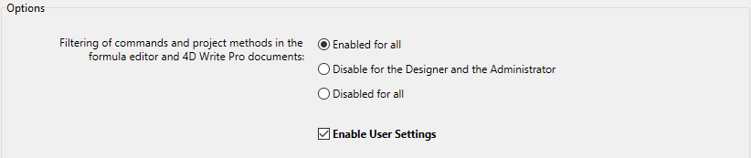

4D provides two modes of operation for project Settings:

*   **Standard** mode: all [settings](../settings/overview.md) are stored in the [*settings.4DSettings* file at the project level](../Project/architecture.md#sources) and are applied in all cases. This is the default mode, suitable for development phase (all applications).

*  **User settings** mode: part of the custom settings are stored in a *settings.4DSettings* file [in the Settings folder](../Project/architecture.md#settings-user) (for all data files) or [in the Data folder](../Project/architecture.md#settings-user-data) (for this data file) and are used instead of the structure settings. This mode is suitable for deployment phase for Desktop applications. You enable this mode using an option located on the [Security page](../settings/security.md) of the Settings.

By defining user settings, you can keep custom settings between updates of your 4D applications, or manage different settings for the same 4D application deployed on several different sites. It also makes it possible to use programming to manage setting files using XML.

4D can generate and use two types of user settings:

-   **User Settings**: They are used instead of structure settings for any data file opened with the application.
-   **User Settings for Data file**: They can be defined specifically for each data file used with your application, configuring for example the port ID or the server cache.

With this option, you can easily deploy and update several copies of the same desktop application with several data files, each containing different settings.

Consider for example the following configuration, where an application is duplicated and each copy uses a different Port ID setting. If this user setting is linked to the data file, you will be able to update the application without having to manually change the Port ID:

## Enabling User settings

To enable user settings, you need to check the **Settings** > **Security** > **Enable User Settings** option:

When you check this option, the settings are separated into three dialog boxes:

* **Structure Settings**
* **Propriedades usuário**
* **Propriedades usuário para o arquivo de dados**

You can access these dialog boxes using the **Design > Settings...** menu or the **Settings** button in the toolbar:

You can also access these dialog boxes using the [OPEN SETTINGS WINDOW](https://doc.4d.com/4dv19R/help/command/en/page903.html) command with the appropriate *settingsType* selector.

The Structure Settings dialog box is identical to the standard Settings, and provides access to all its properties (which can be overriden by user settings).

## Propriedades usuário e definições do usuário para o ficheiro de dados

The **User Settings** and **User Settings for Data File** dialog boxes contain a selection of relevant properties that can be defined for all data files or a single data file:

The following table lists the pages of settings found in the **User Settings** and **User Settings for Data File** dialog boxes and describes their main differences with respect to standard settings:

| **Page of Structure Settings**                                                           | **Page of User Settings**                    | **Página de Propriedades usuário para ficheiro de dados** |
| ---------------------------------------------------------------------------------------- | -------------------------------------------- | --------------------------------------------------------- |
| [Página geral](../settings/general.md)                                                   | N/a                                          | N/a                                                       |
| [Página Interface](../settings/interface.md)                                             | Idêntico às propriedades padrão              | Idêntico às propriedades padrão                           |
| [Página Compilador](../settings/compiler.md)                                             | N/a                                          | N/a                                                       |
| [Página Base de dados/armazenamento de dados](../settings/database.md#data-storage)      | N/a                                          | N/a                                                       |
| [Página Base de dados/Memória](../settings/database.md#memory)                           | Idêntico às propriedades padrão              | Idêntico às propriedades padrão                           |
| [Página Backup/Peridiocidade](../settings/backup.md#scheduler)                           | N/a                                          | Idêntico às propriedades padrão                           |
| [Página Backup/Configuração](../settings/backup.md#configuration)                        | N/a                                          | Idêntico às propriedades padrão                           |
| [Página Backup/Backup e restaurar](../settings/backup.md#backup-restore)                 | N/a                                          | Idêntico às propriedades padrão                           |
| [Página cliente-servidor/opções rede](../settings/client-server.md#network-options)      | Idêntico às propriedades padrão              | Idêntico às propriedades padrão                           |
| [Página cliente-servidor/Configuração IP](../settings/client-server.md#ip-configuration) | Idêntico às propriedades padrão              | Idêntico às propriedades padrão                           |
| [Página Web/Configuração](../settings/web.md#configuration)                              | Idêntico às propriedades padrão              | Idêntico às propriedades padrão                           |
| [Página Web/Opções (I)](../settings/web.md#options)                                      | Idêntico às propriedades padrão              | Idêntico às propriedades padrão                           |
| [Página Web/Opções (II)](../settings/web.md#options-ii)                                  | Idêntico às propriedades padrão              | Idêntico às propriedades padrão                           |
| [Página Web/Log (tipo)](../settings/web.md#log)                                          | Idêntico às propriedades padrão              | Idêntico às propriedades padrão                           |
| [Página Web/Log (backup)](../settings/web.md#log)                                        | Idêntico às propriedades padrão              | Idêntico às propriedades padrão                           |
| [Página Web/Web services](../settings/web.md#web-services)                               | Opção de prefixação do método não disponível | Opção de prefixação do método não disponível              |
| [Página SQL](../settings/sql.md)                                                         | Idêntico às propriedades padrão              | Idêntico às propriedades padrão                           |
| [Página PHP](../settings/php.md)                                                         | Idêntico às propriedades padrão              | Idêntico às propriedades padrão                           |
| [Página segurança](../settings/security.md)                                              | N/a                                          | N/a                                                       |
| [Página de compatibilidade](../settings/compatibility.md)                                | N/a                                          | N/a                                                       |

When you edit settings in this dialog box, they are automatically stored in the corresponding *settings.4DSettings* file (see below).

## `SET PARAMETER DE LA BASE DE DATOS` e propriedades usuário

Some of the user settings are also available through the [SET DATABASE PARAMETER](https://doc.4d.com/4dv19R/help/command/en/page642.html) command. User settings are parameters with the **Kept between two sessions** property set to **Yes**.

When the **User Settings** feature is enabled, user settings edited by the [SET DATABASE PARAMETER](https://doc.4d.com/4dv19R/help/command/en/page642.html) command are automatically saved in the user settings for the data file.

> `Table sequence number` is an exception; this setting value is always saved in the data file itself.

## Ficheiros settings.4DSettings

When you [check the **Enable User Settings** option](#enabling-user-settings), user settings files are automatically created. Their location depends on the type of user settings defined.

### Propriedades usuário

The standard user settings file is automatically created and placed in a settings folder at the following location:

[`ProjectFolder/Settings/settings.4DSettings`](../Project/architecture.md#settings-user)

... where *ProjectFolder* is the name of the folder containing the project structure file.

In merged applications, the user settings file is placed at the following location:

* In single-user versions: ProjectFolder/Database/Settings/settings.4DSettings
* In client/server versions: ProjectFolder/Server Database/Settings/settings.4DSettings

### Propriedades usuário para arquivo de dados

The user settings file linked to the data file is automatically created and placed in a settings folder at the following location:

[`Data/Settings/settings.4DSettings`](../Project/architecture.md#settings-user-data)

... where *Data* is the name of the folder containing the current data file of the application.

> When the data file is located at the same level as the project structure file, structure-based and data-based user settings files share the same location and file. The **User Settings for Data File...** menu command is not proposed.

:::note

Settings files are XML files; they can be read and modified using integrated 4D XML commands or using an XML editor. This means that you can manage settings by programming, particularly in the context of applications compiled and merged with 4D Volume Desktop. When you modify this file by programming, the changes are only taken into account the next time the database is opened.

:::

## Priority of settings

As definições podem ser guardadas em três níveis. Each setting defined at one level overrides the same setting defined at a previous level, if any:

| **Nível de prioridade** | **Nome**                                                                  | **Localização**                                                                                                                                               | **Comentários**                                                                                                                        |
| ----------------------- | ------------------------------------------------------------------------- | ------------------------------------------------------------------------------------------------------------------------------------------------------------- | -------------------------------------------------------------------------------------------------------------------------------------- |
| 3 (mais baixo)          | Structure settings (or Settings when "User settings" feature not enabled) | ***settings.4DSettings*** file in the Sources folder (project databases) or in the Settings folder as the same level as the structure file (binary databases) | Unique location when user settings are not enabled. Applied to all copies of the application.                                          |
| 2                       | Propriedades usuário (todos os ficheiros de dados)                        | ***settings.4DSettings*** file in the Settings folder at the same level as the Project folder                                                                 | Substitui as definições da estrutura. Armazenado no pacote da aplicação.                                                               |
| 1 (mais alto)           | Propriedades usuário (ficheiro de dados atual)                            | ***settings.4DSettings*** file in the Settings folder at the same level as the data file                                                                      | Substitui as propriedades de estrutura e as propriedades usuário. Applied only when the linked data file is used with the application. |

Keep in mind that user settings files only contain a subset of relevant settings, while the structure file contains all custom settings, including core settings.
