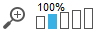
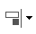
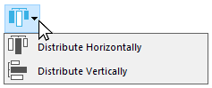
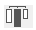
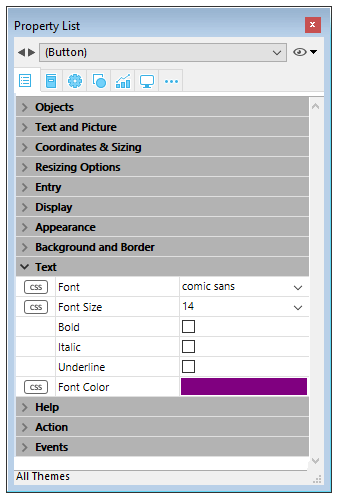
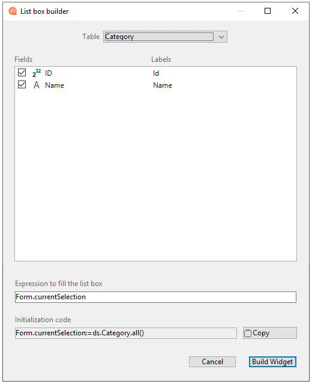
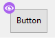
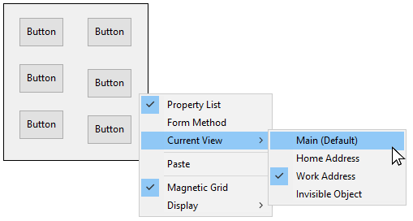
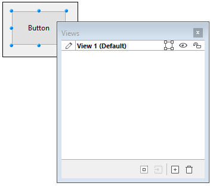

4D fornece um editor de formulários completo que permite modificar seu formulário até conseguir o efeito que deseja. Com o editor de formulários, é possível criar e eliminar objetos, manipulá-los diretamente e definir as propriedades de objetos e formulários.

## Interface

O editor de formulários apresenta cada formulário JSON na sua própria janela, que tem uma barra de ferramentas e de uma barra de objetos. É possível ter vários formulários abertos ao mesmo tempo.

### Opções de visualização

You can show or hide several interface elements on the current page of the form:

- **Inherited Form**: Inherited form objects (if there is an [inherited form](forms.md#inherited-forms)).
- **Page 0**: Objects from [page 0](forms.md#form-pages). This option allows you to distinguish between the objects on the form’s current page and those on page 0.
- **Paper**: Borders of the printing page, which are shown as gray lines. This element can only be displayed by default in ["for printing" type](properties_FormProperties.md#form-type) forms.
- **Rulers**: Rulers of the Form editor’s window.
- **Markers**: Output control lines and associated markers that show the limits of the form’s different areas. This element can only be displayed by default in [list forms](properties_FormProperties.md#form-type).
- **Marker Labels**: Marker labels, available only when the output control lines are displayed. This element can only be displayed by default in [list forms](properties_FormProperties.md#form-type).
- **Limites**: Limites do formulário. When this option is selected, the form is displayed in the Form editor as it appears in Application mode. This way you can adjust your form without having to switch to the Application mode in order to see the result.

> > The [**Size Based on**](properties_FormSize.md#size-based-on), [**Hor margin**](properties_FormSize.md#hor-margin) and [**Vert margin**](properties_FormSize.md#vert-margin) settings of the form properties affect the form’s limits. When using these settings, the limits are based on the objects in the form. When you modify the size of an object that is located next to the form’s border, it is modified to reflect that change.

#### Visualização por defeito

When a form is opened in the editor, interface elements are displayed or hidden by default, depending on:

- the **New form default display** options set in the Preferences - unchecked options cannot be displayed by default.
- the current [form type](properties_FormProperties.md#form-type):
  - Markers and marker labels are always displayed by default on list forms
  - Paper is displayed by default on "for printing" forms.

#### Exibir/ocultar elementos

You can display or hide elements at any moment in the Form editor’s current window by selecting **Display** from the **Form** menu or the Form editor's context menu:


### Regras

The rulers on the side and bottom help you position objects in the form. They can be [displayed or hidden](#display-options).

Select **Ruler definition...** from the **Form** menu to change measurement units so that the form displays inches, centimeters, or pixels.

### Barra de ferramentas

The toolbar of the Form editor offers a set of tools to manipulate and modify the form. Cada janela tem a sua própria barra de ferramentas.


A barra de ferramentas contém os seguintes elementos:

| Ícone                                            | Nome                                                      | Descrição                                                                                                                                                                                                                                                                                                                                                                       |
| ------------------------------------------------ | --------------------------------------------------------- | ------------------------------------------------------------------------------------------------------------------------------------------------------------------------------------------------------------------------------------------------------------------------------------------------------------------------------------------------------------------------------- |
|          | Executar o formulário                                     | Utilizado para testar a execução do formulário. When you click on this button, 4D opens a new window and displays the form in its context (list of records for a list form and current record page for a detail form). O formulário é executado no processo principal.                                                                                                          |
|        | [Ferramenta de selecção](#selecting-objects)              | Allows selecting, moving and resizing form objects.<p>Allows selecting, moving and resizing form objects.<strong x-id="1">Note</strong>: When an object of the Text or Group Box type is selected, pressing the <strong x-id="1">Enter</strong> key lets you switch to editing mode.</p>                                                                                                                                                                                                                                                                                                    |
|           | [Ordem de entrada](#selecting-objects)                    | Switches to “Entry order” mode, where it is possible to view and change the current entry order of the form. Note that shields allow viewing the current entry order, while still working in the form.                                                                                                                                                                          |
|           | [Deslocamento](#moving-objects)                           | Switches to “Move” mode, where it is possible to reach any part of the form quickly by using drag and drop in the window. O cursor assume a forma de uma mão. This navigation mode is particularly useful when zooming in the form.                                                                                                                                             |
|             | [Zoom](#zoom)                                             | Allows modifying the form display percentage (100% by default). You can switch to “Zoom” mode by clicking on the magnifying glass or by clicking directly on the desired bar. Esta função é descrita em pormenor na secção anterior.                                                                                                                                            |
|        | [Alinhamento](#aligning-objects)                          | This button is linked to a menu that allows changing the level of objects in the form. It is enabled (or not) depending on the objects selected.<p>Disponível apenas com CSS Preview None</p>                                                                                                                                                                                                       |
|     | [Distribuição](#distributing-objects)                     | Este botão está ligado a um menu que permite agrupar e desagrupar seleções de objetos no formulário. It is enabled (or not) depending on the objects selected.<p>Disponível apenas com CSS Preview None</p>                                                                                                                                                                                         |
|            | [Nível](#layering-objects)                                | This button is linked to a menu that allows aligning objects in the form. It is enabled (or not) depending on the objects selected.                                                                                                                                                                                                                                             |
|            | [Group/Ungroup](#grouping-objects)                        | Este botão está ligado a um menu que permite agrupar e desagrupar seleções de objetos no formulário. It is enabled (or not) depending on the objects selected.                                                                                                                                                                                                                  |
|    | [Visualização e gestão de páginas](forms.html#form-pages) | Esta área permite passar de uma página de formulário para outra e adicionar páginas. Para navegar entre páginas de formulários, clique nos botões de seta, ou clique na área central e escolha a página a exibir a partir do menu que aparece. Se clicar no botão da seta para a direita enquanto é exibida a última página do formulário, 4D permite-lhe adicionar uma página. |
|   | [Pré-visualização CSS](#css-preview)                      | Este botão é utilizado para seleccionar o Modo CSS a utilizar.                                                                                                                                                                                                                                                                                                                  |
|            | [Gestão da vistas](#views)                                | Este botão apresenta ou oculta a paleta de vistas. This function is detailed in Using object views .                                                                                                                                                                                                                                                                            |
|         | [Displaying shields](#shields)                            | Each click on this button causes the successive display of each type of form shield. The button is also linked to a menu that allows directly selecting the type of shield to display.                                                                                                                                                                                          |
|          | [Librería de objetos preconfigurada](objectLibrary.html)  | This button displays the preconfigured object library that provides numerous objects with certain properties that have been predefined.                                                                                                                                                                                                                                         |
|  | [List Box Builder](#list-box-builder)                     | This button creates new entity selection list boxes.                                                                                                                                                                                                                                                                                                                            |

### Barra de objetos

The object bar contains all the active and inactive objects that can be used in 4D forms. Alguns objectos estão agrupados por temas. Cada tema inclui várias alternativas que pode escolher entre elas. Quando a barra de objectos tem o foco, é possível seleccionar os botões usando as teclas do teclado. The following table describes the object groups available and their associated shortcut key.

| Botão                                      | Group                                                                                                                                                                                                                                                     | Chave |
| ------------------------------------------ | --------------------------------------------------------------------------------------------------------------------------------------------------------------------------------------------------------------------------------------------------------- |:-----:|
|       | [Text](FormObjects/text.md) / [Group Box](FormObjects/groupBox.md)                                                                                                                                                                                        |   T   |
|      | [Entrada](FormObjects/input_overview.md)                                                                                                                                                                                                                  |   F   |
|    | [Lista hierárquica](FormObjects/list_overview.md) / [List Box](FormObjects/listbox_overview.md)                                                                                                                                                           |   L   |
|      | [Combo Box](FormObjects/comboBox_overview.md) / [Drop-down List](FormObjects/dropdownList_Overview.md) / [Picture Pop-up Menu](FormObjects/picturePopupMenu_overview.md)                                                                                  |   P   |
|     | [Button](FormObjects/button_overview.md) / [Picture Button](FormObjects/pictureButton_overview.md) / [Button Grid](FormObjects/buttonGrid_overview.md)                                                                                                    |   B   |
|      | [Botão rádio](FormObjects/radio_overview.md)                                                                                                                                                                                                              |   R   |
|   | [Caixa de selecção](FormObjects/checkbox_overview.md)                                                                                                                                                                                                     |   C   |
|  | [Progress Indicator](FormObjects/progressIndicator.md) / [Ruler](FormObjects/ruler.md) / [Stepper](FormObjects/stepper.md) / [Spinner](FormObjects/spinner.md)                                                                                            |   I   |
|  | [Rectangle](FormObjects/shapes_overview.md#rectangle) / [Line](FormObjects/shapes_overview.md#line) / [Oval](FormObjects/shapes_overview.md#oval)                                                                                                         |   S   |
|   | [Splitter](FormObjects/splitters.md) / [Tab Control](FormObjects/tabControl.md)                                                                                                                                                                           |   D   |
|     | [Plug-in Area](FormObjects/pluginArea_overview.md) / [Subform](FormObjects/subform_overview.md) / [Web Area](FormObjects/webArea_overview.md) / [4D Write Pro](FormObjects/writeProArea_overview.md) / [4D View Pro](FormObjects/viewProArea_overview.md) |   X   |

To draw an object type, select the corresponding button and then trace the object in the form. After creating an object, you can modify its type using the Property List. Hold down the **Shift** key as you draw to constrain the object to a regular shape. Lines are constrained to horizontal, 45°, or vertical, rectangles are constrained to squares, and ovals are constrained to circles.

The current variant of the theme is the object that will be inserted in the form. When you click the right side of a button, you access the variant menu:


You can click twice on the button so that it remains selected even after you have traced an object in the form (continual selection). This function makes creating several successive objects of the same type easier. To cancel a continual selection, click on another object or tool.

### Lista de propriedades

Both forms and form objects have properties that control access to the form, the appearance of the form, and the behavior of the form when it is used. Form properties include, for example, the form’s name, its menu bar, and its size. Object Properties include, for example, an object’s name, its dimensions, its background color, and its font.

You can display and modify form and object properties using the Property List. It displays either form or objects properties depending on what you select in the editor window.

To display/hide the Property List, choose **Property List** from the **Form** menu or from the context menu of the Form editor. You can also display it by double-clicking in an empty area of the form.

#### Atalhos

You can use the following shortcuts in the Property List:

- **Arrow key**s ↑ ↓: Used to go from one cell to another.
- **Arrow keys** ← →: Used to expand/collapse themes or enter edit mode.
- **PgUp** and **PgDn**: Used to scroll the Property List contents.
- **Home** and **End**: Used to scroll the Property List so that the first or last cell is displayed.
- **Ctrl+click** (Windows) or **Command+click** (macOS) on an event: Used to select/deselect every event in the list, according to the initial state of the event on which you clicked.
- **Ctrl+click** (Windows) or **Command+click** (macOS) on a theme label: Used to Collapse/Expand every theme in the list.
- **Ctrl+click** (Windows) or **Command+click** (macOS) on a property value displayed in **bold**: Resets the property to its default.


## Manipulação de objetos formulário

### Adicionar objectos

É possível adicionar objetos a formulários de várias maneiras:

- By drawing the object directly in the form after selecting its type in the object bar (see [Using the object bar](#using-the-object-bar))
- By dragging and dropping the object from the object bar
- By drag-and-drop or copy-paste operations on an object selected from the preconfigured [object library](objectLibrary.md),
- By dragging and dropping an object from another form,
- By dragging and dropping an object from the Explorer (fields) or from other editors in the Design environment (lists, pictures, etc.)

Once the object is placed in the form, you can modify its characteristics using the Form editor.

You can work with two types of objects in your forms:

- **Static objects** (lines, frames, background pictures, etc.): These objects are generally used for setting the appearance of the form and its labels as well as for the graphic interface. They are available in the object bar of the Form editor. You can also set their graphic attributes (size, color, font, etc.) and their resizing properties using the Property List. Static objects do not have associated variables like active objects. However, you can insert dynamic objects into static objects.

- **Active objects**: These objects perform tasks or functions in the interface and can take many forms: fields, buttons, scrollable lists, etc. Each active object is associated with either a field or a variable. Each active object is associated with either a field or a variable.

### Selecção de objectos

Before you can perform any operation on an object (such as changing a line width or font), you need to select the object that you want to modify.

Para seleccionar um objecto utilizando a barra de ferramentas:

1. Clique na ferramenta Seta na barra de ferramentas.<p></p>

<p>Click the Arrow tool  in the toolbar. When you move the pointer into the form area, it becomes a standard arrow-shaped pointer.</p>.

2. Clique no objecto que deseja selecionar. Resizing handles identify the selected object.<p>../assets/en/FormEditor/selectResize.png</p>

Para selecionar um objecto utilizando a Lista de Propriedades:

1. Escolher o nome do objecto na lista pendente da Lista de Objectos localizada no topo da Lista de Propriedades. Usando estes dois métodos, pode seleccionar um objecto que esteja escondido por outros objectos ou localizado fora da área visível da janela actual. Para desmarcar um objecto, clicar fora dos limites do objecto ou **Shift+click** o objecto.
> > > It is also possible to select objects by double-clicking them in the result window of ""Find in design" operation.

### Selecção de múltiplos objectos

Pode querer realizar a mesma operação em mais de um objecto de forma - por exemplo, para mover os objectos, alinhá-los, ou alterar a sua aparência. 4D permite-lhe selecionar vários objectos ao mesmo tempo. Há várias maneiras de seleccionar vários objectos:

- Escolher **Seleccionar Todos** a partir do menu Editar para seleccionar todos os objectos.
- Right-click on the object and choose the **Select Similar Objects** command in the context menu.
- Hold down the **Shift** key and click the objects you want to select.
- Start at a location outside the group of objects you want to select and drag a marquee (sometimes called a selection rectangle) around the objects. When you release the mouse button, if any part of an object lies within or touches the boundaries of the selection rectangle, that object is selected.
- Hold down the **Alt** key (Windows) or the **Option** key (macOS) and draw a marquee. Any object that is completely enclosed by the marquee is selected.

The figure below shows a marquee being drawn to select two objects:


To deselect an object that is part of a set of selected objects, hold down the **Shift** key and click the object. Os outros objetos permanecem selecionados. To deselect all the selected objects, click outside the boundaries of all the objects.

### Duplicação de objectos

Pode duplicar qualquer objecto na forma, incluindo objectos activos. Copies of active objects retain all the properties of the original, including name, type, standard action, display format, and object method.

You can duplicate an object directly using the Duplicate tool in the Tools palette or use the Duplicate Many dialog box to duplicate an object more than once. Also, using this dialog box, you can set the distance between two copies.

Para duplicar um ou mais objectos:

1. Seleccione os objectos que pretende agrupar.
2. Escolher **Duplicar** a partir do menu **Editar**. 4D cria uma cópia de cada objecto selecionado e coloca a cópia em frente e ligeiramente para o lado do original.
3. Move the copy (or copies) to the desired location. If you choose the Duplicate menu item again, 4D creates another copy of each object and moves it the exact same distance and direction from the first copy. If you need to distribute copies of the object along a line, you should use the following procedure. Duplicate the original object, move the copy to another location in the form, and then duplicate the copy. The second copy is automatically placed in the same relation to the first copy as the first copy was in relation to the original object. Subsequent copies are also placed in the same relation to their originals. The figure below shows how this relative placement of copies works:


#### Duplicar muitos

A caixa de diálogo "Duplicar muitos" aparece quando se seleciona um ou mais objetos e se escolhe o comando **Duplicar Muitos...** a partir do menu **Objeto**.


- Na área superior, introduza o número de colunas e linhas (linhas) de objectos que pretende obter. Por exemplo, se quiser três colunas e duas linhas de objectos, introduza 3 na área de Coluna(s) e 2 na área de Linha(s). Se quiser três novas cópias horizontais de um objecto, introduza 4 na área de Coluna(s) e deixe o valor por defeito, 1, na área de Linha(s).

- Para linhas e colunas, defina o offset que deseja deixar entre cada cópia. O valor deve ser expresso em pontos. It will be applied to each copy, or copies, in relation to the original object. For example, if you want to leave a vertical offset of 20 points between each object and the height of the source object is 50 points, enter 70 in the column’s “Offset” area.

- Se desejar criar uma matriz de variáveis, seleccione a opção **Number Variables** e seleccione a direcção em que as variáveis devem ser numeradas, seja por linha(s) ou por coluna(s). Esta opção só está activa quando o objecto seleccionado é uma variável. For more information on this option, refer to **Duplicating on a matrix** in the *Design Reference*.

### Mover objetos

You can move any graphic or active object in the form including fields and objects created with a template. When moving an object, you have the following options:

- Move the object by dragging it,
- Move the object one pixel at a time using the arrow keys,
- Move the object by steps using the arrow keys (20-pixel steps by default),

As you begin dragging the selected object, its handles disappear. 4D displays markers that show the location of the object’s boundaries in the rulers so that you can place the object exactly where you want it. Be careful not to drag a handle. Dragging a handle resizes the object. You can press the **Shift** key to carry out the move with a constraint.

When the [Magnetic Grid](#using-the-magnetic-grid) is on, objects are moved in stages indicating noticeable locations.

Para mover um objeto um píxel de cada vez:

- Select the object or objects and use the arrow keys on the keyboard to move the object. Each time you press an arrow key, the object moves one pixel in the direction of the arrow.

Para mover um objeto em passos:

- Select the object or objects you want to move  and hold down the **Shift** key and use the arrow keys to move the object by steps. Por padrão, os passos são de 20 pixéis de cada vez. You can change this value on the Forms Page of the Preferences.

### Agrupamento de objectos

4D lets you group objects so that you can select, move, and modify the group as a single object. Objects that are grouped retain their position in relation to each other. You would typically group a field and its label, an invisible button and its icon, and so forth.

When you resize a group, all the objects in the group are resized proportionally (except text areas, which are resized in steps according to their font sizes.

You can ungroup a group of objects to treat them as individual objects again.

Um objecto activo que tenha sido agrupado deve ser desarticulado antes de se poder aceder às suas propriedades ou método. However, it is possible to select an object belonging to a group without degrouping the set: to do this, **Ctrl+click** (Windows) or **Command+click** (macOS) on the object (the group must be selected beforehand).

Grouping only affects objects in the Form editor. When the form is executed, all grouped objects act as if they were ungrouped.
> It is not possible to group objects belonging to different views and only those objects belonging to the current view can be grouped (see [Views](#views) ).

Para agrupar objectos:

1. Selecione o objecto agrupado que pretende desagrupar.
2. Choose **Group** from the Object menu. OR Click the Group button  in the toolbar of the Form editor:<p></p>
Choose **Group** from the Object menu.OR Click the Group button  in the toolbar of the Form editor: 4D marks the boundary of the newly grouped objects with handles. No handles mark the boundary of any of the individual objects within the group. Now, when you modify the grouped object, you change all the objects that make up the group.

Para desagrupar objetos:

1. Seleccione o objecto ou objectos que pretende duplicar.
2. Choose **Ungroup** from the **Object** menu.ORClick the **Ungroup** button (variant of the **Group** button) in the toolbar of the Form editor.<p>OU</p><p>Click the **Ungroup** button (variant of the **Group** button) in the toolbar of the Form editor.</p><p>If <strong x-id="1">Ungroup</strong> is dimmed, this means that the selected object is already separated into its simplest form.4D marks the boundaries of the individual objects with handles.</p>4D marks the boundaries of the individual objects with handles.

### Alinhamento de objetos

Pode-se alinhar objectos uns com os outros ou utilizar uma grelha invisível no formulário.

- When you align one object to another, you can align it to the top, bottom, side, or horizontal or vertical center of the other object. You can directly align a selection of objects using the alignment tools or apply more advanced alignment settings using the Alignment Assistant. The latter option allows you, for example, to set the object that will be used as the position reference and to preview the alignment in the form before applying it.
- When you use the invisible grid, each object can be aligned manually with others based on “noticeable” positions which are depicted with dotted lines that appear when the object being moved approaches other objects.

#### Usando as ferramentas de alinhamento instantâneo

As ferramentas de alinhamento na barra de ferramentas e no submenu Alinhar do menu Objecto permitem alinhar rapidamente os objectos seleccionados.


When 4D aligns objects, it leaves one selected object in place and aligns the remaining objects to that one. Este objecto é a "âncora." Utiliza o objecto que se encontra mais afastado na direção do alinhamento como âncora e alinha os outros objetos com esse objecto. Por exemplo, se quiser realizar um alinhamento correcto num conjunto de objectos, o objecto mais à direita será utilizado como âncora. The figure below shows objects with no alignment, "aligned left", "aligned horizontally by centers", and "aligned right":


#### Usando o assistente de alinhamento

The Alignment Assistant allows you to perform any type of alignment and/or distribution of objects.


To display this dialog box, select the objects you want to align then choose the **Alignment** command from the **Align** submenu in the **Object** menu or from the context menu of the editor.

- In the “Left/Right Alignment” and/or “Top/Bottom Alignment” areas, click the icon that corresponds to the alignment you want to perform.<p>The example area displays the results of your selection.</p>

- To perform an alignment that uses the standard anchor scheme, click **Preview** or **Apply**. In this case 4D uses the object that is the furthest in the alignment’s direction as the anchor and aligns the other objects to that object. Por exemplo, se quiser realizar um alinhamento correcto num conjunto de objectos, o objecto mais à direita será utilizado como âncora. For instance, if you want to perform a right alignment on a set of objects, the rightmost object will be used as the anchor.OR:To align objects to a specific object, select the **Align on** option and select the object to which you want the other objects to be aligned from the object list.<p>To align objects to a specific object, select the **Align on** option and select the object to which you want the other objects to be aligned from the object list. In this case, the position of the reference object will not be altered.</p>

You can preview the results of the alignment by clicking the **Preview** button. The objects are then aligned in the Form editor but since the dialog box does not go away, you can still cancel or apply the alignment.
> This dialog box allows you to align and distribute objects in one operation. For more information on how to distribute objects, refer to [Distributing objects](#distributing-objects).

#### Utilização da Rede Magnética

The Form editor provides a virtual magnetic grid that can help you place and align objects in a form. Magnetic alignment of objects is based on their position in relation to each other. The magnetic grid can only be used when at least two objects are present in the form.

This works as follows: When you move an object in the form, 4D indicates possible locations for this object based on noticeable alignments with other form objects. É estabelecido um alinhamento perceptível cada vez que isso acontece:

- Horizontalmente, os bordos ou centros de dois objetos coincidem,
- Verticalmente, as arestas de dois objectos coincidem.

When this happens, 4D places the object at the location and displays a red line indicating the noticeable alignment taken into account:


Concerning the distribution of objects, 4D proposes a distance based on interface standards. Like with magnetic alignment, red lines indicate the noticeable differences once they are reached.


This operation applies to all types of form objects. The Magnetic Grid can be enabled or disabled at any time using the **Magnetic Grid** command in the **Form** menu or in the editor context menu. It is also possible to set the activation of this feature by default on the **Preferences** > **Forms** page (**Activate auto alignment by default** option). You can manually activate or deactivate the magnetic grid when an object is selected by pressing the **Ctrl** (Windows) or **Control** (macOS) key .
> The Magnetic Grid also influences the manual resizing of objects.

### Distribuição de objectos

You can distribute objects so that they are set out with an equal amount of space between them. To do this, you can distribute objects using either the Distribute tools in the Tools palette or the Alignment Assistant. The latter allows you to align and distribute objects in one operation.
> When the [Magnetic Grid](#using-the-magnetic-grid) is on, a visual guide is also provided for distribution when an object is moved manually.

Para distribuir objetos com igual espaçamento:

1. Select three or more objects and click the desired Distribute tool.

2. In the toolbar, click on the distribution tool that corresponds to the distribution you want to apply.<p></p> OU<p>Select a distribution menu command from the **Align** submenu in the **Object** menu or from the context menu of the editor.</p>In the toolbar, click on the distribution tool that corresponds to the distribution you want to apply.ORSelect a distribution menu command from the **Align** submenu in the **Object** menu or from the context menu of the editor.4D distributes the objects accordingly. Objects are distributed using the distance to their centers and the largest distance between two consecutive objects is used as a reference.

To distribute objects using the Align and Distribute dialog box:

1. Seleccione os objectos que pretende distribuir.

2. Choose the **Alignment** command from the **Align** submenu in the **Object** menu or from the context menu of the editor. Aparece a seguinte caixa de diálogo:

3. In the Left/Right Alignment and/or Top/Bottom Alignment areas, click the standard distribution icon: (Standard horizontal distribution icon)The example area displays the results of your selection. <p>(Ícone de distribuição horizontal standard)</p>The example area displays the results of your selection.

4. To perform a distribution that uses the standard scheme, click **Preview** or *Apply*.<p>In this case 4D will perform a standard distribution, so that the objects are set out with an equal amount of space between them.OR:To execute a specific distribution, select the <strong x-id="1">Distribute</strong> option (for example if you want to distribute the objects based on the distance to their right side).</p>For instance, if you want to perform a right alignment on a set of objects, the rightmost object will be used as the anchor.OR:To align objects to a specific object, select the **Align on** option and select the object to which you want the other objects to be aligned from the object list.<p>To execute a specific distribution, select the **Distribute** option (for example if you want to distribute the objects based on the distance to their right side). Esta opção funciona como um interruptor. If the Distribute check box is selected, the icons located below it perform a different function:</p>

- Horizontally, the icons correspond to the following distributions: evenly with respect to left sides, centers (hor.) and right sides of the selected objects.
- Vertically, the icons correspond to the following distributions: evenly with respect to top edges, centers (vert.) and bottom edges of the selected objects.

 You can preview the actual result of your settings by clicking on the **Preview** button: the operation is carried out in the Form editor but the dialog box stays in the foreground. You can then **Cancel** or **Apply** the modifications.
> This dialog box lets you combine object alignment and distribution. For more information about alignment, refer to [Aligning objects](#aligning-objects).

### Layering objects

You will sometimes have to rearrange objects that are obstructing your view of other objects in the form. For example, you may have a graphic that you want to appear behind the fields in a form. 4D provides four menu items, **Move to Back**, **Move to Front**, **Up One Level** and **Down One Level** that let you “layer” objects on the form. These layers also determine the default entry order (see Modifying data entry order). The figure below shows objects in front of and behind other objects:


To move an object to another level, select it and choose:

- One of the **Move to Back**, **Move to Front**, **Up One Level** and **Down One Level** commands of the Object menu,
- One of the commands in the **Level>** submenu in the context menu of the editor,
- One of the commands associated with the level management button of the toolbar.


> When several objects are superimposed, the **Ctrl+Shift+click** / **Command+Shift+click** shortcut can be used to select each object successively by going down a layer with each click.

When ordering different levels, 4D always goes from the background to the foreground. As a result, the previous level moves the selection of objects one level towards the background. The next level moves the selection one level towards the foreground of the form.

### Ordem de introdução de dados

The data entry order is the order in which fields, subforms, and other active objects are selected as you hit the **Tab** or the **Carriage return** key in an input form. It is possible to move through the form in the opposite direction (reverse data entry order) by pressing the **Shift+Tab** or **Shift+Carriage** return keys.

> You can change the entry order at runtime using the `FORM SET ENTRY ORDER` and `FORM GET ENTRY ORDER` commands.

Every object that supports the focusable property is included in the data entry order by default.

Setting the entry order for a JSON form is done with the [`entryOrder`](properties_JSONref.md) property.

If you don’t specify a custom entry order, by default 4D uses the layering of the objects to determine the entry order in the direction “background towards foreground.” The standard entry order thus corresponds to the order in which the objects were created in the form.

In some forms, a custom data entry order is needed. Below, for example, additional fields related to the address have been added after the creation of the form. The resulting standard entry order thus becomes illogical and forces the user to enter the information in an awkward manner:


In cases such as this, a custom data entry order allows you to enter the information in a more logical order:


#### Visualização e alteração da ordem de introdução de dados

You can view the current entry order either using the “Entry order” shields, or by using the “Entry order” mode. However, you can only modify the entry order using the “Entry order” mode.

This paragraph describes viewing and modifying the entry order using the “Entry order” mode. For more information about viewing the entry order using shields, refer to [Using shields](#using-shields).

Para ver ou alterar a ordem de entrada:

1. When you are satisfied with the data entry order, click any unselected tool in the toolbar or choose **Entry Order** from the **Form** menu.4D returns to normal operation of the Form editor.<p></p>

    Choose **Entry Order** from the **Form** menu or click on the Entry Order button in the toolbar of the window:The pointer turns into an entry order pointer and 4D draws a line in the form showing the order in which it selects objects during data entry. A visualização e alteração da ordem de introdução de dados são as únicas acções que pode realizar até clicar em qualquer ferramenta na paleta Ferramentas.

2. To change the data entry order, position the pointer on an object in the form and, while holding down the mouse button, drag the pointer to the object you want next in the data entry order.4D will adjust the entry order accordingly.<p></p>4D irá ajustar a ordem de entrada em conformidade.

3. Repita a etapa 2 tantas vezes quantas forem necessárias para definir a ordem de introdução de dados que desejar.

4. Quando estiver satisfeito com a ordem de entrada de dados, clique em qualquer ferramenta não selecionada na barra de ferramentas ou escolha **Ordem de entrada** a partir do menu **Formulário**. 4D regressa ao funcionamento normal do editor de formulários.

> Only the entry order of the current page of the form is displayed. If the form contains enterable objects on page 0 or coming from an inherited form, the default entry order is as follows: Objects from page 0 of the inherited form > Objects from page 1 of the inherited form > Objects from page 0 of the open form > Objects from the current page of the open form.

#### Using a data entry group

While you are changing the data entry order, you can select a group of objects in a form so that the standard data entry order applies to the objects within the group. This allows you to easily set the data entry order on forms in which fields are separated into groups or columns.

Para criar um grupo de entrada de dados:

1. Escolha **Ordem de entrada** a partir do menu *Formulário* ou clique no botão na barra de ferramentas.
2. Draw a marquee around the objects you want to group for data entry.

When you release the mouse button, the objects enclosed or touched by the rectangle follow the standard data entry order. The data entry order for the remaining objects adjusts as necessary.

#### Excluir um objeto da ordem de entrada

By default, all objects that support the focusable property are included in the entry order. Para excluir um objeto da ordem de entrada:

1. Selecionar o modo ordem de entrada e, em seguida

2. **shift-click** on the object

3. **right-click** on the object and select **Remove from entry order** option from the context menu

## Pré-visualização CSS

The Form editor allows you to view your forms with or without applied CSS values.

When [style sheets](createStylesheet.md) have been defined, forms (including inherited forms and subforms) are opened in the CSS Preview mode for your operating system by default.

### Selecção do modo de pré-visualização do CSS

A barra de ferramentas do editor de formulários fornece um botão CSS para a visualização de objectos com estilo:


Seleccione um dos seguintes modos de pré-visualização a partir do menu:

| Ícone barra de ferramentas              | Modo de pré-visualização CSS | Descrição                                                                                                     |
| --------------------------------------- | ---------------------------- | ------------------------------------------------------------------------------------------------------------- |
|   | Nenhum                       | No CSS values are applied in the form and no CSS values or icons displayed in the Property List.              |
|  | Windows                      | CSS values for Windows platform are applied in the form. CSS values and icons displayed in the Property List. |
|  | macOS                        | CSS values for macOS platform are applied in the form. CSS values and icons displayed in the Property List.   |
> If a font size too large for an object is defined in a style sheet or JSON, the object will automatically be rendered to accommodate the font, however the size of the object will not be changed.

The CSS preview mode reflects the priority order applied to style sheets vs JSON attributes as defined in the [JSON vs Style Sheet](stylesheets.html#json-vs-style-sheet) section.

Once a CSS preview mode is selected, objects are automatically displayed with the styles defined in a style sheet (if any).
> When copying or duplicating objects, only the CSS references (if any) and the JSON values are copied.

### Suporte CSS na lista de propriedades

In CSS Preview mode, if the value of an attribute has been defined in a style sheet, the attribute's name will appear with a CSS icon displayed next to it in the Property List. For example, the attribute values defined in this style sheet:

```4d
.myButton {
font-family: comic sans;
font-size: 14;
stroke: #800080;
}
```

are displayed with a CSS icon in the Property List:



An attribute value defined in a style sheet can be overridden in the JSON form description (except if the CSS includes the `!important` declaration, see below). In this case, the Property List displays the JSON form value in **bold**. You can reset the value to its style sheet definition with the **Ctrl + click** (Windows) or **Command + click** (macOs) shortcuts.
> If an attribute has been defined with the `!important` declaration for a group, an object within a group, or any object within a selection of multiple objects, that attribute value is locked and cannot be changed in the Property List.

#### Lista de propriedades Ícones CSS

| Ícone                                         | Descrição                                                                                                                                                          |
| --------------------------------------------- | ------------------------------------------------------------------------------------------------------------------------------------------------------------------ |
|       | Indicates that an attribute value has been defined in a style sheet                                                                                                |
|  | Indicates that an attribute value has been defined in a style sheet with the `!important` declaration                                                              |
|  | Displayed when an attribute value defined in a style sheet for at least one item in a group or a selection of multiple objects is different from the other objects |

## List Box Builder

You can create new entity selection list boxes quickly with the **List box builder**. The new list box can be used immediately or it can be edited via the Form Editor.

The List box builder lets you create and fill entity selection list boxes in a few simple operations.

### Using the List Box Builder

1. In the Form Editor toolbar, click on the List box builder icon:

 

 O gerador do list box é exibido:

 

2. Select a table from the **Table** dropdown list:

 

3. Select the fields for the list box in the **Fields** area:

 

 Por padrão, todos os campos são selecionados. You can select or deselect fields individually or use **Ctrl+click** (Windows) or **Cmd+click** (macOS) to select or deselect them all at once.

 You can change the order of the fields by dragging them and dropping them.

4. The expression to fill the list box's rows from the entity selection is prefilled:

 

 Esta expressão pode ser alterada se necessário.

5. Clicking on the **Copy** button will copy the expression for loading all records into memory:

 

6. Click the the **Build widget** button to create the list box.

 

O list box final:


## Shields

The 4D Form Editor uses shields to make viewing object properties easier. Pode encontrá-los na barra de ferramentas do formulário:


This function works as follows: Each shield is associated with a property (for example, **Views**, which means the object “is in the current view”). When you activate a shield, 4D displays a small icon (shield) in the upper left of each object of the form where the property is applied.



### Using shields

To activate a shield, click the *Shield* icon from the toolbar until the desired shield is selected. You can also click on the right side of the button and select the type of shield to display directly in the associated menu:

If you don't want to display shields, select **No Shields** in the selection menu.
> You can set which shields to display by default on the Forms Page of the application Preferences.

### Shield descriptions

Segue-se uma descrição de cada tipo de escudo:

| Ícone                                           | Nome                                | É exibido ...                                                                                                                        |
| ----------------------------------------------- | ----------------------------------- | ------------------------------------------------------------------------------------------------------------------------------------ |
|    | Método objecto                      | Para objectos com um método objeto associado                                                                                         |
|  | Acção padrão                        | Para objectos com uma acção padrão associada                                                                                         |
|        | Redimensionamento                   | Para objectos com pelo menos uma propriedade de redimensionamento, indica a combinação de propriedades actuais                       |
|      | Ordem de entrada                    | Para objectos enterráveis, indica o número da ordem de entrada                                                                       |
|      | Vista actual                        | Para todos os objectos na vista actual                                                                                               |
|       | [Folha de estilo](stylesheets.html) | Para objectos com um ou mais valores de atributo anulados por uma folha de estilo.                                                   |
|          | Filtro                              | Para objectos enterráveis com um filtro de entrada associado                                                                         |
|         | Dica de Ajuda                       | Para objetos com uma mensagem de ajuda associada                                                                                     |
|       | Localizado                          | For objects whose label comes from a reference (label beginning with “:”). The reference can be of the resource (STR#) or XLIFF type |
|       | No Shields                          | No shields appear                                                                                                                    |

## Vistas

The 4D Form Editor enables you to build complex forms by distributing form objects among separate views that can then be hidden or shown as needed.

For example, you can distribute objects according to type (fields, variables, static objects, etc.). Any type of form object, including subforms and plug-in areas, can be included in views.

There is no limit on the number of views per form. You can create as many different views as you need. Additionally, each view can be displayed, hidden, and/or locked.

A gestão das vistas é efetuada através da paleta de vistas.


### Accessing the View palette

Existem três formas de aceder à paleta de vistas:

- **Toolbar**: Click on the Views icon in the Form Editor toolbar. (This icon appears gray when at least one object belongs to a view other than the default view.)

 |                   Vista por defeito apenas                   |                 Com vistas adicionais                  |
 |:------------------------------------------------------------:|:------------------------------------------------------:|
 |  |  |

- **Context menu** (form or object): Right-click anywhere in the Form Editor or an object, and select **Current View**

 

The current view is indicated with a check mark (*e.g.*, "Work Address" in the image above)

- **Form menu**: Click on the **Form** menu and select **View List**


### Antes de começar

Here are a few important things to know before you start working with views:

- **Context of use**: Views are a purely graphic tool which can only be used in the Form Editor; you cannot access views programmatically or in the Application environment.

- **Views and pages**: Objects of the same view can belong to different form pages; only objects of the current page (and of page 0 if it is visible) can be displayed, regardless of the view configuration.

- **Views and levels**: Views are independent of object levels; there is no display hierarchy among different views.

- **Views and groups**: Only objects belonging to the current view can be grouped.

- **Current and Default** views: The Default view is the first view of a form and cannot be deleted; the Current view is the view that is being edited and the name is displayed in bold text.

### Gestão da vistas

#### Criar vistas


Qualquer objecto criado num formulário é colocado na primeira vista ("Vista 1") do formulário. A primeira vista é **sempre** a vista por defeito, indicada por (Default) após o nome. The view's name can be changed (see [Renaming views](#renaming-views)), however it remains the default view.



Existem duas formas de adicionar vistas adicionais:

- Click on the **Add a new view** button at the bottom of the View palette:


- Right-click on an existing view and select **Insert view**:


Não há limite para o número de vistas.

#### Renomear vistas

By default views are named as "View" + the view number, however you can change these names to improve readability and better suit your needs.

Para mudar o nome de uma vista, pode utilizar:

- Double-click directly on the view name (the selected view in this case). The name then becomes editable:

 

- Clique com o botão direito do rato no nome da vista. The name then becomes editable:

 

#### Reordering views

You can change the display order of views by dragging/dropping them within the View palette.

Note-se que a vista padrão não é alterada:


#### Eliminar vistas

Para mudar o nome de uma vista, pode utilizar:

- Click on the **Delete the selected view** button at the bottom of the View palette:

 

- Clique com o botão direito do rato no nome da vista, e seleccione **Apagar Vista**:

 
> Se uma vista for apagada, quaisquer objectos nela contidos são automaticamente movidos para a vista por defeito.

### Usando vistas

Once views are created, you can use the View palette to:

- Adicionar objecto às vistas,
- Mover objectos de uma vista para outra,
- Select all objects of the same view in a single click,
- Mostrar ou ocultar objectos para cada vista,
- Bloquear os objectos de uma vista.

#### Adicionar objectos a vistas

Um objeto só pode pertencer a uma única vista.

To create an object in another view, simply select the view in the View palette (prior to creating the object) by clicking its name (an Edit icon is displayed for the [Current view](#before-you-begin) and the name appears in bold text):


#### Mover objectos entre vistas

It's also possible to move one or more objects from one view to another. In the form, select the object(s) whose view you wish to change. The view list indicates, using a symbol, the view to which the selection belongs:


> The selection can contain several objects belonging to different views.

Simply select the destination view, right-click, and select **Move to**:


OU

Select the destination view of the selection and click **Move to** button at the bottom of the View palette:


A seleção é então colocada na nova vista:


You can also move an object to another view via the object's context menu. Right-click on the object, select **Move to view**, and select a view from the list of available views:


> The [Current view](#before-you-begin) is shown in bold text.

#### Seleccionar todos os objectos de uma vista

You can select all objects belong to the same view in the current page of the form. This function is useful for applying global changes to a set of objects.

To do this, right-click on the view in which you wish to select all the objects, click on **Select All**:


You can also use the button at the bottom of the View palette:


#### Mostrar ou esconder objectos de uma vista

You can show or hide objects belonging to a view at any time in the form's current page. This way you can focus on certain objects when editing the form, for example.

By default, all views are shown, as indicated by the *Show/Hide* icon:


To hide a view, click the *Show/Hide* icon. It is then dimmed and objects of the corresponding view are no longer shown in the form:


> The [Current view](#before-you-begin) cannot be hidden.

To show a view that is hidden, simply select it or click on the *Show/Hide* icon for that view.

#### Locking objects of a view

É possível bloquear os objectos de uma vista. This prevents them from being selected, changed, or deleted from the form. Once locked, an object cannot be selected by a click, a rectangle, or the **Select Similar Objects** command of the context menu. This function is useful for preventing handling errors.

By default, all views are unlocked, as indicated by the *Lock/Unlock* icon next to each view:


To lock the objects of a view, click the *Lock/Unlock* icon. The padlock is shut, which means that the view is now locked:


> The [Current view](#before-you-begin) cannot be locked.

To unlock a view that is locked, simply select it or click on the *Lock/Unlock* icon for that view.

## Zoom

Pode fazer zoom no formulário atual. Switch to “Zoom” mode by clicking on the magnifying glass icon or clicking directly on the desired percentage bar (50%, 100%, 200%, 400% and 800%):


- When you click on the magnifying glass, the cursor changes into one. You can then click in the form to increase the display or hold down Shift and click to reduce the display percentage.
- When you click on a percentage bar, the display is immediately modified.

In Zoom mode, all Form editor functions remain available(*).

(*) For technical reasons, it is not possible to select list box elements (headers, columns, footers) when the Form editor is in Zoom mode.
