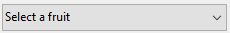

Listas drop-down são objetos que permitem que os usuários selecionem de uma lista. Gerenciar os itens exibidos na lista drop down usando um array, uma lista de escolha ou uma ação padrão.

Em macOS, listas drop down são também chamadas de "menu pop up" Ambos os nomes referem aos mesmos objetos. Ambos os nomes referem aos mesmos objetos. Como no exemplo abaixo, a aparência desses objetos podem diferenciar levemente de acordo com a plataforma:


## Tipos de listas pendentes

You can create different types of drop-down lists with different features. To define a type, select the appropriate **Expression Type** and **Data Type** values in the Property list, or use their JSON equivalent.

| Tipo                                | Funcionalidades                                        | Tipo de expressão | Tipo de dados                   | Definição JSON                                                                                                                                                |
| ----------------------------------- | ------------------------------------------------------ | ----------------- | ------------------------------- | ------------------------------------------------------------------------------------------------------------------------------------------------------------- |
| Object                              | Construído sobre uma colecção                          | Object            | Numeric, Text, Date, ou Time    | `dataSourceTypeHint: object` + `numberFormat: <format>` or `textFormat: <format>` ou `dateFormat: <format>` or `timeFormat: <format>` |
| Array                               | Construído sobre um array                              | Array             | Numeric, Text, Date, ou Time    | `dataSourceTypeHint: arrayNumber` ou `arrayText` ou `arrayDate` ou `arrayTime`                                                                                |
| Lista de opções guardada como valor | Construído com base numa lista de opções (“padrão”)    | Lista             | Valor do item seleccionado      | `dataSourceTypeHint: text` + `saveAs: value`                                                                                                                  |
| Salvar como                         | Built upon a choice list. A posição do item é guardada | Lista             | Referência do item seleccionado | `dataSourceTypeHint: integer` + `saveAs: reference`                                                                                                           |
| Lista de seleção hierárquica        | Pode apresentar conteúdos hierárquicos                 | Lista             | Referência da lista             | `dataSourceTypeHint: integer`                                                                                                                                 |
| Ação padrão                         | Criado automaticamente pela ação                       | *any*             | *any except List reference*     | any definition + `action: <action>` (+ `focusable: false` for actions applying to other areas)                                                          |

## Handling drop-down lists

### Utilização de um objecto

> Esta funcionalidade só está disponível em projectos 4D.

An [object](Concepts/dt_object.md) encapsulating a [collection](Concepts/dt_collection) can be used as the data source of a drop-down list. O objeto deve conter as seguintes propriedades:

| Propriedade    | Tipo             | Descrição                                                                                                                                                                                                                                                       |
| -------------- | ---------------- | --------------------------------------------------------------------------------------------------------------------------------------------------------------------------------------------------------------------------------------------------------------- |
| `values`       | Collection       | Obrigatório - Coleção de valores escalares. Todos os valores devem ser do mesmo tipo. Tipos suportados:<li>strings</li><li>números</li><li>datas</li><li>horas</li>If empty or not defined, the drop-down list is empty |
| `index`        | number           | Index of the currently selected item (value between 0 and `collection.length-1`). If you set -1, `currentValue` is displayed as a placeholder string                                                                                                            |
| `currentValue` | igual a Colecção | Currently selected item (used as placeholder value if set by code)                                                                                                                                                                                              |

If the object contains other properties, they are ignored.

Objetos lista drop down são iniciados ao carregar uma lista de valores em um array. Pode fazer isso de várias maneiras:

* Enter a list of default values in the object properties by selecting `\&#060;Static List&#062;` in the [Data Source](properties_DataSource.md) theme of the Property List. The default values are loaded into an object automatically.

* Execute code that creates the object and its properties. For example, if "myList" is the [variable](properties_Object.md#variable-or-expression) associated to the drop-down list, you can write in the [On Load](Events/onLoad.md) form event:

```4d
// Form.myDrop is the datasource of the form object Form.myDrop:=New object Form.myDrop.values:=New collection("apples"; "nuts"; "pears"; "oranges"; "carrots")
Form.myDrop.index:=-1  //currentValue is a placeholder Form.myDrop.currentValue:="Select a fruit" 
```

The drop-down list is displayed with the placeholder string:



Depois de o utilizador selecionar um valor:


```4d
Form.myDrop.values // ["apples","nuts","pears","oranges","carrots"]
Form.myDrop.currentValue //"oranges" Form.myDrop.index //3
```

### Usar um array

Um [array](Concepts/arrays.md) é uma lista de valores na memória que são referenciados pelo nome do array. Uma lista drop down exibe um array como lista de valores quando clicar nela.

To initialize the array associated to the drop-down list, you can:

* Enter a list of default values in the object properties by selecting `\&#060;Static List&#062;` in the [Data Source](properties_DataSource.md) theme of the Property List. Os valores padrão são carregados em um array automático. Pode fazer uma referência ao array usando o nome da variável associado com o objeto.

* Antes que o objeto seja exibido, execute um código que atribua valores aos elementos do array. Por exemplo:

```4d
  ARRAY TEXT($aCities;6)
  $aCities{1}:="Philadelphia"
  $aCities{2}:="Pittsburg"
  $aCities{3}:="Grand Blanc"
  $aCities{4}:="Bad Axe"
  $aCities{5}:="Frostbite Falls"
  $aCities{6}:="Green Bay" 
```

Neste caso, o nome da variável associada ao objeto de formulário deve ser *$aCities*. Esse código pode ser colocado no método formulário e executado quando o evento de formulário `On Load` acontecer.

* Antes que o objeto seja exibido, carregue os valores para uma lista em um array usando o comando [LIST TO ARRAY](https://doc.4d.com/4dv19/help/command/en/page288.html). Por exemplo:

```4d
   LIST TO ARRAY("Cities";$aCities)
```

Neste caso também o nome da variável asociada al objeto del formulario debe ser *$aCities*. Este código pode ser executado ao invés das sentenças de atribuição mostradas anteriormente.

Se precisar salvar as escolhas do usuário em um campo, precisa usar uma declaração de atribuição que rode depois que o registro seja aceito. O código poderia ser assim:

```4d
  Caso de
    :(Form event=On Load)
       LIST TO ARRAY("Cities";aCities)
       If(Record number([People])<0) `novo registo
          aCities:=3 `apresentar um valor predefinido
       Else `registo existente, apresentar valor armazenado
          aCities:=Find in array(aCities;City)
       End if
    :(Form event=On Clicked) `o utilizador modificou a selecção
       City:=aCities{aCities} `o campo recebe um novo valor
    :(Form event=On Validate)
       City:=aCities{aCities}
    :(Form event=On Unload)
       CLEAR VARIABLE(aCities)
 End case
```

Deve selecionar cada event que teste nas estruturas Case. Os arrays sempre contém um número finito de elementos. A lista de elementos é dinâmica e pode ser modificada por um método. Itens em um array podem ser modificados, ordenados e terem itens adicionados.

### Utilizar uma lista de seleção

Se quiser usar uma lista drop down para gerenciar os valores de um campo ou lista variável, 4D permite referir o campo ou variável diretamente como fonte de dados do objeto. Isso facilita gerenciar variáveis/campos listados.

Por exemplo, no caso de um campo "Cor" que só possa conter os valores "White", "Blue", "Green" ou "Red", agora é possível criar uma lista que contenha esses valores e associe-os a um objeto emergente menu que faça referência ao campo "Color". 4D então se encarrega automaticamente de gerenciar o input e exibir os valores atuais no formulário.
> Se usar uma lista hierárquica, só o primeiro nível é mostrado e pode ser selecionado. Se usar uma lista hierárquica, só o primeiro nível é mostrado e pode ser selecionado.

Para associar um menu pop up/lista drop down ou um combo box com um campo ou variável, pode digitar o nome do campo ou variável diretamente no campo [Variável ou Expressão](properties_Object.md#variable-or-expression) do objeto na Lista Propriedade.
> Não é possível combinar esse princípio com o uso de um array para iniciar o objeto. Se digitar um nome de campo na área Nome da variável, deve usar uma lista de seleção.

Quando o formulário for executado, 4D automaticamente gerencia o menu pop up ou com box durante a entrada ou a visualização: quando um usuário escolher um valor, é salvo no campo; esse valor de campo é mostrado no menu pop up quando o formulário for exibido:


#### Valor do item selecionado ou Referência do item selecionado

Quando associar um menu pop up/lista drop down com uma lista de escolhas e com um campo, pode usar a propriedade [Save as Value/Reference](properties_DataSource.md#save-as). Essa opção permite otimizar o tamanho dos dados salvos.

### Se usar uma lista hierárquica, só o primeiro nível é mostrado e pode ser selecionado.

A hierarchical drop-down list has a sublist associated with each item in the list. Here is an example of a hierarchical drop-down list:


> Nos formulários, as listas pendentes hierárquicas estão limitadas a dois níveis.

You can assign the hierarchical choice list to the drop-down list object using the [Choice List](properties_DataSource.md#choice-list) field of the Property List.

You manage hierarchical drop-down lists using the **Hierarchical Lists** commands of the 4D Language. All commands that support the `(*; "name")` syntax can be used with hierarchical  drop-down lists, e.g. [`List item parent`](https://doc.4d.com/4dv19/help/command/en/page633.html).

### Usar uma ação padrão

Pode atribuir uma ação padrão a menu pop up ou lista drop down ([Action](properties_Action.md#standard-action) tema da Lista de Propriedades). This feature is supported in the following contexts:

* Use of the `gotoPage` standard action. In this case, 4D will automatically display the [page of the form](FormEditor/forms.md#form-pages) that corresponds to the number of the item that is selected. For example, if the user selects the 3rd item, 4D will display the third page of the current form (if it exists). At runtime, by default the drop-down list displays the page numbers (1, 2...).

* Por exemplo, se selecionar a ação padrão `backgroundColor`, no tempo de execução o objeto mostrará uma lista automática de cores de fundo. Essa funcionalidade exige que:
  * a styled text area ([4D Write Pro area](writeProArea_overview.md) or [input](input_overview.md) with [multistyle](properties_Text.md#multi-style) property) is present in the form as the standard action target.
  * the [focusable](properties_Entry.md#focusable) property is not set to the drop-down list. At runtime the drop-down list will display an automatic list of values, e.g. background colors. Pode substituir esta lista automática atribuindo além disso uma lista de seleção na qual cada elemento tenha atribuída uma ação padrão personalizada.

> Esta funcionalidade não pode ser utilizada com uma lista pendente hierárquica.

## Propriedades compatíveis

[Formato Alfa](properties_Display.md#alpha-format) - [Negrita](properties_Text.md#bold) - [Inferior](properties_CoordinatesAndSizing.md#bottom) - \[Estilo del botón\](properties_TextAndPicture. md#button-style) - [Lista de opciones](properties_DataSource.md#choice-list) - [Clase](properties_Object.md#css-class) - [Formato de fecha](properties_Display.md#date-format) - \[Tipo de expresión\](properties_Object. md#expression-type) - [Focusable](properties_Entry.md#focusable) - [Fuente](properties_Text.md#font) - [Color de la fuente](properties_Text.md#font-color) - \[Tamaño de la fuente\](properties_Text. md#font-size) - [Altura](properties_CoordinatesAndSizing.md#height) - [Consejo de ayuda](properties_Help.md#help-tip) - [Tamaño horizontal](properties_ResizingOptions.md#horizontal-sizing) - \[Italic\](properties_Text. md#italic) - [Izquierda](properties_CoordinatesAndSizing.md#left) - [No renderizado](properties_Display.md#not-rendered) - \[Nombre del objeto\](properties_Object. md#object-name) - [Derecha](properties_CoordinatesAndSizing.md#right) - [Acción estándar](properties_Action.md#standard-action) - [Guardar como](properties_DataSource.md#save-as) - \[Formato de tiempo\](properties_Display. md#time-format) - [Superior](properties_CoordinatesAndSizing.md#top) - [Type](properties_Object.md#type) - [Subrayado](properties_Text.md#underline) - \[Variable o expresión\](properties_Object. md#variable-or-expression) - [Tamaño vertical](properties_ResizingOptions.md#vertical-sizing) - [Visibilidad](properties_Display.md#visibility) - [Ancho](properties_CoordinatesAndSizing.md#width)  
