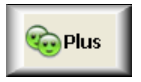
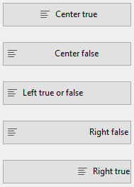

## Rota de acesso ao Fundo

Sets the path of the picture that will be drawn in the background of the object. If the object uses an [icon](#picture-pathname) with [different states](#number-of-states), the background picture will automatically support the same number of states.

The pathname to enter is similar as for the [Pathname property for static pictures](properties_Picture.md#pathname).

#### Gramática JSON

| Nome                    | Tipo de dados | Valores possíveis                                                                                                |
| ----------------------- | ------------- | ---------------------------------------------------------------------------------------------------------------- |
| customBackgroundPicture | string        | Caminho relativo na sintaxe POSIX. Must be used in conjunction with the style property with the "custom" option. |

#### Objectos suportados

[Custom Button](button_overview.md#custom) - [Custom Check Box](checkbox_overview.md#custom) - [Custom Radio Button](radio_overview.md#custom)

---

## Estilo de botão

Aspeto geral do botão. O estilo do botão também desempenha um papel na disponibilidade de determinadas opções.

#### Gramática JSON

| Nome  | Tipo de dados | Valores possíveis                                                                                                                                                  |
|:-----:|:-------------:| ------------------------------------------------------------------------------------------------------------------------------------------------------------------ |
| style |     text      | "regular", "flat", "toolbar", "bevel", "roundedBevel", "gradientBevel", "texturedBevel", "office", "help", "circular", "disclosure", "roundedDisclosure", "custom" |

#### Objectos suportados

[Button](button_overview.md) - [Radio Button](radio_overview.md) - [Check Box](checkbox_overview.md) - [Radio Button](radio_overview.md)

---

## Margem horizontal

Esta propriedade permite definir o tamanho (em píxeis) das margens horizontais do botão. Esta margem delimita a área que o ícone e o título do botão não devem ultrapassar.

This parameter is useful, for example, when the background picture contains borders:

| Com / Sem               | Exemplo                                                      |
| ----------------------- | ------------------------------------------------------------ |
| Sem margem              |  |
| Com margem de 13 píxeis |  |
> This property works in conjunction with the [Vertical Margin](#vertical-margin) property.

#### Gramática JSON

| Nome          | Tipo de dados | Valores possíveis                                     |
| ------------- | ------------- | ----------------------------------------------------- |
| customBorderX | number        | Para utilizar com o estilo "personalizado". Mínimo: 0 |

#### Objectos suportados

[Custom Button](button_overview.md#custom) - [Custom Check Box](checkbox_overview.md#custom) - [Custom Radio Button](radio_overview.md#custom)

---

## Localização do ícone

Designates the placement of an icon in relation to the form object.

#### Gramática JSON

| Nome          | Tipo de dados | Valores possíveis       |
| ------------- | ------------- | ----------------------- |
| iconPlacement | string        | "none", "left", "right" |

#### Objectos suportados

[Cabeçalho do List Box](listbox_overview.md#list-box-headers)

---

## Offset do ícone

Sets a custom offset value in pixels, which will be used when the button is clicked

The title of the button will be shifted to the right and toward the bottom for the number of pixels entered. This allows applying a customized 3D effect when the button is clicked.

#### Gramática JSON

| Nome         | Tipo de dados | Valores possíveis |
| ------------ | ------------- | ----------------- |
| customOffset | number        | mínimo: 0         |

#### Objectos suportados

[Custom Button](button_overview.md#custom) - [Custom Check Box](checkbox_overview.md#custom) - [Custom Radio Button](radio_overview.md#custom)

---

## Número de estados

This property sets the exact number of states present in the picture used as the icon for a [button with icon](button_overview.md), a [check box](checkbox_overview.md) or a custom [radio button](radio_overview.md).

A imagem pode conter de 2 a 6 estados.

- 2 estados: false, true
- 3 estados: false, true, rollover,
- 4 estados: false, true, rollover, desativado,
- 5 states (check box and radio button only): false, true, false rollover, true rollover, disabled
- 6 states (check box and radio button only): false, true, false rollover, true rollover, false disabled, true disable.

:::note

- button not clicked / check box unchecked (variable value=0)
- button clicked / check box checked (variable value=1)

:::

Each state is represented by a different picture. In the source picture, the states must be stacked vertically:

#### Gramática JSON

| Nome       | Tipo de dados | Valores possíveis                               |
| ---------- | ------------- | ----------------------------------------------- |
| iconFrames | number        | Número de estados na imagem do ícone. Mínimo: 1 |

#### Objectos suportados

[Button](button_overview.md) (all styles except [Help](button_overview.md#help)) - [Check Box](checkbox_overview.md) - [Radio Button](radio_overview.md)

---

## Picture pathname

Sets the path of the picture that will be used as icon for the object.

The pathname to enter is similar as for the [Pathname property for static pictures](properties_Picture.md#pathname).

> When used as icon for active objects, the picture must be designed to support a variable [number of states](#number-of-states).

#### Gramática JSON

| Nome | Tipo de dados | Valores possíveis                                |
| ---- | ------------- | ------------------------------------------------ |
| icon | picture       | Caminho relativo ou filesystem na sintaxe POSIX. |

#### Objectos suportados

[Button](button_overview.md) (all styles except [Help](button_overview.md#help)) - [Check Box](checkbox_overview.md) - [List Box Header](listbox_overview.md#list-box-headers) - [Radio Button](radio_overview.md)

---

## Title/Picture Position

This property allows modifying the relative location of the button title in relation to the associated icon. This property has no effect when the button contains only a title (no associated picture) or a picture (no title). By default, when a button contains a title and a picture, the text is placed below the picture.

Here are the results using the various options for this property:

| Opção        | Descrição                                                                                                                                        | Exemplo                                                           |
| ------------ | ------------------------------------------------------------------------------------------------------------------------------------------------ | ----------------------------------------------------------------- |
| **Direita**  | O texto é colocado à esquerda do ícone. The contents of the button are aligned to the right.                                                     |   |
| **Topo**     | O texto é colocado por cima do ícone. O conteúdo do botão é centrado.                                                                            |       |
| **Esquerda** | O texto é colocado à direita do ícone. The contents of the button are aligned to the left.                                                       |     |
| **Fundo**    | O texto é colocado por baixo do ícone. O conteúdo do botão é centrado.                                                                           |    |
| **Centrado** | The text of the icon is centered vertically and horizontally in the button. This parameter is useful, for example, for text included in an icon. |  |

#### Gramática JSON

| Nome          | Tipo de dados | Valores possíveis                          |
| ------------- | ------------- | ------------------------------------------ |
| textPlacement | string        | "left", "top", "right", "bottom", "center" |

#### Objectos suportados

[Button](button_overview.md) (all styles except [Help](button_overview.md#help)) - [Check Box](checkbox_overview.md) - [Radio Button](radio_overview.md)

---

## Image hugs title

This property allows you to define whether the title and the picture of the button should be visually adjoined or separated, according to the [Title/Picture position](#titlepicture-position) and [Horizontal Alignment](#horizontal-alignment) properties.

This property has no effect when the button contains only a title (no associated picture) or a picture (no title).

By default, when a button contains a title and a picture, the elements are joined. The following graphic shows the effect of the `imageHugsTitle` property (true when property is enabled) with different button alignments:

#### Gramática JSON

| Nome           | Tipo de dados | Valores possíveis    |
| -------------- | ------------- | -------------------- |
| imageHugsTitle | boolean       | true (padrão), false |

#### Objectos suportados

[Button](button_overview.md) (all styles except Help) - [Check Box](checkbox_overview.md) (all styles except Regular, Flat, Disclosure and Collapse/Expand) - [Radio Button](radio_overview.md) (all styles except Regular, Flat, Disclosure and Collapse/Expand).

---

## Margem vertical

This property allows setting the size (in pixels) of the vertical margins of the button. Esta margem delimita a área que o ícone e o título do botão não devem ultrapassar.

This parameter is useful, for example, when the background picture contains borders.

> This property works in conjunction with the [Horizontal Margin](#horizontal-margin) property.

#### Gramática JSON

| Nome          | Tipo de dados | Valores possíveis                                     |
| ------------- | ------------- | ----------------------------------------------------- |
| customBorderY | number        | Para utilizar com o estilo "personalizado". Mínimo: 0 |

#### Objectos suportados

[Custom Button](button_overview.md#custom) - [Custom Check Box](checkbox_overview.md#custom) - [Custom Radio Button](radio_overview.md#custom)

---

## Com menu pop-up

This property allows displaying a symbol that appears as a triangle in the button to indicate the presence of an attached pop-up menu:

The appearance and location of this symbol depends on the button style and the current platform.

### Ligados e Separados

To attach a pop-up menu symbol to a button, there are two display options available:

|                         Linked                          |                          Separado                          |
|:-------------------------------------------------------:|:----------------------------------------------------------:|
|  |  |
> The actual availability of a "separated" mode depends on the style of the button and the platform.

Each option specifies the relation between the button and the attached pop-up menu:

- When the pop-up menu is **separated**, clicking on the left part of the button directly executes the current action of the button; this action can be modified using the pop-up menu accessible in the right part of the button.
- When the pop-up menu is **linked**, a simple click on the button only displays the pop-up menu. Only the selection of the action in the pop-up menu causes its execution.

:::info

Refer to the [`On Alternative Click` event description](../Events/onAlternativeClick.md) for more information on the handling of events in this case.

:::

### Gerir o menu pop-up

It is important to note that the "With Pop-up Menu" property only manages the graphic aspect of the button. The display of the pop-up menu and its values must be handled entirely by the developer, more particularly using `form events` and the **[Dynamic pop up menu](https://doc.4d.com/4Dv18/4D/18/Dynamic-pop-up-menu.301-4505524.en.html)** and **[Pop up menu](https://doc.4d.com/4Dv17R5/4D/17-R5/Pop-up-menu.301-4127438.en.html)** commands.

#### Gramática JSON

| Nome           | Tipo de dados | Valores possíveis                                                           |
|:-------------- | ------------- | --------------------------------------------------------------------------- |
| popupPlacement | string        | <li>"none"</li><li>"linked"</li><li>"separated"</li> |

#### Objectos suportados

[Toolbar Button](button_overview.md#toolbar) - [Bevel Button](button_overview.md#bevel) - [Rounded Bevel Button](button_overview.md#Rounded-bevel) - [OS X Gradient Button](button_overview.md#os-x-gradient) - [OS X Textured Button](button_overview.md#os-x-textured) - [Office XP Button](button_overview.md#office-XP) - [Circle Button](button_overview.md#circle) - [Custom](button_overview.md#custom)
