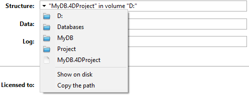

The Information page provides information about the 4D and system environments, as well as the database and application files. Each page can be displayed using tab controls at the top of the window.

## Programa

This page indicates the name, version and location of the application as well as the active 4D folder (for more information about the active 4D folder, refer to the description of the `Get 4D folder` command in the *4D Language Reference* manual).

A parte central da janela indica o nome e local do projeto de bancos de dados e arquivos de dados assim como o arquivo de histórico (se houver). A parte inferior da janela indica o nome do titular da licença 4D, o tipo de licença e o nome de usuário do banco de dados quando ativar as senhas (ou o Designer se não for o caso).

- **Display and selection of pathnames**: On the **Program** tab, pathnames are displayed in pop-up menus containing the folder sequence as found on the disk:  
   If you select a menu item (disk or folder), it is displayed in a new system window. The **Copy the path** command copies the complete pathname as text to the clipboard, using the separators of the current platform.

- **"Licenses" Folder** The **"Licenses" Folder** button displays the contents of the active Licenses folder in a new system window. All the license files installed in your 4D environment are grouped together in this folder, on your hard disk. When they are opened with a Web browser, these files display information concerning the licenses they contain and their characteristics. The location of the "Licenses" folder can vary depending on the version of your operating system. For more information about the location of this folder, refer to the `Get 4D folder` command. ***Note:** You can also access this folder from the “Update License” dialog box (available in the Help menu).*

## Tabelas

Esta página fornece uma visão geral das tabelas da sua base de dados:

> As informações desta página estão disponíveis nos modos standard e de manutenção.

The page lists all the tables of the database (including invisible tables) as well as their characteristics:

- **ID**: número interno da tabela.
- **Tabelas**: nome da tabela. Names of deleted tables are displayed with parenthesis (if they are still in the trash).
- **Records**: Total number of records in the table. If a record is damaged or cannot be read, *Error* is displayed instead of the number. Neste caso, pode considerar a utilização das ferramentas de verificação e reparação.
- **Campos**: número de campos na tabela. Os campos invisíveis são contados, mas os campos apagados não são contados.
- **Índices**: número de Índices na tabela
- **Criptografável**: se marcado, é selecionado o atributo **Encriptable** para a tabela ao nível da estrutura (ver o parágrafo Encriptable no Manual de Design).
- **Encrypted**: If checked, the records of the table are encrypted in the data file. **Encrypted**: If checked, the records of the table are encrypted in the data file.
- **Address Table Size**: Size of the address table for each table. The address table is an internal table which stores one element per record created in the table. Na verdade, associa os registos ao seu endereço físico. For performance reasons, it is not resized when records are deleted, thus its size can be different from the current number of records in the table. If this difference is significant, a data compacting operation with the "Compact address table" option checked can be executed to optimize the address table size (see [Compact](compact.md) page). ***Note:** Differences between address table size and record number can also result from an incident during the cache flush.*

## Dados

The **Data** page provides information about the available and used storage space in the data file.
> Esta página não pode ser acedida em modo manutenção

As informações são fornecidas sob a forma de gráficos:

> This page does not take into account any data that may be stored outside of the data file (see "External storage").

Arquivos que são muito fragmentados reduzem o desempenho do disco e, assim, do banco de dados. If the occupation rate is too low, 4D will indicate this by a warning icon (which is displayed on the Information button and on the tab of the corresponding file type) and specify that compacting is necessary:

A warning icon is also displayed on the button of the [Compact](compact.md) page: 
