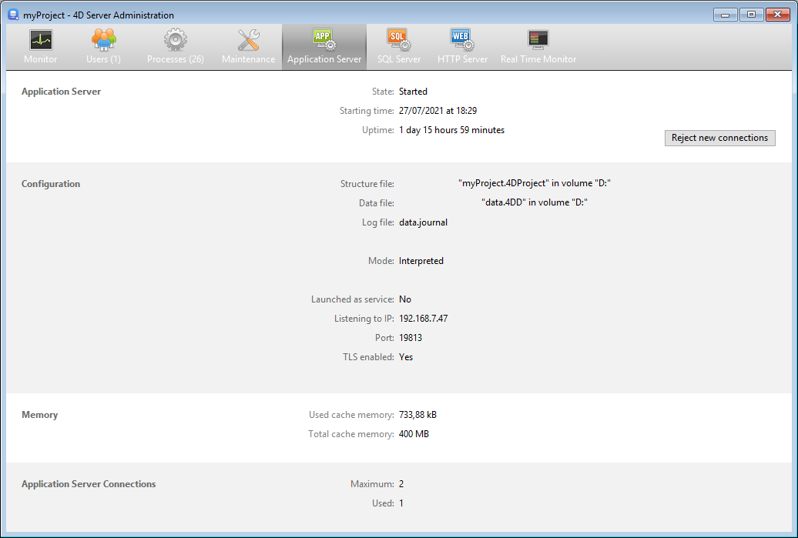

A página Application Server agrupa informações sobre a aplicação desktop publicada pelo 4D Server e pode ser usada para gerenciar essa publicação.

A parte superior da página fornece informação sobre o estado atual do servidor de aplicação 4D Server.

- **Estado**: Iniciado ou Parado.
- **Hora de início**: Data e hora em que o servidor de aplicações foi lançado. Esta data corresponde à abertura do projeto por 4D Server.
- **Uptime**: Tempo decorrido desde a última abertura do projeto pelo servidor.

## Aceitar/Rejeitar novas ligações

Este botão alterna e pode ser utilizado para gerir o acesso de novas máquinas cliente de ambiente de trabalho ao servidor de aplicações.

Por padrão, quando o projeto for publicado:
- O botão tem o título "Rejeitar novas ligações."
- Os novos clientes desktop podem conectar-se livremente (dentro do limite das conexões permitidas pela licença).
- O nome do projeto é publicado na caixa de diálogo de ligação remota (se a opção "At Startup Publish Database Name in the Connection Dialog" estiver selecionada nas Preferências).

Se clicar no botão **Rejeitar novas ligações** :
- O título do botão muda para "Aceitar novas ligações."
- Nenhum novo cliente pode então ligar-se. Os clientes que tentarem ligar-se receberão a seguinte mensagem:

- O nome do projeto já não aparece na caixa de diálogo da ligação remota.
- Os clientes de ambiente de trabalho que já estão ligados não são desligados e podem continuar a trabalhar normalmente.

> É possível executar a mesma ação com o comando [`REJECT NEW REMOTE CONNECTIONS`](https://doc.4d.com/4dv19/help/command/en/page1635.html) .

- Se clicar no botão **Aceitar novas ligações**, o servidor de aplicações regressa ao seu estado predefinido.

Esta caraterística permite, por exemplo, que um administrador efetue várias operações de manutenção (verificação, compactação, etc.) logo após ter iniciado o servidor. Se o administrador utilizar uma ligação remota, pode ter a certeza de que é o único a modificar os dados. Também é possível utilizar esta função para preparar uma operação de manutenção que exija que não exista uma máquina cliente de secretária ligada.

## Informação

### Configuração

Esta área fornece informação sobre o projeto 4D publicado pelo servidor: nome e localização dos arquivos de dados e de estrutura e nome do arquivo de registo da base de dados. Pode clicar no nome da estrutura ou do arquivo de dados para ver o seu caminho completo.

O campo **Mode** indica o modo de execução atual da aplicação: compilado ou interpretado.

A parte inferior da área indica os parâmetros de configuração do servidor (lançados como serviço, porta e endereço IP) e a ativação do TLS para ligações cliente-servidor (não diz respeito a ligações SQL nem HTTP).

### Memória

Esta área indica a **Memória cache total** (parâmetro definido nas configurações) e a **Memória cache usada** (alocação dinâmica pelo 4D Server de acordo com suas necessidades).

### Ligações aplicação servidor

- **Máximo**: número máximo de ligações simultâneas de clientes permitidas para o servidor de aplicações. Este valor depende da licença instalada na máquina do servidor.
- **Used**: número real de ligações atualmente utilizadas.

