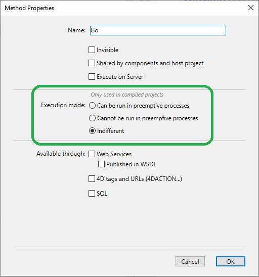
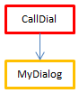

The compiled 4D code can be executed in **preemptive processes**. Graças a esta funcionalidade, seus aplicativos 4D compilados poderão aproveitar ao máximo os computadores de vários núcleos de modo que sua execução será mais rápida e pode suportar mais usuários conectados.

## O que é um processo preemptivo?

When run in *preemptive* mode, a process is dedicated to a CPU. A gestão de processos então é delegada ao sistema, que pode adjudicar por separado cada CPU em uma máquina multi-núcleo.

When run in *cooperative* mode, all processes are managed by the parent application thread and share the same CPU, even on a multi-core machine.

Como resultado, no modo apropriativo, o rendimento global da aplicação é incrementado, especialmente em máquinas multi-núcleo, já que múltiplos processos (threads ou fios) podem ser executados simultaneamente. Entretanto, os ganhos reais dependem das operações executadas. Por outro lado, já que no modo apropriativo cada fio é independente dos demais e não é gestionado diretamente pela aplicação, limitações específicas se aplicam aos métodos que queira que sejam compatíveis com o modo apropriativo. Além disso, a execução apropriativa está disponível só em alguns contextos específicos.

## Disponibilidade de modo preemptivo

O uso do modo preemptivo está disponível nos seguintes contextos de execução:

| Contexto          | Execução preventiva                                                    |
| ----------------- | ---------------------------------------------------------------------- |
| 4D Server         | sim                                                                    |
| 4D remoto         | yes, with [ServerNet or QUIC](../settings/client-server#network-layer) |
| 4D usuário único  | sim                                                                    |
| Modo compilado    | sim                                                                    |
| Modo interpretado | não                                                                    |

If the execution context supports preemptive mode and if the method is "thread-safe", a new 4D process launched using the `New process` or `CALL WORKER` commands, or the "Run method" menu item, will be executed in a preemptive thread.

Otherwise, if you call `New process` or `CALL WORKER` from an execution context that is not supported (i.e. from interpreted mode), the process is always cooperative.


## Código thread-seguro vs thread-inseguro

O código 4D pode ser executado em fio (thread) apropriativo só quando algumas condições específicas forem cumpridas. Each part of the code being executed (commands, methods, variables, functions, etc.) must be compliant with preemptive use. Os elementos que podem ser executados em fios apropriativos são chamados threads seguros e os elementos que não podem ser executados em fios apropriativos são chamados threads inseguros.

:::note

Dado que um thread se maneja de forma independente a partir do método processo pai, toda a string de chamadas não deve incluir nenhum código thread inseguro, do contrário a execução apropriativa não será possível. This point is discussed [in this paragraph](#when-is-a-process-started-preemptively).

:::

A propriedade "segurança de fio" de cada elemento depende do elemento em si:

- Comandos 4D: thread seguro é uma propriedade interna. In the [4D Language Reference manual](https://doc.4d.com/4Dv20/4D/20.1/4D-Language-Reference.100-6479538.en.html), thread-safe commands are identified by the  icon. You can also use the [`Command name`](https://doc.4d.com/4dv20/help/command/en/page538.html) command to know if a command is thread-safe. Grande parte dos comandos 4D podem ser executados em modo apropriativo.
- Project methods: conditions for being thread-safe are listed in [this paragraph](#writing-a-thread-safe-method).

Basicamente, o código que se executa em thread apropriativos não podem ser chamados as partes com as interações externas, tal como o código plug-in ou as variáveis interprocesso. Os acessos aos dados, entretanto, são permitidos desde o servidor de dados 4D que suporta a execução apropriativa.


## Declaração de um método preemptivo

Como padrão, 4D executará todos os métodos de projeto em modo cooperativo. Se desejar se beneficiar da funcionalidade modo apropriativo, o primeiro passo consiste em declarar explicitamente todos os métodos que deseja que se iniciem em modo apropriativo sempre que for possível, ou seja, os métodos que considere capaz de executar em processo apropriativo. The compiler will [check that these methods are actually thread-safe](#writing-a-thread-safe-method) at compile time. Também pode desabilitar o modo apropriativo para alguns métodos, se for necessário.

Lembre que definir um método como apropriativo faz com que seja elegível para execução apropriativa, mas não garante que se execute realmente em modo apropriativo. Starting a process in preemptive mode results from an [evaluation performed by 4D](#when-is-a-process-started-preemptively) regarding the properties of all the methods in the call chain of the process.

Para declarar seu método de elegibilidade para o modo apropriativo, é necessário utilizar a opção de declaração "Modo de execução" no quadro de diálogo Propriedades de método:



São fornecidas as seguintes opções:

- **Can be run in preemptive processes**: By checking this option, you declare that the method is able of being run in a preemptive process and therefore should be run in preemptive mode whenever possible. A propriedade "preemptive" do método é definida como "capable".

    Quando essa opção estiver marcada, o compilador 4D verificará se o método é realmente capaz e retornará erros se esse não for o caso -- por exemplo, se ele chama direta ou indiretamente comandos ou métodos que não podem ser executados em modo preemptivo (toda a cadeia de chamadas é analisada, mas os erros são reportados apenas ao primeiro subnível). Pode então editar o método para que se torne thread-safe, ou selecionar outra opção.

    Se a capacidade preemptiva do método for aprovada, este é marcado internamente como "thread-safe" e será executado em modo preemptivo sempre que as condições necessárias forem cumpridas. This property defines its eligibility for preemptive mode but does not guarantee that the method will actually be run in preemptive mode, since this execution mode requires a [specific context](#when-is-a-process-started-preemptively).

- **Cannot be run in preemptive processes**: Ao marcar esta opção, declara que o método nunca deve ser executado em modo preemptivo, e portanto deve ser sempre executado em modo cooperativo, como nas versões 4D anteriores. A propriedade "preemptive" do método é definida como "incapable".

    Quando esta opção estiver marcada, o compilador 4D não verificará a habilidade do método de executar preemptivamente; ele é automaticamente marcado como "thread-unsafe" internamente (mesmo que seja teoricamente capaz). Quando chamado em tempo de execução, este método irá "contaminar" quaisquer outros métodos na mesma thread, forçando assim esta thread a ser executada em modo cooperativo, mesmo que os outros métodos sejam thread-safe.

- **Indiferente**(predefinição): Ao marcar esta opção, declara que não pretende tratar a propriedade preemptiva do método. A propriedade "preemptiva" do método é definida como "indiferente".

    Quando esta opção está marcada, o compilador 4D avaliará a capacidade preemptiva do método e o marcará internamente como "thread-safe" ou "thread-unsafe". Não é devolvido qualquer erro relacionado com a execução preemptiva. Se o método for avaliado como thread-safe, em tempo de execução não impedirá a execução preemptiva de threads quando chamado num contexto preemptivo. Por outro lado, se o método for avaliado como "thread-unsafe", em tempo de execução impedirá qualquer execução de thread preemptiva quando for chamado.

Note that with this option, whatever the internal thread safety evaluation, the method will always be executed in cooperative mode when called directly by 4D as the first parent method (for example through the `New process` command). Se for marcado internamente como "thread-safe", só é tido em conta quando chamado a partir de outros métodos dentro de uma cadeia de chamadas.

:::note Particular case

If the method has also the [**Shared by components and host database**](../Project/code-overview.md#shared-by-components-and-host-database) property, setting the **Indifferent** option will automatically tag the method as thread-unsafe. Se pretender que um método de componente partilhado seja thread-safe, deve defini-lo explicitamente como **Pode ser executado em processos preemptivos**.

:::

## Quando um processo é iniciado de forma preemptiva?

:::info Lembrete

A execução apropriativa só está disponível em modo compilado.

:::

In compiled mode, when starting a process created by either `New process` or `CALL WORKER` commands, 4D reads the preemptive property of the process method (also named *parent* method) and executes the process in preemptive or cooperative mode, depending on this property:

- Se o método processo for thread seguro (validado durante a compilação), o processo é executado em um thread apropriativo.
- Se o método processo for thread inseguro, o processo é executado em um thread cooperativo.
- Se a propriedade apropiativa do método de processo era "indiferente", por compatibilidade o processo é executado em um thread cooperativo (mesmo que o método seja realmente capaz de uso preemptivo). Note, entretanto, que esta funcionalidade de compatibilidade for aplicada só quando for utilizado o método como método de processo: um método declarado "indiferente", mas internamente etiquetado "thread seguro" pelo compilador pode ser chamado apropriativamente por outro método (ver abaixo).

A propriedade segurança de thread depende da cadeia de chamadas. Se um método com a propriedade declarada "capable" chamar a um método thread inseguro em qualquer de seus subníveis, um erro de compilação será devolvido: se um método único em toda a cadeia de chamadas for thread inseguro, "contaminará" todos os outros métodos e a execução apropriativa será recusada pelo compilador. Um thread apropriativo só pode ser criado quando toda a cadeia for thread seguro e o método de processo tiver sido declarado "Pode ser executado em processo apropiativo". Por outro lado, o mesmo método thread seguro pode ser executado em um thread apropriativo em uma cadeia de chamada e em thread cooperativo em outra cadeia de chamada.

Por exemplo, considere os métodos de projeto abaixo:

```4d
  //MyDialog project method
  //contains interface calls: will be internally thread unsafe
 $win:=Open form window("tools";Palette form window)
 DIALOG("tools")
```

```4d  
  //MyComp project method
  //contains simple computing: will be internally thread safe
 #DECLARE($value : Integer) -> $result : Integer
 $result:=$value*2
```

```4d
  //CallDial project method
 var $vName : Text
 MyDialog
```

```4d
  //CallComp project method
 var $vAge : Integer
 MyComp($vAge)
```

A execução de un método no modo preemptivo dependerá de que a propriedade "execução" e da cadeia de chamadas. A tabela abaixo ilustra estas diversas situações:


| Declaração e cadeia de chamadas       | Compilação | Segurança de thread resultante         | Execução                | Comentário                                                                                                                                                                                                                                                                                                                                                                                                                                         |
| ------------------------------------- | ---------- | -------------------------------------- | ----------------------- | -------------------------------------------------------------------------------------------------------------------------------------------------------------------------------------------------------------------------------------------------------------------------------------------------------------------------------------------------------------------------------------------------------------------------------------------------- |
|  | OK         |   | Apropiativo             | CallComp é o método pai, declarado "capable" de uso preemptivo; já que MyComp é internamente thread seguro, CallComp é thread seguro e o processo for preemptivo                                                                                                                                                                                                                                                                                   |
|  | Error      |   | A execução é impossível | CallDial é o método pai, declarado "capaz"; MyDialog é "indiferente". Entretanto, já que MyDialog está internamente thread inseguro, contamina a string de chamadas. A compilação falha devido a um conflito entre a declaração deCallDial e sua capacidade real. A solução é modificar MyDialog para ser thread seguro, de modo que a execução seja preemptiva, ou mudar a declaração de propriedade de CallDial para executá-lo como cooperativo |
|  | OK         |   | Cooperativo             | Como CallDial se declara "incapable" de uso apropiativo, a compilação é internamente thread inseguro, a execução sempre será cooperativa, independentemente do estado de MyDialog                                                                                                                                                                                                                                                                  |
|  | OK         |   | Cooperativo             | Como CallComp é o método pai com a propriedade "Indifferent", depois o processo é cooperativo mesmo se toda a string for thread seguro.                                                                                                                                                                                                                                                                                                            |
|  | OK         |  | Cooperativo             | Como CallDial é o método pai (propriedade era "Indifferent"), então o processo é cooperativo e a compilação exitosa                                                                                                                                                                                                                                                                                                                                |


### Como descobrir o modo de execução real

4D permite que você identifique o modo de execução dos processos no modo compilado:

- The [`PROCESS PROPERTIES`](https://doc.4d.com/4dv20/help/command/en/page336.html) command allows you to find out whether a process is run in preemptive or cooperative mode.
- Both the Runtime Explorer and the [4D Server administration window](../ServerWindow/processes.md#process-type) display specific icons for preemptive processes.


## Escrevendo um método thread seguro

Para ser thread seguro, um método deve respeitar as seguintes regras:

- deve ter a propriedade "Pode ser executado em processos preemptivos" ou "Indiferente"
- não chama a um comando 4D que seja thread inseguro.
- não deve chamar outro método projeto ou função de que não seja thread seguro
- não deve chamar um plug-in que seja thread inseguro.
- não deve usar nenhuma variável de interprocesso(1)
- não deve chamar objetos de interface (2) (existem, no entanto, exceções, veja abaixo).

(1) To exchange data between preemptive processes (and between all processes), you can pass [shared collections or shared objects](../Concepts/shared.md) as parameters to processes, and/or use the [`Storage`](https://doc.4d.com/4dv20/help/command/en/page1525.html) catalog. [Worker processes](processes.md#worker-processes) also allow you to exchange messages between any processes, including preemptive processes.

(2) The [`CALL FORM`](https://doc.4d.com/4dv20/help/command/en/page1391.html) command provides an elegant solution to call interface objects from a preemptive process.

:::note Notas

- No caso de um método "Compartilhado por componentes e bancos de dados host", a propriedade "Pode ser executado em processos preemptivos" deve ser selecionada.
- Todas as instruções SQL são thread- seguro. SQL code inserted in `Begin SQL`/`End SQL` blocks must comply with the following conditions:
    + It must apply to the 4D Server or 4D local database (ODBC or remote databases via `SQL LOGIN` are thread-unsafe. However, local databases used with `USE DATABASE` are thread-safe).
    - Any trigger called by SQL statements must be thread-safe (see [Triggers](#triggers) below).

:::


Os métodos com a propriedade "Pode ser executado em processos preemptivos" serão verificados por 4D na etapa de compilação. Um erro de compilação se emite quando o compilador encontrar algo que lhe impeça ser thread seguro:


:::info

It is possible to [disable locally the thread-safety verification](#).

:::

The [symbol file](../Project/compiler.md/#complete-list-of-methods), if enabled, also contains the thread safety status for each method.

### Interface do usuário

Como são acessos "externos", as chamadas para objetos da interface do usuário, como formulários, bem como para o depurador, não são permitidas em threads preemptivas.

Os únicos acessos possíveis à interface do usuário de um thread preemptivo são:

- [Standard error dialog](../Debugging/basics). A caixa de diálogo é exibida no processo de modo de usuário (no 4D) ou no processo de interface de usuário do servidor (4D Server). The **Trace** button is disabled.
- Indicadores de progresso padrão
- `ALERT`, `Request` and `CONFIRM` dialogs. A caixa de diálogo é exibida no processo de modo de usuário (no 4D) ou no processo de interface de usuário do servidor (4D Server). Observe que, se o 4D Server tiver sido iniciado como um serviço no Windows sem interação com o usuário permitida, as caixas de diálogo não serão exibidas.


### Triggers

Quando um método usa um comando que pode chamar um gatilho, o compilador 4D avalia a segurança dos segmentos do gatilho a fim de verificar a segurança dos segmentos do método:

```4d
 SAVE RECORD([Table_1]) //trigger on Table_1, if it exists, must be thread-safe
```

Aqui está a lista de comandos que são marcados no tempo de compilação para acionar a segurança do tópico:

`SAVE RECORD`, `SAVE RELATED ONE`, `DELETE RECORD`, `DELETE SELECTION`, `ARRAY TO SELECTION`, `JSON TO SELECTION`, `APPLY TO SELECTION`, `IMPORT DATA`, `IMPORT DIF`, `IMPORT ODBC`, `IMPORT SYLK`, `IMPORT TEXT`.

Se a tabela for passada dinamicamente, o compilador poderá, às vezes, não ser capaz de descobrir qual acionador precisa avaliar. Aqui estão alguns exemplos de tais situações:

```4d
 DEFAULT TABLE([Table_1])
 SAVE RECORD
 SAVE RECORD($ptrOnTable->)
 SAVE RECORD(Table(myMethodThatReturnsATableNumber())->)
```

Nesse caso, todos os triggers são avaliados. Se um comando thread-unsafe for detectado em pelo menos um acionador, o grupo inteiro será rejeitado e o método será declarado thread-unsafe.

### Métodos de tratamento de erros

[Error-catching methods](../Concepts/error-handling.md) installed by the `ON ERR CALL` command must be thread-safe if they are likely to be called from a preemptive process. In order to handle this case, the compiler checks the thread safety property of error-catching project methods passed to the `ON ERR CALL` command during compilation and returns appropriate errors if they do not comply with preemptive execution.

Observe que essa verificação só é possível quando o nome do método é passado como uma constante e não é computado, conforme mostrado abaixo:

```4d
 ON ERR CALL("myErrMethod1") //will be checked by the compiler
 ON ERR CALL("myErrMethod"+String($vNum)) //will not be checked by the compiler
```

Além disso, se um método de projeto de captura de erros não puder ser chamado em tempo de execução (devido a um problema de segurança de thread ou por qualquer motivo, como "método não encontrado"), será gerado o erro -10532 "Cannot call error handling project method 'methodName'".


### Compatibilidade de ponteiros

Um processo pode desreferenciar um ponteiro para acessar o valor de outra variável de processo somente se ambos os processos forem cooperativos; caso contrário, 4D lançará um erro. Em um processo preemptivo, se algum código 4D tentar desreferenciar um ponteiro para uma variável de interprocesso, o 4D lançará um erro.

Exemplo com os seguintes métodos:

Method1:

```4d
 myVar:=42
 $pid:=New process("Method2";0;"process name";->myVar)
```

Method2:

```4d
 $value:=$1->
```

If either the process running Method1 or the process running Method2 is preemptive, then the expression `$value:=$1->` will throw an execution error.

### Referência do documento DocRef

The use of DocRef type parameters (opened document reference, used or returned by `Open document`, `Create document`, `Append document`, `CLOSE DOCUMENT`, `RECEIVE PACKET`, `SEND PACKET`) is limited to the following contexts:

- When called from a preemptive process, a `DocRef` reference is only usable from that preemptive process.
- When called from a cooperative process, a `DocRef` reference is usable from any other cooperative process.


## Desabilitando verificação de segurança local

Pode haver alguns casos em que você prefira que a verificação de segurança de thread dos comandos não seja aplicada a determinadas partes do código, por exemplo, quando ele contém comandos não seguros para thread que você sabe que nunca serão chamados.

To do this, you must surround the code to be excluded from command thread safety checking with the special directives `%T-` and `%T+` as comments. The `//%T-` comment disables thread safety checking and `//%T+` enables it again:

```4d
  // %T- to disable thread safety checking

  // Place the code containing commands to be excluded from thread safety checking here
 $w:=Open window(10;10;100;100) //for example

  // %T+ to enable thread safety checking again for the rest of the method
```

Obviamente, o desenvolvedor do 4D é responsável pela compatibilidade do modo preemptivo do código entre as diretivas de desativação e reativação. Erros de tempo de execução serão gerados se o código não seguro de thread for executado em um thread preemptivo.


