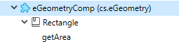

Um componente 4D é um conjunto de funções, métodos e formulários 4D que representam uma ou mais funcionalidades que podem ser [instaladas e utilizadas nas aplicações 4D](Concepts/components.md). For example, you can develop a 4D e-mail component that manages every aspect of sending, receiving and storing e-mails in 4D applications.

Você pode desenvolver componentes 4D para suas próprias necessidades e mantê-los privados. Você também pode [compartilhar seus componentes com a comunidade 4D](https://github.com/topics/4d-component).


## Definições

- **Matrix Project**: 4D project used for developing the component. O projeto matriz é um projeto standard sem atributos específicos. Um projeto matricial forma um componente único.
- **Host Project**: Application project in which a component is installed and used.
- **Component**: Matrix project that can be compiled or [built](Desktop/building.md#build-component), copied into the [`Components`](Project/architecture.md) folder of the host application and whose contents are used in the host application.

## Basics

Criar e instalar componentes 4D é realizado diretamente a partir de 4D:

- Para instalar um componente, basta copiar os ficheiros do componente para a pasta [`Components` do projecto](Project/architecture.md). Pode usar pseudónimos ou atalhos.
- A project can be both a matrix and a host, in other words, a matrix project can itself use one or more components. No entanto, um componente não pode utilizar ele próprio "subcomponentes".
- A component can call on most of the 4D elements: classes, functions, project methods, project forms, menu bars, choice lists, and so on. Não pode chamar métodos de bancos de dados e triggers.
- You cannot use the datastore, standard tables, or data files in 4D components. Entretanto um componente não pode criar ou usar tabelas, campos e arquivos de dados usando mecanismos de bancos de dados externos. São bancos 4D independentes com as que se trabalha utilizando comandos SQL.
- Um projecto anfitrião executado em modo interpretado pode utilizar componentes interpretados ou compilados. Um projecto anfitrião executado em modo compilado não pode utilizar componentes interpretados. Por isso não pode ser usado em um componente.


## Escopo dos comandos de linguagem

Exceto pelos [Comandos não utilizáveis](#unusable-commands), um componente não pode usar qualquer comando da linguagem 4D.

When commands are called from a component, they are executed in the context of the component, except for the `EXECUTE METHOD` or `EXECUTE FORMULA` command that use the context of the method specified by the command. Also note that the read commands of the “Users and Groups” theme can be used from a component but will read the users and groups of the host project (a component does not have its own users and groups).

Os comandos `SET DATABASE PARAMETER` e `Get database parameter` são uma exceção: seu alcance é global a aplicação. Quando esses comandos forem chamados de um componente, são aplicados ao projecto de aplicação local.

Além disso, medidas especificas foram criadas para os comandos `Structure file` e `Get 4D folder` quando utilizados no marco dos componentes.

O comando `COMPONENT LIST` pode ser utilizado para obter a lista de componentes que carrega o projecto local.


### Comandos não utilizáveis

Os comandos abaixo nãoo são compatíveis para seu uso dentro de um componente porque modificam o arquivo de estrutura - que está aberto em apenas leitura. Their execution in a component will generate the error -10511, "The CommandName command cannot be called from a component":

- `ON EVENT CALL`
- `Method called on event`
- `SET PICTURE TO LIBRARY`
- `REMOVE PICTURE FROM LIBRARY`
- `SAVE LIST`
- `ARRAY TO LIST`
- `EDIT FORM`
- `CREATE USER FORM`
- `DELETE USER FORM`
- `CHANGE PASSWORD`
- `EDIT ACCESS`
- `Set group properties`
- `Set user properties`
- `DELETE USER`
- `CHANGE LICENSES`
- `BLOB TO USERS`
- `SET PLUGIN ACCESS`

**Notas:**

- O comando `Current form table` devolve `Nil` quando chamado no contexto de um formulário projeto. Por isso não pode ser usado em um componente.
- SQL data definition language commands (`CREATE TABLE`, `DROP TABLE`, etc.) cannot be used on the component project. Entretanto são compatíveis com bancos de dados externos (ver o comando SQL`CREATE DATABASE`).


## Partilhar os métodos de projeto

All the project methods of a matrix project are by definition included in the component (the project is the component), which means that they can be called and executed within the component.

On the other hand, by default these project methods will not be visible, and they can't be called in the host project. In the matrix project, you must explicitly designate the methods that you want to share with the host project by checking the **Shared by components and host project** box in the method properties dialog box:


Shared project methods can be called in the code of the host project (but they cannot be modified in the Code Editor of the host project). Esses métodos são os **pontos de entrada** do componente.

Conversely, for security reasons, by default a component cannot execute project methods belonging to the host project. In certain cases, you may need to allow a component to access the project methods of your host project. To do this, you must explicitly designate which project methods of the host project you want to make accessible to the components (in the method properties, check the **Shared by components and host project** box).


Once the project methods of the host projects are available to the components, you can execute a host method from inside a component using the `EXECUTE FORMULA` or `EXECUTE METHOD` commands. Por exemplo:

```4d 
// Método host
component_method("host_method_name")
```


```4d
// component_method
 C_TEXT($1)
 EXECUTE METHOD($1)
```

> An interpreted host database that contains interpreted components can be compiled or syntax checked if it does not call methods of the interpreted component. Otherwise, a warning dialog box appears when you attempt to launch the compilation or a syntax check and it will not be possible to carry out the operation.   
> Keep in mind that an interpreted method can call a compiled method, but not the reverse, except via the use of the `EXECUTE METHOD` and `EXECUTE FORMULA` commands.


## Partilha de classes e funções

By default, component classes and functions cannot be called from the 4D Code Editor of the host project. If you want your component classes and functions to be exposed in the host projects, you need to declare a component namespace. Additionally, you can control how component classes and functions are suggested in the host Code Editor.

### Declaração do namespace

To allow classes and functions of your component to be exposed in the host projects, enter a value in the [**Component namespace in the class store** option in the General page](../settings/general.md#component-namespace-in-the-class-store) of the matrix project Settings. By default, the area is empty: component classes are not available outside of the component context.


> A *namespace* ensures that no conflict emerges when a host project uses different components that have classes or functions with identical names. A component namespace must be compliant with [property naming rules](../Concepts/identifiers.md#object-properties).

When you enter a value, you declare that component classes and functions will be available in the [user class store (**cs**)](../Concepts/classes.md#cs) of the host project's code, through the `cs.<value>` namespace. For example, if you enter "eGeometry" as component namespace, assuming that you have created a `Rectangle` class containing a `getArea()` function, once your project is installed as a component, the developer of the host project can write:

```4d
//in host project
var $rect: cs.eGeometry. Rectangle 
$rect:=cs.eGeometry. Rectangle.new(10;20)
$area:=$rect.getArea()
```

:::info

The namespace of a [compiled](#protection-of-components-compilation) component will be added between parentheses after the component name in the [Component Methods page](../Concepts/components.md#using-components) of the host projects:



:::

Of course, it is recommended to use a distinguished name to avoid any conflict. If a user class with the same name as a component already exists in the project, the user class is taken into account and the component classes are ignored.

As classes ORDA de um componente não estão disponíveis no seu projeto host. For example, if there is a dataclass called Employees in your component, you will not be able to use a "cs. Mycomponent. Employee" class in the host project.

### Classes ocultas

Just like in any project, you can create hidden classes and functions in the component by prefixing names with an underscore ("_"). When a [component namespace is defined](#declaring-the-component-namespace), hidden classes and functions of the component will not appear as suggestions when using code completion.

No entanto, se souberes os seus nomes, podes utilizá-los. For example, the following syntax is valid even if the `_Rectangle` class is hidden:

```4d
$rect:=cs.eGeometry._Rectangle.new(10;20)
```

> Non-hidden functions inside a hidden class appear as suggestions when you use code completion with a class that [inherits](../Concepts/classes.md#inheritance) from it. For example, if a component has a `Teacher` class that inherits from a `_Person` class, code completion for `Teacher` suggests non-hidden functions from `_Person`.


## Completar o código dos componentes compilados

To make your component easier to use for developers, you can check the [**Generate syntax file for code completion when compiled** option in the General page](../settings/general.md#component-namespace-in-the-class-store) of the matrix project Settings.

A syntax file (JSON format) is then automatically created during the compilation phase, filled with the syntax of your component's classes, functions, and [exposed methods](#sharing-of-project-methods), and placed in the `\Resources\en.lproj` folder of the component project. 4D uses the contents of that syntax file to generate contextual help in the code editor, such as code completion and function syntax:

 

If you don't enter a [component namespace](#declaring-the-component-namespace), the resources for the classes and exposed methods are not generated even if the syntax file option is checked.


## Passar variáveis

The local, process and interprocess variables are not shared between components and host projects. The only way to modify component variables from the host project and vice versa is using pointers.

Exemplo usando um array:

```4d
//In the host project:
     ARRAY INTEGER(MyArray;10)
     AMethod(->MyArray)

//In the component, the AMethod project method contains:
     APPEND TO ARRAY($1->;2)
```

Exemplos usando variáveis:

```4d
C_TEXT(myvariable)
component_method1(->myvariable)
```

```4d
C_POINTER($p)
$p:=component_method2(...)
```

Without a pointer, a component can still access the value of a host database variable (but not the variable itself) and vice versa:

```4d
//In the host database C_TEXT($input_t)
$input_t:="DoSomething"
component_method($input_t)
// component_method gets "DoSomething" in $1 (but not the $input_t variable)
```


When you use pointers to allow components and the host project to communicate, you need to take the following specificities into account:

- The `Get pointer` command will not return a pointer to a variable of the host project if it is called from a component and vice versa.

- The component architecture allows the coexistence, within the same interpreted project, of both interpreted and compiled components (conversely, only compiled components can be used in a compiled project). Para utilizar apontadores neste caso, deve respeitar o seguinte princípio: o intérprete pode desconectar um ponteiro construído em modo compilado; no entanto, em modo compilado, não pode deconectar um ponteiro construído em modo interpretado. In order to use pointers in this case, you must respect the following principle: the interpreter can unpoint a pointer built in compiled mode; however, in compiled mode, you cannot unpoint a pointer built in interpreted mode.
 - Se o componente C definir a variável `myCvar` , o componente I pode acessar ao valor desta variável utilizando o ponteiro `->myCvar`.
 - Se o componente I definir a variável `myIvar` , o componente C não pode acessar essa variável usando o ponteiro `->myIvar`. Esta sintaxe causa um erro de execução.

- The comparison of pointers using the `RESOLVE POINTER` command is not recommended with components since the principle of partitioning variables allows the coexistence of variables having the same name but with radically different contents in a component and the host project (or another component). O tipo da variável pode mesmo ser diferente em ambos os contextos. Se o `myptr1` e `myptr2` apontar cada ponto para uma variável, a comparação seguinte produzirá um resultado incorrecto:

```4d
     RESOLVE POINTER(myptr1;vVarName1;vtablenum1;vfieldnum1)
     RESOLVE POINTER(myptr2;vVarName2;vtablenum2;vfieldnum2)
     If(vVarName1=vVarName2)
      //Este teste retorna True mesmo se as variáveis forem diferentes
```
Neste caso é preciso usar a comparação de ponteiros:
```4d
     If(myptr1=myptr2) //Este teste retorna False
```

## Gestão de erros

An [error-handling method](Concepts/error-handling.md) installed by the `ON ERR CALL` command only applies to the running application. In the case of an error generated by a component, the `ON ERR CALL` error-handling method of the host project is not called, and vice versa.


## Acesso às tabelas do projeto local

Apesar de os componentes não poderem usar tabelas, ponteiros podem permitir que projetos locais e componentes se comuniquem entre si. Por exemplo, aqui está um método que pode ser chamado a partir de um componente:

```4d
// chamar a um método componente
methCreateRec(->[PEOPLE];->[PEOPLE]Name;"Julie Andrews")
```

Dentro do componente, o código do método `methCreateRec`:

```4d
C_POINTER($1) //Pointer on a table in host project C_POINTER($2) //Pointer on a field in host project C_TEXT($3) // Value to insert

$tablepointer:=$1
$fieldpointer:=$2 CREATE RECORD($tablepointer->)

$fieldpointer->:=$3 SAVE RECORD($tablepointer->)
```

> In the context of a component, 4D assumes that a reference to a table form is a reference to the host table form (as components can't have tables.)

## Uso de tabelas e campos

A component cannot use the tables and fields defined in the 4D structure of the matrix project. Mas pode criar e usar bancos de dados externos e então usar suas tabelas e campos de acordo com suas necessidades. Pode criar e gerenciar bancos de dados externos usando SQL. Mas pode criar e usar bancos de dados externos e então usar suas tabelas e campos de acordo com suas necessidades. Usar um banco externo significa designar temporariamente esse banco de dados como o banco atual, em outras palavras, o banco alvo para as pesquisas SQL executadas por 4D. Pode criar bancos externos usando o comando SQL `CREATE DATABASE`.

### Exemplo

O código abaixo está incluído em um componente e realiza três ações básicas com um banco externo:

- cria o banco externo se não existir ainda
- adiciona dados ao banco externo,
- lê dados do banco externo.

Cria o banco externo:

```4d
<>MyDatabase:=Get 4D folder+"\MyDB" // (Windows) armazena os dados em um diretório autorizado
 Begin SQL
        CREATE DATABASE IF NOT EXISTS DATAFILE :[<>MyDatabase];
        USE DATABASE DATAFILE :[<>MyDatabase];
        CREATE TABLE IF NOT EXISTS KEEPIT
        (
        ID INT32 PRIMARY KEY,
        kind VARCHAR,
        name VARCHAR,
        code TEXT,
        sort_order INT32
        );

        CREATE UNIQUE INDEX id_index ON KEEPIT (ID);

        USE DATABASE SQL_INTERNAL;

 End SQL
```

Escrita no banco de dados externa:

```4d
 $Ptr_1:=$2 // retrieves data from the host project through pointers
 $Ptr_2:=$3
 $Ptr_3:=$4
 $Ptr_4:=$5
 $Ptr_5:=$6
 Begin SQL

        USE DATABASE DATAFILE :[<>MyDatabase];

        INSERT INTO KEEPIT
        (ID, kind, name, code, sort_order)
        VALUES
        (:[$Ptr_1], :[$Ptr_2], :[$Ptr_3], :[$Ptr_4], :[$Ptr_5]);

        USE DATABASE SQL_INTERNAL;


 End SQL
```

Lendo de um banco externo:

```4d
 $Ptr_1:=$2 // accesses data of the host project through pointers
 $Ptr_2:=$3
 $Ptr_3:=$4
 $Ptr_4:=$5
 $Ptr_5:=$6

 Begin SQL

    USE DATABASE DATAFILE :[<>MyDatabase];

    SELECT ALL ID, kind, name, code, sort_order
    FROM KEEPIT
    INTO :$Ptr_1, :$Ptr_2, :$Ptr_3, :$Ptr_4, :$Ptr_5;

    USE DATABASE SQL_INTERNAL;

 End SQL
```


## Uso de formulários

- Só os "formulários projeto" (formulários que não estejam associados a nenhuma tabela específica) podem ser utilizados em um componente. Só os "formulários de projeto" (formulários que não estejam associados a nenhuma tabela específica) podem ser utilizados em um componente.
- Um componente pode chamar formulários tabela do projeto host. Note que nesse caso é necessário usar ponteiros ao invés de nomes de tabelas entre colchetes [] para especificar os formulários no código do componente.

> Se um componente utilizar o comando `ADD RECORD`, se mostrará o formulário de entrada atual do projeto local, no contexto do projeto local. Por isso se o formulário incluir variáveis, o componente não terá acesso às mesmas.

- Pode publicar formulários componentes como subformulários no projeto local. Pode publicar formulários componentes como subformulários no banco de dados local Isso significa que pode desenvolver componentes oferecendo objetos gráficos. Por exemplo, Widgets fornecidos por 4D são baseados no uso de subformulários em componentes.

> No contexto de um componente, qualquer formulário projeto referenciado deve pertencer a esse componente. Por exemplo, dentro de um componente, referenciando um formulário de projecto anfitrião usando `DIALOG` ou `Open form window` irá lançar um erro.


## Uso de recursos

Components can use resources located in the Resources folder of the component.

Mecanismos automáticos são operacionais: os arquivos XLIFF encontrados na pasta Resources de um componene serão carregados por esse componente.

In a host project containing one or more components, each component as well as the host projects has its own “resources string.” Resources are partitioned between the different projects: it is not possible to access the resources of component A from component B or the host project.


## Execução de código de inicialização

A component can execute 4D code automatically when opening or closing the host database, for example in order to load and/or save the preferences or user states related to the operation of the host database.

Executing initialization or closing code is done by means of the `On Host Database Event` database method.

> For security reasons, you must explicitly authorize the execution of the `On Host Database Event` database method in the host database in order to be able to call it. For security reasons, you must explicitly authorize the execution of the `On Host Database Event` database method in the host database in order to be able to call it.


## Proteção dos componentes: compilação

By default, all the code of a matrix project installed as a component is potentially visible from the host project. Em particular:

- The shared project methods are found on the Methods Page of the Explorer and can be called in the methods of the host project. Seu conteúdo pode ser selecionado e copiado na área de vista prévia do Explorador. Também podem ser vistos no depurador. No entanto, eles não podem ser abertos ou modificados no editor de código.
- The other project methods of the matrix project do not appear in the Explorer but they too can be viewed in the debugger of the host project.
- The non-hidden classes and functions can be viewed in the debugger [if a namespace is declared](#declaring-the-component-namespace).

To protect the code of a component effectively, simply [compile and build](Desktop/building.md#build-component) the matrix project and provide it in the form of a .4dz file. Quando um projeto compilado usado como uma matriz é instalado como um componente:

- The shared project methods, classes and functions can be called in the methods of the host project and are also visible on the Methods Page of the Explorer. However, their contents will not appear in the preview area and in the debugger.
- Os outros métodos projeto do projeto matriz nunca aparecerão.


## Partilha de componentes

We encourage you to support the 4D developer community by sharing your components, preferably on the [GitHub platform](https://github.com/topics/4d-component). We recommend that you use the **`4d-component`** topic to be correctly referenced.  