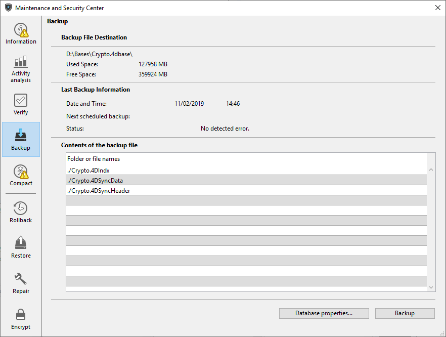

Pode utilizar a página de cópia de segurança para ver alguns parâmetros de cópia de segurança do banco de dados e para iniciar uma cópia de segurança manual:

Esta página é composta pelas três áreas seguintes:

- **Destino do ficheiro de cópia de segurança**: apresenta informações sobre a localização do ficheiro de cópia de segurança da aplicação. Também indica o espaço livre/utilizado no disco de backup.
- **Informações da última cópia de segurança**: fornece a data e a hora da última cópia de segurança (automática ou manual) efetuada na aplicação.
- **Conteúdo do ficheiro de cópia de segurança**: lista os ficheiros e pastas incluídos no ficheiro de cópia de segurança.

O botão **Backup** é utilizado para iniciar uma cópia de segurança manual.

Esta página não pode ser utilizada para modificar os parâmetros de cópia de segurança. Para o fazer, deve clicar no botão **Propriedades da base...**.
