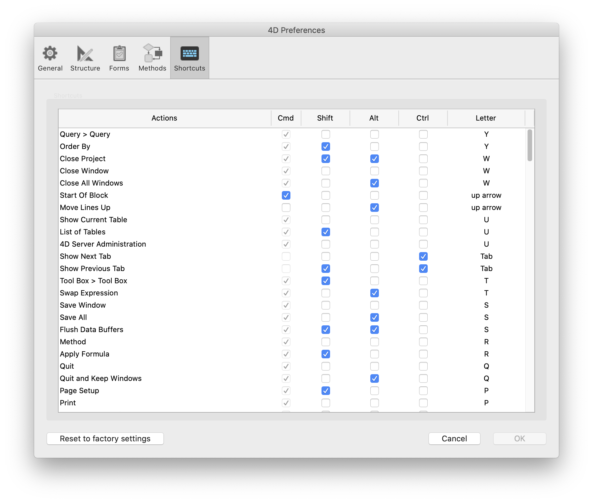

Esta página lista todos os atalhos usados no modo Desenho de 4D (exceto os atalhos padrão do "sistema", como Ctrl+C/Command+C para o comando Copiar).

Para modificar um atalho, pode selecionar/desmarcar o item a modificar (Shift, Alt ou tecla de letra) na lista. Também é possível fazer duplo clique num atalho para o configurar através de uma caixa de diálogo específica.

Note que cada atalho inclui implicitamente a tecla **Ctrl** (Windows) ou **Comando** (macOS).

Se editar esta lista, os suis parâmetros de atalhos personalizados são armazenadas num ficheiro *4DShortcutsvXX.xml*, criado ao mesmo nível que [o ficheiro de preferências do usuário](overview.md#storage). Assim, cada vez que 4D é atualizado, as suas preferências de atalhos de teclado permanecem. 