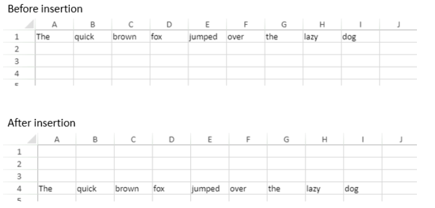
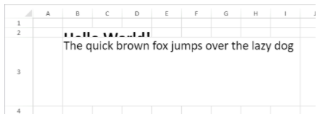
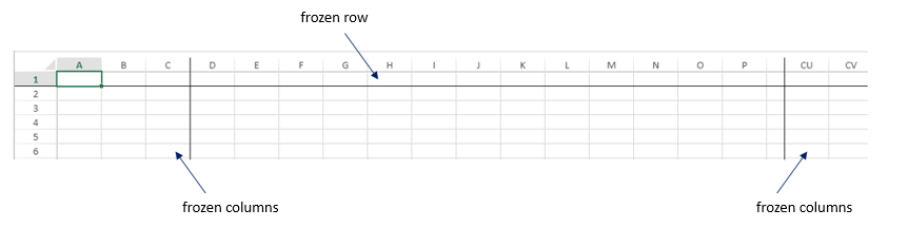

> **Aviso**: os comandos nesta página não são thread-safe.

[A](#a) -
[C](#c) -
[D](#d) -
[E](#e) -
[F](#f) -
[G](#g) -
[I](#i) -
[M](#m) -
[N](#n) -
[O](#o) -
[P](#p) -
[R](#r) -
[S](#s)

## A

### VP ADD FORMULA NAME

<!-- REF #_method_.VP ADD FORMULA NAME.Syntax -->

**VP ADD FORMULA NAME** ( _vpAreaName_ : Text ; _vpFormula_ : Text ; _name_ : Text { ; _options_ : Object } )<!-- END REF -->

<!-- REF #_method_.VP ADD FORMULA NAME.Params -->

| Parâmetro  | Tipo   |    | Descrição                                  |                  |
| ---------- | ------ | -- | ------------------------------------------ | ---------------- |
| vpAreaName | Text   | -> | Nome de objeto formulário área 4D View Pro |                  |
| vpFormula  | Text   | -> | Fórmula 4D View Pro                        |                  |
| name       | Text   | -> | Nome da fórmula                            |                  |
| options    | Object | -> | Opções para a fórmula nomeada              | <!-- END REF --> |

#### Descrição

O comando `VP ADD FORMULA NAME` <!-- REF #_method_.VP ADD FORMULA NAME.Summary -->cria ou modifica uma fórmula nomeada no documento aberto<!-- END REF -->.

> As fórmulas nomeadas criadas por este comando são guardadas com o documento.

Em _vpAreaName_, passe o nome da área 4D View Pro. Se passar um nome que não existe, é devolvido um erro.

Passar a fórmula 4D View Pro que deseja nomear em _vpFormula_. Para obter informações detalhadas sobre a sintaxe da fórmula, consulte a página [Fórmulas e funções] (formulas.md).

Passar o novo nome da fórmula em _name_. Se o nome já estiver a ser utilizado no mesmo âmbito, a nova fórmula nomeada substitui a existente. Note que pode utilizar o mesmo nome para diferentes âmbitos (ver abaixo).

Pode passar um objeto com propriedades adicionais para a fórmula nomeada em _options_. As propriedades abaixo são compatíveis:

| Propriedade | Tipo   | Descrição                                                                                                                                                                                                                                                                                                                                                                                                                                                                  |
| ----------- | ------ | -------------------------------------------------------------------------------------------------------------------------------------------------------------------------------------------------------------------------------------------------------------------------------------------------------------------------------------------------------------------------------------------------------------------------------------------------------------------------- |
| scope       | Number | Escopo da fórmula. Você pode passar o índice da planilha (a contagem começa em 0) ou usar as seguintes constantes: <li>`vk current sheet``vk</li><li> workbook`O</li>escopo determina se o nome de uma fórmula é local para uma determinada planilha (_scope_=sheet index ou `vk current sheet`) ou global para toda a pasta de trabalho (_scope_=`vk workbook`). |
| comment     | Text   | Comentário associado à fórmula nomeada                                                                                                                                                                                                                                                                                                                                                                                                                                     |

#### Exemplo

```4d
VP ADD FORMULA NAME("ViewProArea";"SUM($A$1:$A$10)";"Total2")
```

#### Veja também

[Cell references](formulas.md#cell-references)<br/>[VP Get formula by name](#vp-get-formula-by-name)<br/>[VP Get names](#vp-get-names)

### VP ADD RANGE NAME

<!-- REF #_method_.VP ADD RANGE NAME.Syntax -->

**VP ADD RANGE NAME** ( _rangeObj_ : Object ; _name_ : Text { ; _options_ : Object } )<!-- END REF -->

<!-- REF #_method_.VP ADD RANGE NAME.Params -->

| Parâmetro | Tipo   |    | Descrição                     |                  |
| --------- | ------ | -- | ----------------------------- | ---------------- |
| rangeObj  | Object | -> | Objeto intervalo              |                  |
| name      | Text   | -> | Nome da fórmula               |                  |
| options   | Object | -> | Opções para a fórmula nomeada | <!-- END REF --> |

#### Descrição

O comando `VP ADD RANGE NAME` <!-- REF #_method_.VP ADD RANGE NAME.Summary -->cria ou modifica um intervalo nomeado no documento aberto<!-- END REF -->.

> Os intervalos nomeados criados por este comando são guardados com o documento.

Em _rangeObj_, passe o intervalo que você deseja nomear e, em _name_, passe o novo nome para o intervalo. Se o nome já estiver a ser utilizado no mesmo âmbito, o novo intervalo nomeado substitui o existente. Note que pode utilizar o mesmo nome para diferentes âmbitos (ver abaixo).

Pode passar um objeto com propriedades adicionais para a fórmula nomeada em _options_. As propriedades abaixo são compatíveis:

| Propriedade | Tipo   | Descrição                                                                                                                                                                                                                                                                                                                                                                                                                                                               |
| ----------- | ------ | ----------------------------------------------------------------------------------------------------------------------------------------------------------------------------------------------------------------------------------------------------------------------------------------------------------------------------------------------------------------------------------------------------------------------------------------------------------------------- |
| scope       | Number | Âmbito do intervalo. Você pode passar o índice da planilha (a contagem começa em 0) ou usar as seguintes constantes: <li>`vk current sheet``vk</li><li> workbook`O</li>escopo determina se um nome de intervalo é local em uma determinada planilha (_scope_=sheet index ou `vk current sheet`) ou global em toda a pasta de trabalho (_scope_=`vk workbook`). |
| comment     | Text   | Comentário associado ao intervalo nomeado                                                                                                                                                                                                                                                                                                                                                                                                                               |

> - Um intervalo nomeado é, na verdade, uma fórmula nomeada que contém coordenadas. O `VP ADD RANGE NAME` facilita a criação de intervalos nomeados, mas você também pode usar o método [`VP ADD FORMULA NAME`] (#vp-add-formula-name) para criar intervalos nomeados.
> - As fórmulas que definem intervalos nomeados podem ser recuperadas com o método [`VP Get formula by name`] (#vp-get-formula-by-name).

#### Exemplo

Pretende criar um intervalo nomeado para um intervalo de células:

```4d
$range:=VP Cell("ViewProArea";2;10)
VP ADD RANGE NAME($range;"Total1")
```

#### Veja também

[VP Get names](#vp-get-names)<br/>[VP Name](#vp-name)

### VP ADD SELECTION

<!-- REF #_method_.VP ADD SELECTION.Syntax -->

**VP ADD SELECTION** ( _rangeObj_ : Object )<!-- END REF -->

<!-- REF #_method_.VP ADD SELECTION.Params -->

| Parâmetro | Tipo |    | Descrição        |                  |
| --------- | ---- | -- | ---------------- | ---------------- |
| rangeObj  | Text | -> | Objeto intervalo | <!-- END REF --> |

#### Descrição

O comando `VP ADICIONAR SELECÇÃO` <!-- REF #_method_.VP ADD SELECTION.Sumário --> adiciona as células especificadas às células selecionadas <!-- FIM REF -->.

Em _rangeObj_, passe um objeto intervalo de células a adicionar à seleção atual.

> A célula ativa não é modificada.

#### Exemplo

Tem células atualmente seleccionadas:


O código seguinte adicionará células à sua seleção:

```4d
$currentSelection:=VP Cells("myVPArea";3;4;2;3)
VP ADD SELECTION($currentSelection)
```

Resultados:


#### Veja também

[VP Get active cell](#vp-get-active-cell)<br/>[VP Get selection](#vp-get-selection)<br/>[VP RESET SELECTION](#vp-reset-selection)<br/>[VP SET ACTIVE CELL](#vp-set-active-cell)<br/>[VP SET SELECTION](#vp-set-selection)<br/>[VP SHOW CELL](#vp-show-cell)

### VP ADD SHEET

<!-- REF #_method_.VP ADD SHEET.Syntax -->

**VP ADD SHEET** ( _vpAreaName_ : Text )<br/>**VP ADD SHEET** ( _vpAreaName_ : Text ; _index_ : Integer )<br/>**VP ADD SHEET** ( _vpAreaName_ : Text ; _sheet_ : Integer ; _name_ : Text )<!-- END REF -->

<!-- REF #_method_.VP ADD SHEET.Params -->

| Parâmetro  | Tipo    |    | Descrição                                  |                  |
| ---------- | ------- | -- | ------------------------------------------ | ---------------- |
| vpAreaName | Text    | -> | Nome de objeto formulário área 4D View Pro |                  |
| sheet      | Integer | -> | Índice da nova folha                       |                  |
| name       | Text    | -> | Nome da folha                              | <!-- END REF --> |

#### Descrição

O comando `VP ADD SHEET` <!-- REF #_method_.VP ADD SHEET.Summary -->insere uma folha no documento carregado em _vpAreaName_.<!-- END REF -->

Em _vpAreaName_, passe o nome da área 4D View Pro.

Em _sheet_, você pode passar um índice para a nova planilha. Se o _índice_ passado é inferior a ou igual a 0, o comando insere a nova folha no início. Se _índice_ exceder o número de folhas, o comando insere a nova folha após as já existentes.

> A indexação começa em 0.

Em _name_, pode indicar um nome para a nova folha. O novo nome não pode conter os seguintes caracteres: `*, :, [, ], ?,\,/`

#### Exemplo

O documento tem atualmente 3 folhas:


Para inserir uma folha na terceira posição (índice 2) e chamar-lhe "March":

```4d
VP ADD SHEET("ViewProArea";2;"March")
```


#### Veja também

[VP REMOVE SHEET](#vp-remove-sheet)

### VP ADD SPAN

<!-- REF #_method_.VP ADD SPAN.Syntax -->

**VP ADD SPAN** ( _rangeObj_ : Object )<!-- END REF -->

<!-- REF #_method_.VP ADD SPAN.Params -->

| Parâmetro | Tipo   |    | Descrição        |                  |
| --------- | ------ | -- | ---------------- | ---------------- |
| rangeObj  | Object | -> | Objeto intervalo | <!-- END REF --> |

#### Descrição

O comando `VP ADD SPAN` combina as células em _rangeObj_ como um único intervalo de células.

Em _rangeObj_, passe um objeto de intervalo de células. As células do intervalo são unidas para criar uma célula maior que se estende por várias colunas ou linhas. Você pode passar vários intervalos de células para criar vários intervalos ao mesmo tempo. Note que se os intervalos de células se sobrepuserem, apenas o primeiro intervalo de células é utilizado.

> - Só são apresentados os dados da célula superior esquerda. Os dados nas outras células combinadas ficam ocultos até que a extensão seja removida.
> - Os dados ocultos em células estendidas podem ser acessados por meio de fórmulas (começando com a célula superior esquerda).

#### Exemplo

Para abranger as células do primeiro trimestre e do segundo trimestre nas duas células ao lado delas, e a célula da área sul nas duas linhas abaixo dela:


```4d
 // Intervalo do primeiro trimestre
 $q1:=VP Cells("ViewProArea";2;3;3;1)
 
  // Intervalo do segundo trimestre
 $q2:=VP Cells("ViewProArea";5;3;3;1)
 
  // Intervalo da área sul
 $south:=VP Cells("ViewProArea";0;5;1;3)
 
 VP ADD SPAN(VP Combine ranges($q1;$q2;$south))
```


#### Veja também

[4D View Pro Range Object Properties](getting-started.md#using-range-objects)<br/>[VP Get spans](#vp-get-spans)<br/>[VP REMOVE SPAN](#vp-remove-span)

### VP ADD STYLESHEET

<!-- REF #_method_.VP ADD STYLESHEET.Syntax -->

**VP ADD STYLESHEET** ( _vpAreaName_ : Text ; _styleName_ : Text ; _styleObj_ : Object { ; _sheet_ : Integer } )<!-- END REF -->

<!-- REF #_method_.VP ADD STYLESHEET.Params -->

| Parâmetro  | Tipo    |    | Descrição                                                   |                  |
| ---------- | ------- | -- | ----------------------------------------------------------- | ---------------- |
| vpAreaName | Text    | -> | Nome de objeto formulário área 4D View Pro                  |                  |
| styleName  | Text    | -> | Nome do estilo                                              |                  |
| styleObj   | Object  | -> | Objeto que define as propriedades do atributo               |                  |
| sheet      | Integer | -> | Índice da folha (folha atual se omitida) | <!-- END REF --> |

#### Descrição

O comando `VP ADD STYLESHEET` <!-- REF #_method_.VP ADD STYLESHEET. Resumo -->cria ou modifica a folha de estilo _styleName_ com base na combinação das propriedades especificadas em _styleObj_ no documento aberto <!-- END REF -->. .

> As folhas de estilo criadas por esse comando são salvas com o documento.

Em _vpAreaName_, passe o nome da área 4D View Pro. Se passar um nome que não existe, é devolvido um erro.

O parâmetro _styleName_ permite que você atribua um nome à folha de estilos. Se o nome já estiver sendo usado no mesmo escopo, a nova folha de estilo substituirá a existente. Note que pode utilizar o mesmo nome para diferentes âmbitos (ver abaixo).

No _styleObj_, designe as configurações da folha de estilo (por exemplo, fonte, decoração de texto, alinhamento, bordas etc.). Para obter a lista completa de propriedades de estilo, consulte [Propriedades do objeto de estilo] (configuring.md#style-object-properties).

Você pode designar onde definir a folha de estilos no parâmetro opcional sheet usando o índice da folha (a indexação começa em 0) ou com as seguintes constantes:

- `vk current sheet`
- `vk workbook`

Se uma folha de estilo _styleName_ for definida no nível da pasta de trabalho e em um nível de planilha, o nível da planilha terá prioridade sobre o nível da pasta de trabalho quando a folha de estilo for definida.

Para aplicar a folha de estilo, use os comandos [VP SET DEFAULT STYLE](#vp-set-default-style) ou [VP SET CELL STYLE](#vp-set-cell-style).

#### Exemplo

O seguinte código:

```4d
$styles:=New object
$styles.backColor:="green"
 
//Line Border Object
$borders:=New object("color"; "green"; "style";vk line style medium dash dot)
 
$styles.borderBottom:=$borders
$styles.borderLeft:=$borders
$styles.borderRight:=$borders
$styles.borderTop:=$borders
 
VP ADD STYLESHEET("ViewProArea"; "GreenDashDotStyle";$styles)
 
//Para aplicar o estilo
VP SET CELL STYLE(VP Cells("ViewProArea";1;1;2;2);New object("name"; "GreenDashDotStyle"))
```

criará e aplicará o seguinte objeto estilo denominado _GreenDashDotStyle_:

```
{
 backColor:green,
 borderBottom:{color:green,style:10},
 borderLeft:{color:green,style:10},
 borderRight:{color:green,style:10},
 borderTop:{color:green,style:10}
}
```

#### Veja também

[4D View Pro Style Objects and Style Sheets](configuring.md#style-objects--style-sheets)<br/>[VP Get stylesheet](#vp-get-stylesheet)<br/>[VP Get stylesheets](#vp-get-stylesheets)<br/>[VP REMOVE STYLESHEET](#vp-remove-stylesheet)<br/>[VP SET CELL STYLE](#vp-set-cell-style)<br/>[VP SET DEFAULT STYLE](#vp-set-default-style)

### VP All

<!-- REF #_method_.VP All.Syntax -->

**VP All** ( _vpAreaName_ : Text { ; _sheet_ : Integer } )  : Object<!-- END REF -->

<!-- REF #_method_.VP All.Params -->

| Parâmetro  | Tipo    |    | Descrição                                                   |                  |
| ---------- | ------- | -- | ----------------------------------------------------------- | ---------------- |
| vpAreaName | Text    | -> | Nome de objeto formulário área 4D View Pro                  |                  |
| sheet      | Integer | -> | Índice da folha (folha atual se omitida) |                  |
| Resultados | Object  | <- | Objeto intervalo de todas as células                        | <!-- END REF --> |

#### Descrição

O comando `VP ALL` <!-- REF #_method_.VP All.Summary -->retorna um novo objeto de intervalo que faz referência a todas as células<!-- END REF -->.

Em _vpAreaName_, passe o nome da área 4D View Pro. Se passar um nome que não existe, é devolvido um erro.

No parâmetro opcional _sheet_, pode designar uma folha específica onde o intervalo será definido (a contagem começa em 0). Se omitido ou se você passar `vk current sheet`, a planilha atual será usada.

#### Exemplo

Pretende definir um objeto intervalo para todas as células da folha atual:

```4d
$all:=VP All("ViewProArea") // todas as células da folha atual
```

#### Veja também

[VP Cell](#vp-cell)<br/>[VP Cells](#vp-cells)<br/>[VP Column](#vp-column)<br/>[VP Combine ranges](#vp-combine-ranges)<br/>[VP Name](#vp-name)<br/>[VP Row](#vp-row)

## C

### VP Cell

<!-- REF #_method_.VP Cell.Syntax -->

**VP Cell** ( _vpAreaName_ ; _column_ : Integer ; _row_ : Integer ; Text { ; _sheet_ : Integer } )  : Object<!-- END REF -->

<!-- REF #_method_.VP Cell.Params -->

| Parâmetro  | Tipo    |    | Descrição                                                   |
| ---------- | ------- | -- | ----------------------------------------------------------- |
| vpAreaName | Text    | -> | Nome de objeto formulário área 4D View Pro                  |
| column     | Longint | -> | Índice de coluna                                            |
| row        | Longint | -> | Índice de linha                                             |
| sheet      | Integer | -> | Índice da folha (folha atual se omitida) |
| Resultados | Object  | <- | Objeto intervalo de uma única célula                        |

<!-- END REF -->

#### Descrição

O comando `VP Cell` <!-- REF #_method_.VP Cell.Summary -->retorna um novo objeto de intervalo que faz referência a uma célula específica<!-- END REF -->.

> Este comando destina-se a intervalos de uma única célula. Para criar um objeto de intervalo para várias células, use o comando [VP Cells](#vp-cells).

Em _vpAreaName_, passe o nome da área 4D View Pro. Se passar um nome que não existe, é devolvido um erro.

O parâmetro _column_ define a coluna da posição do intervalo de células. Passe o índice da coluna neste parâmetro.

O parâmetro _row_ define a linha da posição do intervalo de células. Passar o índice da linha neste parâmetro.

No parâmetro opcional _sheet_, você pode indicar o índice da planilha em que o intervalo será definido. Se for omitido ou se passar vk current sheet, é utilizada a folha de cálculo atual.

> a indexação começa em 0.

#### Exemplo

Se quiser definir um objeto de intervalo para a célula mostrada abaixo (na planilha atual):


O código seria:

```4d
$cell:=VP Cell("ViewProArea";2;4) // C5
```

#### Veja também

[VP All](#vp-all)<br/>[VP Cells](#vp-cells)<br/>[VP Column](#vp-column)<br/>[VP Combine ranges](#vp-combine-ranges)<br/>[VP Name](#vp-name)<br/>[VP Row](#vp-row)

### VP Cells

<!-- REF #_method_.VP Cells.Syntax -->

**VP Cells** ( _vpAreaName_ : Text ; _column_: Integer ; _row_: Integer ; _columnCount_ : Integer ; _rowCount_ : Integer { ; _sheet_ : Integer } ) : Object<!-- END REF -->

<details><summary>História</summary>

| Release | Mudanças   |
| ------- | ---------- |
| 17 R4   | Adicionado |

</details>

<!-- REF #_method_.VP Cells.Params -->

| Parâmetro   | Tipo    |    | Descrição                                                   |                  |
| ----------- | ------- | -- | ----------------------------------------------------------- | ---------------- |
| vpAreaName  | Text    | -> | Nome de objeto formulário área 4D View Pro                  |                  |
| column      | Integer | -> | Índice de coluna                                            |                  |
| row         | Integer | -> | Índice de linha                                             |                  |
| columnCount | Integer | -> | Número de colunas                                           |                  |
| rowCount    | Integer | -> | Número de linhas                                            |                  |
| sheet       | Integer | -> | Índice da folha (folha atual se omitida) |                  |
| Resultados  | Object  | <- | Objeto intervalo de células                                 | <!-- END REF --> |

#### Descrição

O comando `VP Cells` <!-- REF #_method_.VP Cells.Summary -->retorna um novo objeto de intervalo que faz referência a células específicas<!-- END REF -->.

Em _vpAreaName_, passe o nome da área 4D View Pro. Se passar um nome que não existe, é devolvido um erro.

O parâmetro _column_ define a primeira coluna do intervalo de células. Passar o índice da coluna (a contagem começa em 0) neste parâmetro. Se o intervalo estiver em várias colunas, você também deverá usar o parâmetro _columnCount_.

No parâmetro _linha_, você pode definir a(s) linha(s) da posição da faixa de célula. Passar o índice da linha (a contagem começa em 0) neste parâmetro. Se o intervalo estiver dentro de várias linhas, você também deverá usar o parâmetro _rowCount_.

O parâmetro _columnCount_ permite que você defina o número total de colunas em que o intervalo se encontra. _columnCount_ deve ser maior que 0.

O parâmetro _rowCount_ permite que você defina o número total de linhas em que o intervalo se encontra. \*rowCount tem de ser superior a 0.

No parâmetro opcional _sheet_, pode designar uma folha específica onde o intervalo será definido (a contagem começa em 0). Se for omitido ou se passar vk current sheet, é utilizada a folha de cálculo atual.

#### Exemplo

Você deseja definir um objeto de intervalo para as seguintes células (na planilha atual):


O código seria:

```4d
$cells:=VP Cells("ViewProArea";2;4;2;3) // C5 a D7
```

#### Veja também

[VP All](#vp-all)<br/>[VP Cells](#vp-cells)<br/>[VP Column](#vp-column)<br/>[VP Combine ranges](#vp-combine-ranges)<br/>[VP Name](#vp-name)<br/>[VP Row](#vp-row)

### VP Column

<!-- REF #_method_.VP Column.Syntax -->

**VP Column** ( _vpAreaName_ : Text ; _column_: Integer ; _columnCount_ : Integer { ; _sheet_ : Integer } ) : Object<!-- END REF -->

<!-- REF #_method_.VP Column.Params -->

| Parâmetro   | Tipo    |    | Descrição                                                   |                  |
| ----------- | ------- | -- | ----------------------------------------------------------- | ---------------- |
| vpAreaName  | Text    | -> | Nome de objeto formulário área 4D View Pro                  |                  |
| column      | Integer | -> | Índice de coluna                                            |                  |
| columnCount | Integer | -> | Número de colunas                                           |                  |
| sheet       | Integer | -> | Índice da folha (folha atual se omitida) |                  |
| Resultados  | Object  | <- | Objeto intervalo de células                                 | <!-- END REF --> |

#### Descrição

O comando `VP Column` <!-- REF #_method_.VP Column.Summary -->retorna um novo objeto de intervalo que faz referência a uma coluna ou colunas específicas<!-- END REF -->.

Em _vpAreaName_, passe o nome da área 4D View Pro. Se passar um nome que não existe, é devolvido um erro.

O parâmetro _column_ define a primeira coluna do intervalo de colunas. Passar o índice da coluna (a contagem começa em 0) neste parâmetro. Se o intervalo contiver várias colunas, você também deverá usar o parâmetro opcional _columnCount_.

O parâmetro opcional _columnCount_ permite que você defina o número total de colunas do intervalo. _columnCount_ deve ser maior que 0. Se for omitido, o valor será definido como 1 por padrão e um intervalo de tipo de coluna será criado.

No parâmetro opcional _sheet_, pode designar uma folha específica onde o intervalo será definido (a contagem começa em 0). Se for omitido ou se passar vk current sheet, é utilizada a folha de cálculo atual.

#### Exemplo

Se quiser definir um objeto de intervalo para a coluna mostrada abaixo (na planilha atual):


O código seria:

```4d
 $column:=VP Column("ViewProArea";3) // coluna D
```

#### Veja também

[VP All](#vp-all)<br/>[VP Cells](#vp-cells)<br/>[VP Column](#vp-column)<br/>[VP Combine ranges](#vp-combine-ranges)<br/>[VP Name](#vp-name)<br/>[VP Row](#vp-row)<br/>[VP SET COLUMN ATTRIBUTES](#vp-set-column-attributes)

### VP COLUMN AUTOFIT

<!-- REF #_method_.VP COLUMN AUTOFIT.Syntax -->

**VP COLUMN AUTOFIT** ( _rangeObj_ : Object )<!-- END REF -->

<!-- REF #_method_.VP COLUMN AUTOFIT.Params -->

| Parâmetro | Tipo   |    | Descrição        |                  |
| --------- | ------ | -- | ---------------- | ---------------- |
| rangeObj  | Object | -> | Objeto intervalo | <!-- END REF --> |

#### Descrição

O comando `VP COLUMN AUTOFIT` <!-- REF #_method_.VP COLUMN AUTOFIT.Summary -->dimensiona automaticamente a(s) coluna(s) em _rangeObj_ de acordo com seu conteúdo<!-- END REF -->.

Em _rangeObj_, passe um objeto de intervalo contendo um intervalo de colunas cujo tamanho será tratado automaticamente.

#### Exemplo

As colunas a seguir são todas do mesmo tamanho e não exibem parte do texto:


Selecionar as colunas e executar este código:

```4d
 VP COLUMN AUTOFIT(VP Get selection("ViewProarea"))
```

... redimensiona as colunas para se adaptarem ao tamanho do conteúdo:


#### Veja também

[VP ROW AUTOFIT](#vp-row-autofit)

### VP Combine ranges

<!-- REF #_method_.VP Combine ranges.Syntax -->

**VP Combine ranges** ( _rangeObj_ : Object ; _otherRangeObj_ : Object {;..._otherRangeObjN_ : Object }  ) : Object<!-- END REF -->

<!-- REF #_method_.VP Combine ranges.Params -->

| Parâmetro     | Tipo   |    | Descrição                                |                  |
| ------------- | ------ | -- | ---------------------------------------- | ---------------- |
| rangeObj      | Object | -> | Objeto intervalo                         |                  |
| otherRangeObj | Object | -> | Objeto intervalo                         |                  |
| Resultados    | Object | <- | Objeto que contém um intervalo combinado | <!-- END REF --> |

#### Descrição

O comando `VP Combine Ranges` <!-- REF #_method_.VP Combine ranges.Summary -->retorna um novo objeto de intervalo que incorpora dois ou mais objetos de intervalo existentes<!-- END REF -->. Todos os intervalos devem ser da mesma área 4D View Pro.

Em _rangeObj_, passe o primeiro objeto de intervalo.

Em _otherRangeObj_, passe outro objeto de intervalo para combinar com _rangeObj_.

> O comando incorpora objetos _rangeObj_ e _otherRangeObj_ por referência.

#### Exemplo

Se quiser combinar objetos de intervalo de células, colunas e linhas em um novo e diferente objeto de intervalo:

```4d
 $cell:=VP Cell("ViewProArea";2;4) // C5
 $column:=VP Column("ViewProArea";3) // coluna D
 $row:=VP Row("ViewProArea";9) // linha 10

 $combine:=VP Combine ranges($cell;$column;$row)
```

#### Veja também

[VP All](#vp-all)<br/>[VP Cells](#vp-cells)<br/>[VP Column](#vp-column)<br/>[VP Combine ranges](#vp-combine-ranges)<br/>[VP Name](#vp-name)<br/>[VP Row](#vp-row)<br/>[VP SET COLUMN ATTRIBUTES](#vp-set-column-attributes)

### VP Convert from 4D View

<!-- REF #_method_.VP Convert from 4D View.Syntax -->

**VP Convert from 4D View** ( _4DViewDocument_ : Blob ) : Object<!-- END REF -->

<!-- REF #_method_.VP Convert from 4D View.Params -->

| Parâmetro      | Tipo   |    | Descrição                          |
| -------------- | ------ | -- | ---------------------------------- |
| 4DViewDocument | Blob   | -> | Documento 4D View                  |
| Resultados     | Object | <- | Objeto 4D View Pro<!-- END REF --> |

#### Descrição

O comando `VP Convert from 4D View` <!-- REF #_method_.VP Convert from 4D View.Summary -->permite que você converta um documento legado do 4D View em um objeto do 4D View Pro<!-- END REF -->.

> Esse comando não exige que o plug-in legado do 4D View esteja instalado em seu ambiente.

No parâmetro _4DViewDocument_, passe uma variável ou campo BLOB que contenha o documento do 4D View a ser convertido. O comando retorna um objeto 4D View Pro no qual todas as informações originalmente armazenadas no documento 4D View são convertidas em atributos 4D View Pro.

#### Exemplo

Se quiser obter um objeto 4D View Pro de uma área 4D View armazenada em um BLOB:

```4d
C_OBJECT($vpObj)
$vpObj:=VP Convert from 4D View($pvblob)
```

### VP Convert to picture

<!-- REF #_method_.VP Convert to picture.Syntax -->

**VP Convert to picture** ( _vpObject_ : Object {; _rangeObj_ : Object} ) : Picture<!-- END REF -->

<!-- REF #_method_.VP Convert to picture.Params -->

| Parâmetro  | Tipo   |    | Descrição                                        |                  |
| ---------- | ------ | -- | ------------------------------------------------ | ---------------- |
| vpObject   | Object | -> | Objeto 4D View Pro que contém a área a converter |                  |
| rangeObj   | Object | -> | Objeto intervalo                                 |                  |
| Resultados | Imagem | <- | Imagem SVG da área                               | <!-- END REF --> |

#### Descrição

O comando `VP Convert to picture` <!-- REF #_method_.VP Convert to picture.Summary -->converte o objeto _vpObject_ do 4D View Pro (ou o intervalo _rangeObj_ dentro de _vpObject_) em uma imagem SVG<!-- END REF -->.

Este comando é útil, por exemplo:

- para incorporar um documento 4D View Pro em outro documento, como um documento 4D Write Pro
- para imprimir um documento do 4D View Pro sem ter que carregá-lo em uma área do 4D View Pro.

Em _vpObject_, passe o objeto 4D View Pro que você deseja converter. Este objeto deve ter sido analisado anteriormente usando [Exportação de VP para objeto](#vp-export-to-object) ou salvo usando [VP EXPORT DOCUMENT](#vp-export-documento).

> O processo de conversão de SVG exige que as expressões e os formatos (cf. [Cell Format](configuring.md#cell-format)) incluídos na área do 4D View Pro sejam avaliados pelo menos uma vez, para que possam ser exportados corretamente. Se você converter um documento que não foi avaliado anteriormente, as expressões ou os formatos poderão ser renderizados de forma inesperada.

Em _rangeObj_, passe um intervalo de células a ser convertido. Por padrão, se esse parâmetro for omitido, todo o conteúdo do documento será convertido.

O conteúdo do documento é convertido com relação aos seus atributos de visualização, incluindo formatos (veja a observação acima), visibilidade de cabeçalhos, colunas e linhas. Há suporte para a conversão dos seguintes elementos:

- Texto: estilo / fonte / tamanho / alinhamento / orientação / rotação / formato
- Fundo da célula: cor / imagem
- Borda das células: espessura / cor / estilo
- Fusão de células
- Imagens
- Altura da linha
- Largura da coluna
- Colunas/linhas ocultas.

> A visibilidade da linha quadriculada depende do atributo definido no documento com [VP SET PRINT INFO](#vp-set-print-info).

#### Resultado

O comando devolve uma imagem em formato SVG.

#### Exemplo

Pretende converter uma área 4D View Pro em SVG, pré-visualizar o resultado e enviá-lo para uma variável imagem:

```4d
C_OBJECT($vpAreaObj)
C_PICTURE($vPict)
$vpAreaObj:=VP Export to object("ViewProArea")
$vPict:=VP Convert to picture($vpAreaObj) //exportar toda a área
```

#### Veja também

[VP EXPORT DOCUMENT](#vp-export-document)<br/>[VP Export to object](#vp-export-to-object)<br/>[VP SET PRINT INFO](#vp-set-print-info)

### VP Copy to object

<details><summary>História</summary>

| Release | Mudanças   |
| ------- | ---------- |
| 19 R4   | Adicionado |

</details>

<!-- REF #_method_.VP Copy to object.Syntax -->

**VP Copy to object** ( _rangeObj_ : Object {; _options_ : Object} ) : Object<!-- END REF -->

<!-- REF #_method_.VP Copy to object.Params -->

| Parâmetro  | Tipo   |    | Descrição                                                   |                  |
| ---------- | ------ | -- | ----------------------------------------------------------- | ---------------- |
| rangeObj   | Object | -> | Objeto intervalo                                            |                  |
| options    | Object | -> | Opções adicionais                                           |                  |
| Resultados | Object | <- | Objecto devolvido. Contém os dados copiados | <!-- END REF --> |

#### Descrição

O comando `VP Copy to object` <!-- REF #_method_.VP Copy to object.Summary -->copia o conteúdo, o estilo e as fórmulas de _rangeObj_ para um objeto<!-- END REF -->.

Em _rangeObj_, passe o intervalo de células com os valores, a formatação e as fórmulas a serem copiadas. Se _rangeObj_ for um intervalo combinado, somente o primeiro será usado.

Você pode passar um parâmetro _options_ opcional com as seguintes propriedades:

| Propriedade | Tipo       | Descrição                                                                                                                                                                                                                                                                                                                                                                                                                                                                                                                                                                                                                                                                                                                                                                                                                                                                                      |
| ----------- | ---------- | ---------------------------------------------------------------------------------------------------------------------------------------------------------------------------------------------------------------------------------------------------------------------------------------------------------------------------------------------------------------------------------------------------------------------------------------------------------------------------------------------------------------------------------------------------------------------------------------------------------------------------------------------------------------------------------------------------------------------------------------------------------------------------------------------------------------------------------------------------------------------------------------------- |
| copy        | Parâmetros | _Verdadeiro_ (padrão) para manter os valores copiados, a formatação e as fórmulas após a execução do comando. _Falso_ para removê-los.                                                                                                                                                                                                                                                                                                                                                                                                                                                                                                                                                                                                                                                                                                      |
| copyOptions | Longint    | Especifica o que é copiado ou movido. Valores possíveis: <p><table><tr><th>Valor</th><th>Descrição</th></tr><tr><td>`vk clipboard options all` (padrão)</td><td>Copia todos os objetos de dados, incluindo valores, formatação e fórmulas.</td></tr><tr><td>`vk clipboard options formatting`</td><td>Copia somente a formatação.</td></tr><tr><td>`vk clipboard options formulas`</td><td>Copia somente as fórmulas.</td></tr><tr><td>`vk clipboard options formulas and formatting`</td><td>Copia as fórmulas e a formatação.</td></tr><tr><td>`vk clipboard options values`</td><td>Copia apenas os valores.</td></tr><tr><td>`vk clipboard options value and formatting`</td><td>Copia os valores e a formatação.</td></tr></table></p> |

As opções de colagem definidas nas [opções](#vp-set-workbook-options) são tomadas em conta.

O comando retorna um objeto que contém os dados copiados.

#### Exemplo

Esse exemplo de código primeiro armazena o conteúdo, os valores, a formatação e as fórmulas de um intervalo em um objeto e, em seguida, cola-os em outro intervalo:

```4d
var $originRange; $targetRange; $dataObject; $options : Object

$originRange:=VP Cells("ViewProArea"; 0; 0; 2; 5)

$options:=New object
$options.copy:=True
$options.copyOptions:=vk clipboard options all

$dataObject:=VP Copy to object($originRange; $options)

$targetRange:=VP Cell("ViewProArea"; 4; 0)
VP PASTE FROM OBJECT($targetRange; $dataObject; vk clipboard options all)
```

#### Veja também

[VP PASTE FROM OBJECT](#vp-paste-from-object)<br/>[VP MOVE CELLS](#vp-move-cells)<br/>[VP Get workbook options](#vp-get-workbook-options)<br/>[VP SET WORKBOOK OPTIONS](#vp-set-workbook-options)

### VP CREATE TABLE

<details><summary>História</summary>

| Release | Mudanças                                                                                                                      |
| ------- | ----------------------------------------------------------------------------------------------------------------------------- |
| 19 R8   | Suporte das opções do tema: `bandColumns`, `bandRows`, `highlightFirstColumn`, `highlightLastColumn`, `theme` |
| 18 R6   | Suporte da opção `allowAutoExpand`                                                                                            |
| 19 R6   | Adicionado                                                                                                                    |

</details>

<!-- REF #_method_.VP CREATE TABLE.Syntax -->

**VP CREATE TABLE** ( _rangeObj_ : Object ; _tableName_ : Text {; _source_ : Text} {; _options_ : cs.ViewPro.TableOptions} )<!-- END REF -->

<!-- REF #_method_.VP CREATE TABLE.Params -->

| Parâmetro | Tipo                                                                               |    | Descrição                                                       |                  |
| --------- | ---------------------------------------------------------------------------------- | -- | --------------------------------------------------------------- | ---------------- |
| rangeObj  | Object                                                                             | -> | Objeto intervalo                                                |                  |
| tableName | Text                                                                               | -> | Nome da tabela                                                  |                  |
| source    | Text                                                                               | -> | Nome da propriedade de contexto de dados a apresentar na tabela |                  |
| options   | [cs.ViewPro.TableOptions](classes.md#tableoptions) | -> | Opções adicionais                                               | <!-- END REF --> |

#### Descrição

O comando `VP CREATE TABLE` <!-- REF #_method_.VP CREATE TABLE.Summary -->cria uma tabela no intervalo especificado<!-- END REF -->. É possível criar uma tabela em um intervalo de células para facilitar o gerenciamento e a análise de um grupo de dados relacionados. Em geral, uma tabela contém dados relacionados em linhas e colunas e aproveita um [contexto de dados] (#vp-set-data-context).


Em _rangeObj_, passe o intervalo de células em que a tabela será criada.

Em _tableName_, passe um nome para a tabela. O nome deve:

- ser único na folha
- incluir pelo menos 5 caracteres
- não incluir espaços ou começar com um número

Em _source_, você pode passar um nome de propriedade de um [contexto de dados] (#vp-set-data-context) para exibir seus dados na tabela. Isto liga a tabela ao contexto de dados. Quando o contexto de dados é atualizado, os dados exibidos na tabela são atualizados de acordo. A propriedade _source_ deve conter uma coleção de objetos e cada elemento representa uma linha.

- Se você não especificar uma _fonte_, o comando cria uma tabela vazia com o tamanho definido em _rangeObj_.
- Se a _fonte_ especificada não puder ser totalmente exibida no documento, nenhuma tabela será criada.

Na classe _opções_, passe um objeto da [classe `cs.ViewPro.TableOptions`](classes.md#tableoptions) que contém as propriedades da tabela a serem definidas.

Dentro do objeto _opções_, a coleção _tableColumns_ determina a estrutura das colunas da tabela. O comprimento da coleção _tableColumns_ deve ser igual à contagem de colunas de intervalo:

- Quando a contagem de colunas no _intervaloObj_ excede o número de colunas em _tableColumns_, a tabela é preenchida com colunas vazias adicionais.
- Quando a contagem de colunas no _intervaloObj_ é inferior ao número de _tableColumns_, a tabela exibe um número de colunas que correspondem ao número de colunas do intervalo.

Se você passar uma opção _source_, mas sem a opção _tableColumn_, o comando gera colunas automaticamente. Nesse caso, _rangeObj_ deve ser uma faixa de célula. Caso contrário, é utilizada a primeira célula do intervalo. Ao gerar colunas automaticamente, as seguintes regras se aplicam:

- Se os dados passados para o comando forem uma coleção de objetos, os nomes das propriedades serão usados como títulos de coluna. Por exemplo:

```4d
([{ LastName: \"Freehafer\", FirstName: \"Nancy\"},{ LastName: \"John\", FirstName: \"Doe\"})
```

Aqui, os títulos das colunas seriam `LastName` e `FirstName`.

- Se os dados passados para o comando forem uma coleção de valores escalares, eles deverão conter uma coleção de subcoleções:

  - A coleção de primeiro nível contém subcoleções de valores. Cada subcolecção define uma linha. Passa uma coleção vazia para saltar uma linha. O número de valores na primeira subcoleção determina quantas colunas são criadas.
  - Os índices das subcoleções são utilizados como títulos das colunas.
  - Cada subcoleção define os valores das células para a linha. Os valores podem ser `Integer`, `Real`, `Boolean`, `Text`, `Date`, `Null`, `Time` ou `Picture`. Um valor `Time` deve ser um objeto que contenha um atributo de tempo, conforme descrito em [VP SET VALUE](#vp-set-value).

> Isto só funciona quando se geram colunas automaticamente. Não é possível usar uma coleção de dados escalares com a opção _tableColumns_.

#### Exemplo

Para criar uma tabela utilizando um contexto de dados:

```4d
// Set a data context
var $data : Object

$data:=New object()
$data.people:=New collection()
$data.people.push(New object("firstName"; "John"; "lastName"; "Smith"; "email"; "johnsmith@gmail.com"))
$data.people.push(New object("firstName"; "Mary"; "lastName"; "Poppins"; "email"; "marypoppins@gmail.com")) VP SET DATA CONTEXT("ViewProArea"; $data)

// Define the columns for the table
var $options : cs. ViewPro. TableOptions

$options:=cs. ViewPro. TableOptions.new()
$options.tableColumns:=New collection()
$options.tableColumns.push(cs. ViewPro. TableColumns.new("name"; "First name"; "dataField"; "firstName"))
$options.tableColumns.push(cs. ViewPro. TableColumns.new("name"; "Last name"; "dataField"; "lastName"))
$options.tableColumns.push(cs. ViewPro. TableColumns.new("name"; "Email"; "dataField"; "email"))

// Create a table from the "people" collection VP CREATE TABLE(VP Cells("ViewProArea"; 1; 1; $options.tableColumns.length; 1); "ContextTable"; "people"; $options)
```

Aqui está o resultado:


#### Veja também

[VP Find table](#vp-find-table)<br/>[VP Get table column attributes](#vp-get-table-column-attributes)<br/>[VP Get table column index](#vp-get-table-column-index)<br/>[VP INSERT TABLE COLUMNS](#vp-insert-table-columns)<br/>[VP INSERT TABLE ROWS](#vp-insert-table-rows)<br/>[VP REMOVE TABLE](#vp-remove-table)<br/>[VP RESIZE TABLE](#vp-resize-table)<br/>[VP SET DATA CONTEXT](#vp-set-data-context)<br/>[VP SET TABLE COLUMN ATTRIBUTES](#vp-set-table-column-attributes)<br/>[VP SET TABLE THEME](#vp-set-table-theme)

## D

### VP DELETE COLUMNS

<!-- REF #_method_.VP DELETE COLUMNS.Syntax -->

**VP DELETE COLUMNS** ( _rangeObj_ : Object )<!-- END REF -->

<!-- REF #_method_.VP DELETE COLUMNS.Params -->

| Parâmetro | Tipo   |    | Descrição        |                  |
| --------- | ------ | -- | ---------------- | ---------------- |
| rangeObj  | Object | -> | Objeto intervalo | <!-- END REF --> |

#### Descrição

O comando `VP DELETE COLUMNS` <!-- REF #_method_.VP DELETE COLUMNS.Summary -->remove as colunas do _rangeObj_<!-- END REF -->.

Em rangeObj, passe um objeto que contenha um intervalo de colunas a remover. Se o intervalo passado contiver:

- tanto colunas como linhas, apenas as colunas são removidas.
- apenas linhas, o comando não faz nada.

> \> > Columns are deleted from right to left.

#### Exemplo

Para eliminar as colunas seleccionadas pelo utilizador (colunas B, C e D da imagem abaixo):


utilizar o seguinte código:

```4d
VP DELETE COLUMNS(VP Get selection("ViewProArea"))
```

#### Veja também

[VP All](#vp-delete-rows)<br/>[VP Cells](#vp-insert-columns)<br/>[VP Column](#vp-insert-rows)

### VP DELETE ROWS

<!-- REF #_method_.VP DELETE ROWS.Syntax -->

**VP DELETE ROWS** ( _rangeObj_ : Object )<!-- END REF -->

<!-- REF #_method_.VP DELETE ROWS.Params -->

| Parâmetro | Tipo   |    | Descrição        |                  |
| --------- | ------ | -- | ---------------- | ---------------- |
| rangeObj  | Object | -> | Objeto intervalo | <!-- END REF --> |

#### Descrição

O comando `VP DELETE ROWS` <!-- REF #_method_.VP DELETE ROWS.Summary -->remove as linhas do _rangeObj_<!-- END REF -->.

Em _rangeObj_, passe um objeto que contenha um intervalo de linhas a remover. Se o intervalo passado contiver:

- tanto colunas como linhas, apenas as linhas são removidas.
- apenas colunas, o comando não faz nada.

> \> > Rows are deleted from bottom to top.

#### Exemplo

Para eliminar as linhas selecionadas pelo usuário (na imagem abaixo, as linhas 1, 2 e 3):


utilizar o seguinte código:

```4d

 VP DELETE ROWS(VP Get selection("ViewProArea"))
```

#### Veja também

[VP All](#vp-delete-columns)<br/>[VP Cells](#vp-insert-columns)<br/>[VP Column](#vp-insert-rows)

## E

### VP EXPORT DOCUMENT

<details><summary>História</summary>

| Release | Mudanças                                   |
| ------- | ------------------------------------------ |
| 20 R2   | Suporte de documentos .sjs |

</details>

<!-- REF #_method_.VP EXPORT DOCUMENT.Syntax -->

**VP EXPORT DOCUMENT** ( _vpAreaName_ : Text ; _filePath_ : Text {; _paramObj_ : Object} )<!-- END REF -->

<!-- REF #_method_.VP EXPORT DOCUMENT.Params -->

| Parâmetro  | Tipo   |    | Descrição                                  |                  |
| ---------- | ------ | -- | ------------------------------------------ | ---------------- |
| vpAreaName | Text   | -> | Nome de objeto formulário área 4D View Pro |                  |
| filePath   | Text   | -> | Caminho do documento                       |                  |
| paramObj   | Object | -> | Opções de exportação                       | <!-- END REF --> |

#### Descrição

O comando `VP EXPORT DOCUMENT` <!-- REF #_method_.VP EXPORT DOCUMENT.Summary -->exporta o objeto do 4D View Pro anexado à área _vpAreaName_ do 4D View Pro para um documento em disco, de acordo com os parâmetros _filePath_ e _paramObj_<!-- END REF -->.

Em _vpAreaName_, passe o nome da área 4D View Pro. Se passar um nome que não existe, é devolvido um erro.

Em filePath, passe o caminho de destino e o nome do documento a ser importado. Se você não especificar um caminho, o documento será salvo no mesmo nível da pasta Project.

Você pode especificar o formato do arquivo exportado incluindo uma extensão após o nome do documento:

- 4D View Pro (".4vp")
- Microsoft Excel (".xlsx")
- PDF (".pdf")
- CSV (".txt", ou ".csv")
- [Documento SpreadJS](https://developer.mescius.com/spreadjs/docs/features/spreadjs-file-format) (".sjs")

Se a extensão não for incluída, mas o formato for especificado em _paramObj_, o arquivo exportado terá a extensão que corresponde ao formato, exceto para o formato CSV (nenhuma extensão é adicionada nesse caso).

O parâmetro opcional _paramObj_ permite que você defina várias propriedades para o objeto exportado do 4D View Pro, bem como inicie um método de retorno de chamada quando a exportação for concluída.

| Propriedade          | Tipo                         | Descrição                                                                                                                                                                                                                                                                                                                                                                                                                                                                                                                                                                                                                                                                                                                                                                                                                                                                                                                                                                                                                                                                                                                                                                                                                                                                                                                                                                                                                         |
| -------------------- | ---------------------------- | --------------------------------------------------------------------------------------------------------------------------------------------------------------------------------------------------------------------------------------------------------------------------------------------------------------------------------------------------------------------------------------------------------------------------------------------------------------------------------------------------------------------------------------------------------------------------------------------------------------------------------------------------------------------------------------------------------------------------------------------------------------------------------------------------------------------------------------------------------------------------------------------------------------------------------------------------------------------------------------------------------------------------------------------------------------------------------------------------------------------------------------------------------------------------------------------------------------------------------------------------------------------------------------------------------------------------------------------------------------------------------------------------------------------------------- |
| format               | text                         | (opcional) Quando presente, designa o formato de arquivo exportado: ".4vp" (padrão), ".csv", ".xlsx", ".pdf" ou ".sjs". Você pode usar as seguintes constantes<li>:`vk 4D View Pro format``vk</li><li> csv format``vk</li><li> MS Excel format</li>``vk<li> pdf</li><li> format``vk sjs format`4D</li>adiciona a extensão apropriada ao nome do arquivo, se necessário. If the format specified doesn't correspond with the extension in _filePath_, it will be added to the end of _filePath_. If a format is not specified and no extension is provided in _filePath_, the default file format is used.                                                                                                                                                                                                                                                                                                                                                                                                                                                                                                                                                                                                   |
| senha                | text                         | Somente Microsoft Excel (opcional) - Senha usada para proteger o documento do MS Excel                                                                                                                                                                                                                                                                                                                                                                                                                                                                                                                                                                                                                                                                                                                                                                                                                                                                                                                                                                                                                                                                                                                                                                                                                                                                                                                         |
| formula              | 4D. Function | Método de retorno de chamada a ser lançado quando a exportação estiver concluída. O uso de um método de retorno de chamada é necessário quando a exportação é assíncrona (que é o caso dos formatos PDF e Excel) se você precisar que algum código seja executado após a exportação. O método de retorno de chamada deve ser passado com o comando [`Formula`](../API/FunctionClass.md#formula). Consulte [Passing a callback method (formula)] (#passing-a-callback-method-formula).                                                                                                                                                                                                                                                                                                                                                                                                                                                                                                                                                                                                                                                                                                                                                                |
| valuesOnly           | boolean                      | Especifica que somente os valores das fórmulas (se houver) serão exportados.                                                                                                                                                                                                                                                                                                                                                                                                                                                                                                                                                                                                                                                                                                                                                                                                                                                                                                                                                                                                                                                                                                                                                                                                                                                                                                                   |
| includeFormatInfo    | boolean                      | Verdadeiro para incluir informações de formatação; caso contrário, falso (o padrão é verdadeiro). As informações de formatação são úteis em alguns casos, por exemplo, para exportação para SVG. Por outro lado, a definição dessa propriedade como False permite reduzir o tempo de exportação.                                                                                                                                                                                                                                                                                                                                                                                                                                                                                                                                                                                                                                                                                                                                                                                                                                                                                                                                                                                                                                                               |
| includeBindingSource | boolean                      | 4DVP e Microsoft Excel apenas. True (padrão) para exportar os valores do contexto de dados atual como valores de célula no documento exportado (os contextos de dados em si não são exportados). Caso contrário, false. Cell binding sempre é exportada. Para o gerenciamento do contexto de dados e da vinculação de células, consulte [VP SET DATA CONTEXT] (#vp-set-data-context) e [VP SET BINDING PATH] (#vp-set-binding-path).                                                                                                                                                                                                                                                                                                                                                                                                                                                                                                                                                                                                                                                                                                                          |
| sheet                | number                       | Somente PDF (opcional) - Índice da planilha a ser exportada (a partir de 0). -2=todas as planilhas visíveis (**padrão**), -1=apenas a planilha atual                                                                                                                                                                                                                                                                                                                                                                                                                                                                                                                                                                                                                                                                                                                                                                                                                                                                                                                                                                                                                                                                                                                                                                                                     |
| pdfOptions           | object                       | PDF apenas (opcional) - Opções para exportação de PDF <p><table><tr><th>Propriedade</th><th>Type</th><th>Descrição</th></tr><tr><td>criador</td><td>texto</td><td>nome do aplicativo que criou o documento original do qual ele foi convertido.</td></tr><tr><td>título</td><td>texto</td><td>título do documento.</td></tr><tr><td>autor</td><td>texto</td><td>nome da pessoa que criou esse documento.</td></tr><tr><td>palavras-chave</td><td>texto</td><td>palavras-chave associadas ao documento.</td></tr><tr><td>Assunto</td><td>text</td><td>assunto do documento.</td></tr></table></p>                                                                                                                                                                                                                                                                                                                                                                                                                                                                                                                                                                                                                                                                                                                               |
| csvOptions           | object                       | Somente CSV (opcional) - Opções para exportação de csv <p><table><tr><th>Propriedade</th><th>Tipo de propriedade</th><th>Descrição</th></tr><tr><td>intervalo</td><td>objeto</td><td>Objeto de intervalo de células</td></tr><tr><td>rowDelimitertext</td><td>Delimitador de linha. Default: "<code>\r\n</code>"</td></tr><tr><td>columnDelimiter</td><td>text</td><td>Column delimiter. Padrão: ","</td></tr></table></p>                                                                                                                                                                                                                                                                                                                                                                                                                                                                                                                                                                                                                                                                                                                                                                                                                                                                                                                     |
| sjsOptions           | object                       | SJS only (optional) - Options for sjs export <p><table><tr><th>Property</th><th>Type</th><th>Description</th></tr><tr><td>includeAutoMergedCells</td><td>boolean</td><td>whether to include the automatically merged cells, default is false.</td></tr><tr><td>includeBindingSource</td><td>boolean</td><td>whether to include the binding source, default is true.</td></tr><tr><td>includeCalcModelCache</td><td>boolean</td><td>whether to include the extra data of calculation. Can be faster when open the file with those data, default is false.</td></tr><tr><td>includeEmptyRegionCells</td><td>boolean</td><td>whether to include any empty cells (cells with no data or only style) outside the used data range, default is true.</td></tr><tr><td>includeFormulas</td><td>boolean</td><td>whether to include the formulas, default is true.</td></tr><tr><td>includeStyles</td><td>boolean</td><td>whether to include the style, default is true.</td></tr><tr><td>includeUnusedNames</td><td>boolean</td><td>whether to include the unused custom names, default is true.</td></tr><tr><td>saveAsView</td><td>boolean</td><td>whether to apply the format string to exporting values, default is false.</td></tr></table></p> |
| _customProperty_     | any                          | Qualquer propriedade personalizada que estará disponível por meio do parâmetro $3 no método de retorno de chamada.                                                                                                                                                                                                                                                                                                                                                                                                                                                                                                                                                                                                                                                                                                                                                                                                                                                                                                                                                                                                                                                                                                                                                                                                                                                                                                |

**Notas sobre o formato Excel**:

- Ao exportar um documento do 4D View Pro para um arquivo no formato Microsoft Excel, algumas configurações podem ser perdidas. Por exemplo, os métodos e fórmulas 4D não são suportados pelo Excel. You can verify other settings with [this list from SpreadJS](https://developer.mescius.com/spreadjs/docs/excelimpexp/excelexport).
- Exporting in this format is run asynchronously, use the `formula` property of the _paramObj_ for code to be executed after the export.

**Notas sobre o formato PDF**:

- Ao exportar um documento do 4D View Pro em PDF, as fontes usadas no documento são automaticamente incorporadas ao arquivo PDF. Somente fontes OpenType (arquivos .OTF ou .TTF) com um mapa Unicode podem ser incorporadas. Se não for encontrado nenhum arquivo de fonte válido para uma fonte, será usada uma fonte padrão.
- Exporting in this format is run asynchronously, use the `formula` property of the _paramObj_ for code to be executed after the export.

**Notas sobre o formato CSV**:

- Ao exportar um documento do 4D View Pro para CSV, algumas configurações podem ser perdidas, pois somente o texto e os valores são salvos.
- Todos os valores são guardados como cadeias de caracteres entre aspas duplas. For more information on delimiter-separated values, see [this article on Wikipedia](https://en.wikipedia.org/wiki/Delimiter-separated_values).
- Exporting in this format is run asynchronously, use the `formula` property of the _paramObj_ for code to be executed after the export.

**Notes about SpreadJS file format**:

- [SpreadJS files](https://developer.mescius.com/spreadjs/docs/features/spreadjs-file-format) are zipped files.
- Exporting in this format is run asynchronously, use the `formula` property of the _paramObj_ for code to be executed after the export.

Once the export operation is finished, `VP EXPORT DOCUMENT` automatically triggers the execution of the method set in the _formula_ property of the _paramObj_, if used.

#### Passagem de um método de retorno de chamada (fórmula)

When including the optional _paramObj_ parameter, the command allows you to use the [`Formula`](../API/FunctionClass.md#formula) command to call a 4D method which will be executed once the export has completed. O método de retorno de chamada receberá os seguintes valores em parâmetros locais:

| Parâmetro |                               | Tipo    | Descrição                                                                    |
| --------- | ----------------------------- | ------- | ---------------------------------------------------------------------------- |
| param1    |                               | text    | The name of the 4D View Pro area object                                      |
| param2    |                               | text    | O caminho do ficheiro do objeto 4D View Pro exportado                        |
| param3    |                               | object  | A reference to the command's _paramObj_                                      |
| param4    |                               | object  | Um objeto devolvido pelo método com uma mensagem de estado                   |
|           | .success      | boolean | True se a exportação for bem sucedida, False caso contrário. |
|           | .errorCode    | integer | Código de erro.                                              |
|           | .errorMessage | text    | Mensagem de erro.                                            |

#### Exemplo 1

Pretende exportar o conteúdo da área "VPArea" para um documento 4D View Pro no disco:

```4d
var $docPath: Text
 
$docPath:="C:\\Bases\\ViewProDocs\\MyExport.4VP"
VP EXPORT DOCUMENT("VPArea";$docPath)
//MyExport.4VP é salvo em seu disco
```

#### Exemplo 2

Pretende exportar a folha atual em PDF:

```4d
var $params: Object
$params:=New object
$params.format:=vk pdf format
$params.sheet:=-1
$params.pdfOptions:=New object("title";"Annual Report";"author";Current user)
VP EXPORT DOCUMENT("VPArea";"report.pdf";$params)
```

#### Exemplo 3

Você deseja exportar um documento do 4D View Pro no formato ".xlsx" e chamar um método que iniciará o Microsoft Excel com o documento aberto após a conclusão da exportação:

```4d
 $params:=New object
 $params.formula:=Formula(AfterExport)
 $params.format:=vp MS Excel format //".xlsx"
 $params.valuesOnly:=True
 
 VP EXPORT DOCUMENT("ViewProArea";"c:\\tmp\\convertedfile";$params)
```

Método _**AfterExport**_:

```4d
 #DECLARE($areaName : Text ; $filePath : Text ; $params : Object ; $status : Object )
 
 If($status.success=False)
    ALERT($status.errorMessage)
 Else
    LAUNCH EXTERNAL PROCESS("C:\\Program Files\\Microsoft Office\\Office15\\excel "+$filePath)
 End if
```

#### Exemplo

You want to export the current sheet to a `.txt` file with pipe-separated values:


```4d
var $params : Object
$params:=New object
$params.range:=VP Cells("ViewProArea";0;0;2;5)
$params.rowDelimiter:="\n"
$params.columnDelimiter:="|" VP EXPORT DOCUMENT("ViewProArea";"c:\\tmp\\data.txt";New object("format";vk csv format;"csvOptions";$params))
```

Aqui está o resultado:


#### Veja também

[VP Convert to picture](#vp-convert-to-picture)<br/>[VP Export to object](#vp-export-to-object)<br/>[VP Column](#vp-import-document)<br/>[VP Print](#vp-print)

### VP EXPORT TO BLOB

<!-- REF #_method_.VP EXPORT TO BLOB.Syntax -->

**VP EXPORT TO BLOB** ( _vpAreaName_ : Text ; _paramObj_ : Object ) <!-- END REF -->

<!-- REF #_method_.VP EXPORT TO BLOB.Params -->

| Parâmetro  | Tipo   |    | Descrição                                  |                  |
| ---------- | ------ | -- | ------------------------------------------ | ---------------- |
| vpAreaName | Text   | -> | Nome de objeto formulário área 4D View Pro |                  |
| paramObj   | Object | -> | Opções de exportação                       | <!-- END REF --> |

#### Descrição

The `VP EXPORT TO BLOB` command <!-- REF #_method_.VP EXPORT TO BLOB.Summary -->exports the _vpAreaName_ 4D View Pro document in a 4D.Blob according to the _paramObj_ options.<!-- END REF --> The exported blob is available through the export callback. A exportação e importação de áreas do 4D View Pro como blobs é rápida e eficiente em termos de memória.

In _paramObj_, you can pass several properties:

| Propriedade             | Tipo                         | Descrição                                                                                                                                                                                                                                                                                                                         |
| ----------------------- | ---------------------------- | --------------------------------------------------------------------------------------------------------------------------------------------------------------------------------------------------------------------------------------------------------------------------------------------------------------------------------- |
| formula                 | 4D. Function | (obrigatório) Método de retorno de chamada a ser lançado quando a exportação estiver concluída. Consulte [Passing a callback method (formula)] (#passing-a-callback-method-formula). |
| includeAutoMergedCells  | Parâmetros                   | Se deve incluir as células mescladas automaticamente ao salvar; padrão=falso.                                                                                                                                                                                                                                     |
| includeBindingSource    | Parâmetros                   | Se deve incluir a fonte de vinculação ao salvar, padrão = true.                                                                                                                                                                                                                                                   |
| includeCalcModelCache   | Parâmetros                   | Se deve incluir os dados extras de cálculo. Pode afetar a velocidade de abertura do arquivo; padrão=false.                                                                                                                                                                                        |
| includeEmptyRegionCells | Parâmetros                   | Se devem ser incluídas células vazias (células sem dados ou apenas com estilo) fora do intervalo de dados usado, default=true                                                                                                                                                                                  |
| includeFormulas         | Parâmetros                   | Se a fórmula deve ser incluída ao salvar, padrão = true.                                                                                                                                                                                                                                                          |
| includeStyles           | Parâmetros                   | Se deve incluir o estilo ao salvar, padrão=true.                                                                                                                                                                                                                                                                  |
| includeUnusedNames      | Parâmetros                   | Se deve incluir o nome personalizado não utilizado ao salvar, padrão=true.                                                                                                                                                                                                                                        |

|saveAsView|Boolean|Whether to apply the format string to exporting value when saving, default=false.|

Os seguintes parâmetros podem ser usados no método de retorno de chamada:

| Parâmetro |                               | Tipo                    | Descrição                                                                    |
| :-------- | :---------------------------- | :---------------------- | :--------------------------------------------------------------------------- |
| param1    |                               | text                    | O nome do objeto 4D View Pro                                                 |
| param2    |                               | 4D.blob | O blob exportado                                                             |
| param3    |                               | object                  | A reference to the command's _paramObj_ parameter                            |
| param4    |                               | object                  | Um objeto devolvido pelo método com uma mensagem de estado                   |
|           | .success      | boolean                 | True se a exportação for bem sucedida, False caso contrário. |
|           | .errorCode    | integer                 | Código de erro.                                              |
|           | .errorMessage | text                    | Mensagem de erro.                                            |

#### Exemplo

O comando `VP EXPORT TO BLOB` é assíncrono. Você deve criar um método de retorno de chamada (denominado _VPBlobCallback_ em nosso exemplo) para usar os resultados da exportação.

```4d
//Exportar o documento VP
VP EXPORT TO BLOB("ViewProArea"; {formula: Formula(VPBlobCallback)})
```

```4d
//Método VPBlobCallback
#DECLARE($area : Text; $data : 4D.Blob; $parameters : Object; $status : Object)
var $myEntity : cs.myTableEntity

If ($status.success)
   // Save the document in a table
   $myEntity:=ds.myTable.new()
   $myEntity.blob:=$data
   $myEntity.save()
End if

```

#### Veja também

[VP IMPORT FROM BLOB](#vp-import-from-blob)

### VP Export to object

<!-- REF #_method_.VP Export to object.Syntax -->

**VP Export to object** ( _vpAreaName_ : Text {; _options_ : Object} ) : Object<!-- END REF -->

<!-- REF #_method_.VP Export to object.Params -->

| Parâmetro  | Tipo   |    | Descrição                                  |                  |
| ---------- | ------ | -- | ------------------------------------------ | ---------------- |
| vpAreaName | Text   | -> | Nome de objeto formulário área 4D View Pro |                  |
| options    | Object | -> | Opções de exportação                       |                  |
| Resultados | Object | <- | Objecto 4D View Pro                        | <!-- END REF --> |

#### Descrição

The `VP Export to object` command <!-- REF #_method_.VP Export to object.Summary --> returns the 4D View Pro object attached to the 4D View Pro area _vpAreaName_<!-- END REF -->. Você pode usar esse comando, por exemplo, para armazenar a área do 4D View Pro em um campo de objeto do banco de dados 4D.

Em _vpAreaName_, passe o nome da área 4D View Pro. Se passar um nome que não existe, é devolvido um erro.

In the _options_ parameter, you can pass the following export options, if required:

| Propriedade          | Tipo       | Descrição                                                                                                                                                                                                                                                                                                                                            |
| -------------------- | ---------- | ---------------------------------------------------------------------------------------------------------------------------------------------------------------------------------------------------------------------------------------------------------------------------------------------------------------------------------------------------- |
| includeFormatInfo    | Parâmetros | Verdadeiro (padrão) para incluir informações de formatação; caso contrário, falso. As informações de formatação são úteis em alguns casos, por exemplo, para exportação para SVG. Por outro lado, a definição dessa propriedade como False permite reduzir o tempo de exportação. |
| includeBindingSource | Parâmetros | True (padrão) para exportar os valores do contexto de dados atual como valores de célula no objeto exportado (os contextos de dados em si não são exportados). Caso contrário, false. Cell binding sempre é exportada.                                         |

For more information on 4D View Pro objects, please refer to the [4D View Pro object](configuring.md#4d-view-pro-object) paragraph.

#### Exemplo 1

Você deseja obter a propriedade "version" da área atual do 4D View Pro:

```4d
var $vpAreaObj : Object
var $vpVersion : Number
$vpAreaObj:=VP Export to object("vpArea")
 // $vpVersion:=OB Get($vpAreaObj;"version")
$vpVersion:=$vpAreaObj.version
```

#### Exemplo 2

Pretende-se exportar a área, excluindo a informação de formatação:

```4d
var $vpObj : Object
$vpObj:=VP Export to object("vpArea";New object("includeFormatInfo";False))
```

#### Veja também

[VP Convert to picture](#vp-convert-to-picture)<br/>[VP EXPORT DOCUMENT](#vp-export-document)<br/>[VP IMPORT FROM OBJECT](#vp-import-from-object)

## F

### VP Find

<!-- REF #_method_.VP Find.Syntax -->

**VP Find** (  _rangeObj_ : Object ; _searchValue_ : Text ) : Object<br/>**VP Find** (  _rangeObj_ : Object ; _searchValue_ : Text ; _searchCondition_ : Object } ) : Object<br/>**VP Find** (  _rangeObj_ : Object ; _searchValue_ : Text ; _searchCondition_ : Object ; _replaceValue_ : Text ) : Object<!-- END REF -->

<!-- REF #_method_.VP Find.Params -->

| Parâmetro       | Tipo   |    | Descrição                                                      |                  |
| --------------- | ------ | -- | -------------------------------------------------------------- | ---------------- |
| rangeObj        | Object | -> | Objeto intervalo                                               |                  |
| searchValue     | Text   | -> | Valor da pesquisa                                              |                  |
| searchCondition | Object | -> | Objeto que contém condição(ões) de pesquisa |                  |
| replaceValue    | Text   | -> | Valor de substituição                                          |                  |
| Resultados      | Object | <- | Objeto intervalo                                               | <!-- END REF --> |

#### Descrição

O comando `VP Find` <!-- REF #_method_.VP Find.Summary -->pesquisa o _rangeObj_ para o _searchValue_<!-- END REF -->. Podem ser utilizados parâmetros opcionais para refinar a pesquisa e/ou substituir quaisquer resultados encontrados.

In the _rangeObj_ parameter, pass an object containing a range to search.

The _searchValue_ parameter lets you pass the text to search for within the _rangeObj_.

You can pass the optional _searchCondition_ parameter to specify how the search is performed. As propriedades abaixo são compatíveis:

| Propriedade | Tipo       | Descrição                                                                                                                                                                                                                                                                                                                                                                                                                                                                                                                                                                                                                                                                                                                                                                                                                                                                                                                          |
| ----------- | ---------- | ---------------------------------------------------------------------------------------------------------------------------------------------------------------------------------------------------------------------------------------------------------------------------------------------------------------------------------------------------------------------------------------------------------------------------------------------------------------------------------------------------------------------------------------------------------------------------------------------------------------------------------------------------------------------------------------------------------------------------------------------------------------------------------------------------------------------------------------------------------------------------------------------------------------------------------- |
| afterColumn | Integer    | O número da coluna imediatamente anterior à coluna inicial da pesquisa. If the _rangeObj_ is a combined range, the column number given must be from the first range. Default value: -1 (beginning of the _rangeObj_)                                                                                                                                                                                                                                                                                                                                                                                                                                                                                                                                                                                                                                            |
| afterRow    | Integer    | O número da linha imediatamente anterior à linha inicial da pesquisa. If the _rangeObj_ is a combined range, the row number given must be from the first range. Default value: -1 (beginning of the _rangeObj_)                                                                                                                                                                                                                                                                                                                                                                                                                                                                                                                                                                                                                                                 |
| all         | Parâmetros | <li>True - All cells in *rangeObj* corresponding to *searchValue* are returned</li><li>False - (default value) Only the first cell in *rangeObj* corresponding to *searchValue* is returned</li>                                                                                                                                                                                                                                                                                                                                                                                                                                                                                                                                                                                                                                                                                                                                   |
| flags       | Integer    | <table><tr><td>`vk find flag exact match`</td><td>The entire content of the cell must completely match the search value</td></tr><tr><td>`vk find flag ignore case`</td><td>Capital and lower-case letters are considered the same. Ex: "a" is the same as "A".</td></tr><tr><td>`vk find flag none`</td><td>no search flags are considered (default)</td></tr><tr><td>`vk find flag use wild cards`</td><td>Wildcard characters (\*,?) pode ser usado na string de pesquisa. Wildcard characters can be used in any string comparison to match any number of characters:<li>\* for zero or multiple characters (for example, searching for "bl*"  can find "bl", "black", or "blob")</li><li>? for a single character (for example, searching for "h?t" can find "hot", or "hit"</li></td></tr></table>These flags can be combined. For example: <code>$search.flags:=vk find flag use wild cards+vk find flag ignore case</code> |
| order       | Integer    | <table><tr><td>`vk find order by columns`</td><td>The search is performed by columns. Each row of a column is searched before the search continues to the next column.</td></tr><tr><td>`vk find order by rows`</td><td>The search is performed by rows. Each column of a row is searched before the search continues to the next row (default)</td></tr></table>                                                                                                                                                                                                                                                                                                                                                                                                                                                                                                                                                                  |
| target      | Integer    | <table><tr><td>`vk find target formula`</td><td>The search is performed in the cell formula</td></tr><tr><td>`vk find target tag`</td><td>The search is performed in the cell tag</td></tr><tr><td>`vk find target text`</td><td>The search is performed in the cell text (default)</td></tr></table><p>These flags can be combined. For example:<code>$search.target:=vk find target formula+vk find target text</code></p>                                                                                                                                                                                                                                                                                                                                                                                                                                                                                                       |

In the optional _replaceValue_ parameter, you can pass text to take the place of any instance of the text in _searchValue_ found in the _rangeObj_.

#### Objecto devolvido

A função retorna um objeto de intervalo que descreve cada valor de pesquisa que foi encontrado ou substituído. É devolvido um objeto de intervalo vazio se não forem encontrados resultados.

#### Exemplo 1

Para encontrar a primeira célula que contém a palavra "Total":

```4d
var $range;$result : Object
 
$range:=VP All("ViewProArea")
 
$result:=VP Find($range;"Total")
```

#### Exemplo 2

Para encontrar "Total" e substituí-lo por "Total geral":

```4d
var $range;$condition;$result : Object
 
$range:=VP All("ViewProArea")
 
$condition:=New object
$condition.target:=vk find target text
$condition.all:=True //Search entire document
$condition.flags:=vk find flag exact match
 
  // Replace the cells containing only 'Total' in the current sheet with "Grand Total"


$result:=VP Find($range;"Total";$condition;"Grand Total")
 
  // Check for empty range object 
If($result.ranges.length=0)
    ALERT("No result found")
Else
    ALERT($result.ranges.length+" results found")
End if
```

### VP Find table

<details><summary>História</summary>

| Release | Mudanças   |
| ------- | ---------- |
| 18 R6   | Adicionado |

</details>

<!-- REF #_method_.VP Find table.Syntax -->

**VP Find table** ( _rangeObj_ : Object ) : Text<!-- END REF -->

<!-- REF #_method_.VP Find table.Params -->

| Parâmetro  | Tipo   |    | Descrição            |                  |
| ---------- | ------ | -- | -------------------- | ---------------- |
| rangeObj   | Object | -> | Intervalo de células |                  |
| Resultados | Text   | <- | Nome da tabela       | <!-- END REF --> |

#### Descrição

The `VP Find table` command <!-- REF #_method_.VP Find table.Summary -->returns the name of the table to which to the _rangeObj_ cell belongs<!-- END REF -->.

In _rangeObj_, pass a cell range object. Se as células designadas não pertencerem a uma tabela, o comando retornará uma string vazia.

If _rangeObj_ is not a cell range or contains multiple ranges, the first cell of the first range is used.

#### Exemplo

```4d
If (FORM Event.code=On After Edit && FORM Event.action="valueChanged")
     $tableName:=VP Find table(FORM Event.range)
     If ($tableName#"")
         ALERT("The "+$tableName+" table has been modified.")
     End if 
End if
```

#### Veja também

[VP Get table range](#vp-get-table-range)

### VP FLUSH COMMANDS

<!-- REF #_method_.VP FLUSH COMMANDS.Syntax -->

**VP FLUSH COMMANDS** (  _vpAreaName_ : Text )<!-- END REF -->

<!-- REF #_method_.VP FLUSH COMMANDS.Params -->

| Parâmetro  | Tipo |    | Descrição                                  |                  |
| ---------- | ---- | -- | ------------------------------------------ | ---------------- |
| vpAreaName | Text | -> | Nome de objeto formulário área 4D View Pro | <!-- END REF --> |

#### Descrição

The `VP FLUSH COMMANDS` command <!-- REF #_method_.VP FLUSH COMMANDS.Summary -->immediately executes stored commands and clears the command buffer<!-- END REF -->.

Em _vpAreaName_, passe o nome da área 4D View Pro. Se passar um nome que não existe, é devolvido um erro.

Para aumentar o desempenho e reduzir o número de solicitações enviadas, os comandos do 4D View Pro chamados pelo desenvolvedor são armazenados em um buffer de comando. Quando chamado, `VP FLUSH COMMANDS` executa os comandos como um lote ao sair do método e esvazia o conteúdo do buffer de comandos.

#### Exemplo

Você deseja rastrear a execução dos comandos e esvaziar o buffer de comandos:

```4d

 VP SET TEXT VALUE(VP Cell("ViewProArea1";10;1);"INVOICE")
 VP SET TEXT VALUE(VP Cell("ViewProArea1";10;2);"Invoice date: ")
 VP SET TEXT VALUE(VP Cell("ViewProArea1";10;3);"Due date: ")
 
 VP FLUSH COMMANDS(("ViewProArea1")
 TRACE
```

### VP Font to object

<!-- REF #_method_.VP Font to object.Syntax -->

**VP Font to object** (  _font_ : Text ) : Object<!-- END REF -->

<!-- REF #_method_.VP Font to object.Params -->

| Parâmetro  | Tipo   |    | Descrição                               |
| ---------- | ------ | -- | --------------------------------------- |
| font       | Text   | -> | Cadeia de caracteres abreviada da fonte |
| Resultados | Object | <- | Objecto letra                           |

<!-- END REF -->

#### Descrição

The `VP Font to object` utility command <!-- REF #_method_.VP Font to object.Summary -->returns an object from a font shorthand string<!-- END REF -->. Esse objeto pode ser usado para definir ou obter configurações de propriedade de fonte por meio de notação de objeto.

In the _font_ parameter, pass a font shorthand string to specify the different properties of a font (e.g., "12 pt Arial"). You can learn more about font shorthand strings [in this page](https://www.w3schools.com/cssref/pr_font_font.asp) for example.

O objeto retornado contém atributos de fonte definidos como propriedades. For more information about the available properties, see the [VP Object to font](#vp-object-to-font) command.

#### Exemplo 1

Este código:

```4d
$font:=VP Font to object("16pt arial")
```

devolverá o seguinte objeto $font:

```4d
{

family:arial
size:16pt
}
```

#### Exemplo 2

Veja um exemplo para [`VP Object to font`](#vp-object-to-to-font).

#### Veja também

[4D View Pro Style Objects and Style Sheets](configuring.md#style-objects--style-sheets)<br/>[VP Object to font](#vp-object-to-font)<br/>[VP SET CELL STYLE](#vp-set-cell-style)<br/>[VP SET DEFAULT STYLE](#vp-set-default-style)

## G

### VP Get active cell

<!-- REF #_method_.VP Get active cell.Syntax -->

**VP Get active cell** (  _vpAreaName_ : Text { ; _sheet_ : Integer } ) : Object<!-- END REF -->

<!-- REF #_method_.VP Get active cell.Params -->

| Parâmetro  | Tipo    |    | Descrição                                                   |                  |
| ---------- | ------- | -- | ----------------------------------------------------------- | ---------------- |
| vpAreaName | Text    | -> | Nome de objeto formulário área 4D View Pro                  |                  |
| sheet      | Integer | -> | Índice da folha (folha atual se omitida) |                  |
| Resultados | Object  | <- | Objeto intervalo de uma única célula                        | <!-- END REF --> |

#### Descrição

The `VP Get active cell` command <!-- REF #_method_.VP Get active cell.Summary -->returns a new range object referencing the cell which has the focus and where new data will be entered (the active cell)<!-- END REF -->.

Em _vpAreaName_, passe o nome da área 4D View Pro. Se passar um nome que não existe, é devolvido um erro.

No parâmetro opcional _sheet_, pode designar uma folha específica onde o intervalo será definido (a contagem começa em 0). Se omitido ou se você passar `vk current sheet`, a planilha atual será usada.

#### Exemplo


O código seguinte irá obter as coordenadas da célula ativa:

```4d
$activeCell:=VP Get active cell("myVPArea")
 
  //returns a range object containing: 
  //$activeCell.ranges[0].column=3
  //$activeCell.ranges[0].row=4
  //$activeCell.ranges[0].sheet=0
```

#### Veja também

[VP ADD SELECTION](#vp-add-selection)<br/>[VP Get selection](#vp-get-selection)<br/>[VP RESET SELECTION](#vp-reset-selection)<br/>[VP SET ACTIVE CELL](#vp-set-active-cell)<br/>[VP SET SELECTION](#vp-set-selection)<br/>[VP SHOW CELL](#vp-show-cell)

### VP Get binding path

<details><summary>História</summary>

| Release | Mudanças   |
| ------- | ---------- |
| 19 R5   | Adicionado |

</details>

<!-- REF #_method_.VP Get binding path.Syntax -->

**VP Get binding path** ( _rangeObj_ : Object ) : Text<!-- END REF -->

<!-- REF #_method_.VP Get binding path.Params -->

| Parâmetro  | Tipo   |    | Descrição                               |                  |
| ---------- | ------ | -- | --------------------------------------- | ---------------- |
| rangeObj   | Object | -> | Objeto intervalo                        |                  |
| Resultados | Text   | <- | Name of the attribute bound to the cell | <!-- END REF --> |

#### Descrição

The `VP Get binding path` command <!-- REF #_method_.VP Get binding path.Summary -->returns the name of the attribute bound to the cell specified in _rangeObj_<!-- END REF -->.

In _rangeObj_, pass an object that is either a cell range or a combined range of cells. Note que:

- If _rangeObj_ is a range with several cells, the command returns the attribute name linked to the first cell in the range.
- If _rangeObj_ contains several ranges of cells, the command returns the attribute name linked to the first cell of the first range.

#### Exemplo

```4d
var $p; $options : Object
var $myAttribute : Text

$p:=New object
$p.firstName:="Freehafer"
$p.lastName:="Nancy" VP SET DATA CONTEXT("ViewProArea"; $p) VP SET BINDING PATH(VP Cell("ViewProArea"; 0; 0); "firstName")
VP SET BINDING PATH(VP Cell("ViewProArea"; 1; 0); "lastName")

$myAttribute:=VP Get binding path(VP Cell("ViewProArea"; 1; 0)) // "lastName"
```

#### Veja também

[VP SET BINDING PATH](#vp-set-binding-path)<br/>[VP Get data context](#vp-get-data-context)<br/>[VP SET DATA CONTEXT](#vp-get-data-context)

### VP Get cell style

<!-- REF #_method_.VP Get cell style.Syntax -->

**VP Get cell style** (  _rangeObj_ : Object ) : Object<!-- END REF -->

<!-- REF #_method_.VP Get cell style.Params -->

| Parâmetro  | Tipo   |    | Descrição        |                  |
| ---------- | ------ | -- | ---------------- | ---------------- |
| rangeObj   | Object | -> | Objeto intervalo |                  |
| Resultados | Object | <- | Objecto estilo   | <!-- END REF --> |

#### Descrição

The `VP Get cell style` command <!-- REF #_method_.VP Get cell style.Summary -->returns a [style object](configuring.md#style-objects) for the first cell in the _rangeObj_<!-- END REF -->.

In _rangeObj_, pass a range containing the style to retrieve.

- If _rangeObj_ contains a cell range, the cell style is returned.

- If _rangeObj_ contains a range that is not a cell range, the style of the first cell in the range is returned.

- If _rangeObj_ contains several ranges, only the style of the first cell in the first range is returned.

#### Exemplo

Para obter os detalhes sobre o estilo na célula selecionada (B2):


Este código:

```4d
$cellStyle:=VP Get cell style(VP Get selection("myDoc"))
```

... devolverá este objecto:

```4d
{
  "backColor":"Azure",
  "borderBottom":
   {
     "color":#800080,
     "style":5
   }
  "font":"8pt Arial",
  "foreColor":"red",
  "hAlign":1,
  "isVerticalText":"true",
  "vAlign":0
}
```

#### Veja também

[VP GET DEFAULT STYLE](#vp-get-default-style)<br/>[VP SET CELL STYLE](#vp-set-cell-style)

### VP Get column attributes

<!-- REF #_method_.VP Get column attributes.Syntax -->

**VP Get column attributes** (  _rangeObj_ : Object ) : Collection<!-- END REF -->

<!-- REF #_method_.VP Get column attributes.Params -->

| Parâmetro  | Tipo       |    | Descrição                          |                  |
| ---------- | ---------- | -- | ---------------------------------- | ---------------- |
| rangeObj   | Object     | -> | Objeto intervalo                   |                  |
| Resultados | Collection | <- | Coleção de propriedades da colunas | <!-- END REF --> |

#### Descrição

The `VP Get column attributes` command <!-- REF #_method_.VP Get column attributes.Summary -->returns a collection of properties for any column in the _rangeObj_<!-- END REF -->.

In _rangeObj_, pass an object containing a range of the columns whose attributes will be retrieved.

The returned collection contains any properties for the columns, whether or not they have been set by the [VP SET COLUMN ATTRIBUTES](#vp-set-column-attributes) command.

#### Exemplo

O seguinte código:

```4d
C_OBJECT($range)
C_COLLECTION($attr)
 
$range:=VP Column("ViewProArea";1;2)
$attr:=VP Get column attributes($range)
```

... will return a collection of the attributes within the given range:


#### Veja também

[VP Get row attributes](#vp-get-row-attributes)<br/>[VP SET COLUMN ATTRIBUTES](#vp-set-column-attributes)<br/>[VP SET ROW ATTRIBUTES](#vp-set-row-attributes)

### VP Get column count

<!-- REF #_method_.VP Get column count.Syntax -->

**VP Get column count** ( _vpAreaName_ : Text { ; _sheet_ :  Integer } ) : Integer<!-- END REF -->

<!-- REF #_method_.VP Get column count.Params -->

| Parâmetro  | Tipo    |    | Descrição                                                   |                  |
| ---------- | ------- | -- | ----------------------------------------------------------- | ---------------- |
| vpAreaName | Text    | -> | Nome da área 4D View Pro no formulário                      |                  |
| sheet      | Integer | -> | Índice da folha (folha atual se omitida) |                  |
| Resultados | Integer | <- | Número total de colunas                                     | <!-- END REF --> |

#### Descrição

The `VP Get column count` command <!-- REF #_method_.VP Get column count.Summary -->returns the total number of columns from the designated _sheet_<!-- END REF -->.

Em _vpAreaName_, passe o nome da propriedade da área 4D View Pro. Se passar um nome que não existe, é devolvido um erro.

You can define where to get the column count in the optional _sheet_ parameter using the sheet index (counting begins at 0). Se omitido ou se você passar `vk current sheet`, a planilha atual será usada.

#### Exemplo

O código seguinte retorna o número de colunas na área 4D View Pro:

```4d
C_INTEGER($colCount)
$colCount:=VP Get column count("ViewProarea")
```

#### Veja também

[VP Get row count](#vp-get-row-count)<br/>[VP SET COLUMN COUNT](#vp-set-column-count)<br/>[VP SET ROW COUNT](#vp-set-row-count)

### VP Get current sheet

<!-- REF #_method_.VP Get current sheet.Syntax -->

**VP Get current sheet** ( _vpAreaName_ : Text )<!-- END REF -->

<!-- REF #_method_.VP Get current sheet.Params -->

| Parâmetro  | Tipo    |    | Descrição                                  |                  |
| ---------- | ------- | -- | ------------------------------------------ | ---------------- |
| vpAreaName | Text    | -> | Nome de objeto formulário área 4D View Pro |                  |
| Resultado  | Integer | <- | Índice da folha actual                     | <!-- END REF --> |

#### Descrição

The `VP Get current sheet` command <!-- REF #_method_.VP Get current sheet.Summary -->returns the index of the current sheet in _vpAreaName_. The current sheet is the selected sheet in the document.<!-- END REF -->

Em _vpAreaName_, passe o nome da área 4D View Pro.

> A indexação começa em 0.

#### Exemplo

Quando a terceira folha é selecionada:


O comando devolve 2:

```4d
$index:=VP Get current sheet("ViewProArea")
```

#### Veja também

[VP SET CURRENT SHEET](#vp-set-current-sheet)

### VP Get data context

<details><summary>História</summary>

| Release | Mudanças   |
| ------- | ---------- |
| 19 R5   | Adicionado |

</details>

<!-- REF #_method_.VP Get data context.Syntax -->

**VP Get data context** ( _vpAreaName_ : Text {; _sheet_ : Integer } ) : Object<br/>**VP Get data context** ( _vpAreaName_ : Text {; _sheet_ : Integer } ) : Collection<!-- END REF -->

<!-- REF #_method_.VP Get data context.Params -->

| Parâmetro  | Tipo                 |    | Descrição                                                     |                  |
| ---------- | -------------------- | -- | ------------------------------------------------------------- | ---------------- |
| vpAreaName | Object               | -> | Nome de objeto formulário área 4D View Pro                    |                  |
| sheet      | Integer              | -> | Índice da folha a partir da qual se obtém o contexto de dados |                  |
| Resultados | Object \| Collection | <- | Contexto de dados                                             | <!-- END REF --> |

#### Descrição

The `VP Get data context` command <!-- REF #_method_.VP Get data context.Summary -->returns the current data context of a worksheet<!-- END REF -->. O contexto retornado inclui todas as modificações feitas no conteúdo do contexto de dados.

In _sheet_, pass the index of the sheet to get the data context from. Se nenhum índice for passado, o comando retornará o contexto de dados da planilha atual. If there is no context for the worksheet, the command returns `Null`.

The function returns an object or a collection depending on the type of data context set with [VP SET DATA CONTEXT](#vp-set-data-context).

#### Exemplo

Para obter o contexto de dados ligado às células seguintes:


```4d
var $dataContext : Object

$dataContext:=VP Get data context("ViewProArea") // {firstName:Freehafer,lastName:Nancy}
```

#### Veja também

[VP SET DATA CONTEXT](#vp-set-data-context)<br/>[VP Get binding path](#vp-get-binding-path)<br/>[VP SET BINDING PATH](#vp-set-binding-path)

### VP Get default style

<!-- REF #_method_.VP Get default style.Syntax -->

**VP Get default style** ( _vpAreaName_ : Text { ; _sheet_ :  Integer } ) : Object<!-- END REF -->

<!-- REF #_method_.VP Get default style.Params -->

| Parâmetro  | Tipo    |    | Descrição                                                   |                  |
| ---------- | ------- | -- | ----------------------------------------------------------- | ---------------- |
| vpAreaName | Text    | -> | Nome da área 4D View Pro no formulário                      |                  |
| sheet      | Integer | -> | Índice da folha (folha atual se omitida) |                  |
| Resultados | Object  | <- | Configurações de estilo padrão                              | <!-- END REF --> |

#### Descrição

O comando `VP Get default style` <!-- REF #_method_.VP Get default style.Summary -->retorna um objeto de estilo padrão para uma folha<!-- END REF -->. The returned object contains basic document rendering properties as well as the default style settings (if any) previously set by the [VP SET DEFAULT STYLE](#vp-set-default-style) method. For more information about style properties, see [Style Objects & Style Sheets](configuring.md#style-objects--style-sheets).

Em _vpAreaName_, passe o nome da propriedade da área 4D View Pro. Se passar um nome que não existe, é devolvido um erro.

You can define where to get the column count in the optional _sheet_ parameter using the sheet index (counting begins at 0). Se omitido ou se você passar `vk current sheet`, a planilha atual será usada.

#### Exemplo

Para obter os detalhes sobre o estilo predefinido para este documento:


Este código:

```4d
$defaultStyle:=VP Get default style("myDoc")
```

will return this information in the _$defaultStyle_ object:

```4d
{
 backColor:#E6E6FA,
 hAlign:0,
 vAlign:0,
 font:12pt papyrus
}
```

#### Veja também

[VP Get cell style](#vp-get-cell-style)<br/>[VP SET DEFAULT STYLE](#vp-set-default-style)

### VP Get formula

<!-- REF #_method_.VP Get formula.Syntax -->

**VP Get formula** ( _rangeObj_ : Object) : Text<!-- END REF -->

<!-- REF #_method_.VP Get formula.Params -->

| Parâmetro  | Tipo   |    | Descrição        |                  |
| ---------- | ------ | -- | ---------------- | ---------------- |
| rangeObj   | Object | -> | Objeto intervalo |                  |
| Resultados | Text   | <- | Formula          | <!-- END REF --> |

#### Descrição

The `VP Get formula` command <!-- REF #_method_.VP Get formula.Summary -->retrieves the formula from a designated cell range<!-- END REF -->.

In _rangeObj_, pass a range whose formula you want to retrieve. If _rangeObj_ designates multiple cells or multiple ranges, the formula of the first cell is returned. If _rangeObj_ is a cell that does not contain a formula, the method returns an empty string.

#### Exemplo

```4d
  //set a formula
VP SET FORMULA(VP Cell("ViewProArea";5;2);"SUM($A$1:$C$10)")
 
$result:=VP Get formula(VP Cell("ViewProArea";5;2)) // $result="SUM($A$1:$C$10)"
```

#### Veja também

[VP Get formulas](#vp-get-formulas)<br/>[VP SET FORMULA](#vp-set-formula)<br/>[VP SET ROW COUNT](#vp-set-row-count)

### VP Get formula by name

<!-- REF #_method_.VP Get formula by name.Syntax -->

**VP Get formula by name** ( _vpAreaName_ : Text ; _name_ : Text { ; _scope_ : Number } ) : Object<!-- END REF -->

<!-- REF #_method_.VP Get formula by name.Params -->

| Parâmetro  | Tipo   |    | Descrição                                           |                  |
| ---------- | ------ | -- | --------------------------------------------------- | ---------------- |
| vpAreaName | Text   | -> | Nome de objeto formulário área 4D View Pro          |                  |
| name       | Text   | -> | Nome do intervalo nomeado                           |                  |
| scope      | Number | -> | Âmbito alvo (padrão=folha atual) |                  |
| Resultados | Object | <- | Named formula or named range definition             | <!-- END REF --> |

#### Descrição

The `VP Get formula by name` command <!-- REF #_method_.VP Get formula by name.Summary --> returns the formula and comment corresponding to the named range or named formula passed in the _name_ parameter, or **null** if it does not exist in the defined scope<!-- END REF -->.

Em _vpAreaName_, passe o nome da área 4D View Pro. Se passar um nome que não existe, é devolvido um erro.

Pass the named range or named formula that you want to get in _name_. Note que os intervalos com nome são devolvidos como fórmulas que contém referências absolutas de células.

You can define where to get the formula in _scope_ using either the sheet index (counting begins at 0) or the following constants:

- `vk current sheet`
- `vk workbook`

##### Objecto devolvido

O objeto retornado contém as propriedades abaixo:

| Propriedade | Tipo | Descrição                                                                                                                                                                                |
| ----------- | ---- | ---------------------------------------------------------------------------------------------------------------------------------------------------------------------------------------- |
| formula     | Text | Texto da fórmula correspondente à fórmula nomeada ou intervalo nomeado. Para os intervalos nomeados, a fórmula é uma sequência de coordenadas absolutas. |
| comment     | Text | Comentário correspondente à fórmula nomeada ou ao intervalo nomeado                                                                                                                      |

#### Exemplo

```4d
$range:=VP Cell("ViewProArea";0;0)
VP ADD RANGE NAME("Total1";$range)
 
$formula:=VP Get formula by name("ViewProArea";"Total1")
  //$formula.formula=Sheet1!$A$1
 
$formula:=VP Get formula by name("ViewProArea";"Total")
  //$formula=null (if not existing)
```

#### Veja também

[VP ADD FORMULA NAME](#vp-add-formula-name)<br/>[VP Get names](#vp-get-names)

### VP Get formulas

<!-- REF #_method_.VP Get formulas.Syntax -->

**VP Get formulas** ( _rangeObj_ : Object ) : Collection<!-- END REF -->

<!-- REF #_method_.VP Get formulas.Params -->

| Parâmetro  | Tipo       |    | Descrição                         |                  |
| ---------- | ---------- | -- | --------------------------------- | ---------------- |
| rangeObj   | Object     | -> | Objeto intervalo                  |                  |
| Resultados | Collection | <- | Coleção de valores de uma fórmula | <!-- END REF --> |

#### Descrição

O comando `VP Get formulas` <!-- REF #_method_.VP Get formulas.Summary -->recupera as fórmulas de um _rangeObj_ designado<!-- END REF -->.

In _rangeObj_, pass a range whose formulas you want to retrieve. If _rangeObj_ designates multiple ranges, the formula of the first range is returned. If _rangeObj_ does not contain any formulas, the command returns an empty string.

A coleção devolvida é bidimensional:

- A coleção de primeiro nível contém subcoleções de fórmulas. Cada subcolecção representa uma linha.
- Cada subcoleção define os valores das células para a linha. The first-level collection contains subcollections of formulas.

#### Exemplo

Você deseja recuperar as fórmulas nas colunas Sum e Average desse documento:


Pode utilizar este código:

```4d
$formulas:=VP Get formulas(VP Cells("ViewProArea";5;1;2;3))
//$formulas[0]=[Sum(B2:D2),Average(B2:D2)]
//$formulas[1]=[Sum(B3:D3),Average(B3:D3)]
//$formulas[2]=[Sum(B4:D4),Average(C4:D4)]
```

#### Veja também

[VP Get formula](#vp-get-formula)<br/>[VP Get values](#vp-get-values)<br/>[VP SET FORMULAS](#vp-set-formulas)<br/>[VP SET VALUES](#vp-set-values)

### VP Get frozen panes

<!-- REF #_method_.VP Get frozen panes.Syntax -->

**VP Get frozen panes** ( vpAreaName : Text { ; sheet : Integer } ) : Object<!-- END REF -->

<!-- REF #_method_.VP Get frozen panes.Params -->

| Parâmetro  | Tipo    |    | Descrição                                                             |                  |
| ---------- | ------- | -- | --------------------------------------------------------------------- | ---------------- |
| vpAreaName | Text    | -> | Nome de objeto formulário área 4D View Pro                            |                  |
| sheet      | Integer | -> | Índice da folha (folha atual se omitida)           |                  |
| Resultados | Object  | <- | Objeto que contém as informações sobre as colunas e linhas congeladas | <!-- END REF --> |

#### Descrição

The `VP Get frozen panes` command <!-- REF #_method_.VP Get frozen panes.Summary -->returns an object with information about the frozen columns and rows in _vpAreaName_<!-- END REF -->.

Em _vpAreaName_, passe o nome da área 4D View Pro. Se passar um nome que não existe, é devolvido um erro.

No parâmetro opcional _sheet_, pode designar uma folha específica onde o intervalo será definido (a contagem começa em 0). Se omitido ou se você passar `vk current sheet`, a planilha atual será usada.

##### Objeto devolvido

O comando devolve um objeto que descreve as colunas e linhas congeladas. Este objeto pode conter as seguintes propriedades:

| Propriedade         | Tipo    | Descrição                                                |
| ------------------- | ------- | -------------------------------------------------------- |
| columnCount         | Integer | O número de colunas congeladas à esquerda da folha       |
| trailingColumnCount | Integer | O número de colunas congeladas à direita da folha        |
| rowCount            | Integer | O número de linhas congeladas na parte superior da folha |
| trailingRowCount    | Integer | O número de linhas congeladas na parte inferior da folha |

#### Exemplo

Pretende obter informações sobre o número de colunas e linhas congeladas:

```4d
var $panesObj : Object

 
$panesObj:=VP Get frozen panes("ViewProArea")
```

O objeto devolvido contém, por exemplo:


#### Veja também

[VP SET FROZEN PANES](#vp-set-frozen-panes)

### VP Get names

<!-- REF #_method_.VP Get names.Syntax -->

**VP Get names** ( vpAreaName : Text { ; scope : Number } ) : Collection<!-- END REF -->

<!-- REF #_method_.VP Get names.Params -->

| Parâmetro  | Tipo       |    | Descrição                                                      |                  |
| ---------- | ---------- | -- | -------------------------------------------------------------- | ---------------- |
| vpAreaName | Text       | -> | Nome de objeto formulário área 4D View Pro                     |                  |
| scope      | Number     | -> | Escopo de destino (padrão = planilha atual) |                  |
| Resultados | Collection | <- | Nomes existentes no âmbito definido                            | <!-- END REF --> |

#### Descrição

The `VP Get names` command <!-- REF #_method_.VP Get names.Summary -->returns a collection of all defined "names" in the current sheet or in the scope designated by the _scope_ parameter<!-- END REF -->.

Em _vpAreaName_, passe o nome da área 4D View Pro. Se passar um nome que não existe, é devolvido um erro.

You can define where to get the names in _scope_ using either the sheet index (counting begins at 0) or the following constants:

- `vk current sheet`
- `vk workbook`

##### Coleção devolvida

A coleção devolvida contém um objeto por nome. As seguintes propriedades do objeto podem ser devolvidas:

| Propriedade                                                                             | Tipo | Descrição                      |
| --------------------------------------------------------------------------------------- | ---- | ------------------------------ |
| result\[ ].name    | Text | nome da célula ou do intervalo |
| result\[ ].formula | Text | formula                        |
| result\[ ].comment | Text | Comentário associado ao nome   |

Propriedades disponíveis dependendo do tipo de elemento nomeado (célula com nome, intervalo com nome ou fórmula com nome)

#### Exemplo

```4d
var $list : Collection


$list:=VP Get names("ViewProArea";2) //nomes na 3ª folha
```

#### Veja também

[VP ADD FORMULA NAME](#vp-get-formula)<br/>[VP ADD RANGE NAME](#vp-add-range-name)<br/>[VP Get formula by name](#vp-get-formula-by-name)<br/>[VP Name](#vp-name)

### VP Get print info

<!-- REF #_method_.VP Get print info.Syntax -->

**VP Get print info** ( vpAreaName : Text { ; sheet : Integer } ) : Object<!-- END REF -->

<!-- REF #_method_.VP Get print info.Params -->

| Parâmetro  | Tipo    |    | Descrição                                                   |                  |
| ---------- | ------- | -- | ----------------------------------------------------------- | ---------------- |
| vpAreaName | Text    | -> | Nome de objeto formulário área 4D View Pro                  |                  |
| sheet      | Integer | -> | Índice da folha (folha atual se omitida) |                  |
| Resultados | Object  | <- | Objeto com informação de impressão                          | <!-- END REF --> |

#### Descrição

The `VP Get print info` command <!-- REF #_method_.VP Get print info.Summary -->returns an object containing the print attributes of the _vpAreaName_<!-- END REF -->.

Passe o nome da área 4D View Pro em _vpAreaName_. Se passar um nome que não existe, é devolvido um erro.

In the optional _sheet_ parameter, you can designate a specific spreadsheet (counting begins at 0) whose printing attributes you want returned.  Se omitido ou se você passar `vk current sheet`, a planilha atual será usada.

#### Exemplo

Este código:

```4d
$pinfo:=VP Get print info("ViewProArea")
```

... returns the print attributes of the 4D View Pro area set in the [VP SET PRINT INFO](#vp-set-print-info) command:

```4d
{
bestFitColumns:false,
bestFitRows:false,
blackAndWhite:false,
centering:0,
columnEnd:8,
columnStart:0,
firstPageNumber:1,
fitPagesTall:1,
fitPagesWide:1,
footerCenter:"&BS.H.I.E.L.D. &A Sales Per Region",
footerCenterImage:,
footerLeft:,
footerLeftImage:,
footerRight:"page &P of &N",
footerRightImage:,
headerCenter:,
headerCenterImage:,
headerLeft:"&G",
headerLeftImage:logo.png,
headerRight:,
headerRightImage:,
margin:{top:75,bottom:75,left:70,right:70,header:30,footer:30},
orientation:2,
pageOrder:0,
pageRange:,
paperSize:{width:850,height:1100,kind:1},
qualityFactor:2,
repeatColumnEnd:-1,
repeatColumnStart:-1,
repeatRowEnd:-1,
repeatRowStart:-1,
rowEnd:24,
rowStart:0,
showBorder:false,
showColumnHeader:0,
showGridLine:false,
showRowHeader:0,
useMax:true,
watermark:[],
zoomFactor:1
}
```

#### Veja também

[4D View Pro Print Attributes](configuring.md#print-attributes)<br/>[VP SET PRINT INFO](#vp-set-print-info)

### VP Get row attributes

<!-- REF #_method_.VP Get row attributes.Syntax -->

**VP Get row attributes** ( rangeObj : Object ) : Collection<!-- END REF -->

<!-- REF #_method_.VP Get row attributes.Params -->

| Parâmetro  | Tipo       |    | Descrição                        |                  |
| ---------- | ---------- | -- | -------------------------------- | ---------------- |
| rangeObj   | Object     | -> | Objeto intervalo                 |                  |
| Resultados | Collection | <- | Coleção de propriedades de linha | <!-- END REF --> |

#### Descrição

The `VP Get row attributes` command <!-- REF #_method_.VP Get row attributes.Summary -->returns a collection of properties for any row in the _rangeObj_<!-- END REF -->.

In _rangeObj_, pass an object containing a range of the rows whose attributes will be retrieved.

The returned collection contains any properties for the rows, whether or not they have been set by the [VP SET ROW ATTRIBUTES](#vp-set-row-attributes) method.

#### Exemplo

O código seguinte retorna uma coleção de atributos no intervalo fornecido:

```4d
var $range : Object
var $attr : Collection
 
$range:=VP Column("ViewProArea";1;2)
$attr:=VP Get row attributes($range)
```


#### Veja também

[VP Get column attributes](#vp-get-column-attributes)<br/>[VP SET COLUMN ATTRIBUTES](#vp-set-column-attributes)<br/>[VP SET ROW ATTRIBUTES](#vp-set-row-attributes)

### VP Get row count

<!-- REF #_method_.VP Get row count.Syntax -->

**VP Get row count** ( _vpAreaName_ : Text {; _sheet_ : Integer } ) : Integer<!-- END REF -->

<!-- REF #_method_.VP Get row count.Params -->

| Parâmetro  | Tipo    |    | Descrição                                                   |                  |
| ---------- | ------- | -- | ----------------------------------------------------------- | ---------------- |
| vpAreaName | Text    | -> | Nome da área 4D View Pro no formulário                      |                  |
| sheet      | Integer | -> | Índice da folha (folha atual se omitida) |                  |
| Resultados | Integer | <- | Número total de linhas                                      | <!-- END REF --> |

#### Descrição

The `VP Get row count` command <!-- REF #_method_.VP Get row count.Summary -->returns the total number of rows from the designated _sheet_<!-- END REF -->.

Em _vpAreaName_, passe o nome da propriedade da área 4D View Pro. Se passar um nome que não existe, é devolvido um erro.

You can define where to get the row count in the optional _sheet_ parameter using the sheet index (counting begins at 0). Se omitido ou se você passar `vk current sheet`, a planilha atual será usada.

#### Exemplo

O código seguinte retorna o número de linhas na área 4D View Pro:

```4d
var $rowCount : Integer
$rowCount:=VP Get row count("ViewProarea")
```

#### Veja também

[VP Get column count](#vp-get-column-count)<br/>[VP SET COLUMN COUNT](#vp-set-column-count)<br/>[VP SET ROW COUNT](#vp-set-row-count)

### VP Get selection

<!-- REF #_method_.VP Get selection.Syntax -->

**VP Get selection** ( _vpAreaName_ : Text {; _sheet_ : Integer } ) ) : Object<!-- END REF -->

<!-- REF #_method_.VP Get selection.Params -->

| Parâmetro  | Tipo    |    | Descrição                                                   |                  |
| ---------- | ------- | -- | ----------------------------------------------------------- | ---------------- |
| vpAreaName | Text    | -> | Nome da área 4D View Pro no formulário                      |                  |
| sheet      | Integer | -> | Índice da folha (folha atual se omitida) |                  |
| Resultados | Object  | <- | Objeto intervalo de células                                 | <!-- END REF --> |

#### Descrição

The `VP Get selection` command <!-- REF #_method_.VP Get selection.Summary -->returns a new range object referencing the current selected cells<!-- END REF -->.

Em _vpAreaName_, passe o nome da área 4D View Pro. Se passar um nome que não existe, é devolvido um erro.

No parâmetro opcional _sheet_, pode designar uma folha específica onde o intervalo será definido (a contagem começa em 0). Se omitido ou se você passar `vk current sheet`, a planilha atual será usada.

#### Exemplo


O código seguinte recuperará as coordenadas de todas as células na seleção atual:

```4d
$currentSelection:=VP Get selection("myVPArea")

 
//returns a range object containing:  
//$currentSelection.ranges[0].column=5
//$currentSelection.ranges[0].columnCount=2
//$currentSelection.ranges[0].row=8
//$currentSelection.ranges[0].rowCount=6
```

#### Veja também

[VP ADD SELECTION](#vp-add-selection)<br/>[VP Get active cell](#vp-reset-selection)<br/>[VP SET ACTIVE CELL](#vp-set-active-cell)<br/>[VP SET SELECTION](#vp-set-selection)<br/>[VP SHOW CELL](#vp-show-cell)

### VP Get sheet count

<!-- REF #_method_.VP Get sheet count.Syntax -->

**VP Get sheet count** ( _vpAreaName_ : Text ) : Integer<!-- END REF -->

<!-- REF #_method_.VP Get sheet count.Params -->

| Parâmetro  | Tipo    |    | Descrição                                  |                  |
| ---------- | ------- | -- | ------------------------------------------ | ---------------- |
| vpAreaName | Text    | -> | Nome de objeto formulário área 4D View Pro |                  |
| Resultado  | Integer | <- | Número de folhas                           | <!-- END REF --> |

#### Descrição

The `VP Get sheet count` command <!-- REF #_method_.VP Get sheet count.Summary -->returns the number of sheets in the document loaded in _vpAreaName_.<!-- END REF -->

Em _vpAreaName_, passe o nome da área 4D View Pro.

#### Exemplo

No documento seguinte:


Obter a contagem de folhas e definir a folha atual como a última folha:

```4d
 $count:=VP Get sheet count("ViewProArea")
  //definir a folha atual para a última folha (a indexação começa em 0)
 VP SET CURRENT SHEET("ViewProArea";$count-1)
```


#### Veja também

[VP Get sheet index](#vp-get-sheet-index)<br/>[VP SET SHEET COUNT](#vp-set-sheet-count)

### VP Get sheet index

<!-- REF #_method_.VP Get sheet index.Syntax -->

**VP Get sheet index** ( _vpAreaName_ : Text ; _name_ : Text ) : Integer<!-- END REF -->

<!-- REF #_method_.VP Get sheet index.Params -->

| Parâmetro  | Tipo    |    | Descrição                                  |                  |
| ---------- | ------- | -- | ------------------------------------------ | ---------------- |
| vpAreaName | Text    | -> | Nome de objeto formulário área 4D View Pro |                  |
| name       | Text    | -> | Nome da folha                              |                  |
| Resultado  | Integer | <- | Índice da folha                            | <!-- END REF --> |

#### Descrição

The `VP Get sheet index` command <!-- REF #_method_.VP Get sheet index.Summary -->returns the index of a sheet based on its name in _vpAreaName_.<!-- END REF -->

Em _vpAreaName_, passe o nome da área 4D View Pro.

In _name_, pass the name of the sheet whose index will be returned. If no sheet named _name_ is found in the document, the method returns -1.

> A indexação começa em 0.

#### Exemplo

No documento seguinte:


Obter o índice da folha denominada "Total first quarter":

```4d
$index:=VP Get sheet index("ViewProArea"; "Total do primeiro trimestre") //retorna 2
```

#### Veja também

[VP Get sheet count](#vp-get-sheet-count)<br/>[VP Get sheet name](#vp-get-sheet-name)

### VP Get sheet name

<!-- REF #_method_.VP Get sheet name.Syntax -->

**VP Get sheet name** ( _vpAreaName_ : Text ; _sheet_ : Integer ) : Text<!-- END REF -->

<!-- REF #_method_.VP Get sheet name.Params -->

| Parâmetro  | Tipo    |    | Descrição                                  |                  |
| ---------- | ------- | -- | ------------------------------------------ | ---------------- |
| vpAreaName | Text    | -> | Nome de objeto formulário área 4D View Pro |                  |
| sheet      | Integer | -> | Índice da folha                            |                  |
| Resultado  | Text    | <- | Nome da folha                              | <!-- END REF --> |

#### Descrição

The `VP Get sheet name` command <!-- REF #_method_.VP Get sheet name.Summary -->returns the name of a sheet based on its index in _vpAreaName_.<!-- END REF -->

Em _vpAreaName_, passe o nome da área 4D View Pro.

In _sheet_, pass the index of the sheet whose name will be returned.

Se o índice de folha passado não existir, o método devolve um nome vazio.

> A indexação começa em 0.

#### Exemplo

Obtém o nome da terceira folha do documento:

```4d
$sheetName:=VP Get sheet name("ViewProArea";2)
```

#### Veja também

[VP Get sheet index](#vp-get-sheet-index)

### VP Get sheet options

<!-- REF #_method_.VP Get sheet options.Syntax -->

**VP Get sheet options** ( _vpAreaName_ : Text {; _sheet_ : Integer } ) ) : Object<!-- END REF -->

<!-- REF #_method_.VP Get sheet options.Params -->

| Parâmetro  | Tipo    |    | Descrição                                                   |                  |
| ---------- | ------- | -- | ----------------------------------------------------------- | ---------------- |
| vpAreaName | Text    | -> | Nome da área 4D View Pro no formulário                      |                  |
| sheet      | Integer | -> | Índice da folha (folha atual se omitida) |                  |
| Resultados | Object  | <- | Objecto opções de folha                                     | <!-- END REF --> |

#### Descrição

The `VP Get sheet options` command <!-- REF #_method_.VP Get sheet options.Summary -->returns an object containing the current sheet options of the _vpAreaName_ area<!-- END REF -->.

Passe o nome da área 4D View Pro em _vpAreaName_. Se passar um nome que não existe, é devolvido um erro.

No parâmetro opcional _sheet_, pode designar uma planilha específica (a contagem começa em 0). Se omitido ou se você passar `vk current sheet`, a planilha atual será usada.

#### Objeto devolvido

O método devolve um objeto que contém os valores atuais de todas as opções de folha disponíveis An option value may have been modified by the user or by the [VP SET SHEET OPTIONS](#vp-set-sheet-options) method.

To view the full list of the options, see [Sheet Options](configuring.md#sheet-options).

#### Exemplo

```4d
$options:=VP Get sheet options("ViewProArea")
If($options.colHeaderVisible) //column headers are visible
    ... //do something End if
```

#### Veja também

[4D VIEW PRO SHEET OPTIONS](configuring.md#sheet-options)<br/>[VP SET SHEET OPTIONS](#vp-set-sheet-options)

### VP Get show print lines

<!-- REF #_method_.VP Get show print lines.Syntax -->

**VP Get show print lines** ( _vpAreaName_ : Text {; _sheet_ : Integer } ) : Boolean<!-- END REF -->

<!-- REF #_method_.VP Get show print lines.Params -->

| Parâmetro  | Tipo       |    | Descrição                                        |                  |
| ---------- | ---------- | -- | ------------------------------------------------ | ---------------- |
| vpAreaName | Text       | -> | Nome de objeto formulário área 4D View Pro       |                  |
| sheet      | Integer    | <- | Índice da folha                                  |                  |
| Resultado  | Parâmetros | <- | True if print lines are visible, False otherwise | <!-- END REF --> |

#### Descrição

The `VP Get show print lines` command <!-- REF #_method_.VP Get show print lines.Summary -->returns `True` if the print preview lines are visible and `False` if they are hidden.<!-- END REF -->

Em _vpAreaName_, passe o nome da área 4D View Pro.

In _sheet_, pass the index of the target sheet. If _sheet_ is omitted, the command applies to the current sheet.

> A indexação começa em 0.

#### Exemplo

O código abaixo comprova se as linhas de visualização prévia são mostradas ou ocultadas no documento:

```4d
 var $result : Boolean
 $result:=VP Get show print lines("ViewProArea";1)
```

#### Veja também

[VP SET SHOW PRINT LINES](#vp-set-show-print-lines)

### VP Get spans

<!-- REF #_method_.VP Get spans.Syntax -->

**VP Get spans** ( _rangeObj_ : Object ) : Object<!-- END REF -->

<!-- REF #_method_.VP Get spans.Params -->

| Parâmetro  | Tipo   |    | Descrição                                 |                  |
| ---------- | ------ | -- | ----------------------------------------- | ---------------- |
| rangeObj   | Object | -> | Objeto intervalo                          |                  |
| Resultados | Object | <- | Object of cell spans in the defined range | <!-- END REF --> |

#### Descrição

O comando `VP Get spans` <!-- REF #_method_.VP Get spans.Summary -->recupera os intervalos de células no _rangeObj_ designado<!-- END REF -->.

In _rangeObj_, pass a range of cell spans you want to retrieve. If _rangeObj_ does not contain a cell span, an empty range is returned.

#### Exemplo

Se quiser centrar o texto das células fusionadas neste documento:


```4d
// Search for all cell spans 
$range:=VP Get spans(VP All("ViewProArea"))
 
//center text
$style:=New object("vAlign";vk vertical align center;"hAlign";vk horizontal align center)
VP SET CELL STYLE($range;$style)
```

#### Veja também

[VP ADD SPAN](configuring.md#sheet-options)<br/>[VP REMOVE SPAN](#vp-remove-span)

### VP Get stylesheet

<!-- REF #_method_.VP Get stylesheet.Syntax -->

**VP Get stylesheet** ( _vpAreaName_ : Text ; _styleName_ : Text { ; _sheet_ : Integer } ) : Object<!-- END REF -->

<!-- REF #_method_.VP Get stylesheet.Params -->

| Parâmetro  | Tipo    |    | Descrição                                                   |                  |
| ---------- | ------- | -- | ----------------------------------------------------------- | ---------------- |
| vpAreaName | Text    | -> | Nome de objeto formulário área 4D View Pro                  |                  |
| styleName  | Text    | -> | Nome do estilo                                              |                  |
| sheet      | Integer | -> | Índice da folha (folha atual se omitida) |                  |
| Resultados | Object  | <- | Objeto da folha de estilo                                   | <!-- END REF --> |

#### Descrição

The `VP Get stylesheet` command <!-- REF #_method_.VP Get stylesheet.Summary -->returns the _styleName_ style sheet object containing the property values which have been defined<!-- END REF -->.

Em _vpAreaName_, passe o nome da área 4D View Pro. Se passar um nome que não existe, é devolvido um erro.

In _styleName_, pass the name of the style sheet to get.

You can define where to get the style sheet in the optional _sheet_ parameter using the sheet index (counting begins at 0) or with the following constants:

- `vk current sheet`
- `vk workbook`

#### Exemplo

O seguinte código:

```4d
$style:=VP Get stylesheet("ViewProArea";"GreenDashDotStyle")
```

... will return the _GreenDashDotStyle_ style object from the current sheet:

```4d
{
backColor:green,
borderBottom:{color:green,style:10},
borderLeft:{color:green,style:10},
borderRight:{color:green,style:10},
borderTop:{color:green,style:10}
}
```

#### Veja também

[4D View Pro Style Objects and Style Sheets](configuring.md#style-objects--style-sheets)<br/>[VP ADD STYLESHEET](#vp-set-sheet-options)<br/>[VP Get stylesheets](#vp-get-stylesheets)<br/>[VP REMOVE STYLESHEET](#vp-remove-stylesheet)

### VP Get stylesheets

<!-- REF #_method_.VP Get stylesheets.Syntax -->

**VP Get stylesheets** ( _vpAreaName_ : Text { ; _sheet_ : Integer } ) : Collection<!-- END REF -->

<!-- REF #_method_.VP Get stylesheets.Params -->

| Parâmetro  | Tipo       |    | Descrição                                             |                  |
| ---------- | ---------- | -- | ----------------------------------------------------- | ---------------- |
| vpAreaName | Text       | -> | Nome de objeto formulário área 4D View Pro            |                  |
| sheet      | Integer    | -> | Âmbito alvo (padrão = folha atual) |                  |
| Resultados | Collection | <- | Coleção de objectos de folhas de estilo               | <!-- END REF --> |

#### Descrição

The `VP Get stylesheets` command <!-- REF #_method_.VP Get stylesheets.Summary -->returns the collection of defined style sheet objects from the designated _sheet_<!-- END REF -->.

Em _vpAreaName_, passe o nome da propriedade da área 4D View Pro. Se passar um nome que não existe, é devolvido um erro.

You can define where to get the style sheets in the optional _sheet_ parameter using the sheet index (counting begins at 0) or with the following constants:

- `vk current sheet`
- `vk workbook`

#### Exemplo

O código abaixo retorna a coleção de todos os objetos de estilo na folha atual:

```4d
$styles:=VP Get stylesheets("ViewProArea")
```

Nesse caso, a planilha atual usa dois objetos estilo:

```4d
[
   {
     backColor:green,
     borderLeft:{color:green,style:10}, 
     borderTop:{color:green,style:10}, 
     borderRight:{color:green,style:10}, 
     borderBottom:{color:green,style:10}, 
     name:GreenDashDotStyle
   },
   {
     backColor:red,
     textIndent:10,
     name:RedIndent
   }
]
```

#### Veja também

[VP ADD STYLESHEET](#vp-add-stylesheet)<br/>[VP Get stylesheet](#vp-get-stylesheet)<br/>[VP REMOVE STYLESHEET](#vp-remove-stylesheet)

### VP Get table column attributes

<details><summary>História</summary>

| Release | Mudanças   |
| ------- | ---------- |
| 18 R6   | Adicionado |

</details>

<!-- REF #_method_.VP Get table column attributes.Syntax -->

**VP Get table column attributes** ( _vpAreaName_ : Text ; _tableName_ : Text ; _column_ : Integer {; _sheet_ : Integer } ) : Object<!-- END REF -->

<!-- REF #_method_.VP Get table column attributes.Params -->

| Parâmetro  | Tipo    |    | Descrição                                                   |                  |
| ---------- | ------- | -- | ----------------------------------------------------------- | ---------------- |
| vpAreaName | Text    | -> | Nome de objeto formulário área 4D View Pro                  |                  |
| tableName  | Text    | -> | Nome da tabela                                              |                  |
| column     | Integer | -> | Índice da coluna na tabela                                  |                  |
| sheet      | Integer | -> | Índice da folha (folha atual se omitida) |                  |
| Resultados | Object  | <- | Atributos da _coluna_                                       | <!-- END REF --> |

#### Descrição

The `VP Get table column attributes` command <!-- REF #_method_.VP Get table column attributes.Summary -->returns the current attributes of the specified _column_ in the _tableName_<!-- END REF -->.

Em _vpAreaName_, passe o nome da área 4D View Pro.

In _sheet_, pass the index of the target sheet. Se nenhum indice for especcificado ou se passar -1, o comando se aplica a folha atual.

> A indexação começa em 0.

The command returns an object describing the current attributes of the _column_:

| Propriedade         | Tipo    | Descrição                                                                                                                               |
| ------------------- | ------- | --------------------------------------------------------------------------------------------------------------------------------------- |
| dataField           | text    | Nome da propriedade da coluna da tabela no contexto de dados. Não devolvido se a tabela for apresentada automaticamente |
| name                | text    | Nome da coluna da tabela.                                                                                               |
| footerText          | text    | Valor do rodapé da coluna.                                                                                              |
| footerFormula       | text    | Fórmula do rodapé da coluna.                                                                                            |
| filterButtonVisible | boolean | True se o botão de filtro da coluna da tabela for exibido, senão False                                                                  |

If _tableName_ is not found or if _column_ index is higher than the number of columns, the command returns **null**.

#### Exemplo

```4d
var $attributes : Object
$attributes:=VP Get table column attributes("ViewProArea"; $tableName; 1)
If ($attributes.dataField#"")
     ...
End if
```

#### Veja também

[VP CREATE TABLE](#vp-create-table)<br/>[VP Find table](#vp-find-table)<br/>[VP SET TABLE COLUMN ATTRIBUTES](#vp-set-table-column-attributes)<br/>[VP RESIZE TABLE](#vp-resize-table)

### VP Get table column index

<details><summary>História</summary>

| Release | Mudanças   |
| ------- | ---------- |
| 18 R6   | Adicionado |

</details>

<!-- REF #_method_.VP Get table column index.Syntax -->

**VP Get table column index** ( _vpAreaName_ : Text ; _tableName_ : Text ; _columnName_ : Text {; _sheet_ : Integer } ) : Integer<!-- END REF -->

<!-- REF #_method_.VP Get table column index.Params -->

| Parâmetro  | Tipo    |    | Descrição                                                   |                  |
| ---------- | ------- | -- | ----------------------------------------------------------- | ---------------- |
| vpAreaName | Text    | -> | Nome de objeto formulário área 4D View Pro                  |                  |
| tableName  | Text    | -> | Nome da tabela                                              |                  |
| columnName | Text    | -> | Nome da coluna da tabela                                    |                  |
| sheet      | Integer | -> | Índice da folha (folha atual se omitida) |                  |
| Resultados | Integer | <- | Índice de _columnName_                                      | <!-- END REF --> |

#### Descrição

The `VP Get table column index` command <!-- REF #_method_.VP Get table column index.Summary -->returns the index of the _columnName_ in the _tableName_<!-- END REF -->.

Em _vpAreaName_, passe o nome da área 4D View Pro.

In _columnName_, pass the name of the table column for which you want to get the index.

In _sheet_, pass the index of the target sheet. Se nenhum indice for especcificado ou se passar -1, o comando se aplica a folha atual.

> A indexação começa em 0.

If _tableName_ or _columnName_ is not found, the command returns -1.

#### Exemplo

```4d
	// Search the column id according the column name
var $id : Integer
$id:=VP Get table column index($area; $tableName; "Weight price")
	// Remove the column by id
VP REMOVE TABLE COLUMNS($area; $tableName; $id)
```

#### Veja também

[VP CREATE TABLE](#vp-create-table)<br/>[VP Find table](#vp-find-table)<br/>[VP Get table column attributes](#vp-get-table-column-attributes)<br/>[VP SET TABLE COLUMN ATTRIBUTES](#vp-set-table-column-attributes)

### VP Get table dirty rows

<details><summary>História</summary>

| Release | Mudanças   |
| ------- | ---------- |
| 19 R8   | Adicionado |

</details>

<!-- REF #_method_.VP Get table dirty rows.Syntax -->

**VP Get table dirty rows** ( _vpAreaName_ : Text ; _tableName_ : Text { ; _reset_ : Boolean {; _sheet_ : Integer }} ) : Collection<!-- END REF -->

<!-- REF #_method_.VP Get table dirty rows.Params -->

| Parâmetro  | Tipo       |    | Descrição                                                                                                 |                  |
| ---------- | ---------- | -- | --------------------------------------------------------------------------------------------------------- | ---------------- |
| vpAreaName | Text       | -> | Nome de objeto formulário área 4D View Pro                                                                |                  |
| tableName  | Text       | -> | Nome da tabela                                                                                            |                  |
| reset      | Parâmetros | -> | True para apagar o estado "dirty" da tabela atual, False para mantê-lo igual. Padrão=True |                  |
| sheet      | Integer    | -> | Índice da folha (folha atual se omitida)                                               |                  |
| Resultados | Collection | <- | Collection of objects with all the items modified since the last reset                                    | <!-- END REF --> |

#### Descrição

The `VP Get table dirty rows` command <!-- REF #_method_.VP Get table dirty rows.Summary -->returns a collection of _dirty row_ objects, containing items that were modified since the last reset in the specified _tableName_<!-- END REF -->.

Em _vpAreaName_, passe o nome da área 4D View Pro.

In _tableName_, pass the name of the table for which you want to get the dirty rows. Somente as colunas modificadas vinculadas a um [contexto de dados] (#vp-set-data-context) serão levadas em consideração.

By default, calling the command will clear the _dirty_ status from the current table. To keep this status untouched, pass `False` in the _reset_ parameter.

In _sheet_, pass the index of the target sheet. Se nenhum indice for especcificado ou se passar -1, o comando se aplica a folha atual.

> A indexação começa em 0.

Each _dirty row_ object in the returned collection contains the following properties:

| Propriedade  | Tipo    | Descrição                             |
| ------------ | ------- | ------------------------------------- |
| item         | object  | Objeto modificado da linha modificada |
| originalItem | object  | Objeto antes da modificação           |
| row          | integer | Índice da linha modificada            |

If _tableName_ is not found or if it does not contain a modified column, the command returns an empty collection.

#### Exemplo

Pretende contar o número de linhas editadas:

```4d
var $dirty : Collection
$dirty:=VP Get table dirty rows("ViewProArea"; "ContextTable"; False)
VP SET NUM VALUE(VP Cell("ViewProArea"; 0; 0); $dirty.length)
```

#### Veja também

[VP CREATE TABLE](#vp-create-table)<br/>[VP Find table](#vp-find-table)<br/>[VP SET TABLE COLUMN ATTRIBUTES](#vp-set-table-column-attributes)<br/>[VP RESIZE TABLE](#vp-resize-table)

### VP Get table range

<details><summary>História</summary>

| Release | Mudanças   |
| ------- | ---------- |
| 18 R6   | Adicionado |

</details>

<!-- REF #_method_.VP Get table range.Syntax -->

**VP Get table range** ( _vpAreaName_ : Text ; _tableName_ : Text {; _onlyData_ : Integer {; _sheet_ : Integer }} ) : Object<!-- END REF -->

<!-- REF #_method_.VP Get table range.Params -->

| Parâmetro  | Tipo    |    | Descrição                                                                   |                  |
| ---------- | ------- | -- | --------------------------------------------------------------------------- | ---------------- |
| vpAreaName | Text    | -> | Nome de objeto formulário área 4D View Pro                                  |                  |
| tableName  | Text    | -> | Nome da tabela                                                              |                  |
| onlyData   | Integer | -> | `vk table full range` (default) or `vk table data range` |                  |
| sheet      | Integer | -> | Índice da folha (folha atual se omitida)                 |                  |
| Resultados | Object  | <- | Intervalo que contém a tabela                                               | <!-- END REF --> |

#### Descrição

The `VP Get table range` command <!-- REF #_method_.VP Get table range.Summary -->returns the range of _tableName_<!-- END REF -->.

Em _vpAreaName_, passe o nome da área 4D View Pro.

In the _onlyData_ parameter, you can pass one of the following constants to indicate if you want to get the data only:

| Parâmetros            | Valor | Descrição                                                                                                        |
| --------------------- | ----- | ---------------------------------------------------------------------------------------------------------------- |
| `vk table full range` | 0     | Obtém o intervalo de células para a área da tabela com rodapé e cabeçalho (padrão se omitido) |
| `vk table data range` | 1     | Obter o intervalo de células apenas para a área de dados da tabela                                               |

In _sheet_, pass the index of the target sheet. Se nenhum índice for especificado, o comando se aplica à folha atual.

> A indexação começa em 0.

If _tableName_ is not found, the command returns **null**.

#### Veja também

[VP RESIZE TABLE](#vp-resize-table)<br/>
[VP Find table](#vp-find-table)

### VP Get table theme

<details><summary>História</summary>

| Release | Mudanças   |
| ------- | ---------- |
| 19 R8   | Adicionado |

</details>

<!-- REF #_method_.VP Get table theme.Syntax -->

**VP Get table theme** ( _vpAreaName_ : Text ; _tableName_ : Text ) : cs.ViewPro.TableTheme<!-- END REF -->

<!-- REF #_method_.VP Get table theme.Params -->

| Parâmetro  | Tipo                                                                           |    | Descrição                                      |                  |
| ---------- | ------------------------------------------------------------------------------ | -- | ---------------------------------------------- | ---------------- |
| vpAreaName | Text                                                                           | -> | Nome de objeto formulário área 4D View Pro     |                  |
| tableName  | Text                                                                           | -> | Nome da tabela                                 |                  |
| Resultados | [cs.ViewPro.TableTheme](classes.md#tabletheme) | <- | Valores de propriedade do tema da tabela atual | <!-- END REF --> |

#### Descrição

The `VP Get table theme` command <!-- REF #_method_.VP Get table theme.Summary -->returns the current theme propertie values of the _tableName_<!-- END REF -->. A table theme can be set using the [`VP CREATE TABLE`](#vp-create-table) or [`VP SET TABLE THEME`](#vp-set-table-theme) commands, or through the interface.

Em _vpAreaName_, passe o nome da área 4D View Pro e, em _tableName_, o nome da tabela.

The command returns an object of the [cs.ViewPro.TableTheme](classes.md#tabletheme) class with properties and values that describe the current table theme.

#### Exemplo

The command returns a full `theme` object even if a [native SpreadJS theme](https://developer.mescius.com/spreadjs/api/classes/GC.Spread.Sheets.Tables.TableThemes) name was used to define the theme.

```4d
var $param : cs. ViewPro. TableTheme
$param:=cs. ViewPro. TableTheme.new()
$param.theme:="dark10" //use of a native theme name VP SET TABLE THEME("ViewProArea"; "ContextTable"; $param)
$vTheme:=VP Get table theme("ViewProArea"; "ContextTable")
$result:=Asserted(Value type($vTheme.theme)=Is object) //true
```

#### Veja também

[VP CREATE TABLE](#vp-create-table)<br/>[VP SET TABLE THEME](#vp-set-table-theme)

### VP Get tables

<details><summary>História</summary>

| Release | Mudanças   |
| ------- | ---------- |
| 18 R6   | Adicionado |

</details>

<!-- REF #_method_.VP Get tables.Syntax -->

**VP Get tables** ( _vpAreaName_ : Text { ; _sheet_ : Integer } ) : Collection<!-- END REF -->

<!-- REF #_method_.VP Get tables.Params -->

| Parâmetro  | Tipo       |    | Descrição                                                   |                  |
| ---------- | ---------- | -- | ----------------------------------------------------------- | ---------------- |
| vpAreaName | Text       | -> | Nome de objeto formulário área 4D View Pro                  |                  |
| sheet      | Integer    | -> | Índice da folha (folha atual se omitida) |                  |
| Resultados | Collection | <- | Text collection with all table names                        | <!-- END REF --> |

#### Descrição

The `VP Get tables` command <!-- REF #_method_.VP Get tables.Summary -->returns a collection of all table names defined in the _sheet_<!-- END REF -->.

Em _vpAreaName_, passe o nome da área 4D View Pro.

In _sheet_, pass the index of the target sheet. Se nenhum índice for especificado, o comando se aplica à folha atual.

> A indexação começa em 0.

#### Exemplo

O código abaixo devolverá uma coleção de todos os nomes de tabelas da folha atual:

```4d
$tables:=VP Get tables("ViewProArea")
//$tables contém por exemplo ["contextTable","emailTable"]

```

#### Veja também

[VP CREATE TABLE](#vp-create-table)

### VP Get value

<!-- REF #_method_.VP Get value.Syntax -->

**VP Get value** ( _rangeObj_ : Object ) : Object<!-- END REF -->

<!-- REF #_method_.VP Get value.Params -->

| Parâmetro  | Tipo   |    | Descrição                            |                  |
| ---------- | ------ | -- | ------------------------------------ | ---------------- |
| rangeObj   | Object | -> | Objeto intervalo                     |                  |
| Resultados | Object | <- | Objeto que contém um valor de célula | <!-- END REF --> |

#### Descrição

The `VP Get value` command <!-- REF #_method_.VP Get value.Summary -->retrieves a cell value from a designated cell range<!-- END REF -->.

In _rangeObj_, pass a range whose value you want to retrieve.

#### Objeto devolvido

The object returned will contain the `value` property, and, in case of a js date value, a `time` property:

| Propriedade | Tipo                               | Descrição                                                                  |
| ----------- | ---------------------------------- | -------------------------------------------------------------------------- |
| value       | Integer, Real, Boolean, Text, Date | Valor de _rangeObj_ (exceto - tempo)                    |
| time        | Real                               | Valor hora (em segundos) se o valor for do tipo data js |

Se o objetivo retornado incluir uma data ou hora, é tratado como uma datetime e completado como abaixo:

- valor hora - a porção da data se completa como dezembro, 30, 1899 em formato dd/MM/yyyy
- valor data - a parte da hora se completa como meia noite no formato HH:mm:ss (00:00:00)

If _rangeObj_ contains multiple cells or multiple ranges, the value of the first cell is returned. O comando retorna um objeto null se a célula estiver vazia.

#### Exemplo

```4d
$cell:=VP Cell("ViewProArea";5;2)
$value:=VP Get value($cell)
If(Value type($value.value)=Is text)
    VP SET VALUE($cell;New object("value";Uppercase($value.value)))
End if
```

#### Veja também

[VP Get values](#vp-get-values)<br/>[VP SET VALUE](#vp-set-value)<br/>[VP SET VALUES](#vp-set-values)

### VP Get values

<!-- REF #_method_.VP Get values.Syntax -->

**VP Get values** ( _rangeObj_ : Object ) : Collection<!-- END REF -->

<!-- REF #_method_.VP Get values.Params -->

| Parâmetro  | Tipo       |    | Descrição          |                  |
| ---------- | ---------- | -- | ------------------ | ---------------- |
| rangeObj   | Object     | -> | Objeto intervalo   |                  |
| Resultados | Collection | <- | Coleção de valores | <!-- END REF --> |

#### Descrição

The `VP Get values` command <!-- REF #_method_.VP Get values.Summary --> retrieves the values from the designated _rangeObj_<!-- END REF -->.

In _rangeObj_, pass a range whose values you want to retrieve. If _rangeObj_ includes multiple ranges, only the first range is used.

A coleção retornada por `VP Get values` contém uma coleção bidimensional:

- Cada elemento da coleção de primeiro nível representa uma linha e contém uma subcoleção de valores.
- Cada subcoleção contém valores de células para a linha. Os valores podem ser Inteiros, Reais, Booleanos, Texto, Null. Se um valor for uma data ou hora, é retornado em um objeto com as propriedades abaixo:

| Propriedade | Tipo | Descrição                                                                  |
| ----------- | ---- | -------------------------------------------------------------------------- |
| value       | Date | Valor da célula (exceto - time)                         |
| time        | Real | Valor hora (em segundos) se o valor for do tipo data js |

Datas ou horas são tratadas como um datetime e são completadas da forma abaixo:

- valor hora - a parte da data é preenchida como 30 de dezembro de 1899
- valor data - a porção hora é completa como meia noite (00:00:00:000)

#### Exemplo

Pretende obter valores de C4 a G6:


```4d
$result:=VP Get values(VP Cells("ViewProArea";2;3;5;3))
// $result[0]=[4,5,null,hello,world]
// $result[1]=[6,7,8,9,null]
// $result[2]=[null,{time:42,value:2019-05-29T00:00:00.000Z},null,null,null]
```

#### Veja também

[VP Get formulas](#vp-get-formulas)<br/>[VP Get value](#vp-get-value)<br/>[VP SET FORMULAS](#vp-set-formulas)<br/>[VP SET VALUES](#vp-set-values)

### VP Get workbook options

<!-- REF #_method_.VP Get workbook options.Syntax -->

**VP Get workbook options** ( _vpAreaName_ : Text ) : Object<!-- END REF -->

<!-- REF #_method_.VP Get workbook options.Params -->

| Parâmetro  | Tipo   |    | Descrição                                        |                  |
| ---------- | ------ | -- | ------------------------------------------------ | ---------------- |
| vpAreaName | Text   | -> | Nome de objeto formulário área 4D View Pro       |                  |
| Resultados | Object | <- | Objeto que contém as opções do livro de trabalho | <!-- END REF --> |

#### Descrição

`VP Get workbook options` <!-- REF #_method_.Get workbook options.Summary -->
returns an object containing all the workbook options in _vpAreaName_<!-- END REF -->

Em _vpAreaName_, passe o nome da área 4D View Pro.

O objeto devolvido contém todas as opções de workbook (padrão e modificadas) no workbook.

The list of workbook options is referenced in [`VP SET WORKBOOK OPTIONS`'s description](#vp-set-workbook-options).

#### Exemplo

```4d
var $workbookOptions : Object

$workbookOptions:=VP Get workbook options("ViewProArea")
```

#### Veja também

[VP SET WORKBOOK OPTIONS](#vp-set-workbook-options)

## I

### VP IMPORT DOCUMENT

<details><summary>História</summary>

| Release | Mudanças                                   |
| ------- | ------------------------------------------ |
| 20 R2   | Suporte de documentos .sjs |

</details>

<!-- REF #_method_.VP IMPORT DOCUMENT.Syntax -->

**VP IMPORT DOCUMENT** ( _vpAreaName_ : Text ; _filePath_ : Text { ; _paramObj_ : Object} ) <!-- END REF -->

<!-- REF #_method_.VP IMPORT DOCUMENT.Params -->

| Parâmetro  | Tipo   |    | Descrição                                  |                  |
| ---------- | ------ | -- | ------------------------------------------ | ---------------- |
| vpAreaName | Text   | -> | Nome de objeto formulário área 4D View Pro |                  |
| filePath   | Text   | -> | Caminho do documento                       |                  |
| paramObj   | Object | -> | Opções de importação                       | <!-- END REF --> |

#### Descrição

The `VP IMPORT DOCUMENT` command <!-- REF #_method_.VP IMPORT DOCUMENT.Summary -->imports and displays the document designated by _filePath_ in the 4D View Pro area _vpAreaName_<!-- END REF -->. O documento importado substitui qualquer dado já inserido na área

Em _vpAreaName_, passe o nome da área 4D View Pro. Se passar um nome que não existe, é devolvido um erro.

In _filePath_, pass the path and name of the document to be imported. São suportados os seguintes formatos:

- Os documentos 4D View Pro (extensão ".4vp")
- Microsoft Excel (extensão ".xlsx")
- documentos textos (extensão ".txt", ".csv", o documento deve ser em utf-8)
- [SpreadJS documents](https://developer.mescius.com/spreadjs/docs/features/spreadjs-file-format) (extension ".sjs")

If the document extension is not a recognized extension, such as `.4vp` or `.xlsx`, the document is considered a text document. Deve passar uma rota completa, a não ser que o documento esteja localizado no mesmo nível que a pasta Project, em cujo caso pode passar apenas seu nome.

An error is returned if the `filePath` parameter is invalid, or if the file is missing or malformed.

The optional _paramObj_ parameter allows you to define properties for the imported document:

| Parâmetro  |                     | Tipo                         | Descrição                                                                                                                                                                                                                                                                                                                                                                                                                                                          |
| ---------- | ------------------- | ---------------------------- | ------------------------------------------------------------------------------------------------------------------------------------------------------------------------------------------------------------------------------------------------------------------------------------------------------------------------------------------------------------------------------------------------------------------------------------------------------------------ |
| formula    |                     | 4D. Function | Um método de retorno de chamada a ser iniciado quando a importação for concluída. You must use a formula returned by the [`Formula`](../API/FunctionClass.md#formula) command. Consulte [Passing a callback method (formula)] (#passing-a-callback-method-formula).                                                      |
| senha      |                     | text                         | Somente Microsoft Excel (opcional) - Senha usada para proteger o documento do MS Excel.                                                                                                                                                                                                                                                                                                                                         |
| csvOptions |                     | object                       | opções para importação csv                                                                                                                                                                                                                                                                                                                                                                                                                                         |
|            | range               | object                       | O intervalo  de células que contém a primeira célula onde os dados serão escritos. Se o intervalo especificado não é um intervalo de células, só a primeira célula do intervalo é usada.                                                                                                                                                                                                                                           |
|            | rowDelimiter        | text                         | Delimitador de linha. Se não estiver presente, o delimitador é automaticamente determinado por 4D.                                                                                                                                                                                                                                                                                                                                 |
|            | columnDelimiter     | text                         | Delimitador de coluna. O padrão: ","                                                                                                                                                                                                                                                                                                                                                                                               |
| sjsOptions |                     | object                       | opções para importação de sjs                                                                                                                                                                                                                                                                                                                                                                                                                                      |
|            | calcOnDemand        | boolean                      | Se as fórmulas devem ser calculadas somente quando forem exigidas; padrão=falso.                                                                                                                                                                                                                                                                                                                                                                   |
|            | dynamicReferences   | boolean                      | Se deve calcular funções com referências dinâmicas; o padrão é true.                                                                                                                                                                                                                                                                                                                                                                               |
|            | fullRecalc          | boolean                      | Para decidir se calcula depois do carregamento do dado json, falso por padrão                                                                                                                                                                                                                                                                                                                                                                                      |
|            | includeFormulas     | boolean                      | Se deve incluir as fórmulas ao carregar; o padrão é true.                                                                                                                                                                                                                                                                                                                                                                                          |
|            | includeStyles       | boolean                      | Se os estilos devem ser incluídos no carregamento; o padrão é true.                                                                                                                                                                                                                                                                                                                                                                                |
|            | includeUnusedStyles | boolean                      | Se deve incluir os estilos de nome não utilizados ao converter o xml do Excel em json; o padrão é true.                                                                                                                                                                                                                                                                                                                                            |
|            | openMode            | integer                      | <li>0 (normal): normal open mode, without lazy and incremental. When opening file, UI and UI event could be refreshed and responsive at specific time points.</li><li>1 (lazy): lazy open mode. Quando abrir o documento, só a folha ativa será carregada diretamente. Other sheets will be loaded only when they are be used.</li><li>2 (incremental): incremental open mode. When opening file, UI and UI event could be refreshed and responsive directly.</li> |

:::note Notas

- Importing files in .xslx, .csv, and .sjs formats is **asynchronous**. With these formats, you must use the `formula` attribute if you want to start an action at the end of the document processing.
- Quando importar um arquivo formatado em Excel em um documento 4D View Pro, algumas configurações podem ser perdidas. You can verify your settings with [this list from SpreadJS](https://developer.mescius.com/spreadjs/docs/excelimpexp/excelexport).
- For more information on the CSV format and delimiter-separated values in general, see [this article on Wikipedia](https://en.wikipedia.org/wiki/Delimiter-separated_values)

:::

#### Exemplo 1

Se quiser importar um documento 4D View Pro armazenado no disco quando o formulário for aberto:

```4d
C_TEXT($docPath)
If(Form event code=On VP Ready) //A zona 4D View Pro está carregada e pronta
    $docPath:="C:\\Bases\\ViewProDocs\\MyExport.4VP"
    VP IMPORT DOCUMENT("VPArea";$docPath)
End if
```

#### Exemplo 2

Você deseja importar um documento do Microsoft Excel protegido por senha para uma área do 4D View Pro:

```4d
	//Import code
var $o : Object
$o:=New object
$o.password:="excel123"
$o.formula:=Formula(myImport)
 
VP IMPORT DOCUMENT("ViewProArea";"c:\\tmp\\excelfilefile.xlsx";$o)
```

```4d
	//myImport callback method
#DECLARE($area : Text; $filePath : Text; $param : Object; $status : Object)

If ($status.success)
     ALERT("Import successfully completed")
Else 
     ALERT("Error: "+$status.errorMessage)
End if
```

#### Exemplo 3

You want to import a `.txt` file that uses a comma (",") as delimiter:


```4d
$params:=New object
$params.range:=VP Cells("ViewProArea";0;0;2;5)
VP IMPORT DOCUMENT("ViewProArea";"c:\\import\\my-file.txt";New object("csvOptions";$params))
```

Aqui está o resultado:


#### Veja também

[VP EXPORT DOCUMENT](#vp-export-document)<br/>[VP NEW DOCUMENT](#vp-new-document)

### VP IMPORT FROM BLOB

<!-- REF #_method_.VP IMPORT FROM BLOB.Syntax -->

**VP IMPORT FROM BLOB** ( _vpAreaName_ : Text ; _vpBlob_ : 4D.blob { ; _paramObj_ : Object} ) <!-- END REF -->

<!-- REF #_method_.VP IMPORT FROM BLOB.Params -->

| Parâmetro  | Tipo                     |    | Descrição                                  |                  |
| ---------- | ------------------------ | -- | ------------------------------------------ | ---------------- |
| vpAreaName | Text                     | -> | Nome de objeto formulário área 4D View Pro |                  |
| vpBlob     | 4D. Blob | -> | Blob contendo um documento 4D View Pro     |                  |
| paramObj   | Object                   | -> | Opções de importação                       | <!-- END REF --> |

#### Descrição

The `VP IMPORT FROM BLOB` command <!-- REF #_method_.VP IMPORT FROM BLOB.Summary -->imports the _vpBlob_ in the 4D View Pro area _vpAreaName_ and replaces its contents<!-- END REF -->. _vpBlob_ must contain a 4D View Pro document previously saved as Blob either by using the [VP EXPORT TO BLOB](#vp-export-to-blob) command or via the 4D View Pro interface.

In _paramObj_, you can pass several properties:

| Propriedade         | Tipo                         | Descrição                                                                                                                                                                                                                                                                                                                                                                                                                                                                                                                                                                                                                                                                                            |
| ------------------- | ---------------------------- | ---------------------------------------------------------------------------------------------------------------------------------------------------------------------------------------------------------------------------------------------------------------------------------------------------------------------------------------------------------------------------------------------------------------------------------------------------------------------------------------------------------------------------------------------------------------------------------------------------------------------------------------------------------------------------------------------------- |
| formula             | 4D. Function | Método de retorno de chamada a ser iniciado quando a importação for concluída. Consulte [Passing a callback method (formula)] (#passing-a-callback-method-formula).                                                                                                                                                                                                                                                                                                                                                                                                        |
| calcOnDemand        | Parâmetros                   | Se as fórmulas devem ser calculadas somente quando forem exigidas; padrão=falso.                                                                                                                                                                                                                                                                                                                                                                                                                                                                                                                                                                                                     |
| dynamicReferences   | Parâmetros                   | Se deve calcular funções com referência dinâmica; padrão = true.                                                                                                                                                                                                                                                                                                                                                                                                                                                                                                                                                                                                                     |
| fullRecalc          | Parâmetros                   | Para decidir se calcula depois do carregamento do dado json, falso por padrão                                                                                                                                                                                                                                                                                                                                                                                                                                                                                                                                                                                                                        |
| includeFormulas     | Parâmetros                   | Se deve incluir a fórmula ao carregar, padrão=true.                                                                                                                                                                                                                                                                                                                                                                                                                                                                                                                                                                                                                                  |
| includeStyles       | Parâmetros                   | Se deve incluir o estilo ao carregar, padrão = true.                                                                                                                                                                                                                                                                                                                                                                                                                                                                                                                                                                                                                                 |
| includeUnusedStyles | Parâmetros                   | Se deve incluir o estilo de nome não utilizado ao converter o xml do Excel para o json, default=true.                                                                                                                                                                                                                                                                                                                                                                                                                                                                                                                                                                                |
| openMode            | Integer                      | pode ser: <br/>0: modo aberto normal, sem lazy e incremental. Ao abrir o documento, a interface do usuário e o evento da interface do usuário podem ser atualizados e responsivos em momentos específicos. <br/>1: modo aberto preguiçoso. Quando abrir o documento, só a folha ativa será carregada diretamente. Outras folhas serão carregadas somente quando estiverem sendo usadas. <br/>2: incremental open mode. Quando abrir o documento, UI e evento UI poderiam ser recarregados e diretamente responsivos. |

Os seguintes parâmetros podem ser usados no método de retorno de chamada:

| Parâmetro |                               | Tipo                     | Descrição                                                                    |
| :-------- | :---------------------------- | :----------------------- | :--------------------------------------------------------------------------- |
| param1    |                               | text                     | The name of the 4D View Pro area object                                      |
| param2    |                               | 4D. Blob | O blob importado                                                             |
| param3    |                               | object                   | A reference to the command's _paramObj_ parameter                            |
| param4    |                               | object                   | Um objeto devolvido pelo método com uma mensagem de estado                   |
|           | .success      | boolean                  | True se a importação for bem-sucedida, False caso contrário. |
|           | .errorCode    | integer                  | Código de erro.                                              |
|           | .errorMessage | text                     | Mensagem de erro.                                            |

#### Exemplo

Você deseja importar para a "ViewProArea" um documento 4D View Pro salvo anteriormente como Blob na primeira entidade da classe de dados Table.

```4d
var $myBlobDocument : 4D.Blob :=ds.Table.all().first().blob
VP IMPORT FROM BLOB("ViewProArea"; $myBlobDocument)

```

#### Veja também

[VP EXPORT TO BLOB](#vp-export-to-blob)

### VP IMPORT FROM OBJECT

<!-- REF #_method_.VP IMPORT FROM OBJECT.Syntax -->

**VP IMPORT FROM OBJECT** ( _vpAreaName_ : Text  { ; _viewPro_ : Object} ) <!-- END REF -->

<!-- REF #_method_.VP IMPORT FROM OBJECT.Params -->

| Parâmetro  | Tipo   |    | Descrição                                  |                  |
| ---------- | ------ | -- | ------------------------------------------ | ---------------- |
| vpAreaName | Text   | -> | Nome de objeto formulário área 4D View Pro |                  |
| viewPro    | Object | -> | Objecto 4D View Pro                        | <!-- END REF --> |

#### Descrição

The `VP IMPORT FROM OBJECT` command <!-- REF #_method_.VP IMPORT FROM OBJECT.Summary -->imports and displays the _viewPro_ 4D View Pro object in the _vpAreaName_ 4D View Pro area<!-- END REF -->. O documento importado substitui qualquer dado já inserido na área

Em _vpAreaName_, passe o nome da área 4D View Pro. Se passar um nome que não existe, é devolvido um erro.

In _viewPro_, pass a valid 4D View Pro object. Esse objeto pode ter sido criado usando [VP Export to object] (#vp-export-to-object) ou manualmente. For more information on 4D View Pro objects, please refer to the [4D View Pro object](configuring.md#4d-view-pro-object) section.

An error is returned if the _viewPro_ object is invalid.

#### Exemplo

Se quiser importar uma folha de cálculo que foi salva previamente em um campo objeto:

```4d
QUERY([VPWorkBooks];[VPWorkBooks]ID=10)
VP IMPORT FROM OBJECT("ViewProArea1";[VPWorkBooks]SPBook)
```

#### Veja também

[VP Export to object](#vp-export-to-object)

### VP INSERT COLUMNS

<!-- REF #_method_.VP INSERT COLUMNS.Syntax -->

**VP INSERT COLUMNS** ( _rangeObj_ : Object ) <!-- END REF -->

<!-- REF #_method_.VP INSERT COLUMNS.Params -->

| Parâmetro | Tipo   |    | Descrição        |                  |
| --------- | ------ | -- | ---------------- | ---------------- |
| rangeObj  | Object | -> | Objeto intervalo | <!-- END REF --> |

#### Descrição

The `VP INSERT COLUMNS` command <!-- REF #_method_.VP INSERT COLUMNS.Summary -->inserts columns into the _rangeObj_<!-- END REF -->.

In _rangeObj_, pass an object containing a range of the starting column (the column which designates where the new column will be inserted) and the number of columns to insert. Se o número de colunas a inseriri for omitido (não definido), uma única coluna é inserida.

New columns are inserted on the left, directly before the starting column in the _rangeObj_.

#### Exemplo

Para inserir três colunas antes da segunda coluna:

```4d
VP INSERT COLUMNS(VP Column("ViewProArea";1;3))
```

O resultado é:


#### Veja também

[VP DELETE COLUMNS](#vp-delete-columns)<br/>[VP DELETE ROWS](#vp-delete-rows)<br/>[VP INSERT ROWS](#vp-insert-rows)

### VP INSERT ROWS

<!-- REF #_method_.VP INSERT ROWS.Syntax -->

**VP INSERT ROWS** ( _rangeObj_ : Object ) <!-- END REF -->

<!-- REF #_method_.VP INSERT ROWS.Params -->

| Parâmetro | Tipo   |    | Descrição        |                  |
| --------- | ------ | -- | ---------------- | ---------------- |
| rangeObj  | Object | -> | Objeto intervalo | <!-- END REF --> |

#### Descrição

The `VP INSERT ROWS` command <!-- REF #_method_.VP INSERT ROWS.Summary -->inserts rows defined by the _rangeObj_<!-- END REF -->.

In _rangeObj_, pass an object containing a range of the starting row (the row which designates where the new row will be inserted) and the number of rows to insert. Se o número de linhas a inserir for omitido (não definido), uma única linha é inserida.

New rows are inserted directly before the first row in the _rangeObj_.

#### Exemplo

Para inserir 3 linhas antes da primeira linha:

```4d
VP INSERT ROWS(VP Row("ViewProArea";0;3))
```

O resultado é:



#### Veja também

[VP DELETE COLUMNS](#vp-delete-columns)<br/>[VP DELETE ROWS](#vp-delete-rows)<br/>[VP INSERT COLUMNS](#vp-insert-columns)

### VP INSERT TABLE COLUMNS

<details><summary>História</summary>

| Release | Mudanças   |
| ------- | ---------- |
| 18 R6   | Adicionado |

</details>

<!-- REF #_method_.VP INSERT TABLE COLUMNS.Syntax -->

**VP INSERT TABLE COLUMNS** ( _vpAreaName_ : Text ; _tableName_ : Text ; _column_ : Integer {; _count_ : Integer {; _insertAfter_ : Integer {; _sheet_ : Integer }}} )<!-- END REF -->

<!-- REF #_method_.VP INSERT TABLE COLUMNS.Params -->

| Parâmetro   | Tipo    |    | Descrição                                                    |                  |
| ----------- | ------- | -- | ------------------------------------------------------------ | ---------------- |
| vpAreaName  | Text    | -> | Nome de objeto formulário área 4D View Pro                   |                  |
| tableName   | Text    | -> | Nome da tabela                                               |                  |
| column      | Integer | -> | Índice na tabela da coluna inicial a inserir                 |                  |
| count       | Text    | -> | Number of columns to add (must be >0)     |                  |
| insertAfter | Integer | -> | `vk table insert before` or `vk table insert after` _column_ |                  |
| sheet       | Integer | -> | Índice da folha (folha atual se omitida)  | <!-- END REF --> |

#### Descrição

The `VP INSERT TABLE COLUMNS` command <!-- REF #_method_.VP INSERT TABLE COLUMNS.Summary -->inserts one or _count_ empty column(s) in the specified _tableName_ at the specified _column_ index<!-- END REF -->.

When a column has been inserted with this command, you typically modify its contents using the [VP SET TABLE COLUMN ATTRIBUTES](#vp-set-table-column-attributes) command.

In the _insertAfter_ parameter, you can pass one of the following constants to indicate if the column(s) must be inserted before or after the _column_ index:

| Parâmetros               | Valor | Descrição                                                                                       |
| ------------------------ | ----- | ----------------------------------------------------------------------------------------------- |
| `vk table insert before` | 0     | Insert column(s) before the _column_ (default if omitted) |
| `vk table insert after`  | 1     | Inserir coluna(s) após a _coluna_                                            |

This command inserts some columns in the _tableName_ table, NOT in the sheet. O número total de colunas da folha não é impactado pelo  comando. Dados presentes à direita da tabela (se houver) são movidos para a direita automaticamente de acordo com o número de colunas adicionadas.

If _tableName_ does not exist or if there is not enough space in the sheet, nothing happens.

#### Exemplo

See examples for [VP INSERT TABLE ROWS](#vp-insert-table-rows) and [VP SET TABLE COLUMN ATTRIBUTES](#vp-set-table-column-attributes).

#### Veja também

[VP INSERT TABLE ROWS](#vp-insert-table-rows)<br/>[VP REMOVE TABLE COLUMNS](#vp-remove-table-columns)<br/>[VP SET TABLE COLUMN ATTRIBUTES](#vp-set-table-column-attributes)

### VP INSERT TABLE ROWS

<details><summary>História</summary>

| Release | Mudanças   |
| ------- | ---------- |
| 18 R6   | Adicionado |

</details>

<!-- REF #_method_.VP INSERT TABLE ROWS.Syntax -->

**VP INSERT TABLE ROWS** ( _vpAreaName_ : Text ; _tableName_ : Text ; _row_ : Integer {; _count_ : Integer {; _insertAfter_ : Integer {; _sheet_ : Integer }}} )<!-- END REF -->

<!-- REF #_method_.VP INSERT TABLE ROWS.Params -->

| Parâmetro   | Tipo    |    | Descrição                                                             |                  |
| ----------- | ------- | -- | --------------------------------------------------------------------- | ---------------- |
| vpAreaName  | Text    | -> | Nome de objeto formulário área 4D View Pro                            |                  |
| tableName   | Text    | -> | Nome da tabela                                                        |                  |
| row         | Integer | -> | Índice na tabela da linha inicial a inserir                           |                  |
| count       | Text    | -> | Número de linhas a serem adicionadas (deve ser >0) |                  |
| insertAfter | Integer | -> | `vk table insert before` or `vk table insert after` _row_             |                  |
| sheet       | Integer | -> | Índice da folha (folha atual se omitida)           | <!-- END REF --> |

#### Descrição

The `VP INSERT TABLE ROWS` command <!-- REF #_method_.VP INSERT TABLE ROWS.Summary -->inserts one or _count_ empty row(s) in the specified _tableName_ at the specified _row_ index<!-- END REF -->.

In the _insertAfter_ parameter, you can pass one of the following constants to indicate if the row(s) must be inserted before or after the _row_ index:

| Parâmetros               | Valor | Descrição                                                                                 |
| ------------------------ | ----- | ----------------------------------------------------------------------------------------- |
| `vk table insert before` | 0     | Insert row(s) before the _row_ (default if omitted) |
| `vk table insert after`  | 1     | Inserir linha(s) após a _row_                                          |

This command inserts some rows in the _tableName_ table, NOT in the sheet. O número total de linhas da folha não é impactado pelo  comando. Dados presentes abaixo da tabela (se houver) são movidos para baixo automaticamente de acordo com o número de linhas adicionadas.

If the _tableName_ table is bound to a [data context](#vp-set-data-context), the command inserts new, empty element(s) in the collection.

If _tableName_ does not exist or if there is not enough space in the sheet, nothing happens.

#### Exemplo

Você cria uma tabela com um contexto de dados:

```4d
var $context : Object
$context:=New object()

$context.col:=New collection
$context.col.push(New object("name"; "Smith"; "salary"; 10000))
$context.col.push(New object("name"; "Wesson"; "salary"; 50000))
$context.col.push(New object("name"; "Gross"; "salary"; 10500)) VP SET DATA CONTEXT("ViewProArea"; $context) VP CREATE TABLE(VP Cells("ViewProArea"; 1; 1; 3; 3); "PeopleTable"; "col")
```


Se quiser inserir duas linhas e duas colunas na tabela, pode escrever:

```4d
VP INSERT TABLE ROWS("ViewProArea"; "PeopleTable"; 1; 2)
VP INSERT TABLE COLUMNS("ViewProArea"; "PeopleTable"; 1; 2)
```


#### Veja também

[VP INSERT TABLE COLUMNS](#vp-insert-table-columns)<br/>[VP REMOVE TABLE ROWS](#vp-remove-table-rows)

## M

### VP MOVE CELLS

<details><summary>História</summary>

| Release | Mudanças   |
| ------- | ---------- |
| 19 R4   | Adicionado |

</details>

<!-- REF #_method_.VP MOVE CELLS.Syntax -->

**VP MOVE CELLS** ( _originRange_ : Object ; _targetRange_ : Object ; _options_ : Object )<!-- END REF -->

<!-- REF #_method_.VP MOVE CELLS.Params -->

| Parâmetro   | Tipo   |    | Descrição                                                   |                  |
| ----------- | ------ | -- | ----------------------------------------------------------- | ---------------- |
| originRange | Object | -> | Intervalo de células a partir do qual copiar                |                  |
| targetRange | Object | -> | Intervalo de destino para os valores, formatação e fórmulas |                  |
| options     | Object | -> | Opções adicionais                                           | <!-- END REF --> |

#### Descrição

The `VP MOVE CELLS` command <!-- REF #_method_.VP MOVE CELLS.Summary -->moves or copies the values, style and formulas from _originRange_ to _targetRange_<!-- END REF -->.

_originRange_ and _targetRange_ can refer to different View Pro areas.

In _originRange_, pass a range object containing the values, style, and formula cells to copy or move. If _originRange_ is a combined range, only the first one is used.

In _targetRange_, pass the range of cells where the cell values, style, and formulas will be copied or moved.

The _options_ parameter has several properties:

| Propriedade  | Tipo       | Descrição                                                                                                                                                                                                                                                                                                                                                                                                                                                                                                                                                                                                                                                                                                                                                                                                                                                                       |
| ------------ | ---------- | ------------------------------------------------------------------------------------------------------------------------------------------------------------------------------------------------------------------------------------------------------------------------------------------------------------------------------------------------------------------------------------------------------------------------------------------------------------------------------------------------------------------------------------------------------------------------------------------------------------------------------------------------------------------------------------------------------------------------------------------------------------------------------------------------------------------------------------------------------------------------------- |
| copy         | Parâmetros | Determines if the values, formatting and formulas of the cells in _originRange_ are removed after the command executes:<ul><li>_False_ (default) to remove them</li><li>_True_ to keep them</li></ul>                                                                                                                                                                                                                                                                                                                                                                                                                                                                                                                                                                                                                                        |
| pasteOptions | Longint    | Especifica o que é colado. Possible values: <p><table><tr><th>Value</th><th>Description</th></tr><tr><td>`vk clipboard options all` (default)</td><td>Pastes all data objects, including values, formatting, and formulas.</td></tr><tr><td>`vk clipboard options formatting`</td><td>Pastes only the formatting.</td></tr><tr><td>`vk clipboard options formulas`</td><td>Pastes only the formulas.</td></tr><tr><td>`vk clipboard options formulas and formatting`</td><td>Pastes the formulas and formatting.</td></tr><tr><td>`vk clipboard options values`</td><td>Pastes only the values.</td></tr><tr><td>`vk clipboard options value and formatting`</td><td>Pastes the values and formatting.</td></tr></table></p> |

As opções de colagem definidas nas [opções](#vp-set-workbook-options) são tomadas em conta.

#### Exemplo

Para copiar os conteúdos, valores, formatação e fórmulas de um intervalo de origem:

```4d
var $originRange; $targetRange; $options : Object

$originRange:=VP Cells("ViewProArea"; 0; 0; 2; 5)

$targetRange:=VP Cells("ViewProArea"; 4; 0; 2; 5)

$options:=New object
$options.copy:=True
$options.pasteOptions:=vk clipboard options all

VP MOVE CELLS($originRange; $targetRange; $options)
```

#### Veja também

[VP Copy to object](#vp-copy-to-object)<br/>[VP PASTE FROM OBJECT](#vp-paste-from-object)<br/>[VP SET WORKBOOK OPTIONS](#vp-set-workbook-options)

## N

### VP Name

<!-- REF #_method_.VP Name.Syntax -->

**VP Name** ( _vpAreaName_ : Text ; _rangeName_ : Text { ; _sheet_ : Integer }  ) : Object <!-- END REF -->

<!-- REF #_method_.VP Name.Params -->

| Parâmetro  | Tipo    |    | Descrição                                                            |                  |
| ---------- | ------- | -- | -------------------------------------------------------------------- | ---------------- |
| vpAreaName | Text    | -> | Nome de objeto formulário área 4D View Pro                           |                  |
| rangeName  | Text    | -> | Nome do intervalo existente                                          |                  |
| sheet      | Integer | -> | Localização do intervalo (folha atual se omitida) |                  |
| Resultados | Object  | <- | Objeto intervalo de nome                                             | <!-- END REF --> |

#### Descrição

The `VP Name` command <!-- REF #_method_.VP Name.Summary -->returns a new range object referencing a named range<!-- END REF -->.

Em _vpAreaName_, passe o nome da área 4D View Pro. Se passar um nome que não existe, é devolvido um erro.

The _rangeName_ parameter specifies an existing named cell range.

In the optional _sheet_ parameter, you can designate a specific spreadsheet where _rangeName_ is defined. Se omitido, a planilha atual será utilizada por padrão. Você pode selecionar explicitamente a planilha atual ou toda a pasta de trabalho com as seguintes constantes:

- `vk current sheet`
- `vk workbook`

#### Exemplo

Pretende atribuir um valor ao intervalo nomeado "Total".

```4d
// name the B5 cell as Total VP ADD RANGE NAME(VP Cell("ViewProArea";1;4);"Total")
$name:=VP Name("ViewProArea";" Total")
VP SET NUM VALUE($name;285;"$#,###.00")
```

#### Veja também

[VP ADD RANGE NAME](#vp-add-range-name)<br/>[VP ALL](#vp-all)<br/>[VP Cell](#vp-cell)<br/>[VP Cells](#vp-cells)<br/>[VP Column](#vp-column)<br/>[VP Combine ranges](#vp-combine-ranges)<br/>[VP Get names](#vp-get-names)<br/>[VP REMOVE NAME](#vp-remove-name)<br/>[VP Row](#vp-row)

### VP NEW DOCUMENT

<!-- REF #_method_.VP NEW DOCUMENT.Syntax -->

**VP NEW DOCUMENT** ( _vpAreaName_ : Text ) <!-- END REF -->

<!-- REF #_method_.VP NEW DOCUMENT.Params -->

| Parâmetro  | Tipo |    | Descrição                                  |                  |
| ---------- | ---- | -- | ------------------------------------------ | ---------------- |
| vpAreaName | Text | -> | Nome de objeto formulário área 4D View Pro | <!-- END REF --> |

#### Descrição

The `VP NEW DOCUMENT` command <!-- REF #_method_.VP NEW DOCUMENT.Summary -->loads and display a new, default document in the 4D View Pro form area object _vpAreaName_<!-- END REF -->. O novo documento vazio substitui quaisquer dados já inseridos na área.

Em _vpAreaName_, passe o nome da área 4D View Pro. Se passar um nome que não existe, é devolvido um erro.

#### Exemplo

Se quiser exibir um documento vazio no formulário "myVPArea":

```4d
VP NEW DOCUMENT("myVPArea")
```

#### Veja também

[VP IMPORT DOCUMENT](#vp-import-document)

---

## O

### VP Object to font

<!-- REF #_method_.VP Object to font.Syntax -->

**VP Object to font** ( _fontObj_ : Object ) : Text <!-- END REF -->

<!-- REF #_method_.VP Object to font.Params -->

| Parâmetro  | Tipo   |    | Descrição       |                  |
| ---------- | ------ | -- | --------------- | ---------------- |
| fontObj    | Object | -> | Objecto letra   |                  |
| Resultados | Text   | <- | Fonte abreviada | <!-- END REF --> |

#### Descrição

The `VP Object to font` command <!-- REF #_method_.VP Object to font.Summary -->returns a font shorthand string from _fontObj_<!-- END REF -->.

In _fontObj_, pass an object containing the font properties. As propriedades abaixo são compatíveis:

| Propriedade | Tipo | Descrição                                                                                                                                                                           | Valores possíveis                                                                                                                                                                                                                                                                                                                                                                                                                                            | Obrigatório |
| ----------- | ---- | ----------------------------------------------------------------------------------------------------------------------------------------------------------------------------------- | ------------------------------------------------------------------------------------------------------------------------------------------------------------------------------------------------------------------------------------------------------------------------------------------------------------------------------------------------------------------------------------------------------------------------------------------------------------ | ----------- |
| family      | text | Especifica o tipo de letra.                                                                                                                                         | qualquer família de tipos de letra padrão ou genérica. Ex. Ex. Ex. "Arial", "Helvetica", "serif", "arial,sans-serif"                                                                                                                                                                                                                                                                         | Sim         |
| size        | text | Defines the size of the font. The line-height can be added to the font-size: font-size/line-height: Ex: "15pt/20pt" | a number with one of the following units: <li>"em", "ex", "%", "px", "cm", "mm", "in", "pt", "pc", "ch", "rem", "vh", "vw", "vmin", "vmax"</li>or one of the following:<li>`vk font size large`</li><li>`vk font size larger`</li><li>`vk font size x large`</li><li>`vk font size xx large`</li><li>`vk font size small`</li><li>`vk font size smaller`</li><li>`vk font size x small`</li><li>`vk font size xx small`</li> | Sim         |
| style       | text | O estilo do tipo de letra.                                                                                                                                          | <li>`vk font style italic`</li><li>`vk font style oblique`</li>                                                                                                                                                                                                                                                                                                                                                                                              | Não         |
| variant     | text | Especifica o tipo de letra em pequenas maiúsculas.                                                                                                                  | <li>`vk font variant small caps`</li>                                                                                                                                                                                                                                                                                                                                                                                                                        | Não         |
| weight      | text | Define a espessura do tipo de letra.                                                                                                                                | <li>`vk font weight 100`</li><li>`vk font weight 200`</li><li>`vk font weight 300`</li><li>`vk font weight 400`</li><li>`vk font weight 500`</li><li>`vk font weight 600`</li><li>`vk font weight 700`</li><li>`vk font weight 800`</li><li>`vk font weight 900`</li><li>`vk font weight bold`</li><li>`vk font weight bolder`</li><li>`vk font weight lighter`</li>                                                                                         | Não         |

Esse objeto pode ser criado com o comando [VP Font to object](#vp-font-to-object).

The returned shorthand string can be assigned to the "font" property of a cell with the [VP SET CELL STYLE](#vp-set-cell-style), for example.

#### Exemplo

```4d
$cellStyle:=VP Get cell style($range)
 
$font:=VP Font to object($cellStyle.font)
$font.style:=vk font style oblique
$font.variant:=vk font variant small caps
$font.weight:=vk font weight bolder
 
$cellStyle.font:=VP Object to font($font)
//$cellStyle.font contains "bolder oblique small-caps 16pt arial"
```

#### Veja também

[4D View Pro Style Objects and Style Sheets](configuring.md#style-objects--style-sheets)<br/>[VP Font to object](#vp-font-to-object)<br/>[VP SET CELL STYLE](#vp-set-cell-style)<br/>[VP SET DEFAULT STYLE](#vp-set-default-style)

## P

### VP PASTE FROM OBJECT

<details><summary>História</summary>

| Release | Mudanças   |
| ------- | ---------- |
| 19 R4   | Adicionado |

</details>

<!-- REF #_method_.PASTE FROM OBJECT.Syntax -->

**VP PASTE FROM OBJECT** ( _rangeObj_ : Object ; _dataObject_ : Object {; _options_ : Longint} )<!-- END REF -->

<!-- REF #_method_.PASTE FROM OBJECT.Params -->

| Parâmetro  | Tipo    |    | Descrição                          |                  |
| ---------- | ------- | -- | ---------------------------------- | ---------------- |
| rangeObj   | Object  | -> | Objeto intervalo de células        |                  |
| dataObject | Object  | -> | Objeto que contém os dados a colar |                  |
| options    | Longint | -> | Especifica o que é colado          | <!-- END REF --> |

#### Descrição

The `VP PASTE FROM OBJECT` command <!-- REF #_method_.PASTE FROM OBJECT.Summary -->pastes the contents, style and formulas stored in _dataObject_ to the _rangeObj_ object<!-- END REF -->.

In _rangeObj_, pass the cell range object where the values, formatting, and/or formula cells will be pasted. If _rangeObj_ refers to more than one cell, only the first one is used.

In _dataObject_, pass the object that contains the cell data, formatting, and formulas to be pasted.

In the optional _options_ parameter, you can specify what to paste in the cell range. Valores possíveis:

|Constant|Description|
\|---|---|---|
|`vk clipboard options all`|Pastes all data objects, including values, formatting, and formulas.|
|`vk clipboard options formatting`|Pastes only the formatting.|
|`vk clipboard options formulas`|Pastes only the formulas.|
|`vk clipboard options formulas and formatting`|Pastes formulas and formatting.|
|`vk clipboard options values`|Pastes only values.|
|`vk clipboard options value and formatting`|Pastes values and formatting.|

As opções de colagem definidas nas [opções](#vp-set-workbook-options) são tomadas em conta.

If _options_ refers to a paste option not present in the copied object (e.g. formulas), the command does nothing.

#### Exemplo

Veja o exemplo de [VP Copy to object] (#vp-copy-to-object)

#### Veja também

[VP Copy to object](#vp-copy-to-object)<br/>[VP MOVE CELLS](#vp-move-cells)<br/>[VP Get workbook options](#vp-get-workbook-options)<br/>[VP SET WORKBOOK OPTIONS](#vp-set-workbook-options)

### VP PRINT

<!-- REF #_method_.VP PRINT.Syntax -->

**VP PRINT** ( _vpAreaName_ : Text  { ; _sheet_ : Integer } ) <!-- END REF -->

<!-- REF #_method_.VP PRINT.Params -->

| Parâmetro  | Tipo    |    | Descrição                                                   |                  |
| ---------- | ------- | -- | ----------------------------------------------------------- | ---------------- |
| vpAreaName | Text    | -> | Nome de objeto formulário área 4D View Pro                  |                  |
| sheet      | Integer | -> | Índice da folha (folha atual se omitida) | <!-- END REF --> |

#### Descrição

O comando `VP PRINT` <!-- REF #_method_.VP PRINT.Summary -->abre uma janela de diálogo de impressão para imprimir _vpAreaName_<!-- END REF -->.

Passe a área 4D View Pro a ser impressa em _vpAreaName_. O comando abrirá a janela de diálogo de impressão do sistema onde a impressora pode ser especificada e as propriedades da página podem ser definidas.

> As propriedades definidas na janela de diálogo de impressão são para o papel de impressora, elas não são as propriedades de impressão para a área 4D View Pro. Printing properties for 4D View Pro areas are defined using the [VP SET PRINT INFO](#vp-set-print-info) command. É altamente recomendável que as propriedades tanto para impressora quanto para correspondência 4D View Pro, caso contrário, o documento impresso pode não corresponder às suas expectativas.

In the optional _sheet_ parameter, you can designate a specific spreadsheet to print (counting begins at 0). Se omitido, a folha atual será usada como padrão. Você pode selecionar explicitamente a planilha atual ou toda a planilha com as seguintes constantes:

- `vk current sheet`
- `vk workbook`

> * As áreas do 4D View Pro só podem ser impressas com o comando `VP PRINT`.
> * Os comandos do tema de linguagem 4D **Impressão** não são compatíveis com o `VP PRINT`.
> * Esse comando é destinado a impressão individual pelo usuário final. For automated print jobs, it is advised to export the 4D View Pro area as a PDF with the [VP EXPORT DOCUMENT](#vp-export-document) method.

#### Exemplo

O seguinte código:

```4d
 VP PRINT("myVPArea")
```

... abre uma janela de diálogo de impressão:


#### Veja também

[VP EXPORT DOCUMENT](#vp-export-document)<br/>[VP SET PRINT INFO](#vp-set-print-info)

## R

### VP RECOMPUTE FORMULAS

<!-- REF #_method_.VP RECOMPUTE FORMULAS.Syntax -->

**VP RECOMPUTE FORMULAS** ( _vpAreaName_ : Text ) <!-- END REF -->

<!-- REF #_method_.VP RECOMPUTE FORMULAS.Params -->

| Parâmetro  | Tipo |    | Descrição                                  |                  |
| ---------- | ---- | -- | ------------------------------------------ | ---------------- |
| vpAreaName | Text | -> | Nome de objeto formulário área 4D View Pro | <!-- END REF --> |

#### Descrição

The `VP RECOMPUTE FORMULAS` command <!-- REF #_method_.VP RECOMPUTE FORMULAS.Summary -->immediately evaluates all formulas in _vpAreaName_<!-- END REF -->. Por padrão, o 4D calcula automaticamente fórmulas quando elas são inseridas, importadas ou exportadas. `VP RECOMPUTE FORMULAS` allows you to force the compute at any time (e.g, in case modifications are made to the formulas or if the formulas contain calls to the database). The command launches the execution of the [VP FLUSH COMMANDS](#vp-flush-commands) command to execute any stored commands and clear the command buffer, then calculates all formulas in the workbook.

Em _vpAreaName_, passe o nome da área 4D View Pro. Se passar um nome que não existe, é devolvido um erro.

> Be sure the [VP SUSPEND COMPUTING](#vp-suspend-computing) command has not been executed before using `VP RECOMPUTE FORMULAS`, otherwise the command does nothing.

#### Exemplo

Para atualizar todas as fórmulas no livro de trabalho:

```4d
VP RECOMPUTE FORMULAS("ViewProArea")
```

#### Veja também

[VP RESUME COMPUTING](#vp-resume-computing)<br/>[VP SUSPEND COMPUTING](#vp-suspend-computing)

### VP REMOVE NAME

<!-- REF #_method_.VP REMOVE NAME.Syntax -->

**VP REMOVE NAME** ( _vpAreaName_ : Text  ; _name_  : Text { ; _sheet_ : Integer } )<!-- END REF -->

<!-- REF #_method_.VP REMOVE NAME.Params -->

| Parâmetro  | Tipo    |    | Descrição                                                 |                  |
| ---------- | ------- | -- | --------------------------------------------------------- | ---------------- |
| vpAreaName | Text    | -> | Nome de objeto formulário área 4D View Pro                |                  |
| name       | Text    | -> | Nome do intervalo nomeado ou da fórmula nomeada a remover |                  |
| scope      | Integer | -> | Âmbito alvo (padrão=folha atual)       | <!-- END REF --> |

#### Descrição

The `VP REMOVE NAME` command <!-- REF #_method_.VP REMOVE NAME.Summary -->removes the named range or named formula passed in the _name_ parameter in the defined _scope_<!-- END REF -->.

Em _vpAreaName_, passe o nome da área 4D View Pro. Se passar um nome que não existe, é devolvido um erro.

Pass the named range or named formula that you want to remove in _name_.

You can define where to remove the name in _scope_ using either the sheet index (counting begins at 0) or the following constants:

- `vk current sheet`
- `vk workbook`

#### Exemplo

```4d
$range:=VP Cell("ViewProArea";0;0)
VP ADD RANGE NAME("Total1";$range)
 
VP REMOVE NAME("ViewProArea";"Total1")
$formula:=VP Get formula by name("ViewProArea";"Total1")
//$formula=null
```

#### Veja também

[VP Name](#vp-name)

### VP REMOVE SHEET

<!-- REF #_method_.VP REMOVE SHEET.Syntax -->

**VP REMOVE SHEET** ( _vpAreaName_ : Text ; _index_: Integer ) <!-- END REF -->

<!-- REF #_method_.VP REMOVE SHEET.Params -->

| Parâmetro  | Tipo    |    | Descrição                                  |                  |
| ---------- | ------- | -- | ------------------------------------------ | ---------------- |
| vpAreaName | Text    | -> | Nome de objeto formulário área 4D View Pro |                  |
| index      | Integer | -> | Índice da folha a remover                  | <!-- END REF --> |

#### Veja também

[VP ADD SHEET](#vp-add-sheet)

#### Descrição

The `VP REMOVE SHEET` command <!-- REF #_method_.VP REMOVE SHEET.Summary -->removes the sheet with the specified _index_ from the document loaded in _vpAreaName_<!-- END REF -->.

Em _vpAreaName_, passe o nome da área 4D View Pro.

In _index_, pass the index of the sheet to remove. If the passed _index_ does not exist, the command does nothing.

> A indexação começa em 0.

#### Exemplo

O documento tem atualmente três folhas:


Retirar a terceira folha:

```4d
VP REMOVE SHEET("ViewProArea";2)
```


### VP REMOVE SPAN

<!-- REF #_method_.VP REMOVE SPAN.Syntax -->

**VP REMOVE SPAN** ( _rangeObj_ : Object ) <!-- END REF -->

<!-- REF #_method_.VP REMOVE SPAN.Params -->

| Parâmetro | Tipo   |    | Descrição        |                  |
| --------- | ------ | -- | ---------------- | ---------------- |
| rangeObj  | Object | -> | Objeto intervalo | <!-- END REF --> |

#### Descrição

O comando `VP REMOVE SPAN` <!-- REF #_method_.VP REMOVE SPAN.Summary -->remove o span das células em _rangeObj_<!-- END REF -->.

In _rangeObj_, pass a range object of the cell span. As células geradas no alcance são divididas em células individuais.

#### Exemplo

Para remover todos os intervalos de células deste documento:


```4d
 //encontre todas as células fusionadas
 $span:=VP Obter spans(VP All("ViewProArea"))


  /remove a célula
 VP SPAN($span)
```

Resultados:


#### Veja também

[VP ADD SPAN](#vp-add-span)<br/>[VP Get spans](#vp-get-spans)

### VP REMOVE STYLESHEET

<!-- REF #_method_.VP REMOVE STYLESHEET.Syntax -->

**VP REMOVE STYLESHEET** ( _vpAreaName_ : Text ; _styleName_ : Text { ; _sheet_ : Integer } ) <!-- END REF -->

<!-- REF #_method_.VP REMOVE STYLESHEET.Params -->

| Parâmetro  | Tipo    |    | Descrição                                                   |                  |
| ---------- | ------- | -- | ----------------------------------------------------------- | ---------------- |
| vpAreaName | Text    | -> | Nome de objeto formulário área 4D View Pro                  |                  |
| styleName  | Text    | -> | Nome do estilo a remover                                    |                  |
| sheet      | Integer | -> | Índice da folha (folha atual se omitida) | <!-- END REF --> |

#### Descrição

The `VP REMOVE STYLESHEET` command <!-- REF #_method_.VP REMOVE STYLESHEET.Summary -->removes the style sheet passed in the _styleName_ from the _vpAreaName_<!-- END REF -->.

Em _vpAreaName_, passe o nome da área 4D View Pro. Se passar um nome que não existe, é devolvido um erro.

Pass the style sheet to remove in the _styleName_ parameter.

You can define where to remove the style in the optional _sheet_ parameter using the sheet index (counting begins at 0) or with the following constants:

- `vk current sheet`
- `vk workbook`

#### Exemplo

To remove the _GreenDashDotStyle_ style object from the current sheet:

```4d
VP REMOVE STYLESHEET("ViewProArea";"GreenDashDotStyle")
```

#### Veja também

[VP ADD STYLESHEET](#vp-add-stylesheet)<br/>[VP Get stylesheet](#vp-get-stylesheet)<br/>[VP Get stylesheets](#vp-get-stylesheets)

### VP REMOVE TABLE

<details><summary>História</summary>

| Release | Mudanças   |
| ------- | ---------- |
| 19 R6   | Adicionado |

</details>

<!-- REF #_method_.VP REMOVE TABLE.Syntax -->

**VP REMOVE TABLE** ( _vpAreaName_ : Object; _tableName_ : Text {; _options_ : Integer} {; _sheet_ : Integer}} )<!-- END REF -->

<!-- REF #_method_.VP REMOVE TABLE.Params -->

| Parâmetro  | Tipo    |    | Descrição                                                   |                  |
| ---------- | ------- | -- | ----------------------------------------------------------- | ---------------- |
| vpAreaName | Text    | -> | Nome da área View Pro                                       |                  |
| tableName  | Text    | -> | Nome da tabela a remover                                    |                  |
| options    | Integer | -> | Opções adicionais                                           |                  |
| sheet      | Integer | -> | Índice da folha (folha atual se omitida) | <!-- END REF --> |

#### Descrição

The `VP REMOVE TABLE` command <!-- REF #_method_.VP REMOVE TABLE.Summary -->removes a table<!-- END REF --> that you created with [VP CREATE TABLE](#vp-create-table).

Em _vpAreaName_, passe o nome da área onde a tabela a ser removida está localizada.

In _tableName_, pass the name of the table to remove.

In _options_, you can specify additional behavior. Valores possíveis:

| Parâmetros            | Valor | Descrição                                   |
| --------------------- | ----- | ------------------------------------------- |
| vk table remove all   | 0     | Remover tudo, incluindo o estilo e os dados |
| vk table remove style | 1     | Remover o estilo, mas manter os dados       |
| vk table remove data  | 2     | Remover dados, mas manter o estilo          |

Os nomes das tabelas são definidos ao nível da folha. You can specify where the table is located using the optional _sheet_ parameter (indexing starts at 0).

#### Exemplo

Para remover a tabela "pessoas" na segunda folha e manter os dados nas células:

```4d
VP REMOVE TABLE("ViewProArea"; "people"; vk table remove style; 2)
```

#### Veja também

[VP CREATE TABLE](#vp-create-table)

### VP REMOVE TABLE COLUMNS

<details><summary>História</summary>

| Release | Mudanças   |
| ------- | ---------- |
| 18 R6   | Adicionado |

</details>

<!-- REF #_method_.VP REMOVE TABLE COLUMNS.Syntax -->

**VP REMOVE TABLE COLUMNS** ( _vpAreaName_ : Text ; _tableName_ : Text ; _column_ : Integer {; _count_ : Integer {; _sheet_ : Integer }}} )<!-- END REF -->

<!-- REF #_method_.VP REMOVE TABLE COLUMNS.Params -->

| Parâmetro  | Tipo    |    | Descrição                                                      |                  |
| ---------- | ------- | -- | -------------------------------------------------------------- | ---------------- |
| vpAreaName | Text    | -> | Nome de objeto formulário área 4D View Pro                     |                  |
| tableName  | Text    | -> | Nome da tabela                                                 |                  |
| column     | Integer | -> | Índice na tabela da coluna inicial a remover                   |                  |
| count      | Text    | -> | Número de colunas a remover (tem de ser >0) |                  |
| sheet      | Integer | -> | Índice da folha (folha atual se omitida)    | <!-- END REF --> |

#### Descrição

The `VP REMOVE TABLE COLUMNS` command <!-- REF #_method_.VP REMOVE TABLE COLUMNS.Summary -->removes one or _count_ column(s) in the specified _tableName_ at the specified _column_ index<!-- END REF -->. O comando remove valores e estilos.

The command removes columns from the _tableName_ table, NOT from the sheet. O número total de colunas da folha não é impactado pelo  comando. The total number of columns of the sheet is not impacted by the command.

If _tableName_ does not exist, nothing happens.

#### Exemplo

Para remover duas colunas da 3.ª coluna da tabela "dataTable":

```4d
VP REMOVE TABLE COLUMNS("ViewProArea"; "dataTable"; 3; 2)
```

#### Veja também

[VP INSERT TABLE COLUMNS](#vp-insert-table-columns)<br/>[VP REMOVE TABLE ROWS](#vp-remove-table-rows)

### VP REMOVE TABLE ROWS

<details><summary>História</summary>

| Release | Mudanças   |
| ------- | ---------- |
| 18 R6   | Adicionado |

</details>

<!-- REF #_method_.VP REMOVE TABLE ROWS.Syntax -->

**VP REMOVE TABLE ROWS** ( _vpAreaName_ : Text ; _tableName_ : Text ; _row_ : Integer {; _count_ : Integer {; _sheet_ : Integer }}} )<!-- END REF -->

<!-- REF #_method_.VP REMOVE TABLE ROWS.Params -->

| Parâmetro  | Tipo    |    | Descrição                                                   |                  |
| ---------- | ------- | -- | ----------------------------------------------------------- | ---------------- |
| vpAreaName | Text    | -> | Nome de objeto formulário área 4D View Pro                  |                  |
| tableName  | Text    | -> | Nome da tabela                                              |                  |
| row        | Integer | -> | Índice na tabela da linha inicial a remover                 |                  |
| count      | Text    | -> | Number of rows to remove (must be >0)    |                  |
| sheet      | Integer | -> | Índice da folha (folha atual se omitida) | <!-- END REF --> |

#### Descrição

The `VP REMOVE TABLE ROWS` command <!-- REF #_method_.VP REMOVE TABLE ROWS.Summary -->removes one or _count_ row(s) from the specified _tableName_ at the specified _row_ index<!-- END REF -->. O comando remove valores e estilos.

This command removes rows from the _tableName_ table, NOT from the sheet. O número total de linhas da folha não é impactado pelo  comando. Dados presentes abaixo da tabela (se houver) são movidos automaticamente de acordo com o número de linhas removidas.

Se a tabela _tableName_ estiver vinculada a um [contexto de dados] (#vp-set-data-context), o comando removerá o(s) elemento(s) da coleção.

If _tableName_ does not exist, nothing happens.

#### Exemplo

Para remover duas linhas da 3.ª linha da tabela "dataTable":

```4d
VP REMOVE TABLE ROWS("ViewProArea"; "dataTable"; 3; 2)
```

#### Veja também

[VP INSERT TABLE ROWS](#vp-insert-table-rows)<br/>[VP REMOVE TABLE COLUMNS](#vp-remove-table-columns)

### VP RESET SELECTION

<!-- REF #_method_.VP RESET SELECTION.Syntax -->

**VP RESET SELECTION** ( _vpAreaName_ : Text { ; _sheet_ : Integer } ) <!-- END REF -->

<!-- REF #_method_.VP RESET SELECTION.Params -->

| Parâmetro  | Tipo    |    | Descrição                                                   |                  |
| ---------- | ------- | -- | ----------------------------------------------------------- | ---------------- |
| vpAreaName | Text    | -> | Nome de objeto formulário área 4D View Pro                  |                  |
| sheet      | Integer | -> | Índice da folha (folha atual se omitida) | <!-- END REF --> |

#### Descrição

The `VP RESET SELECTION` command <!-- REF #_method_.VP RESET SELECTION.Summary -->deselects all cells, resulting in no current selection or visible active cell<!-- END REF -->.

> Uma célula ativa padrão (célula A1) permanece definida para comandos 4D View Pro.

Em _vpAreaName_, passe o nome da área 4D View Pro. Se passar um nome que não existe, é devolvido um erro.

No parâmetro opcional _sheet_, pode designar uma folha específica onde o intervalo será definido (a contagem começa em 0). Se omitido, a planilha atual será utilizada por padrão. Você pode selecionar explicitamente a planilha atual com a seguinte constante:

- `vk current sheet`

#### Exemplo

Se quiser desmarcar todas as células (a célula ativa e as células selecionadas):

```4d
VP RESET SELECTION("myVPArea")
```

#### Veja também

[VP ADD SELECTION](#vp-add-selection)<br/>[VP Get active cell](#vp-get-active-cell)<br/>[VP Get selection](#vp-get-selection)<br/>[VP SET ACTIVE CELL](#vp-set-active-cell)<br/>[VP SET SELECTION](#vp-set-selection)<br/>[VP SHOW CELL](#vp-show-cell)

### VP RESIZE TABLE

<details><summary>História</summary>

| Release | Mudanças   |
| ------- | ---------- |
| 18 R6   | Adicionado |

</details>

<!-- REF #_method_.VP RESIZE TABLE.Syntax -->

**VP RESIZE TABLE** ( _rangeObj_ : Object; _tableName_ : Text )<!-- END REF -->

<!-- REF #_method_.VP RESIZE TABLE.Params -->

| Parâmetro | Tipo   |    | Descrição               |                  |
| --------- | ------ | -- | ----------------------- | ---------------- |
| rangeObj  | Object | -> | Nova gama para a tabela |                  |
| tableName | Text   | -> | Nombre da tabela        | <!-- END REF --> |

#### Descrição

The `VP RESIZE TABLE` command <!-- REF #_method_.VP RESIZE TABLE.Summary -->changes the _tableName_ size with regards to the _rangeObj_<!-- END REF -->.

As regras abaixo são válidas:

- Cabeçalhos devem permanecer na mesma linha e o intervalo de tabelas resultante deve sobrepor o intervalo de tabela original.
- If the row count of the resized table is inferior to the initial row count, values inside cropped rows or columns are kept if they were not bound to a [data context](#vp-set-data-context), otherwise they are deleted.
- Se a tabela se expandir nas células que contêm dados:
  - se as linhas forem adicionadas, os dados serão excluídos,
  - se colunas forem adicionadas, dados serão mantidos e exibidos em novas colunas.

If _tableName_ does not exist, nothing happens.

#### Exemplo

Você cria uma tabela com um contexto de dados:

```4d
var $context : Object
$context:=New object()

$context.col:=New collection
$context.col.push(New object("name"; "Smith"; "salary"; 10000))
$context.col.push(New object("name"; "Wesson"; "salary"; 50000))
$context.col.push(New object("name"; "Gross"; "salary"; 10500)) VP SET DATA CONTEXT("ViewProArea"; $context) VP CREATE TABLE(VP Cells("ViewProArea"; 1; 1; 3; 3); "PeopleTable"; "col")
```


Se quiser adicionar uma coluna antes e depois da tabela, bem como duas linhas vazias. Você pode escrever:

```4d
VP RESIZE TABLE(VP Cells("ViewProArea"; 0; 1; 4; 6); "PeopleTable")
```


#### Veja também

[VP CREATE TABLE](#vp-create-table)<br/>[VP Get table range](#vp-get-table-range)

### VP RESUME COMPUTING

<!-- REF #_method_.VP RESUME COMPUTING.Syntax -->

**VP RESUME COMPUTING** ( _vpAreaName_ : Text ) <!-- END REF -->

<!-- REF #_method_.VP RESUME COMPUTING.Params -->

| Parâmetro  | Tipo |    | Descrição                                  |                  |
| ---------- | ---- | -- | ------------------------------------------ | ---------------- |
| vpAreaName | Text | -> | Nome de objeto formulário área 4D View Pro | <!-- END REF --> |

#### Descrição

The `VP RESUME COMPUTING` command <!-- REF #_method_.VP RESUME COMPUTING.Summary --> restarts the calculation of formulas in _vpAreaName_<!-- END REF -->.

O comando reativa o serviço de cálculo de 4D View Pro. Any formulas impacted by changes made while calculations were suspended are updated, and formulas added after `VP RESUME COMPUTING` is executed are calculated.

Em _vpAreaName_, passe o nome da área 4D View Pro. Se passar um nome que não existe, é devolvido um erro.

> O serviço de cálculo de 4D View Pro mantém um contador de ações de sugastar/retomar. Therefore, each execution of `VP RESUME COMPUTING` must be balanced by a corresponding execution of the [VP SUSPEND COMPUTING](#vp-suspend-computing) command.

#### Exemplo

Veja o exemplo em [VP SUSPEND COMPUTING] (#vp-suspend-computing).

#### Veja também

[VP RECOMPUTE FORMULAS](#vp-recompute-formulas)<br/>[VP SUSPEND COMPUTING](#vp-suspend-computing)

### VP Row

<!-- REF #_method_.VP Row.Syntax -->

**VP Row** ( _vpAreaName_ : Text; _row_ : Integer { ; _rowCount_ : Integer { ; _sheet_ : Integer } } ) : Object <!-- END REF -->

<!-- REF #_method_.VP Row.Params -->

| Parâmetro  | Tipo    |    | Descrição                                  |
| ---------- | ------- | -- | ------------------------------------------ |
| vpAreaName | Text    | -> | Nome de objeto formulário área 4D View Pro |
| row        | Integer | -> | Índice de linha                            |
| rowCount   | Integer | -> | Número de linhas                           |

|sheet  |Integer|->|Sheet index (current sheet if omitted)|
|Result |Object|<-|Range object of row(s)|<!-- END REF -->

#### Descrição

The `VP Row` command <!-- REF #_method_.VP Row.Summary -->returns a new range object referencing a specific row or rows<!-- END REF -->.

Em _vpAreaName_, passe o nome da área 4D View Pro. Se passar um nome que não existe, é devolvido um erro.

The _row_ parameter defines the first row of the row range. Passar o índice da linha (a contagem começa em 0) neste parâmetro. If the range contains multiple rows, you should also use the optional _rowCount_ parameter.

The optional _rowCount_ parameter allows you to define the total number of rows of the range. \*rowCount tem de ser superior a 0. Se for omisso, o valor será definido como 1 por padrão.

No parâmetro opcional _sheet_, pode designar uma folha específica onde o intervalo será definido (a contagem começa em 0). Se não for especificada, a folha de cálculo atual é utilizada por padrão. Você pode selecionar explicitamente a planilha atual com a seguinte constante:

- `vk current sheet`

#### Exemplo

Se quiser definir um objeto de intervalo para a linha exibida abaixo (na planilha atual):


Você pode escrever:

```4d
$row:=VP Row("ViewProArea";9) // linha 10
```

#### Veja também

[VP All](#vp-all)<br/>[VP Cell](#vp-cell)<br/>[VP Cells](#vp-cells)<br/>[VP Column](#vp-column)<br/>[VP Combine ranges](#vp-combine-ranges)<br/>[VP Name](#vp-name)

### VP ROW AUTOFIT

<!-- REF #_method_.VP ROW AUTOFIT.Syntax -->

**VP ROW AUTOFIT** ( _rangeObj_ : Object) <!-- END REF -->

<!-- REF #_method_.VP ROW AUTOFIT.Params -->

| Parâmetro | Tipo   |    | Descrição        |                  |
| --------- | ------ | -- | ---------------- | ---------------- |
| rangeObj  | Object | -> | Objeto intervalo | <!-- END REF --> |

#### Descrição

The `VP ROW AUTOFIT` command <!-- REF #_method_.VP ROW AUTOFIT.Summary -->automatically sizes the row(s) in _rangeObj_ according to their contents<!-- END REF -->.

In _rangeObj_, pass a range object containing a range of the rows whose size will be automatically handled.

#### Exemplo

As linhas seguintes não apresentam corretamente o texto:



```4d
 VP ROW AUTOFIT(VP Row("ViewProArea";1;2))
```

Resultados:


#### Veja também

[VP Column autofit](#vp-column-autofit)

### VP Run offscreen area

<!-- REF #_method_.VP Run offscreen area.Syntax -->

**VP Run offscreen area** ( _parameters_ : Object) : Mixed<!-- END REF -->

<!-- REF #_method_.VP Run offscreen area.Params -->

| Parâmetro  | Tipo   |    | Descrição                                                                       |                  |
| ---------- | ------ | -- | ------------------------------------------------------------------------------- | ---------------- |
| parameters | Object | -> | Objeto que contém os atributos da área fora do ecrã                             |                  |
| Resultados | Mixed  | <- | `.result` property of the `.onEvent` object, or Null if does not return a value | <!-- END REF --> |

#### Descrição

The `VP Run offscreen area` command <!-- REF #_method_.VP Run offscreen area.Summary -->creates an offscreen area in memory which can be used to process 4D View Pro area commands and functions<!-- END REF -->.

In _parameters_ object, pass any of the following optional properties. These properties will be available through the `This` command within the `onEvent` method and reference the instance:

| Propriedade        | Tipo                                | Descrição                                                                                                                                                                                                                                                                                                                                                                                                                                                                                                                                                                                                                                                                                                                                                              |
| ------------------ | ----------------------------------- | ---------------------------------------------------------------------------------------------------------------------------------------------------------------------------------------------------------------------------------------------------------------------------------------------------------------------------------------------------------------------------------------------------------------------------------------------------------------------------------------------------------------------------------------------------------------------------------------------------------------------------------------------------------------------------------------------------------------------------------------------------------------------- |
| area               | text                                | O nome da área offscreen. Se omitido ou nulo, um nome genérico é atribuído (por exemplo, "OffscreenArea1").                                                                                                                                                                                                                                                                                                                                                                                                                                                                                                                                                                                                         |
| onEvent            | object (fórmula) | Um método de callback que será iniciado quando a área fora da tela estiver pronta. It can be either:<li>an `onEvent` function of a class, or</li><li>a `Formula` object</li>By default, the callback method is called on the [`On VP Ready`](../Events/onVpReady.md), [`On Load`](../Events/onLoad.md), [`On Unload`](../Events/onUnload.md), [`On End URL Loading`](../Events/onEndUrlLoading.md), [`On URL Loading Error`](../Events/onUrlLoadingError.md), [`On VP Range Changed`](../Events/onVpRangeChanged.md), or [`On Timer`](../Events/onTimer.md) events. The callback method can be used to access the [4D View Pro form object variable](configuring.md#4d-view-pro-form-object-variable). |
| autoQuit           | boolean                             | True (default value) if the command must stop the formula execution when the [`On End URL Loading`](../Events/onEndUrlLoading.md) or [`On URL Loading Error`](../Events/onUrlLoadingError.md) events occur. If false, you must use the `CANCEL` or `ACCEPT` commands in the _onEvent_ callback method.                                                                                                                                                                                                                                                                                                                                                                                                              |
| timeout            | number                              | Tempo máximo (expresso em segundos) antes que a área seja encerrada automaticamente, se nenhum evento for gerado. Se for definido para 0, não é aplicada qualquer limitação. Valor por padrão: 60                                                                                                                                                                                                                                                                                                                                                                                                                                                                                                   |
| result             | misto                               | Resultado do processamento (se for caso disso)                                                                                                                                                                                                                                                                                                                                                                                                                                                                                                                                                                                                                                                                                                      |
| `<customProperty>` | misto                               | Any custom attribute to be available in the _onEvent_ callback method.                                                                                                                                                                                                                                                                                                                                                                                                                                                                                                                                                                                                                                                                                 |

A seguinte propriedade é automaticamente adicionada pelo comando, se necessário:

| Propriedade    | Tipo    | Descrição                                                       |
| -------------- | ------- | --------------------------------------------------------------- |
| timeoutReached | boolean | Adicionado com valor true se o tempo limite tiver sido excedido |

> A área fora da tela só está disponível durante a execução do comando `VP Run offscreen area`. Ele será destruído automaticamente após o término da execução.

Os seguintes comandos podem ser utilizados no método de retorno de chamada:

- `ACCEPT`
- `CANCEL`
- `SET TIMER`
- `WA Evaluate JavaScript`
- `WA EXECUTE JAVASCRIPT FUNCTION`

#### Exemplo 1

Se quiser criar uma zona fora da área da tela do 4D View Pro e ler o valor de uma célula:

```4d
// cs.OffscreenArea class declaration 
Class constructor ($path : Text)
 This.filePath:=$path
 
// This function will be called on each event of the offscreen area 
Function onEvent()
 Case of
  :(FORM Event.code=On VP Ready)
      VP IMPORT DOCUMENT(This.area;This.filePath)
       This.result:=VP Get value(VP Cell(This.area;6;22))
 
       ALERT("The G23 cell contains the value: "+String(This.result))
 End case
```

The _OffscreenArea_ callback method:

```4d
$o:=cs. OffscreenArea.new()

$result:=VP Run offscreen area($o)
```

#### Exemplo 2

Se quiser carregar um grande documento offscreen, aguardar todos os cálculos para concluir a avaliação e exportá-lo como um PDF:

```4d
//cs.OffscreenArea class declaration
Class constructor($pdfPath : Text)
 This.pdfPath:=$pdfPath
 This.autoQuit:=False
 This.isWaiting:=False
 
Function onEvent()
 Case of
     :(FORM Event.code=On VP Ready)
 // Document import
   VP IMPORT DOCUMENT(This.area;$largeDocument4VP)
         This.isWaiting:=True
 
 // Start a timer to verify if all calculations are finished.
 // If during this period the "On VP Range Changed" is thrown, the timer will be restarted
 // The time must be defined according to the computer configuration.
   SET TIMER(60)
 
  :(FORM Event.code=On VP Range Changed)
 // End of calculation detected. Restarts the timer
         If(This.isWaiting)
           SET TIMER(60)
         End if
 
  :(FORM Event.code=On Timer)
 // To be sure to not restart the timer if you call others 4D View command after this point
         This.isWaiting:=False
 


 // Stop the timer
   SET TIMER(0)
 
 // Start the PDF export
        VP EXPORT DOCUMENT(This.area;This.pdfPath;New object("formula";Formula(ACCEPT)))
 
     :(FORM Event.code=On URL Loading Error)

         CANCEL 
 End case
```

The _OffscreenArea_ callback method:

```4d
$o:=cs.OffscreenArea.new()
 
$result:=VP Run offscreen area($o)
```

#### Veja também

[Blog post: End of document loading](https://blog.4d.com/4d-view-pro-end-of-document-loading/)

## S

### VP SET ACTIVE CELL

<!-- REF #_method_.VP SET ACTIVE CELL.Syntax -->

**VP SET ACTIVE CELL** ( _rangeObj_ : Object) <!-- END REF -->

<!-- REF #_method_.VP SET ACTIVE CELL.Params -->

| Parâmetro | Tipo   |    | Descrição        |                  |
| --------- | ------ | -- | ---------------- | ---------------- |
| rangeObj  | Object | -> | Objeto intervalo | <!-- END REF --> |

#### Descrição

O comando `VP SET ACTIVE CELL` <!-- REF #_method_.VP SET ACTIVE CELL.Summary -->define uma célula especificada como ativa<!-- END REF -->.

Em _rangeObj_, passe um intervalo contendo uma única célula como um objeto (consulte [VP Cell](#vp-cell)). If _rangeObj_ is not a cell range or contains multiple ranges, the first cell of the first range is used.

#### Exemplo

Para definir a célula na coluna D, linha 5 como a célula ativa:

```4d
$activeCell:=VP Cell("myVPArea";3;4)
VP SET ACTIVE CELL($activeCell)
```


#### Veja também

[VP ADD SELECTION](#vp-add-selection)<br/>[VP Get active cell](#vp-get-active-cell)<br/>[VP Get selection](#vp-get-selection)<br/>[VP RESET SELECTION](#vp-reset-selection)<br/>[VP SET SELECTION](#vp-set-selection)<br/>[VP SHOW CELL](#vp-show-cell)

### VP SET ALLOWED METHODS

<!-- REF #_method_.VP SET ALLOWED METHODS.Syntax -->

**VP SET ALLOWED METHODS** ( _methodObj_ : Object) <!-- END REF -->

<!-- REF #_method_.VP SET ALLOWED METHODS.Params -->

| Parâmetro | Tipo   |    | Descrição                                |                  |
| --------- | ------ | -- | ---------------------------------------- | ---------------- |
| methodObj | Object | -> | Métodos permitidos nas áreas 4D View Pro | <!-- END REF --> |

> **Compatibidade**

> For greater flexiblity, it is recommended to use the [`VP SET CUSTOM FUNCTIONS`](#vp-set-custom-functions) command which allows you to designate 4D formulas that can be called from 4D View Pro areas. As soon as `VP SET CUSTOM FUNCTIONS` is called, `VP SET ALLOWED METHODS` calls are ignored. 4D View Pro also supports 4D's generic `SET ALLOWED METHODS` command if neither `VP SET CUSTOM FUNCTIONS` nor `VP SET ALLOWED METHODS` are called, however using the generic command is not recommended.

#### Descrição

The `VP SET ALLOWED METHODS` command <!-- REF #_method_.VP SET ALLOWED METHODS.Summary -->designates the project methods that can be called in 4D View Pro formulas<!-- END REF -->. Esse comando se aplica a todas as áreas do 4D View Pro inicializadas após sua chamada durante a sessão. Ele pode ser chamado várias vezes na mesma sessão para inicializar diferentes configurações.

By default for security reasons, if you do not execute the `VP SET ALLOWED METHODS` command, no method call is allowed in 4D View Pro areas -- except if 4D's generic `SET ALLOWED METHODS` command was used (see compatibility note). A utilização de um método não autorizado numa fórmula imprime um error #NOME? erro na área 4D View Pro.

In the _methodObj_ parameter, pass an object in which each property is the name of a function to define in the 4D View Pro areas:

| Propriedade      |            |                                                                                | Tipo                   | Descrição                                                                                                                                                                                                                                                                                                                                                                                                                                                                                                                                                         |
| ---------------- | ---------- | ------------------------------------------------------------------------------ | ---------------------- | ----------------------------------------------------------------------------------------------------------------------------------------------------------------------------------------------------------------------------------------------------------------------------------------------------------------------------------------------------------------------------------------------------------------------------------------------------------------------------------------------------------------------------------------------------------------- |
| `<functionName>` |            |                                                                                | Object                 | Definição da função personalizada. The `<functionName>` property name defines the name of the custom function to display in 4D View Pro formulas (no spaces allowed)                                                                                                                                                                                                                                                                                                                                                           |
|                  | method     |                                                                                | Text                   | (obrigatório) Nome do método projeto 4D existente para permitir                                                                                                                                                                                                                                                                                                                                                                                                                                                                                |
|                  | parameters |                                                                                | Uma coleção de objetos | Coleção de parâmetros (na ordem em que são definidos no método).                                                                                                                                                                                                                                                                                                                                                                                                                                                               |
|                  |            | \[ ].name | Text                   | Name of a parameter to display for the `<functionName>`.**Note**: Parameter names must not contain space characters.                                                                                                                                                                                                                                                                                                                                                                                              |
|                  |            | \[ ].type | Number                 | Tipo do parâmetro. Supported types:<li>`Is Boolean`</li><li>`Is date`</li><li>`Is Integer`</li><li>`Is object`</li><li>`Is real`</li><li>`Is text`</li><li>`Is time`</li>If omitted, by default the value is automatically sent with its type, except date or time values which are sent as an object (see [Parameters](formulas.md#parameters) section). If type is `Is object`, the object has the same structure as the object returned by [`VP Get value`](#vp-get-value). |
|                  | resumo     |                                                                                | Text                   | Descrição da função a ser exibida no 4D View Pro                                                                                                                                                                                                                                                                                                                                                                                                                                                                                                                  |
|                  | minParams  |                                                                                | Number                 | Número mínimo de parâmetros                                                                                                                                                                                                                                                                                                                                                                                                                                                                                                                                       |
|                  | maxParams  |                                                                                | Number                 | Número máximo de parâmetros. Passar um número maior que o comprimento dos parâmetros permite declarar parâmetros "opcionais" com o tipo padrão                                                                                                                                                                                                                                                                                                                                                                                                    |

#### Exemplo

Pretende permitir dois métodos nas suas áreas 4D View Pro:

```4d
C_OBJECT($allowed)
$allowed:=New object //parameter for the command
 
$allowed.Hello:=New object //create a first simple function named "Hello"
$allowed.Hello.method:="My_Hello_Method" //sets the 4D method
$allowed.Hello.summary:="Hello prints hello world"
 
$allowed.Byebye:=New object //create a second function with parameters named "Byebye"
$allowed.Byebye.method:="My_ByeBye_Method"
$allowed.Byebye.parameters:=New collection
$allowed.Byebye.parameters.push(New object("name";"Message";"type";Is text))
$allowed.Byebye.parameters.push(New object("name";"Date";"type";Is date))
$allowed.Byebye.parameters.push(New object("name";"Time";"type";Is time))
$allowed.Byebye.summary:="Byebye prints a custom timestamp"
$allowed.Byebye.minParams:=3
$allowed.Byebye.maxParams:=3
 
VP SET ALLOWED METHODS($allowed)
```

Depois que esse código é executado, as funções definidas podem ser usadas nas fórmulas do 4D View Pro:


> Nas fórmulas do 4D View Pro, os nomes das funções são automaticamente exibidos em letras maiúsculas.

#### Veja também

[4D functions](formulas.md#4d-functions)<br/>[VP SET CUSTOM FUNCTIONS](#vp-set-custom-functions)

### VP SET BINDING PATH

<details><summary>História</summary>

| Release | Mudanças   |
| ------- | ---------- |
| 19 R5   | Adicionado |

</details>

<!-- REF #_method_.VP SET BINDING PATH.Syntax -->

**VP SET BINDING PATH** ( _rangeObj_ : Object  ; _dataContextAttribute_  : Text) <!-- END REF -->

<!-- REF #_method_.VP SET BINDING PATH.Params -->

| Parâmetro            | Tipo   |    | Descrição                                   |                  |
| -------------------- | ------ | -- | ------------------------------------------- | ---------------- |
| rangeObj             | Object | -> | Objeto intervalo                            |                  |
| dataContextAttribute | Text   | -> | Name of the attribute to bind to _rangeObj_ | <!-- END REF --> |

#### Descrição

The `VP SET BINDING PATH` command <!-- REF #_method_.VP SET BINDING PATH.Summary -->binds an attribute from a sheet's data context to _rangeObj_<!-- END REF -->. After you set a data context using the [SET DATA CONTEXT](#vp-set-data-context) method. When loaded, if the data context contains the attribute, the value of _dataContextAttribute_ is automatically displayed in the cells in _rangeObj_.

In _rangeObj_, pass an object that is either a cell range or a combined range of cells.

- If _rangeObj_ is a range with several cells, the command binds the attribute to the first cell of the range.
- If _rangeObj_ contains several ranges of cells, the command binds the attribute to the first cell of each range.

In _dataContextAttribute_, pass the name of the attribute to bind to _rangeObj_. If _dataContextAttribute_ is an empty string, the function removes the current binding.

> Os atributos do tipo coleção não são suportados. Quando você passar o nome de uma coleção, o comando não faz nada.

#### Exemplo

Set a data context and bind the `firstName` and `lastName` attribute to cells:

```4d
var $p : Object

$p:=New object
$p.firstName:="Freehafer"
$p.lastName:="Nancy" VP SET DATA CONTEXT("ViewProArea"; $p) VP SET BINDING PATH(VP Cell("ViewProArea"; 0; 0); "firstName")
VP SET BINDING PATH(VP Cell("ViewProArea"; 1; 0); "lastName")
```


#### Veja também

[VP Get binding path](#vp-get-binding-path)<br/>[VP Get data context](#vp-get-data-context)<br/>[VP SET DATA CONTEXT](#vp-get-data-context)

### VP SET BOOLEAN VALUE

<!-- REF #_method_.VP SET BOOLEAN VALUE.Syntax -->

**VP SET BOOLEAN VALUE** ( _rangeObj_ : Object  ; _boolValue_ : Boolean) <!-- END REF -->

<!-- REF #_method_.VP SET BOOLEAN VALUE.Params -->

| Parâmetro | Tipo       |    | Descrição                |                  |
| --------- | ---------- | -- | ------------------------ | ---------------- |
| rangeObj  | Object     | -> | Objeto intervalo         |                  |
| boolValue | Parâmetros | -> | Valor booliano a definir | <!-- END REF --> |

#### Descrição

The `VP SET BOOLEAN VALUE` command <!-- REF #_method_.VP SET BOOLEAN VALUE.Summary -->assigns a specified boolean value to a designated cell range<!-- END REF -->.

In _rangeObj_, pass a range of the cell(s) (created for example with [`VP Cell`](#vp-cell) or [`VP Column`](#vp-column)) whose value you want to specify. If _rangeObj_ includes multiple cells, the value specified will be repeated in each cell.

The _boolValue_ parameter allows you to pass the boolean value (**True** or **False**) that will be assigned to the _rangeObj_.

#### Exemplo

```4d
//Set the cell value as False VP SET BOOLEAN VALUE(VP Cell("ViewProArea";3;2);False)
```

#### Veja também

[VP SET VALUE](#vp-set-value)

### VP SET BORDER

<!-- REF #_method_.VP SET BORDER.Syntax -->

**VP SET BORDER** ( _rangeObj_ : Object ; _borderStyleObj_ : Object  ; _borderPosObj_ : Object ) <!-- END REF -->

<!-- REF #_method_.VP SET BORDER.Params -->

| Parâmetro      | Tipo   |    | Descrição                           |                  |
| -------------- | ------ | -- | ----------------------------------- | ---------------- |
| rangeObj       | Object | -> | Objeto intervalo                    |                  |
| borderStyleObj | Object | -> | Objeto que contém o estilo da borda |                  |
| borderPosObj   | Object | -> | Object containing border placement  | <!-- END REF --> |

#### Descrição

The `VP SET BORDER` command <!-- REF #_method_.VP SET BORDER.Summary -->applies the border style(s) defined in _borderStyleObj_ and _borderPosObj_ to the range defined in the _rangeObj_<!-- END REF -->.

In _rangeObj_, pass a range of cells where the border style will be applied. If the _rangeObj_ contains multiple cells, borders applied with `VP SET BORDER` will be applied to the _rangeObj_ as a whole (as opposed to the [`VP SET CELL STYLE`](#vp-set-cell-style) command which applies borders to each cell of the _rangeObj_). If a style sheet has already been applied, `VP SET BORDER` will override the previously applied border settings for the _rangeObj_.

The _borderStyleObj_ parameter allows you to define the style for the lines of the border. The _borderStyleObj_ supports the following properties:

| Propriedade | Tipo    | Descrição                                                                       | Valores possíveis                                                                                                                                                                                                                                                                                                                                                                                                                                                                             |
| ----------- | ------- | ------------------------------------------------------------------------------- | --------------------------------------------------------------------------------------------------------------------------------------------------------------------------------------------------------------------------------------------------------------------------------------------------------------------------------------------------------------------------------------------------------------------------------------------------------------------------------------------- |
| color       | text    | Define a cor da margem. Predefinição = black.   | Sintaxe da cor CSS "#rrggbb" (sintaxe preferencial), sintaxe da cor CSS "rgb(r,g,b)" (sintaxe alternativa), nome da cor CSS (sintaxe alternativa)                                                                                                                                                                                                                                                                 |
| style       | Integer | Define o estilo da borda. Predefinição = vazio. | <li>`vk line style dash dot`</li><li>`vk line style dash dot dot`</li><li>`vk line style dashed`</li> <li>`vk line style dotted`</li><li>`vk line style double`</li><li>`vk line style empty`</li><li>`vk line style hair`</li> <li>`vk line style medium`</li><li>`vk line style medium dash dot`</li><li>`vk line style medium dash dot dot`</li><li>`vk line style medium dashed`</li><li>`vk line style slanted dash dot`</li><li>`vk line style thick`</li><li>`vk line style thin`</li> |

You can define the position of the _borderStyleObj_ (i.e., where the line is applied) with the _borderPosObj_:

| Propriedade     | Tipo    | Descrição                                                                                  |
| --------------- | ------- | ------------------------------------------------------------------------------------------ |
| all             | boolean | Estilo de linha de fronteira aplicado a todas as fronteiras.               |
| left            | boolean | Estilo de linha de fronteira aplicado à fronteira esquerda.                |
| top             | boolean | Estilo de linha da borda aplicado à borda superior.                        |
| direita         | boolean | Estilo de linha de fronteira aplicado à fronteira direita.                 |
| bottom          | boolean | Estilo da linha de fronteira aplicado à fronteira inferior.                |
| outline         | boolean | Estilo da linha de fronteira aplicado apenas às fronteiras exteriores.     |
| inside          | boolean | Estilo da linha de fronteira aplicado apenas às fronteiras interiores.     |
| innerHorizontal | boolean | Estilo de linha da borda aplicado apenas às bordas horizontais interiores. |
| innerVertical   | boolean | Estilo da borda aplicado apenas a bordas verticais interiores.             |

#### Exemplo 1

Este código produz uma borda à volta de todo o intervalo:

```4d
$border:=New object("color";"red";"style";vk line style thick)
$option:=New object("outline";True)
VP SET BORDER(VP Cells("ViewProArea";1;1;3;3);$border;$option)
```


#### Exemplo 2

This code demonstrates the difference between `VP SET BORDER` and setting borders with the [`VP SET CELL STYLE`](#vp-set-cell-style) command:

```4d
// Set borders using VP SET BORDER
$border:=New object("color";"red";"style";vk line style thick)
$option:=New object("outline";True)
VP SET BORDER(VP Cells("ViewProArea";1;1;3;3);$border;$option)
 
// // Set borders using VP SET CELL STYLE
$cellStyle:=New object
$cellStyle.borderBottom:=New object("color";"blue";"style";vk line style thick)
$cellStyle.borderRight:=New object("color";"blue";"style";vk line style thick)
VP SET CELL STYLE(VP Cells("ViewProArea";4;4;3;3);$cellStyle)
```


#### Veja também

[VP SET CELL STYLE](#vp-set-cell-style)

### VP SET CELL STYLE

<!-- REF #_method_.VP SET CELL STYLE.Syntax -->

**VP SET CELL STYLE** ( _rangeObj_ : Object  ; _styleObj_  : Object) <!-- END REF -->

<!-- REF #_method_.VP SET CELL STYLE.Params -->

| Parâmetro | Tipo   |    | Descrição        |                  |
| --------- | ------ | -- | ---------------- | ---------------- |
| rangeObj  | Object | -> | Objeto intervalo |                  |
| styleObj  | Object | -> | Objecto estilo   | <!-- END REF --> |

#### Descrição

The `VP SET CELL STYLE` command <!-- REF #_method_.VP SET CELL STYLE.Summary -->applies the style(s) defined in the _styleObj_ to the cells defined in the _rangeObj_<!-- END REF -->.

In _rangeObj_, pass a range of cells where the style will be applied. If the _rangeObj_ contains multiple cells, the style is applied to each cell.

> Borders applied with `VP SET CELL STYLE` will be applied to each cell of the _rangeObj_, as opposed to the [VP SET BORDER](#vp-set-border) command which applies borders to the _rangeObj_ as a whole.

The _styleObj_ parameter lets you pass an object containing style settings. Pode utilizar uma folha de estilos existente ou criar um novo estilo. If the _styleObj_ contains both an existing style sheet and additional style settings, the existing style sheet is applied first, followed by the additional settings.

Para remover um estilo e reverter para as configurações de estilo padrão (se houver), passe um valor NULL:

- giving the _styleObj_ parameter a NULL value will remove any style settings from the _rangeObj_,
- giving an attribute a NULL value will remove this specific attribute from the _rangeObj_.

For more information about style objects and style sheets, see the [Style Objects](configuring.md#style-objects) paragraph.

#### Exemplo

```4d
$style:=New object
$style.font:="8pt Arial"
$style.backColor:="Azure"
$style.foreColor:="red"
$style.hAlign:=1
$style.isVerticalText:=True
$style.borderBottom:=New object("color";"#800080";"style";vk line style thick)
$style.backgroundImage:=Null //remove a specific attribute
 
VP SET CELL STYLE(VP Cell("ViewProArea";1;1);$style)
```


#### Veja também

[VP ADD STYLESHEET](#vp-add-stylesheet)<br/>[VP Font to object](#vp-font-to-object)<br/>[VP Get cell style](#vp-get-cell-style)<br/>[VP Object to font](#vp-object-to-font)<br/>[VP SET BORDER](#vp-set-border)<br/>[VP SET DEFAULT STYLE](#vp-set-default-style)

### VP SET COLUMN ATTRIBUTES

<!-- REF #_method_.VP SET COLUMN ATTRIBUTES.Syntax -->

**VP SET COLUMN ATTRIBUTES** ( _rangeObj_ : Object  ; _propertyObj_ : Object) <!-- END REF -->

<!-- REF #_method_.VP SET COLUMN ATTRIBUTES.Params -->

| Parâmetro   | Tipo   |    | Descrição                           |                  |
| ----------- | ------ | -- | ----------------------------------- | ---------------- |
| rangeObj    | Object | -> | Objeto intervalo                    |                  |
| propertyObj | Object | -> | Object containing column properties | <!-- END REF --> |

#### Descrição

The `VP SET COLUMN ATTRIBUTES` command <!-- REF #_method_.VP SET COLUMN ATTRIBUTES.Summary --> applies the attributes defined in the _propertyObj_ to the columns in the _rangeObj_<!-- END REF -->.

In _rangeObj_, pass an object containing a range. If the range contains both columns and rows, attributes are applied only to the columns.

The _propertyObj_ parameter lets you specify the attributes to apply to the columns in the _rangeObj_. Estes atributos são:

| Propriedade | Tipo    | Descrição                                                                                 |
| ----------- | ------- | ----------------------------------------------------------------------------------------- |
| width       | number  | Largura da coluna expressa em píxeis                                                      |
| pageBreak   | boolean | True para inserir uma quebra de página antes da primeira coluna do intervalo, senão false |
| visible     | boolean | True se a coluna for visível, senão false                                                 |
| resizable   | boolean | True se a coluna puder ser redimensionada, senão false                                    |
| header      | text    | Texto do cabeçalho da coluna                                                              |

#### Exemplo

Para alterar o tamanho da segunda coluna e definir o cabeçalho, escreve-se:

```4d
C_OBJECT($column;$properties)
 
$column:=VP Column("ViewProArea";1) //column B
$properties:=New object("width";100;"header";"Hello World")
 
VP SET COLUMN ATTRIBUTES($column;$properties)
```


#### Veja também

[VP Column](#vp-column)<br/>[VP Get column attributes](#vp-get-column-attributes)<br/>[VP Get row attributes](#vp-get-row-attributes)<br/>[VP SET ROW ATTRIBUTES](#vp-set-row-attributes)

### VP SET COLUMN COUNT

<!-- REF #_method_.VP SET COLUMN COUNT.Syntax -->

**VP SET COLUMN COUNT** ( _vpAreaName_ : Text , _columnCount_ : Integer { , _sheet_ : Integer } ) <!-- END REF -->

<!-- REF #_method_.VP SET COLUMN COUNT.Params -->

| Parâmetro   | Tipo    |    | Descrição                                                   |                  |
| ----------- | ------- | -- | ----------------------------------------------------------- | ---------------- |
| vpAreaName  | Text    | -> | Nome de objeto formulário área 4D View Pro                  |                  |
| columnCount | Integer | -> | Número de colunas                                           |                  |
| sheet       | Integer | -> | Índice da folha (folha atual se omitida) | <!-- END REF --> |

#### Descrição

The `VP SET COLUMN COUNT` command <!-- REF #_method_.VP SET COLUMN COUNT.Summary -->defines the total number of columns in _vpAreaName_<!-- END REF -->.

Em _vpAreaName_, passe o nome da área 4D View Pro. Se passar um nome que não existe, é devolvido um erro.

Pass the total number of columns in the _columnCount_ parameter. _columnCount_ deve ser maior que 0.

In the optional _sheet_ parameter, you can designate a specific spreadsheet where the _columnCount_ will be applied (counting begins at 0). Se omitido, a planilha atual será utilizada por padrão. Você pode selecionar explicitamente a planilha atual com a seguinte constante:

- `vk current sheet`

#### Exemplo

O código seguinte define cinco colunas na área 4D View Pro:

```4d
VP SET COLUMN COUNT("ViewProArea";5)
```


#### Veja também

[VP Get column count](#vp-get-column-count)<br/>[VP Get row count](#vp-get-row-count)<br/>[VP SET ROW COUNT](#vp-set-row-count)

### VP SET CURRENT SHEET

<!-- REF #_method_.VP SET CURRENT SHEET.Syntax -->

**VP SET CURRENT SHEET** ( _vpAreaName_ : Text ; _sheet_ : Integer)<!-- END REF -->

<!-- REF #_method_.VP SET CURRENT SHEET.Params -->

| Parâmetro  | Tipo    |    | Descrição                                  |                  |
| ---------- | ------- | -- | ------------------------------------------ | ---------------- |
| vpAreaName | Text    | -> | Nome de objeto formulário área 4D View Pro |                  |
| sheet      | Integer | <- | Índice da nova folha atual                 | <!-- END REF --> |

#### Descrição

The `VP SET CURRENT SHEET` command <!-- REF #_method_.VP SET CURRENT SHEET.Summary -->sets the current sheet in _vpAreaName_<!-- END REF --> . A folha atual é a folha selecionada no documento.

Em _vpAreaName_, passe o nome da área 4D View Pro.

In _sheet_, pass the index of the sheet to be set as current sheet. If the index passed is inferior to 0 or exceeds the number of sheets, the command does nothing.

> A indexação começa em 0.

#### Exemplo

A folha atual do documento é a primeira folha:


Definir a folha atual como a terceira folha:

```4d
VP SET CURRENT SHEET("ViewProArea";2)
```


#### Veja também

[VP Get current sheet](#vp-get-current-sheet)

### VP SET CUSTOM FUNCTIONS

<!-- REF #_method_.VP SET CUSTOM FUNCTIONS.Syntax -->

**VP SET CUSTOM FUNCTIONS** ( _vpAreaName_ : Text ; _formulaObj_ : Object  ) <!-- END REF -->

<!-- REF #_method_.VP SET CUSTOM FUNCTIONS.Params -->

| Parâmetro  | Tipo   |    | Descrição                                  |                  |
| ---------- | ------ | -- | ------------------------------------------ | ---------------- |
| vpAreaName | Text   | -> | Nome de objeto formulário área 4D View Pro |                  |
| formulaObj | Object | -> | Objecto fórmula                            | <!-- END REF --> |

#### Descrição

The `VP SET CUSTOM FUNCTIONS` command <!-- REF #_method_.VP SET CUSTOM FUNCTIONS.Summary -->designates the 4D formulas that can be called directly from 4D View Pro formulas<!-- END REF -->. Because custom functions are not stored in the document,`VP SET CUSTOM FUNCTIONS` must be executed in the `On Load` form event.

As fórmulas especificadas por `VP SET CUSTOM FUNCTIONS` aparecem em um menu pop-up quando a primeira letra de seu nome é inserida. See the [Formulas and Functions](formulas.md) page.

> If `VP SET CUSTOM FUNCTIONS` is called multiple times for the same area, in the same session, only the last call is taken into account.

Passe o nome da área 4D View Pro em _vpAreaName_. Se passar um nome que não existe, é devolvido um erro.

In the _formulaObj_ parameter, pass an object containing the 4D formulas that can be called from 4D View Pro formulas as well as additional properties. Each `customFunction` property passed in _formulaObj_ becomes the name of a function in the 4D View Pro area.

| Propriedade        |            |                                                                                | Tipo                   | Descrição                                                                                                                                                                                                                                                                                                                                                                                                                                                                                                                                                                                                                 |
| ------------------ | ---------- | ------------------------------------------------------------------------------ | ---------------------- | ------------------------------------------------------------------------------------------------------------------------------------------------------------------------------------------------------------------------------------------------------------------------------------------------------------------------------------------------------------------------------------------------------------------------------------------------------------------------------------------------------------------------------------------------------------------------------------------------------------------------- |
| `<customFunction>` |            |                                                                                | Object                 | Definição da função personalizada. `<customFunction>` defines the name of the custom function to display in 4D View Pro formulas (no spaces allowed)                                                                                                                                                                                                                                                                                                                                                                                                                                   |
|                    | formula    |                                                                                | Object                 | Objeto fórmula 4D (obrigatório). Ver o comando `Formula`.                                                                                                                                                                                                                                                                                                                                                                                                                                                                                                              |
|                    | parameters |                                                                                | Uma coleção de objetos | Coleção de parâmetros (pela ordem em que são definidos na fórmula)                                                                                                                                                                                                                                                                                                                                                                                                                                                                                                                                     |
|                    |            | \[ ].name | Text                   | Nome do parâmetro a mostrar no 4D View Pro                                                                                                                                                                                                                                                                                                                                                                                                                                                                                                                                                                                |
|                    |            | \[ ].type | Number                 | Tipo do parâmetro. Supported types:<li>`Is Boolean`</li><li>`Is date`</li><li>`Is Integer`</li><li>`Is object`</li><li>`Is real`</li><li>`Is text`</li><li>`Is time`</li>If _type_ is omitted or if the default value (-1) is passed, the value is automatically sent with its type, except date or time values which are sent as an object (see [Parameters](formulas.md#parameters) section).If _type_ is `Is object`, the object has the same structure as the object returned by [VP Get value](#vp-get-value). |
|                    | resumo     |                                                                                | Text                   | Descrição da fórmula a mostrar no 4D View Pro                                                                                                                                                                                                                                                                                                                                                                                                                                                                                                                                                                             |
|                    | minParams  |                                                                                | Number                 | Número mínimo de parâmetros                                                                                                                                                                                                                                                                                                                                                                                                                                                                                                                                                                                               |
|                    | maxParams  |                                                                                | Number                 | Número máximo de parâmetros. Passing a number higher than the length of _parameters_ allows declaring "optional" parameters with default type                                                                                                                                                                                                                                                                                                                                                                                                                                                             |

> **AVISO**

> - As soon as `VP SET CUSTOM FUNCTIONS` is called, the methods allowed by the [VP SET ALLOWED METHODS](#vp-set-allowed-methods) command (if any) are ignored in the 4D View Pro area.
> - As soon as `VP SET CUSTOM FUNCTIONS` is called, the functions based upon `SET TABLE TITLES` and `SET FIELD TITLES` commands are ignored in the 4D View Pro area.

#### Exemplo

You want to use formula objects in a 4D View Pro area to add numbers, retrieve a customer's last name and gender:

```4d
Case of
    :(FORM Event.code=On Load)
 
       var $o : Object
       $o:=New object
 
// Define "addnum" function from a method named "addnum"
       $o.addnum:=New object
       $o.addnum.formula:=Formula(addnum)
       $o.addnum.parameters:=New collection
       $o.addnum.parameters.push(New object("name";"num1";"type";Is Integer))
       $o.addnum.parameters.push(New object("name";"num2";"type";Is Integer))
 
// Define "ClientLastName" function from a database field
       $o.ClientLastName:=New object
       $o.ClientLastName.formula:=Formula([Customers]lastname)
       $o.ClientLastName.summary:="Lastname of the current client"
 
// Define "label" function from a 4D expression with one parameter
       $o.label:=New object
       $o.label.formula:=Formula(ds.Customers.get($1).label)
       $o.label.parameters:=New collection
       $o.label.parameters.push(New object("name";"ID";"type";Is Integer))
 
// Define "Title" function from a variable named "Title"
       $o.Title:=New object
       $o.Title.formula:=Formula(Title)
 
       VP SET CUSTOM FUNCTIONS("ViewProArea";$o)
 
End case
```

#### Veja também

[VP SET ALLOWED METHODS](#vp-set-allowed-methods)

### VP SET DATA CONTEXT

<details><summary>História</summary>

| Release | Mudanças   |
| ------- | ---------- |
| 19 R5   | Adicionado |

</details>

<!-- REF #_method_.VP SET DATA CONTEXT.Syntax -->

**VP SET DATA CONTEXT** ( _vpAreaName_ : Text ; _dataObj_ : Object {; _options_ : Object } {; _sheet_ : Integer} )<br/>**VP SET DATA CONTEXT** ( _vpAreaName_ : Text ; _dataColl_ : Collection ; {_options_ : Object } {; _sheet_ : Integer} )<!-- END REF -->

<!-- REF #_method_.VP SET DATA CONTEXT.Params -->

| Parâmetro  | Tipo       |    | Descrição                                        |                  |
| ---------- | ---------- | -- | ------------------------------------------------ | ---------------- |
| vpAreaName | Object     | -> | Nome de objeto formulário área 4D View Pro       |                  |
| dataObj    | Object     | -> | Objeto dados a carregar no contexto de dados     |                  |
| dataColl   | Collection | -> | Recolha de dados a carregar no contexto de dados |                  |
| options    | Object     | -> | Opções adicionais                                |                  |
| sheet      | Integer    | -> | Índice da folha                                  | <!-- END REF --> |

#### Descrição

O comando `VP SET DATA CONTEXT` <!-- REF #_method_.VP SET DATA CONTEXT.Summary -->define o contexto de dados de uma folha<!-- END REF -->. A data context is an object or a collection bound to a worksheet, and whose contents can be used to automatically fill the sheet cells, either by using an autogenerate option or the [VP SET BINDING PATH](#vp-set-binding-path) method. On the other hand, the [VP Get data context](#vp-get-data-context) command can return a context containing user modifications.

Em _vpAreaName_, passe o nome da área 4D View Pro. Se passar um nome que não existe, é devolvido um erro.

In _dataObj_ or _dataColl_, pass an object or a collection containing the data to load in the data context. As imagens são convertidas em esquemas URI de dados.

To pass a time value in _dataObj_ or _dataColl_, encapsulate it in an object with the following properties (see [example 4](#example-4---date-and-time-syntax)):

| Propriedade | Tipo                                     | Descrição                                                               |
| ----------- | ---------------------------------------- | ----------------------------------------------------------------------- |
| value       | Integer, Real, Boolean, Text, Date, Null | Valor a inserir no contexto                                             |
| time        | Real                                     | Valor de hora (em segundos) a introduzir no contexto |

In _options_, you can pass an object that specifies additional options. As propriedades possíveis são:

| Propriedade         | Tipo   | Descrição                                                                                                                                                                                                                                                                                                                                                                                                                                                                                                                                                                                                                                                                          |
| ------------------- | ------ | ---------------------------------------------------------------------------------------------------------------------------------------------------------------------------------------------------------------------------------------------------------------------------------------------------------------------------------------------------------------------------------------------------------------------------------------------------------------------------------------------------------------------------------------------------------------------------------------------------------------------------------------------------------------------------------- |
| reset               | Object | True to reset the sheet's contents before loading the new context, False (default) otherwise.                                                                                                                                                                                                                                                                                                                                                                                                                                                                                                                                                   |
| autoGenerateColumns | Object | Apenas utilizado quando os dados são uma coleção. True (default) to specify that columns must be generated automatically when the data context is bound. In this case, the following rules apply: <ul><li>If _dataColl_ is a collection of objects, attribute names are used as column titles (see example 2).</li><li>If _dataColl_ contains subcollections of scalar values, each subcollection defines the values in a row (see example 3). The first subcollection determines how many columns are created.</li></ul> |

In _sheet_, pass the index of the sheet that will receive the data context. Se nenhum índice for passado, o contexto será aplicado à folha atual.

If you export your document to an object using [VP Export to object](#vp-export-to-object), or to a 4DVP document using [VP EXPORT DOCUMENT](#vp-export-document), the `includeBindingSource` option lets you copy the contents of the current contexts as cell values in the exported object or document. Para obter mais detalhes, consulte a descrição desses métodos.

#### Exemplo

Passa um objeto e associa os dados de contexto às células da primeira linha:

```4d
var $data : Object

$data:=New object

$data.firstName:="Freehafer"
$data.lastName:="Nancy"

VP SET DATA CONTEXT("ViewProArea"; $data)

VP SET BINDING PATH(VP Cell("ViewProArea"; 0; 0); "firstName")
VP SET BINDING PATH(VP Cell("ViewProArea"; 1; 0); "lastName")

```


#### Exemplo 2

Passe uma coleção de objetos e gere colunas automaticamente:

```4d
var $options : Object
var $data : Collection

$data:=New collection()
$data.push(New object("firstname"; "John"; "lastname"; "Smith"))
$data.push(New object("firstname"; "Mary"; "lastname"; "Poppins"))

$options:=New object("autoGenerateColumns"; True) VP SET DATA CONTEXT("ViewProArea"; $data; $options)
```


#### Exemplo 3

The _data_ passed as a parameter is a collection that contains subcollections. Cada subcoleção define o conteúdo de uma linha:

```4d
var $data : Collection
var $options : Object

$data:=New collection
$data.push(New collection(1; 2; 3; False; ""))  // 5 columns are created
$data.push(New collection)  // Second row is empty
$data.push(New collection(4; 5; Null; "hello"; "world"))  // Third row has 5 values
$data.push(New collection(6; 7; 8; 9))  // Fourth row has 4 values

$options:=New object("autoGenerateColumns"; True) VP SET DATA CONTEXT("ViewProArea"; $data; $options)
```


#### Exemplo 4 - Sintaxe de data e hora

```4d
var $data : Collection
var $options : Object

$data:= New collection()

// Dates can be passed as scalar values
$data.push(New collection("Date"; Current date)) 

// Time values must be passed as object attributes
$data.push(New collection("Time"; New object("time"; 5140)))

// Date + time example
$data.push(New collection("Date + Time"; New object("value"; Current date; "time"; 5140))) 

$options:=New object("autoGenerateColumns"; True) VP SET DATA CONTEXT("ViewProArea"; $data; $options)
```

Eis o resultado após as colunas serem geradas:


#### Veja também

[VP SET BINDING PATH](#vp-set-binding-path)<br/>[VP Get binding path](#vp-get-binding-path)<br/>[VP Get data context](#vp-get-data-context)

### VP SET DATE TIME VALUE

<!-- REF #_method_.VP SET DATE TIME VALUE.Syntax -->

**VP SET DATE TIME VALUE** ( _rangeObj_ : Object ; _dateValue_ : Date ; _timeValue_ : Time {; _formatPattern_ : Text } ) <!-- END REF -->

<!-- REF #_method_.VP SET DATE TIME VALUE.Params -->

| Parâmetro     | Tipo   |    | Descrição            |                  |
| ------------- | ------ | -- | -------------------- | ---------------- |
| rangeObj      | Object | -> | Objeto intervalo     |                  |
| dateValue     | Date   | -> | Valor date a definir |                  |
| timeValue     | Hora   | -> | Valor hora a definir |                  |
| formatPattern | Text   | -> | Formato do valor     | <!-- END REF --> |

#### Descrição

The `VP SET DATE TIME VALUE` command <!-- REF #_method_.VP SET DATE TIME VALUE.Summary -->assigns a specified date and time value to a designated cell range<!-- END REF -->.

In _rangeObj_, pass a range of the cell(s) (created for example with [`VP Cell`](#vp-cell) or [`VP Column`](#vp-column)) whose value you want to specify. If _rangeObj_ includes multiple cells, the value specified will be repeated in each cell.

The _dateValue_ parameter specifies a date value to be assigned to the _rangeObj_.

The _timeValue_ parameter specifies a time value (expressed in seconds) to be assigned to the _rangeObj_.

The optional _formatPattern_ defines a pattern for the _dateValue_ and _timeValue_ parameters. For information on patterns and formatting characters, please refer to the [Date and time formats](configuring.md#date-and-time-formats) section.

#### Exemplo

```4d
//Set the cell value as the current date and time
VP SET DATE TIME VALUE(VP Cell("ViewProArea";6;2);Current time;Current date;vk pattern full date time)
 
//Set the cell value as the 18th of December
VP SET DATE TIME VALUE(VP Cell("ViewProArea";3;9);!2024-12-18!;?14:30:10?;vk pattern sortable date time)
```

#### Veja também

[4D View Pro cell format](configuring.md#cell-format)<br/>[VP SET DATE VALUE](#vp-set-date-value)<br/>[VP SET TIME VALUE](#vp-set-time-value)<br/>[VP SET VALUE](#vp-set-value)

### VP SET DATE VALUE

<!-- REF #_method_.VP SET DATE VALUE.Syntax -->

**VP SET DATE VALUE** ( _rangeObj_ : Object ; _dateValue_ : Date { ; _formatPattern_ : Text } ) <!-- END REF -->

<!-- REF #_method_.VP SET DATE VALUE.Params -->

| Parâmetro     | Tipo   |    | Descrição            |                  |
| ------------- | ------ | -- | -------------------- | ---------------- |
| rangeObj      | Object | -> | Objeto intervalo     |                  |
| dateValue     | Date   | -> | Valor date a definir |                  |
| formatPattern | Text   | -> | Formato do valor     | <!-- END REF --> |

#### Descrição

The `VP SET DATE VALUE` command <!-- REF #_method_.VP SET DATE VALUE.Summary -->assigns a specified date value to a designated cell range<!-- END REF -->.

In _rangeObj_, pass a range of the cell(s) whose value you want to specify. If _rangeObj_ includes multiple cells, the value specified will be repeated in each cell.

The _dateValue_ parameter specifies a date value to be assigned to the _rangeObj_.

The optional _formatPattern_ defines a pattern for the _dateValue_ parameter. Passe qualquer formato personalizado ou você pode usar uma das seguintes constantes:

| Parâmetros              | Descrição                              | Padrão predefinido dos EUA |
| ----------------------- | -------------------------------------- | -------------------------- |
| `vk pattern long date`  | Formato ISO 8601 para a data completa  | "dddd, dd MMMM yyyy"       |
| `vk pattern month day`  | Formato ISO 8601 para o mês e o dia    | "MMMM dd"                  |
| `vk pattern short date` | Formato ISO 8601 abreviado para a data | "MM/dd/yyyy"               |
| `vk pattern year month` | Formato ISO 8601 para o mês e o ano    | "yyyy MMMM"                |

For information on patterns and formatting characters, please refer to the [Date and time formats](configuring.md#date-and-time-formats) section.

#### Exemplo

```4d
//Set the cell value to the current date
VP SET DATE VALUE(VP Cell("ViewProArea";4;2);Current date))
 
//Set the cell value to a specific date with a designated format
VP SET DATE VALUE(VP Cell("ViewProArea";4;4);Date("12/25/94");"d/m/yy ")
VP SET DATE VALUE(VP Cell("ViewProArea";4;6);!2005-01-15!;vk pattern month day)
```

#### Veja também

[4D View Pro cell format](configuring.md#cell-format)<br/>[VP SET DATE TIME VALUE](#vp-set-date-time-value)<br/>[VP SET VALUE](#vp-set-value)

### VP SET DEFAULT STYLE

<!-- REF #_method_.VP SET DEFAULT STYLE.Syntax -->

**VP SET DEFAULT STYLE** ( _vpAreaName_ : Text ; _styleObj_ : Object { ; _sheet_ : Integer } ) <!-- END REF -->

<!-- REF #_method_.VP SET DEFAULT STYLE.Params -->

| Parâmetro  | Tipo    |    | Descrição                                                |                  |
| ---------- | ------- | -- | -------------------------------------------------------- | ---------------- |
| vpAreaName | Text    | -> | Nome de objeto formulário área 4D View Pro               |                  |
| styleObj   | Object  | -> | Objecto estilo                                           |                  |
| sheet      | Integer | -> | Sheet index (default = current sheet) | <!-- END REF --> |

#### Descrição

The `VP SET DEFAULT STYLE` command <!-- REF #_method_.VP SET DEFAULT STYLE.Summary -->defines the style in the _styleObj_ as the default style for a _sheet_<!-- END REF -->.

Em _vpAreaName_, passe o nome da área 4D View Pro. Se passar um nome que não existe, é devolvido um erro.

The _styleObj_ lets you pass an object containing style settings. Você pode usar uma folha de estilo existente ou criar um estilo. For more information, see the [Style objects](configuring.md#style-objects) paragraph.

In the optional _sheet_ parameter, you can designate a specific spreadsheet where the style will be defined. Se omitido, a planilha atual será utilizada por padrão. Você pode selecionar explicitamente a planilha atual com a seguinte constante:

- `vk current sheet`

#### Exemplo

```4d
$style:=New object
$style.hAlign:=vk horizontal align left
$style.font:="12pt papyrus"
$style.backColor:="#E6E6FA" //light purple color
 
VP SET DEFAULT STYLE("myDoc";$style)
```


#### Veja também

[VP ADD STYLESHEET](#vp-add-stylesheet)<br/>[VP Font to object](#vp-font-to-object)<br/>[VP Get default style](#vp-get-default-style)<br/>[VP Object to font](#vp-object-to-font)<br/>[VP SET BORDER](#vp-set-border)<br/>[VP SET CELL STYLE](#vp-set-cell-style)

### VP SET FIELD

<!-- REF #_method_.VP SET FIELD.Syntax -->

**VP SET FIELD** ( _rangeObj_ : Object ; _field_ : Pointer { ; _formatPattern_ : Text } ) <!-- END REF -->

<!-- REF #_method_.VP SET FIELD.Params -->

| Parâmetro     | Tipo     |    | Descrição                                |                  |
| ------------- | -------- | -- | ---------------------------------------- | ---------------- |
| rangeObj      | Object   | -> | Objeto intervalo                         |                  |
| campo         | Ponteiro | -> | Referência ao campo na estrutura virtual |                  |
| formatPattern | Text     | -> | Formato do campo                         | <!-- END REF --> |

#### Descrição

O comando `VP SET FIELD` <!-- REF #_method_.VP SET FIELD.Summary -->atribui um campo virtual do banco de dados 4D a um intervalo de células designado<!-- END REF -->.

In _rangeObj_, pass a range of the cell(s) whose value you want to specify. If _rangeObj_ includes multiple cells, the specified field will be linked in each cell.

The _field_ parameter specifies a 4D database [virtual field](formulas.md#referencing-fields-using-the-virtual-structure) to be assigned to the _rangeObj_. The virtual structure name for _field_ can be viewed in the formula bar. If any of the cells in _rangeObj_ have existing content, it will be replaced by _field_.

The optional _formatPattern_ defines a pattern for the _field_ parameter. You can pass any valid [custom format](configuring.md#cell-format).

#### Exemplo

```4d
VP SET FIELD(VP Cell("ViewProArea";5;2);->[TableName]Field)
```

#### Veja também

[VP SET VALUE](#vp-set-value)

### VP SET FORMULA

<!-- REF #_method_.VP SET FORMULA.Syntax -->

**VP SET FORMULA** ( _rangeObj_ : Object ; _formula_ : Text { ; _formatPattern_ : Text } ) <!-- END REF -->

<!-- REF #_method_.VP SET FORMULA.Params -->

| Parâmetro     | Tipo   |    | Descrição            |                  |
| ------------- | ------ | -- | -------------------- | ---------------- |
| rangeObj      | Object | -> | Objeto intervalo     |                  |
| formula       | Text   | -> | Fórmula ou método 4D |                  |
| formatPattern | Text   | -> | Formato do campo     | <!-- END REF --> |

#### Descrição

The `VP SET FORMULA` command <!-- REF #_method_.VP SET FORMULA.Summary -->assigns a specified formula or 4D method to a designated cell range<!-- END REF -->.

In _rangeObj_, pass a range of the cell(s) (created for example with [`VP Cell`](#vp-cell) or [`VP Column`](#vp-column)) whose value you want to specify. Se _rangeObj_ incluir várias células, a fórmula especificada será vinculada em cada célula.

The _formula_ parameter specifies a formula or 4D method name to be assigned to the _rangeObj_.

> If the _formula_ is a string, use the period `.` as numerical separator and the comma `,` as parameter separator.
> If a 4D method is used, it must be allowed with the [`VP SET ALLOWED METHODS`](#vp-set-allowed-method) command.

The optional _formatPattern_ defines a [pattern](configuring.md#cell-format) for the _formula_.

You remove the formula in _rangeObj_ by replacing it with an empty string ("").

#### Exemplo 1

```4d
VP SET FORMULA(VP Cell("ViewProArea";5;2);"SUM($A$1:$C$10)")
```

#### Exemplo 2

Para remover a fórmula:

```4d
VP SET FORMULA(VP Cell("ViewProArea";5;2);"")
```

#### Exemplo 3

```4d
VP SET FORMULA($range; "SUM(A1,B7,C11)") //"," para separar parâmetros
```

#### Veja também

[Cell format](configuring.md#cell-format)<br/>[VP Get Formula](#vp-get-formula)<br/>[VP SET FORMULAS](#vp-set-formulas)<br/>[VP SET VALUE](#vp-set-value)

### VP SET FORMULAS

<!-- REF #_method_.VP SET FORMULAS.Syntax -->

**VP SET FORMULAS** ( _rangeObj_ : Object ; _formulasCol_ : Collection ) <!-- END REF -->

<!-- REF #_method_.VP SET FORMULAS.Params -->

| Parâmetro   | Tipo       |    | Descrição                   |                  |
| ----------- | ---------- | -- | --------------------------- | ---------------- |
| rangeObj    | Object     | -> | Objeto intervalo de células |                  |
| formulasCol | Collection | -> | Colecção de fórmulas        | <!-- END REF --> |

#### Descrição

The `VP SET FORMULAS` command <!-- REF #_method_.VP SET FORMULAS.Summary -->assigns a collection of formulas starting at the specified cell range<!-- END REF -->.

In _rangeObj_, pass a range of the cell (created with [VP Cell](#vp-cell)) whose formula you want to specify. If _rangeObj_ includes multiple ranges, only the first range is used.

The _formulasCol_ is a two-dimensional collection:

- A coleção de primeiro nível contém subcoleções de fórmulas. Cada subcolecção define uma linha.
- Cada subcoleção define os valores das células para a linha. Values must be text elements containing the formulas to assign to the cells.

> If the formula is a string, use the period `.` as numerical separator and the comma `,` as parameter separator.
> If a 4D method is used, it must be allowed with the [`VP SET ALLOWED METHODS`](#vp-set-allowed-method) command.

You remove the formulas in _rangeObj_ by replacing them with an empty string ("").

#### Exemplo 1

```4d
$formulas:=New collection
$formulas.push(New collection("MAX(B11,C11,D11)";"myMethod(G4)")) // Primeira linha
$formulas.push(New collection("SUM(B11:D11)";"AVERAGE(B11:D11)")) // Segunda linha

 
VP SET FORMULAS(VP Cell("ViewProArea";6;3);$formulas) // Definir as células com as fórmulas
```

_myMethod_:

```4d
$0:=$1*3.33
```


#### Exemplo 2

Para remover fórmulas:

```4d
$formulas:=New collection
$formulas.push(New collection("";"")) // first collection
$formulas.push(New collection("";"")) // second collection
 
VP SET FORMULAS(VP Cell("ViewProArea";0;0);$formulas) // Assign to cells
```

#### Veja também

[VP Get Formulas](#vp-get-formulas)<br/>[VP GET VALUES](#vp-get-values)[VP SET FORMULA](#vp-set-formula)<br/>[VP SET VALUES](#vp-set-values)

### VP SET FROZEN PANES

<!-- REF #_method_.VP SET FROZEN PANES.Syntax -->

**VP SET FROZEN PANES** ( _vpAreaName_ : Text ; _paneObj_ : Object { ; _sheet_ : Integer } ) <!-- END REF -->

<!-- REF #_method_.VP SET FROZEN PANES.Params -->

| Parâmetro  | Tipo    |    | Descrição                                                             |
| ---------- | ------- | -- | --------------------------------------------------------------------- |
| vpAreaName | Text    | -> | Nome de objeto formulário área 4D View Pro                            |
| paneObj    | Object  | -> | Objeto que contém as informações sobre as colunas e linhas congeladas |
| sheet      | Integer | -> | Índice da folha (folha atual se omitida)           |

<!-- END REF -->

#### Descrição

The `VP SET FROZEN PANES` command <!-- REF #_method_.VP SET FROZEN PANES.Summary -->sets the frozen status of the columns and rows in the _paneObj_ so they are always displayed in the _vpAreaName_<!-- END REF -->. Frozen columns and rows are fixed in place and do not move when the rest of the document is scrolled. Uma linha sólida é exibida para indicar que as colunas e linhas estão congeladas. The location of the line depends on where the frozen column or row is on the sheet:

- **Columns on the left or right**: For columns on the left of the sheet, the line is displayed on the right side of the last frozen column. For columns on the right side of the sheet, the line is displayed on the left side of the first frozen column.
- **Rows on the top or bottom**: For rows at the top of the sheet, the line is displayed below the last frozen row. For rows at the bottom of the sheet, the line is displayed above the first frozen row.

Em _vpAreaName_, passe o nome da área 4D View Pro. Se passar um nome que não existe, é devolvido um erro.

You can pass an object defining the columns and rows to freeze in the _paneObj_ parameter. Setting the value of any of the column or row properties equal to zero resets (unfreezes) the property. Se uma propriedade for definida para menos de zero, o comando não fará nada. Pode passar:

| Propriedade         | Tipo    | Descrição                                                |
| ------------------- | ------- | -------------------------------------------------------- |
| columnCount         | Integer | O número de colunas congeladas à esquerda da folha       |
| trailingColumnCount | Integer | O número de colunas congeladas à direita da folha        |
| rowCount            | Integer | O número de linhas congeladas na parte superior da folha |
| trailingRowCount    | Integer | O número de linhas congeladas na parte inferior da folha |

No parâmetro opcional _sheet_, pode designar uma folha específica onde o intervalo será definido (a contagem começa em 0). Se omitido, a planilha atual será utilizada por padrão. Você pode selecionar explicitamente a planilha atual com a seguinte constante:

- `vk current sheet`

#### Exemplo

You want to freeze the first three columns on the left, two columns on the right, and the first row:

```4d
C_OBJECT($panes)
 
$panes:=New object
$panes.columnCount:=3
$panes.trailingColumnCount:=2
$panes.rowCount:=1
 
VP SET FROZEN PANES("ViewProArea";$panes)
```



#### Veja também

[VP Get frozen panes](#vp-get-frozen-panes)

### VP SET NUM VALUE

<!-- REF #_method_.VP SET NUM VALUE.Syntax -->

**VP SET NUM VALUE** ( _rangeObj_ : Object ; _numberValue_ : Number { ; _formatPattern_ : Text } ) <!-- END REF -->

<!-- REF #_method_.VP SET NUM VALUE.Params -->

| Parâmetro     | Tipo   |    | Descrição                 |                  |
| ------------- | ------ | -- | ------------------------- | ---------------- |
| rangeObj      | Object | -> | Objeto intervalo          |                  |
| numberValue   | Number | -> | Valor do número a definir |                  |
| formatPattern | Text   | -> | Formato do valor          | <!-- END REF --> |

#### Descrição

The `VP SET NUM VALUE` command <!-- REF #_method_.VP SET NUM VALUE.Summary -->assigns a specified numeric value to a designated cell range<!-- END REF -->.

In _rangeObj_, pass a range of the cell(s) (created for example with [`VP Cell`](#vp-cell) or [`VP Column`](#vp-column)) whose value you want to specify. If _rangeObj_ includes multiple cells, the value specified will be repeated in each cell.

The _numberValue_ parameter specifies a numeric value to be assigned to the _rangeObj_.

The optional _formatPattern_ defines a [pattern](configuring.md#cell-format) for the _numberValue_ parameter.

#### Exemplo

```4d
//Set the cell value to 2
VP SET NUM VALUE(VP Cell("ViewProArea";3;2);2)
 
//Set the cell value and format it in dollars
VP SET NUM VALUE(VP Cell("ViewProArea";3;2);12.356;"_($* #,##0.00_)")
```

#### Veja também

[Cell format](configuring.md#cell-format)<br/>[VP SET VALUE](#vp-set-value)

### VP SET PRINT INFO

<!-- REF #_method_.VP SET PRINT INFO.Syntax -->

**VP SET PRINT INFO** ( _vpAreaName_ : Text ; _printInfo_ : Object { ; _sheet_ : Integer }  ) <!-- END REF -->

<!-- REF #_method_.VP SET PRINT INFO.Params -->

| Parâmetro  | Tipo    |    | Descrição                                                   |                  |
| ---------- | ------- | -- | ----------------------------------------------------------- | ---------------- |
| vpAreaName | Text    | -> | Nome da área 4D View Pro                                    |                  |
| printInfo  | Object  | -> | Objeto que contém atributos de impressão                    |                  |
| sheet      | Integer | -> | Índice da folha (folha atual se omitida) | <!-- END REF --> |

#### Descrição

The `VP SET PRINT INFO` command <!-- REF #_method_.VP SET PRINT INFO.Summary -->defines the attributes to use when printing the _vpAreaName_<!-- END REF -->.

Passe o nome da área 4D View Pro a ser impressa em _vpAreaName_. Se passar um nome que não existe, é devolvido um erro.

You can pass an object containing definitions for various printing attributes in the _printInfo_ parameter. To view the full list of the available attributes, see [Print Attributes](configuring.md#print-attributes).

In the optional _sheet_ parameter, you can designate a specific spreadsheet to print (counting begins at 0). Se omitido, a planilha atual será utilizada por padrão. Você pode selecionar explicitamente a planilha atual com a seguinte constante:

- `vk current sheet`

#### Exemplo

O código seguinte imprime uma área 4D View Pro num documento PDF:

```4d
var $printInfo : Object

//declare print attributes object
$printInfo:=New object

//define print attributes
$printInfo.headerCenter:="&BS.H.I.E.L.D. &A Sales Per Region"
$printInfo.firstPageNumber:=1
$printInfo.footerRight:="page &P of &N"
$printInfo.orientation:=vk print page orientation landscape
$printInfo.centering:=vk print centering horizontal
$printInfo.columnStart:=0
$printInfo.columnEnd:=8
$printInfo.rowStart:=0
$printInfo.rowEnd:=24

$printInfo.showGridLine:=True

//Add corporate logo
$printInfo.headerLeftImage:=logo.png
$printInfo.headerLeft:="&G"

$printInfo.showRowHeader:=vk print visibility hide
$printInfo.showColumnHeader:=vk print visibility hide
$printInfo.fitPagesWide:=1
$printInfo.fitPagesTall:=1

//print PDF document
VP SET PRINT INFO ("ViewProArea";$printInfo)

//export the PDF
VP EXPORT DOCUMENT("ViewProArea";"Sales2018.pdf";New object("formula";Formula(ALERT("PDF ready!"))))
```

O PDF:


#### Veja também

[4D View Pro print attributes](configuring.md#print-attributes)<br/>[VP Convert to picture](#vp-convert-to-picture)<br/>[VP Get print info](#vp-get-print-info)<br/>[VP PRINT](#vp-print)

### VP SET ROW ATTRIBUTES

<!-- REF #_method_.VP SET ROW ATTRIBUTES.Syntax -->

**VP SET ROW ATTRIBUTES** ( _rangeObj_ : Object ; _propertyObj_ : Object  ) <!-- END REF -->

<!-- REF #_method_.VP SET ROW ATTRIBUTES.Params -->

| Parâmetro   | Tipo   |    | Descrição                                   |                  |
| ----------- | ------ | -- | ------------------------------------------- | ---------------- |
| rangeObj    | Object | -> | Intervalo de linhas                         |                  |
| propertyObj | Object | -> | Objeto que contém as propriedades da linhas | <!-- END REF --> |

#### Descrição

The `VP SET ROW ATTRIBUTES` command <!-- REF #_method_.VP SET ROW ATTRIBUTES.Summary -->applies the attributes defined in the _propertyObj_ to the rows in the _rangeObj_<!-- END REF -->.

In the _rangeObj_, pass an object containing a range. Se o intervalo contiver colunas e linhas, os atributos são aplicados apenas às linhas.

The _propertyObj_ parameter lets you specify the attributes to apply to the rows in the _rangeObj_. Estes atributos são:

| Propriedade | Tipo    | Descrição                                                                                |
| ----------- | ------- | ---------------------------------------------------------------------------------------- |
| height      | number  | Altura da linha expressa em píxeis                                                       |
| pageBreak   | boolean | True para inserir uma quebra de página antes da primeira linha do intervalo, senão false |
| visible     | boolean | True se a linha for visível, senão false                                                 |
| resizable   | boolean | True se a linha puder ser redimensionada, senão false                                    |
| header      | text    | Texto do cabeçalho da linha                                                              |

#### Exemplo

Pretende-se alterar o tamanho da segunda linha e definir o cabeçalho:

```4d
var $row; $properties : Object
 
$row:=VP Row("ViewProArea";1)
$properties:=New object("height";75;"header";"June")
 
VP SET ROW ATTRIBUTES($row;$properties)
```


#### Veja também

[VP Get row attributes](#vp-get-row-attributes)<br/>[VP get column attributes](#vp-get-column-attributes)<br/>[VP SET ROW ATTRIBUTES](#vp-set-row-attributes)

### VP SET ROW COUNT

<!-- REF #_method_.VP SET ROW COUNT.Syntax -->

**VP SET ROW COUNT** ( _vpAreaName_ : Text ; _rowCount_ : Integer { ; _sheet_ : Integer }  ) <!-- END REF -->

<!-- REF #_method_.VP SET ROW COUNT.Params -->

| Parâmetro  | Tipo    |    | Descrição                                                   |                  |
| ---------- | ------- | -- | ----------------------------------------------------------- | ---------------- |
| vpAreaName | Text    | -> | Nome de objeto formulário área 4D View Pro                  |                  |
| rowCount   | Integer | -> | Número de linhas                                            |                  |
| sheet      | Integer | -> | Índice da folha (folha atual se omitida) | <!-- END REF --> |

#### Descrição

The `VP SET ROW COUNT` command <!-- REF #_method_.VP SET ROW COUNT.Summary -->defines the total number of rows in _vpAreaName_<!-- END REF -->.

Em _vpAreaName_, passe o nome da área 4D View Pro. Se passar um nome que não existe, é devolvido um erro.

Pass the total number of rows in the _rowCount_ parameter. \*rowCount tem de ser superior a 0.

In the optional _sheet_ parameter, you can designate a specific spreadsheet where the _rowCount_ will be applied (counting begins at 0). Se omitido, a planilha atual será utilizada por padrão. Você pode selecionar explicitamente a planilha atual com a seguinte constante:

- `vk current sheet`

#### Exemplo

O código seguinte define cinco linhas na área 4D View Pro:

```4d
VP SET ROW COUNT("ViewProArea";5)
```


#### Veja também

[VP Get column count](#vp-get-column-count)<br/>[VP get row-count](#vp-get-row-count)<br/>[VP SET COLUMN COUNT](#vp-set-column-count)

### VP SET SELECTION

<!-- REF #_method_.VP SET SELECTION.Syntax -->

**VP SET SELECTION** ( _rangeObj_ : Object  ) <!-- END REF -->

<!-- REF #_method_.VP SET SELECTION.Params -->

| Parâmetro | Tipo   |    | Descrição                   |                  |
| --------- | ------ | -- | --------------------------- | ---------------- |
| rangeObj  | Object | -> | Objeto intervalo de células | <!-- END REF --> |

#### Descrição

The `VP SET SELECTION` command <!-- REF #_method_.VP SET SELECTION.Summary -->defines the specified cells as the selection and the first cell as the active cell<!-- END REF -->.

In _rangeObj_, pass a range object of cells to designate as the current selection.

#### Exemplo

```4d
$currentSelection:=VP Combine ranges(VP Cells("myVPArea";3;2;1;6);VP Cells("myVPArea";5;7;1;7))
VP SET SELECTION($currentSelection)
```


#### Veja também

[VP Get active cell](#vp-get-active-cell)<br/>[VP Get selection](#vp-get-selection)<br/>[VP RESET SELECTION](#vp-reset-selection)<br/>[VP SET ACTIVE CELL](#vp-set-active-cell)<br/>[VP ADD SELECTION](#vp-add-selection)<br/>[VP SHOW CELL](#vp-show-cell)

### VP SET SHEET COUNT

<!-- REF #_method_.VP SET SHEET COUNT.Syntax -->

**VP SET SHEET COUNT** ( _vpAreaName_ : Text ; _number_ : Integer  ) <!-- END REF -->

<!-- REF #_method_.VP SET SHEET COUNT.Params -->

| Parâmetro  | Tipo    |    | Descrição                                  |                  |
| ---------- | ------- | -- | ------------------------------------------ | ---------------- |
| vpAreaName | Text    | -> | Nome de objeto formulário área 4D View Pro |                  |
| number     | Integer | -> | Número de folhas                           | <!-- END REF --> |

#### Descrição

O comando `VP SET SHEET COUNT` <!-- REF #_method_.VP SET SHEET COUNT.Summary -->define o número de folhas em _vpAreaName_<!-- END REF -->.

Em `number`, passe um número correspondente à quantidade de folhas que o documento conterá depois que o comando for executado.

> **Aviso**: O comando excluirá folhas se a quantidade anterior de folhas em seu documento for superior ao número passado. For example, if there are 5 sheets in your document and you set the sheet count to 3, the command will delete sheets number 4 and 5.

#### Exemplo

O documento tem atualmente uma folha:


Para definir o número de folhas como 3:

```4d
VP SET SHEET COUNT("ViewProArea";3)
```


#### Veja também

[VP Get sheet count](#vp-get-sheet-count)

### VP SET SHEET NAME

<!-- REF #_method_.VP SET SHEET NAME.Syntax -->

**VP SET SHEET NAME** ( _vpAreaName_ : Text ; _name_ : Text {; _sheet_: Integer} )<!-- END REF -->

<!-- REF #_method_.VP SET SHEET NAME.Params -->

| Parâmetro  | Tipo    |    | Descrição                                  |                  |
| ---------- | ------- | -- | ------------------------------------------ | ---------------- |
| vpAreaName | Text    | -> | Nome de objeto formulário área 4D View Pro |                  |
| name       | Text    | -> | Novo nome para a folha                     |                  |
| sheet      | Integer | -> | Índice da folha a ser renomeada            | <!-- END REF --> |

#### Descrição

O comando `VP SET SHEET NAME` <!-- REF #_method_.VP SET SHEET NAME.Summary -->renomeia uma planilha no documento carregado em _vpAreaName_<!-- END REF -->.

Em _vpAreaName_, passe o nome da área 4D View Pro.

Em _name_, introduza um novo nome para a folha.

Em _sheet_, passe o índice da folha a ser renomeada.

> A indexação começa em 0.

Se nenhum _sheet_ for passado, o comando renomeia a planilha atual.

O novo nome não pode conter os seguintes caracteres: `*, :, [, ], ?,\,/`

O comando não faz nada se:

- o novo nome contém caracteres proibidos
- o valor do novo nome está em branco
- o novo nome já existe
- o índice _sheet_ passado não existe

#### Exemplo

Defina o nome da terceira folha como "Total first quarter":

```4d
VP SET SHEET NAME("ViewProArea";"Total first quarter";2)
```


### VP SET SHEET OPTIONS

<!-- REF #_method_.VP SET SHEET OPTIONS.Syntax -->

**VP SET SHEET OPTIONS** ( _vpAreaName_ : Text; _sheetOptions_ : Object { ; _sheet_ : Integer}  ) <!-- END REF -->

<!-- REF #_method_.VP SET SHEET OPTIONS.Params -->

| Parâmetro    | Tipo   |    | Descrição                                                   |                  |
| ------------ | ------ | -- | ----------------------------------------------------------- | ---------------- |
| vpAreaName   | Object | -> | Nome da área 4D View Pro                                    |                  |
| sheetOptions | Object | -> | Opção(ões) de folha a definir            |                  |
| sheet        | Object | -> | Índice da folha (folha atual se omitida) | <!-- END REF --> |

#### Descrição

O comando `VP SET SHEET OPTIONS` <!-- REF #_method_.VP SET SHEET OPTIONS.Summary -->permite definir várias opções de planilha da área _vpAreaName_<!-- END REF -->.

Passe o nome da área 4D View Pro em _vpAreaName_. Se passar um nome que não existe, é devolvido um erro.

Passe um objeto que contenha definições para as opções a serem definidas no parâmetro _sheetOptions_. To view the full list of the available options, see the [Sheet Options](configuring.md#sheet-options) paragraph.

No parâmetro opcional _sheet_, pode designar uma planilha específica (a contagem começa em 0). Se omitido, a planilha atual será utilizada por padrão. Você pode selecionar explicitamente a planilha atual com a seguinte constante:

- `vk current sheet`

#### Exemplo 1

Pretende proteger todas as células exceto o intervalo C5:D10:

```4d
// Ativar a proteção na planilha atual
var $options : Object
  
$options:=New object
$options.isProtected:=True
VP SET SHEET OPTIONS("ViewProArea";$options)
  
// marcar as células C5:D10 como 'unlocked'
VP SET CELL STYLE(VP Cells("ViewProArea";2;4;2;6);New object("locked";False))
```

#### Exemplo 2

You need to protect your document while your users can resize rows and columns:

```4d
var $options : Object
  
$options:=New object
// Activate protection
$options.isProtected:=True
$options.protectionOptions:=New object
// Allow user to resize rows
$options.protectionOptions.allowResizeRows=True;
// Allow user to resize columns
$options.protectionOptions.allowResizeColumns=True;
    
// Aplicar proteção na planilha atual
VP SET SHEET OPTIONS("ViewProArea";$options)
```

#### Exemplo 3

You want to customize the colors of your sheet tabs, frozen lines, grid lines, selection background and selection border:

```4d
var $options : Object
   
$options:=New object
// Customize color of Sheet 1 tab
$options.sheetTabColor:="Black"
$options.gridline:=New object("color";"Purple")
$options.selectionBackColor:="rgb(255,128,0,0.4)"
$options.selectionBorderColor:="Yellow"
$options.frozenlineColor:="Gold"
   
VP SET SHEET OPTIONS("ViewProArea";$options;0)
 
// Customize color of Sheet 2 tab
$options.sheetTabColor:="red"
   
VP SET SHEET OPTIONS("ViewProArea";$options;1)
 
// Customize color of Sheet 3 tab
$options.sheetTabColor:="blue"
  
VP SET SHEET OPTIONS("ViewProArea";$options;2)
```

Resultados:


#### Exemplo

Pretende ocultar as linhas da grelha, bem como os cabeçalhos das linhas e das colunas.

```4d
var $options : Object
  
$options:=New object
$options.gridline:=New object()
$options.gridline.showVerticalGridline:=False
$options.gridline.showHorizontalGridline:=False
$options.rowHeaderVisible:=False
$options.colHeaderVisible:=False
  
VP SET SHEET OPTIONS("ViewProArea";$options)
```

Resultados:


#### Veja também

[4D View Pro sheet options](configuring.md#sheet-options)<br/>[VP Get sheet options](#vp-get-sheet-options)

### VP SET SHOW PRINT LINES

<!-- REF #_method_.VP SET SHOW PRINT LINES.Syntax -->

**VP SET SHOW PRINT LINES** ( _vpAreaName_ : Text {; visible : Boolean}{; _sheet_ : Integer} )<!-- END REF -->

<!-- REF #_method_.VP SET SHOW PRINT LINES.Params -->

| Parâmetro  | Tipo       |    | Descrição                                                                              |                  |
| ---------- | ---------- | -- | -------------------------------------------------------------------------------------- | ---------------- |
| vpAreaName | Text       | -> | Nome de objeto formulário área 4D View Pro                                             |                  |
| visible    | Parâmetros | -> | Linhas de impressão apresentadas se True (padrão), ocultas se False |                  |
| sheet      | Integer    | -> | Índice da folha (folha atual se omitida)                            | <!-- END REF --> |

#### Descrição

The `VP SET SHOW PRINT LINES` command <!-- REF #_method_.VP SET SHOW PRINT LINES.Summary --> sets whether to display print preview lines in a spreadsheet.<!-- END REF -->.

Em _vpAreaName_, passe o nome da área 4D View Pro.

In _visible_, pass `True` to display the print lines, and `False` to hide them. `True` é passado por padrão.

In _sheet_, pass the index of the target sheet. Se nenhum índice for especificado, o comando se aplica à folha atual.

> A indexação começa em 0.

The position of a spreadsheet's print lines varies according to that spreadsheet's page breaks.

#### Exemplo

O código a seguir exibe linhas de impressão na segunda folha de um documento:

```4d
VP SET SHOW PRINT LINES("ViewProArea";True;1)

```


Com uma quebra de página:


#### Veja também

[4D Get show print lines](#vp-get-show-print-lines)

### VP SET TABLE COLUMN ATTRIBUTES

<details><summary>História</summary>

| Release | Mudanças   |
| ------- | ---------- |
| 18 R6   | Adicionado |

</details>

<!-- REF #_method_.VP SET TABLE COLUMN ATTRIBUTES.Syntax -->

**VP SET TABLE COLUMN ATTRIBUTES** ( _vpAreaName_ : Text ; _tableName_ : Text ; _column_ : Integer ; _attributes_ : Object {; _sheet_ : Integer } )<!-- END REF -->

<!-- REF #_method_.VP SET TABLE COLUMN ATTRIBUTES.Params -->

| Parâmetro  | Tipo    |    | Descrição                                                   |                  |
| ---------- | ------- | -- | ----------------------------------------------------------- | ---------------- |
| vpAreaName | Text    | -> | Nome de objeto formulário área 4D View Pro                  |                  |
| tableName  | Text    | -> | Nome da tabela                                              |                  |
| column     | Integer | -> | Índice da coluna na tabela                                  |                  |
| attributes | Object  | -> | Attribute(s) to apply to the _column_    |                  |
| sheet      | Integer | -> | Índice da folha (folha atual se omitida) | <!-- END REF --> |

#### Descrição

The `VP SET TABLE COLUMN ATTRIBUTES` command <!-- REF #_method_.VP SET TABLE COLUMN ATTRIBUTES.Summary -->applies the defined _attributes_ to the _column_ in the _tableName_<!-- END REF -->.

Em _vpAreaName_, passe o nome da área 4D View Pro.

In the _attributes_ parameter, pass an object that contains the properties to set:

| Propriedade         | Tipo    | Descrição                                                                                                                                                                                                   |
| ------------------- | ------- | ----------------------------------------------------------------------------------------------------------------------------------------------------------------------------------------------------------- |
| dataField           | text    | Nome da propriedade da coluna da tabela no contexto de dados.                                                                                                                               |
| name                | text    | Nome da coluna da tabela. Deve ser único na tabela. If this name already used by another column, it is not applied and a default name is automaticaly used. |
| formula             | text    | Define a fórmula para cada célula da coluna. See [Structured Reference Formulas in the SpreadJS documentation](https://developer.mescius.com/spreadjs/docs/features/tablegen/structref)     |
| footerText          | text    | Valor do rodapé da coluna.                                                                                                                                                                  |
| footerFormula       | text    | Fórmula do rodapé da coluna.                                                                                                                                                                |
| filterButtonVisible | boolean | Sets whether the table column's filter button is displayed (default is `True` when the table is created).                                                                |

In _sheet_, pass the index of the target sheet. Se nenhum indice for especcificado ou se passar -1, o comando se aplica a folha atual.

> A indexação começa em 0.

If _tableName_ is not found or if _column_ is higher than the number of columns, the command does nothing.

#### Exemplo

Você cria uma tabela com um contexto de dados:

```4d
var $context;$options : Object

$context:=New object()
$context.col:=New collection()
$context.col.push(New object("name"; "Smith"; "firstname"; "John"; "salary"; 10000))
$context.col.push(New object("name"; "Wesson"; "firstname"; "Jim"; "salary"; 50000))
$context.col.push(New object("name"; "Gross"; "firstname"; "Maria"; "salary"; 10500))
VP SET DATA CONTEXT("ViewProArea"; $context)

	//Define the columns for the table
$options:=New object()
$options.tableColumns:=New collection()
$options.tableColumns.push(New object("name"; "Last Name"; "dataField"; "name"))
$options.tableColumns.push(New object("name"; "Salary"; "dataField"; "salary"))

VP CREATE TABLE(VP Cells("ViewProArea"; 1; 1; 2; 3); "PeopleTable"; "col"; $options)
```


Then you want to insert a column with data from the data context and hide some filter buttons:

```4d
	//insert a column
VP INSERT TABLE COLUMNS("ViewProArea"; "PeopleTable"; 1; 1)

var $param : Object
$param:=New object()
	// Bind the column to the firstname field from the datacontext
$param.dataField:="firstname"
	// Change the default name of the column to "First name"
	// and hide the filter button
$param.name:="First Name"
$param.filterButtonVisible:=False

VP SET TABLE COLUMN ATTRIBUTES("ViewProArea"; "PeopleTable"; 1; $param)

	// Hide the filter button of the first column
VP SET TABLE COLUMN ATTRIBUTES("ViewProArea"; "PeopleTable"; 0; \
	New object("filterButtonVisible"; False))

```


#### Veja também

[VP CREATE TABLE](#vp-create-table)<br/>[VP Find table](#vp-find-table)<br/>[VP Get table column attributes](#vp-get-table-column-attributes)<br/>[VP RESIZE TABLE](#vp-resize-table)

### VP SET TABLE THEME

<details><summary>História</summary>

| Release | Mudanças   |
| ------- | ---------- |
| 19 R8   | Adicionado |

</details>

<!-- REF #_method_.VP SET TABLE THEME.Syntax -->

**VP SET TABLE THEME** ( _vpAreaName_ : Text ; _tableName_ : Text ; _options_ : cs.ViewPro.TableTheme )<!-- END REF -->

<!-- REF #_method_.VP SET TABLE THEME.Params -->

| Parâmetro  | Tipo                                                                           |    | Descrição                                  |                  |
| ---------- | ------------------------------------------------------------------------------ | -- | ------------------------------------------ | ---------------- |
| vpAreaName | Text                                                                           | -> | Nome de objeto formulário área 4D View Pro |                  |
| tableName  | Text                                                                           | -> | Nome da tabela                             |                  |
| options    | [cs.ViewPro.TableTheme](classes.md#tabletheme) | -> | Propriedades do tema da tabela a modificar | <!-- END REF --> |

#### Descrição

O comando `VP SET TABLE THEME` <!-- REF #_method_.VP SET TABLE THEME.Summary -->modifica o tema atual da _tableName_<!-- END REF -->.

In _vpAreaName_, pass the name of the 4D View Pro area and in _tableName_, the name of the table to modify.

In the _options_ parameter, pass an object of the [`cs.ViewPro.TableTheme` class](classes.md#tabletheme) that contains the theme properties to modify.

#### Exemplo 1

Pretende-se definir um tema predefinido para uma tabela:

```4d
var $param : cs. ViewPro. TableTheme
$param:=cs. ViewPro. TableTheme.new()
$param.theme:="medium2" VP SET TABLE THEME("ViewProArea"; "myTable"; $param)
```

#### Exemplo 2

Pretende ter esta renderização de coluna alternativa:


```4d
var $param : cs.ViewPro.TableTheme
$param:=cs.ViewPro.TableTheme.new()

// Enable the band column rendering
$param.bandColumns:=True
$param.bandRows:=False

// Create the theme object with header and column styles
$param.theme:=cs.ViewPro.TableThemeOptions.new()

var $styleHeader; $styleColumn; $styleColumn2 : cs.ViewPro.TableStyle

$styleHeader:=cs.ViewPro.TableStyle.new()
$styleHeader.backColor:="Gold"
$styleHeader.foreColor:="#03045E"
$param.theme.headerRowStyle:=$styleHeader

$styleColumn1:=cs.ViewPro.TableStyle.new()
$styleColumn1.backColor:="SkyBlue"
$styleColumn1.foreColor:="#03045E"
$param.theme.firstColumnStripStyle:=$styleColumn1

$styleColumn2:=cs.ViewPro.TableStyle.new()
$styleColumn2.backColor:="LightCyan"
$styleColumn2.foreColor:="#03045E"
$param.theme.secondColumnStripStyle:=$styleColumn2

VP SET TABLE THEME("ViewProArea"; "myTable"; $param)

```

#### Veja também

[VP CREATE TABLE](#vp-create-table)<br/>[VP Get table theme](#vp-get-table-theme)

### VP SET TEXT VALUE

<!-- REF #_method_.VP SET TEXT VALUE.Syntax -->

**VP SET TEXT VALUE** ( _rangeObj_ : Object ; _textValue_ : Text { ; _formatPattern_ : Text }  ) <!-- END REF -->

<!-- REF #_method_.VP SET TEXT VALUE.Params -->

| Parâmetro     | Tipo   |    | Descrição             |                  |
| ------------- | ------ | -- | --------------------- | ---------------- |
| rangeObj      | Object | -> | Objeto intervalo      |                  |
| textValue     | Text   | -> | Valor texto a definir |                  |
| formatPattern | Text   | -> | Formato do valor      | <!-- END REF --> |

#### Descrição

The `VP SET TEXT VALUE` command <!-- REF #_method_.VP SET TEXT VALUE.Summary -->assigns a specified text value to a designated cell range<!-- END REF -->.

In _rangeObj_, pass a range of the cell(s) (created for example with [`VP Cell`](#vp-cell) or [`VP Column`](#vp-column)) whose value you want to specify. If _rangeObj_ includes multiple cells, the value specified will be repeated in each cell.

The _textValue_ parameter specifies a text value to be assigned to the _rangeObj_.

The optional _formatPattern_ defines a [pattern](configuring.md#cell-format) for the _textValue_ parameter.

#### Exemplo

```4d
VP SET TEXT VALUE(VP Cell("ViewProArea";3;2);"Test 4D View Pro")
```

#### Veja também

[Cell Format](configuring.md#cell-format)<br/>[VP SET VALUE](#vp-set-value)

### VP SET TIME VALUE

<!-- REF #_method_.VP SET TIME VALUE.Syntax -->

**VP SET TIME VALUE** ( _rangeObj_ : Object ; _timeValue_ : Text { ; _formatPattern_ : Text }  ) <!-- END REF -->

<!-- REF #_method_.VP SET TIME VALUE.Params -->

| Parâmetro     | Tipo   |    | Descrição            |                  |
| ------------- | ------ | -- | -------------------- | ---------------- |
| rangeObj      | Object | -> | Objeto intervalo     |                  |
| timeValue     | Text   | -> | Valor hora a definir |                  |
| formatPattern | Text   | -> | Formato do valor     | <!-- END REF --> |

#### Descrição

The `VP SET TIME VALUE` command <!-- REF #_method_.VP SET TIME VALUE.Summary -->assigns a specified time value to a designated cell range<!-- END REF -->.

In _rangeObj_, pass a range of the cell(s) (created for example with [`VP Cell`](#vp-cell) or [`VP Column`](#vp-column)) whose value you want to specify. If _rangeObj_ includes multiple cells, the value specified will be repeated in each cell.

The _timeValue_ parameter specifies a time expressed in seconds to be assigned to the _rangeObj_.

The optional _formatPattern_ defines a [pattern](configuring.md#cell-format) for the _timeValue_ parameter.

#### Exemplo

```4d
//Set the value to the current time
VP SET TIME VALUE(VP Cell("ViewProArea";5;2);Current time)
 
//Set the value to a specific time with a designated format
VP SET TIME VALUE(VP Cell("ViewProArea";5;2);?12:15:06?;vk pattern long time)
```

#### Veja também

[Cell Format](configuring.md#cell-format)<br/>[VP SET DATE TIME VALUE](#vp-set-date-time-value)<br/>[VP SET VALUE](#vp-set-value)

### VP SET VALUE

<!-- REF #_method_.VP SET VALUE.Syntax -->

**VP SET VALUE** ( _rangeObj_ : Object ; _valueObj_ : Object ) <!-- END REF -->

<!-- REF #_method_.VP SET VALUE.Params -->

| Parâmetro | Tipo   |    | Descrição                              |                  |
| --------- | ------ | -- | -------------------------------------- | ---------------- |
| rangeObj  | Object | -> | Objeto intervalo                       |                  |
| valueObj  | Object | -> | Valores de células e opções de formato | <!-- END REF --> |

#### Descrição

O comando `VP SET VALUE` <!-- REF #_method_.VP SET VALUE.Summary -->atribui um valor especificado a um intervalo de células designado<!-- END REF -->.

The command allows you to use a generic code to set and format the types of values in _rangeObj_, whereas other commands, such as [`VP SET TEXT VALUE`](#vp-set-text-value) and [`VP SET NUM VALUE`](#vp-set-num-value), reduce the values to specific types.

In _rangeObj_, pass a range of the cell(s) (created for example with [`VP Cell`](#vp-cell) or [`VP Column`](#vp-column)) whose value you want to specify. If _rangeObj_ includes multiple cells, the value specified will be repeated in each cell.

The parameter _valueObj_ is an object that includes properties for the value and the [format](configuring.md#cell-format) to assign to _rangeObj_. Pode incluir as seguintes propriedades:

| Propriedade | Tipo                                     | Descrição                                                                                                                                                                                            |
| ----------- | ---------------------------------------- | ---------------------------------------------------------------------------------------------------------------------------------------------------------------------------------------------------- |
| value       | Integer, Real, Boolean, Text, Date, Null | Value to assign to _rangeObj_ (except- time). Passar null para apagar o conteúdo da célula.                                                       |
| time        | Real                                     | Time value (in seconds) to assign to _rangeObj_                                                                                                                                   |
| format      | Text                                     | Padrão para propriedade valor/tempo. For information on patterns and formatting characters, please refer to the [Cell Format](configuring.md#cell-format) paragraph. |

#### Exemplo

```4d
//Set the cell value as False
VP SET VALUE(VP Cell("ViewProArea";3;2);New object("value";False))
 
//Set the cell value as 2
VP SET VALUE(VP Cell("ViewProArea";3;2);New object("value";2))
 
//Set the cell value as $125,571.35
VP SET VALUE(VP Cell("ViewProArea";3;2);New object("value";125571.35;"format";"_($* #,##0.00_)"))
 
//Set the cell value as Hello World!
VP SET VALUE(VP Cell("ViewProArea";3;2);New object("value";"Hello World!"))
 
//Set the cell value as current date
VP SET VALUE(VP Cell("ViewProArea";4;2);New object("value";Current date))
 
//Set the cell value as current hour
VP SET VALUE(VP Cell("ViewProArea";5;2);New object("time";Current hour))
 
//Set the cell value as specific date and time
VP SET VALUE(VP Cell("ViewProArea";3;9);New object("value";!2024-12-18!);"time";?14:30:10?;"format";vk pattern full date time))
 
//Erase cell content
VP SET VALUE(VP Cell("ViewProArea";3;9);New object("value";Null))
```

#### Veja também

[Cell Format](configuring.md#cell-format)<br/>[VP Get values](#vp-get-value)<br/>[VP SET VALUE](#vp-set-value)<br/>[VP SET BOOLEAN VALUE](#vp-set-boolean-value)<br/>[VP SET DATE TIME VALUE](#vp-set-date-time-value)<br/>[VP SET FIELD](#vp-set-field)<br/>[VP SET FORMULA](#vp-set-formula)<br/>[VP SET NUM VALUE](#vp-set-num-value)<br/>[VP SET TEXT VALUE](#vp-set-text-value)<br/>[VP SET TIME VALUE](#vp-set-time-value)

### VP SET VALUES

<!-- REF #_method_.VP SET VALUES.Syntax -->

**VP SET VALUES** ( _rangeObj_ : Object ; _valuesCol_ : Collection ) <!-- END REF -->

<!-- REF #_method_.VP SET VALUES.Params -->

| Parâmetro | Tipo       |    | Descrição          |                  |
| --------- | ---------- | -- | ------------------ | ---------------- |
| rangeObj  | Object     | -> | Objeto intervalo   |                  |
| valuesCol | Collection | -> | Coleção de valores | <!-- END REF --> |

#### Descrição

The `VP SET VALUES` command <!-- REF #_method_.VP SET VALUES.Summary -->assigns a collection of values starting at the specified cell range<!-- END REF -->.

In _rangeObj_, pass a range for the cell (created with [`VP Cell`](#vp-cell)) whose value you want to specify. The cell defined in the _rangeObj_ is used to determine the starting point.

> - If _rangeObj_ is not a cell range, only the first cell of the range is used.
> - If _rangeObj_ includes multiple ranges, only the first cell of the first range is used.

The _valuesCol_ parameter is two-dimensional:

- A coleção de primeiro nível contém subcoleções de valores. Cada subcolecção define uma linha. Passa uma coleção vazia para saltar uma linha.
- Cada subcoleção define os valores das células para a linha. Os valores podem ser Integer, Real, Boolean, Text, Date, Null ou Object. Se o valor for um objeto, pode ter as seguintes propriedades:

| Propriedade | Tipo                                     | Descrição                                          |
| ----------- | ---------------------------------------- | -------------------------------------------------- |
| value       | Integer, Real, Boolean, Text, Date, Null | Valor da célula (exceto - time) |
| time        | Real                                     | Valor hora (em segundos)        |

#### Exemplo

```4d
$param:=New collection
$param.push(New collection(1;2;3;False)) //first row, 4 values
$param.push(New collection) //second row, untouched
$param.push(New collection(4;5;Null;"hello";"world")) // third row, 5 values
$param.push(New collection(6;7;8;9)) // fourth row, 4 values
$param.push(New collection(Null;New object("value";Current date;"time";42))) //fifth row, 1 value
   
VP SET VALUES(VP Cell("ViewProArea";2;1);$param)
```


#### Veja também

[VP Get formulas](configuring.md#vp-get-formulas)<br/>[VP Get value](#vp-get-value)<br/>[VP Get Values](#vp-get-values)<br/>[VP SET FORMULAS](#vp-set-formulas)<br/>[VP SET VALUE](#vp-set-value)

### VP SET WORKBOOK OPTIONS

<!-- REF #_method_.VP SET WORKBOOK OPTIONS.Syntax -->

**VP SET WORKBOOK OPTIONS** ( _vpAreaName_ : Text ; _optionObj_ : Object)<!-- END REF -->

<!-- REF #_method_.VP SET WORKBOOK OPTIONS.Params -->

| Parâmetro  | Tipo   |    | Descrição                                      |                  |
| ---------- | ------ | -- | ---------------------------------------------- | ---------------- |
| vpAreaName | Text   | -> | Nome de objeto formulário área 4D View Pro     |                  |
| optionObj  | Object | -> | Objeto que contém as opções do livro a definir | <!-- END REF --> |

#### Descrição

`VP SET WORKBOOK OPTIONS` <!-- REF #_method_.VP SET WORKBOOK OPTIONS.Summary -->
sets the workbook options in _vpAreaName_<!-- END REF -->.

Em _vpAreaName_, passe o nome da área 4D View Pro.

Em _optionObj_, passe as opções da pasta de trabalho a serem aplicadas a _vpAreaName_.

If _optionObj_ is empty, the command does nothing.

As opções modificadas do livro são guardadas com o documento.

A tabela seguinte lista as opções de libro disponíveis:

| Propriedade                           | Tipo                    | Descrição                                                                                                                                                                                                                                                                                                                                                                                                                                                                                                                                                                                                                                                                                                                                                                                                                                                                                                                                                                                                                                         |
| ------------------------------------- | ----------------------- | ------------------------------------------------------------------------------------------------------------------------------------------------------------------------------------------------------------------------------------------------------------------------------------------------------------------------------------------------------------------------------------------------------------------------------------------------------------------------------------------------------------------------------------------------------------------------------------------------------------------------------------------------------------------------------------------------------------------------------------------------------------------------------------------------------------------------------------------------------------------------------------------------------------------------------------------------------------------------------------------------------------------------------------------------- |
| allowUserDragMerge                    | boolean                 | The drag merge operation is allowed (select cells and drag the selection to merge cells)                                                                                                                                                                                                                                                                                                                                                                                                                                                                                                                                                                                                                                                                                                                                                                                                                                                                                                                                       |
| allowAutoCreateHyperlink              | boolean                 | Permite a criação automática de hiperlinks na planilha.                                                                                                                                                                                                                                                                                                                                                                                                                                                                                                                                                                                                                                                                                                                                                                                                                                                                                                                                                                           |
| allowContextMenu                      | boolean                 | O menu de contexto incorporado pode ser aberto.                                                                                                                                                                                                                                                                                                                                                                                                                                                                                                                                                                                                                                                                                                                                                                                                                                                                                                                                                                                   |
| allowCopyPasteExcelStyle              | boolean                 | Styles from a spreadsheet can be copied and pasted to Excel, and vice-versa.                                                                                                                                                                                                                                                                                                                                                                                                                                                                                                                                                                                                                                                                                                                                                                                                                                                                                                                                                      |
| allowDynamicArray                     | boolean                 | Permite arrays dinâmicos em folhas de trabalho                                                                                                                                                                                                                                                                                                                                                                                                                                                                                                                                                                                                                                                                                                                                                                                                                                                                                                                                                                                                    |
| allowExtendPasteRange                 | boolean                 | Estende o intervalo colado se o intervalo colado não for suficiente para os dados colados                                                                                                                                                                                                                                                                                                                                                                                                                                                                                                                                                                                                                                                                                                                                                                                                                                                                                                                                                         |
| allowSheetReorder                     | boolean                 | É permitida a reordenação de folhas                                                                                                                                                                                                                                                                                                                                                                                                                                                                                                                                                                                                                                                                                                                                                                                                                                                                                                                                                                                                               |
| allowUndo                             | boolean                 | É permitido desfazer as edições.                                                                                                                                                                                                                                                                                                                                                                                                                                                                                                                                                                                                                                                                                                                                                                                                                                                                                                                                                                                                  |
| allowUserDeselect                     | boolean                 | É permitido desmarcar células específicas de uma seleção.                                                                                                                                                                                                                                                                                                                                                                                                                                                                                                                                                                                                                                                                                                                                                                                                                                                                                                                                                                         |
| allowUserDragDrop                     | boolean                 | É permitido arrastar e largar dados de intervalo                                                                                                                                                                                                                                                                                                                                                                                                                                                                                                                                                                                                                                                                                                                                                                                                                                                                                                                                                                                                  |
| allowUserDragFill                     | boolean                 | É permitido o preenchimento por arrastamento                                                                                                                                                                                                                                                                                                                                                                                                                                                                                                                                                                                                                                                                                                                                                                                                                                                                                                                                                                                                      |
| allowUserEditFormula                  | boolean                 | As fórmulas podem ser introduzidas nas células                                                                                                                                                                                                                                                                                                                                                                                                                                                                                                                                                                                                                                                                                                                                                                                                                                                                                                                                                                                                    |
| allowUserResize                       | boolean                 | As colunas e as linhas podem ser redimensionadas                                                                                                                                                                                                                                                                                                                                                                                                                                                                                                                                                                                                                                                                                                                                                                                                                                                                                                                                                                                                  |
| allowUserZoom                         | boolean                 | É permitido fazer zoom (ctrl + roda do rato)                                                                                                                                                                                                                                                                                                                                                                                                                                                                                                                                                                                                                                                                                                                                                                                                                                                                                                                                                                                   |
| autoFitType                           | number                  | O conteúdo é formatado para caber em células, ou células e cabeçalhos. Available values: <table><tr><th>Constant</th><th>Value</th><th>Description</th></tr><tr><td> vk auto fit type cell </td><td>0</td><td> The content autofits cells</td></tr><tr><td> vk auto fit type cell with header </td><td>1</td><td> The content autofits cells and headers</td></tr></table>                                                                                                                                                                                                                                                                                                                                                                                                                                                                                                                                                                                                                                        |
| backColor                             | string                  | A color string used to represent the background color of the area, such as "red", "#FFFF00", "rgb(255,0,0)", "Accent 5". A cor de fundo inicial fica oculta quando uma backgroundImage é definida.                                                                                                                                                                                                                                                                                                                                                                                                                                                                                                                                                                                                                                                                                                                                                                                             |
| backgroundImage                       | string / picture / file | Imagem de fundo para a área.                                                                                                                                                                                                                                                                                                                                                                                                                                                                                                                                                                                                                                                                                                                                                                                                                                                                                                                                                                                                      |
| backgroundImageLayout                 | number                  | Como é apresentada a imagem de fundo. Available values: <table><tr><th>Constant</th><th>Value</th><th>Description</th></tr><tr><td> vk image layout center </td><td>1</td><td> In the center of the area.</td></tr><tr><td> vk image layout none </td><td>3</td><td> In the upper left corner of the area with its original size.</td></tr><tr><td> vk image layout stretch </td><td>0</td><td> Fills the area.</td></tr><tr><td> vk image layout zoom </td><td>2</td><td> Displayed with its original aspect ratio.</td></tr></table>                                                                                                                                                                                                                                                                                                                                                                                                            |
| calcOnDemand                          | boolean                 | As fórmulas só são calculadas quando são solicitadas.                                                                                                                                                                                                                                                                                                                                                                                                                                                                                                                                                                                                                                                                                                                                                                                                                                                                                                                                                                             |
| columnResizeMode                      | number                  | Modo de redimensionamento de colunas. Available values: <table><tr><th>Constant</th><th>Value</th><th>Description</th></tr><tr><td> vk resize mode normal </td><td>0</td><td> Use normal resize mode (i.e remaining columns are affected)</td></tr><tr><td> vk resize mode split </td><td>1</td><td> Use split mode (i.e remaining columns are not affected)</td></tr></table>                                                                                                                                                                                                                                                                                                                                                                                                                                                                                                                                                              |
| copyPasteHeaderOptions                | number                  | Cabeçalhos a incluir quando os dados são copiados ou colados. Available values: <table><tr><th>Constant</th><th>Value</th><th>Description</th></tr><tr><td> vk copy paste header options all headers</td><td>3</td><td> Includes selected headers when data is copied; overwrites selected headers when data is pasted.</td></tr><tr><td> vk copy paste header options column headers </td><td>2</td><td> Includes selected column headers when data is copied; overwrites selected column headers when data is pasted.</td></tr><tr><td> vk copy paste header options no headers</td><td>0</td><td> Column and row headers are not included when data is copied; does not overwrite selected column or row headers when data is pasted.</td></tr><tr><td> vk copy paste header options row headers</td><td>1</td><td>  Includes selected row headers when data is copied; overwrites selected row headers when data is pasted.</td></tr></table> |
| customList                            | collection              | The list for users to customize drag fill, prioritize matching this list in each fill. Cada item da coleção é um conjunto de cadeias de caracteres. See on [SpreadJS docs](https://developer.mescius.com/spreadjs/docs/features/cells/AutoFillData/AutoFillLists).                                                                                                                                                                                                                                                                                                                                                                                                                                                                                                                                                                                                                                                                                                                                |
| cutCopyIndicatorBorderColor           | string                  | Border color for the indicator displayed when the user cuts or copies the selection.                                                                                                                                                                                                                                                                                                                                                                                                                                                                                                                                                                                                                                                                                                                                                                                                                                                                                                                                              |
| cutCopyIndicatorVisible               | boolean                 | Apresenta um indicador quando se copia ou corta o item selecionado.                                                                                                                                                                                                                                                                                                                                                                                                                                                                                                                                                                                                                                                                                                                                                                                                                                                                                                                                                               |
| defaultDragFillType                   | number                  | O tipo de preenchimento de arrastamento padrão. Available values : <table><tr><th>Constant</th><th>Value</th><th>Description</th></tr><tr><td> vk auto fill type auto </td><td>5</td><td> Automatically fills cells. </td></tr><tr><td> vk auto fill type clear values </td><td>4</td><td> Clears cell values.</td></tr><tr><td> vk auto fill type copycells </td><td>0</td><td> Fills cells with all data objects, including values, formatting, and formulas.</td></tr><tr><td> vk auto fill type fill formatting only </td><td>2</td><td> Fills cells only with formatting.</td></tr><tr><td> vk auto fill type fill series </td><td>1</td><td> Fills cells with series. </td></tr><tr><td> vk auto fill type fill without formatting </td><td>3</td><td> Fills cells with values and not formatting. </td></tr></table>                                                                                       |
| enableAccessibility                   | boolean                 | O suporte de acessibilidade está ativado na folha de cálculo.                                                                                                                                                                                                                                                                                                                                                                                                                                                                                                                                                                                                                                                                                                                                                                                                                                                                                                                                                                     |
| enableFormulaTextbox                  | boolean                 | A caixa de texto da fórmula está activada.                                                                                                                                                                                                                                                                                                                                                                                                                                                                                                                                                                                                                                                                                                                                                                                                                                                                                                                                                                                        |
| grayAreaBackColor                     | string                  | A color string used to represent the background color of the gray area , such as "red", "#FFFF00", "rgb(255,0,0)", "Accent 5", and so on.                                                                                                                                                                                                                                                                                                                                                                                                                                                                                                                                                                                                                                                                                                                                                                                                                                                                      |
| highlightInvalidData                  | boolean                 | Os dados inválidos são realçados.                                                                                                                                                                                                                                                                                                                                                                                                                                                                                                                                                                                                                                                                                                                                                                                                                                                                                                                                                                                                 |
| iterativeCalculation                  | boolean                 | Ativa o cálculo iterativo. See on [SpreadJS docs](https://developer.mescius.com/spreadjs/docs/formulareference/formulaoverview/calculating-iterative).                                                                                                                                                                                                                                                                                                                                                                                                                                                                                                                                                                                                                                                                                                                                                                                                                                                            |
| iterativeCalculationMaximumChange     | numeric                 | Quantidade máxima de variação entre dois valores de cálculo.                                                                                                                                                                                                                                                                                                                                                                                                                                                                                                                                                                                                                                                                                                                                                                                                                                                                                                                                                                      |
| iterativeCalculationMaximumIterations | numeric                 | Número de vezes que a fórmula deve ser recalculada.                                                                                                                                                                                                                                                                                                                                                                                                                                                                                                                                                                                                                                                                                                                                                                                                                                                                                                                                                                               |
| newTabVisible                         | boolean                 | Apresentar um separador especial para permitir que os usuários insiram novas folhas.                                                                                                                                                                                                                                                                                                                                                                                                                                                                                                                                                                                                                                                                                                                                                                                                                                                                                                                                              |
| numbersFitMode                        | number                  | Muda o modo de exibição quando a largura de dados/data é maior que a largura da coluna. Available values: <table><tr><th>Constant</th><th>Value</th><th>Description</th></tr><tr><td> vk numbers fit mode mask</td><td>0</td><td> Replace data content with "###" and shows tip</td></tr><tr><td> vk numbers fit mode overflow </td><td>1</td><td> Display data content as a string. If next cell is empty, overflow the content.</td></tr></table>                                                                                                                                                                                                                                                                                                                                                                                                                                                                                                                               |
| pasteSkipInvisibleRange               | boolean                 | Paste or skip pasting data in invisible ranges: <ul><li>False (default): paste data</li><li>True: Skip pasting in invisible ranges</li></ul>See [SpreadJS docs](https://developer.mescius.com/spreadjs/docs/features/rows-columns/paste-skip-data-invisible-range) for more information on invisible ranges.                                                                                                                                                                                                                                                                                                                                                                                                                                                                                                                                                                                                                                                   |
| referenceStyle                        | number                  | Estilo para referências de células e intervalos em fórmulas de células. Available values: <table><tr><th>Constant</th><th>Value</th><th>Description</th></tr><tr><td> vk reference style A1 </td><td>0</td><td> Use A1 style.</td></tr><tr><td> vk reference style R1C1 </td><td>1</td><td> Use R1C1 style</td></tr></table>                                                                                                                                                                                                                                                                                                                                                                                                                                                                                                                                                                                                                                                                      |
| resizeZeroIndicator                   | number                  | Política de desenho quando a linha ou coluna é redimensionada para zero. Available values: <table><tr><th>Constant</th><th>Value</th><th>Description</th></tr><tr><td> vk resize zero indicator default </td><td>0</td><td> Uses the current drawing policy when the row or column is resized to zero.</td></tr><tr><td> vk resize zero indicator enhanced </td><td>1</td><td> Draws two short lines when the row or column is resized to zero.</td></tr></table>                                                                                                                                                                                                                                                                                                                                                                                                                                                                                                                 |
| rowResizeMode                         | number                  | A forma como as linhas são redimensionadas. Os valores disponíveis são os mesmos que columnResizeMode                                                                                                                                                                                                                                                                                                                                                                                                                                                                                                                                                                                                                                                                                                                                                                                                                                                                                                                             |
| scrollbarAppearance                   | number                  | Aspeto da barra de deslocação. Available values: <table><tr><th>Constant</th><th>Value</th><th>Description</th></tr><tr><td> vk scrollbar appearance mobile</td><td>1</td><td> Mobile scrollbar appearance.</td></tr><tr><td> vk scrollbar appearance skin (default)</td><td>0</td><td> Excel-like classic scrollbar appearance.</td></tr></table>                                                                                                                                                                                                                                                                                                                                                                                                                                                                                                                                                                                                             |
| scrollbarMaxAlign                     | boolean                 | A barra de rolagem se alinha com a última linha e coluna da folha ativa.                                                                                                                                                                                                                                                                                                                                                                                                                                                                                                                                                                                                                                                                                                                                                                                                                                                                                                                                                          |
| scrollbarShowMax                      | boolean                 | The displayed scroll bars are based on the entire number of columns and rows in the sheet.                                                                                                                                                                                                                                                                                                                                                                                                                                                                                                                                                                                                                                                                                                                                                                                                                                                                                                                                        |
| scrollByPixel                         | boolean                 | Ativar a deslocação de precisão por pixel.                                                                                                                                                                                                                                                                                                                                                                                                                                                                                                                                                                                                                                                                                                                                                                                                                                                                                                                                                                                        |
| scrollIgnoreHidden                    | boolean                 | A barra de rolagem ignora as linhas ou colunas ocultas.                                                                                                                                                                                                                                                                                                                                                                                                                                                                                                                                                                                                                                                                                                                                                                                                                                                                                                                                                                           |
| scrollPixel                           | integer                 | Decides scrolling by that number of pixels at a time when scrollByPixel is true. The final scrolling pixels are the result of `scrolling delta * scrollPixel`. For example: scrolling delta is 3, scrollPixel is 5, the final scrolling pixels are 15.                                                                                                                                                                                                                                                                                                                                                                                                                                                                                                                                                                                                                                                                                                                            |
| showDragDropTip                       | boolean                 | Exibir a dica de arrastar e soltar.                                                                                                                                                                                                                                                                                                                                                                                                                                                                                                                                                                                                                                                                                                                                                                                                                                                                                                                                                                                               |
| showDragFillSmartTag                  | boolean                 | Display the drag fill dialog.                                                                                                                                                                                                                                                                                                                                                                                                                                                                                                                                                                                                                                                                                                                                                                                                                                                                                                                                                                                                     |
| showDragFillTip                       | boolean                 | Exibir a dica de preenchimento de arrasto.                                                                                                                                                                                                                                                                                                                                                                                                                                                                                                                                                                                                                                                                                                                                                                                                                                                                                                                                                                                        |
| showHorizontalScrollbar               | boolean                 | Mostrar a barra de deslocação horizontal.                                                                                                                                                                                                                                                                                                                                                                                                                                                                                                                                                                                                                                                                                                                                                                                                                                                                                                                                                                                         |
| showResizeTip                         | number                  | Position of the tab strip. Available values: <table><tr><th>Constant</th><th>Value</th><th>Description</th></tr><tr><td> vk show resize tip both </td><td>3</td><td> Horizontal and vertical resize tips are displayed.</td></tr><tr><td> vk show resize tip column </td><td>1</td><td> Only the horizontal resize tip is displayed.</td></tr><tr><td> vk show resize tip none </td><td>0</td><td> No resize tip is displayed.</td></tr><tr><td> vk show resize tip row </td><td>2</td><td> Only the vertical resize tip is displayed.</td></tr></table>                                                                                                                                                                                                                                                                                                                                                                                          |
| showScrollTip                         | number                  | Position of the tab strip. Available values: <table><tr><th>Constant</th><th>Value</th><th>Description</th></tr><tr><td> vk show scroll tip both </td><td>3</td><td> Horizontal and vertical scroll tips are displayed.</td></tr><tr><td> vk show scroll tip horizontal </td><td>1</td><td> Only the horizontal scroll tip is displayed.</td></tr><tr><td> vk show scroll tip none </td><td> No scroll tip is displayed.</td></tr><tr><td> vk show scroll tip vertical </td><td>2</td><td> Only the vertical scroll tip is displayed.</td></tr></table>                                                                                                                                                                                                                                                                                                                                                                                           |
| showVerticalScrollbar                 | boolean                 | Mostrar a barra de deslocação vertical.                                                                                                                                                                                                                                                                                                                                                                                                                                                                                                                                                                                                                                                                                                                                                                                                                                                                                                                                                                                           |
| tabEditable                           | boolean                 | The sheet tab strip can be edited.                                                                                                                                                                                                                                                                                                                                                                                                                                                                                                                                                                                                                                                                                                                                                                                                                                                                                                                                                                                                |
| tabNavigationVisible                  | boolean                 | Display the sheet tab navigation.                                                                                                                                                                                                                                                                                                                                                                                                                                                                                                                                                                                                                                                                                                                                                                                                                                                                                                                                                                                                 |
| tabStripPosition                      | number                  | Position of the tab strip. Available values: <table><tr><th>Constant</th><th>Value</th><th>Description</th></tr><tr><td> vk tab strip position bottom </td><td>0</td><td> Tab strip position is relative to the bottom of the workbook.</td></tr><tr><td> vk tab strip position left </td><td>2</td><td> Tab strip position is relative to the left of the workbook.</td></tr><tr><td> vk tab strip position right </td><td>3</td><td> Tab strip position is relative to the right of the workbook.</td></tr><tr><td> vk tab strip position top </td><td>1</td><td> Tab strip position is relative to the top of the workbook.</td></tr></table>                                                                                                                                                                                                                                                                                                  |
| tabStripRatio                         | number                  | Percentage value (0.x) that specifies how much of the horizontal space will be allocated to the tab strip. The rest of the horizontal area (1 - 0.x) will allocated to the horizontal scrollbar.                                                                                                                                                                                                                                                                                                                                                                                                                                                                                                                                                                                                                                                                                                                                            |
| tabStripVisible                       | boolean                 | Display the sheet tab strip.                                                                                                                                                                                                                                                                                                                                                                                                                                                                                                                                                                                                                                                                                                                                                                                                                                                                                                                                                                                                      |
| tabStripWidth                         | number                  | Width of the tab strip when position is left or right. O padrão e o mínimo são 80.                                                                                                                                                                                                                                                                                                                                                                                                                                                                                                                                                                                                                                                                                                                                                                                                                                                                                                                                |
| useTouchLayout                        | boolean                 | Se deve ser usado o layout de toque para apresentar o componente Spread.                                                                                                                                                                                                                                                                                                                                                                                                                                                                                                                                                                                                                                                                                                                                                                                                                                                                                                                                                          |

#### Exemplo

Para definir a opção allowExtendpasteRange em "ViewProArea":

```4d
var $workbookOptions : Object

$workbookOptions:= New Object
$workbookOptions.allowExtendPasteRange:=True VP SET WORKBOOK OPTIONS("ViewProArea";$workbookOptions)
```

#### Veja também

[VP Get workbook options](#vp-get-workbook-options)

### VP SHOW CELL

<!-- REF #_method_.VP SHOW CELL.Syntax -->

**VP SHOW CELL** ( _rangeObj_ : Object { ; _vPos_ : Integer; _hPos_ : Integer } ) <!-- END REF -->

<!-- REF #_method_.VP SHOW CELL.Params -->

| Parâmetro | Tipo    |    | Descrição                                    |                  |
| --------- | ------- | -- | -------------------------------------------- | ---------------- |
| rangeObj  | Object  | -> | Objeto intervalo                             |                  |
| vPos      | Integer | -> | Posição vertical da vista da célula ou linha |                  |
| hPos      | Integer | -> | Horizontal view position of cell or row      | <!-- END REF --> |

#### Descrição

The `VP SHOW CELL` command <!-- REF #_method_.VP SHOW CELL.Summary -->vertically and horizontally repositions the view of the _rangeObj_<!-- END REF -->.

In _rangeObj_, pass a range of cells as an object to designate the cells to be viewed. The view of the _rangeObj_ will be positioned vertically or horizontally (i.e., where _rangeObj_ appears) based on the _vPos_ and _hPos_ parameters. The _vPos_ parameter defines the desired vertical position to display the _rangeObj_, and the _hPos_ parameter defines the desired horizontal position to display the _rangeObj_.

Estão disponíveis os seguintes selectores:

| Selector              | Descrição                                                                                                                                                                                                                                                                                                                                                                                                                  | Disponível com _vPos_ | Disponível com _hPos_ |
| --------------------- | -------------------------------------------------------------------------------------------------------------------------------------------------------------------------------------------------------------------------------------------------------------------------------------------------------------------------------------------------------------------------------------------------------------------------- | --------------------- | --------------------- |
| `vk position bottom`  | Alinhamento vertical para o fundo da célula ou linha.                                                                                                                                                                                                                                                                                                                                                      | X                     |                       |
| `vk position center`  | Alinhamento com o centro. The alignment will be to the cell, row, or column limit according to the view position indicated:<li>Vertical view position - cell or row</li><li>Horizontal view position - cell or column</li>                                                                                                                                                                 | X                     | X                     |
| `vk position left`    | Alinhamento horizontal à esquerda da célula ou coluna                                                                                                                                                                                                                                                                                                                                                                      |                       | X                     |
| `vk position nearest` | Alinhamento ao limite mais próximo (superior, inferior, esquerda, direita, centro). The alignment will be to the cell, row, or column limit according to the view position indicated:<li>Vertical view position (top, center, bottom) - cell or row </li><li>Horizontal view position (left, center, right) - cell or column</li> | X                     | X                     |
| `vk position right`   | Alinhamento horizontal à direita da célula ou coluna                                                                                                                                                                                                                                                                                                                                                                       |                       | X                     |
| `vk position top`     | Alinhamento vertical ao topo da célula ou linha                                                                                                                                                                                                                                                                                                                                                                            | X                     |                       |

> Este comando só é eficaz se o reposicionamento da vista for possível. For example, if the _rangeObj_ is in cell A1 (the first column and the first row) of the current sheet, repositioning the view will make no difference because the vertical and horizontal limits have already been reached (i.e., it is not possible to scroll any higher or any more to the left). The same is true if _rangeObj_ is in cell C3 and the view is repositioned to the center or the bottom right. A vista mantém-se inalterada.

#### Exemplo

You want to view the cell in column AY, row 51 in the center of the 4D View Pro area:

```4d
$displayCell:=VP Cell("myVPArea";50;50)
// Move the view to show the cell VP SHOW CELL($displayCell;vk position center;vk position center)
```

Resultados:


The same code with the vertical and horizontal selectors changed to show the same cell positioned at the top right of the 4D View Pro area:

```4d
$displayCell:=VP Cell("myVPArea";50;50)
  // Move the view to show the cell VP SHOW CELL($displayCell;vk position top;vk position right)
```

Resultados:


#### Veja também

[VP ADD CELL](#vp-add-cell)<br/>[VP Get active cell](#vp-get-active-cell)<br/>[VP Get selection](#vp-get-selection)<br/>[VP RESET SELECTION](#vp-reset-selection)<br/>[VP SET ACTIVE CELL](#vp-set-active-cell)<br/>[VP SET SELECTION](#vp-set-selection)

### VP SUSPEND COMPUTING

<!-- REF #_method_.VP SUSPEND COMPUTING.Syntax -->

**VP SUSPEND COMPUTING** ( _vpAreaName_ : Text ) <!-- END REF -->

<!-- REF #_method_.VP SUSPEND COMPUTING.Params -->

| Parâmetro  | Tipo |    | Descrição                                  |                  |
| ---------- | ---- | -- | ------------------------------------------ | ---------------- |
| vpAreaName | Text | -> | Nome de objeto formulário área 4D View Pro | <!-- END REF --> |

#### Descrição

The `VP SUSPEND COMPUTING` command <!-- REF #_method_.VP SUSPEND COMPUTING.Summary -->stops the calculation of all formulas in _vpAreaName_<!-- END REF -->. This command is useful when you want to suspend calculations in this 4D View Pro area so you can manually make modifications to formulas without encountering errors before you've finished making the changes.

O comando pausa o serviço de cálculo no 4D View Pro. Formulas that have already been calculated remain unchanged, however any formulas added after `VP SUSPEND COMPUTING` command  is executed are not calculated.

Em _vpAreaName_, passe o nome da área 4D View Pro. Se passar um nome que não existe, é devolvido um erro.

> O serviço de cálculo de 4D View Pro mantém um contador de ações de sugastar/retomar. Portanto, cada execução do comando `VP SUSPEND COMPUTING` deve ser equilibrada por uma execução correspondente do comando `VP RESUME COMPUTING`. Any formula impacted by modifications made while calculations are suspended will be recalculated when the command is executed.

#### Exemplo

You've added two buttons to the form so that the user can suspend/resume calculations:


O código do botão Suspend Computing:

```4d
 //pause calculations while users enter information
 If(FORM Event.code=On Clicked)
 
    VP SUSPEND COMPUTING("ViewProArea")
 
 End if
```

```4d
If(FORM Event.code=On Clicked)
 
    VP RESUME COMPUTING("ViewProArea")
 
End if
```

#### Veja também

[VP RECOMPUTE FORMULAS](#vp-recompute-formulas)<br/>[VP RESUME COMPUTING](#vp-resume-computing)
