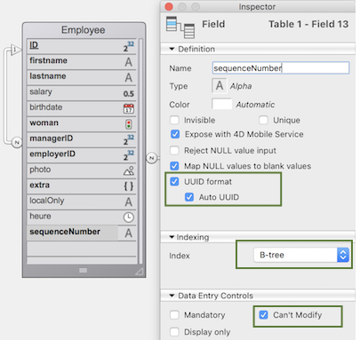

A [DataClass](ORDA/dsMapping.md#dataclass) provides an object interface to a database table. All dataclasses in a 4D application are available as a property of the `ds` [datastore](ORDA/dsMapping.md#datastore).

### Resumo

|                                                                                                                                                                                                                                                                                      |
| ------------------------------------------------------------------------------------------------------------------------------------------------------------------------------------------------------------------------------------------------------------------------------------ |
| [<!-- INCLUDE DataClassClass.attributeName.Syntax -->](#attributename)&amp;nbsp;&amp;nbsp;&amp;nbsp;&amp;nbsp;<!-- INCLUDE DataClassClass.attributeName.Summary -->                                  |
| [<!-- INCLUDE #DataClassClass.all().Syntax -->](#all)&amp;nbsp;&amp;nbsp;&amp;nbsp;&amp;nbsp;<!-- INCLUDE #DataClassClass.all().Summary -->                                                          |
| [<!-- INCLUDE #DataClassClass.clearRemoteCache().Syntax -->](#clearremotecache)&amp;nbsp;&amp;nbsp;&amp;nbsp;&amp;nbsp;<!-- INCLUDE #DataClassClass.clearRemoteCache().Summary -->                   |
| [<!-- INCLUDE #DataClassClass.fromCollection().Syntax -->](#fromcollection)&amp;nbsp;&amp;nbsp;&amp;nbsp;&amp;nbsp;<!-- INCLUDE #DataClassClass.fromCollection().Summary -->                         |
| [<!-- INCLUDE #DataClassClass.get().Syntax -->](#get)&amp;nbsp;&amp;nbsp;&amp;nbsp;&amp;nbsp;<!-- INCLUDE #DataClassClass.get().Summary -->                                                          |
| [<!-- INCLUDE #DataClassClass.getCount().Syntax -->](#getcount)&amp;nbsp;&amp;nbsp;&amp;nbsp;&amp;nbsp;<!-- INCLUDE #DataClassClass.getCount().Summary -->                                           |
| [<!-- INCLUDE #DataClassClass.getDataStore().Syntax -->](#getdatastore)&amp;nbsp;&amp;nbsp;&amp;nbsp;&amp;nbsp;<!-- INCLUDE #DataClassClass.getDataStore().Summary -->                               |
| [<!-- INCLUDE #DataClassClass.getInfo().Syntax -->](#getinfo)&amp;nbsp;&amp;nbsp;&amp;nbsp;&amp;nbsp;<!-- INCLUDE #DataClassClass.getInfo().Summary -->                                              |
| [<!-- INCLUDE #DataClassClass.getRemoteCache().Syntax -->](#getremotecache)&amp;nbsp;&amp;nbsp;&amp;nbsp;&amp;nbsp;<!-- INCLUDE #DataClassClass.getRemoteCache().Summary -->                         |
| [<!-- INCLUDE #DataClassClass.new().Syntax -->](#new)&amp;nbsp;&amp;nbsp;&amp;nbsp;&amp;nbsp;<!-- INCLUDE #DataClassClass.new().Summary -->                                                          |
| [<!-- INCLUDE #DataClassClass.newSelection().Syntax -->](#newselection)&amp;nbsp;&amp;nbsp;&amp;nbsp;&amp;nbsp;<!-- INCLUDE #DataClassClass.newSelection().Summary -->                               |
| [<!-- INCLUDE #DataClassClass.query().Syntax -->](#query)&amp;nbsp;&amp;nbsp;&amp;nbsp;&amp;nbsp;<!-- INCLUDE #DataClassClass.query().Summary -->                                                    |
| [<!-- INCLUDE #DataClassClass.setRemoteCacheSettings().Syntax -->](#setremotecachesettings)&amp;nbsp;&amp;nbsp;&amp;nbsp;&amp;nbsp;<!-- INCLUDE #DataClassClass.setRemoteCacheSettings().Summary --> |

<!-- REF DataClassClass.attributeName.Desc -->

## ._attributeName_

<details><summary>História</summary>

| Release | Mudanças                                       |
| ------- | ---------------------------------------------- |
| 19 R3   | Adicionado o atributo .exposed |
| 17      | Adicionado                                     |

</details>

<!-- REF DataClassClass.attributeName.Syntax -->***.attributeName*** : object<!-- END REF -->

#### Descrição

The attributes of dataclasses are <!-- REF DataClassClass.attributeName.Summary -->objects that are available directly as properties<!-- END REF --> of these classes.

Os objetos retornados têm propriedades que você pode ler para obter informações sobre os atributos da classe de dados.

> Os objetos do atributo Dataclass podem ser modificados, mas a estrutura subjacente do banco de dados não será alterada.

#### Objeto devolvido

Os objetos atributos retornados contêm as seguintes propriedades:

| Propriedade      | Tipo       | Descrição                                                                                                                                                                                                                                                                                                                                                                                                                                                                                                                                                                                                                                                                                                                                                                                                              |
| ---------------- | ---------- | ---------------------------------------------------------------------------------------------------------------------------------------------------------------------------------------------------------------------------------------------------------------------------------------------------------------------------------------------------------------------------------------------------------------------------------------------------------------------------------------------------------------------------------------------------------------------------------------------------------------------------------------------------------------------------------------------------------------------------------------------------------------------------------------------------------------------- |
| autoFilled       | Parâmetros | True se o valor do atributo for automaticamente preenchido por 4D. Corresponde às seguintes propriedades de campos 4D: "Autoincrement" para os campos de tipo numérico e "Auto UUID" para os campos UUID (alfa). Not returned if `.kind` = "relatedEntity" or "relatedEntities".                                                                                                                                                                                                                                                                                                                                                                                                                                                    |
| exposed          | Parâmetros | True se o atributo estiver exposto no REST                                                                                                                                                                                                                                                                                                                                                                                                                                                                                                                                                                                                                                                                                                                                                                             |
| fieldNumber      | integer    | Número interno do campo 4D do atributo. Not returned if `.kind` = "relatedEntity" or "relatedEntities".                                                                                                                                                                                                                                                                                                                                                                                                                                                                                                                                                                                                                                                                                |
| fieldType        | Integer    | Tipo de campo de banco de dados 4D do atributo. Depends on the attribute `kind`. Possible values: <li>if `.kind` = "storage": corresponding 4D field type, see [`Value type`](https://doc.4d.com/4dv20/help/command/en/page1509.html)</li><li>if `.kind` = "relatedEntity": 38 (`is object`)</li><li>if `.kind` = "relatedEntities": 42 (`is collection`)</li><li>if `.kind` = "calculated" or "alias" = same as above, depending on the resulting value (field type, relatedEntity or relatedEntities)</li>                                                                                                                                                  |
| indexed          | Parâmetros | True se houver um índice B-tree ou Cluster B-tree no atributo. Not returned if `.kind` = "relatedEntity" or "relatedEntities".                                                                                                                                                                                                                                                                                                                                                                                                                                                                                                                                                                                                                                                         |
| inverseName      | Text       | Nome do atributo que está do outro lado da relação. Returned only when `.kind` = "relatedEntity" or "relatedEntities".                                                                                                                                                                                                                                                                                                                                                                                                                                                                                                                                                                                                                                                                 |
| keywordIndexed   | Parâmetros | True se houver um índice de palavras-chave no atributo. Not returned if `.kind` = "relatedEntity" or "relatedEntities".                                                                                                                                                                                                                                                                                                                                                                                                                                                                                                                                                                                                                                                                |
| kind             | Text       | Categoria do atributo. Possible values:<li>"storage": storage (or scalar) attribute, i.e. attribute storing a value, not a reference to another attribute</li><li>"calculated": computed attribute, i.e. defined through a [`get` function](../ORDA/ordaClasses.md#function-get-attributename)</li><li>"alias": attribute built upon [another attribute](../ORDA/ordaClasses.md#alias-attributes-1)</li><li>"relatedEntity": N -> 1 relation attribute (reference to an entity)</li><li>"relatedEntities": 1 -> N relation attribute (reference to an entity selection)</li>  |
| obrigatório      | Parâmetros | True se a entrada de um valor null for rejeitada para o atributo. Not returned if `.kind` = "relatedEntity" or "relatedEntities". Nota: Esta propriedade corresponde à propriedade do campo "Reject NULL value input" ao nível do banco de dados 4D. Não tem relação com a propriedade existente "Mandatory"/obrigatório que é uma opção de controle de entrada de dados para uma tabela.                                                                                                                                                                                                                                                                                                                                              |
| name             | Text       | Nome do atributo como string                                                                                                                                                                                                                                                                                                                                                                                                                                                                                                                                                                                                                                                                                                                                                                                           |
| path             | Text       | Path of [an alias attribute](../ORDA/ordaClasses.md#alias-attributes-1) based upon a relation                                                                                                                                                                                                                                                                                                                                                                                                                                                                                                                                                                                                                                                                                                                          |
| readOnly         | Parâmetros | True se o atributo for apenas de leitura. For example, computed attributes without [`set` function](../ORDA/ordaClasses.md#function-set-attributename) are read-only.                                                                                                                                                                                                                                                                                                                                                                                                                                                                                                                                                                                                                  |
| relatedDataClass | Text       | Nome dadataclass relacionada ao atributo. Returned only when `.kind` = "relatedEntity" or "relatedEntities".                                                                                                                                                                                                                                                                                                                                                                                                                                                                                                                                                                                                                                                                           |
| type             | Text       | Tipo conceitual do valor do atributo, útil para programação genérica. Depends on the attribute `kind`. Possible values: <li>if `.kind` = "storage": "blob", "bool", "date", "image", "number", "object", or "string". "number" is returned for any numeric types including duration; "string" is returned for uuid, alpha and text attribute types; "blob" attributes are [blob objects](../Concepts/dt_blob.md#blob-type).</li><li>if `.kind` = "relatedEntity": related dataClass name</li><li>if `.kind` = "relatedEntities": related dataClass name + "Selection" suffix</li><li>if `.kind` = "calculated" or "alias": same as above, depending on the result</li> |
| unique           | Parâmetros | True se o valor do atributo tiver que ser único. Not returned if `.kind` = "relatedEntity" or "relatedEntities".                                                                                                                                                                                                                                                                                                                                                                                                                                                                                                                                                                                                                                                                       |

:::tip

For generic programming, use `Bool(attributeName.property)`, `Num(attributeName.property)` or `String(attributeName.property)` (depending on the property type) to get a valid value even if the property is not returned.

:::

#### Exemplo 1

```4d
$salary:=ds. Employee.salary //returns the salary attribute in the Employee dataclass
$compCity:=ds. Company["city"] //returns the city attribute in the Company dataclass
```

#### Exemplo 2

Considerando a seguinte estrutura do banco de dados:


```4d
var $firstnameAtt;$employerAtt;$employeesAtt : Object

 $firstnameAtt:=ds. Employee.firstname
  //{name:firstname,kind:storage,fieldType:0,type:string,fieldNumber:2,indexed:true,
  //keyWordIndexed:false,autoFilled:false,mandatory:false,unique:false}

 $employerAtt:=ds. Employee.employer
  //{name:employer,kind:relatedEntity,relatedDataClass:Company,
  //fieldType:38,type:Company,inverseName:employees}
  //38=Is object

 $employeesAtt:=ds. Company.employees
  //{name:employees,kind:relatedEntities,relatedDataClass:Employee,
  //fieldType:42,type:EmployeeSelection,inverseName:employer}
  //42=Is collection
```

#### Exemplo 3

Considerando as propriedades de tabela abaixo:



```4d
 var $sequenceNumberAtt : Object
 $sequenceNumberAtt=ds.Employee.sequenceNumber
  //{name:sequenceNumber,kind:storage,fieldType:0,type:string,fieldNumber:13,
  //indexed:true,keyWordIndexed:false,autoFilled:true,mandatory:false,unique:true}
```

<!-- END REF -->

<!-- REF DataClassClass.all().Desc -->

## .all()

<details><summary>História</summary>

| Release | Mudanças                            |
| ------- | ----------------------------------- |
| 17 R5   | Support of the _settings_ parameter |
| 17      | Adicionado                          |

</details>

<!-- REF #DataClassClass.all().Syntax -->**.all** ( { *settings* : Object } ) : 4D.EntitySelection<!-- END REF -->

<!-- REF #DataClassClass.all().Params -->

| Parâmetro  | Tipo                                |     | Descrição                                                               |
| ---------- | ----------------------------------- | :-: | ----------------------------------------------------------------------- |
| settings   | Object                              |  -> | Opção de construção: context                            |
| Resultados | 4D. EntitySelection |  <- | Referencias sobre todas as entidades relacionadas com a classe de dados |

<!-- END REF -->

#### Descrição

The `.all()` function <!-- REF #DataClassClass.all().Summary -->queries the datastore to find all the entities related to the dataclass and returns them as an entity selection<!-- END REF -->.

As entidades são devolvidas na ordem padrão, que é inicialmente a ordem na qual foram criadas. Note no entanto que, se as entidades foram apagas e outras adicionadas, a ordem padrão não reflete mais sua ordem de criação.

Se nenhuma entidade correspondente for encontrada, uma seleção de entidade vazia é retornada.

Se aplica carregamento diferido/lazy loading.

**settings**

In the optional _settings_ parameter, you can pass an object containing additional options. As propriedades abaixo são compatíveis:

| Propriedade | Tipo | Descrição                                                                                                                                                                                                                                                                                                                                                 |
| ----------- | ---- | --------------------------------------------------------------------------------------------------------------------------------------------------------------------------------------------------------------------------------------------------------------------------------------------------------------------------------------------------------- |
| context     | Text | Etiqueta para o contexto de otimização aplicado a seleção de entidades. Este contexto será utilizado pelo código que maneja a seleção de entidades para que possa se beneficiar da otimização. This feature is [designed for ORDA client/server processing](ORDA/entities.md#client-server-optimization). |

> To know the total number of entities in a dataclass, it is recommended to use the [`getCount()`](#getcount) function which is more optimized than the `ds.myClass.all().length` expression.

#### Exemplo

```4d
 var $allEmp : cs.EmployeeSelection
 $allEmp:=ds.Employee.all()
```

<!-- REF #DataClassClass.clearRemoteCache().Desc -->

## .clearRemoteCache()

<details><summary>História</summary>

| Release | Mudanças   |
| ------- | ---------- |
| 19 R5   | Adicionado |

</details>

<!-- REF #DataClassClass.clearRemoteCache().Syntax -->**.clearRemoteCache()**<!-- END REF -->

<!-- REF #DataStoreClass.clearRemoteCache().Params -->

| Parâmetro | Tipo |     | Descrição                  |
| --------- | ---- | :-: | -------------------------- |
|           |      |     | Não exige nenhum parâmetro |

<!-- END REF -->

#### Descrição

The `.clearRemoteCache()` function <!-- REF #DataClassClass.clearRemoteCache().Summary -->empties the ORDA cache of a dataclass<!-- END REF -->.

> This function does not reset the `timeout` and `maxEntries` values.

#### Exemplo

```4d
var $ds : 4D. DataStoreImplementation
var $persons : cs. PersonsSelection
var $p : cs. PersonsEntity
var $cache : Object
var $info : Collection
var $text : Text

$ds:=Open datastore(New object("hostname"; "www.myserver.com"); "myDS")

$persons:=$ds. Persons.all()
$text:="" For each ($p; $persons)
    $text:=$p.firstname+" lives in "+$p.address.city+" / " End for each

$cache:=$ds. Persons.getRemoteCache()

$ds. Persons.clearRemoteCache()
// Cache of the Persons dataclass = {timeout:30;maxEntries:30000;stamp:255;entries:[]}
```

<!-- END REF -->

<!-- REF DataClassClass.fromCollection().Desc -->

## .fromCollection()

<details><summary>História</summary>

| Release | Mudanças                            |
| ------- | ----------------------------------- |
| 17 R5   | Support of the _settings_ parameter |
| 17      | Adicionado                          |

</details>

<!-- REF #DataClassClass.fromCollection().Syntax -->**.fromCollection**( *objectCol* : Collection { ; *settings* : Object } ) : 4D.EntitySelection<!-- END REF -->

<!-- REF #DataClassClass.fromCollection().Params -->

| Parâmetro  | Tipo                                |     | Descrição                                    |
| ---------- | ----------------------------------- | :-: | -------------------------------------------- |
| objectCol  | Collection                          |  -> | Coleção de objetos a mapear com entidades    |
| settings   | Object                              |  -> | Opção de construção: context |
| Resultados | 4D. EntitySelection |  <- | Seleção de entidades preenchidas da coleção  |

<!-- END REF -->

#### Descrição

The `.fromCollection()` function <!-- REF #DataClassClass.fromCollection().Summary -->updates or creates entities in the dataclass according to the _objectCol_ collection of objects, and returns the corresponding entity selection<!-- END REF -->.

In the _objectCol_ parameter, pass a collection of objects to create new or update existing entities of the dataclass. Os nomes das propriedades devem ser os mesmos que os dos atributos da classe de dados. Se um nome de propriedade não existir na dataclass, é ignorado. Se um valor de atributo não for definido na coleção, seu valor será null.

The mapping between the objects of the collection and the entities is done on the **attribute names** and **matching types**. Se uma propriedade de um objeto tiver o mesmo nome que um atributo de entidade mas seus tipos não corresponderem, o atributo da entidade não é preenchido.

**Create or update mode**

For each object of _objectCol_:

- Se o objeto conter uma propriedade booleana "\__NEW" estabelecida em false (ou não conter uma propriedade booleana "\__NEW"), a entidade se atualiza ou se cria com os valores correspondentes das propriedades do objeto. Nenhuma comprovação é realizada com respeito à chave primária:
  - Se a chave primária for dada e existir, a entidade é atualizada. Nesse caso, a chave primária pode ser dada como etá ou com uma propriedade "\_\_KEY"  (preenchida com o valor da chave primária).
  - Se a chave primária for dada (como é) e não existir, a entidade é criada
  - Se a chave primária não for dada, a entidade é criada e o valor da chave primária é assignado com respeito às regras padrão de database.
- If the object contains a boolean property "\_\_NEW" set to **true**, the entity is created with the corresponding values of the attributes from the object. Uma comprovação é realizada com relação à chave primária:
  - Se a chave primária for dada (como está) e existir, um erro é enviado.
  - Se a chave primária for dada (como é) e não existir, a entidade é criada
  - Se a chave primária não for dada, a entidade é criada e o valor da chave primária é assignado com respeito às regras padrão de database.

> The "\_\_KEY" property containing a value is taken into account only when the "\_\_NEW" property is set to **false** (or is omitted) and a corresponding entity exists. Em todos os outros casos, o valor da propriedade "\_\_KEY" é ignorado, o valor da chave primária deve ser passado "tal como está".

**Related entities**

The objects of _objectCol_ may contain one or more nested object(s) featuring one or more related entities, which can be useful to create or update links between entities.

Os objetos aninhados que apresentam entidades relacionadas devem conter uma propriedade "\_\_KEY" (preenchido com o valor da chave primária da entidade relacionada) ou o atributo de chave primária da própria entidade relacionada. O uso de uma propriedade \_\_KEY permite a independência do nome do atributo da chave primària.

> O conteúdo das entidades relacionadas não pode ser criado / atualizado através deste mecanismo.

**Stamp**

Se um atributo \_\_STAMP for dado, se realiza uma comprovação com o selo no armazén de dados e se pode devolver um erro ("O selo dado não coincide com o atual para o registro# XX da tabela XXXX"). For more information, see [Entity locking](ORDA/entities.md#entity-locking).

**settings**

In the optional _settings_ parameter, you can pass an object containing additional options. As propriedades abaixo são compatíveis:

| Propriedade | Tipo | Descrição                                                                                                                                                                                                                                                                                                                                                 |
| ----------- | ---- | --------------------------------------------------------------------------------------------------------------------------------------------------------------------------------------------------------------------------------------------------------------------------------------------------------------------------------------------------------- |
| context     | Text | Etiqueta para o contexto de otimização aplicado a seleção de entidades. Este contexto será utilizado pelo código que maneja a seleção de entidades para que possa se beneficiar da otimização. This feature is [designed for ORDA client/server processing](ORDA/entities.md#client-server-optimization). |

#### Exemplo 1

Queremos atualizar uma entidade existente. A propriedade \_\_NEW não for dada, a chave primária do empregado é dada e existe:

```4d
 var $empsCollection : Collection
 var $emp : Object
 var $employees : cs.EmployeeSelection

 $empsCollection:=New collection
 $emp:=New object
 $emp.ID:=668 //Existing PK in Employee table
 $emp.firstName:="Arthur"
 $emp.lastName:="Martin"
 $emp.employer:=New object("ID";121) //Existing PK in the related dataClass Company
  // For this employee, we can change the Company by using another existing PK in the related dataClass Company
 $empsCollection.push($emp)
 $employees:=ds.Employee.fromCollection($empsCollection)
```

#### Exemplo 2

Queremos atualizar uma entidade existente. A propriedade \_\_NEW não é dada, a chave primária do empregado com o atributo \_\_KEY e existir:

```4d
 var $empsCollection : Collection
 var $emp : Object
 var $employees : cs.EmployeeSelection

 $empsCollection:=New collection
 $emp:=New object
 $emp.__KEY:=1720 //Existing PK in Employee table
 $emp.firstName:="John"
 $emp.lastName:="Boorman"
 $emp.employer:=New object("ID";121) //Existing PK in the related dataClass Company
  // For this employee, we can change the Company by using another existing PK in the related dataClass Company
 $empsCollection.push($emp)
 $employees:=ds.Employee.fromCollection($empsCollection)
```

#### Exemplo 3

Se quiser simplesmente criar uma nova entidade da coleção::

```4d
 var $empsCollection : Collection
 var $emp : Object
 var $employees : cs.EmployeeSelection

 $empsCollection:=New collection
 $emp:=New object
 $emp.firstName:="Victor"
 $emp.lastName:="Hugo"
 $empsCollection.push($emp)
 $employees:=ds.Employee.fromCollection($empsCollection)
```

#### Exemplo

Queremos criar uma entidade. A propriedade \_\_NEW é True, a chave primária de empregado não é dada:

```4d
 var $empsCollection : Collection
 var $emp : Object
 var $employees : cs.EmployeeSelection

 $empsCollection:=New collection
 $emp:=New object
 $emp.firstName:="Mary"
 $emp.lastName:="Smith"
 $emp.employer:=New object("__KEY";121) //Existing PK in the related dataClass Company
 $emp.__NEW:=True
 $empsCollection.push($emp)
 $employees:=ds.Employee.fromCollection($empsCollection)


```

#### Exemplo 2

Queremos criar uma entidade. Se a propriedade \_\_NEW é omitida, a chave primária do empregado é dada e não existir:

```4d
 var $empsCollection : Collection
 var $emp : Object
 var $employees : cs.EmployeeSelection

 $empsCollection:=New collection
 $emp:=New object
 $emp.ID:=10000 //Unexisting primary key
 $emp.firstName:="Françoise"
 $emp.lastName:="Sagan"
 $empsCollection.push($emp)
 $employees:=ds.Employee.fromCollection($empsCollection)
```

#### Exemplo 6

Neste exemplo, a primeira entidade se criará e salvará mas a segunda falhará já que ambas utilizam a mesma chave primaria:

```4d
 var $empsCollection : Collection
 var $emp; $emp2 : Object
 var $employees : cs.EmployeeSelection

 $empsCollection:=New collection
 $emp:=New object
 $emp.ID:=10001 // Unexisting primary key
 $emp.firstName:="Simone"
 $emp.lastName:="Martin"
 $emp.__NEW:=True
 $empsCollection.push($emp)

 $emp2:=New object
 $emp2.ID:=10001 // Same primary key, already existing
 $emp2.firstName:="Marc"
 $emp2.lastName:="Smith"
 $emp2.__NEW:=True
 $empsCollection.push($emp2)
 $employees:=ds.Employee.fromCollection($empsCollection)
  //first entity is created
  //duplicated key error for the second entity
```

#### Veja também

[**.toCollection()**](EntitySelectionClass.md#tocollection)

<!-- END REF -->

<!-- REF DataClassClass.get().Desc -->

## .get()

<details><summary>História</summary>

| Release | Mudanças   |
| ------- | ---------- |
| 17      | Adicionado |

</details>

<!-- REF #DataClassClass.get().Syntax -->**.get**( *primaryKey* : Integer { ; *settings* : Object } ) : 4D.Entity<br/>**.get**( *primaryKey* : Text { ; *settings* : Object } ) : 4D.Entity<!-- END REF -->

<!-- REF #DataClassClass.get().Params -->

| Parâmetro  | Tipo                       |     | Descrição                                            |
| ---------- | -------------------------- | :-: | ---------------------------------------------------- |
| primaryKey | Integer OR Text            |  -> | Valor da chave primária da entidade a recuperar      |
| settings   | Object                     |  -> | Opção de construção: context         |
| Resultados | 4D. Entity |  <- | Entidade que coincide com a chave primária designada |

<!-- END REF -->

#### Descrição

The `.get()` function <!-- REF #DataClassClass.get().Summary -->queries the dataclass to retrieve the entity matching the _primaryKey_ parameter<!-- END REF -->.

In _primaryKey_, pass the primary key value of the entity to retrieve. Em <em x-id="3">primaryKey</em>, passe o valor da chave primária da entidade a recuperar Em <em x-id="3">primaryKey</em>, passe o valor da chave primária da entidade a recuperar O tipo valor deve coresponder com o tipo de chave primária estabelecido na datastore (Inteiro ou texto). You can also make sure that the primary key value is always returned as Text by using the [`.getKey()`](EntityClass.md#getkey) function with the `dk key as string` parameter.

If no entity is found with _primaryKey_, a **Null** entity is returned.

É aplicado o lazy loading/carregamento diferido, ou seja os dados relacionados são carregados do disco só quando pedidos.

**settings**

In the optional _settings_ parameter, you can pass an object containing additional options. As propriedades abaixo são compatíveis:

| Propriedade | Tipo | Descrição                                                                                                                                                                                                                                                                                                                                              |
| ----------- | ---- | ------------------------------------------------------------------------------------------------------------------------------------------------------------------------------------------------------------------------------------------------------------------------------------------------------------------------------------------------------ |
| context     | Text | Etiqueta para o contexto de otimização automático aplicados à entidade. Esse contexto será usado pelo código subsequente que carrega a entidade para que se possa beneficiar da otimização. This feature is [designed for ORDA client/server processing](ORDA/entities.md#client-server-optimization). |

#### Exemplo 1

```4d
 var $entity : cs.EmployeeEntity  
 var $entity2 : cs.InvoiceEntity
 $entity:=ds.Employee.get(167) // return the entity whose primary key value is 167
 $entity2:=ds.Invoice.get("DGGX20030") // return the entity whose primary key value is "DGGX20030"
```

#### Exemplo 2

This example illustrates the use of the _context_ property:

```4d
 var $e1; $e2; $e3; $e4 : cs.EmployeeEntity
 var $settings; $settings2 : Object

 $settings:=New object("context";"detail")
 $settings2:=New object("context";"summary")

 $e1:=ds.Employee.get(1;$settings)
 completeAllData($e1) // In completeAllData method, an optimization is triggered and associated to context "detail"

 $e2:=ds.Employee.get(2;$settings)
 completeAllData($e2) // In completeAllData method, the optimization associated to context "detail" is applied

 $e3:=ds.Employee.get(3;$settings2)
 completeSummary($e3) //In completeSummary method, an optimization is triggered and associated to context "summary"

 $e4:=ds.Employee.get(4;$settings2)
 completeSummary($e4) //In completeSummary method, the optimization associated to context "summary" is applied
```

<!-- END REF -->

<!-- REF DataClassClass.getCount.Desc -->

## .getCount()

<details><summary>História</summary>

| Release | Mudanças   |
| ------- | ---------- |
| 19 R5   | Adicionado |

</details>

<!-- REF #DataClassClass.getCount().Syntax -->**.getCount()** : Integer <!-- END REF -->

<!-- REF #DataClassClass.getCount().Params -->

| Parâmetro | Tipo    |    | Descrição                              |
| --------- | ------- | -- | -------------------------------------- |
| result    | Integer | <- | Número de entidades na classe de dados |

<!-- END REF -->

#### Descrição

The `.getCount()` function <!-- REF #DataClassClass.getCount().Summary --> returns the number of entities in a dataclass<!-- END REF -->.

Se esta função for utilizada dentro de uma transacção, as entidades criadas durante a transação serão levadas em consideração.

#### Exemplo

```4d
var $ds : 4D. DataStoreImplementation
var $number : Integer

$ds:=Open datastore(New object("hostname"; "www.myserver.com"); "myDS")

$number:=$ds. Persons.getCount()
```

<!-- END REF -->

<!-- REF DataClassClass.getDataStore().Desc -->

## .getDataStore()

<details><summary>História</summary>

| Release | Mudanças   |
| ------- | ---------- |
| 17 R5   | Adicionado |

</details>

<!-- REF #DataClassClass.getDataStore().Syntax -->**.getDataStore()** : cs.DataStore<!-- END REF -->

<!-- REF #DataClassClass.getDataStore().Params -->

| Parâmetro  | Tipo                          |     | Descrição               |
| ---------- | ----------------------------- | :-: | ----------------------- |
| Resultados | cs. DataStore |  <- | Informação da dataclass |

<!-- END REF -->

#### Descrição

The `.getDataStore()` function <!-- REF #DataClassClass.getDataStore().Summary -->returns the datastore for the specified dataclass<!-- END REF -->.

A datastore pode ser:

- the main datastore, as returned by the `ds` command.
- a remote datastore, opened using the `Open datastore` command.

#### Exemplo

The _**SearchDuplicate**_ project method searches for duplicated values in any dataclass.

```4d
 var $pet : cs.CatsEntity
 $pet:=ds.Cats.all().first() //get an entity
 SearchDuplicate($pet;"Dogs")
```

```4d
  // SearchDuplicate method
  // SearchDuplicate(entity_to_search;dataclass_name)

 #DECLARE ($pet : Object ; $dataClassName : Text)
 var $dataStore; $duplicates : Object  

 $dataStore:=$pet.getDataClass().getDataStore()
 $duplicates:=$dataStore[$dataClassName].query("name=:1";$pet.name)
```

<!-- END REF -->

<!-- REF DataClassClass.getInfo().Desc -->

## .getInfo()

<details><summary>História</summary>

| Release | Mudanças                             |
| ------- | ------------------------------------ |
| 19 R3   | A propriedade exposed foi adicionada |
| 17 R5   | Adicionado                           |

</details>

<!-- REF #DataClassClass.getInfo().Syntax -->**.getInfo()** : Object <!-- END REF -->

<!-- REF #DataClassClass.getInfo().Params -->

| Parâmetro  | Tipo   |    | Descrição              |
| ---------- | ------ | -- | ---------------------- |
| Resultados | Object | <- | Datastore da dataclass |

<!-- END REF -->

#### Descrição

The `.getInfo()` function <!-- REF #DataClassClass.getInfo().Summary -->returns an object providing information about the dataclass<!-- END REF -->. Esta função é útil para configurar o código genérico.

**Returned object**

| Propriedade | Tipo       | Descrição                                 |
| ----------- | ---------- | ----------------------------------------- |
| exposed     | Parâmetros | True se a dataclass for exposta em REST   |
| name        | Text       | Nome da dataclass                         |
| primaryKey  | Text       | Nome da chave primária da classe de dados |
| tableNumber | Integer    | Número daa tabela 4D interna              |

#### Exemplo 1

```4d
 #DECLARE ($entity : Object)  
 var $status : Object

 computeEmployeeNumber($entity) //do some actions on entity

 $status:=$entity.save()
 if($status.success)
    ALERT("Record updated in table "+$entity.getDataClass().getInfo().name)
 End if
```

#### Exemplo 2

```4d
 var $settings : Object
 var $es : cs.ClientsSelection

 $settings:=New object
 $settings.parameters:=New object("receivedIds";getIds())
 $settings.attributes:=New object("pk";ds.Clients.getInfo().primaryKey)
 $es:=ds.Clients.query(":pk in :receivedIds";$settings)
```

#### Exemplo 3

```4d
 var $pk : Text
 var $dataClassAttribute : Object

 $pk:=ds.Employee.getInfo().primaryKey
 $dataClassAttribute:=ds.Employee[$pk] // If needed the attribute matching the primary key is accessible
```

<!-- END REF -->

<!-- REF DataClassClass.getRemoteCache().Desc -->

## .getRemoteCache()

<details><summary>História</summary>

| Release | Mudanças   |
| ------- | ---------- |
| 19 R5   | Adicionado |

</details>

<!-- REF #DataClassClass.getRemoteCache().Syntax -->**.getRemoteCache**() : Object <!-- END REF -->

<!-- REF #DataClassClass.getRemoteCache().Params -->

| Parâmetro | Tipo   |    | Descrição                                                                       |
| --------- | ------ | -- | ------------------------------------------------------------------------------- |
| result    | Object | <- | Objecto que descreve o conteúdo da cache ORDA para o dataclass. |

<!-- END REF -->

> **Advanced mode:** This function is intended for developers who need to customize ORDA default features for specific configurations. Na maioria dos casos, não necessitará de o utilizar.

#### Descrição

The `.getRemoteCache()` function <!-- REF #DataClassClass.getRemoteCache().Summary -->returns an object that holds the contents of the ORDA cache for a dataclass.<!-- END REF -->.

Calling this function from a 4D single-user application returns `Null`.

O objeto retornado tem as propriedades abaixo:

| Propriedade | Tipo       | Descrição                                                                                          |
| ----------- | ---------- | -------------------------------------------------------------------------------------------------- |
| maxEntries  | Integer    | Número máximo de entradas recolhidas.                                              |
| stamp       | Integer    | Carimbo da cache.                                                                  |
| timeout     | Integer    | Tempo restante antes que as novas entradas na cache sejam marcadas como expiradas. |
| \|          | Collection | Contém um objecto de entrada para cada entidade na cache.                          |

Each entry object in the `entries` collection has the following properties:

| Propriedade | Tipo       | Descrição                                   |
| ----------- | ---------- | ------------------------------------------- |
| data        | Object     | Objeto que contém os dados da entrada       |
| expired     | Parâmetros | True se a entrada tiver expirado            |
| \|          | Text       | Chave primária da entidade. |

The `data` object in each entry contains the following properties:

| Propriedade                                           | Tipo         | Descrição                                                                                                                                                  |
| ----------------------------------------------------- | ------------ | ---------------------------------------------------------------------------------------------------------------------------------------------------------- |
| __KEY       | String       | Chave primária da entidade                                                                                                                                 |
| __STAMP     | Longint      | Stamp da entidade na base de dados                                                                                                                         |
| __TIMESTAMP | String       | Stamp da entidade na base de dados (formato é YYYY-MM-DDTHH:MM:SS:ms:Z) |
| dataClassAttributeName                                | Diferente de | Se houver dados na cache para um atributo dataclass, estes são devolvidos numa propriedade com o mesmo tipo que na base de dados.          |

Os dados relativos a entidades relacionadas são armazenados na cache do objecto de dados.

#### Exemplo

In the following example, `$ds.Persons.all()` loads the first entity with all its attributes. Then, the request optimization is triggered, so only `firstname` and `address.city` are loaded.

Note that `address.city` is loaded in the cache of the `Persons` dataclass.

Only the first entity of the `Address` dataclass is stored in the cache. É carregado durante a primeira iteração do loop.

```4d
var $ds : 4D. DataStoreImplementation
var $persons : cs. PersonsSelection
var $p : cs. PersonsEntity
var $cachePersons; $cacheAddress : Object
var $text : Text

$ds:=Open datastore(New object("hostname"; "www.myserver.com"); "myDS")

$persons:=$ds. Persons.all()

$text:="" For each ($p; $persons)
    $text:=$p.firstname+" lives in "+$p.address.city+" / " End for each

$cachePersons:=$ds. Persons.getRemoteCache()
$cacheAddress:=$ds. Adress.getRemoteCache()
```

#### Veja também

[.setRemoteCacheSettings()](#setremotecachesettings)<br/>[.clearRemoteCache()](#clearremotecache)

<!-- REF DataClassClass.new().Desc -->

## .new()

<details><summary>História</summary>

| Release | Mudanças   |
| ------- | ---------- |
| 17      | Adicionado |

</details>

<!-- REF #DataClassClass.new().Syntax -->**.new()** : 4D.Entity <!-- END REF -->

<!-- REF #DataClassClass.new().Params -->

| Parâmetro  | Tipo                       |    | Descrição                                        |
| ---------- | -------------------------- | -- | ------------------------------------------------ |
| Resultados | 4D. Entity | <- | Nova entidade que coincide com a classe de dados |

<!-- END REF -->

#### Descrição

The `.new()` function <!-- REF #DataClassClass.new().Summary -->creates in memory and returns a new blank entity related to the Dataclass<!-- END REF -->.

The entity object is created in memory and is not saved in the database until the [`.save( )`](EntityClass.md#save) function is called. Se a entidade for apagada antes de ser salva, não se pode recuperar.

**4D Server**: In client-server, if the primary key of the corresponding table is auto-incremented, it will be calculated when the entity is saved on the server.

All attributes of the entity are initialized with the **null** value.

> Attributes can be initialized with default values if the **Map NULL values to blank values** option is selected at the 4D database structure level.

#### Exemplo

Este exemplo cria uma nova entidade na classe de dados "Log" e registra a informação no atributo "info":

```4d
 var $entity : cs.LogEntity
 $entity:=ds.Log.new() //create a reference
 $entity.info:="New entry" //store some information
 $entity.save() //save the entity
```

<!-- END REF -->

<!-- REF DataClassClass.newSelection().Desc -->

## .newSelection()

<details><summary>História</summary>

| Release | Mudanças   |
| ------- | ---------- |
| 17      | Adicionado |

</details>

<!-- REF #DataClassClass.newSelection().Syntax -->**.newSelection**( { *keepOrder* : Integer } ) : 4D.EntitySelection <!-- END REF -->

<!-- REF #DataClassClass.newSelection().Params -->

| Parâmetro  | Tipo                                |    | Descrição                                                                                                                                                                                   |
| ---------- | ----------------------------------- | -- | ------------------------------------------------------------------------------------------------------------------------------------------------------------------------------------------- |
| keepOrder  | Integer                             | -> | `dk keep ordered`: creates an ordered entity selection,<br/>`dk non ordered`: creates an unordered entity selection (default if omitted) |
| Resultados | 4D. EntitySelection | <- | Nova seleção de entidades em branco relacionadas com a classe de dados                                                                                                                      |

<!-- END REF -->

#### Descrição

The `.newSelection()` function <!-- REF #DataClassClass.newSelection().Summary -->creates a new, blank, non-shareable entity selection, related to the dataclass, in memory<!-- END REF -->.

> For information on non-shareable entity selections, please refer to [this section](ORDA/entities.md#shareable-or-non-shareable-entity-selections).

If you want to create an ordered entity selection, pass the `dk keep ordered` selector in the _keepOrder_ parameter. By default if you omit this parameter, or if you pass the `dk non ordered` selector, the method creates an unordered entity selection. As seleções de entidades desordenadas são mais rápidas mas não se pode confiar nas posições das entidades. For more information, please see [Ordered vs Unordered entity selections](ORDA/dsMapping.md#ordered-or-unordered-entity-selection).

When created, the entity selection does not contain any entities (`mySelection.length` returns 0). This method lets you build entity selections gradually by making subsequent calls to the [`add()`](EntitySelectionClass.md#add) function.

#### Exemplo

```4d
 var $USelection; $OSelection : cs.EmployeeSelection
 $USelection:=ds.Employee.newSelection() //create an unordered empty entity selection
 $OSelection:=ds.Employee.newSelection(dk keep ordered) //create an ordered empty entity selection
```

<!-- END REF -->

<!-- REF DataClassClass.query().Desc -->

## .query()

<details><summary>História</summary>

| Release | Mudanças                               |
| ------- | -------------------------------------- |
| 17 R6   | Soporte dos Parâmetros Formula         |
| 17 R5   | Suporte dos marcadores para os valores |
| 17      | Adicionado                             |

</details>

<!-- REF #DataClassClass.query().Syntax -->**.query**( *queryString* : Text { ; *...value* : any } { ; *querySettings* : Object } ) : 4D.EntitySelection <br/>**.query**( *formula* : Object { ; *querySettings* : Object } ) : 4D.EntitySelection <!-- END REF -->

<!-- REF #DataClassClass.query().Params -->

| Parâmetro     | Tipo                                |    | Descrição                                                                                                                   |
| ------------- | ----------------------------------- | -- | --------------------------------------------------------------------------------------------------------------------------- |
| queryString   | Text                                | -> | Criterios de pesquisa como string                                                                                           |
| formula       | Object                              | -> | Criterios de pesquisa como objeto fórmula                                                                                   |
| value         | any                                 | -> | Valores a usar para placeholders indexados                                                                                  |
| querySettings | Object                              | -> | Opções de pesquisa: parâmetros, atributos, args, allowFormulas, contexto, queryPath,queryPlan               |
| Resultados    | 4D. EntitySelection | <- | New entity selection made up of entities from dataclass meeting the search criteria specified in _queryString_ or _formula_ |

<!-- END REF -->

#### Descrição

The `.query()` function <!-- REF #DataClassClass.query().Summary -->searches for entities that meet the search criteria specified in _queryString_ or _formula_ and (optionally) _value_(s)<!-- END REF -->, for all the entities in the dataclass, and returns a new object of type `EntitySelection` containing all the entities that are found. Se aplica carregamento diferido/lazy loading.

If no matching entities are found, an empty `EntitySelection` is returned.

#### parâmetro queryString

The _queryString_ parameter uses the following syntax:

```4d
attributePath|formula comparator value   
 {logicalOperator attributePath|formula comparator value}   
 {order by attributePath {desc | asc}}
```

onde:

- **attributePath**: path of attribute on which you want to execute the query. Os atributos se expressam como pares propriedade/ valor, onde propriedade é o nome do marcador de posição inserido para uma rota de atributo em <em x-id="3">queryString</em> ou <em x-id="3">formula</em> (":placeholder") e valor pode ser uma string ou uma coleção de strings. In case of an attribute path whose type is `Collection`, `[]` notation is used to handle all the occurences (for example `children[].age`).

> _You cannot use directly attributes whose name contains special characters such as ".", "\[ ]", or "=", ">", "#"..., because they will be incorrectly evaluated in the query string. If you need to query on such attributes, you must consider using placeholders, which allow an extended range of characters in attribute paths (see_ **Using placeholders** _below)._

- **formula**: a valid formula passed as `Text` or `Object`. A fórmula será avaliada para cada entidade processada e deve retornar um valor booleano. Within the formula, the entity is available through the `This` object.

  - **Text**: the formula string must be preceeded by the `eval( )` statement, so that the query parser evaluates the expression correctly. For example: _"eval(length(This.lastname) >=30)"_
  - **Object**: the [formula object](FunctionClass.md) is passed as a **placeholder** (see below). The formula must have been created using the [`Formula`](FunctionClass.md#formula) or [`Formula from string`](FunctionClass.md#formula-from-string) command.

> * Keep in mind that 4D formulas only support `&` and `|` symbols as logical operators.
> * Se a fórmula não for o único critério de pesquisa, o otimizador de motor debusca poderia processar outros critérios previamente (por exemplo atributos indexados) e assim, a fórmula poderia ser avaliada apenas para um subconjunto de entidades.

Fórmulas nas consultas podem receber parâmetros através de $1. This point is detailed in the **formula parameter** paragraph below.

> - You can also pass directy a `formula` parameter object instead of the `queryString` parameter (recommended when formulas are more complex). See **formula parameter** paragraph below.
> - For security reasons, formula calls within `query()` functions can be disallowed. See `querySettings` parameter description.

- **comparator**: symbol that compares _attributePath_ and _value_. Os simbolos abaixo são compatíveis:

| Comparação                               | Símbolos    | Comentário                                                                                                                                                                                                                      |
| ---------------------------------------- | ----------- | ------------------------------------------------------------------------------------------------------------------------------------------------------------------------------------------------------------------------------- |
| Igual a                                  | =, ==       | Retorna os dados coincidentes, admite o coringa (@), não diferencia entre maiúsculas e minúsculas nem diacríticas.                                                              |
|                                          | ===, IS     | Retorna os dados coincidentes, considera @ como caractere padrão, não diferencia entre maiúsculas e minúsculas nem diacríticas                                                                                     |
| Diferente de                             | #, !=       | Suporta o coringa (@). Equivalent to "Not condition applied on a statement" ([see below](#not-equal-to-in-collections)).                     |
|                                          | !==, IS NOT | Considera  @ como um caractere normal                                                                                                                                                                              |
| Não se aplica à condição de uma sentença | NOT         | Parentesis são obrigatórios quando usar NOT antes de uma instrução que contenha vários operadores. Equivalent to "Not equal to" ([see below](#not-equal-to-in-collections)). |
| Menor que                                | <           |                                                                                                                                                                                                                                 |
| Maior que                                | >           |                                                                                                                                                                                                                                 |
| Menor que ou igual a                     | <=          |                                                                                                                                                                                                                                 |
| Maior ou igual a                         | > =         |                                                                                                                                                                                                                                 |
| Incluído em                              | IN          | Retorna dados iguais a ao menos um dos valores de uma coleção ou de um conjunto de valores, admite o coringa (@)                                                                                |
| Contém palavra chave                     | %           | As palavras chaves podem ser usadas em atributos de string ou imagem                                                                                                                                                            |

- **value**: the value to compare to the current value of the property of each entity in the entity selection or element in the collection. It can be a **placeholder** (see **Using placeholders** below) or any expression matching the data type property.
  Quando usar um valor constante, as regras abaixo devem ser respeitadas:
  - **text** type constant can be passed with or without simple quotes (see **Using quotes** below). Para pesquisar uma stirng dentro de uma string (uma pesquisa "contém") use o símbolo coringa (@) em valor para isolar a string a ser pesquisada como mostrado neste exemplo: "@Smith@". As palavras chaves abaixo são proibidas para constantes de texto: true, false.
  - **boolean** type constants: **true** or **false** (case sensitive).
  - **numeric** type constants: decimals are separated by a '.' (period).
  - **date** type constants: "YYYY-MM-DD" format
  - **null** constant: using the "null" keyword will find **null** and **undefined** properties.
  - in case of a query with an IN comparator, _value_ must be a collection, or values matching the type of the attribute path between \[ ] separated by commas (for strings, `"` characters must be escaped with `\`).
- **logicalOperator**: used to join multiple conditions in the query (optional). Pode usaar um dos operadores lógicos abaixo (ou o nome ou o símbolo podem ser usados):

| Conjunção | Símbolos                                                               |
| --------- | ---------------------------------------------------------------------- |
| AND       | &, &&, and |
| OU        | \|,\|\|, or                                                            |

- **order by attributePath**: you can include an order by _attributePath_ statement in the query so that the resulting data will be sorted according to that statement. You can use multiple order by statements, separated by commas (e.g., order by _attributePath1_ desc, _attributePath2_ asc). Como padrão, a ordem é ascendente. Passe 'desc'' para definir uma ordem descendente e 'asc' para definir uma ordem ascendente.

> If you use this statement, the returned entity selection is ordered (for more information, please refer to [Ordered vs Unordered entity selections](ORDA/dsMapping.md#ordered-or-unordered-entity-selection)).

#### Usar aspas

Ao usar aspas dentro das consultas, você deve usar aspas simples ' ' dentro da consulta e aspas duplas " " para envolver toda a consulta, caso contrário, será retornado um erro. Por exemplo:

```4d
"employee.name = 'smith' AND employee.firstname = 'john'"
```

> Aspas siples (') não são permitidas nos valores pesquisados, já que quebrariam a string de pesquisa. Por exemplo, "comp.name = 'John's pizza' " gerará um erro. Se precisar pesquisar valores com aspas simples, pode considerar o uso de placeholders (ver abaixo).

#### Usando parêntesis

Você pode usar parênteses na consulta para dar prioridade ao cálculo. Por exemplo, pode organizar uma pesquisa da seguinte maneira:

```4d
"(employee.age >= 30 OR employee.age <= 65) AND (employee.salary <= 10000 OR employee.status = 'Manager')"
```

#### Uso de placeholders

4D allows you to use placeholders for _attributePath_, _formula_ and _value_ arguments within the _queryString_ parameter. Um placeholder é um parâmetro que você insere em cadeias de consulta e que é substituído por outro valor quando a cadeia de consulta é avaliada. O valor dos placeholders é avaliado uma vez no início da consulta; ele não é avaliado para cada elemento.

Two types of placeholders can be used: **indexed placeholders** and **named placeholders**:

|           | Marcadores de posição indexados                                                                                                                                                                                                                                                                                                                       | Placeholders nomeados                                                                                                                                                                                        |
| --------- | ----------------------------------------------------------------------------------------------------------------------------------------------------------------------------------------------------------------------------------------------------------------------------------------------------------------------------------------------------- | ------------------------------------------------------------------------------------------------------------------------------------------------------------------------------------------------------------ |
| Definição | Parameters are inserted as `:paramIndex` (for example :1, :2...) in _queryString_ and their corresponding values are provided by the sequence of _value_ parameter(s). You can use up to 128 _value_ parameters | Parameters are inserted as `:paramName` (for example :myparam) and their values are provided in the attributes and/or parameters objects in the _querySettings_ parameter |
| Exemplo   | `$r:=class.query(":1=:2";"city";"Chicago")`                                                                                                                                                                                                                                                                                                           | `$o.attributes:=New object("att";"city")`<br/> `$o.parameters:=New object("name";"Chicago")`<br/> `$r:=class.query(":att=:name";$o)`                                                                         |

You can mix all argument kinds in _queryString_. A _queryString_ can contain, for _attributePath_, _formula_ and _value_ parameters:

- valores diretos (sem placeholders),
- placeholders indexados ou com nome.

Using placeholders in queries **is recommended** for the following reasons:

1. Evita a inserção de código malicioso: se user diretamente variáveis preenchidas com uma string de pesquisa, um usuário poderia modificar as condições de pesquisa entrando argumentos adicionais. Por exemplo, imagine uma string de pesquisa como:

```4d
 $vquery:="status = 'public' & name = "+myname //user enters their name
 $result:=$col.query($vquery)
```

Essa consulta parece segura, pois os dados não públicos são filtrados. However, if the user enters in the _myname_ area something like _"smith OR status='private'_, the query string would be modified at the interpretation step and could return private data.

Ao usar placeholders, não é possível substituir as condições de segurança:

```4d
 $result:=$col.query("status='public' & name=:1";myname)
```

In this case if the user enters _smith OR status='private'_ in the _myname_ area, it will not be interpreted in the query string, but only passed as a value. A busca por uma pessoa chamada "smith OR status='private'" simplesmente falhará.

2. It prevents having to worry about formatting or character issues, especially when handling _attributePath_ or _value_ parameters that might contain non-alphanumeric characters such as ".", "['...

3. Permite o uso de variáveis ou expressões nos argumentos de pesquisa. Exemplos:

```4d
$result:=$col.query("address.city = :1 & name =:2";$city;$myVar+"@")
$result2:=$col.query("company.name = :1";"John's Pizzas")
```

#### Pesquisa de valores null

Quando pesquisar por valores null não pode usar a sintaxe do marcador de posição porque o motor de consulta considera o valor null como um valor de comparação inesperado. Por exemplo, se executar esta pesquisa:

```4d
$vSingles:=ds. Person.query("spouse = :1";Null) // will NOT work
```

Não obterá o resultado esperado porque o valor nulo será avaliado por 4D como um erro resultante da avaliação do parâmetro (por exemplo, um atributo vindo de outra consulta). Para este tipo de pesquisa, deve usar a sintaxe de pesquisa direta:

```4d
 $vSingles:=ds.Person.query("spouse = null") //correct syntax
```

#### Não igual a em colecções

When searching within dataclass object attributes containing collections, the "not equal to _value_" comparator (`#` or `!=`) will find elements where ALL properties are different from _value_ (and not those where AT LEAST one property is different from _value_, which is how work other comparators). Basically, it is equivalent to search for "Not(find collection elements where property equals _value_"). Por exemplo, com as seguintes entidades:

```
Entity 1:
ds.Class.name: "A"
ds.Class.info:
    { "coll" : [ {
                "val":1,
                "val":1
            } ] }

Entity 2:
ds.Class.name: "B"
ds.Class.info:
    { "coll" : [ {
                "val":1,
                "val":0
            } ] }

Entity 3:
ds.Class.name: "C"
ds.Class.info:
    { "coll" : [ {
                "val":0,
                "val":0
            } ] }
```

Considere os seguintes resultados:

```4d
ds.Class.query("info.coll[].val = :1";0)
// returns B and C
// finds "entities with 0 in at least one val property"

ds.Class.query("info.coll[].val != :1";0)
// returns A only
// finds "entities where all val properties are different from 0"
// which is the equivalent to
ds.Class.query(not("info.coll[].val = :1";0))
```

If you want to implement a query that finds entities where "at least one property is different from _value_", you need to use a special notation using a letter in the `[]`:

```4d
ds.Class.query("info.coll[a].val := :1";0)  
// devolve A e B
// encontra "entidades em que pelo menos uma propriedade val é diferente de 0"
```

You can use any letter from the alphabet as the `[a]` notation.

#### Linkar os argumentos de pesquisa com os atributos de coleção

:::info

This feature is only available in queries on dataclasses and [entity selections](EntitySelectionClass.md#query). It cannot be used in queries on [collections](CollectionClass.md#query).

:::

Ao pesquisar nos atributos de objetos de classe de dados que contêm coleções usando vários argumentos de consulta unidos pelo operador AND, você pode querer garantir que somente as entidades que contêm elementos que correspondem a todos os argumentos sejam retornadas, e não as entidades em que os argumentos podem ser encontrados em elementos diferentes. Para tal, é necessário ligar argumentos de consulta a elementos de coleção, de modo a que apenas sejam encontrados elementos individuais que contenham argumentos ligados.

Por exemplo, com as duas entidades abaixo:

```
Entity 1:
ds. People.name: "martin"
ds. People.places:
    { "locations" : [ {
                "kind":"home",
                "city":"paris"
            } ] } Entity 2:
ds. People.name: "smith"
ds. People.places:
    { "locations" : [ {
                "kind":"home",
                "city":"lyon"
            } , {
                "kind":"office",
                "city":"paris"
            } ] }
```

Você deseja encontrar pessoas com um tipo de local de "residência" na cidade "paris". Se escrever:

```4d
ds. People.query("places.locations[].kind= :1 and places.locations[].city= :2";"home";"paris")
```

... the query will return "martin" **and** "smith" because "smith" has a "locations" element whose "kind" is "home" and a "locations" element whose "city" is "paris", even though they are different elements.

If you want to only get entities where matching arguments are in the same collection element, you need to **link arguments**. Para linkar argumentos de pesquisa:

- Adicionar uma letra entre os \[] na primeira rota a linkar e repita a mesma letra em todos os argumentos linkados. For example: `locations[a].city and locations[a].kind`. Pode usar qualquer letra do alfabeto latino (não diferencia maiúsculas e minúsculas).
- Para adicionar critérios linkados na mesma pesquisa, use outra letra. Pode criar até 26 combinações de critérios em uma única pesquisa.

Com as entidades acima, se escreve:

```4d
ds. People.query("places.locations[a].kind= :1 and places.locations[a].city= :2";"home";"paris")
```

... the query will only return "martin" because it has a "locations" element whose "kind" is "home" and whose "city" is "paris". A consulta não devolverá "smith" porque os valores "home" e "paris" não estão no mesmo elemento de coleção.

#### Consultas em relações Muitos para Muitos

O ORDA oferece uma sintaxe especial para facilitar as consultas em relações muitos-para-muitos. In this context, you may need to search for different values with an `AND` operator BUT in the same attribute. Por exemplo, veja a seguinte estrutura:


Imagine that you want to search all movies in which _both_ actor A and actor B have a role. If you write a simple query using an `AND` operator, it will not work:

```4d
// invalid code
$es:=ds. Movie.query("roles.actor.lastName = :1 AND roles.actor.lastName = :2";"Hanks";"Ryan")  
// $es is empty
```

Basicamente, o problema está relacionado à lógica interna da consulta: você não pode pesquisar um atributo cujo valor seja "A" e "B".

To make it possible to perform such queries, ORDA allows a special syntax: you just need to add a _class index_ between **{}** in all additional relation attributes used in the string:

```4d
"relationAttribute.attribute = :1 AND relationAttribute{x}.attribute = :2 [AND relationAttribute{y}.attribute...]"
```

**{x}** tells ORDA to create another reference for the relation attribute. Em seguida, ele executará internamente todas as operações de bitmap necessárias. Note that **x** can be any number **except 0**: {1}, or {2}, or {1540}... O ORDA só precisa de uma referência exclusiva na consulta para cada índice de classe.

No nosso exemplo, seria:

```4d
// valid code
$es:=ds. Movie.query("roles.actor.lastName = :1 AND roles.actor{2}.lastName = :2";"Hanks";"Ryan")  
// $es contains movies (You've Got Mail, Sleepless in Seattle, Joe Versus the Volcano)
```

#### Parâmetro formula

As an alternative to formula insertion within the _queryString_ parameter (see above), you can pass directly a formula object as a boolean search criteria. Using a formula object for queries is **recommended** since you benefit from tokenization, and code is easier to search/read.

The formula must have been created using the [`Formula`](FunctionClass.md#formula) or [`Formula from string`](FunctionClass.md#formula-from-string) command. Nesse modo:

- the _formula_ is evaluated for each entity and must return true or false. Durante a execução da pesquisa, se o resultado da fórmula não for booleano, é considerado como False.
- within the _formula_, the entity is available through the `This` object.
- if the `Formula` object is **null**, the error 1626 ("Expecting a text or formula") is generated, that you call intercept using a method installed with `ON ERR CALL`.

> For security reasons, formula calls within `query()` functions can be disallowed. See _querySettings_ parameter description.

#### Passar parâmetros a fórmulas

Any _formula_ called by the `query()` class function can receive parameters:

- Parameters must be passed through the **args** property (object) of the _querySettings_ parameter.
- The formula receives this **args** object as a **$1** parameter.

Este pequeno código mostra os principios de como são passados os parâmetros aos métodos:

```4d
 $settings:=New object("args";New object("exclude";"-")) //args object to pass parameters
 $es:=ds.Students.query("eval(checkName($1.exclude))";$settings) //args is received in $1
```

No exemplo 3 são oferecidos mais exemplos.

**4D Server**: In client/server, formulas are executed on the server. In this context, only the `querySettings.args` object is sent to the formulas.

#### Parâmetro querySettings

In the _querySettings_ parameter, you can pass an object containing additional options. As propriedades abaixo são compatíveis:

| Propriedade   | Tipo       | Descrição                                                                                                                                                                                                                                                                                                                                                                                                                                                                                                                                                                                                                                                                                                                                                                                                                                                                                                                                                                                                                                                                                                                                                                                                                                                                                                                                                                                                                                                                                                                      |
| ------------- | ---------- | ------------------------------------------------------------------------------------------------------------------------------------------------------------------------------------------------------------------------------------------------------------------------------------------------------------------------------------------------------------------------------------------------------------------------------------------------------------------------------------------------------------------------------------------------------------------------------------------------------------------------------------------------------------------------------------------------------------------------------------------------------------------------------------------------------------------------------------------------------------------------------------------------------------------------------------------------------------------------------------------------------------------------------------------------------------------------------------------------------------------------------------------------------------------------------------------------------------------------------------------------------------------------------------------------------------------------------------------------------------------------------------------------------------------------------------------------------------------------------------------------------------------------------ |
| parameters    | Object     | **Named placeholders for values** used in the _queryString_ or _formula_. Values are expressed as property / value pairs, where property is the placeholder name inserted for a value in the _queryString_ or _formula_ (":placeholder") and value is the value to compare. Pode combinar marcadores de posição indexados (valores passados diretamente em parâmetros de valor) e valores de marcadores de posição com nome na mesma pesquisa.                                                                                                                                                                                                                                                                                                                                                                                                                                                                                                                                                                                                                                                                                                                                                                                                                                                                                                                                                                           |
| attributes    | Object     | **Named placeholders for attribute paths** used in the _queryString_ or _formula_. Attributes are expressed as property / value pairs, where property is the placeholder name inserted for an attribute path in the _queryString_ or _formula_ (":placeholder"), and value can be a string or a collection of strings. Each value is a path that can designate either a scalar or a related attribute of the dataclass or a property in an object field of the dataclass<table><tr><th>Type</th><th>Description</th></tr><tr><td>String</td><td>attributePath expressed using the dot notation, e.g. "name" or "user.address.zipCode"</td></tr><tr><td>Collection of strings</td><td>Each string of the collection represents a level of attributePath, e.g. \["name"] or \["user","address","zipCode"]. Using a collection allows querying on attributes with names that are not compliant with dot notation, e.g. \["4Dv17.1","en/fr"]</td></tr></table>You can mix indexed placeholders (values directly passed in _value_ parameters) and named placeholder values in the same query. |
| args          | Object     | Parámetro(s) a passar para as fórmulas, se houver. The **args** object will be received in $1 within formulas and thus its values will be available through _$1.property_ (see example 3).                                                                                                                                                                                                                                                                                                                                                                                                                                                                                                                                                                                                                                                                                                                                                                                                                                                                                                                                                                                                                                                                                                                                                                                                                                               |
| allowFormulas | Parâmetros | True para permitir as chamadas de fórmulas na pesquisa (padrão). Passe falso para desautorizar a execução de fórmulas. If set to false and `query()` is given a formula, an error is sent (1278 - Formula not allowed in this member method).                                                                                                                                                                                                                                                                                                                                                                                                                                                                                                                                                                                                                                                                                                                                                                                                                                                                                                                                                                                                                                                                                                                                                                                            |
| context       | Text       | Etiqueta para o contexto de otimização automático aplicados à seleção de entidade. Este contexto será utilizado pelo código que maneja a seleção de entidades para que possa se beneficiar da otimização. This feature is designed for client/server processing; for more information, please refer to the [**Client/server optimization**](../ORDA/client-server-optimization.md#optimization-context) section.                                                                                                                                                                                                                                                                                                                                                                                                                                                                                                                                                                                                                                                                                                                                                                                                                                                                                                                                                                                                                                                               |
| queryPlan     | Parâmetros | Na entity selection resultante, devolve ou não a descrição detalhada da pesquisa logo antes de ser executada, ou seja, a pesquisa planificada. A propriedade devolvida é um objeto que inclui cada pesquisa e subpesquisa prevista (no caso de uma pesquisa complexa). Esta opção é útil durante a fase de desenvolvimento de uma aplicação. Geralmente é usada em conjunto com queryPath. Como padrão é omitido: false. **Note**: This property is supported only by the `entitySelection.query()` and `dataClass.query()` functions.                                                                                                                                                                                                                                                                                                                                                                                                                                                                                                                                                                                                                                                                                                                                                                                                                                      |
| queryPath     | Parâmetros | Na entity selection resultante, devolve ou não a descrição detalhada da pesquisa tal qual for realizada. A propriedade retornada é um objeto que contém a rota atual usada para a pesquisa (geralmente idêntica àquela do queryPlan, mas deve diferenciar se o motor consegue otimizar a pesquisa), assim como o tempo de processamento e o número de registros encontrado. Esta opção é útil durante a fase de desenvolvimento de uma aplicação. Como padrão é omitido: false. **Note**: This property is supported only by the `entitySelection.query()` and `dataClass.query()` functions.                                                                                                                                                                                                                                                                                                                                                                                                                                                                                                                                                                                                                                                                                                                                                                                               |

#### Sobre queryPlan e queryPath

The information recorded in `queryPlan`/`queryPath` include the query type (indexed and sequential) and each necessary subquery along with conjunction operators. As rotas de acesso das petições também contém o número de entidades encontradas e o tempo necessário para executar cada critério de pesquisa. As rotas de acesso das petições também contém o número de entidades encontradas e o tempo necessário para executar cada critério de pesquisa. Geralmente a descrição do plano de pesquisa e sua rota são idênticas, mas podem diferir porque 4D pode implementar otimizações dinâmicas quando uma pesquisa for executada para melhorar desempenho. Por exemplo, o motor 4D pode converter dinamicamente uma consulta indexada em uma consulta sequencial se estimar que seja mais rápido. Esse caso particular pode acontecer quando o número de entidades sendo pesquisada é baixo.

Por exemplo, se executar esta pesquisa:

```4d
 $sel:=ds.Employee.query("salary < :1 and employer.name = :2 or employer.revenues > :3";\  
 50000;"Lima West Kilo";10000000;New object("queryPath";True;"queryPlan";True))
```

queryPlan:

```4d
{Or:[{And:[{item:[index : Employee.salary ] < 50000},  
 {item:Join on Table : Company  :  Employee.employerID = Company.ID,  
 subquery:[{item:[index : Company.name ] = Lima West Kilo}]}]},  
 {item:Join on Table : Company  :  Employee.employerID = Company.ID,  
 subquery:[{item:[index : Company.revenues ] > 10000000}]}]}
```

queryPath:

```4d
{steps:[{description:OR,time:63,recordsfounds:1388132,  
 steps:[{description:AND,time:32,recordsfounds:131,  
 steps:[{description:[index : Employee.salary ] < 50000,time:16,recordsfounds:728260},{description:Join on Table : Company  :  Employee.employerID = Company.ID,time:0,recordsfounds:131,  
 steps:[{steps:[{description:[index : Company.name ] = Lima West Kilo,time:0,recordsfounds:1}]}]}]},{description:Join on Table : Company  :  Employee.employerID = Company.ID,time:31,recordsfounds:1388132,  
 steps:[{steps:[{description:[index : Company.revenues ] > 10000000,time:0,recordsfounds:933}]}]}]}]}
```

#### Exemplo 1

Esta seção oferece vários exemplos de pesquisas.

Consultas em uma string:

```4d
$entitySelection:=ds. Customer.query("firstName = 'S@'")
```

Pesquisa com uma instrução NOT:

```4d
$entitySelection:=ds. Employee.query("not(firstName=Kim)")
```

Pesquisas com datas:

```4d
$entitySelection:=ds.Employee.query("birthDate > :1";"1970-01-01")
$entitySelection:=ds.Employee.query("birthDate <= :1";Current date-10950)
```

Pesquisa com marcadores de posição indexados para os valores:

```4d
$entitySelection:=ds. Customer.query("(firstName = :1 or firstName = :2) and (lastName = :3 or lastName = :4)";"D@";"R@";"S@";"K@")
```

Pesquisa com marcadores de posição indexados para valores em uma dataclass relacionada:

```4d
$entitySelection:=ds. Employee.query("lastName = :1 and manager.lastName = :2";"M@";"S@")
```

Pesquisa com marcador de posição indexado que inclui uma instrução de ordem descendente:

```4d
$entitySelection:=ds. Student.query("nationality = :1 order by campus.name desc, lastname";"French")
```

Pesquisa com marcadores de posição com nome para os valores:

```4d
var $querySettings : Object
var $managedCustomers : cs. CustomerSelection
$querySettings:=New object
$querySettings.parameters:=New object("userId";1234;"extraInfo";New object("name";"Smith"))
$managedCustomers:=ds. Customer.query("salesperson.userId = :userId and name = :extraInfo.name";$querySettings)
```

Pesquisa que usa marcadores de posição nomeados e indexados para valores:

```4d
var $querySettings : Object
var $managedCustomers : cs. CustomerSelection
$querySettings.parameters:=New object("userId";1234)
$managedCustomers:=ds. Customer.query("salesperson.userId = :userId and name=:1";"Smith";$querySettings)
```

Pesquisa com objetos queryPlan e queryPath:

```4d
$entitySelection:=ds. Employee.query("(firstName = :1 or firstName = :2) and (lastName = :3 or lastName = :4)";"D@";"R@";"S@";"K@";New object("queryPlan";True;"queryPath";True))

  //you can then get these properties in the resulting entity selection
var $queryPlan; $queryPath : Object
$queryPlan:=$entitySelection.queryPlan
$queryPath:=$entitySelection.queryPath
```

Pesquisa com uma rota de atributo de tipo Collection:

```4d
$entitySelection:=ds. Employee.query("extraInfo.hobbies[].name = :1";"horsebackriding")
```

Pesquisa com uma rota de atributos de tipo Collection e atributos vinculados:

```4d
$entitySelection:=ds. Employee.query("extraInfo.hobbies[a].name = :1 and extraInfo.hobbies[a].level=:2";"horsebackriding";2)
```

Pesquisa com uma rota de atributos de tipo Collection e múltiplos atributos vinculados:

```4d
$entitySelection:=ds. Employee.query("extraInfo.hobbies[a].name = :1 and
 extraInfo.hobbies[a].level = :2 and extraInfo.hobbies[b].name = :3 and
 extraInfo.hobbies[b].level = :4";"horsebackriding";2;"Tennis";5)
```

Pesquisa com uma rota de atributo de tipo Objeto:

```4d
$entitySelection:=ds. Employee.query("extra.eyeColor = :1";"blue")
```

Pesquisa com uma instrução IN:

```4d
$entitySelection:=ds. Employee.query("firstName in :1";New collection("Kim";"Dixie"))
```

Pesquisa com instrução NOT (IN):

```4d
$entitySelection:=ds. Employee.query("not (firstName in :1)";New collection("John";"Jane"))
```

Pesquisa com marcadores de posição indexados para os atributos:

```4d
var $es : cs. EmployeeSelection
$es:=ds. Employee.query(":1 = 1234 and :2 = 'Smith'";"salesperson.userId";"name")
  //salesperson is a related entity
```

Pesquisa com marcadores de posição indexados para os atributos e marcadores de posição com nome para os valores:

```4d
var $es : cs. EmployeeSelection
var $querySettings : Object
$querySettings:=New object
$querySettings.parameters:=New object("customerName";"Smith")
$es:=ds. Customer.query(":1 = 1234 and :2 = :customerName";"salesperson.userId";"name";$querySettings)
  //salesperson is a related entity
```

Pesquisa com marcadores de posição indexados para os atributos e os valores:

```4d
var $es : cs. EmployeeSelection
$es:=ds. Clients.query(":1 = 1234 and :2 = :3";"salesperson.userId";"name";"Smith")
  //salesperson is a related entity
```

#### Exemplo 2

Esta seção ilustra pesquisas com marcadores de posição com nomes para os atributos.

Dada uma dataclass Employee com 2 entidades:

Entidade 1:

```4d
name: "Marie"
number: 46
softwares:{
"Word 10.2": "Installed",
"Excel 11.3": "To be upgraded",
"Powerpoint 12.4": "Not installed"
}
```

Entidade 2:

```4d
name: "Sophie"
number: 47
softwares:{
"Word 10.2": "Not installed",
"Excel 11.3": "To be upgraded",
"Powerpoint 12.4": "Not installed"
}
```

Pesquisa com marcadores de posição com nome para os atributos:

```4d
 var $querySettings : Object
 var $es : cs.EmployeeSelection
 $querySettings:=New object
 $querySettings.attributes:=New object("attName";"name";"attWord";New collection("softwares";"Word 10.2"))
 $es:=ds.Employee.query(":attName = 'Marie' and :attWord = 'Installed'";$querySettings)
  //$es.length=1 (Employee Marie)
```

Pesquisa com marcadores de posição com nome para os atributos e os valores:

```4d
 var $querySettings : Object
 var $es : cs.EmployeeSelection
 var $name : Text
 $querySettings:=New object
  //Named placeholders for values
  //The user is asked for a name
 $name:=Request("Please enter the name to search:")
 If(OK=1)
    $querySettings.parameters:=New object("givenName";$name)
  //Named placeholders for attribute paths
    $querySettings.attributes:=New object("attName";"name")
    $es:=ds.Employee.query(":attName= :givenName";$querySettings)
 End if
```

#### Exemplo 3

Estes exemplos ilustram as distintas formas de utilizar fórmulas com ou sem parâmetros em suas pesquisas.

The formula is given as text with `eval()` in the _queryString_ parameter:

```4d
 var $es : cs.StudentsSelection
 $es:=ds.Students.query("eval(length(This.lastname) >=30) and nationality='French'")
```

The formula is given as a `Formula` object through a placeholder:

```4d
 var $es : cs.StudentsSelection
 var $formula : Object
 $formula:=Formula(Length(This.lastname)>=30)
 $es:=ds.Students.query(":1 and nationality='French'";$formula)
```

Only a `Formula` object is given as criteria:

```4d
 var $es : cs.StudentsSelection
 var $formula : Object
 $formula:=Formula(Length(This.lastname)>=30)
 $es:=ds.Students.query($formula)
```

Podem ser aplicadas várias fórmulas:

```4d
 var $formula1; $1; $formula2 ;$0 : Object
 $formula1:=$1
 $formula2:=Formula(Length(This.firstname)>=30)
 $0:=ds.Students.query(":1 and :2 and nationality='French'";$formula1;$formula2)
```

A text formula in _queryString_ receives a parameter:

```4d
 var $es : cs.StudentsSelection
 var $settings : Object
 $settings:=New object()
 $settings.args:=New object("filter";"-")
 $es:=ds.Students.query("eval(checkName($1.filter)) and nationality=:1";"French";$settings)
```

```4d
  //checkName method
 #DECLARE($exclude : Text) -> $result : Boolean
 $result:=(Position($exclude;This.lastname)=0)
```

Using the same _**checkName**_ method, a `Formula` object as placeholder receives a parameter:

```4d
 var $es : cs.StudentsSelection
 var $settings; $formula : Object
 $formula:=Formula(checkName($1.filter))
 $settings:=New object()
 $settings.args:=New object("filter";"-")
 $es:=ds.Students.query(":1 and nationality=:2";$formula;"French";$settings)
 $settings.args.filter:="*" // change the parameters without updating the $formula object
 $es:=ds.Students.query(":1 and nationality=:2";$formula;"French";$settings)
```

Queremos desautorizar as fórmulas, por exemplo, quando el usuário introduz sua consulta:

```4d
 var $es : cs.StudentsSelection
 var $settings : Object
 var $queryString : Text
 $queryString:=Request("Enter your query:")
 if(OK=1)
    $settings:=New object("allowFormulas";False)
    $es:=ds.Students.query($queryString;$settings) //An error is raised if $queryString contains a formula
 End if
```

#### Veja também

[`.query()`](EntitySelectionClass.md#query) for entity selections

<!-- END REF -->

<!-- REF DataClassClass.setRemoteCacheSettings().Desc -->

## .setRemoteCacheSettings()

<details><summary>História</summary>

| Release | Mudanças   |
| ------- | ---------- |
| 19 R5   | Adicionado |

</details>

<!-- REF #DataClassClass.setRemoteCacheSettings().Syntax -->**.setRemoteCacheSettings**(*settings* : Object) <!-- END REF -->

<!-- REF #DataClassClass.setRemoteCacheSettings().Params -->

| Parâmetro | Tipo   |    | Descrição                                                                                            |
| --------- | ------ | -- | ---------------------------------------------------------------------------------------------------- |
| settings  | Object | -> | Objecto que define o tempo limite e o tamanho máximo da cache ORDA para a dataclass. |

<!-- END REF -->

> **Advanced mode:** This function is intended for developers who need to customize ORDA default features for specific configurations. Na maioria dos casos, não necessitará de o utilizar.

#### Descrição

The `.setRemoteCacheSettings()` function <!-- REF #DataClassClass.setRemoteCacheSettings().Summary -->sets the timeout and maximum size of the ORDA cache for a dataclass.<!-- END REF -->.

In the _settings_ parameter, pass an object with the following properties:

| Propriedade | Tipo    | Descrição                                    |
| ----------- | ------- | -------------------------------------------- |
| timeout     | Integer | Tempo de espera em segundos. |
| maxEntries  | Integer | Número máximo de entidades.  |

`timeout` sets the timeout of the ORDA cache for the dataclass (default is 30 seconds). Uma vez decorrido o tempo limite, as entidades da classe de dados na cache são consideradas como expiradas. Isto significa que:

- os dados ainda estão lá
- na próxima vez que os dados forem necessários, serão solicitados ao servidor
- 4D remove automaticamente os dados expirados quando o número máximo de entidades é atingido

Setting a `timeout` property sets a new timeout for the entities already present in the cache. É útil quando se trabalha com dados que não mudam com muita frequência, e, portanto, quando não são necessários novos pedidos ao servidor.

`maxEntries` sets the max number of entities in the ORDA cache. O padrão é de 30 000.

The minimum number of entries is 300, so the value of `maxEntries` must be equal to or higher than 300. Caso contrário, é ignorado e o número máximo de entradas é fixado em 300.

If no valid properties are passed as `timeout` and `maxEntries`, the cache remains unchanged, with its default or previously set values.

Quando uma entidade é guardada, é actualizada na cache e expira quando o tempo limite é atingido.

#### Exemplo

```4d
var $ds : 4D. DataStoreImplementation

$ds:=Open datastore(New object("hostname"; "www.myserver.com"); "myDS")

$ds. Buildings.setRemoteCacheSettings(New object("timeout"; 60; "maxEntries"; 350))
```

#### Veja também

[.clearRemoteCache()](#clearremotecache)<br/>[.getRemoteCache()](#clearremotecache)
