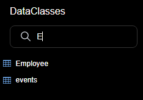

O Data Explorer oferece uma interface web para visualizar, pesquisar e editar dados na sua datastore de projeto. Ao usar esta ferramente, pode navegar facilmente entre todas suas entidades e pesquisar, ordenar ou filtrar valores de atributos. Isso ajuda você a identificar rapidamente problemas em qualquer etapa do processo de desenvolvimento, bem como controlar e editar dados.


## Configuração

The Data Explorer relies on the [`WebAdmin`](webAdmin.md) web server component for the configuration and authentication settings.

- **configuration**: the Data Explorer configuration reuses the [`WebAdmin` web server settings](webAdmin.md#webadmin-settings),
- **authentication**: access to the Data Explorer is granted when the [session user is authenticated](webAdmin.md#authentication-and-session) and has the "WebAdmin" privilege. When the Data Explorer is accessed through the **Data Explorer** menu item (see below), an automatic authentication is provided.

> The Data Explorer access can be disabled using the [`.setAdminProtection()`](API/DataStoreClass.md#setadminprotection) function.

## Abrindo o Data Explorer

[The `WebAdmin` web server](webAdmin.md#starting-the-webadmin-web-server) is started automatically if necessary when the Data Explorer is clicked on.

Para ligar à página Web do Explorador de dados:

- A partir de uma aplicação 4D (com interface):
  - To open a new 4D window with the Data Explorer page displayed in a web area, select **Data Explorer** in the **Records** menu or click on the **Data** button in the main toolbar.
  - To open the Data Explorer in an external browser tab, select **Data Explorer In Browser** in the **Records** menu or press the **Alt** key (Windows)/**Option** key (macOS) and click on the **Data** button in the main toolbar.

- From 4D Server, select **Data Explorer In Browser** in the **Window** menu (the Data Explorer can only be opened on an external browser).

- mesmo se usar uma aplicação 4D headless, pode abrir seu navegador web e digitar o endereço abaixo:

`IPaddress:HTTPPort/dataexplorer`
or
`IPaddress:HTTPSPort/dataexplorer`

In this context, you will be prompted to enter the [access key](webAdmin.md#access-key) to open a `WebAdmin` session on the server:


> [HTTPPort](webAdmin.md#http-port) and [HTTPSPort](webAdmin.md#https-port) values are configured in the `WebAdmin` settings.

## Requisitos

O Data Explorer suporta os seguintes navegadores web:

- Chrome
- Safari
- Edge
- FireFox

A resolução mínima para utilizar o Data Explorer é de 1280x720. A resolução recomendada é 1920x1080.

## Navegação de dados

Para além de uma visão abrangente e personalizável dos seus dados, o Explorador de Dados permite-lhe consultar e ordenar os seus dados.

### Básicos

The Data Explorer provides an overall access to the ORDA data model with respect to the [ORDA mapping rules](ORDA/dsMapping.md#general-rules).

:::info

Quando o modelo ou dados ORDA é modificado no lado da base de dados (tabela adicionada, registo editado ou apagado, etc.), basta atualizar a página do Data Explorer no browser (usando a tecla F5, por exemplo).

:::

You can switch to the **dark mode** display theme using the selector at the bottom of the page:


A página contém várias áreas:

- On the left side are the **Dataclasses area** and **Attributes area**, allowing you can select the dataclasses and attributes to display. Os atributos são ordenados de acordo com a ordem de criação da estrutura subjacente. A chave primária e os atributos indexados têm um ícone específico. É possível filtrar a lista de nomes de dataclass propostos e nomes de atributos utilizando as respectivas áreas de pesquisa.
  

- The central part contains the **Search area** and the **Data grid** (list of entities of the selected dataclass). Cada coluna da grade representa um atributo de datastore.
  - Como padrão, todas as entidades são exibidas. É possível filtrar as entidades apresentadas utilizando a área de pesquisa. Two query modes are available: [Query on attributes](#query-on-attributes) (selected by default), and the [Advanced query with expression](#advanced-query-with-expression). You select the query mode by clicking on the corresponding button (the **X** button allows you to reset the query area and thus stop filtering):
    
  - O nome da classe de dados seleccionada é adicionado como um separador por cima da grelha de dados. Utilizando estas abas, é possível alternar entre os valores já selecionados. Pode remover um dataclass referenciado clicando no ícone "remover" à direita do nome do dataclass.
  - É possível reduzir o número de colunas desmarcando os atributos do lado esquerdo. Também pode mudar as colunas da grade de dados utilizando arrastar e soltar. You can click on a column header to [sort entities](#ordering-entities) according to its values (when possible).
  - Se uma operação exigir muito tempo, é mostrada uma barra de progresso. You can stop the running operation at any moment by clicking on the red button:<br/>
    

- On the right side is the **Details area**: it displays the attribute values of the currently selected entity as well as **related data**, if any. You can browse between the entities of the dataclass by clicking the **First** / **Previous** / **Next** / **Last** links at the bottom of the area.
  - All attribute types are displayed, including pictures, objects (expressed in json) as well as [computed](../ORDA/ordaClasses.md#computed-attributes-1) and [alias](../ORDA/ordaClasses.md#alias-attributes-1) attributes.
  - Related data (many-to-one and one-to-many relations) can be displayed through expandable/collapsable areas:<br/>
    
  - **Ctrl+Click** (Windows) or **Command+Click** (macOS) on a related attribute name in the right side area displays the values of the attribute in an independant, floating area:<br/>
    

### Ordenar entidades

É possível reordenar a lista de entidades apresentada de acordo com os valores dos atributos. Todos os tipos de atributos podem ser utilizados para uma espécie, exceto imagem e objeto.

- Clique no cabeçalho de uma coluna para encomendar entidades de acordo com os valores dos atributos correspondentes. Como padrão, a ordem é ascendente. Clicar duas vezes para uma ordem decrescente. A column used to sort entities is displayed with a small icon and its name is in _italics_.


- É possível ordenar atributos em vários níveis. Por exemplo, é possível classificar os empregados por cidade e depois por salário. To do that, hold down the **Shift** key and click sequentially on each column header to include in the sort order.

### Consulta sobre atributos

Neste modo, é possível filtrar entidades introduzindo valores a encontrar (ou a excluir) nas áreas acima da lista de atributos. Pode filtrar um ou vários atributos. A lista de entidades é automaticamente atualizada quando se digita.


Se introduzir vários atributos, é automaticamente aplicado um AND. For example, the following filter displays entities with _firstname_ attribute starting with "flo" AND _salary_ attribute value > 50000:


The **X** button allows you to remove entered attributes and thus stop filtering.

Estão disponíveis diferentes operadores e opções de consulta, dependendo do tipo de dados do atributo.

> Não é possível filtrar em imagens ou atributos de objectos.

#### Operadores de números

Com atributos numéricos, de data e hora, o operador "=" é seleccionado por defeito. Contudo, pode selecionar outro operador da lista de operadores (clicar no ícone "=" para exibir a lista):


#### Datas

Com atributos de data, pode introduzir a data a utilizar através de um widget de escolha de data (clique na área de data para exibir o calendário):


#### Booleanos

When you click on a boolean attribute area, you can filter on **true**/**false** values but also on **null**/**not null** values:


- **null** indicates that the attribute value was not defined
- **not null** indicates that the attribute value is defined (thus true or false).

#### Text

Os filtros de texto não são diacríticos (a = A).

O filtro é do tipo "começa com". Por exemplo, a entrada "Jim" mostrará os valores "Jim" e "Jimmy".

Também pode usar o caractere coringa (@) para substituir um ou mais caracteres iniciais. Por exemplo:

| Um filtro com       | Resultados                                                                |
| ------------------- | ------------------------------------------------------------------------- |
| Bel                 | Todos os valores que começam com "Bel                                     |
| @do    | Todos os valores contendo "do"                                            |
| Bel@do | Todos os valores que começam com "Bel" e que contêm "do". |

Se quiser criar consultas mais específicas, tais como "é exatamente", poderá ter de utilizar a funcionalidade de consultas avançadas.

### Consultas avançadas com expressão

Ao seleccionar esta opção, é exibida uma área de consulta acima da lista de entidades, permitindo-lhe introduzir qualquer expressão a utilizar para filtrar o conteúdo:


Pode introduzir consultas avançadas que não estão disponíveis como consultas de atributos. For example, if you want to find entities with _firstname_ attribute containing "Jim" but not "Jimmy", you can write:

```
firstname=="Jim"
```

You can use any ORDA query expression as [documented with the `query()` function](API/DataClassClass.md#query), with the following limitations or differences:

- For security, you cannot execute formulas using `eval()`.
- Placeholders cannot be used; you have to write a _queryString_ with values.
- Os valores das strings contendo caracteres espaciais devem ser incorporados entre aspas duplas ("").

Por exemplo, com o Dataclass Employee, pode escrever:

```
firstname = "Marie Sophie" E manager.lastname = "@th"
```

You can click on the `v` icon to display both [`queryPlan`](API/DataClassClass.md#queryplan) and [`queryPath`](API/DataClassClass.md#querypath). Na área, pode pairar sobre os blocos de subconsulta para ter informações detalhadas por subconsulta:


Clique com o botão direito do mouse na área de consulta para exibir as consultas válidas anteriores:


## Edição de dados

O Data Explorer permite que você modifique os valores dos atributos, adicione ou exclua entidades. Essa funcionalidade é destinada aos administradores, por exemplo, para testar implementações ou corrigir problemas com dados inválidos.

### Permitir edição

For security reasons, to be able to edit data through the Data Explorer, you first need to enable the editing mode using the **Allow editing** selector. Quando ativado, os botões de ação de edição são exibidos no lado direito:


This selector is enabled **per dataclass** and **per browser session**.

:::info

O seletor destina-se a prevenir modificações acidentais, uma vez que nenhuma caixa de diálogo de confirmação é exibida ao editar dados através do Explorador de Dados.

:::

### Inserção de valores

When the **Allow editing** selector is enabled for a dataclass, you can enter values for a new or selected entity through dedicated input widgets in the **Details** area for the selected dataclass.

Os seguintes valores de atributos escalares podem ser editados:

- text
- boolean
- numeric
- date
- time
- imagem (você pode carregar ou arrastar e soltar uma imagem)
- objeto (string JSON)

Atributos do Blob não podem ser modificados.

New or modified values are stored in the local cache, you need to [save them explicitely](#saving-modifications) to store them in the data.

### Criação de entidades

You can create a new, empty entity in the selected table by clicking on the creation button . You can then [enter values](#entering-values) for this entity.

The new entity is is kept in the local cache, you need to [save it explicitely](#saving-modifications) to store it in the data.

:::info

Valores de atributo que precisam ser calculados pelo 4D (IDs, atributos calculados) serão retornados apenas após você salvar a entidade.

:::

### Carregamento de valores

The **reload** button  reloads the entity attribute values from the data file. Este botão é útil, por exemplo, quando você deseja se certificar de que os valores exibidos são os valores salvos mais recentes.

### Salvar modificações

Except for [deletion](#deleting-entities) (see below), entity modifications are done locally and need to be saved so that they are stored in the data file.

To save modifications or to save an entity you created in the Data Explorer, click on the **Save** button .

:::info

Modificações em uma entidade existente são automaticamente salvas quando você seleciona outra entidade da mesma classe de dados.

:::

Em caso de conflito (por exemplo, outro usuário modificou o mesmo valor de atributo na mesma entidade), uma mensagem de erro é exibida na parte inferior do Explorador de Dados. You can click on the [**Reload** button](#reloading-values) to get the new value from the data and then, apply and save your modifications.

### Excluindo entidades

You can delete entities by clicking on the **delete** button .

To delete a set of entities, select two or more entities in the list area using **Shift+click** (continuous selection) or **Ctrl/Command+click** (discontinuous selection) and click on the **delete** button.

:::note

Se algumas entidades não puderem ser excluídas devido a um conflito (por exemplo, entidades bloqueadas no servidor), elas serão destacadas na lista.

:::

:::caution

Nenhuma caixa de diálogo de confirmação é exibida quando você exclui entidades. As entidades selecionadas são imediatamente excluídas dos dados.

:::
