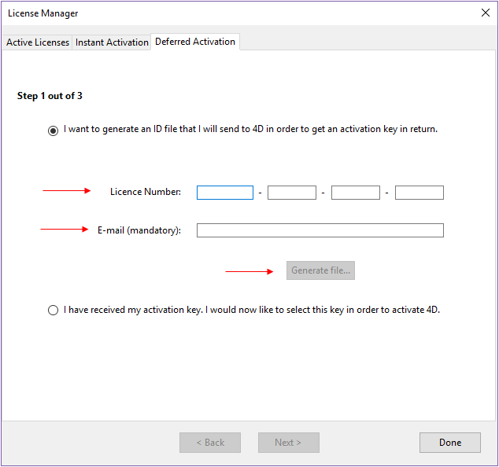
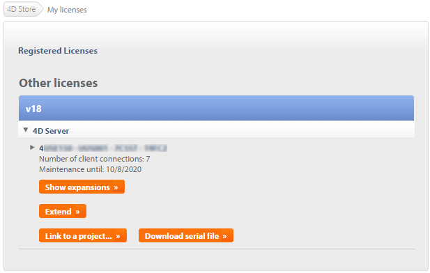

Uma vez instalados no seu disco, deve activar os seus produtos 4D para poder utilizá-los. Usually, the activation is automatic if you [sign in using your 4D account](GettingStarted/Installation.md) in the Welcome Wizard.

Contudo, em casos específicos, poderá ter de activar as suas licenças manualmente, por exemplo, se:

- sua configuração não permitir a ativação automática
- tiver comprado licenças adicionais

Não precisa ativar nada para os usos abaixo:

- 4D usado em modo remoto (conexão ao servidor 4D)
- 4D usado em modo local com um projeto aplicação interpretado sem acesso ao ambiente Design.

## Primeira ativação

With 4D, select the **License Manager...** command from the **Help** menu of the application. Com 4D Server basta lançar a aplicação 4D Server. The dialog box for choosing the [activation mode](#activation-mode) appears.

4D oferece três modos de ativação. We recommend **Instant Activation**.

### Ativação instantânea

Digite seu ID (email ou conta 4D) e sua senha. Se ainda não tiver uma conta de usuário, vai ter que criá-la no endereço a seguir:

[https://account.4d.com/us/login.shtml](https://account.4d.com/us/login.shtml)

Depois entre o número de licença do produto que quiser ativar. Esse número é fornecido por email depois da compra do produto.

### Ativação postergada

If you are unable to use [instant activation](#instant-activation) because your computer does not have internet access, please proceed to deferred activation using the following steps.

1. In the License Manager window, select the **Deferred Activation** tab.
2. Enter the License Number and your e-mail address, then click **Generate file** to create the ID file (_reg.txt_).

3. Save the _reg.txt_ file to a USB drive and take it to a computer that has internet access.
4. On the machine with internet access, login to [https://activation.4d.com](https://activation.4d.com).
5. On the Web page, click on the **Choose File...** button and select the _reg.txt_ file from steps 3 and 4; then click on the **Activate** button.
6. Baixe os arquivos seriais.

7. Save the _license4d_ file(s) on a shared media and transfer them back to the 4D machine from step 1.
8. Now back on the machine with 4D, still on the **Deferred Activation** page, click **Next**; then click the **Load...** button and select a _license4d_ file from the shared media from step 7.

With the license file loaded, click on **Next**.

9. Click on the **Add N°** button to add another license. Repita esses passos até que todas as licenças do passo 6 tenham sido integradas.

Sua aplicação 4D agora está ativada.

### Ativação emergencial

Esse modo pode ser usado para ativação temporária especial de 4D (por no máximo 5 dias) sem conexão a um site 4D Web. Essa ativação só pode ser usada uma vez.

## Adicionar licenças

Pode adicionar novas licenças, por exemplo par aumentar as capacidades de sua aplicação, a qualquer momento.

Choose the **License Manager...** command from the **Help** menu of the 4D or 4D Server application, then click on the **Refresh** button:

This button connects you to our customer database and automatically activates any new or updated licenses related to the current license (the current license is displayed in **bold** in the "Active Licenses" list). Será pedido sua conta de usuário e senha.

- If you purchased additional expansions for a 4D Server, you do not need to enter any license number -- just click **Refresh**.
- Na primeira ativação de um Servidor 4D, basta introduzir o número do servidor e todas as expansões compradas são automaticamente atribuídas.

You can use the **Refresh** button in the following contexts:

- Quando tiver adquirido uma expansão adicional e quiser ativá-la,
- Quando for necessário atualizar um número temporário expirado (Parceiros ou evoluções).

## 4D Online Store

Na loja 4D, pode encomendar, atualizar, ampliar, e/ou gerir produtos 4D. You can reach the store at the following address: [https://store.4d.com/us/](https://store.4d.com/us/) (you will need to select your country).

Click **Login** to sign in using your existing account or **New Account** to create a new one, then follow the on-screen instructions.

### Gestão de licenças

After you log in, you can click on **License list** at the top right of the page:

Aqui pode gerir as suas licenças, atribuindo-as a projectos.

Select the appropriate license from the list then click **Link to a project... >**:

Pode selecionar um projeto existente ou criar um novo:

Pode utilizar os projectos para organizar as suas licenças de acordo com as suas necessidades:

## Resolução de problemas

Se a instalação ou o processo de ativação falhar, verificar a tabela seguinte, que apresenta as causas mais comuns de mau funcionamento:

| Sintomas                                                                                         | Possíveis causas                                           | Solução(ões)                                                                                                                                       |
| ------------------------------------------------------------------------------------------------ | ---------------------------------------------------------- | --------------------------------------------------------------------------------------------------------------------------------------------------------------------- |
| Impossível descarregar o produto do sítio 4D da Internet                                         | Sítio Internet indisponível, aplicação antivírus, firewall | 1- Tente novamente mais tarde OU 2- Desative temporariamente a sua aplicação antivírus ou a sua firewall.                                             |
| Impossível instalar o produto em disco (instalação recusada). | Direitos de acesso insuficientes dos utilizadores          | Abrir uma sessão com direitos de acesso que lhe permita instalar aplicações (acesso de administrador)                                              |
| Falha da ativação on-line                                                                        | Aplicação antivírus, firewall, proxy                       | 1- Desative temporariamente a sua aplicação antivírus ou a sua firewall OU 2- Use ativação diferida (não disponível com licenças para versões "R") |

Se estas informações não o ajudarem a resolver o seu problema, por favor contate 4D ou o seu distribuidor local.

## Contactos

Para quaisquer questões sobre a instalação ou activação do seu produto, contacte 4D, Inc. ou o seu distribuidor local.

Para os EUA:

- Web: [https://us.4d.com/4d-technical-support](https://us.4d.com/4d-technical-support)
- Telefone: 1-408-557-4600

Para o Reino Unido:

- Web: [https://uk.4d.com/4d-technical-support](https://uk.4d.com/4d-technical-support)
- Telefone: 01625 536178
