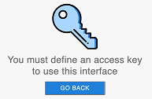

An embedded web server component, named `WebAdmin`, is used by 4D and 4D Server to provide a secured web access to specific management features such as the [Data Explorer](dataExplorer.md). Pode conectar localmente ou remotamente ao servidor web de um navegador ou uma aplicação web e acessar a aplicação 4D associada.

O webAdmin maneja a autenticação de usuários com privilégios "WebAdmin" de forma que possa abrir sessões administrativas e acessar interfaces dedicadas.

Essa funcionalidade pode ser usada em aplicações 4D rodando headless (sem monitor e periféricos) assim como aplicações 4D rodando sem interfaces.

## Iniciar o web server WebAdmin

By default, the `WebAdmin` web server is not launched. Precisa configurar o lançamento ao início ou (em versões com interface) lançar manualmente usando um item de menu.

### Lançar ao início

You can configure the `WebAdmin` web server to be launched at 4D or 4D Server application startup (before any project is loaded).

- If you use a 4D application with interface, select the **File > Web Administration > Settings...** menu item.


Check the **Launch WebAdmin server at startup** option in the settings dialog box:


- Whether you use 4D application which is headless or not, you can enable the automatic startup mode using the following _Command Line Interface_ argument:

```
open ~/Desktop/4D.app --webadmin-auto-start true
```

> If the TCP port used by the `WebAdmin` web server ([HTTPS](#https-port) or [HTTP](#http-port), depending on the settings) is not free at startup, 4D will try successively the 20 following ports, and use the first one that is available. Se nenhum porto estiver disponível, o servidor web não é lançado e um erro é exibido (ou em aplicação headless, aparece no console)

### Iniciar e parar

If you use a 4D application with interface, you can start or stop the `WebAdmin` web server for your project at any moment:

Select the **File > Web Administration > Start Server** menu item.


The menu item becomes **Stop Server** when the server is launched; select **Stop Server** to stop the `WebAdmin` web server.

## Propriedades WebAdmin

Configuring the `WebAdmin` component is mandatory in particular to define the [**access key**](#access-key). Como padrão, quando a chave de acesso não for estabelecida, o acesso via uma url não é permitido.

You can configure the `WebAdmin` component using the [Web Administration settings dialog box](#settings-dialog-box) (see below).

> If you use a headless 4D application, you can use [_Command Line Interface_ arguments](#webadmin-headless-configuration) to define basic settings. Se quiser personalizar o arquivo de configurações para definir os parâmetros avançados.

### Caixa de diálogos de configurações

To open the Web Administration settings dialog box, select the **File > Web Administration > Settings...** menu item.


A caixa de diálogo abaixo é mostrada:


#### Iniciar o servidor WebAdmin na inicialização

Check this option if you want the `WebAdmin` web server to be automatically launched when the 4D or 4D Server application starts ([see above](#launching-at-startup)). Como padrão essa opção não é marcada.

#### Conexões HTTP em localhost aceitas

When this option is checked, you will be able to connect to the `WebAdmin` web server through HTTP on the same machine as the 4D application. Como padrão, essa opção é marcada.

**Notas:**

- Conexões com HTTP outras que localhost nunca são aceitas.
- Even if this option is checked, when [Accept HTTPS](#accept-https) is checked and the TLS configuration is valid, localhost connections use HTTPS.

#### Porta HTTP

Port number to use for connections through HTTP to the `WebAdmin` web server when the **Accept HTTP connections on localhost** option is checked. Valor normal padrão é 7080

#### Aceitar HTTPS

When this option is checked, you will be able to connect to the `WebAdmin` web server through HTTPS. Como padrão, essa opção é marcada.

#### Porta HTTPS

Port number to use for connections through HTTPS to the `WebAdmin` web server when the **Accept HTTPS** option is checked. Valor normal padrão é 7443

#### Rota da pasta de certificados

Rota da pasta onde o certificado TLS está localizado. Como padrão, a rota da pasta de certificados está vazia e 4D ou Servidor 4D usa os arquivos de certificados contidos na apicação 4D (certificados personalizados devem ser armazenados do lado da pasta projeto).

#### Modo de registro de depuração/debug

Status or format of the HTTP request log file (HTTPDebugLog__nn_.txt, stored in the "Logs" folder of the application -- _nn_ is the file number). As opções abaixo estão disponíveis:

- **Disable** (default)
- **With all body parts** - enabled with body parts in response and request
- **Without body parts** - enabled without body parts (body size is provided)
- **With request body** - enabled with body part in request only
- **With response body** - enabled with body part in response only

#### Chave de acesso

Defining an access key is mandatory to unlock access to the `WebAdmin` web server through a URL (access via a 4D menu command does not require an access key). When no access key is defined, no web client is allowed to connect through a URL to a web administration interface like the [Data Explorer page](dataExplorer.md). Uma página de erro é retornada no caso uma solicitação de conexão:



Uma chave de acesso é parecida a uma senha, mas não está associada com um login.

- To define a new access key: click the **Define** button, enter the access key string in the dialog box and click **OK**. The button label becomes **Modify**.
- To modify the access key: click the **Modify** button, enter the new access key string in the dialog box and click **OK**.
- To delete the access key: click the **Modify** button, let the access key area empty and click **OK**.

#### Ativar o acesso a Qodly Studio

:::note

Essa opção só aparece se a licença do Qodly Studio estiver ativada.

:::

This option enables user access to [Qodly Studio](../WebServer/qodly-studio.md) at the 4D application level. Note that you also need to [enable the access at every project level](../settings/web.md#enable-access-to-qodly-studio).

## Configuração de WebAdmin sem interface

All [WebAdmin settings](#webadmin-settings) are stored in the `WebAdmin.4DSettings` file. There is one default `WebAdmin.4DSettings` file per 4D and 4D Server application, so that it is possible to deploy multiple applications on the same host machine.

When running a 4D or 4D Server application headless, you can set and use the default `WebAdmin.4DSettings` file, or designate a custom `.4DSettings` file.

To set the file contents, you can use the [WebAdmin settings dialog](#settings-dialog-box) of the 4D application with interface and run it headless afterwards. The default `WebAdmin.4DSettings` file is then used.

Or, you can set a custom `.4DSettings` file (xml format) and use it instead of the default file. Several dedicated arguments are available in the [Command line interface](cli.md) to support this feature.

> The access key is not stored in clear in the `.4DSettings` file.

Exemplo:

```
"%HOMEPATH%\Desktop\4D Server.exe" MyApp.4DLink --webadmin-access-key 
	"my Fabulous AccessKey" --webadmin-auto-start true   
	--webadmin-store-settings

```

## Autenticação e sessão

- Quando acessar uma página de gestão entrando uma URL e sem identificação prévia, uma autenticação é exigida. The user must enter the [access key](#access-key) in an authentication dialog box. If the access key was not defined in the `WebAdmin` settings, no access via URL is possible.

- When a web management page is accessed directly from a 4D or 4D Server menu item (such as **Records > Data Explorer** or **Window > Data Explorer** (4D Server)), access is granted without authentication, the user is automatically authenticated.

Once the access is granted, a web [session](WebServer/sessions.md) with the "WebAdmin" privilege is created on the 4D application. As long as the current session has "WebAdmin" privilege, the `WebAdmin` component delivers requested pages.
