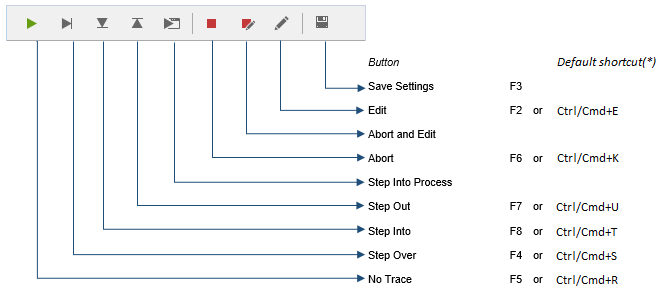
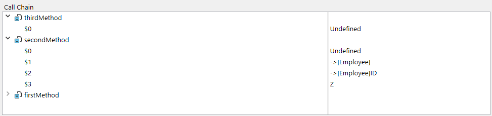
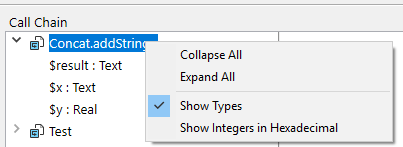
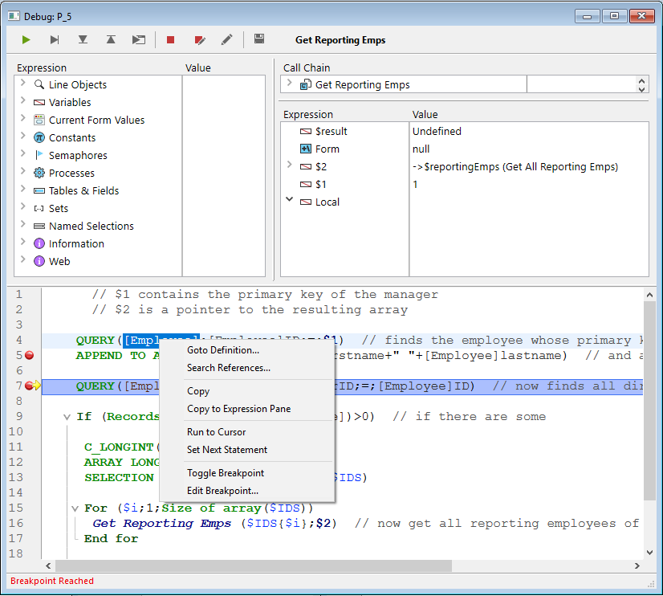

O depurador é útil quando é necessário detetar erros ou monitorizar a execução de métodos. Permite-lhe percorrer o seu código lentamente e examinar a informação. Este processo é designado por "rastreio".


## Chamando o depurador

Há várias formas de exibir o depurador:

- Clicking the **Trace** button in the [Syntax Error window](basics.md#syntax-error-window)
- Using the [`TRACE`](https://doc.4d.com/4dv19/help/command/en/page157.html) command
- Clicking the **Debug** button in the Execute Method window or selecting **Run and debug...** button in the Code Editor
- Using **Alt+Shift+Right click** (Windows) or **Ctrl+Option+Cmd+Click** (macOS) while a method is executing, then selecting the process to trace in the pop-up menu:


- Clicking the **Trace** button when a process is selected in the Process page of the Runtime Explorer.
- Adicionar um ponto de interrupção na janela do Editor de código ou nas páginas Break e Catch do Explorador de execução.

Quando chamada, a janela do depurador fornece o nome do método ou da função de classe que rastreia atualmente e a ação que causa o aparecimento inicial da janela do depurador. Por exemplo, na janela do depurador acima:

- _Clients_BuildLogo_ is the method being traced
- The debugger window appeared because it detected a call to the `C_PICTURE` command and this command was one of the commands to be caught

A exibição de uma nova janela do depurador utiliza a mesma configuração que a última janela exibida na mesma sessão. Se executar vários processos usuário, pode rastreá-los de forma independente e ter uma janela do depurador aberta para cada processo.

A janela do depurador é normalmente apresentada na máquina onde o código é executado. Com uma aplicação monousuário, é sempre apresentado na máquina que executa a aplicação. Com uma aplicação cliente/servidor, é apresentado:

- no 4D remoto para o código que está a ser executado localmente
- on the server machine for code running on the server (for example, a method with the **execute on server** option).

> Se o servidor estiver a funcionar sem interface, não pode ser apresentada qualquer janela do depurador no servidor, pelo ser necessário utilizar o depurador remoto. See [Debugging from remote machines](./debugging-remote.md).

## Botões da barra de ferramentas

A barra de ferramentas do depurador inclui vários botões, associados a atalhos predefinidos:



> Os atalhos padrão podem ser personalizados na página Atalhos da caixa de diálogo Preferências.

#### Retomar execução

Interrompe o modo de rastreamento e retoma o curso normal da execução do método.

> **Shift** + **F5** or **Shift** + clicking the **No Trace** button resumes execution. Também desativa todas as chamadas TRACE subsequentes para o processo atual.

#### Executar passo a passo

Executa a linha de método atual, indicada pelo contador de programa (a seta amarela). O depurador passa para a linha seguinte.

O botão Executar não entra em sub-rotinas e funções, mantém-se ao nível do método que rastreia atualmente. If you want to also trace subroutines and functions calls, use the **Step Into** button.

Na depuração remota, se o método for executado no servidor, o método principal é chamado após a execução da última linha do método secundário. If the parent method is executed on the remote side, the **Step Over** button has the same effect as the **No Trace** button.

#### Passo a passo detalhado

Quando uma linha que chama outro método (sub-rotina ou função) é executada, clique neste botão para exibir o outro método e percorrê-lo.

The new method becomes the current (top) method in the [Call Chain Pane](#call-chain-pane) of the Debugger window.

When executing a line that does not call another method, this button has the same effect as the **Step Over** button.

#### Abortar

Interrompe a execução do método e regressa ao estado anterior ao início da execução do método:

- Ao rastrear um método formulário ou um método objeto em execução em resposta a um evento: pára e retorna ao formulário.
- Ao rastrear um método em execução no ambiente do aplicativo: pára e retorna ao ambiente.

#### Abortar e editar

Pausa na execução do método. The method that is executing when you click the **Abort and Edit** button opens in the Code Editor.

> **Tip**: Use this button when you know which changes are required in your code, and when these changes are required to pursue the testing of your methods. Quando terminar as alterações, volte a executar o método.

#### Editar

Pausa na execução do método. O método executado no momento em que se clica no botão Editar abre-se no Editor de código.

Se utilizar este botão para modificar um método, as modificações só entram em vigor na próxima vez que este for executado.

> **Tip:** Use this button when you know which changes are required in your code and when they don't interfere with the rest of the code to be executed or traced.

#### Botão Salvar parâmetros

Salva a configuração atual da janela do depurador e a torna a configuração padrão. Isto inclui:

- o tamanho e a posição da janela
- a posição das linhas de divisão e o conteúdo da área que avalia as expressões

Estes parâmetros são armazenados no projeto.

This action is not available in remote debugging mode (see [Debugging from Remote Machines](./debugging-remote)).

## Janela de expressão

The **Watch pane** is displayed in the top left corner of the Debugger window, below the Execution Control Tool Bar. Aqui um exemplo simples:


> Este painel não está disponível no modo de depuração remota.

The **Watch Pane** displays useful general information about the system, the 4D environment, and the execution environment.

The **Expression** column displays the names of the objects and expressions. The **Value** column displays their current corresponding values. Clicar em qualquer valor no lado direito do painel permite-lhe modificar o valor do objeto, se tal for permitido para esse objeto.

At any point, you can drag and drop themes, theme sublists (if any), and theme items to the [Custom Watch Pane](#custom-watch-pane).

### Lista de expressões

#### Objetos linha

Este tema permite-lhe acompanhar os valores dos objetos ou expressões:

- used in the line of code to be executed (the one marked with the program counter—the yellow arrow in the [Source Code Pane](#source-code-pane)),
- utilizado na linha de código anterior

Como a linha de código anterior é a que acabou de ser executada antes, este tema mostra os objetos ou expressões da linha atual antes e depois da execução da linha.  Digamos que executa o seguinte método:

```4d
TRACE
$a:=1
$b:=a+1
$c:=a+b
```

1. A Debugger window opens with the program counter set to the line with `a:=1`. At this point the **Line Objects** theme displays:

   | $a | Indefinido |
   | -- | ---------- |

   The `$a` variable is not yet initialized, but it is displayed because it is used in the line to be executed.

2. You click the **Step Over** button. The program counter is now set to the line `b:=a+1`. Nesta altura, o tema mostra:

   | $a | 1          |
   | -- | ---------- |
   | $b | Indefinido |

   The value of the `$a` variable is now 1. The `$b` variable is not yet initialized, but it is displayed because it is used in the line to be executed.

3. You click the **Step Over** button again. O contador do programa está agora definido na linha com c:=a+b. Neste ponto, é exibido o tema Objetos de linha:

   | $c | Indefinido |
   | -- | ---------- |
   | $a | 1          |
   | $b | 2          |

   The value of the `$b` variable is now 2. The `$c` variable is not yet initialized, but it is displayed because it is used in the line to be executed.

#### Variáveis.

Este tema é composto pelos seguintes subtemas:

| Subtema       | Descrição                                                         | Os valores podem ser modificados? |
| ------------- | ----------------------------------------------------------------- | --------------------------------- |
| Interprocesso | Lista de variáveis interprocessos que são utilizadas agora        | Sim                               |
| Processo      | Lista de variáveis processo utilizadas pelo processo atual        | Sim                               |
| Local         | Lista de variáveis locais utilizadas pelo método rastreado        | Sim                               |
| Parâmetros    | Lista dos parâmetros recebidos pelo método                        | Sim                               |
| Self          | Ponteiro para o objeto atual, quando se rastreia um método objeto | Não                               |

Os arrays, como outras variáveis, aparecem nos subtemas Interprocesso, Processo e Local, dependendo do seu escopo. O depurador apresenta os primeiros 100 elementos. Inside the **Value** column, you can modify the values of array elements, but not the size of the arrays.

To display the variable types and their internal names, right click and check the **Show Types** option in the context menu:


Aqui está o resultado:


#### Valores actuais do formulário

Este tema contém o nome de cada objeto dinâmico incluído no formulário atual, bem como o valor da sua variável associada:


Alguns objetos, como os arrays list box, podem ser apresentados como dois objetos distintos, a variável do próprio objeto e a sua fonte de dados.

#### Constantes

Como a página Constantes da janela Explorer, esse tema exibe as constantes predefinidas oferecidas pelo 4D. As expressões deste tema não podem ser modificadas.

#### Semáforos

Este tema lista os semáforos locais definidos atualmente. Para cada semáforo, a coluna Valor fornece o nome do processo que define o semáforo. As expressões deste tema não podem ser modificadas. The expressions from this theme cannot be modified.

#### Processos

Este tema enumera os processos iniciados desde o início da sessão de trabalho. A coluna do valor apresenta o tempo utilizado e o estado atual de cada processo (ou seja, Executando, pausado, etc.). As expressões deste tema não podem ser modificadas.

#### Tabela

Este tema lista as tabelas e campos na base de dados 4D. For each Table item, the Value column displays the size of the current selection for the current process as well as the number of **locked records**.

Para cada item Campo, a coluna Valor apresenta o valor do campo para o registo atual (exceto imagem e BLOB). Pode modificar os valores dos campos, mas não as informações das tabelas.

#### Conjuntos

Este tema lista os conjuntos definidos no processo atual (aquele que está sendo rastreado) e os conjuntos interprocessos. Para cada conjunto, a coluna Valor apresenta o número de registos e o nome da tabela. As expressões deste tema não podem ser modificadas.

#### Seleções temporárias

Este tema lista as seleções temporárias definidas no processo atual (aquele que está sendo rastreado no momento); ele também lista as seleções temporárias entre processos. Para cada seleção temporária, a coluna Valor apresenta o número de registos e o nome da tabela. As expressões deste tema não podem ser modificadas.

#### Informação

Este tema contém informações gerais sobre o funcionamento da base de dados, tais como a tabela predefinida atual (se existir), espaço de memória físico, virtual, livre e utilizado, destino da consulta, etc.

#### Web

Este tema apresenta informações sobre o servidor Web principal da aplicação (apenas disponível se o servidor Web estiver ativo):

- Arquivo Web para Enviar: nome do arquivo Web aguardando ser enviado (se houver)
- Utilização da cache Web: número de páginas presentes na cache Web, bem como a sua percentagem de utilização
- Tempo decorrido do servidor Web: duração da utilização do servidor Web no formato horas:minutos:segundos
- Contagem de visitas à Web: número total de pedidos HTTP recebidos desde o lançamento do servidor Web, bem como o número instantâneo de pedidos por segundo
- Número de processos Web ativos: número de processos Web ativos, todos os processos Web em conjunto

As expressões contidas neste tema não podem ser modificadas.

### Menu contextual

O menu contextual da janela de expressão oferece opções adicionais.


- **Collapse All**: Collapses all levels of the hierarchical list.
- **Expand All**: Expand all levels of the hierarchical list.
- **Show Types**: Displays the type of each item (when appropriate).
- **Show Field and Table Numbers**: Displays the number of each table or field. Useful if you work with table or field numbers, or with pointers using commands such as `Table` or `Field`.
- **Show Icons**: Displays an icon denoting the object type for each object. You can turn this option off in order to speed up the display, or just because you prefer to use only the **Show Types** option.
- **Sorted Tables and Fields**: Sorts the tables and fields in alphabetical order within their respective lists.
- **Show Integers in Hexadecimal**: Numbers are usually displayed in decimal notation. Esta opção apresenta-os em notação hexadecimal. Nota: para introduzir um valor numérico em hexadecimal, digite 0x (zero + "x"), seguido dos dígitos hexadecimais.
- **Enable activity monitoring**: Activates the monitoring of activity (advanced checking of internal activity of the application) and displays the information retrieved in the additional themes: **Scheduler**, **Web** and **Network**.

## Painel da cadeia de chamadas

Um método pode chamar outros métodos ou funções de classe, que podem chamar outros métodos ou funções. O painel Cadeia de chamadas permite-lhe acompanhar essa hierarquia.



Cada item do nível principal é o nome de um método ou função classe. O item superior é o que é atualmente rastreado, o item seguinte do nível principal é o nome do chamador (o método ou função que chamou o que é atualmente rastreado), o item seguinte é o chamador do chamador, e assim por diante.

Na imagem acima:

- `thirdMethod` has not received any parameter
- `$0` is currently undefined, as the method did not assign any value to `$0` (because it has not executed this assignment yet or because the method is a subroutine and not a function)
- `secondMethod` has received three parameters from `firstMethod`:
  - $1 is a pointer to the `[Employee]` table
  - $2 is a pointer to the `ID` field in the  `[Employee]` table
  - $3 é um parâmetro alfanumérico cujo valor é "Z"

You can double-click the name of any method to display its contents in the [Source Code Pane](#source-code-pane).

Clicar no ícone junto ao nome de um método ou função expande, ou recolhe os parâmetros e o resultado (se existir). Os valores aparecem no lado direito do painel. Clicar em qualquer valor do lado direito permite-lhe alterar o valor de qualquer parâmetro ou resultado de função.

To display the parameter type, check the **Show types** option in the contextual menu:



After you deploy the list of parameters, you can drag and drop parameters and function results to the [Custom Watch Pane](#custom-watch-pane).

You can also use the [Get call chain](https://doc.4d.com/4dv19/help/command/en/page1662.html) command to retrieve the call chain programmatically.

## Painel de Observação Personalizado

O Painel de controle personalizado é útil para avaliar expressões. It is similar to the [Watch Pane](#watch-pane), except here you decide which expressions are displayed. Qualquer tipo de expressão pode ser avaliado:

- campo
- variável
- pointer
- cálculo
- Comando 4D
- method
- e qualquer outra coisa que devolva um valor


É possível avaliar qualquer expressão que possa ser apresentada sob a forma de texto. Isto não abrange os campos ou variáveis imagem e BLOB. To display BLOB contents, you can use BLOB commands, such as [BLOB to text](https://doc.4d.com/4dv19/help/command/en/page555.html).

### Manuseamento de expressões

Existem várias formas de adicionar expressões à lista:

- Arraste e solte um objeto ou expressão do painel Watch ou do painel Call Chain
- Select an expression in the [Source Code pane](#source-code-pane) and press **ctrl+D**  (Windows) or **cmd+D** (macOS)
- Dê duplo clique em algum lugar no espaço vazio do Custom Watch Pane (adiciona uma expressão com um nome de espaço reservado que você pode editar)

Pode introduzir qualquer fórmula que devolva um resultado.

To edit an expression, click on it to select it, then click again or press **Enter** on your keyboard.

To delete an expression, click on it to select it, then press **Backspace** or **Delete** on your keyboard.

> **Warning:** Be careful when you evaluate a 4D expression modifying the value of one of the System Variables (for instance, the OK variable) because the execution of the rest of the method may be altered.

### Menu contextual

O menu de contexto do Custom Watch Pane lhe dá acesso ao editor de fórmulas 4D e a outras opções:


**New Expression**: This inserts a new expression and displays the 4D Formula Editor.


For more information on the Formula Editor, see the <a href="https://doc.4d.com/4Dv19/4D/19/4D-Design-Reference.100-5416591.en.html" target="_blank">4D Design Reference manual.</a>

- **Insert Command**: Shortcut for inserting a 4D command as a new expression.
- **Delete All**: Removes all expressions from the Custom Watch Pane.
- **Standard Expressions**: Copies the Watch Pane's list of expressions.

> This option is not available in remote debugging mode (see [Debugging from Remote Machines](https://doc.4d.com/4Dv19/4D/19/Debugging-from-Remote-Machines.300-5422483.en.html)).

- **Collapse All/Expand All**: Collapses or Expands all the hierarchical lists.
- **Show Types**: Displays the type of each item in the list (when appropriate).
- **Show Field and Table Numbers**: Displays the number of each table or field of the **Fields**. Useful if you work with tables, field numbers or pointers using the commands such as `Table` or `Field`.
- **Show Icons**: Displays an icon denoting the type of each item.
- **Sorted Tables and Fields**: Displays the table and fields in alphabetical order.
- **Show Integers in Hexadecimal**: Displays numbers using hexadecimal notation. Para introduzir um valor numérico em hexadecimal, digite 0x (zero + "x"), seguido dos dígitos hexadecimais.

## Panel de código fuente

O painel Código-fonte mostra o código-fonte do método ou função que está sendo rastreado no momento.

This area also allows you to add or remove [**break points**](breakpoints.md).

### Tips

Passe o ponteiro do rato sobre qualquer expressão para visualizar uma dica de ferramenta que indica:

- o tipo declarado da expressão
- o valor atual da expressão


Isto também funciona com as selecções:


### Adição de expressões ao painel de controle personalizado

You can copy any selected expression from the Source Code Pane to the [Custom Watch Pane](#custom-watch-pane).

1. No painel de código fonte, selecione a expressão a avaliar
2. Faça uma das seguintes opções:
   - Arraste e solte o texto selecionado na área Expression (Expressão) do Custom Watch Pane (Painel de observação personalizada)
   - Press **Ctrl+D** (Windows) or **Cmd+D** (macOS)
   - Right-click the selected text **>** **Copy to Expression Pane**

### Contador do programa

A seta amarela na margem esquerda do painel Código-fonte é chamada contador de programa. Marca a linha seguinte a ser executada.

Por padrão, a linha do contador de programas (também designada por linha de execução) é realçada no depurador. You can customize the highlight color in the [Methods page of the Preferences](Preferences/methods.md).

#### Movendo o contador do programa

Para efeitos de depuração, é possível deslocar o contador de programa para o método no topo da cadeia de chamadas (o método atualmente em execução). Para o fazer, clique e arraste a seta amarela para outra linha.

Isto apenas diz ao depurador para prosseguir o rastreio ou a execução a partir de um ponto diferente. Não executa linhas nem anula a sua execução. Todos os parâmetros, campos, variáveis, etc. atuais não são afetados.

Por exemplo:

```4d
  // ...
 If(This condition)
    DO_SOMETHING
 Else
    DO_SOMETHING_ELSE
 End if
  // ...
```

Say the program counter is set to the line `If (This condition)`.
When you click the **Step over** button, the program counter moves directly to the `DO_SOMETHING_ELSE` line.
To examine the results of the `DO_SOMETHING` line, you can move the program counter to that line and execute it.

### Menu contextual

O menu contextual do painel Código-fonte fornece acesso a várias funções que são úteis ao executar métodos no modo Rastreamento:



- **Goto Definition**: Goes to where the selected object is defined. Este comando está disponível para:
  - _Project methods:_ displays method contents in a new window of the Code Editor
  - _Fields:_ Displays field properties in the inspector of the Structure window
  - _Tables:_ Displays table properties in the inspector of the Structure window
  - _Forms:_ Displays form in the Form editor
  - _Variables_ (local, process, interprocess or $n parameter): displays the line in the current method or among the compiler methods where the variable is declared
- **Search References** (also available in Code Editor): Searches all project objects (methods and forms) in which the current element of the method is referenced. O elemento atual é o elemento selecionado ou o elemento onde se encontra o cursor. Pode ser o nome de um campo, variável, comando, cadeia de caracteres, etc. Os resultados da pesquisa são apresentados numa nova janela de resultados padrão.
- **Copy**: Standard copy of the selected expression to the pasteboard.
- **Copy to Expression Pane**: Copy the selected expression to the Custom Watch Pane.
- **Run to Cursor**:Executes statements found between the program counter and the selected line of the method (where the cursor is found).
- **Set Next Statement**:Moves program counter to the selected line without executing this line or any intermediate ones. A linha designada só será executada se o usuário clicar em um dos botões de execução.
- **Toggle Breakpoint** (also available in Code Editor): Alternately inserts or removes the breakpoint corresponding to the selected line. Isso modifica o ponto de interrupção permanentemente: por exemplo, se você remover um ponto de interrupção no depurador, ele não aparecerá mais no método original.
- **Edit Breakpoint** (also available in Code Editor): Displays the Breakpoint Properties dialog box. Quaisquer alterações efetuadas modificam permanentemente o ponto de interrupção.

### Localizar seguinte/anterior

Os atalhos específicos permitem-lhe encontrar cadeias de caracteres idênticas à que foi selecionada:

- To search for the next identical strings, press **Ctrl+E** (Windows) or **Cmd+E** (macOS)
- To search for the previous identical strings, press **Ctrl+Shift+E** (Windows) or **Cmd+Shift+E** (macOS)

A pesquisa só é efetuada se selecionar pelo menos um carácter no painel Código fonte.

## Atalhos

Esta secção lista todos os atalhos disponíveis na janela do depurador.

> The tool bar also has [shortcuts](#tool-bar-buttons).

#### Watch Pane & Custom Watch Pane

- **Double-click** an item in the Watch Pane to copy it to the Custom Watch Pane
- **Double-Click** in the Custom Watch Pane to create a new expression

#### Panel de código fuente

- Clique na margem esquerda para definir ou remover pontos de quebra.
- **Alt+Shift+Click** (Windows) or **Option+Shift+Click** (macOS) sets a temporary break point.
- **Alt-Click** (Windows) or **Option-Click** displays the Edit Break window for a new or existing break point.
- Uma expressão ou objeto selecionado pode ser copiado para a janela de avaliação personalizada através de um simples arrastar e largar.
- **Ctrl+D** (Windows) or **Cmd+D** (macOS) key combinations copy the selected text to the Custom Watch Pane.
- **Ctrl+E** (Windows) or **Cmd+E** (macOS) key combinations find the next strings identical to the one selected.
- **Ctrl+Shift+E** (Windows) or **Cmd+Shift+E** (macOS) key combinations find the previous strings identical to the one selected.

#### Todas as janelas

- **Ctrl** + **+/-** (Windows) or **Command** + **+/-** (macOS) increases or decreases the font size for a better readability. O tamanho de letra modificado também é aplicado ao Editor de código sendo guardado nas Preferências.
- **Ctrl + \*** (Windows) or **Command + \*** (macOS) forces the updating of the Watch Pane.
- When no item is selected in any pane, press **Enter** to step over.
- Quando um valor de item é selecionado, utilize as teclas de setas para navegar na lista.
- Ao editar um item, utilize as teclas de seta para mover o cursor. Utilize Ctrl-A/X/C/V (Windows) ou Comandó-A/X/C/V (macOS) como atalhos para os comandos de menu Selecionar tudo/Cortar/Copiar/Colar do menu Editar.
