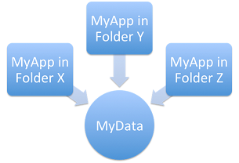
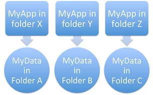
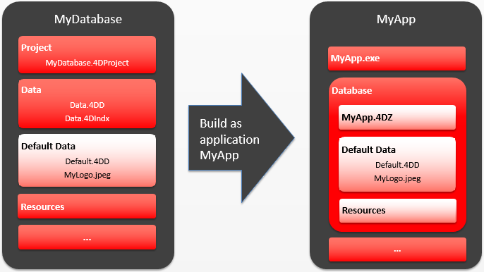

4D inclui um gerador de aplicativos para criar um pacote de projeto (versão final). Esse gerador simplifica o processo de finalização e desenvolvimento de aplicativos compilados 4D. Trata automaticamente as funcionalidades específicas de diferentes sistemas operacionais e facilita a implementação de aplicações cliente-servidor.

O construtor de aplicações permite-lhe:

- Build a compiled structure or component, without interpreted code,
- Build a stand-alone, double-clickable application, _i.e._, merged with 4D Volume Desktop, the 4D database engine,
- Gerar aplicações diferentes a partir do mesmo banco de dados compilado mediante um projeto XML,
- Criar aplicações cliente-servidor homogêneas,
- Construir aplicações cliente-servidor com atualização automática de partes do cliente e do servidor.
- Save your build settings for future use (_Save settings_ button).

> Compiled applications are based upon [.4dz files](#build-compiled-structure) that are **read-only**. Keep in mind that using commands or functions that modify the source files (such as `CREATE INDEX` or `CREATE TABLE` (SQL)) is not possible by default in compiled applications. However, you can build specific applications that support local modifications by using the `PackProject` XML key (see [doc.4d.com](https://doc.4d.com)).

## Visão Geral

A cria de um pacote de projetos pode ser efetuada utilizando:

- either the [`BUILD APPLICATION`](https://doc.4d.com/4dv20/help/command/en/page871.html) command,
- or the [Build Application dialog](#application-builder).

:::tip

You can also download and use [`Build4D`](https://github.com/4d-depot/Build4D), a component that provides classes to compile, build, and sign 4D projects, even from a headless application.

:::

### Diálogo criar aplicação

To display the Build application dialog, select **Design** > **Build Application...** from the menu bar.


A caixa de diálogo Criar aplicação inclui várias páginas que podem ser acedidas através de separadores:


A geração do banco de dados só pode ser realizado quando o banco de dados for compilado. Se selecionar esse comando sem ter previamente compilado o banco de dados, ou no caso do código compilado não for correspondente ao código interpretado, aparece uma caixa de diálogo de advertência que indica que o banco de dados deve ser (re)compilado.

### buildApp.4DSettings

Each build application parameter is stored as an XML key in the application project file named `buildApp.4DSettings` XML file, located in the [`Settings` folder of the project](../Project/architecture.md#settings-1).

Os parâmetros padrão são utilizados na primeira vez que a caixa de diálogo Criar aplicação é utilizada. The contents of the project file are updated, if necessary, when you click **Build** or **Save settings**. You can define several other XML settings file for the same project and employ them using the [BUILD APPLICATION](https://doc.4d.com/4dv19/help/command/en/page871.html) command.

As chaves XML oferecem opções adicionais além daquelas exibidas na caixa de diálogo Criar aplicativo. The description of these keys are detailed in the [4D XML Keys BuildApplication](https://doc.4d.com/4Dv19/4D/19/4D-XML-Keys-BuildApplication.100-5447429.en.html) manual.

### Arquivo histórico

When an application is built, 4D generates a log file named _BuildApp.log.xml_ in the **Logs** folder of the project. O ficheiro de historial armazena as seguintes informações para cada compilação:

- O início e o fim da construção de objetivos,
- O nome e o caminho de acesso completo dos ficheiros gerados,
- A data e a hora da geração,
- Todos os erros que forem produzidos.
- Quaisquer problemas de assinatura (por exemplo, um plug-in não assinado).

A verificação desse arquivo pode ajudá-lo a economizar tempo durante as etapas de implantação subsequentes, por exemplo, se você pretende notarizar o aplicativo.

> Use the `Get 4D file(Build application log file)` command to get the log file location.

## Nome da aplicação e pasta de destino


Enter the name of the application in **Application Name**.

Specify the folder for the built application in **Destination Folder**. If the specified folder does not already exist, 4D will create a _Build_ folder for you.

## Página de estrutura compilada

Essa guia permite que você crie um arquivo de estrutura compilado padrão ou um componente compilado:


### Construir a estrutura compilada

Gera um banco de dados que contém apenas código compilado.

This feature creates a _.4dz_ file within a `Compiled Database/<project name>` folder. For example, if you have named your application “MyProject”, 4D will create:

`<destination>/Compiled Database/MyProject/MyProject.4dz`

Um ficheiro .4dz é essencialmente uma versão zipada (embalada) da pasta do projecto. A .4dz file is essentially a zipped (packed) version of the project folder. O tamanho compacto e otimizado dos arquivos .4dz torna os pacotes de projeto fáceis de implantar.

> When generating .4dz files, 4D uses a **standard** zip format by default. A vantagem desse formato é que ele pode ser lido facilmente por todas as ferramentas de descompactação. If you do not want to use this standard format, add the `UseStandardZipFormat` XML key with value `False` in your [`buildApp.4DSettings`](#build-application-settings) file (for more information, see the [4D XML Keys BuildApplication](https://doc.4d.com/4Dv19/4D/19/4D-XML-Keys-BuildApplication.100-5447429.en.html) manual).

#### Incluir pastas relacionadas

When you check this option, any folders related to the project are copied into the Build folder as _Components_ and _Resources_ folders. For more information about these folders, refer to the [description of project architecture](Project/architecture.md).

### Gerar um componente

Constrói um componente compilado a partir da estrutura.

A [component](../Extensions/develop-components.md) is a standard 4D project in which specific functionalities have been developed. Once the component has been configured and [installed in another 4D project](../Project/components.md) (the host application project), its functionalities are accessible from the host project.

If you have named your application, _MyComponent_, 4D will create a _Components_ folder containing _MyComponent.4dbase_ folder:

`<destination>/Components/MyComponent.4dbase/MyComponent.4DZ`.

The _MyComponent.4dbase_ folder contains:

- _MyComponent.4DZ_ file
- A _Resources_ folder - any associated Resources are automatically copied into this folder. Quaisquer outros componentes e/ou pastas de plug-ins não são copiados (um componente não pode utilizar plug-ins ou outros componentes).

The _MyComponent.4dbase_ folder is the [package folder of the compiled component](../Project/components.md).

## Página Aplicação

Essa guia permite que você crie uma versão autônoma e de usuário único do seu aplicativo:


### Criar uma aplicação autónoma

Checking the **Build stand-alone Application** option and clicking **Build** will create a stand-alone (double-clickable) application directly from your application project.

Os seguintes elementos são necessários para a construção:

- 4D Volume Desktop (o motor de base de dados 4D),
- an [appropriate license](#licenses)

No Windows, esta funcionalidade cria um ficheiro executável (.exe). Em macOS, trata da criação de pacotes de software.

O princípio consiste em fundir um ficheiro de estrutura compilado com 4D Volume Desktop. A funcionalidade fornecida pelo ficheiro 4D Volume Desktop está ligada à oferta do produto a que se subscreveu. For more information about this point, refer to the sales documentation and to the [4D Store](http://www.4d.com/).

You can define a default data file or allow users to [create and use their own data file](#management-of-data-files).

It is possible to [automate the update of merged single-user applications](#automatic-updating-of-server-or-single-user-applications) by means of a sequence of language commands.

#### Localização do 4D Volume Desktop

Para construir uma aplicação independente, você deve primeiro designar a pasta que contém o arquivo da área de trabalho do volume 4D:

- _Windows_ - the folder contains the 4D Volume Desktop.4DE, 4D Volume Desktop.RSR, as well as various files and folders required for its operation. Esses itens devem ser colocados no mesmo nível da pasta selecionada.
- _macOS_ - 4D Volume Desktop is provided in the form of a structured software package containing various generic files and folders.

To select the 4D Volume Desktop folder, click on the **[...]** button. Uma caixa de diálogo aparece permitindo que você designe a pasta 4D Volume Desktop (Windows) ou pacote (macOS).

Depois que a pasta for selecionada, o nome completo do caminho será exibido e, se realmente conter 4D Volume Desktop, a opção para a construção de uma aplicação executável é ativada.

> O número da versão do 4D Volume Desktop deve corresponder ao número da versão do 4D Developer Edition. Por exemplo, se você usar o 4D Developer v18, deverá selecionar um 4D Volume Desktop v18.

#### Modo de ligação de dados

Esta opção permite escolher o modo de ligação entre o aplicativo mesclado e o arquivo de dados local. Estão disponíveis dois modos de ligação de dados:

- **By application name** (default) - The 4D application automatically opens the most recently opened data file corresponding to the structure file. Isto permite-lhe mover o pacote de aplicações livremente no disco. Esta opção deve ser geralmente utilizada para aplicações fundidas, a menos que seja especificamente necessário duplicar a aplicação.

- **By application path** - The merged 4D application will parse the application's _lastDataPath.xml_ file and try to open the data file with an "executablePath" attribute that matches the application's full path. Se tal entrada for encontrada, o arquivo de dados correspondente (definido através do seu atributo "dataFilePath") será aberto. If such an entry is found, its corresponding data file (defined through its "dataFilePath" attribute) is opened.

For more information about the data linking mode, refer to the [Last data file opened](#last-data-file-opened) section.

#### Ficheiros gerados

When you click on the **Build** button, 4D automatically creates a **Final Application** folder in the specified **Destination Folder**. Dentro da pasta de Aplicação Final está uma subpasta com o nome do aplicativo especificado nele.

Se você tiver especificado "MyProject" como o nome do aplicativo, encontrará os seguintes arquivos nessa subpasta (também conhecida como MyProject):

- _Windows_
  - MyProject.exe - Seu executável e um MyProject.rsr (os recursos da aplicação)
  - Pasta 4D Extensions, pasta Resources, várias bibliotecas (DLL), pasta Native Components, pasta SASL Plugins - Arquivos necessários para a operação do aplicativo
  - Uma pasta Database - Inclui uma pasta Resources e um ficheiro MyProject.4DZ. Database folder  - Includes a Resources folder and  MyProject.4DZ file.
    **Note**: This folder also contains the _Default Data_ folder, if it has been defined (see [Data file management in final applications](#data-file-management-in-final-applicatons).
  - (Opcional) Pasta Components e/ou pasta Plugins - Contém todos os componentes e/ou arquivos de plug-in incluídos no banco de dados. For more information about this, refer to the [Plugins and components](#plugins-and-components) section.
  - Pasta de licenças - Um arquivo XML com números de licença integrados ao aplicativo. For more information about this, refer to the [Licenses & Certificate](#licenses-and-certificate) section.
  - Additional items added to the 4D Volume Desktop folder, if any (see [Customizing the 4D Volume Desktop folder](#customizing-4d-volume-desktop-folder)).

Todos estes itens devem ser mantidos na mesma pasta para que o executável possa operar.

- _macOS_
  - Um pacote de software chamado MyProject.app que contém seu aplicativo e todos os itens necessários para sua operação, incluindo os plug-ins, componentes e licenças. For more information about integrating plug-ins and components, refer to the [Plugins and components](#plugins-and-components) section. For more information about integrating licenses, refer to the [Licenses & Certificate](#licenses-and-certificate) section. **Note**: In macOS, the [Application file](https://doc.4d.com/4Dv18R4/4D/18-R4/Application-file.301-4982855.en.html) command of the 4D language returns the pathname of the ApplicationName file (located in the Contents:macOS folder of the software package) and not that of the .comp file (Contents:Resources folder of the software package).

#### Personalização da pasta 4D Volume Desktop

When building a stand-alone application, 4D copies the contents of the 4D Volume Desktop folder into Destination folder > _Final Application_ folder. Então, você será capaz de personalizar o conteúdo da pasta original de volume da área de trabalho 4D de acordo com suas necessidades. Pode, por exemplo:

- Instalar uma versão 4D Volume Desktop correspondente a um idioma específico;
- Add a custom _PlugIns_ folder;
- Customize the contents of the _Resources_ folder.

> No macOS, o 4D Volume Desktop é fornecido na forma de um pacote de software. In order to modify it, you must first display its contents (**Control+click** on the icon).

#### Localização de ficheiros Web

Se o seu aplicativo autônomo for usado como um servidor Web, os arquivos e pastas exigidos pelo servidor devem ser instalados em locais específicos. Estes itens são os seguintes:

- _cert.pem_ and _key.pem_ files (optional): These files are used for TLS connections and by data encryption commands,
- pasta raiz Web padrão.

Os elementos devem ser instalados:

- **on Windows**: in the _Final Application\MyProject\Database_ subfolder.
- **on macOS**: next to the _MyProject.app_ software package.

## Página cliente/servidor

Nessa guia, você pode criar aplicativos cliente-servidor personalizados que sejam homogêneos, multiplataforma e com uma opção de atualização automática.


### O que é uma aplicação Cliente/Servidor?

Uma aplicação cliente/servidor provém da combinação de três itens:

- A compiled 4D database,
- A aplicação 4D Server,
- A aplicação 4D Volume Desktop (macOS e/ou Windows).

Uma vez criado, um aplicativo cliente/servidor é composto de duas partes personalizadas: a parte do servidor (exclusiva) e a parte do cliente (a ser instalada em cada máquina cliente).

> If you want to deploy a client/server application in an heterogeneous environment (client applications running on Intel/AMD and Apple Silicon machines), it is recommended to [compile the project for all processors](Project/compiler.md#compilation-target) on a macOS machine, so that all client applications will run natively.

Além disso, o aplicativo cliente/servidor é personalizado e fácil de usar:

- Para iniciar a parte do servidor, o usuário simplesmente clica duas vezes no aplicativo do servidor. The database does not need to be selected.
- Para iniciar a parte do cliente, o usuário simplesmente clica duas vezes no aplicativo cliente, que se conecta diretamente ao aplicativo do servidor. Você não precisa escolher um servidor em uma caixa de diálogo de conexão. The client targets the server either using its name, when the client and server are on the same sub-network, or using its IP address, which is set using the `IPAddress` XML key in the buildapp.4DSettings file. If the connection fails, [specific alternative mechanisms can be implemented](#management-of-client-connections). You can "force" the display of the standard connection dialog box by holding down the **Option** (macOS) or **Alt** (Windows) key while launching the client application.
  Apenas a parte do cliente pode conectar à parte do servidor correspondente. Se um usuário tentar conectar à parte do servidor usando uma aplicação 4D padrão, uma mensagem de erro é retornada e a conexão é impossível.
- A client/server application can be set so that the client portion [can be updated automatically over the network](#copy-of-client-applications-in-the-server-application). Você só precisa criar e distribuir uma versão inicial do aplicativo cliente, atualizações subsequentes são tratadas usando o mecanismo de atualização automática.
- It is also possible to automate the update of the server part through the use of a sequence of language commands ([SET UPDATE FOLDER](https://doc.4d.com/4dv19/help/command/en/page1291.html) and [RESTART 4D](https://doc.4d.com/4dv19/help/command/en/page1292.html).

### Criar aplicação servidor

Marque esta opção para gerar a parte do servidor da sua aplicação durante a fase de construção. Você deve designar a localização em seu disco da aplicação 4D Server para ser usado. Esse servidor 4D deve corresponder à plataforma atual (que também será a plataforma do aplicativo do servidor).

#### Localização do 4D Server

Click on the **[...]** button and use the _Browse for folder_ dialog box to locate the 4D Server application. No macOS, deve selecionar o pacote 4D Server diretamente.

#### Versão atual

Utilizado para indicar o número da versão atual da aplicação gerada. Pode então aceitar ou rejeitar ligações de aplicações cliente conforme o seu número de versão. The interval of compatibility for client and server applications is set using specific [XML keys](#buildapp4dsettings)).

#### Incorporar o projeto Usuários e Grupos na aplicação servidor criada

**Preliminary Note:** The following terms are used in this section:

| Nome                                | Definição                                                                                                                                                                                  |
| ----------------------------------- | ------------------------------------------------------------------------------------------------------------------------------------------------------------------------------------------ |
| Ficheiro do directório do projecto  | [directory.json](../Users/handling_users_groups.md#directoryjson-file) file located in the [Settings folder](../Project/architecture.md#settings-1) of the project         |
| Ficheiro do directório de aplicação | [directory.json](../Users/handling_users_groups.md#directoryjson-file) file located in the [Settings folder](../Project/architecture.md#settings-1) of the built 4D Server |
| Ficheiro obrigatório                | [directory.json](../Users/handling_users_groups.md#directoryjson-file) file in the [Data > Settings folder](../Project/architecture.md#settings)                           |

Quando marca esta opção, o ficheiro do directório do projecto é copiado para o ficheiro do directório da aplicação no momento da construção.

Quando se executa uma aplicação 4D Server construída:

- Se o servidor tiver um ficheiro de directório de dados, este é carregado.
- Se o servidor não tiver um ficheiro de directório de dados, o ficheiro de directório da aplicação é carregado.

O ficheiro do directório de aplicação é apenas de leitura. Modificações feitas aos usuários, grupos e permissões durante a execução do servidor são armazenadas no arquivo de diretório de dados. Se nenhum arquivo de diretório de dados já existir, ele será criado automaticamente. Se o arquivo de diretório do aplicativo foi incorporado, ele é duplicado como arquivo de diretório de dados.

Embutir o arquivo de diretório do projeto permite que você faça deploy de um aplicativo cliente/servidor com um usuário de segurança básico e configuração de grupo. As alterações subsequentes são adicionadas ao ficheiro do diretório de dados.

#### Permitir a ligação de clientes Silicon Mac

Ao construir um servidor no Windows, marque esta opção para permitir que clientes Apple Silicon se conectem ao seu aplicativo do servidor. Em seguida, você pode especificar um caminho para a estrutura compilada para Apple Silicon/Intel.

Para permitir que os clientes da Apple Silicon se conectem a um aplicativo do servidor construído no Windows, você deve primeiro construir um aplicativo cliente no macOS, com um projeto compilado para Apple Silicon e Intel. This automatically creates a compiled structure, identical to the one created with the **[Build compiled structure](#build-compiled-structure)** option (without the related folders).

Em seguida, você pode copiar essa estrutura para sua máquina Windows e usá-la para construir a aplicação do servidor:


#### Localização da estrutura compilada

Path to compiled structure of the Apple Silicon/Intel client application used to build a Windows Server (see [Allow connection of Silicon Mac clients](#allow-connection-of-silicon-mac-clients).

#### Modo de ligação de dados

Esta opção permite escolher o modo de ligação entre o aplicativo mesclado e o arquivo de dados local. Estão disponíveis dois modos de ligação de dados:

- **By application name** (default) - The 4D application automatically opens the most recently opened data file corresponding to the structure file. Isto permite-lhe mover o pacote de aplicações livremente no disco. Esta opção deve ser geralmente utilizada para aplicações fundidas, a menos que seja especificamente necessário duplicar a aplicação.

- **By application path** - The merged 4D application will parse the application's _lastDataPath.xml_ file and try to open the data file with an "executablePath" attribute that matches the application's full path. Se tal entrada for encontrada, o arquivo de dados correspondente (definido através do seu atributo "dataFilePath") será aberto. If such an entry is found, its corresponding data file (defined through its "dataFilePath" attribute) is opened.

For more information about the data linking mode, refer to the [Last data file opened](#last-data-file-opened) section.

### Criar a aplicação cliente

Marcar esta opção gera a parte do cliente da sua aplicação durante a fase de construção.

Pode selecionar esta opção:

- along with the [**Build server application**](#build-server-application) option to build matching server and client parts for the current platform and (optionally) include the automatic update archive files,
- without selecting the [**Build server application**](#build-server-application) option, usually to build the update archive file to be selected from the "concurrent" platform when building the server part.

#### Localização do 4D Volume Desktop

Designa a localização no seu disco da aplicação 4D Volume Desktop a ser usada para construir a parte cliente da sua aplicação.

> O número da versão do 4D Volume Desktop deve corresponder ao número da versão do 4D Developer Edition. Por exemplo, se você usar 4D v19, você deve selecionar um volume 4D na área de trabalho v19.

A Área de Trabalho de Volume 4D deve corresponder à plataforma atual (que também será a plataforma do aplicativo cliente). Se você deseja criar um aplicativo cliente para a plataforma "simultânea", você deve realizar uma operação de construção adicional usando uma aplicação 4D em execução nessa plataforma.

If you want the client application to connect to the server using a specific address (other than the server name published on the sub-network), you must use the `IPAddress` XML key in the buildapp.4DSettings file. For more information about this file, refer to the description of the [`BUILD APPLICATION`](https://doc.4d.com/4dv19/help/command/en/page871.html) command. Você também pode implementar mecanismos específicos em caso de falha na conexão. The different scenarios proposed are described in the [Management of connections by client applications](#management-of-client-connections) paragraph.

#### Cópia de aplicativos cliente dentro do aplicativo servidor

As opções desta área configuram o mecanismo para atualizar as partes do cliente do(s) seus aplicativos cliente/servidor usando a rede toda vez que uma nova versão do aplicativo for gerada. These options are only enabled when the **Build client application** option is checked.

- **Allow automatic update of Windows client application** - Check this option to build a `.4darchive` file that can be sent to your client applications on the Windows platform in case of update.
- **Allow automatic update of Macintosh client application** - Check this option to build a `.4darchive` file that can be sent to your client applications on the Macintosh platform in case of update.

The `.4darchive` is copied at the following location:

```
<ApplicationName>_Build/Client Server executable/Upgrade4DClient/
```

#### Seleção do arquivo cliente para a plataforma concorrente

You can check the **Allow automatic update...** option for client applications running on the concurrent platform. Esta opção só é activada se:

- the **Build server application** option is checked,
- the **Allow automatic update...** option for client applications running on the current platform is checked.

This feature requires that you click on the **[...]** button and designate the location on your disk of the file to use for the update. O ficheiro a selecionar depende da plataforma do servidor atual:

| Plataforma de servidor actual | Ficheiro obrigatório                                         | Detalhes                                                                                                                                                                                                                                                                                       |
| ----------------------------- | ------------------------------------------------------------ | ---------------------------------------------------------------------------------------------------------------------------------------------------------------------------------------------------------------------------------------------------------------------------------------------- |
| macOS                         | Windows 4D Volume Desktop _or_ Windows client update archive | By default, you select the `4D Volume Desktop` application for Windows. To select a `.4darchive` file previously built on Windows, press **Shift** while clicking on [...] |
| Windows                       | macOS client update archive                                  | Select a signed `.4darchive` file previously built on macOS                                                                                                                                                                                                                                    |

You can build specific a `.4darchive` file on the concurrent platform by selecting only the [**Build client application**](#build-client-application) and the appropriate [**Allow automatic update...**](#copy-of-client-applications-inside-the-server-application) option.

#### Mostrar notificação de atualização

A notificação de atualização da aplicação cliente é realizada automaticamente após a atualização da aplicação do servidor.

It works as follows: when a new version of the client/server application is built using the application builder, the new client portion is copied as a compressed file in the **Upgrade4DClient** subfolder of the **ApplicationName** Server folder (in macOS, these folders are included in the server package). If you have followed the process for generating a cross-platform client application, a ._4darchive_ update file is available for each platform:

Para acionar notificações de atualização de aplicativo cliente, basta substituir a versão antiga do aplicativo servidor pelo novo e, em seguida, executá-lo. O resto do processo é automático.

Do lado do cliente, quando a aplicação cliente "antiga" tenta conectar-se à aplicação servidor atualizada, se mostra uma caixa de diálogo na máquina cliente, indicando que há uma nova versão disponível. O utilizador pode tanto actualizar a sua versão como cancelar a caixa de diálogo.

- If the user clicks **OK**, the new version is downloaded to the client machine over the network. Uma vez terminado o download, a antiga aplicação cliente é fechada e a nova versão é lançada e liga-se ao servidor. A versão antiga da aplicação é então colocada na lixeira da máquina.
- If the user clicks **Cancel**, the update is cancelled; if the old version of the client application is not in the range of versions accepted by the server (please refer to the following paragraph), the application is closed and connection is impossible. Caso contrário (por defeito), a ligação é estabelecida.

#### Forçar atualizações automáticas

Em alguns casos, poderá querer impedir que as aplicações cliente possam cancelar a transferência da atualização. Por exemplo, se usou uma nova versão da aplicação fonte 4D Server, a nova versão da aplicação cliente deve absolutamente ser instalada em cada máquina cliente.

Para forçar a atualização, basta excluir o número da versão atual das aplicações cliente (X-1 e anteriores) no intervalo de números de versão compatível com a aplicação do servidor. Neste caso, o mecanismo de atualização não permitirá a conexão de aplicativos cliente não atualizados. Por exemplo, se a nova versão do aplicativo cliente-servidor for 6, pode estipular-se que qualquer aplicativo cliente com um número de versão inferior a 6 não será autorizado a ligar.

The [current version number](#current_version) is set on the Client/Server page of the Build Application dialog box. The intervals of authorized numbers are set in the application project using specific [XML keys](#buildapp4dsettings).

#### Erro de actualização

Se 4D não puder realizar a atualização do aplicativo cliente, a máquina do cliente exibe a seguinte mensagem de erro: "A atualização da aplicação do cliente falhou. A aplicação vai agora fechar."

Existem muitas causas possíveis para este erro. Quando você receber esta mensagem, é aconselhável verificar os seguintes parâmetros primeiro:

- **Pathnames** - Check the validity of the pathnames set in the application project via the Application builder dialog box or via XML keys (for example _ClientMacFolderToWin_). Em particular, verifique os caminhos para as versões do 4D Volume Desktop.
- **Read/write privileges** - On the client machine, check that the current user has write access rights for the client application update.

### Ficheiros gerados

Once a client/server application is built, you will find a new folder in the destination folder named **Client Server executable**. This folder contains two subfolders, `<ApplicationName>Client` and `<ApplicationName>Server`.

> Estas pastas não são geradas se ocorrer um erro. In this case, open the [log file](#log-file) in order to find out the cause of the error.

The `<ApplicationName>Client` folder contains the client portion of the application corresponding to the execution platform of the application builder. Esta pasta deve ser instalada em cada máquina do cliente. The `<ApplicationName>Server` folder contains the server portion of the application.

O conteúdo dessas pastas varia dependendo da plataforma atual:

- _Windows_ - Each folder contains the application executable file, named `<ApplicationName>Client.exe` for the client part and `<ApplicationName>Server.exe` for the server part as well as the corresponding .rsr files. As pastas também contêm vários arquivos e pastas necessários para que os aplicativos funcionem e itens personalizados que podem estar na pasta de Volume 4D e no Servidor 4D.
- _macOS_ - Each folder contains only the application package, named `<ApplicationName> Client` for the client part and `<ApplicationName> Server` for the server part. Cada pacote contém todos os itens necessários para que a aplicação funcione. No macOS, inicie um pacote fazendo duplo clique no mesmo.

> Os pacotes macOS construídos contêm os mesmos itens que as subpastas do Windows. You can display their contents (**Control+click** on the icon) in order to be able to modify them.

If you checked the “Allow automatic update of client application” option, an additional subfolder called _Upgrade4DClient_ is added in the `<ApplicationName>Server` folder/package. Esta subpasta contém o aplicativo cliente no macOS e/ou no formato Windows como um arquivo compactado. Este ficheiro é utilizado durante a atualização automática das aplicações clientes.

#### Localização de ficheiros Web

Se o servidor e/ou cliente parte do seu aplicativo clicável duplo for usado como um servidor web, os arquivos e pastas exigidos pelo servidor devem ser instalados em locais específicos. Estes itens são os seguintes:

- _cert.pem_ and _key.pem_ files (optional): These files are used for TLS connections and by data encryption commands,
- Pasta raiz Web por defeito (WebFolder).

Os elementos devem ser instalados:

- **on Windows**
  - **Server application** - in the `Client Server executable/<ApplicationName>Server/Server Database` subfolder.
  - **Client application** - in the `Client Server executable/<ApplicationName>Client` subfolder.

- **on macOS**
  - **Server application** - next to the `<ApplicationName>Server` software package.
  - **Client application** - next to the `<ApplicationName>Client` software package.

### Incorporar uma aplicação cliente usuário único

4D lhe permite incorporar uma estrutura compilada na aplicação cliente. This feature can be used, for example, to provide users with a "portal" application, that gives access to different server applications thanks to the `OPEN DATABASE` command executing a `.4dlink` file.

To enable this feature, add the `DatabaseToEmbedInClientWinFolder` and/or `DatabaseToEmbedInClientMacFolder` keys in the _buildApp_ settings file. When one of these keys is present, the client application building process generates a single-user application: the compiled structure, instead of the _EnginedServer.4Dlink_ file, is placed in the "Database" folder.

- Se existir uma pasta de dados padrão no aplicativo de usuário único, uma licença será incorporada.
- Se não existir uma pasta de dados padrão no aplicativo de usuário único, ela será executada sem arquivo de dados e sem licença.

O cenário básico é o seguinte:

1. Na caixa de diálogo da Aplicação de Construção, selecione a opção "Construir estrutura compilada" para produzir um . DZ ou .4DC para o aplicativo a ser usado em modo de usuário único.
2. In the _buildApp.4DSettings_ file of the client-server application, use following xml key(s) to indicate the path to the folder containing the compiled single user application:

- `DatabaseToEmbedInClientWinFolder`
- `DatabaseToEmbedInClientMacFolder`

3. Construir a aplicação cliente-servidor. Isto terá os seguintes efeitos:

- toda a pasta do aplicativo do único usuário é copiada dentro da pasta "Database" do cliente mesclado
- the _EnginedServer.4Dlink_ file of the "Database" folder is not generated
- o .4DC, .4DZ, .4DIndy arquivos da cópia do aplicativo de usuário único são renomeados usando o nome do cliente mesclado
- the `PublishName` key is not copied in the _info.plist_ of the merged client
- Se o aplicativo de usuário único não tiver uma pasta "Dados padrão", o cliente mesclado será executado sem dados.

Automatic update 4D Server features ([Current version](#current-version) number, `SET UPDATE FOLDER` command...) work with single-user application as with standard remote application. At connection, the single-user application compares its `CurrentVers` key to the 4D Server version range. Se fora do intervalo, o aplicativo cliente atualizado será baixado do servidor e o atualizador iniciará o processo de atualização local.

### Personalização dos nomes da pasta de cache cliente e/ou servidor

Pastas de cache de cliente e servidor são usadas para armazenar elementos compartilhados como recursos ou componentes. Eles são necessários para gerenciar as trocas entre o servidor e os clientes remotos. Aplicações cliente/servidor usam caminhos padrão para as pastas de cache do sistema de cliente e servidor.

Em alguns casos específicos, talvez seja necessário personalizar os nomes dessas pastas para implementar arquiteturas específicas (veja abaixo). 4D provides you with the `ClientServerSystemFolderName` and `ServerStructureFolderName` keys to be set in the _buildApp_ settings file.

#### Pasta de cache cliente

Personalizar o nome da pasta de cache do lado do cliente pode ser útil quando sua aplicação do cliente é usada para se conectar a vários servidores mesclados que são similares, mas usam conjuntos de dados diferentes. Neste caso, para salvar vários downloads desnecessários de recursos locais idênticos, você pode usar a mesma pasta de cache local personalizada.

- Default configuration (_for each connection to a server, a specific cache folder is downloaded/updated_):


- Using the `ClientServerSystemFolderName` key (_a single cache folder is used for all servers_):


#### Pasta de cache do servidor

Personalizar o nome da pasta de cache no lado do servidor é útil quando você executa vários aplicativos de servidor idênticos criados com diferentes versões 4D no mesmo computador. Se você quiser que cada servidor use seu próprio conjunto de recursos, você precisará personalizar a pasta de cache do servidor.

- Default configuration (_same server applications share the same cache folder_):


- Using the `ServerStructureFolderName` key (_a dedicated cache folder is used for each server application_):


## Plugins & components page

On this tab, you set each [**plug-in**](Concepts/plug-ins.md), [**component**](../Project/components.md), and [**module**](#deselecting-modules) that you will use in your stand-alone or client/server application.

A página lista os elementos carregados pela aplicação 4D atual:


- **Active** column - Indicates that the items will be integrated into the application package built. Todos os itens são marcados por padrão. Para excluir um plug-in, um componente ou um módulo, desmarque a caixa de seleção ao lado dele.

- **Plugins and components** column - Displays the name of the plug-in/component/module.

- **ID** column - Displays the element's identification number (if any).

- **Type** column - Indicates the type of item: Plug-in, Component, or Module.

### Adicionar plug-ins ou componentes

If you want to integrate other plug-ins or components into the executable application, you just need to place them in a **PlugIns** or **Components** folder next to the 4D Volume Desktop application or next to the 4D Server application. The mechanism for copying the contents of the source application folder (see [Customizing the 4D Volume Desktop folder](#customizing-4d-volume-desktop-folder)) can be used to integrate any type of file into the executable application.

Se houver um conflito entre duas versões diferentes do mesmo plug-in (uma carregada por 4D e a outra localizada na pasta do aplicativo de origem), prioridade vai para o plug-in instalado na pasta Volume Desktop/4D do Servidor. No entanto, se houver duas instâncias do mesmo componente, o aplicativo não abrirá.

> O uso de plug-ins e/ou componentes em uma versão de implantação pode requerer números de licença.

### Anular a selecção de módulos

Um módulo é uma biblioteca de código integrada usada por 4D para controlar funções específicas. Se você sabe que sua aplicação construída não utiliza nenhum dos recursos cobertos por um módulo, você pode desselecioná-lo na lista para reduzir o tamanho dos arquivos da sua aplicação.

> **Warning:** Deselecting a module could prevent your built application from working as expected. Se você não tem 100% de certeza de que um módulo nunca é chamado por sua aplicação, é recomendado mantê-lo selecionado.

Os seguintes módulos opcionais podem ser desmarcados:

- **CEF**: Chromium embedded library. It is necessary to run [Web areas](../FormObjects/webArea_overview.md) that use the embedded rendering engine and [4D View Pro areas](../FormObjects/viewProArea_overview.md). Chamar essas áreas quando o CEF for deseleito, mostrará áreas em branco e/ou gerará erros.
- **MeCab**: Library used for text indexing in Japanese language (see this [settings paragraph](../settings/database.md#support-of-mecab-japanese-version)). Desmarcar este módulo irá forçar os índices de texto a serem reconstruídos na língua japonesa.

> If you deselect MeCab for an application in Japanese language used on heterogeneous platforms, make sure to deselect it on both client/server build and [client application build](#build-client-application) (for the concurrent platform), otherwise major malfunctions will occur in the application.

- **SpellChecker**: Used for built-in [spellchecking features](../FormObjects/properties_Entry.md#auto-spellcheck) and commands available for input areas and 4D Write Pro areas.
- **4D Updater**: Controls the [automatic update](#what-is-a-clientserver-application) of client parts and is used by the `SET UPDATE FOLDER` command for [automated server updates](#automatic-updating-of-server-or-single-user-applications).

## Licenses & Certificate page

The Licences & Certificate page can be used to:

- designar o(s) número(s) da licença que você deseja integrar em seu aplicativo de stand-alone de usuário único
- assinar a aplicação através de um certificado no macOS.


### Licenças

Esta aba exibe a lista de licenças de implantação disponíveis que você poderá integrar ao seu aplicativo. Por padrão, a lista está vazia. You must explicitly add your _4D Developer Professional_ license as well as each _4D Desktop Volume_ license to be used in the application built. Você pode adicionar outro número de Profissional de Desenvolvedor 4D e suas licenças associadas, além da que está sendo usada atualmente.

To remove or add a license, use the **[+]** and **[-]** buttons at the bottom of the window.

When you click on the \[+] button, an open file dialog box appears displaying by default the contents of the _Licenses_ folder of your machine. For more information about the location of this folder, refer to the [Get 4D folder](https://doc.4d.com/4Dv17R6/4D/17-R6/Get-4D-folder.301-4311294.en.html) command.

Você deve designar os arquivos que contêm sua licença de desenvolvedor, bem como os que contém suas licenças de implantação. These files were generated or updated when the _4D Developer Professional_ license and the _4D Desktop Volume_ licenses were purchased.

Depois de selecionar um arquivo, a lista indicará as características da licença que ele contém.

- **License #** - Product license number
- **License** - Name of the product
- **Expiration date** - Expiration date of the license (if any)
- **Path** -  Location on disk

Se uma licença não for válida, será avisado por uma mensagem.

Pode designar o número de ficheiros válidos que desejar. Ao construir uma aplicação executável, o 4D usará a licença mais apropriada disponível.

> Licenças "R" dedicadas são necessárias para criar aplicativos com base nas versões de "R-release" (números de licença para "R" produtos começam com "R-4DP").

Depois que o aplicativo é construído, um novo arquivo de licença de implantação é automaticamente incluído na pasta Licenças ao lado do aplicativo executável (Windows) ou no pacote (macOS).

### Certificação de aplicativos OS X

O construtor de aplicativos pode assinar aplicativos 4D mesclados no macOS (aplicativos de usuário único, componentes, servidor 4D e partes de clientes sob macOS). A assinatura de um aplicativo autoriza que ele seja executado usando a funcionalidade de Gatekeeper do macOS quando a opção "Mac App Store e Desenvolvedores identificados" estiver selecionada (veja "Sobre Gatekeeper" abaixo).

- Check the **Sign application** option to include certification in the application builder procedure for OS X. 4D will check the availability of elements required for certification when the build occurs:


Esta opção é exibida tanto no Windows quanto no macOS, mas apenas é tida em conta para as versões do macOS.

- **Name of certificate** - Enter the name of your developer certificate validated by Apple in this entry area. O nome do certificado geralmente é o nome do certificado no utilitário Acesso Keychain (parte em vermelho no exemplo a seguir):


To obtain a developer certificate from Apple, Inc., you can use the commands of the Keychain Access menu or go here: [http://developer.apple.com/library/mac/#documentation/Security/Conceptual/CodeSigningGuide/Procedures/Procedures.html](http://developer.apple.com/library/mac/#documentation/Security/Conceptual/CodeSigningGuide/Procedures/Procedures.html).

> Este certificado requer a presença da utilidade do co design da Apple, que é fornecida por padrão e geralmente localizada na pasta "/usr/bin/". Se ocorrer um erro, verifique se este utilitário está presente em seu disco.

- **Generate self-signed certificate** - runs the "Certificate Assistant" that allows you to generate a self-signed certificate. Se você não tiver um certificado de desenvolvedor da Apple, você precisará fornecer um certificado auto-assinado. Com este certificado, nenhuma mensagem de alerta é exibida se a aplicação for implementada internamente. Se a aplicação é implantada externamente (por exemplo, através de http ou e-mail), na inicialização do macOS exibe uma mensagem de alerta de que o desenvolvedor da aplicação é não identificado. O usuário pode "forçar" a abertura da aplicação. In the "Certificate Assistant", be sure to select the appropriate options:
  
  

> 4D recomenda assinar o Programa de Desenvolvimento da Apple para obter acesso a Certificados de Desenvolvedor que são necessários para notarizar aplicativos (veja abaixo).

#### Sobre Gatekeeper

Gatekeeper é um recurso de segurança do OS X que controla a execução de aplicativos baixados da internet. Se um aplicativo baixado não vem da Apple Store ou não estiver assinado, será rejeitado e não poderá ser iniciado.

> On Apple Silicon machines, 4D [components](#components) need to be actually signed. Um componente não assinado irá gerar um erro ao iniciar o aplicativo ("lib4d-arm64.dylib não pode ser aberto...").

The **Sign application** option of the 4D application builder lets you generate applications and components that are compatible with this option by default.

#### Sobre a notarização

A notarização de aplicação é altamente recomendada pela Apple a partir do macOS 10.14.5 (Mojave) e 10. 5 (Catalina), pois aplicativos não notariados implantados através da internet são bloqueados por padrão.

The 4D [built-in signing features](#os-x-signing-certificate) have been adapted to meet all of Apple's requirements to allow using the Apple notary service. A notarização em si deve ser conduzida pelo desenvolvedor e é independente da 4D (note também que ela requer a instalação do Xcode). Please refer to [this 4D blog post](https://blog.4d.com/how-to-notarize-your-merged-4d-application/) that provides a step-by-step description of the notarization process.

For more information on the notarization concept, please refer to [this page on the Apple developer website](https://developer.apple.com/documentation/xcode/notarizing_your_app_before_distribution/customizing_the_notarization_workflow).

## Personalizar ícones de uma aplicação

4D associa um ícone padrão com sistema autônomo, servidor e aplicativos clientes, no entanto, você pode personalizar o ícone para cada aplicativo.

- **macOs** - When building a double-clickable application, 4D handles the customizing of the icon. Para fazer isso, você deve criar um arquivo de ícone (tipo de icns), antes de criar o arquivo do aplicativo, e colocá-lo ao lado da pasta do projeto.

> Apple, Inc. provides a specific tool for building _icns_ icon files (for more information, please refer to [Apple documentation](https://developer.apple.com/library/archive/documentation/GraphicsAnimation/Conceptual/HighResolutionOSX/Optimizing/Optimizing.html#//apple_ref/doc/uid/TP40012302-CH7-SW2)).

Your icon file must have the same name as the project file and include the _.icns_ extension. 4D automatically takes this file into account when building the double-clickable application (the _.icns_ file is renamed _ApplicationName.icns_ and copied into the Resources folder; the _CFBundleFileIcon_ entry of the _info.plist_ file is updated).

- **Windows** - When building a double-clickable application, 4D handles the customizing of its icon. In order to do this, you must create an icon file (_.ico_ extension), prior to building the application file, and place it next to the project folder.

Your icon file must have the same name as the project file and include the _.ico_ extension. 4D leva este arquivo automaticamente em conta ao construir um aplicativo clicável duplo.

You can also set specific [XML keys](https://doc.4d.com/4Dv17R6/4D/17-R6/4D-XML-Keys-BuildApplication.100-4465602.en.html) in the buildApp.4DSettings file to designate each icon to use. Estão disponíveis as seguintes chaves:

- RuntimeVLIconWinPath
- RuntimeVLIconMacPath
- ServerIconWinPath
- ServerIconMacPath
- ClientMacIconForMacPath
- ClientWinIconForMacPath
- ClientMacIconForWinPath
- ClientWinIconForWinPath

## Gestão do(s) ficheiro(s) de dados

### Abertura do ficheiro de dados

Quando um usuário lança um aplicativo mesclado ou uma atualização (usuário único ou aplicativo/servidor), 4D tenta selecionar um arquivo de dados válido. A aplicação examina sucessivamente vários locais.

A sequência para o lançamento de uma aplicação fusionada a seguinte:

1. 4D tries to open the last data file opened, [as described below](#last-data-file-opened) (not applicable during initial launch).
2. Se não for encontrado, 4D tenta abrir o arquivo de dados em uma pasta de dados padrão ao lado do arquivo .4DZ em modo somente leitura.
3. Se não for encontrado, 4D tenta abrir o arquivo de dados padrão (mesmo nome e mesmo local do arquivo .4DZ).
4. Se não for encontrado, 4D mostra uma caixa de diálogo padrão "Abrir ficheiro de dados".

### Último arquivo de dados aberto

#### Caminho do último arquivo de dados

Quaisquer aplicativos autônomos ou de servidor criados com 4D armazenam o caminho do último arquivo de dados aberto na pasta preferências do usuário do aplicativo.

O local da pasta de preferências do usuário da aplicação corresponde ao caminho retornado pela seguinte instrução:

```4d
userPrefs:=Get 4D folder(Pasta 4D activa)
```

The data file path is stored in a dedicated file, named _lastDataPath.xml_.

Graças a esta arquitetura, quando você fornece uma atualização do seu aplicativo, o arquivo de dados do usuário local (último arquivo de dados utilizado) é aberto automaticamente na primeira inicialização.

Este mecanismo é geralmente adequado para implantações padrão. No entanto, para necessidades específicas, por exemplo, se você duplicar seus aplicativos mesclados, você pode querer alterar a forma como o arquivo de dados está vinculado ao aplicativo (descrito abaixo).

#### Configuração do modo de ligação de dados

Com suas aplicações compiladas, o 4D utiliza automaticamente o último arquivo de dados aberto. By default, the path of the data file is stored in the application's user preferences folder and is linked to the **application name**.

Isso pode ser inadequado se você quiser duplicar um aplicativo com merge destinado a usar arquivos de dados diferentes. Os aplicativos duplicados realmente compartilham a pasta de preferências do usuário do aplicativo e assim, sempre use o mesmo arquivo de dados -- mesmo que o arquivo de dados seja renomeado, porque o último arquivo usado para o aplicativo é aberto.

Por conseguinte, a 4D permite ligar o caminho do arquivo de dados ao caminho da aplicação. Neste caso, o arquivo de dados será vinculado usando um caminho específico e não será apenas o último arquivo aberto. You therefore link your data **by application path**.

Este modo permite a você duplicar seus aplicativos mesclados sem quebrar o link para o arquivo de dados. However, with this option, if the application package is moved on the disk, the user will be prompted for a data file, since the application path will no longer match the "executablePath" attribute (after a user has selected a data file, the _lastDataPath.xml_ file is updated accordingly).

_Duplication when data linked by application name:_


_Duplication when data linked by application path:_


Você pode selecionar o modo de ligação de dados durante o processo de construção do aplicativo. Você também pode:

- Use the [Application page](#application) or [Client/Server page](#client-server) of the Build Application dialog box.
- Use the **LastDataPathLookup** XML key (single-user application or server application).

### Definição de uma pasta de dados por defeito

4D permite definir um ficheiro de dados padrão na fase de construção da aplicação. When the application is launched for the first time, if no local data file is found (see [opening sequence described above](#opening-the-data-file)), the default data file is automatically opened silently in read-only mode by 4D. Isto dá a você melhor controle sobre a criação e/ou abertura de arquivos ao iniciar uma aplicação mesclada pela primeira vez.

Mais especificamente, são abrangidos os seguintes casos:

- Evitar a exibição da caixa de diálogo 4D "Abrir Arquivo de Dados" ao iniciar um aplicativo novo ou atualizado com mesclagem. Você pode detectar, por exemplo, na inicialização, que o arquivo de dados padrão foi aberto e, portanto, executa seu próprio código e/ou diálogos para criar ou selecionar um arquivo de dados local.
- Permitir a distribuição de aplicativos mesclados com dados somente de leitura (para aplicativos de demonstração, por exemplo).

Para definir e utilizar um ficheiro de dados padrão:

- Você fornece um arquivo de dados padrão (chamado "Default.4DD") e o armazena em uma pasta padrão (chamado "Dados Padrão") dentro da pasta do projeto do aplicativo. Este arquivo deve ser fornecido juntamente com todos os outros arquivos necessários, dependendo da configuração do projeto: índice (.4DIndx), Blobs externos, periódico, etc. É sua responsabilidade fornecer um ficheiro de dados padrão válido. No entanto, note que, uma vez que um arquivo de dados padrão é aberto em modo somente leitura, é recomendável desmarcar a opção "Usar Arquivo de Log" no arquivo de estrutura original antes de criar o arquivo de dados.
- Quando a aplicação é criada, a pasta de dados predefinida é integrada na aplicação fundida. Todos os ficheiros dentro desta pasta de dados predefinida também são incorporados.

O gráfico seguinte ilustra esta funcionalidade:



Quando o arquivo de dados padrão é detectado na primeira inicialização, ele é silenciosamente aberto em modo somente leitura Assim, permite que você execute operações personalizadas que não modifiquem o arquivo de dados em si.

## Gestão da(s) ligação(ões) cliente

A gestão de conexões por aplicativos cliente cobre os mecanismos pelos quais um aplicativo cliente mesclado se conecta ao servidor de destino, uma vez situada no seu ambiente de produção.

### Cenário de ligação

O procedimento de conexão para aplicativos cliente mesclados suporta casos onde o servidor dedicado não está disponível. O cenário de inicialização de um aplicação cliente 4D é o seguinte:

1. If valid connection information is stored in the "EnginedServer.4DLink" file within the client application, the client application connects to the specified server address.\
   OR\
   The client application tries to connect to the server using the discovery service (based upon the server name, broadcasted on the same subnet).

2. Se isso falhar, o aplicativo cliente tenta se conectar ao servidor usando informações armazenadas na pasta de preferências do usuário do aplicativo ("lastServer. ml" arquivo, veja a última etapa).

3. Se isso falhar, o aplicativo cliente exibe uma caixa de diálogo de erro de conexão.

- If the user clicks on the **Select...** button (when allowed by the 4D developer at the build step, see below), the standard "Server connection" dialog box is displayed.
- If the user clicks on the **Quit** button, the client application quits.

4. Se a conexão for bem-sucedida, o aplicativo cliente salva esta informação de conexão na pasta de preferências de usuário do aplicativo para uso futuro.

Todo o procedimento é descrito no diagrama seguinte:


### Armazenar o último caminho do servidor

O último caminho de servidor usado e validado é automaticamente salvo em um arquivo chamado "lastServer.xml" na pasta de preferências do usuário do aplicativo. Esta pasta está armazenada na seguinte localização:

```4d
userPrefs:=Get 4D folder(Pasta 4D activa)
```

Este mecanismo aborda o caso de o servidor principal alvo estar temporariamente indisponível por algum motivo (modo de manutenção, por exemplo). Quando este caso ocorre pela primeira vez, a caixa de diálogo de seleção do servidor é exibida (se permitido, veja abaixo) e o usuário pode selecionar manualmente um servidor alternativo, cujo caminho é então salvo se a conexão for bem-sucedida. Qualquer não-disponibilidade subsequente seria tratada automaticamente através da informação do caminho "lastServer.xml".

> - When client applications cannot permanently benefit from the discovery service, for example because of the network configuration, it is recommended that the developer provide a host name at build time using the [IPAddress](https://doc.4d.com/4Dv17R6/4D/17-R6/IPAddress.300-4465710.en.html) key in the "BuildApp.4DSettings" file. O mecanismo aborda os casos de indisponibilidade temporária.
> - Pressing the **Alt/Option** key at startup to display the server selection dialog box is still supported in all cases.

### Disponibilidade da caixa de diálogo de seleção do servidor em caso de erro

Você pode escolher se deseja ou não exibir a caixa de diálogo de seleção padrão do servidor em aplicações cliente mescladas quando o servidor não pode ser alcançado. The configuration depends on the value of the [ServerSelectionAllowed](https://doc.4d.com/4Dv17R6/4D/17-R6/ServerSelectionAllowed.300-4465714.en.html) XML key on the machine where the application was built:

- **exibir uma mensagem de erro sem acesso possível à caixa de diálogo de seleção do servidor**. Operação padrão. The application can only quit.\
  `ServerSelectionAllowed`: **False** or key omitted
  

- **exibir uma mensagem de erro com acesso à caixa de diálogo de seleção do servidor possível**. The user can access the server selection window by clicking on the **Select...** button.
  `ServerSelectionAllowed`: **True**
  
  

## Atualização automática de aplicações servidor ou usuário único

Em princípio, atualizar aplicativos do servidor ou fundir aplicativos de único usuário requer a intervenção do usuário (ou programar sistemas personalizados rotinas): sempre que uma nova versão do aplicativo mesclado estiver disponível, você tem que sair da aplicação em produção e substituir manualmente os arquivos antigos pelos novos; então reinicie o aplicativo e selecione o arquivo de dados atual.

You can automate this procedure to a large extent using the following language commands: [`SET UPDATE FOLDER`](https://doc.4d.com/4dv19/help/command/en/page1291.html), [`RESTART 4D`](https://doc.4d.com/4dv19/help/command/en/page1292.html), and also [`Get last update log path`](https://doc.4d.com/4dv19/help/command/en/page1301.html) for monitoring operations. A ideia é implementar uma função em seu aplicativo 4D ativando a sequência de atualização automática descrita abaixo. Pode ser um comando de menu ou um processo sendo executado em segundo plano e verificando, em intervalos regulares, a presença de um arquivo em um servidor.

> You also have XML keys to elevate installation privileges so that you can use protected files under Windows (see the [4D XML Keys BuildApplication](https://doc.4d.com/4Dv19/4D/19/4D-XML-Keys-BuildApplication.100-5447429.en.html) manual).

Este é o cenário para atualizar um servidor ou aplicação mesclada usuário único:

1. Você transfere, por exemplo, usando um servidor HTTP, a nova versão do aplicativo de servidor ou o aplicativo de usuário único mesclado para a máquina em produção.
2. In the application in production, you call the `SET UPDATE FOLDER` command: this command designates the location of the folder where the "pending" update of the current application is found. Opcionalmente, você pode copiar nesta pasta os elementos personalizados da versão em produção (arquivos do usuário).
3. In the application in production, call the `RESTART 4D` command: this command automatically triggers execution of a utility program named "updater" that exits the current application, replaces it using the "pending" update if one is specified, and restarts the application with the current data file. A versão anterior é renomeada.

> Esta sequência é compatível com aplicações servidor Windows executadas como um Serviço.

### Histórico de atualização

O procedimento de instalação produz um arquivo de log detalhando as operações de atualização de aplicativos mesclados (cliente, servidor ou único usuário) nas máquinas de destino. Este arquivo é útil para analisar quaisquer erros que ocorram durante o processo de instalação.

The update log is named `YYYY-MM-DD_HH-MM-SS_log_X.txt`, for example, `2021-08-25_14-23-00_log_1.txt` for a file created on August 25, 2021 at 14:23.

Este arquivo é criado na pasta de aplicativos "Atualizadores", dentro da pasta de usuário do sistema. You can find out the location of this file at any time using the [`Get last update log path`](https://doc.4d.com/4dv19/help/command/en/page1301.html) command.
